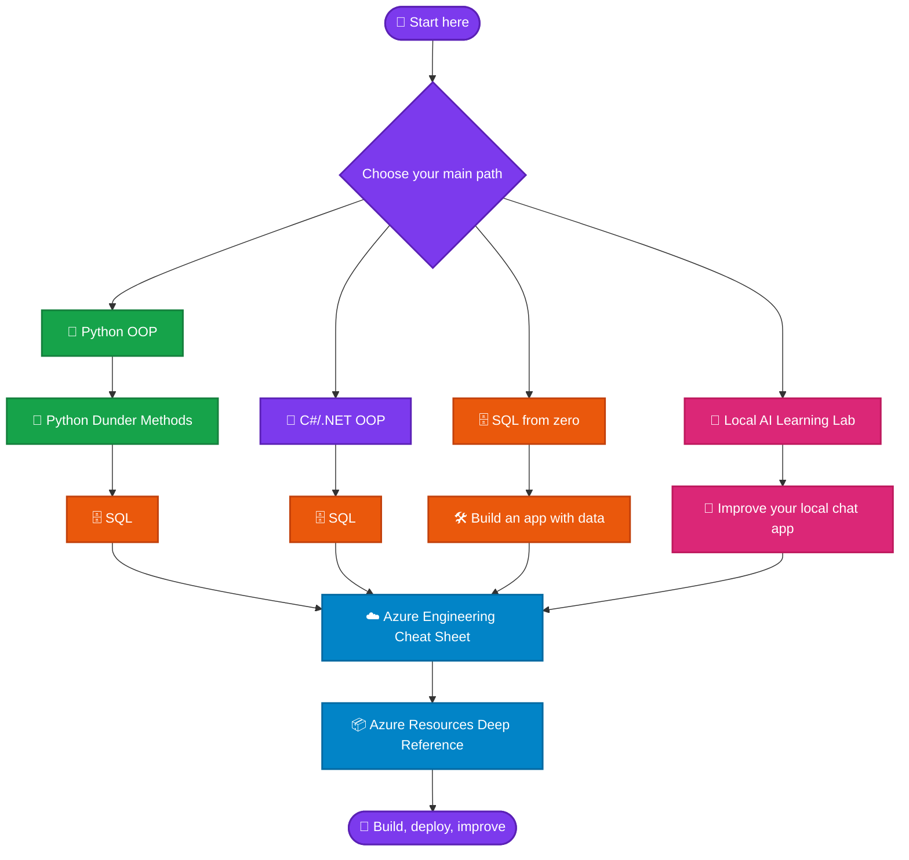

<div align="center">

# 🌈 Knowledge Base Learning Paths

### **Build real skills, one practical guide at a time.**

[](#-the-learning-loop)
[](#-choose-your-starting-path)
[](#-your-study-rhythm)

**🐍 Python · 💜 C#/.NET · 🗄️ SQL · 🤖 Local AI · ☁️ Azure**

</div>

---

> [!TIP]
> **Your rule for success:** do not read these guides like a book. Read a small section, type the example, run it, break it safely, fix it, and explain it in your own words. That is how knowledge becomes skill. 💪

## 📚 Table of contents

- [🧭 Choose your starting path](#-choose-your-starting-path)
- [🗺️ The complete study map](#️-the-complete-study-map)
- [📚 Guide shelf](#-guide-shelf)
- [🔁 The learning loop](#-the-learning-loop)
- [📅 Your study rhythm](#-your-study-rhythm)

## 🧭 Choose your starting path

| If you want to… | Start here | Then continue with… |
|---|---|---|
| 🐣 Learn programming and software design with Python | [🐍 Python OOP](python_oop_guide.md) | [📖 Python Dunder Methods](python_dunder.md) → [🗄️ SQL](sql_complete_guide.md) |
| 💜 Learn object-oriented development with C# and .NET | [🏛️ C#/.NET OOP](csharp_dotnet_oop_guide.md) | [🗄️ SQL](sql_complete_guide.md) → [☁️ Azure](azure_cheatsheet.md) |
| 🗄️ Learn databases from zero | [🗄️ Complete SQL Guide](sql_complete_guide.md) | Return to your Python or .NET path and build an app that uses a database |
| 🤖 Build your first local AI chat app | [🚀 Local AI Learning Lab](local_ai_learning_lab.md) | Improve the app with your Python or .NET skills, then explore Azure when you need cloud services |
| ☁️ Learn Azure for real engineering work | [☁️ Azure Engineering Cheat Sheet](azure_cheatsheet.md) | [📦 Azure Resources Deep Reference](azure_resources_cheatsheet.md) |
| 🐳 Learn Docker containers | [🐳 Docker Command Cheat Sheet](docker_cheatsheet.md) | Build images → Compose → persistent volumes and networking |
| 🦭 Learn rootless containers and pods | [🦭 Podman Command Cheat Sheet](podman_cheatsheet.md) | Rootless containers → pods → Quadlet/systemd integration |
| 🌿 Learn version control and releases | [🌿 Git Command Cheat Sheet](git_cheatsheet.md) | Feature branch → review changes → tag a release |
| 🧑‍💻 Already write code but want stronger foundations | Pick **one** language path: [Python](python_oop_guide.md) or [C#/.NET](csharp_dotnet_oop_guide.md) | [SQL](sql_complete_guide.md) → [Azure](azure_cheatsheet.md) |

---

## 🗺️ The complete study map



---

## 🐣 Path 1 — Python builder journey

**Best for:** beginners, automation enthusiasts, aspiring backend developers, and learners who want a friendly first programming language.

1. **Start:** [🐍 Complete Object-Oriented Programming with Python](python_oop_guide.md)  
   Learn classes, objects, encapsulation, inheritance, composition, typing, testing, and professional design. Work through the guide in order—its seven-step read → type → run → break → fix → modify → test loop is your foundation.

2. **Go deeper:** [📖 Python Dunder Methods](python_dunder.md)  
   Start with the core object model, then study construction, representations, comparisons, operators, containers, iteration, context managers, and async behavior. This is a **reference after OOP**, not your first Python lesson.

3. **Add data:** [🗄️ Complete SQL Guide](sql_complete_guide.md)  
   Learn to model, query, join, protect, and tune relational data. Begin with Chapters 1–4, then reach `SELECT`, filtering, grouping, and joins before moving to performance and administration.

4. **Build:** create a small Python application with a class-based domain model and a database-backed feature: a task tracker, book library, expense tracker, or inventory tool. 🎯

---

## 💜 Path 2 — C#/.NET builder journey

**Best for:** learners targeting the .NET ecosystem, Windows development, APIs, enterprise applications, and strongly typed OOP.

1. **Start:** [🏛️ Complete OOP with C# and .NET](csharp_dotnet_oop_guide.md)  
   Follow the course from basic classes through modern C#, SOLID, dependency injection, testing, design patterns, and refactoring. Aim for one or two chapters per day.

2. **Add data:** [🗄️ Complete SQL Guide](sql_complete_guide.md)  
   Learn relational modelling and queries, then focus on parameterization, transactions, migrations, and application-to-database patterns.

3. **Prepare for cloud:** [☁️ Azure Engineering Cheat Sheet](azure_cheatsheet.md)  
   Learn Azure's mental model first: identity, networking, compute, storage, databases, observability, security, cost, and infrastructure as code.

4. **Build:** create a small .NET console app or API with a clear domain model, SQL storage, tests, and a deployment plan. 🚀

---

## 🗄️ Path 3 — Database and SQL journey

**Best for:** analysts, backend developers, future DBAs, and anyone who wants to make better data decisions.

1. **Start at the beginning:** [🗄️ Complete SQL Guide](sql_complete_guide.md)  
   Complete Chapters 1–4 first: database vocabulary, choosing SQL Server or MySQL, installation, and the practice database.

2. **Learn the daily essentials:** focus next on `SELECT`, filters, sorting, inserts/updates/deletes, functions, grouping, and **joins**.

3. **Become production-aware:** move on to transactions, indexes, execution plans, normalization, permissions, backups, and application integration.

4. **Build:** design a database for an online shop, booking system, or school library. Write queries that answer real questions—not just syntax exercises. 📊

> [!TIP]
> New to databases? Choose **one engine** first. SQL Server is a natural Windows/.NET choice; MySQL is a common web-development choice. You can learn the other later.

---

## 🤖 Path 4 — Local AI builder journey

**Best for:** developers who want a hands-on, local-first introduction to an AI application.

1. **Start:** [🚀 Local AI Learning Lab](local_ai_learning_lab.md)  
   Use Ollama, Qwen, Python, and Streamlit to build a browser chat app on Windows. Follow the essential path exactly: prepare → install → verify a model → install packages → create the app → verify it.

2. **Understand the boundaries:** this lab teaches a local chat application. It is not a database course, autonomous agent system, or cloud deployment tutorial—and that is a strength. Master one working thing first. ✅

3. **Extend it:** add one small, observable improvement at a time: clearer system prompts, saved chat history, input validation, a better UI, or a simple data-backed feature after learning SQL.

4. **Go cloud-aware:** use the Azure path when you need to understand identity, hosting, monitoring, security, and cost before moving a project beyond your machine.

---

## ☁️ Path 5 — Azure engineering journey

**Best for:** developers and platform-minded engineers who need to choose, operate, and troubleshoot Azure services responsibly.

1. **Start with the map:** [☁️ Azure Engineering Cheat Sheet](azure_cheatsheet.md)  
   This is an intermediate-to-advanced decision guide. Learn the Azure hierarchy, then work through identity, networking, compute, storage, data, operations, security, reliability, governance, cost, and delivery.

2. **Choose before you create:** use its comparison tables to understand the trade-offs between services. Always verify current pricing, quotas, regional availability, SKUs, and support status in Microsoft documentation before production decisions. 🔎

3. **Go resource by resource:** [📦 Azure Resources Deep Reference](azure_resources_cheatsheet.md)  
   Use this after the cheat sheet when you need implementation detail: resource internals, identity, networking, scaling, monitoring, security, costs, CLI, Bicep, and C# examples.

4. **Build:** design a small architecture on paper first, then implement it with least-privilege identity, monitoring, backups, cost awareness, and infrastructure as code. 🏗️

---

## 📚 Guide shelf

| Guide | Level | Use it when you need… | Read it after… |
|---|:---:|---|---|
| **☁️ Cloud & Azure** |  |  |  |
| [☁️ Azure Engineering Cheat Sheet](azure_cheatsheet.md) | 🟡 → 🔴 | cloud architecture decisions and production concerns | basic application-development experience |
| [📦 Azure Resources Deep Reference](azure_resources_cheatsheet.md) | 🟡 → 🔴 | detailed Azure resource implementation and operations | Azure Engineering Cheat Sheet |
| **🐳 Containers & DevOps** |  |  |  |
| [🐳 Docker Command Cheat Sheet](docker_cheatsheet.md) | 🟢 → 🔴 | Docker CLI, Dockerfiles, Compose, Buildx, storage, and Swarm | basic command-line familiarity |
| [🦭 Podman Command Cheat Sheet](podman_cheatsheet.md) | 🟢 → 🔴 | rootless containers, pods, Quadlet, Kubernetes YAML, and machine management | basic command-line familiarity |
| **🌿 Version Control** |  |  |  |
| [🌿 Git Command Cheat Sheet](git_cheatsheet.md) | 🟢 → 🔴 | branches, collaboration, recovery, releases, and repository maintenance | no Git background required |
| **💻 Programming & .NET** |  |  |  |
| [💜 C#/.NET OOP](csharp_dotnet_oop_guide.md) | 🟢 → 🟡 | modern C# design, SOLID, DI, testing, and patterns | no OOP background required |
| **🐍 Python** |  |  |  |
| [🐍 Python OOP](python_oop_guide.md) | 🟢 → 🟡 | a complete software-design foundation in Python | no programming background required |
| [📖 Python Dunder Methods](python_dunder.md) | 🟡 → 🔴 | Python's object model, special methods, and advanced protocols | Python OOP fundamentals |
| **🗄️ Databases** |  |  |  |
| [🗄️ Complete SQL Guide](sql_complete_guide.md) | 🟢 → 🔴 | database design, queries, transactions, performance, and security | no database background required |
| **🤖 AI & Learning Resources** |  |  |  |
| [🤖 Local AI Learning Lab](local_ai_learning_lab.md) | 🟢 | a verified local chat app using Ollama, Python, and Streamlit | basic PowerShell and Python installation |

---

## 🔁 The learning loop

Use this loop for every chapter, lesson, and lab:

```text
📖 Read one small idea
        ↓
⌨️ Type the example yourself
        ↓
▶️ Run it and observe the result
        ↓
🧨 Change one thing and let it fail safely
        ↓
🛠️ Fix it using the error and the guide
        ↓
✨ Adapt it into your own tiny feature
        ↓
✅ Explain what you learned without looking
```

> [!IMPORTANT]
> **Do not skip the “run it” step.** Understanding a paragraph feels good; making a program work, fail, and recover builds durable engineering judgment.

---

## 📅 Your study rhythm

| Pace | Practical plan |
|---|---|
| 🌱 **30 minutes/day** | One concept, one runnable example, one note in your own words |
| 🔥 **60–90 minutes/day** | One focused section plus its exercise or checkpoint |
| 🚀 **Weekend project** | Finish a milestone, then make one small project feature without copying the example |

### ✅ Before moving to the next topic

- [ ] I can explain the concept in plain language.
- [ ] I typed and ran at least one example myself.
- [ ] I saw a failure or edge case and understood the fix.
- [ ] I changed the example for a problem I care about.
- [ ] I know what guide comes next on my chosen path.

---

<div align="center">

## 🌟 Start small. Stay curious. Build every day.

**Choose one path above, open its first guide, and run your first example today.**

</div>
