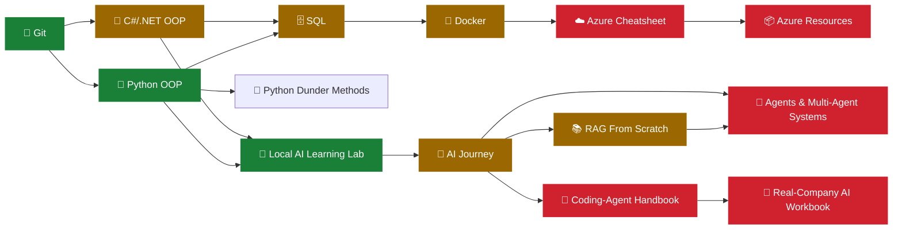

<div align="center">

# 📚 Knowledge Base

### *Thirteen core engineering guides plus a 30+ topic AI/LLM/agent curriculum — local and cloud LLMs, prompting, RAG, tool calling, agents, MCP, coding-assistant vendor tracks, and production AI (evaluation, observability, security, cost)*

**_By Gehan Fernando_**

🛠️ **~90% practical** · 🧠 **~10% theory** · 🌱 **Beginner → 🚀 Advanced** · 💜 C#/.NET · 🐍 Python · 🗄️ SQL · 🤖 AI/LLMs/RAG/Agents

</div>

---

> [!NOTE]
> **👥 Who this is for:** self-learners, students, software engineers, senior developers, cloud/platform engineers, and anyone who wants practical references they can keep returning to.
> **🎯 The promise:** concepts are explained in plain language first, then connected to runnable code, hands-on labs, engineering trade-offs, troubleshooting, or authoritative documentation.
> **📏 How to use it:** treat these as **lab manuals and engineering references, not novels**. Read enough to understand the idea, then type, run, build, break, verify, and apply it.

---

## 🧑‍🎓 New here? Pick your starting point

| You are… | Start here |
|---|---|
| 👶 **Completely new to programming** | **[Git](git_practical_guide.md)** (version control first) → **[Python OOP §1–12](python_oop_guide.md)** (gentlest language on-ramp) |
| 💻 **Experienced developer, new to this repo** | **[Git](git_practical_guide.md)** refresher (skip if fluent) → pick your language/subject track below |
| 💜 **C# / .NET developer** | **[Complete OOP with C# and .NET](csharp_dotnet_oop_guide.md)** → [SQL](sql_complete_guide.md) → [Azure](azure_cheatsheet.md) → [AI Journey](ai_journey.md) |
| 🐍 **Python developer** | **[Complete OOP with Python](python_oop_guide.md)** → [Python Dunder Methods](python_dunder.md) → [SQL](sql_complete_guide.md) → [Local AI Lab](local_ai_learning_lab.md) |
| 🗄️ **Database-focused learner** | **[The Complete SQL Guide](sql_complete_guide.md)** — works with SQL Server or MySQL, no programming background required |
| 🤖 **Developer new to AI** | **[Local AI Learning Lab](local_ai_learning_lab.md)** (get one local model working) → **[AI Journey](ai_journey.md)** (build real AI features) |
| 📚 **Want to understand RAG from first principles** | **[RAG From Scratch](rag_embeddings_lab.md)** — chunk, embed, store, retrieve, cite, evaluate, yourself, before any framework |
| 🤖 **Want to build agents, not just configure one** | **[Building Agents & Multi-Agent Systems](agents_and_subagents_lab.md)** — single tool → orchestrator → sub-agents, fully local |
| 🧭 **Want the full AI curriculum map (30+ topics)** | **[🧭 AI Engineering Curriculum — Master Guide](ai_master_guide.md)** — every AI/LLM/agent file in this repo, grouped and in reading order |
| 🐳 **Need Docker/containers** | **[Docker: Learn Containers by Doing](docker_practical_guide.md)** |
| ☁️ **Need Azure for real work** | **[Azure Engineering Cheatsheet](azure_cheatsheet.md)** (what/why) → **[Azure Resources Cheatsheet](azure_resources_cheatsheet.md)** (how, with CLI/Bicep/C#) |
| 🧑‍💻 **Configuring an AI coding assistant (Copilot/Codex/Claude)** | **[AI Coding-Agent Configuration Handbook](deep-research-report.md)** → **[Real-Company AI Engineering Workbook](end_to_end_ai_agent_graphql_workflow.md)** |

Full details, prerequisites, and reasoning for each route are in [🧭 Which guide should I read first?](#-which-guide-should-i-read-first) below.

---

## 🗺️ Repository roadmap



🟢 beginner-friendly start · 🟡 intermediate · 🔴 advanced/assumes prior guides — matches the **🏷️ Difficulty** badge at the top of each file.

---

## 📖 What is in this collection

| Guide | What it teaches | Scope | Start here if… |
|---|---|:---:|---|
| **[🚀 Local AI Learning Lab](local_ai_learning_lab.md)** | Build and verify a local AI environment with Qwen3.5 9B, Ollama, Python, and Streamlit; get one local chat app working; learn model/runtime/profile boundaries, bounded session history, verification, and optional profile/lifecycle reference | Beginner-friendly hands-on lab | You want to learn modern AI engineering locally, one validated command and concept at a time |
| **[🌈 AI Journey](ai_journey.md)** | Build AI application capabilities progressively: a local C# model call, structured output, guarded tools, retrieval, evaluation, and optional cloud/MCP/agent branches | Practical course | You are a developer who wants to build and verify AI features rather than study AI theory alone |
| **[🤖 Coding-Agent Handbook](deep-research-report.md)** | Choose one product—GitHub Copilot, Codex, or Claude Code—complete a safe read-only task, then use product-specific references for instructions, skills, agents, hooks, and MCP | Practical handbook and runbook | You need to configure and verify one coding assistant in a real project |
| **[☁️ Azure Complete Engineering Cheatsheet](azure_cheatsheet.md)** | Azure architecture, identity, networking, compute, data, integration, AI, security, observability, IaC, DevOps, governance, cost, resilience, and production operations | 24 numbered sections + reference map | You need the big-picture Azure engineering map: what exists, how it fits together, and how to choose between services |
| **[📦 Azure Resources Cheatsheet](azure_resources_cheatsheet.md)** | Resource-by-resource deep dive: Compute, networking, storage, databases, messaging, identity, monitoring, DevOps, AI — each with CLI, Bicep, and C# examples, comparison tables, and end-to-end deployment scenarios | Sections 0–77 across 18 subject parts | You already know the Azure big picture and need to create, configure, secure, or troubleshoot one specific resource |
| **[🏛️ Complete OOP with C# and .NET](csharp_dotnet_oop_guide.md)** | Object-oriented programming from first principles through modern C#, SOLID, DI, testing, design patterns, and professional design | 50 chapters | You work with C#/.NET or want a rigorous OOP path in the .NET ecosystem |
| **[🐍 Complete OOP with Python](python_oop_guide.md)** | Python OOP from first class/object concepts through protocols, typing, SOLID, DI, testing, packaging, and professional design | 39 sections | You want to learn software design with Python or translate OOP knowledge into Pythonic practice |
| **[📖 The Complete Bible of Python Dunder Methods](python_dunder.md)** | Python special methods and attributes: object creation, operators, iteration, context managers, descriptors, async, metaclasses, introspection, and more | 145 entries | You already understand Python classes and want to know how Python's object model really works |
| **[🗄️ The Complete SQL Guide — MSSQL & MySQL](sql_complete_guide.md)** | SQL and relational databases from zero through querying, transactions, performance, design, security, administration, and application integration | 66 chapters | You want to learn databases from scratch or deepen production SQL knowledge in SQL Server and MySQL |
| **[🌿 Git: Learn Version Control by Doing](git_practical_guide.md)** | Git from `git init` through branching, real merge conflicts, safe-vs-destructive undo, remotes, and the pull-request workflow | 10 hands-on sections | You cannot yet explain staging vs. committing, or want to practice resolving a real conflict |
| **[🐳 Docker: Learn Containers by Doing](docker_practical_guide.md)** | Containers from `docker run` through building images, volumes, networking two containers, Compose, and containerizing a .NET app | 10 hands-on sections | You want to run, build, and debug containers instead of reading container theory |
| **[📚 RAG From Scratch: Embeddings & Retrieval Lab](rag_embeddings_lab.md)** | Build embeddings-based RAG yourself, lab by lab: chunk → embed → compare similarity → store → retrieve → answer → cite → evaluate | 10 local-first labs | You want to understand *how* RAG works before using a framework or vector database |
| **[🤖 Building Agents & Multi-Agent Systems](agents_and_subagents_lab.md)** | Build your own application agents locally: single tool → multi-tool routing → state → human approval gates → an orchestrator with specialist sub-agents → tracing | 7 hands-on labs | You want to build an agent loop yourself, not just configure a coding assistant |

> [!TIP]
> **Local-first AI entry point:** **[🚀 Local AI Learning Lab](local_ai_learning_lab.md)** is the quickest hands-on way to start the AI material. It builds one local Qwen/Ollama/Python/Streamlit environment, explains 32K vs 64K context, and links to the AI application course and the separate coding-agent handbook.

> [!TIP]
> **Full AI curriculum map:** this repository also includes 19 additional focused AI guides — cloud LLMs, prompting/structured output/streaming, a full RAG project, MCP, parallel agents, memory/state, instructions/skills, per-vendor coding-agent tracks (Codex, Claude Code, GitHub Copilot, VS Code), evaluation, observability, security, and cost/performance. Start at **[🧭 AI Engineering Curriculum — Master Guide](ai_master_guide.md)** to see all of them grouped in the order you should read them.

> **Practical companion:** **[🧪 Real-Company AI Engineering Workbook](end_to_end_ai_agent_graphql_workflow.md)** teaches how to choose and use ordinary prompts, task briefs, instructions, reusable prompts, skills, agents, subagents, parallel work, hooks, MCP, deterministic code, RAG, and CI in realistic situations. It has separate brand-new-project and existing-project workflows, plus bug fixes, feature work, code review, incidents, security-sensitive work, releases, and legacy maintenance. Follow it after the **AI Coding-Agent Configuration Handbook** to apply product-specific mechanics to company work. Adapt any user-scope instruction templates you maintain separately to the selected product and repository rather than assuming one format works everywhere.

---

## 🧭 Which guide should I read first?

### I want to start AI locally and learn by building
Start with **[Local AI Learning Lab](local_ai_learning_lab.md)**, then continue with **[AI Journey](ai_journey.md)**.

The Local AI Learning Lab is the shortest hands-on entry point into this repository's AI material. It walks through a local Qwen3.5 9B + Ollama + Python + Streamlit setup, verifies the local chat application, and then links to AI Journey's local C# bridge. Coding-assistant setup is a separate route in the handbook. It is intentionally command-driven and beginner-friendly.

### I am a developer and want to build practical AI features
Start with **[AI Journey](ai_journey.md)**.

It is designed for developers who are new to modern AI engineering. Start with a local C# model call if you have Ollama, or choose the optional cloud route if you have approved provider access. Then progress through structured output, guarded tools, retrieval, evaluation, security, and production engineering. MCP, coding-agent configuration, Python SDKs, and agent frameworks are optional branches rather than prerequisites.

If you want a smaller first step before the full course, complete the **[Local AI Learning Lab](local_ai_learning_lab.md)** first. It focuses specifically on getting one local model running correctly and understanding the surrounding runtime, context, chat state, and coding-agent integrations.

### I need to configure and use coding agents in a real repository
Start with the **[AI Coding-Agent Configuration Handbook](deep-research-report.md)**, then use the **[Real-Company AI Engineering Workbook](end_to_end_ai_agent_graphql_workflow.md)**.

The handbook explains the actual product differences and teaches discovery, setup, invocation, verification, and troubleshooting. The workbook then guides decisions across new and existing projects and realistic engineering tasks. Use the exact product-specific instructions; do not copy a configuration from one harness and assume another will load it.

### I need Azure for real engineering work
Use **[Azure Complete Engineering Cheatsheet](azure_cheatsheet.md)** first, then **[Azure Resources Cheatsheet](azure_resources_cheatsheet.md)**.

The first is less like a beginner programming course and more like an engineering map of Azure: what the major services are, how they fit together, how to choose between them, what production concerns matter, and where to verify changing platform details. The second goes one level deeper — once you know *which* resource you need, it shows how to actually create, configure, secure, and script that resource with the CLI, Bicep, and C#.

### I work mainly with C#/.NET
Start with **[Complete OOP with C# and .NET](csharp_dotnet_oop_guide.md)**.

It teaches OOP and modern C# together, then moves into professional design, SOLID, dependency injection, testing, patterns, and refactoring.

### I want to learn programming/OOP through Python
Start with **[Complete OOP with Python](python_oop_guide.md)**.

If you have never programmed before, begin with Sections 1–12. They give you a useful foundation without requiring you to finish the entire guide first.

### I already understand Python classes and want to go deeper
Read **[The Complete Bible of Python Dunder Methods](python_dunder.md)** after the early Python OOP material.

Its intended prerequisite is roughly Sections 1–6 of the Python OOP guide. From there it explains how Python connects your objects to syntax such as `+`, `len()`, `for`, `with`, comparisons, attribute access, async operations, and introspection.

### I want to learn databases or improve SQL
Use **[The Complete SQL Guide](sql_complete_guide.md)**.

It starts from first principles and does not require a programming background. You can learn with either SQL Server or MySQL; every major topic is shown for both engines.

### I don't know Git yet and need to before anything else
Start with **[Git: Learn Version Control by Doing](git_practical_guide.md)**.

You need `git status`/`git diff` fluency before any of the AI guides' "inspect what the assistant changed" steps make sense, and before the pull-request workflow used in the company workbook.

### I want to run and build containers
Start with **[Docker: Learn Containers by Doing](docker_practical_guide.md)**.

It goes from `docker run hello-world` to a containerized SQL Server, a containerized Python app, a containerized .NET app, and Docker Compose — no prior container knowledge assumed.

### I want to understand how RAG actually works, not just use a framework
Start with **[RAG From Scratch: Embeddings & Retrieval Lab](rag_embeddings_lab.md)** after the Local AI Learning Lab.

It builds the entire embeddings pipeline — chunking, embedding, similarity, storage, retrieval, citations, evaluation — yourself in plain Python before AI Journey's framework/cloud continuation.

### I want to build my own agents, not configure a coding assistant
Start with **[Building Agents & Multi-Agent Systems](agents_and_subagents_lab.md)** after the Local AI Learning Lab.

It is explicitly distinct from the coding-agent handbook: you build an orchestrator and specialist sub-agents yourself, locally, with full traceability.

---

## 🗺️ Suggested learning paths

### .NET engineer → AI / cloud engineer

```text
C# / .NET OOP
      │
      ├──────────────► SQL
      │                 │
      ├──────────────► Azure
      │                 │
      └──────────────► AI Journey
                        │
                        ├─ LLM apps
                        ├─ tool calling
                        ├─ MCP
                        ├─ agents
                        ├─ RAG
                        └─ production AI
```

A practical order is:

1. **[Git](git_practical_guide.md)** — version control is a prerequisite for everything else here, not an optional extra.
2. **[C# / .NET OOP](csharp_dotnet_oop_guide.md)** — strengthen language and design fundamentals if needed.
3. **[SQL](sql_complete_guide.md)** — understand persistent data, transactions, indexing, and application/database boundaries.
4. **[Docker](docker_practical_guide.md)** — containerize what you build; the SQL Server and .NET console examples reuse this path's earlier guides.
5. **[Azure](azure_cheatsheet.md)** — learn the cloud platform, identity, networking, deployment, observability, security, and operations.
6. **[Local AI Learning Lab](local_ai_learning_lab.md)** — get a local LLM running, understand context and chat state, and build a working Python/Streamlit assistant before adding agentic features.
7. **[AI Journey](ai_journey.md)** — build modern AI engineering skills on top of your existing software background.
8. **[RAG From Scratch](rag_embeddings_lab.md)** and **[Building Agents & Multi-Agent Systems](agents_and_subagents_lab.md)** — once AI Journey's model-call and tool-calling basics are working, build the embeddings/retrieval pipeline and your own agent loop by hand before adopting a framework.

You do **not** need to finish the first three before starting AI. If your software fundamentals are already strong, begin with the **Local AI Learning Lab** for the fastest hands-on start, then move into **AI Journey**. Use the other guides as references when a task needs deeper language, database, or cloud knowledge.

### Python engineering path

```text
Git
 │
 └──────────► Python OOP
                │
                ├──────────► Python Dunder Methods
                │
                ├──────────► SQL
                │
                ├──────────► Docker
                │
                └──────────► Local AI Learning Lab
                                │
                                ├──────────► AI Journey
                                ├──────────► RAG From Scratch (embeddings lab)
                                └──────────► Building Agents & Multi-Agent Systems
```

### Database-first path

```text
SQL fundamentals
      │
      ├─ application integration
      ├─ performance and indexing
      ├─ transactions and concurrency
      ├─ Docker (run a disposable SQL Server container)
      └─ cloud data services in Azure
```

---

## 🔗 How the guides relate to each other

- **The C# and Python OOP guides teach many of the same design ideas in different languages.** Encapsulation, inheritance, polymorphism, abstraction, interfaces/protocols, SOLID, dependency injection, testing, patterns, and domain modelling appear in both.
- **The Python dunder guide is the deep companion to Python OOP.** The OOP guide introduces special methods as part of normal Python design; the dunder guide explores the object model and Python's protocol hooks in depth.
- **The SQL guide is language-independent.** It connects back to application design through repositories, Unit of Work, transactions, migrations, concurrency, and calling SQL from application code.
- **The Azure guide provides the platform layer.** Its compute, networking, identity, data, messaging, observability, security, IaC, and deployment sections connect directly to real .NET/Python application architecture.
- **The Azure Resources Cheatsheet is the deep companion to the Azure guide.** The Azure guide gives the architecture-level map and decision criteria; the Resources cheatsheet gives the per-resource CLI/Bicep/C# mechanics once you have already decided what to build.
- **The Local AI Learning Lab is the hands-on entry point to the AI material.** It focuses on one verified local stack—Qwen3.5 9B, Ollama, Python, and Streamlit—explains context and browser session history; AI Journey separately teaches tools, retrieval, agent loops, and later production concerns.
- **AI Journey teaches building AI-enabled software; it does not replace normal software engineering.** Its labs use deterministic code, tests, authorization, evaluation, and operational controls alongside model capabilities.
- **Azure and AI Journey overlap intentionally around enterprise AI.** Azure covers the platform/service-selection view; AI Journey covers the developer learning path and hands-on AI engineering workflow.
- **The AI Coding-Agent Configuration Handbook is complementary to AI Journey.** The course teaches you to *build* AI-powered applications; the handbook teaches you to *configure and operate* Copilot, Copilot CLI, Codex, Claude Code, and VS Code in product-specific ways.
- **The Real-Company AI Engineering Workbook applies the handbook to decisions at work.** It covers new and ongoing projects, branches, feature development, bugs, reviews, incidents, security work, releases, and maintenance; its scenarios show when to use a customization and when ordinary code or CI is the better choice.
- **Git is the prerequisite underneath every other guide.** The coding-agent handbook and company workbook assume you can read `git status`/`git diff`; the dedicated [Git guide](git_practical_guide.md) is where that fluency actually comes from.
- **Docker is the deployment companion to SQL, C#/.NET, Python, and Azure.** The [Docker guide](docker_practical_guide.md) containerizes a SQL Server instance, a Python app, and a .NET console app using nothing from the other guides except what they already taught; Azure Container Apps is its natural cloud continuation.
- **The RAG & Embeddings Lab and the Agents lab are the hands-on prerequisites AI Journey intentionally defers.** AI Journey's RAG section starts with keyword search and its agent section uses a single cloud-only lab; [RAG From Scratch](rag_embeddings_lab.md) and [Building Agents & Multi-Agent Systems](agents_and_subagents_lab.md) build the local, from-first-principles version of each before you adopt a managed framework.

### Where important ideas cross between guides

| Idea | Python OOP | C# / .NET | SQL | Azure | AI Journey |
|---|---|---|---|---|---|
| Encapsulation / abstraction | [§3](python_oop_guide.md#3-the-four-pillars-of-oop) | [Ch 4](csharp_dotnet_oop_guide.md#4--the-four-pillars-of-oop) | — | Service boundaries and platform abstractions | Agent/tool boundaries and structured contracts |
| Interfaces / contracts | [§13](python_oop_guide.md#13-protocols-and-interfaces) | [Ch 17](csharp_dotnet_oop_guide.md#17--interfaces) | Schema/contracts | APIs, messaging, identity contracts | Structured output, tools, MCP |
| Dependency injection | [§28](python_oop_guide.md#28-dependency-injection) | [Ch 39](csharp_dotnet_oop_guide.md#39--dependency-injection) | — | .NET/Azure application patterns | Provider-neutral abstractions and AI application composition |
| Repository / data access | [§29.3](python_oop_guide.md#293--repository) | [Ch 40](csharp_dotnet_oop_guide.md#40--design-patterns-for-c-oop) | [Ch 65](sql_complete_guide.md#65-sql-from-the-application-layer) | Azure data services | RAG data/retrieval pipelines ([hands-on lab](rag_embeddings_lab.md)) |
| Transactions / concurrency | [§29.4](python_oop_guide.md#294--unit-of-work) | [Ch 40](csharp_dotnet_oop_guide.md#40--design-patterns-for-c-oop) | [Ch 42](sql_complete_guide.md#42-transactions-and-acid) | Resilience and distributed systems | Reliable tool/workflow execution |
| Special methods / operators | [§25](python_oop_guide.md#25-special-methods-operators-nested-classes-and-code-organization) | [Ch 32](csharp_dotnet_oop_guide.md#32--indexers-operators-tuples-and-everyday-essentials) | — | — | — |
| Security | Validation and safe object design | Type safety, validation, secure design | Permissions, injection, backup | Identity, RBAC, network/security services | Prompt injection, approvals, tool security, supply chain |
| Observability | Testing/logging concepts | Testing and .NET practices | Monitoring and performance | Azure Monitor, App Insights, Log Analytics | Evals, traces, telemetry, AI observability |
| Production engineering | Project structure/testing | Design, testing, refactoring | Performance/admin/CI | Architecture, deployment, governance, resilience | Reliability, cost, rate limits, deployment, long-running work |
| Orchestration / agents | — | — | — | — | Agent-vs-workflow (§8); hands-on build in [Agents lab](agents_and_subagents_lab.md) |
| Version control / containers | — | — | — | Container Apps, Container Registry | — ([Git guide](git_practical_guide.md), [Docker guide](docker_practical_guide.md)) |

---

## 🧰 What you need installed

Each guide contains its own setup or prerequisite section. You do not need every tool below to use the repository.

| Guide | Typical requirements |
|---|---|
| **Local AI Learning Lab** | Windows or another Ollama-supported OS, Ollama, Python 3.10+ (the walkthrough uses Python 3.12), and VS Code or another editor; Streamlit and the Ollama Python package are installed during the lab; Codex/Claude Code are optional later integrations |
| **AI Journey** | .NET, Python, Git, VS Code and/or Visual Studio; provider/API access is introduced where needed |
| **AI Coding-Agent Configuration Handbook** | Git and a terminal; install or enable only the CLI/extension and account access for the product you choose, following its current official setup instructions |
| **Azure** / **Azure Resources Cheatsheet** | No single mandatory local setup for reading; Azure CLI/PowerShell, Bicep/Terraform, SDKs, and cloud access are used in relevant sections |
| **C# / .NET OOP** | .NET SDK and an editor/IDE |
| **Python OOP** | Python 3.11+; optional `pytest`, `mypy`/`pyright`, `ruff`, environments/tooling as introduced |
| **Python dunder** | Python 3.12+ for the full set of examples and version-specific entries |
| **SQL** | SQL Server 2019+ **or** MySQL 8.4 LTS; one engine is enough to begin |
| **Git guide** | Git installed (`git --version`); a free GitHub account for the remote/pull-request sections |
| **Docker guide** | Docker Desktop (WSL2 backend on Windows); Python and .NET examples reuse the SDKs from their respective guides |
| **RAG & Embeddings Lab** | Completed Local AI Learning Lab setup (Ollama), plus `pip install ollama numpy` |
| **Agents & Multi-Agent Lab** | Completed Local AI Learning Lab setup (Ollama); plain `pip install ollama` |

> [!TIP]
> Install only what the section you are working through requires. A smaller learning environment is easier to troubleshoot. The **Local AI Learning Lab** deliberately starts with only Ollama, one Qwen model, Python, and Streamlit; Codex, Claude Code, RAG infrastructure, memory stores, and MCP come later. The AI course's local examples can also be practiced independently of any specific coding-agent CLI. For harness-specific steps, use the product's current official setup and verify command results in your own environment.

---

## 🧪 How the repository teaches

Although the guides cover different subjects, they share the same practical philosophy:

```text
Understand the idea
      ↓
See a concrete example
      ↓
Run / build it yourself
      ↓
Break or vary it
      ↓
Verify what happened
      ↓
Explain when to use it — and when not to
```

The **Local AI Learning Lab** applies the same philosophy even more literally: each setup stage gives one command, an expected result, a verification command, and a troubleshooting path before moving to the next stage.

The **AI Journey** expresses this explicitly as:

```text
Real problem → smallest useful mechanism → build → run → inspect evidence
→ break → repair → decide whether it belongs in production
```

The OOP and SQL guides use exercises, checkpoints, examples, deliberate failures, expected output, and larger practical blocks. The Azure guide is more reference-oriented and adds service-selection guidance, architecture patterns, operational checklists, troubleshooting, and links to Microsoft documentation.

---

## 💻 How to use the code examples

Most examples are embedded directly in the Markdown files.

Common conventions in the programming/database guides include:

| Marker | Meaning | What to do |
|---|---|---|
| *(no marker)* | Complete/self-contained example | Put it in the appropriate file or tool and run it |
| **▶️ Continues…** | Depends on an earlier example | Keep the referenced earlier code with it |
| **📄 Fragment** | Part of a larger/multi-file example | Read it in context; it is not intended to run alone |
| **❌ Fails on purpose** | Deliberately invalid example | Study the shown failure and why it happens |

Where output matters, the guides show expected output or describe the expected result.

For the **Local AI Learning Lab**, command accuracy is part of the lesson. For example, the Streamlit application must be started with `python -m streamlit run main.py`, not `python main.py`; the lab explains why and provides a verification sequence.

---

## ✅ Verification and freshness

These documents try to distinguish **tested facts**, **reviewed material**, and **version-sensitive platform information** instead of treating every statement as equally permanent.

- **[C# / .NET OOP](csharp_dotnet_oop_guide.md#-what-was-actually-verified-and-how)** documents the compiler/runtime environment used to check code blocks and explains which fragments were not executed.
- **[Python OOP](python_oop_guide.md#-how-to-run-the-examples-and-how-they-were-checked)** records the Python environment, code execution checks, type-checking scope, and version-dependent features.
- **[Python dunder](python_dunder.md#-how-these-examples-were-checked)** records the CPython version and how runnable examples were executed and compared with expected output.
- **[SQL](sql_complete_guide.md#-what-was-verified-and-what-was-not)** separates executed examples from material that requires environment-specific or administrative validation.
- **[Local AI Learning Lab](local_ai_learning_lab.md)** provides observable local setup/browser checkpoints and links to Ollama/Streamlit documentation. The coding-agent integrations belong in the separate handbook. Syntax checks alone do not validate live model behavior.
- **[AI Journey](ai_journey.md#course-validation)** states the scope of local deterministic checks, documentation review, and model/provider integrations that remain unexecuted.
- **[AI Coding-Agent Configuration Handbook](deep-research-report.md)** distinguishes commands or configuration that were executed, checked against official documentation, or syntax-reviewed. Check its verification legend and re-check version-sensitive product behavior before using it.
- **[Azure](azure_cheatsheet.md)** and **[Azure Resources Cheatsheet](azure_resources_cheatsheet.md)** are intentionally explicit that production-critical limits, quotas, pricing, SLA details, regional availability, API versions, preview status, and compliance requirements must be rechecked against current Microsoft documentation.
- **[Git guide](git_practical_guide.md)** and **[Docker guide](docker_practical_guide.md)** commands were run end-to-end in PowerShell on Windows; exact hashes/timestamps/image sizes will differ in your environment, but command behavior and output shape are stable.
- **[RAG & Embeddings Lab](rag_embeddings_lab.md)** and **[Agents & Multi-Agent Lab](agents_and_subagents_lab.md)** scripts were run locally against Ollama; exact similarity scores and model wording vary by embedding/model version, but relative ranking and control flow are stable and are what each lab asks you to verify.

> [!IMPORTANT]
> A successful example proves only what was actually tested in the stated environment. Cloud services, SDKs, AI products, model names, previews, quotas, pricing, platform limits, and documentation can change. For production decisions, verify current authoritative documentation.

---

## 🎓 Exercises, checkpoints, labs, and learning plans

Different guides use different mechanisms depending on the subject:

| Device | Where you will see it | Purpose |
|---|---|---|
| **🧪 Hands-on exercises / labs** | OOP, SQL, AI | Build the skill instead of only reading about it |
| **✅ Checkpoints / teach-back questions** | OOP, AI, SQL | Confirm you can explain the concept in your own words |
| **Expected result / output** | Programming, SQL, AI labs | Give you something concrete to verify |
| **Troubleshooting sections** | AI, Azure, programming guides | Teach how to recover when the happy path fails |
| **Learning plans** | AI, Azure, C#, Python, SQL | Turn a large reference into a manageable sequence |
| **Official documentation links** | Especially AI and Azure | Keep fast-changing platform details anchored to authoritative sources |

Useful built-in paths include:

- **Local AI Learning Lab:** one local chat app, then optional context/profile and lifecycle exercises; links to the application course for later capabilities.
- **AI Journey:** a complete **12-week execution plan**.
- **AI Coding-Agent Configuration Handbook:** choose-one-product routes and a reference for creation, discovery, invocation, verification, troubleshooting, and removal; project workflows live in the workbook.
- **Real-Company AI Engineering Workbook:** separate new-project and ongoing-project scenarios plus practical bug, feature, review, incident, security, release, and legacy workshops.
- **Azure:** service-choice tables, troubleshooting, production-readiness checks, and an official source map.
- **Azure Resources Cheatsheet:** resource cards covering contents, relationships, failure points, operational trade-offs, and authoritative documentation.
- **C# / .NET OOP:** a **30-day learning plan**.
- **SQL:** a roughly **35-day learning plan**.
- **Python OOP:** a staged five-part path from foundations to professional design and practice.
- **Python dunder:** a course path for the core parts plus a reference structure for later lookup.
- **Git guide:** a 10-section essential path ending in a real end-to-end mini project (version-control a script, resolve a real conflict, open a real pull request).
- **Docker guide:** a 10-section essential path ending in a containerized .NET console app and a side-by-side multi-stage vs. single-stage image-size challenge.
- **RAG & Embeddings Lab:** 10 sequential labs (load → chunk → embed → compare → store → retrieve → answer → cite → evaluate → experiment) ending in a local-document Q&A CLI mini project.
- **Agents & Multi-Agent Lab:** 7 sequential labs (single tool → routing → state → failure handling → human approval → orchestrator/sub-agents → tracing) ending in a multi-agent helpdesk triage mini project.

---

## 📌 A simple rule for using this repository

Do not try to memorize everything.

Use each guide to answer four questions:

```text
1. What problem does this solve?
2. Can I explain it simply?
3. Can I build or use a small example myself?
4. Do I know when NOT to use it?
```

If you can answer those, move forward. If not, run another example, break something deliberately, or revisit the relevant section.

---

<div align="center">

**Learn the fundamentals. Build real things. Verify your assumptions. Keep the references.**

</div>
