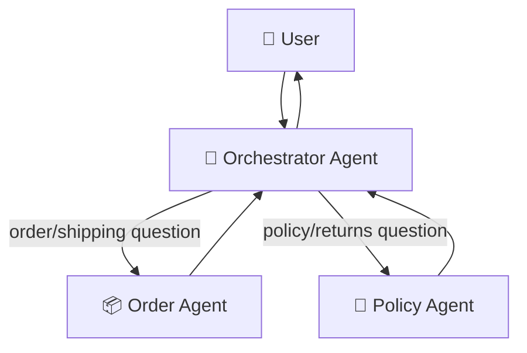

# 🤖 Building Agents & Multi-Agent Systems

**🏷️ Difficulty:** 🟡 Intermediate → 🔴 Advanced (Lab 6 onward)

## Start here

> [!NOTE]
> This guide is about **application agents you build and run** — a loop where an LLM decides which tool to call to satisfy a user request. It is a different concept from the **coding-assistant subagents** (Copilot CLI, Codex, Claude Code delegating work to a helper session) covered in the [AI Coding-Agent Configuration Handbook](deep-research-report.md#choose-product). Both use the word "agent"; they solve different problems. This guide builds your own.

```text
LLM
 ↓
Decision: which tool, with what arguments?
 ↓
Tool runs (ordinary deterministic code)
 ↓
Result returned to the LLM
 ↓
LLM produces the final answer (or decides to call another tool)
```

**Minimum prerequisites:** complete the [Local AI Learning Lab](local_ai_learning_lab.md#lab-build) (Ollama + a local model). Comfortable with basic Python functions and dictionaries. Builds conceptually on [AI Journey section 6 (function calling)](ai_journey.md#course-tools) and [section 8 (agent vs. workflow)](ai_journey.md#8--agent-or-deterministic-workflow) but does not require finishing them first.

**Design choice:** this lab uses **structured-JSON routing** (ask the model to output `{"tool": "...", "args": {...}}` and parse it yourself) instead of a provider's native function-calling API. This works with any local model, is fully deterministic to test, and teaches the actual mechanism one layer closer to the metal. [AI Journey's cloud lab](ai_journey.md#8--agent-or-deterministic-workflow) later shows the same concept using a provider's native tool-calling API and a managed framework.

### Essential path

1. [Lab 1 — a single-tool agent](#agent-lab1)
2. [Lab 2 — add a second tool and teach routing](#agent-lab2)
3. [Lab 3 — add conversation state](#agent-lab3)
4. [Lab 4 — handle failures: bad JSON, unknown tools, infinite loops](#agent-lab4)
5. [Lab 5 — require human approval for a risky tool](#agent-lab5)
6. [Lab 6 — multi-agent: an orchestrator with specialist sub-agents](#agent-lab6)
7. [Lab 7 — trace every decision](#agent-lab7)
8. [Mini project: multi-agent helpdesk triage](#agent-project)
9. [Scaling up](#agent-scale)

> [!NOTE]
> Every lab also has a C# version, in **one evolving console project**, `AgentLab` (same pattern as the [RAG lab](rag_embeddings_lab.md#rag-lab0)). Create it once:
> ```powershell
> dotnet new console -o AgentLab
> Set-Location AgentLab
> ```
> `OllamaClient.cs` (shared by every lab below — create it now):
> ```csharp
> using System.Net.Http.Json;
> using System.Text.Json;
>
> public record ChatMessage(string Role, string Content);
>
> public static class OllamaClient
> {
>     private static readonly HttpClient Client = new()
>     {
>         BaseAddress = new Uri("http://127.0.0.1:11434"),
>         Timeout = TimeSpan.FromSeconds(120)
>     };
>
>     public static async Task<string> ChatAsync(List<ChatMessage> messages)
>     {
>         var request = new
>         {
>             model = "qwen3.5:9b-q4_K_M",
>             stream = false,
>             messages = messages.Select(m => new { role = m.Role, content = m.Content })
>         };
>         using var response = await Client.PostAsJsonAsync("/api/chat", request);
>         response.EnsureSuccessStatusCode();
>         using var doc = JsonDocument.Parse(await response.Content.ReadAsStreamAsync());
>         return doc.RootElement.GetProperty("message").GetProperty("content").GetString()!;
>     }
>
>     public static async Task<string> GenerateAsync(string prompt)
>     {
>         var request = new { model = "qwen3.5:9b-q4_K_M", prompt, stream = false };
>         using var response = await Client.PostAsJsonAsync("/api/generate", request);
>         response.EnsureSuccessStatusCode();
>         using var doc = JsonDocument.Parse(await response.Content.ReadAsStreamAsync());
>         return doc.RootElement.GetProperty("response").GetString()!;
>     }
> }
> ```

---

<a id="agent-lab1"></a>

# Lab 1 — 🔧 A single-tool agent

`tools.py` — one deterministic, testable Python function with **no** LLM involvement:

```python
def get_order_status(order_id: str) -> str:
    """Fake in-memory lookup — no external calls, fully deterministic."""
    orders = {"A100": "Shipped", "A101": "Processing", "A102": "Delivered"}
    return orders.get(order_id, f"No order found with ID {order_id}")
```

`agent_v1.py`:

```python
import json
import ollama
from tools import get_order_status

SYSTEM_PROMPT = """You help with order status questions. You have ONE tool:

get_order_status(order_id: str) -> str

If the user's question needs this tool, respond with ONLY this JSON, nothing else:
{"tool": "get_order_status", "args": {"order_id": "<the id>"}}

If you can answer directly without a tool, respond with ONLY this JSON:
{"tool": null, "answer": "<your answer>"}
"""

def run_agent(question: str) -> str:
    response = ollama.chat(model="qwen3.5:9b-q4_K_M", messages=[
        {"role": "system", "content": SYSTEM_PROMPT},
        {"role": "user", "content": question},
    ])
    decision = json.loads(response["message"]["content"])

    if decision["tool"] == "get_order_status":
        result = get_order_status(**decision["args"])
        follow_up = ollama.chat(model="qwen3.5:9b-q4_K_M", messages=[
            {"role": "system", "content": SYSTEM_PROMPT},
            {"role": "user", "content": question},
            {"role": "assistant", "content": json.dumps(decision)},
            {"role": "user", "content": f"Tool result: {result}. Now answer the user's question in plain text."},
        ])
        return follow_up["message"]["content"]

    return decision["answer"]

if __name__ == "__main__":
    print(run_agent("What's the status of order A101?"))
    print(run_agent("What is 2 + 2?"))
```

```powershell
python agent_v1.py
```

👀 **Expected output:** a plain-text answer mentioning "Processing" for the first question (the model called the tool), and a direct answer like "4" for the second (no tool needed — the model answered from `{"tool": null, ...}`).

### 💜 C# equivalent

`Tools.cs`:

```csharp
public static class Tools
{
    public static string GetOrderStatus(string orderId)
    {
        var orders = new Dictionary<string, string>
        {
            ["A100"] = "Shipped", ["A101"] = "Processing", ["A102"] = "Delivered"
        };
        return orders.GetValueOrDefault(orderId, $"No order found with ID {orderId}");
    }
}
```

`Decision.cs` — parses the model's `{"tool": ..., "args": {...}}` / `{"tool": null, "answer": ...}` JSON:

```csharp
using System.Text.Json;

public record Decision(string? Tool, JsonElement? Args, string? Answer)
{
    public static Decision Parse(string json)
    {
        using var doc = JsonDocument.Parse(json);
        var root = doc.RootElement;
        string? tool = root.TryGetProperty("tool", out var t) && t.ValueKind != JsonValueKind.Null ? t.GetString() : null;
        JsonElement? args = root.TryGetProperty("args", out var a) ? a.Clone() : null;
        string? answer = root.TryGetProperty("answer", out var ans) ? ans.GetString() : null;
        return new Decision(tool, args, answer);
    }
}
```

`Program.cs`:

```csharp
const string systemPrompt = """
    You help with order status questions. You have ONE tool:

    get_order_status(order_id: str) -> str

    If the user's question needs this tool, respond with ONLY this JSON, nothing else:
    {"tool": "get_order_status", "args": {"order_id": "<the id>"}}

    If you can answer directly without a tool, respond with ONLY this JSON:
    {"tool": null, "answer": "<your answer>"}
    """;

async Task<string> RunAgentAsync(string question)
{
    var messages = new List<ChatMessage> { new("system", systemPrompt), new("user", question) };
    var raw = await OllamaClient.ChatAsync(messages);
    var decision = Decision.Parse(raw);

    if (decision.Tool == "get_order_status")
    {
        var orderId = decision.Args!.Value.GetProperty("order_id").GetString()!;
        var result = Tools.GetOrderStatus(orderId);

        messages.Add(new ChatMessage("assistant", raw));
        messages.Add(new ChatMessage("user", $"Tool result: {result}. Now answer the user's question in plain text."));
        return await OllamaClient.ChatAsync(messages);
    }

    return decision.Answer!;
}

Console.WriteLine(await RunAgentAsync("What's the status of order A101?"));
Console.WriteLine(await RunAgentAsync("What is 2 + 2?"));
```

```powershell
dotnet run
```

### 🧠 What just happened?

The model never touched real data. It only **decided** whether a tool was needed and **what arguments** to use. Your Python code executed the actual lookup. This separation — model decides, deterministic code executes — is the entire security and reliability model behind agents; never let the model's text output directly perform an action.

### 💥 Break it

Ask `run_agent("What's the status of order ZZZZ?")`. The tool runs and correctly reports "No order found" — the **tool itself** handles the unknown case safely because it's ordinary code with a `.get(..., default)`, not because the model "decided" to be careful.

### 🏋️ Exercise

Add a third fake order to the dictionary in `get_order_status`, then ask the agent about it by ID. Next, ask a question with no order ID at all ("What's the status of my order?") and observe whether the model asks a clarifying question or guesses an ID — this is your first encounter with a model filling a gap instead of admitting it doesn't know.

---

<a id="agent-lab2"></a>

# Lab 2 — 🧭 Add a second tool and teach routing

`tools.py` (add):

```python
def get_return_policy(category: str) -> str:
    policies = {
        "electronics": "30-day return window, must be unopened.",
        "clothing": "60-day return window, tags must be attached.",
    }
    return policies.get(category.lower(), "Standard 30-day return policy applies.")
```

`agent_v2.py`:

```python
import json
import ollama
from tools import get_order_status, get_return_policy

SYSTEM_PROMPT = """You help with order and policy questions. You have TWO tools:

get_order_status(order_id: str) -> str
get_return_policy(category: str) -> str

Respond with ONLY one of these JSON shapes, nothing else:
{"tool": "get_order_status", "args": {"order_id": "<id>"}}
{"tool": "get_return_policy", "args": {"category": "<category>"}}
{"tool": null, "answer": "<direct answer, no tool needed>"}
"""

TOOLS = {
    "get_order_status": get_order_status,
    "get_return_policy": get_return_policy,
}

def run_agent(question: str) -> str:
    response = ollama.chat(model="qwen3.5:9b-q4_K_M", messages=[
        {"role": "system", "content": SYSTEM_PROMPT},
        {"role": "user", "content": question},
    ])
    decision = json.loads(response["message"]["content"])

    if decision["tool"] in TOOLS:
        result = TOOLS[decision["tool"]](**decision["args"])
        follow_up = ollama.chat(model="qwen3.5:9b-q4_K_M", messages=[
            {"role": "system", "content": SYSTEM_PROMPT},
            {"role": "user", "content": question},
            {"role": "assistant", "content": json.dumps(decision)},
            {"role": "user", "content": f"Tool result: {result}. Now answer in plain text."},
        ])
        return follow_up["message"]["content"]

    return decision["answer"]

if __name__ == "__main__":
    print(run_agent("What's the status of order A100?"))
    print(run_agent("Can I return electronics I bought?"))
    print(run_agent("What's your favorite color?"))
```

```powershell
python agent_v2.py
```

👀 **Expected output:** three different behaviors — order lookup, policy lookup, and a direct `{"tool": null, ...}` answer for the off-topic question (or a polite decline, depending on your system prompt's scope).

### 💜 C# equivalent

`Tools.cs` (add):

```csharp
public static string GetReturnPolicy(string category)
{
    var policies = new Dictionary<string, string>
    {
        ["electronics"] = "30-day return window, must be unopened.",
        ["clothing"] = "60-day return window, tags must be attached.",
    };
    return policies.GetValueOrDefault(category.ToLowerInvariant(), "Standard 30-day return policy applies.");
}
```

`Program.cs`:

```csharp
const string systemPrompt = """
    You help with order and policy questions. You have TWO tools:

    get_order_status(order_id: str) -> str
    get_return_policy(category: str) -> str

    Respond with ONLY one of these JSON shapes, nothing else:
    {"tool": "get_order_status", "args": {"order_id": "<id>"}}
    {"tool": "get_return_policy", "args": {"category": "<category>"}}
    {"tool": null, "answer": "<direct answer, no tool needed>"}
    """;

var toolMap = new Dictionary<string, Func<JsonElement, string>>
{
    ["get_order_status"] = a => Tools.GetOrderStatus(a.GetProperty("order_id").GetString()!),
    ["get_return_policy"] = a => Tools.GetReturnPolicy(a.GetProperty("category").GetString()!),
};

async Task<string> RunAgentAsync(string question)
{
    var messages = new List<ChatMessage> { new("system", systemPrompt), new("user", question) };
    var raw = await OllamaClient.ChatAsync(messages);
    var decision = Decision.Parse(raw);

    if (decision.Tool is not null && toolMap.TryGetValue(decision.Tool, out var toolFn))
    {
        var result = toolFn(decision.Args!.Value);
        messages.Add(new ChatMessage("assistant", raw));
        messages.Add(new ChatMessage("user", $"Tool result: {result}. Now answer in plain text."));
        return await OllamaClient.ChatAsync(messages);
    }

    return decision.Answer!;
}

Console.WriteLine(await RunAgentAsync("What's the status of order A100?"));
Console.WriteLine(await RunAgentAsync("Can I return electronics I bought?"));
Console.WriteLine(await RunAgentAsync("What's your favorite color?"));
```

```powershell
dotnet run
```

### 🏋️ Exercise

Ask a question that plausibly needs **both** tools in sequence ("What's the status of order A100, and what's the return policy if it's electronics?"). Observe that this single-call design only executes **one** tool per turn — this is exactly the limitation [Lab 6](#agent-lab6) and multi-step loops solve.

---

<a id="agent-lab3"></a>

# Lab 3 — 🧠 Add conversation state

`agent_v3.py` extends `agent_v2.py` with a running history:

```python
import json
import ollama
from tools import get_order_status, get_return_policy

SYSTEM_PROMPT = """..."""  # same as agent_v2.py

TOOLS = {"get_order_status": get_order_status, "get_return_policy": get_return_policy}

class Agent:
    def __init__(self):
        self.history = [{"role": "system", "content": SYSTEM_PROMPT}]

    def ask(self, question: str) -> str:
        self.history.append({"role": "user", "content": question})
        response = ollama.chat(model="qwen3.5:9b-q4_K_M", messages=self.history)
        decision = json.loads(response["message"]["content"])
        self.history.append({"role": "assistant", "content": response["message"]["content"]})

        if decision["tool"] in TOOLS:
            result = TOOLS[decision["tool"]](**decision["args"])
            self.history.append({"role": "user", "content": f"Tool result: {result}. Answer in plain text."})
            follow_up = ollama.chat(model="qwen3.5:9b-q4_K_M", messages=self.history)
            self.history.append({"role": "assistant", "content": follow_up["message"]["content"]})
            return follow_up["message"]["content"]

        return decision["answer"]

if __name__ == "__main__":
    agent = Agent()
    print(agent.ask("What's the status of order A100?"))
    print(agent.ask("What about its return policy if it's clothing?"))
```

👀 **Expected output:** the second answer correctly refers back to order A100's context ("its") because `self.history` carries prior turns — without it, the model would have no idea what "its" refers to.

### 💜 C# equivalent

`Agent.cs`:

```csharp
using System.Text.Json;

public class Agent
{
    private const string SystemPrompt = "..."; // same as Lab 2's systemPrompt

    private static readonly Dictionary<string, Func<JsonElement, string>> Tools_ = new()
    {
        ["get_order_status"] = a => Tools.GetOrderStatus(a.GetProperty("order_id").GetString()!),
        ["get_return_policy"] = a => Tools.GetReturnPolicy(a.GetProperty("category").GetString()!),
    };

    private readonly List<ChatMessage> _history = new() { new("system", SystemPrompt) };

    public async Task<string> AskAsync(string question)
    {
        _history.Add(new ChatMessage("user", question));
        var raw = await OllamaClient.ChatAsync(_history);
        var decision = Decision.Parse(raw);
        _history.Add(new ChatMessage("assistant", raw));

        if (decision.Tool is not null && Tools_.TryGetValue(decision.Tool, out var toolFn))
        {
            var result = toolFn(decision.Args!.Value);
            _history.Add(new ChatMessage("user", $"Tool result: {result}. Answer in plain text."));
            var followUp = await OllamaClient.ChatAsync(_history);
            _history.Add(new ChatMessage("assistant", followUp));
            return followUp;
        }

        return decision.Answer!;
    }
}
```

`Program.cs`:

```csharp
var agent = new Agent();
Console.WriteLine(await agent.AskAsync("What's the status of order A100?"));
Console.WriteLine(await agent.AskAsync("What about its return policy if it's clothing?"));
```

```powershell
dotnet run
```

### 🧪 Experiment: with vs. without history

Comment out `self.history.append(...)` for the user question (replace `self.history` with a fresh one-message list each call). Re-run the same two questions and observe the second answer no longer makes sense — it has no idea what "its" refers to. This is the concrete difference between **stateless calls** and a **conversation**.

> [!TIP]
> This in-memory `self.history` list is session-only — it disappears when the process exits. A durable "remember this user across days" store is a different concern (a database row keyed by user ID) layered on top, not a replacement for this per-conversation history.

### 🏋️ Exercise

Call `agent.ask(...)` three times in a row with increasingly vague follow-ups ("and what about A101?", "same question for clothing"). Print `len(agent.history)` after each call and confirm it grows every turn — then explain why an unbounded `self.history` eventually becomes a cost and latency problem for long conversations (hint: every past message gets resent to the model on every call).

---

<a id="agent-lab4"></a>

# Lab 4 — 🩹 Handle failures: bad JSON, unknown tools, infinite loops

Real models sometimes misbehave. `agent_v4.py` hardens `agent_v3.py`'s `ask` method:

```python
def ask(self, question: str, max_tool_calls: int = 3) -> str:
    self.history.append({"role": "user", "content": question})
    calls_made = 0

    while calls_made < max_tool_calls:
        response = ollama.chat(model="qwen3.5:9b-q4_K_M", messages=self.history)
        raw = response["message"]["content"]
        self.history.append({"role": "assistant", "content": raw})

        try:
            decision = json.loads(raw)
        except json.JSONDecodeError:
            return "The model returned an invalid response. Please rephrase your question."

        if decision.get("tool") is None:
            return decision.get("answer", "No answer provided.")

        tool_fn = TOOLS.get(decision["tool"])
        if tool_fn is None:
            return f"The model requested an unknown tool: {decision['tool']}"

        try:
            result = tool_fn(**decision.get("args", {}))
        except TypeError as e:
            return f"Tool call failed — invalid arguments: {e}"

        self.history.append({"role": "user", "content": f"Tool result: {result}. Continue, or answer if done."})
        calls_made += 1

    return "Stopped after reaching the maximum number of tool calls for this turn."
```

### 💥 Break it on purpose

Temporarily change `SYSTEM_PROMPT` to ask for XML instead of JSON, keep the parsing code expecting JSON, and run a question. Confirm you get the graceful `"invalid response"` message instead of an unhandled `JSONDecodeError` crashing the program.

### 💜 C# equivalent

```csharp
public async Task<string> AskAsync(string question, int maxToolCalls = 3)
{
    _history.Add(new ChatMessage("user", question));
    int callsMade = 0;

    while (callsMade < maxToolCalls)
    {
        var raw = await OllamaClient.ChatAsync(_history);
        _history.Add(new ChatMessage("assistant", raw));

        Decision decision;
        try
        {
            decision = Decision.Parse(raw);
        }
        catch (JsonException)
        {
            return "The model returned an invalid response. Please rephrase your question.";
        }

        if (decision.Tool is null)
            return decision.Answer ?? "No answer provided.";

        if (!Tools_.TryGetValue(decision.Tool, out var toolFn))
            return $"The model requested an unknown tool: {decision.Tool}";

        string result;
        try
        {
            result = toolFn(decision.Args ?? default);
        }
        catch (Exception e) when (e is KeyNotFoundException or InvalidOperationException)
        {
            return $"Tool call failed — invalid arguments: {e.Message}";
        }

        _history.Add(new ChatMessage("user", $"Tool result: {result}. Continue, or answer if done."));
        callsMade++;
    }

    return "Stopped after reaching the maximum number of tool calls for this turn.";
}
```

`JSONDecodeError`'s C# equivalent is `System.Text.Json.JsonException`, thrown by `JsonDocument.Parse` inside `Decision.Parse` — catch it exactly where the Python version catches `json.JSONDecodeError`.

### ✅ Checkpoint

- [ ] Explain why `max_tool_calls` exists (a model that keeps "deciding" to call a tool would otherwise loop forever)
- [ ] Trigger and observe the "invalid response" path
- [ ] Trigger and observe the "unknown tool" path

---

<a id="agent-lab5"></a>

# Lab 5 — 🚦 Require human approval for a risky tool

Not every tool should execute automatically. `tools.py` (add):

```python
def issue_refund(order_id: str, amount: float) -> str:
    """In a real system this would move money — never auto-approve it."""
    return f"Refund of ${amount:.2f} issued for order {order_id}."
```

Add a gate in the agent loop, before executing:

```python
RISKY_TOOLS = {"issue_refund"}

...
tool_fn = TOOLS.get(decision["tool"])
if decision["tool"] in RISKY_TOOLS:
    confirm = input(f"⚠️  Model wants to call {decision['tool']}({decision.get('args')}). Approve? [y/N] ")
    if confirm.strip().lower() != "y":
        self.history.append({"role": "user", "content": "The user did not approve this action. Do not retry it; ask what they'd like instead."})
        continue
result = tool_fn(**decision.get("args", {}))
```

👀 **Expected behavior:** ask the agent to issue a refund; it pauses for your typed `y`/`N` before anything "happens." Reject it once and confirm the agent asks a follow-up instead of silently retrying.

This is the same principle as the coding-agent handbook's approval gates for writes/execution — a model's output is a **proposal**, not an authorization, for any action with real-world side effects.

### 💜 C# equivalent

`Tools.cs` (add):

```csharp
public static string IssueRefund(string orderId, double amount) =>
    $"Refund of ${amount:F2} issued for order {orderId}."; // a real system would move money here — never auto-approve it
```

Add a gate in the agent loop, before executing:

```csharp
private static readonly HashSet<string> RiskyTools = new() { "issue_refund" };

// ... inside the while loop, replacing the direct tool-call block:
if (RiskyTools.Contains(decision.Tool))
{
    Console.Write($"⚠️  Model wants to call {decision.Tool}({decision.Args}). Approve? [y/N] ");
    var confirm = Console.ReadLine();
    if (!string.Equals(confirm?.Trim(), "y", StringComparison.OrdinalIgnoreCase))
    {
        _history.Add(new ChatMessage("user", "The user did not approve this action. Do not retry it; ask what they'd like instead."));
        callsMade++;
        continue;
    }
}
var result = toolFn(decision.Args ?? default);
```

```powershell
dotnet run
```

### 🏋️ Exercise

Add a second risky tool, `cancel_order(order_id: str)`, to `RISKY_TOOLS`. Ask the agent to both check an order's status (auto-approved) and cancel it (gated) in the same conversation, and confirm only the cancel step pauses for approval.

---

<a id="agent-lab6"></a>

# Lab 6 — 🧩 Multi-agent: an orchestrator with specialist sub-agents

A single agent juggling many unrelated tools gets a bloated, confusing system prompt. Split it: one **orchestrator** routes the request; each **specialist** has its own focused instructions and tools.



`multi_agent.py`:

```python
import json
import ollama
from tools import get_order_status, get_return_policy

def order_agent(question: str) -> str:
    prompt = f"""You are the Order Agent. You have ONE tool:
get_order_status(order_id: str) -> str
Respond with ONLY: {{"order_id": "<id>"}}

Question: {question}"""
    response = ollama.generate(model="qwen3.5:9b-q4_K_M", prompt=prompt)
    args = json.loads(response["response"])
    return get_order_status(**args)

def policy_agent(question: str) -> str:
    prompt = f"""You are the Policy Agent. You have ONE tool:
get_return_policy(category: str) -> str
Respond with ONLY: {{"category": "<category>"}}

Question: {question}"""
    response = ollama.generate(model="qwen3.5:9b-q4_K_M", prompt=prompt)
    args = json.loads(response["response"])
    return get_return_policy(**args)

SPECIALISTS = {"order": order_agent, "policy": policy_agent}

def orchestrator(question: str) -> str:
    routing_prompt = f"""Classify this question as exactly one word: "order" or "policy".
Question: {question}
Answer with ONLY the single word."""
    response = ollama.generate(model="qwen3.5:9b-q4_K_M", prompt=routing_prompt)
    route = response["response"].strip().lower()

    specialist = SPECIALISTS.get(route)
    if specialist is None:
        return f"Could not route question (got '{route}'). Try rephrasing."

    result = specialist(question)
    return f"[{route} agent] {result}"

if __name__ == "__main__":
    print(orchestrator("What's the status of order A102?"))
    print(orchestrator("Can I return clothing after 45 days?"))
```

```powershell
python multi_agent.py
```

👀 **Expected output:** `[order agent] Delivered` for the first, `[policy agent] 60-day return window, tags must be attached.` for the second — the orchestrator routed each question to the right specialist, and each specialist only ever sees its own narrow tool and instructions.

### 💜 C# equivalent

`Program.cs`:

```csharp
using System.Text.Json;

async Task<string> OrderAgentAsync(string question)
{
    var prompt = $"""
        You are the Order Agent. You have ONE tool:
        get_order_status(order_id: str) -> str
        Respond with ONLY: {{"order_id": "<id>"}}

        Question: {question}
        """;
    var raw = await OllamaClient.GenerateAsync(prompt);
    using var doc = JsonDocument.Parse(raw);
    return Tools.GetOrderStatus(doc.RootElement.GetProperty("order_id").GetString()!);
}

async Task<string> PolicyAgentAsync(string question)
{
    var prompt = $"""
        You are the Policy Agent. You have ONE tool:
        get_return_policy(category: str) -> str
        Respond with ONLY: {{"category": "<category>"}}

        Question: {question}
        """;
    var raw = await OllamaClient.GenerateAsync(prompt);
    using var doc = JsonDocument.Parse(raw);
    return Tools.GetReturnPolicy(doc.RootElement.GetProperty("category").GetString()!);
}

var specialists = new Dictionary<string, Func<string, Task<string>>>
{
    ["order"] = OrderAgentAsync,
    ["policy"] = PolicyAgentAsync,
};

async Task<string> OrchestratorAsync(string question)
{
    var routingPrompt = $"""
        Classify this question as exactly one word: "order" or "policy".
        Question: {question}
        Answer with ONLY the single word.
        """;
    var route = (await OllamaClient.GenerateAsync(routingPrompt)).Trim().ToLowerInvariant();

    if (!specialists.TryGetValue(route, out var specialist))
        return $"Could not route question (got '{route}'). Try rephrasing.";

    var result = await specialist(question);
    return $"[{route} agent] {result}";
}

Console.WriteLine(await OrchestratorAsync("What's the status of order A102?"));
Console.WriteLine(await OrchestratorAsync("Can I return clothing after 45 days?"));
```

```powershell
dotnet run
```

### 🧠 Why split agents instead of one with more tools?

- **Focused instructions** — each specialist's prompt stays small and unambiguous, which measurably improves reliability as tool count grows.
- **Independent testing** — you can unit-test `order_agent` and `policy_agent` in isolation.
- **Least privilege** — the policy agent physically cannot call `issue_refund`; it was never given that tool.

### 🏋️ Challenge

Add a third specialist, `escalation_agent`, that the orchestrator routes to when the question doesn't fit "order" or "policy" (e.g., a complaint). Have it return a fixed "A human will follow up" message — no tool required, demonstrating that a specialist doesn't need a tool at all to be useful.

---

<a id="agent-lab7"></a>

# Lab 7 — 📊 Trace every decision

Debugging a multi-step agent from its final answer alone is nearly impossible. Add a trace log to `orchestrator`:

```python
import time

def orchestrator(question: str, trace: list | None = None) -> str:
    if trace is None:
        trace = []
    start = time.time()

    routing_prompt = f"""Classify this question as exactly one word: "order" or "policy".
Question: {question}
Answer with ONLY the single word."""
    response = ollama.generate(model="qwen3.5:9b-q4_K_M", prompt=routing_prompt)
    route = response["response"].strip().lower()
    trace.append({"step": "route", "decision": route, "elapsed_s": round(time.time() - start, 2)})

    specialist = SPECIALISTS.get(route)
    if specialist is None:
        trace.append({"step": "error", "reason": f"unroutable: {route}"})
        return f"Could not route question (got '{route}'). Try rephrasing."

    result = specialist(question)
    trace.append({"step": "specialist_result", "agent": route, "result": result})
    return f"[{route} agent] {result}"

if __name__ == "__main__":
    trace: list = []
    answer = orchestrator("What's the status of order A102?", trace=trace)
    print(answer)
    print("\n--- trace ---")
    for step in trace:
        print(step)
```

👀 **Expected output:** the answer, followed by a `--- trace ---` section showing the routing decision, how long it took, and the specialist's raw result — exactly the evidence you'd need to debug a wrong answer without guessing which stage failed.

### 💜 C# equivalent

```csharp
public record TraceStep(string Step, string? Decision = null, string? Agent = null, string? Result = null, string? Reason = null, double? ElapsedS = null);

async Task<(string Answer, List<TraceStep> Trace)> OrchestratorWithTraceAsync(string question)
{
    var trace = new List<TraceStep>();
    var start = DateTime.UtcNow;

    var routingPrompt = $"""
        Classify this question as exactly one word: "order" or "policy".
        Question: {question}
        Answer with ONLY the single word.
        """;
    var route = (await OllamaClient.GenerateAsync(routingPrompt)).Trim().ToLowerInvariant();
    trace.Add(new TraceStep("route", Decision: route, ElapsedS: (DateTime.UtcNow - start).TotalSeconds));

    if (!specialists.TryGetValue(route, out var specialist))
    {
        trace.Add(new TraceStep("error", Reason: $"unroutable: {route}"));
        return ($"Could not route question (got '{route}'). Try rephrasing.", trace);
    }

    var result = await specialist(question);
    trace.Add(new TraceStep("specialist_result", Agent: route, Result: result));
    return ($"[{route} agent] {result}", trace);
}

var (answer, trace) = await OrchestratorWithTraceAsync("What's the status of order A102?");
Console.WriteLine(answer);
Console.WriteLine("\n--- trace ---");
foreach (var step in trace) Console.WriteLine(step);
```

```powershell
dotnet run
```

---

<a id="agent-project"></a>

# 🏗️ Mini project: multi-agent helpdesk triage

This mirrors the "BuildDesk support triage" scenario in [AI Journey section 8](ai_journey.md#8--agent-or-deterministic-workflow), built fully locally:

1. Build three specialists: `billing_agent`, `technical_agent`, `account_agent`, each with one or two fake deterministic tools (reuse the `tools.py` pattern).
2. Build an `orchestrator` that classifies an incoming ticket into one of the three categories.
3. Add the [Lab 5 approval gate](#agent-lab5) to any tool that would change account state (e.g., `reset_password`).
4. Add the [Lab 7 trace](#agent-lab7) so every routed ticket records which specialist handled it and why.
5. Feed it 10 realistic one-line tickets and manually verify each routed correctly — this is the same "10-case regression" idea used in [AI Journey's evaluation section](ai_journey.md#11--evaluate-trace-and-measure-cost).

### ✅ Checkpoint — you're ready to move on when you can

- [ ] Build a single-tool agent from scratch without copying this file
- [ ] Explain why the model's output is a proposal, not an executed action
- [ ] Add a human-approval gate to a risky tool
- [ ] Explain why splitting one agent into an orchestrator + specialists improves reliability
- [ ] Produce a trace that would let a teammate debug a wrong answer

---

<a id="agent-capstone"></a>

# 🏋️ Progressive practice lab: baby steps → advanced

### 🐣 Tier 1 — baby steps

1. Write one deterministic Python function with no LLM involved (e.g. `get_weather(city: str) -> str` returning fake fixed data) and call it directly to confirm it works before wiring up any model.
2. Build [Lab 1](#agent-lab1)'s single-tool agent from memory, without copying this file, using your own tool from step 1.
3. Ask your Lab 1 agent five different questions — two that need the tool, two that don't, and one nonsense question — and record the model's `{"tool": ...}` decision for each.

### 🧒 Tier 2 — building confidence

4. Add a second tool to your Tier-1 agent (your own choice, not `get_return_policy`) and confirm the model routes correctly between the two.
5. Add `self.history` conversation state ([Lab 3](#agent-lab3)) and ask a two-turn conversation where the second question only makes sense with memory of the first.
6. Add the failure handling from [Lab 4](#agent-lab4) (`max_tool_calls`, bad-JSON catch, unknown-tool catch) and deliberately trigger each of the three failure paths at least once.

### 🧑 Tier 3 — intermediate

7. Add one risky tool with the [Lab 5](#agent-lab5) human-approval gate, and prove both the approve and the reject path work.
8. Split your Tier-2 agent into an orchestrator + two specialists ([Lab 6](#agent-lab6)), each specialist keeping only the tools it actually needs.
9. Add the [Lab 7](#agent-lab7) trace log to your orchestrator and use it to diagnose one question you deliberately phrase ambiguously enough to cause a misroute.

### 🏆 Tier 4 — advanced / capstone

10. Build the [mini project](#agent-project) (three specialists, approval gate, trace log, 10-ticket regression) fully from memory.
11. Add a fourth specialist that the orchestrator should **never** be able to reach directly from a user question (e.g. an internal "admin" agent) — prove, by testing, that no phrasing of a normal user ticket routes to it.
12. Write a one-paragraph failure-mode analysis: pick one specialist, describe a plausible wrong-routing scenario for it, and explain which earlier lab's technique (approval gate, trace, max-tool-calls) would catch it first.

### ✅ Capstone checkpoint

- [ ] Completed all four tiers without copying code verbatim from earlier labs
- [ ] Triggered and explained at least three distinct failure modes across the whole lab
- [ ] Can justify, unprompted, when a single agent is enough versus when to split into orchestrator + specialists

---

<a id="agent-scale"></a>

# 🚀 Scaling up

Once this pattern is solid, the natural next steps are:

- **Native tool-calling APIs** — providers expose structured function-calling directly (no manual JSON-prompting needed); see [AI Journey's cloud agent lab](ai_journey.md#8--agent-or-deterministic-workflow) using Microsoft Agent Framework.
- **Persistent agent state** — move `self.history` into a database keyed by conversation/user ID for state that survives process restarts.
- **RAG-aware agents** — give a specialist the retrieval pipeline from the [RAG & Embeddings Lab](rag_embeddings_lab.md) as one of its tools, so it decides *when* to search documents instead of always receiving fixed context.
- **Production reliability** — rate limits, cost tracking, and the full evaluation/security checklist in [AI Journey sections 11–12](ai_journey.md#11--evaluate-trace-and-measure-cost).
- **Coding-assistant subagents** — a related but distinct concept for delegating development tasks; see the [configuration handbook](deep-research-report.md#choose-product).

## 🔗 Related topics

- [RAG & Embeddings Lab](rag_embeddings_lab.md) — give an agent a retrieval tool instead of fixed context.
- [AI Journey](ai_journey.md) — function calling (§6), MCP (§7), agent-vs-workflow (§8), evaluation (§11).
- [AI Coding-Agent Configuration Handbook](deep-research-report.md) — the different "agent" concept: configuring Copilot/Codex/Claude subagents for development work.

## ➡️ Next

Return to the **[README](README.md)** for the full map, or continue into [AI Journey's evaluation and production sections](ai_journey.md#11--evaluate-trace-and-measure-cost) to harden what you just built.
