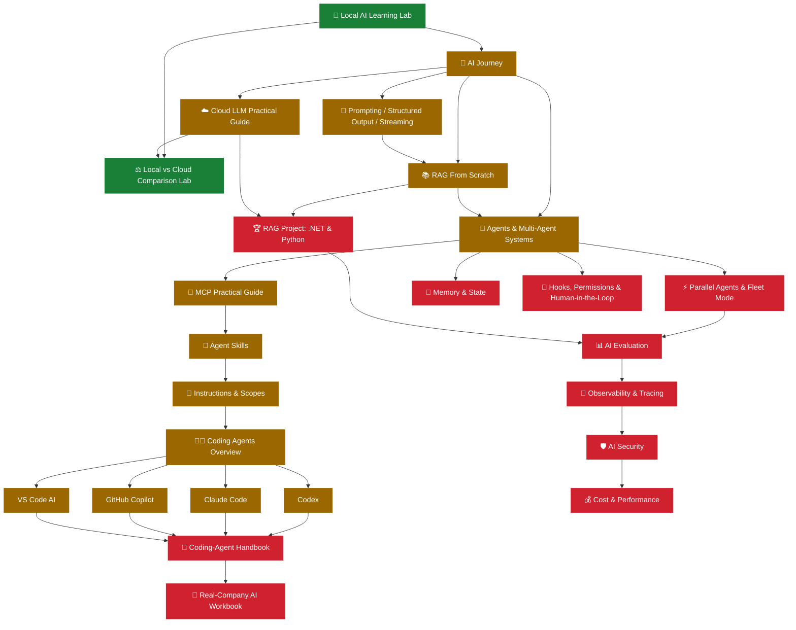

# 🧭 AI Engineering Curriculum — Master Guide

> One map for every AI/LLM/agent document in this repository, in the order you should actually read them.

**🏷️ Difficulty:** 🟢 Beginner → 🔴 Advanced (this page itself is a map, not a lesson)

> [!NOTE]
> This page does not duplicate any lesson. Every topic below lives in its own file so it stays practical and finishes in one sitting. This page's only job is to tell you **what exists and in what order to read it.**
> Scope note: this map, and every file it links to, deliberately excludes the `ai-cli/` folder — that folder holds personal/user-scope configuration templates, not curriculum material.

---

## 🧑‍🎓 Pick your path

| You are… | Start here, in order |
|---|---|
| 👶 **Zero AI knowledge** | [Local AI Learning Lab](local_ai_learning_lab.md) → [AI Journey](ai_journey.md) → [Prompting, Structured Output & Streaming](prompting_structured_output_streaming_guide.md) |
| 💻 **Existing developer, new to AI** | [AI Journey](ai_journey.md) → [RAG From Scratch](rag_embeddings_lab.md) → [Building Agents & Multi-Agent Systems](agents_and_subagents_lab.md) |
| 💜 **C# / .NET developer** | [AI Journey](ai_journey.md) (has a C# bridge throughout) → [RAG From Scratch](rag_embeddings_lab.md) (Python+C# parity) → [RAG Project: .NET & Python](rag_project_dotnet_and_python.md) |
| 🐍 **Python developer** | [Local AI Learning Lab](local_ai_learning_lab.md) → [RAG From Scratch](rag_embeddings_lab.md) → [RAG Project: .NET & Python](rag_project_dotnet_and_python.md) |
| 🤖 **Building your own AI application/agent** | [Tool Calling & Agents](agents_and_subagents_lab.md) → [MCP](mcp_practical_guide.md) → [Parallel Agents & Fleet Mode](parallel_agents_and_fleets_guide.md) → [Memory & State](ai_memory_and_state_guide.md) |
| 🧑‍💻 **Configuring a coding assistant (Copilot/Codex/Claude/VS Code)** | [Coding Agents Overview](coding_agents_overview.md) → your vendor's guide → [AI Coding-Agent Configuration Handbook](deep-research-report.md) → [Real-Company AI Engineering Workbook](end_to_end_ai_agent_graphql_workflow.md) |
| 🔐 **Operating AI in production** | [AI Evaluation](ai_evaluation_guide.md) → [Observability & Tracing](ai_observability_tracing_guide.md) → [AI Security](ai_security_guide.md) → [Cost & Performance](ai_cost_performance_guide.md) → [Hooks, Permissions & Human-in-the-Loop](hooks_permissions_human_approval_guide.md) |

---

## 🗺️ Full curriculum roadmap

---

## 📖 Every AI file, grouped and in dependency order

### 1 — Foundations & first experience
| File | What it teaches |
|---|---|
| [🚀 Local AI Learning Lab](local_ai_learning_lab.md) | Install a local runtime (Ollama), download/run a model, build one working local chat app |
| [🌈 AI Journey](ai_journey.md) | Progressive course: a local model call → structured output → guarded tools → retrieval → evaluation → optional cloud/MCP/agent branches |

### 2 — Prompting, structured output, streaming
| File | What it teaches |
|---|---|
| [💬 Prompting, Structured Output & Streaming](prompting_structured_output_streaming_guide.md) | System/developer/user roles, few-shot prompting, prompt templates/versioning; text→JSON→schema→typed-object pipeline; why/how to stream responses with cancellation |

### 3 — Cloud LLMs & local-vs-cloud
| File | What it teaches |
|---|---|
| [☁️ Cloud LLM Practical Guide](cloud_llm_practical_guide.md) | Calling a cloud model API for real: credentials, request/response shape, errors/retries, streaming, token/cost awareness |
| [⚖️ Local vs Cloud Comparison Lab](ai_local_vs_cloud_comparison_lab.md) | Run the same task against a local and a cloud model; compare latency, cost, privacy, context size, and when to choose which |

### 4 — Embeddings, vectors, and RAG
| File | What it teaches |
|---|---|
| [📚 RAG From Scratch: Embeddings & Retrieval Lab](rag_embeddings_lab.md) | Build RAG yourself, lab by lab: chunk → embed → compare similarity → store → retrieve → answer → cite → evaluate (Python + C#) |
| [🏆 RAG Project: .NET & Python](rag_project_dotnet_and_python.md) | A cohesive, slightly production-shaped RAG project (multi-file Python + C# projects) with a documented local→cloud swap |

### 5 — Tool calling, agents, and MCP
| File | What it teaches |
|---|---|
| [🤖 Building Agents & Multi-Agent Systems](agents_and_subagents_lab.md) | Single-tool agent → multi-tool routing → conversation state → failure handling → human-approval gate → orchestrator with specialist sub-agents → tracing |
| [🔌 MCP Practical Guide](mcp_practical_guide.md) | What problem MCP solves, using an existing MCP server, inspecting tools/resources, configuring it, and building a minimal server |
| [⚡ Parallel Agents & Fleet Mode](parallel_agents_and_fleets_guide.md) | When to parallelize agent work, measuring the real speedup, race conditions/aggregation, and verified vendor terminology (including GitHub Copilot CLI's own `/fleet`) |
| [💾 Memory & State](ai_memory_and_state_guide.md) | Stateless vs. session state vs. persisted memory vs. semantic/vector memory, with a terminology table and privacy note |

### 6 — Instructions, skills, and coding-agent vendor tracks
| File | What it teaches |
|---|---|
| [📜 AI Instructions & Scopes](ai_instructions_scopes_guide.md) | Global/user, project/repository, path-specific, and agent-specific instructions — where each lives and when it applies, per product |
| [🧩 Agent Skills Practical Guide](agent_skills_practical_guide.md) | What a skill is, how it differs from an instruction or an agent, `SKILL.md` structure, and building a real skill (see `examples/skills/`) |
| [🧑‍💻 Coding Agents Overview](coding_agents_overview.md) | Comparison table across Codex, Claude Code, GitHub Copilot, and VS Code — dated and honestly flagged where unverifiable |
| [Codex Practical Guide](codex_practical_guide.md) · [Claude Code Practical Guide](claude_code_practical_guide.md) · [GitHub Copilot Practical Guide](github_copilot_practical_guide.md) · [VS Code AI Practical Guide](vscode_ai_practical_guide.md) | The same small bug-fix mini-project walked through in each vendor's real current workflow |
| [📘 AI Coding-Agent Configuration Handbook](deep-research-report.md) | Deeper product-specific configuration reference (pre-existing) |
| [🧪 Real-Company AI Engineering Workbook](end_to_end_ai_agent_graphql_workflow.md) | Applying the above to realistic company engineering tasks (pre-existing) |

### 7 — Operating AI responsibly and in production
| File | What it teaches |
|---|---|
| [🔐 Hooks, Permissions & Human-in-the-Loop](hooks_permissions_human_approval_guide.md) | Lifecycle hooks, read/write/execute/network permission model, approval gates, sandboxing, a pre-execution checklist |
| [📊 AI Evaluation](ai_evaluation_guide.md) | Labeled eval sets, exact-match/schema/LLM-as-judge scoring, regression detection, tool-call correctness |
| [🔭 Observability & Tracing](ai_observability_tracing_guide.md) | Structured logging of every model/tool call, diagnosing a bad trace, production metrics, an OpenTelemetry pointer |
| [🛡️ AI Security](ai_security_guide.md) | Direct and indirect prompt injection (with a working local demo), secrets handling, tool permission scoping, output validation |
| [💰 Cost & Performance](ai_cost_performance_guide.md) | Token counting, caching, model routing (cheap vs. capable), batching, and cost-estimate arithmetic with placeholder rates |

---

## ✅ How to know you're "done" with the AI curriculum

You should be able to, without looking anything up:

- Get a local model answering questions and explain what context/temperature/tokens do to the output.
- Turn free-text model output into a validated, typed object in both Python and C#.
- Explain why a response was streamed and handle a mid-stream cancellation.
- Build a tiny RAG pipeline from a folder of Markdown files and cite your sources.
- Build an agent that decides whether to call a tool, calls it, and uses the result.
- Point to the exact file on disk that controls a coding assistant's repository-wide behavior for your tool of choice.
- Explain the difference between a sub-agent, parallel sub-agents, and a persistent multi-agent system — without using "fleet" as a universal word.
- Name one thing you would log before trusting an agent to take a real action, and one thing you would never let it do unsupervised.

---

## 🔗 Related

- [README](README.md) — the full repository index, including the non-AI guides (Git, Docker, C#/.NET, Python, SQL, Azure).
