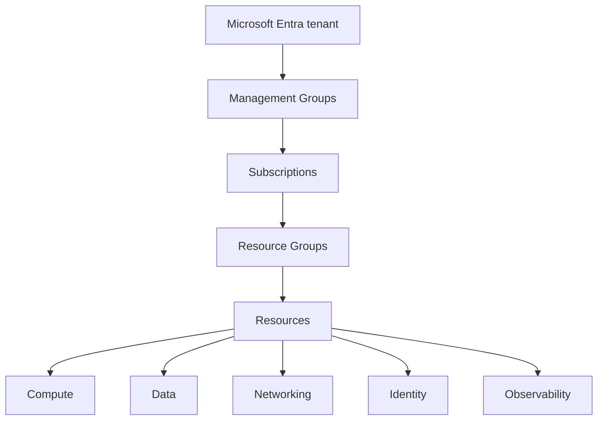
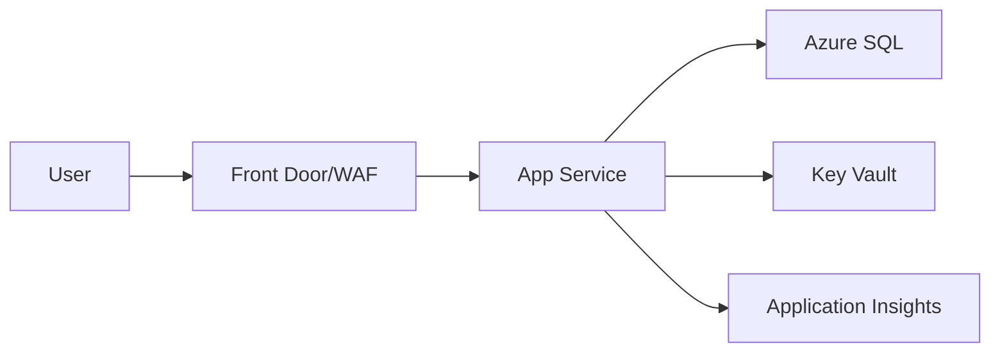

# ☁️ Azure Engineering Cheat Sheet

> 🌈 **Fast decisions. Fast recall. Production-aware.**  
> **Edition:** 2026-10-03  
> **Purpose:** A true engineering cheat sheet for choosing, connecting, operating, and troubleshooting Azure services quickly.  
> **Deep companion:** [`azure_resources_cheatsheet.md`](./azure_resources_cheatsheet.md)
>
> [!IMPORTANT]
> Always verify **pricing, SKUs, quotas, limits, regional availability, Availability Zone support, SLA, API versions, preview/GA status, runtime support, and retirement dates** in current Microsoft documentation before production use.

---

## 🎨 Legend

| Symbol | Meaning |
|---|---|
| 🟦 | What it is |
| ✅ | Good default / use when |
| ❌ | Avoid / wrong fit |
| ⚖️ | Compare / choose |
| 🔐 | Identity / security |
| 🌐 | Networking |
| 📈 | Scale / reliability |
| 👀 | Observe / troubleshoot |
| 💰 | Cost |
| 🛠️ | Command / implementation |
| ⚠️ | Common trap |
| 📚 | Official docs |

---

<a id="toc"></a>
# 🗺️ Table of Contents

1. [🧠 Azure Mental Model & Global Infrastructure](#s1)
2. [🏗️ Resource Organization & ARM](#s2)
3. [👤 Identity, Authentication, Authorization & Secrets](#s3)
4. [🌐 Networking & Application Delivery](#s4)
5. [🖥️ Compute, Application Hosting & Containers](#s5)
6. [💾 Storage](#s6)
7. [🗄️ Databases, Caching & Search](#s7)
8. [📨 Messaging, Events, APIs & Integration](#s8)
9. [📊 Observability, Monitoring & Operations](#s9)
10. [🛡️ Security & Threat Protection](#s10)
11. [🧯 Reliability, Availability, Backup & DR](#s11)
12. [🏛️ Governance, Landing Zones & Estate Management](#s12)
13. [💰 Cost Management & FinOps](#s13)
14. [🚀 Developer Tooling, IaC & CI/CD](#s14)
15. [📈 Data & Analytics — Quick Map](#s15)
16. [🤖 AI & Machine Learning — Quick Map](#s16)
17. [🔀 Hybrid, Multicloud, Edge, IoT & Migration](#s17)
18. [⚡ Technology Decision Tables](#s18)
19. [🧩 Architecture Patterns & Reference Topologies](#s19)
20. [⌨️ Operational Quick Reference](#s20)
21. [✅ Production Readiness Checklist](#s21)
22. [🧭 Troubleshooting & Incident Triage](#s22)
23. [🔄 Facts You Must Verify Live](#s23)
24. [📚 Official Microsoft Source Map](#s24)

---

<a id="s1"></a>
# 1. 🧠 Azure Mental Model & Global Infrastructure

## Azure in one picture



### 🧠 Remember this

```text
Identity decides WHO.
RBAC decides WHAT they may do.
Policy decides WHAT configurations are allowed.
Networking decides HOW traffic moves.
Compute runs CODE.
Storage/databases hold DATA.
Messaging decouples SYSTEMS.
Observability tells you WHAT HAPPENED.
IaC + CI/CD make changes REPEATABLE.
```

## Cloud service models

| Model | You manage most | Azure examples | Default thought |
|---|---|---|---|
| 🧱 **IaaS** | OS + runtime + app | VMs, VMSS | Maximum control, maximum ops |
| 🧰 **PaaS** | App + data/config | App Service, Azure SQL | Prefer when requirements allow |
| ⚡ **Serverless** | Code/config | Functions, Container Apps consumption | Event-driven / elastic |
| ☁️ **SaaS** | Usage/config only | Microsoft 365 | Consume, don't operate |

## Geography / region / zone

- **Geography** → data residency / market grouping.
- **Region** → Azure deployment location such as Sweden Central or West Europe.
- **Availability Zone** → physically separate datacenter zone in a supported region.
- **Zonal** → placed in a chosen zone.
- **Zone-redundant** → service spreads across zones.
- **Global/nonregional** → service control/routing plane isn't tied to one workload region.

> [!WARNING]
> A region having Availability Zones does **not** mean every Azure service or SKU supports zone redundancy there.

## Control plane vs data plane

| Plane | Example | Main auth concept |
|---|---|---|
| 🛠️ Control plane | Create VM, change firewall, assign role | ARM + Azure RBAC |
| 📦 Data plane | Read blob, query SQL, fetch secret | Service-specific data RBAC/auth |

[⬆️ Back to TOC](#toc)

---

<a id="s2"></a>
# 2. 🏗️ Resource Organization & Azure Resource Manager

```text
Tenant
└── Management Group
    └── Subscription
        └── Resource Group
            └── Resource
```

| Object | Think of it as | Common use |
|---|---|---|
| **Tenant** | Identity directory boundary | Users, apps, service principals |
| **Management Group** | Subscription hierarchy | Policy/RBAC inheritance |
| **Subscription** | Billing/quota/deployment boundary | Prod vs non-prod separation |
| **Resource Group** | Lifecycle/ownership grouping | App/environment resources |
| **Resource** | Actual Azure service instance | VM, VNet, SQL DB, Key Vault |

### ARM anatomy

```text
Microsoft.KeyVault/vaults
└── provider ─────┘└type┘
```

```text
/subscriptions/<id>/resourceGroups/<rg>/providers/<provider>/<type>/<name>
```

### Quick rules

- Group resources when they share **ownership + lifecycle + deployment + operations**.
- **Tags** are metadata, not security.
- **Locks** protect against accidental update/delete; they do not replace RBAC.
- Check **resource provider registration** when deployments say a namespace isn't registered.
- Check **quotas before** large deployments, autoscale, or DR tests.

```bash
az account show -o table
az group list -o table
az resource list -g <rg> -o table
az provider show --namespace Microsoft.Web --query registrationState -o tsv
```

[⬆️ Back to TOC](#toc)

---

<a id="s3"></a>
# 3. 👤 Identity, Authentication, Authorization & Secrets

## The identity equation

```text
Authentication = Who are you?
Authorization  = What may you do?

Azure RBAC assignment = Principal + Role + Scope
```

### Core objects

| Object | Purpose |
|---|---|
| User / Group | Human access |
| App Registration | Application identity definition |
| Service Principal | Tenant-local application identity |
| Managed Identity | Azure-managed workload identity |
| Workload Identity Federation | OIDC/federated identity without stored secret |

### Managed Identity

| Type | Use when |
|---|---|
| **System-assigned** | Identity should die with the resource |
| **User-assigned** | Identity must be reused or lifecycle-independent |

```text
App Service / Function / VM / Container App
                │
                │ Managed Identity
                ▼
     Key Vault / SQL / Storage / Service Bus
```

### Common RBAC roles

| Role | Meaning |
|---|---|
| Reader | View management-plane resources |
| Contributor | Manage resources, not role assignments |
| Owner | Manage resources + access |
| Storage Blob Data Reader | Read blob data |
| Key Vault Secrets User | Read secrets |
| Service Bus Data Sender/Receiver | Data-plane messaging permissions |

### 🔐 Good defaults

✅ Managed identity over connection-string secrets.  
✅ OIDC/workload federation for CI/CD.  
✅ Least privilege + smallest practical scope.  
✅ PIM for privileged human access.  
✅ Key Vault for secrets/keys/certificates.

### ⚠️ Traps

- Correct RBAC does **not** fix blocked networking.
- `Contributor` cannot normally grant roles.
- Management-plane `Owner` does not guarantee every data-plane permission.
- Don't create a client secret just so the app can fetch another secret.

[⬆️ Back to TOC](#toc)

---

<a id="s4"></a>
# 4. 🌐 Networking & Application Delivery

## Network mental model

```text
DNS says WHERE a name points.
Routes say WHERE packets go.
NSG/Firewall says WHETHER packets may pass.
Load balancing says WHICH healthy backend receives traffic.
```

### Core network resources

| Need | Azure resource |
|---|---|
| Private network | VNet |
| Segment workload | Subnet |
| L3/L4 filter | NSG |
| Custom routing | Route Table / UDR |
| VNet-to-VNet | VNet Peering |
| Private PaaS IP | Private Endpoint / Private Link |
| Stable outbound IP | NAT Gateway |
| Public/private DNS | Azure DNS / Private DNS |
| Hybrid encrypted tunnel | VPN Gateway |
| Private enterprise circuit | ExpressRoute |
| Managed global transit | Virtual WAN |
| Central network firewall | Azure Firewall |
| VM admin without public RDP/SSH | Bastion |

### Private Endpoint vs Service Endpoint

| | Private Endpoint | Service Endpoint |
|---|---|---|
| Private IP in VNet | ✅ | ❌ |
| Service still has public endpoint | Can disable/restrict | Yes |
| DNS work required | Usually ✅ | Usually simpler |
| Modern production default | Often | Legacy/specific scenarios |

### Application delivery

| Service | Layer | Scope | Best for |
|---|---:|---|---|
| Load Balancer | L4 | Regional | TCP/UDP |
| Application Gateway | L7 | Regional | HTTP/S, WAF, path/host routing |
| Front Door | L7 | Global edge | Global HTTP/S, WAF, acceleration, failover |
| Traffic Manager | DNS | Global | DNS-based endpoint selection |

> [!TIP]
> **Private Endpoint broken?** Check in this order: `DNS → route → NSG/firewall → endpoint approval/state → RBAC/app auth`.

```bash
nslookup <hostname>
az network nic show-effective-route-table -g <rg> -n <nic>
az network private-endpoint list -g <rg> -o table
```

[⬆️ Back to TOC](#toc)

---

<a id="s5"></a>
# 5. 🖥️ Compute, Application Hosting & Containers

## Compute decision table

| Requirement | Start with |
|---|---|
| Full OS control / legacy server | **VM** |
| VM fleet + autoscale | **VMSS** |
| Normal web app / REST API | **App Service** |
| Event-driven functions | **Azure Functions** |
| Containerized app, low Kubernetes ops | **Container Apps** |
| Kubernetes APIs/operators/CRDs | **AKS** |
| Quick isolated container | **ACI** |
| Private container registry | **ACR** |
| Large parallel jobs | **Azure Batch** |

### Simple rule

```text
Need full OS?              → VM
Need Kubernetes itself?    → AKS
Container-first, no K8s?   → Container Apps
Event-driven code?         → Functions
Normal web/API?            → App Service
```

### App Service networking memory trick

```text
VNet Integration = OUTBOUND from App Service to private network
Private Endpoint = INBOUND private access to App Service
```

### Container rule

- **ACR** stores images.
- **Container Apps / AKS / ACI / App Service** run images.
- Use **managed identity** for ACR pulls where supported.
- Prefer immutable image digests/tags for production.

[⬆️ Back to TOC](#toc)

---

<a id="s6"></a>
# 6. 💾 Storage

| Need | Start with |
|---|---|
| Objects / media / backups / logs | Blob Storage |
| Data lake analytics files | ADLS Gen2 |
| SMB/NFS share | Azure Files |
| VM block storage | Managed Disks |
| Simple queue | Queue Storage |
| Key/value NoSQL table | Table Storage |
| Enterprise high-performance NFS/SMB | Azure NetApp Files |
| Shared SAN/block workloads | Elastic SAN |
| Offline huge transfer | Data Box |

### Storage redundancy

| Option | Meaning |
|---|---|
| LRS | Local copies in one datacenter region boundary |
| ZRS | Copies across Availability Zones |
| GRS | Async copy to secondary region |
| RA-GRS | GRS + read access to secondary |
| GZRS | Zone redundancy primary + geo secondary |
| RA-GZRS | GZRS + readable secondary |

### Blob tiers

`Hot → Cool → Cold → Archive` = lower storage price, usually higher access/retrieval cost/latency.

### Security preference

```text
Managed Identity / Entra RBAC
        ↓ preferred
SAS (scoped + short-lived)
        ↓
Storage account keys
```

⚠️ Replication is **not backup**.  
⚠️ A Private Endpoint may need separate `blob`, `file`, `dfs`, etc. DNS/subresources depending on what you use.

[⬆️ Back to TOC](#toc)

---

<a id="s7"></a>
# 7. 🗄️ Databases, Caching & Search

## Start from the data model

| Need | Start with |
|---|---|
| SQL Server relational OLTP | Azure SQL Database |
| SQL Server instance compatibility | SQL Managed Instance |
| Full SQL Server + OS | SQL Server on Azure VM |
| PostgreSQL | PostgreSQL Flexible Server |
| MySQL | MySQL Flexible Server |
| Globally distributed NoSQL | Cosmos DB |
| In-memory cache | Azure Managed Redis |
| Full-text/vector/hybrid search | Azure AI Search |

### SQL choice

```text
New cloud app           → Azure SQL Database
Instance-level features → Managed Instance
OS/full SQL control     → SQL Server on VM
```

### Cosmos DB memory points

- **Partition key** determines scale and hot-partition risk.
- **RU/s** or current alternative compute model drives throughput/cost depending on API/offering.
- Consistency is a deliberate business trade-off.
- 429 throttling is a capacity/backpressure signal, not a random error.

> [!WARNING]
> Azure Cache for Redis is retiring. For new Azure Redis designs, start with **Azure Managed Redis** and verify the current migration/tier guidance.

[⬆️ Back to TOC](#toc)

---

<a id="s8"></a>
# 8. 📨 Messaging, Events, APIs & Integration

## The three services everyone confuses

| Intent | Service | Memory phrase |
|---|---|---|
| Reliable business message / command | **Service Bus** | “Process this work” |
| Discrete event notification | **Event Grid** | “Something happened” |
| High-volume event stream | **Event Hubs** | “Here is the stream” |

### Service Bus

- Queue = one logical work stream / competing consumers.
- Topic + subscriptions = pub/sub.
- DLQ = messages that failed processing/delivery rules.
- Sessions = ordered/grouped message handling.
- Make consumers **idempotent**.

### Integration

| Need | Service |
|---|---|
| Visual workflow/connectors | Logic Apps |
| API gateway/governance/policies | API Management |
| Real-time SignalR apps | Azure SignalR Service |
| Generic WebSocket pub/sub | Web PubSub |

⚠️ Never assume “exactly once end-to-end.” Design retries + idempotency + deduplication where business correctness requires it.

[⬆️ Back to TOC](#toc)

---

<a id="s9"></a>
# 9. 📊 Observability, Monitoring & Operations

```text
Application telemetry → Application Insights
Platform metrics      → Azure Monitor Metrics
Resource logs         → Azure Monitor Logs
                            ↓
                    Log Analytics Workspace
                            ↓
                           KQL
                            ↓
                      Alerts / Workbooks
```

| Tool | Use it for |
|---|---|
| Azure Monitor | Umbrella monitoring platform |
| Application Insights | Requests, dependencies, exceptions, traces |
| Log Analytics | Queryable log workspace |
| KQL | Query logs/telemetry |
| Alerts | Detect conditions |
| Action Groups | Notify / automate |
| Service Health | Personalized Azure incidents/maintenance |
| Resource Health | Health of a specific resource |
| Advisor | Recommendations |

### KQL starter

```kusto
AppRequests
| where TimeGenerated > ago(1h)
| summarize Requests=count(), Failures=countif(Success == false) by bin(TimeGenerated, 5m)
| order by TimeGenerated asc
```

### Observability rule

Collect **what you can act on**. “Enable every log forever” is expensive and often useless.

[⬆️ Back to TOC](#toc)

---

<a id="s10"></a>
# 10. 🛡️ Security & Threat Protection

### Security layers

```text
Identity → least privilege → secrets → network boundaries
        → encryption → posture protection → detection/response
```

| Need | Azure service/control |
|---|---|
| Secrets/keys/certs | Key Vault / Managed HSM |
| Posture + workload protection | Defender for Cloud |
| SIEM/SOAR | Microsoft Sentinel |
| Central network firewall | Azure Firewall |
| HTTP attack protection | WAF |
| DDoS service | Azure DDoS Protection |
| Subnet/NIC filtering | NSG |

### Defaults

✅ Managed identity.  
✅ No public admin ports.  
✅ Private access where justified.  
✅ Encryption in transit and at rest.  
✅ Centralized security telemetry.  
✅ Separate admin and workload identities.  
✅ Patch supported runtimes/OS.

[⬆️ Back to TOC](#toc)

---

<a id="s11"></a>
# 11. 🧯 Reliability, Availability, Backup & Disaster Recovery

| Term | Meaning |
|---|---|
| SLA | Provider availability commitment |
| SLO | Internal reliability target |
| RTO | Maximum acceptable recovery time |
| RPO | Maximum acceptable data loss in time |
| HA | Keep running through local failures |
| DR | Recover from major site/region failure |

### Do not confuse

```text
Availability ≠ Backup
Backup ≠ Replication
Replication ≠ Tested Disaster Recovery
```

### Reliability ladder

```text
Single instance
   ↓
Multiple instances
   ↓
Availability Zones
   ↓
Multi-region active/passive
   ↓
Multi-region active/active
```

| Need | Azure capability |
|---|---|
| VM/file/workload backup | Azure Backup |
| VM/site DR | Azure Site Recovery |
| Fault injection | Azure Chaos Studio |
| Global HTTP failover | Front Door |
| DNS-level failover | Traffic Manager |

> [!TIP]
> A DR plan is only real after a **test failover/restore** proves applications, DNS, identities, networks, secrets, and dependencies all work.

[⬆️ Back to TOC](#toc)

---

<a id="s12"></a>
# 12. 🏛️ Governance, Landing Zones & Estate Management

```text
RBAC   = WHO may do it?
Policy = WHAT configuration is allowed/required?
Lock   = Prevent accidental write/delete
Graph  = WHAT exists across the estate?
```

### Azure Policy

`Definition → Initiative → Assignment → Compliance → Remediation`

### Landing Zones — quick recognition

- **Platform landing zone** → shared identity, connectivity, management, security.
- **Application landing zone** → workload subscription/environment.
- Use management groups to apply policy/RBAC at scale.

### Resource Graph

```bash
az graph query -q "Resources | summarize count() by type | order by count_ desc" -o table
```

### Naming pattern

```text
<resource-type>-<workload>-<environment>-<region>-<instance>
```

Example: `app-orders-prod-swc-001`

[⬆️ Back to TOC](#toc)

---

<a id="s13"></a>
# 13. 💰 Cost Management & FinOps

### Main cost levers

```text
Compute runtime/capacity
+ Storage capacity/operations
+ Database/service tier
+ Network egress/data processing
+ Logs/telemetry ingestion
+ Redundancy/DR replicas
+ Licenses
```

| Tool | Use |
|---|---|
| Pricing Calculator | Estimate before deployment |
| Cost Management / Cost Analysis | Understand actual spend |
| Budgets | Alert before surprises |
| Advisor | Rightsizing/optimization ideas |
| Reservations | Commit to specific capacity/resource families |
| Savings Plan | Flexible eligible compute commitment |
| Azure Hybrid Benefit | Use eligible existing licenses |

### Common waste

- Idle VMs / dev environments running 24×7.
- Oversized database tiers.
- Excessive log retention/ingestion.
- Unused public IPs/disks/snapshots.
- Cross-region egress nobody modeled.
- Premium SKUs selected for features not actually used.

[⬆️ Back to TOC](#toc)

---

<a id="s14"></a>
# 14. 🚀 Developer Tooling, Infrastructure as Code & CI/CD

| Tool | Best use |
|---|---|
| Azure Portal | Explore / inspect / one-off operations |
| Azure CLI (`az`) | Script/manage Azure resources |
| Azure PowerShell | PowerShell-centric automation |
| Azure Developer CLI (`azd`) | App-centric provision/deploy developer workflow |
| Bicep | Azure-native declarative IaC |
| Terraform | Cross-cloud/ecosystem IaC |
| GitHub Actions | GitHub CI/CD |
| Azure Pipelines | Azure DevOps CI/CD |

### Bicep vs Terraform

| | Bicep | Terraform |
|---|---|---|
| Azure-first | ⭐⭐⭐ | ⭐⭐⭐ |
| Cross-cloud | ❌ | ✅ |
| ARM feature coverage | Very direct | Provider-dependent |
| State | ARM manages deployment state | Terraform state file/backend |

### Safer deployment workflow

```text
PR → validate/lint → what-if/plan → approval → deploy → smoke test → observe → rollback if needed
```

✅ CI/CD identity = workload federation/OIDC where possible.  
❌ Long-lived client secrets in pipeline variables.

[⬆️ Back to TOC](#toc)

---

<a id="s15"></a>
# 15. 📈 Data & Analytics — Quick Map

| Need | Start with |
|---|---|
| Data movement/orchestration | Data Factory |
| Spark/lakehouse | Azure Databricks |
| Telemetry/time-series analytics | Azure Data Explorer |
| Integrated Azure analytics workspace | Synapse Analytics |
| Stream SQL processing | Stream Analytics |
| SaaS analytics platform context | Microsoft Fabric |

### Recognition only

```text
OLTP app data   → Database section
Lake files      → ADLS Gen2
Batch pipelines → Data Factory / Databricks
Telemetry       → Event Hubs → ADX / analytics
```

[⬆️ Back to TOC](#toc)

---

<a id="s16"></a>
# 16. 🤖 AI & Machine Learning — Quick Map

> [!IMPORTANT]
> Current Microsoft platform naming is **Microsoft Foundry**. Older material may say Azure AI Studio / Azure AI Foundry.

| Need | Start with |
|---|---|
| Models + agents + tools | Microsoft Foundry |
| OpenAI model deployment | Azure OpenAI / Foundry Models |
| RAG / vector + hybrid search | Azure AI Search |
| Traditional/custom ML lifecycle | Azure Machine Learning |
| Document field extraction | Document Intelligence |
| Speech/language/vision tools | Foundry Tools / Azure AI services |

### RAG recognition

```text
Documents → chunk → embed → Azure AI Search
                                ↑
User question → embed → retrieve ─┘
                       ↓
                 model prompt
                       ↓
                    answer
```

🔐 Treat tool calls as privileged operations.  
⚠️ Prompt injection is an authorization/security problem, not just a prompting problem.

[⬆️ Back to TOC](#toc)

---

<a id="s17"></a>
# 17. 🔀 Hybrid, Multicloud, Edge, IoT & Migration

| Need | Service |
|---|---|
| Manage external servers/Kubernetes through Azure | Azure Arc |
| Azure-managed on-prem infrastructure | Azure Local |
| VMware private cloud in Azure | Azure VMware Solution |
| Discover/assess/migrate workloads | Azure Migrate |
| Massive offline transfer | Data Box |
| IoT device gateway/identity | IoT Hub |
| Zero-touch device provisioning | DPS |
| Industrial edge platform | Azure IoT Operations |
| Digital graph of physical world | Azure Digital Twins |
| Virtual desktops/apps | Azure Virtual Desktop |

> [!TIP]
> Migration is not modernization. A successful lift-and-shift should usually be followed by cost, reliability, security, and platform-fit review.

[⬆️ Back to TOC](#toc)

---

<a id="s18"></a>
# 18. ⚡ Technology Decision Tables

## Which compute?

| If... | Choose... |
|---|---|
| Need OS | VM/VMSS |
| Standard web/API | App Service |
| Event-driven code | Functions |
| Containers without K8s | Container Apps |
| Need Kubernetes | AKS |

## Which messaging?

| If... | Choose... |
|---|---|
| Command / business message | Service Bus |
| Discrete event notification | Event Grid |
| Telemetry/event stream | Event Hubs |
| Simple storage-backed queue | Queue Storage |

## Which load balancing?

| If... | Choose... |
|---|---|
| Regional TCP/UDP | Load Balancer |
| Regional HTTP/S + WAF | Application Gateway |
| Global HTTP/S edge | Front Door |
| DNS-only global routing | Traffic Manager |

## Which database?

| If... | Choose... |
|---|---|
| SQL Server PaaS | Azure SQL Database |
| SQL instance compatibility | Managed Instance |
| PostgreSQL | PostgreSQL Flexible Server |
| MySQL | MySQL Flexible Server |
| Distributed NoSQL | Cosmos DB |
| Cache | Azure Managed Redis |

[⬆️ Back to TOC](#toc)

---

<a id="s19"></a>
# 19. 🧩 Architecture Patterns & Reference Topologies

## Web/API + database



## Web-queue-worker

```text
API → Service Bus Queue → Worker
          │
          └→ DLQ
```

## Private PaaS

```text
Application
    │
    ├── VNet Integration
    ▼
Private DNS → Private Endpoint → SQL / Storage / Key Vault
```

## Patterns to remember

- Retry with exponential backoff + jitter.
- Circuit breaker for repeatedly failing dependency.
- Queue-based load leveling.
- Competing consumers.
- Cache-aside.
- Publisher/subscriber.
- Health endpoint that checks meaningful readiness, not merely “process alive”.

[⬆️ Back to TOC](#toc)

---

<a id="s20"></a>
# 20. ⌨️ Operational Quick Reference

```bash
# Identity / subscription
az login
az account show -o table
az account set --subscription <subscription>

# Resource groups / resources
az group list -o table
az resource list -g <rg> -o table

# RBAC
az role assignment list --assignee <principal-id> --all -o table

# Network
az network vnet list -g <rg> -o table
az network private-endpoint list -g <rg> -o table

# Web apps
az webapp list -g <rg> -o table

# Resource Graph
az graph query -q "Resources | summarize count() by type"
```

### Naming abbreviations

| Resource | Common abbreviation |
|---|---|
| Resource Group | `rg` |
| VNet | `vnet` |
| Subnet | `snet` |
| NSG | `nsg` |
| Key Vault | `kv` |
| Storage Account | `st` |
| App Service | `app` |
| Function App | `func` |
| Container App | `ca` |
| AKS | `aks` |
| Log Analytics | `log` |
| Application Insights | `appi` |

[⬆️ Back to TOC](#toc)

---

<a id="s21"></a>
# 21. ✅ Production Readiness Checklist

Microsoft's Well-Architected Framework uses five pillars: **Reliability, Security, Cost Optimization, Operational Excellence, Performance Efficiency**.

### Reliability
- [ ] RTO/RPO agreed.
- [ ] Zone/region design matches business criticality.
- [ ] Restore/failover tested.
- [ ] Dependency failure behavior understood.

### Security
- [ ] Managed identities / federated identities preferred.
- [ ] Least privilege.
- [ ] Secrets in approved secret store.
- [ ] Public exposure justified and minimized.
- [ ] Logs do not leak secrets/PII.

### Cost
- [ ] Budget/alerts configured.
- [ ] Dev/test shutdown or scale-down.
- [ ] Log retention intentional.
- [ ] Network egress considered.

### Operational Excellence
- [ ] IaC source of truth.
- [ ] CI/CD + rollback path.
- [ ] Dashboards + alerts + runbooks.
- [ ] Ownership/on-call defined.

### Performance Efficiency
- [ ] Load/performance tests.
- [ ] Autoscale tied to meaningful signals.
- [ ] DB/storage/VM throughput limits understood.
- [ ] Caching used only where it improves measured bottlenecks.

[⬆️ Back to TOC](#toc)

---

<a id="s22"></a>
# 22. 🧭 Troubleshooting & Incident Triage

## First five checks

```text
1. What changed?
2. Is Azure reporting an incident/maintenance?
3. Is identity/authorization failing?
4. Is DNS/network path failing?
5. What do metrics/logs/traces say?
```

### Authentication vs authorization

- `401` → identity/token/authentication issue.
- `403` → authenticated but not allowed, or resource/network policy denies.

### Private connectivity

```text
nslookup hostname
→ Does it resolve to expected private IP?
→ Effective route correct?
→ NSG/firewall allows traffic?
→ Private endpoint approved?
→ Resource public/private settings correct?
→ RBAC/data auth correct?
```

### Platform incident

1. Application telemetry.
2. Resource Health.
3. Service Health.
4. Azure Status for broad context.
5. Support ticket if needed.

[⬆️ Back to TOC](#toc)

---

<a id="s23"></a>
# 23. 🔄 Facts You Must Verify Live

Never hardcode confidence in these:

- 💵 Pricing.
- 🎛️ SKUs / tiers / feature matrices.
- 📏 Subscription/resource quotas and limits.
- 🌍 Regional availability.
- 🏢 Availability Zone support.
- 📜 SLA.
- 🔌 API versions.
- 🧪 Preview vs GA status.
- ⏳ Retirement/deprecation dates.
- 🧰 Runtime/language versions.
- 🤖 Model versions / model availability / quotas.

### Lifecycle rule

```text
Check Microsoft Learn retirement page
→ Service Health advisories
→ Advisor / Resource Graph for impacted resources
→ Test migration
→ Update IaC + CI/CD + runbooks
→ Remove old resource only after verification
```

[⬆️ Back to TOC](#toc)

---

<a id="s24"></a>
# 24. 📚 Official Microsoft Source Map

| Topic | Official source |
|---|---|
| Architecture choices | https://learn.microsoft.com/azure/architecture/guide/technology-choices/technology-choices-overview |
| Well-Architected Framework | https://learn.microsoft.com/azure/well-architected/ |
| ARM | https://learn.microsoft.com/azure/azure-resource-manager/ |
| Resource providers/types | https://learn.microsoft.com/azure/azure-resource-manager/management/resource-providers-and-types |
| Reliability | https://learn.microsoft.com/azure/reliability/ |
| Networking | https://learn.microsoft.com/azure/networking/ |
| Identity / Entra | https://learn.microsoft.com/entra/ |
| RBAC | https://learn.microsoft.com/azure/role-based-access-control/ |
| Monitor | https://learn.microsoft.com/azure/azure-monitor/ |
| Policy | https://learn.microsoft.com/azure/governance/policy/ |
| Bicep | https://learn.microsoft.com/azure/azure-resource-manager/bicep/ |
| Microsoft Foundry | https://learn.microsoft.com/azure/ai-foundry/what-is-azure-ai-foundry |

---

# 🌟 Final memory map

```text
FOUNDATIONS → tenant / subscription / resource / region
CORE        → identity / network / compute / data / messaging
OPERATE     → observe / secure / recover
MANAGE      → policy / cost / estate
DELIVER     → IaC / CI/CD
SPECIALIZE  → analytics / AI / IoT / hybrid
DECIDE      → tables / patterns
VERIFY LIVE → price / limits / regions / SLA / lifecycle
```
