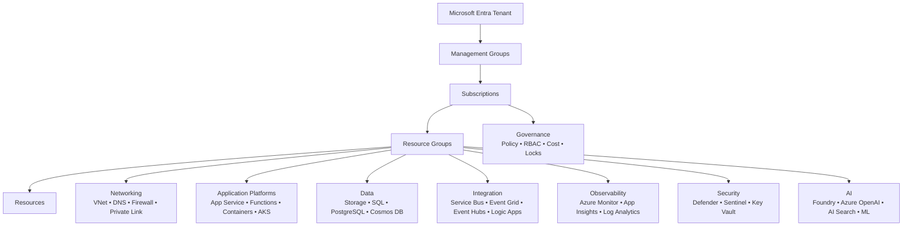
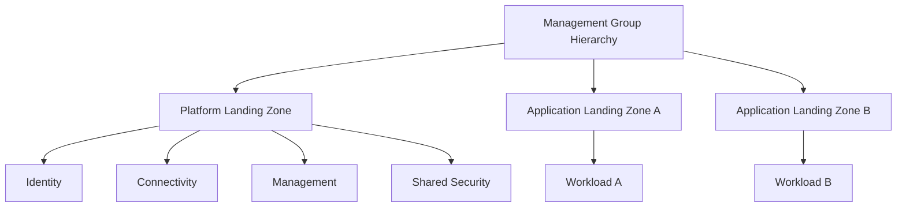

# ☁️ Azure Complete Engineering Cheatsheet
### Architecture • Development • Operations • Security • Networking • Data • AI • DevOps • Governance

> **Edition:** 2026-10-02  
> **Audience:** Software engineers, cloud engineers, platform engineers, DevOps/SRE engineers, solution architects, technical leads, and Azure learners.  
> **Goal:** one practical Markdown reference that explains **what Azure pieces exist, when to use them, how they fit together, what to avoid, and where to learn the authoritative details**.  
> **Companion document:** see [`azure_resources_cheatsheet.md`](./azure_resources_cheatsheet.md) for a deep, resource-by-resource reference (every major Azure service explained individually with concepts, networking, security, scaling, HA/DR, cost, CLI, Bicep, C# examples, and comparisons). This document stays focused on the Azure mental model and how things fit together; the companion document goes deep on each resource.

---

## 🌈 What “complete” means in this document

Azure has hundreds of services, SKUs, features, APIs, preview capabilities, regional differences, and lifecycle changes. A static cheatsheet cannot safely duplicate every API parameter or every product page forever.

This document therefore aims to be **complete at the engineering/architecture level**:

- ✅ Azure hierarchy and Resource Manager
- ✅ Landing zones and enterprise-scale organization
- ✅ Identity, RBAC, Microsoft Entra, managed identity, workload identity
- ✅ Networking from basic VNets to enterprise hub-spoke / Virtual WAN
- ✅ Private Link, DNS, routing, NAT, firewall, WAF, DDoS, Bastion
- ✅ Compute, VMs, App Service, Functions, Container Apps, AKS, ARO
- ✅ Storage, files, disks, data lake, NetApp Files, Elastic SAN, Data Box
- ✅ SQL, PostgreSQL, MySQL, Cosmos DB, Managed Redis
- ✅ Messaging, events, API management, workflow/integration services
- ✅ Analytics, Data Factory, Synapse, Databricks, Data Explorer, Fabric context
- ✅ AI, Foundry, Azure OpenAI, Search, ML, Speech, Language, Vision, Document Intelligence
- ✅ IoT, Digital Twins, IoT Hub, DPS, IoT Operations
- ✅ Hybrid/multicloud, Arc, Azure Local, VMware Solution
- ✅ Migration and modernization
- ✅ Azure Virtual Desktop
- ✅ HPC and Batch
- ✅ Monitoring, logging, tracing, KQL, alerts, Service Health, Advisor
- ✅ Defender for Cloud, Sentinel, Key Vault, confidential computing
- ✅ Policy, governance, cost/FinOps, quotas, locks, Resource Graph
- ✅ Backup, disaster recovery, resiliency, chaos engineering
- ✅ Bicep, ARM, Terraform, Deployment Stacks, CI/CD
- ✅ .NET/C# patterns and Azure SDK usage
- ✅ CLI/PowerShell/KQL quick references
- ✅ Architecture patterns, production checklist, troubleshooting playbook
- ✅ Current service-lifecycle warnings and retirement notes
- ✅ Official Microsoft Learn links for deeper study

> [!IMPORTANT]
> For **production-critical limits, quotas, SLA, pricing, regional availability, SKU behavior, API versions, preview status, or compliance**, always verify the current Microsoft documentation before implementing.

---

# 🧭 0. Azure in One Picture



### The mental model

```text
Identity decides WHO.
RBAC/Policy decide WHAT is allowed.
Networking decides HOW traffic moves.
Compute runs CODE.
Storage/Databases hold DATA.
Messaging decouples SYSTEMS.
Observability tells you WHAT HAPPENED.
Security reduces RISK.
IaC + CI/CD make changes REPEATABLE.
Governance keeps all of this CONSISTENT at scale.
```

---

# 📚 Table of Contents

1. Cloud fundamentals
2. Azure global infrastructure
3. Azure hierarchy and Resource Manager
4. Landing zones and enterprise organization
5. Naming, tagging, resource providers, quotas
6. Identity and Microsoft Entra
7. RBAC, PIM, managed identities, workload identities
8. Networking fundamentals
9. Enterprise networking and hybrid connectivity
10. DNS and name resolution
11. Network security
12. Load balancing and application delivery
13. Compute and virtual machines
14. App Service
15. Azure Functions
16. Containers, ACR, Container Apps
17. AKS and Kubernetes
18. OpenShift and specialized app platforms
19. Storage
20. Databases and caches
21. Messaging, events and integration
22. API Management
23. Analytics and data engineering
24. AI and machine learning
25. IoT and edge
26. Hybrid, multicloud and Azure Arc
27. Migration and modernization
28. Virtual desktop and end-user computing
29. HPC and Batch
30. Security services
31. Observability and operations
32. Governance and compliance
33. Cost and FinOps
34. Backup, business continuity and disaster recovery
35. Infrastructure as Code
36. CI/CD and developer platforms
37. .NET/C# on Azure
38. Architecture styles and patterns
39. Service-selection decision tables
40. Azure CLI reference
41. PowerShell reference
42. KQL reference
43. Networking ports and protocols
44. Troubleshooting playbook
45. Production-readiness checklist
46. Service lifecycle / retirement watch
47. Learning roadmap
48. Official documentation directory
49. Glossary

# 1. ☁️ Cloud Fundamentals

## IaaS vs PaaS vs SaaS vs serverless

| Model | You manage | Microsoft manages | Azure examples |
|---|---|---|---|
| **IaaS** | OS, runtime, apps, data | Physical infrastructure | Virtual Machines |
| **PaaS** | App + data + some configuration | OS/runtime/platform | App Service, Azure SQL |
| **Serverless** | Code/configuration | Most platform operations | Functions, Container Apps consumption |
| **SaaS** | Usage/configuration | Application + platform | Microsoft 365, some Microsoft cloud services |

### Prefer managed services when possible

```text
VM  →  managed PaaS  →  serverless
more control             less operational burden
```

Choose lower-level infrastructure only when the requirements justify it.

## Shared responsibility

Microsoft secures the cloud infrastructure.  
You remain responsible for responsibilities such as:

- identity configuration
- access rights
- application security
- data protection
- network configuration
- secrets
- supported runtime versions
- monitoring and incident response
- governance and compliance choices

# 2. 🌍 Azure Global Infrastructure

## Geography → Region → Availability Zone

- **Geography**: data-residency / market grouping.
- **Region**: deployment location such as Sweden Central or West Europe.
- **Availability Zone**: physically separate datacenter zone inside a supported region.
- **Region pair / paired-region concepts**: relevant to some services, but behavior is service-specific.

## Resilience vocabulary

| Term | Meaning |
|---|---|
| **SLA** | Availability commitment for a service configuration |
| **SLO** | Internal service-level objective |
| **RTO** | Maximum acceptable recovery time |
| **RPO** | Maximum acceptable data loss measured in time |
| **HA** | High availability |
| **DR** | Disaster recovery |
| **Zonal** | Placed in a specific availability zone |
| **Zone-redundant** | Service distributes across zones |
| **Geo-redundant** | Data/service replicated to another region |

## Resilience ladder

```text
Single instance
   ↓
Instance redundancy
   ↓
Zone redundancy
   ↓
Regional redundancy
   ↓
Multi-region active/passive
   ↓
Multi-region active/active
```

Higher resilience usually increases complexity and cost.

## Before choosing a region, verify

- service availability
- SKU availability
- quota
- data residency
- latency to users/dependencies
- paired/secondary-region behavior
- availability-zone support
- compliance requirements
- price differences

# 3. 🏢 Azure Hierarchy and Resource Manager

```text
Microsoft Entra tenant
└── Management group
    └── Subscription
        └── Resource group
            └── Resource
```

## Microsoft Entra tenant

Identity directory boundary containing:

- users
- groups
- app registrations
- enterprise applications / service principals
- managed identities
- authentication methods
- Conditional Access policies

## Management group

Organizes subscriptions for enterprise governance.

Use for:

- Azure Policy inheritance
- RBAC inheritance
- subscription organization
- platform vs workload separation

## Subscription

A boundary for:

- billing
- quotas
- policy/RBAC scope
- resource deployment
- lifecycle separation

Common enterprise split:

```text
Management Group
├── Platform
│   ├── Identity subscription
│   ├── Connectivity subscription
│   └── Management subscription
└── Landing Zones
    ├── Production subscriptions
    └── Non-production subscriptions
```

## Resource group

Logical lifecycle/deployment container.

Good guideline:

> Put resources together when they share ownership, lifecycle, deployment, and operational responsibility.

## Azure Resource Manager (ARM)

Azure's management/control plane.

Key concepts:

- resource provider
- resource type
- resource ID
- API version
- deployment
- tags
- locks
- RBAC
- Policy

Example resource ID:

```text
/subscriptions/<sub-id>
/resourceGroups/rg-orders-prod-swc
/providers/Microsoft.Web/sites/app-orders-prod-swc
```

## Control plane vs data plane

**Control plane**
```text
Create VM
Update firewall
Assign role
Configure database
```

**Data plane**
```text
Read blob
Query SQL
Send Service Bus message
Retrieve Key Vault secret
```

RBAC roles can differ between the two.

# 4. 🏙️ Landing Zones and Enterprise Organization

Azure Landing Zones are the recommended enterprise-scale foundation.

## Platform landing zone

Centralized shared capabilities such as:

- identity
- connectivity
- management/monitoring
- governance
- security services

## Application landing zone

Environment/subscription where an individual workload is deployed.



## Landing-zone design areas

Think about:

- billing / tenant structure
- management groups and subscriptions
- identity and access
- network topology
- security baseline
- management/monitoring
- governance
- platform automation / subscription vending
- workload onboarding

## Hub-spoke model

```text
                 ┌──────── Spoke: App A
                 │
On-prem ─ Hub ───┼──────── Spoke: App B
                 │
                 └──────── Spoke: App C
```

Hub often contains:

- VPN/ExpressRoute
- Azure Firewall
- DNS services
- Bastion
- shared routing/security appliances

## Subscription vending

Automated creation/configuration of subscriptions with standard:

- management-group placement
- policy
- RBAC
- networking
- diagnostics
- tags
- budgets

# 5. 🏷️ Naming, Tags, Providers, Quotas and Limits

## Naming strategy

Typical pattern:

```text
<type>-<workload>-<environment>-<region>-<instance>
```

Example:

```text
rg-orders-prod-swc
app-orders-prod-swc-001
kv-orders-prod-swc-001
vnet-orders-prod-swc-001
```

Storage account example:

```text
stordersprodswc001
```

## Common abbreviations

| Resource | Abbreviation |
|---|---|
| Resource Group | `rg` |
| Virtual Network | `vnet` |
| Subnet | `snet` |
| Network Security Group | `nsg` |
| Route Table | `rt` |
| Public IP | `pip` |
| Private Endpoint | `pep` |
| Network Interface | `nic` |
| NAT Gateway | `ng` |
| Azure Firewall | `afw` |
| Application Gateway | `agw` |
| Virtual Machine | `vm` |
| Virtual Machine Scale Set | `vmss` |
| App Service Plan | `asp` |
| Web App | `app` |
| Function App | `func` |
| Container App | `ca` |
| Container Apps Environment | `cae` |
| Container Registry | `cr` |
| Kubernetes Service | `aks` |
| Managed Identity | `id` |
| Key Vault | `kv` |
| Storage Account | `st` |
| Log Analytics Workspace | `log` |
| Application Insights | `appi` |
| Azure SQL Server | `sql` |
| Azure SQL Database | `sqldb` |
| Service Bus Namespace | `sbns` |
| Event Hubs Namespace | `evhns` |
| Event Grid Topic | `evgt` |
| API Management | `apim` |
| AI Search | `srch` |
| Azure OpenAI | `oai` |
| Machine Learning workspace | `mlw` |

## Tags

Recommended examples:

```text
Environment=Production
Application=Orders
Owner=PaymentsTeam
CostCenter=CC1001
BusinessCriticality=High
DataClassification=Confidential
ManagedBy=Bicep
```

Do not store secrets in tags.

## Resource providers

Examples:

```text
Microsoft.Compute
Microsoft.Network
Microsoft.Web
Microsoft.Storage
Microsoft.KeyVault
Microsoft.ContainerService
Microsoft.Sql
```

List providers:

```bash
az provider list -o table
```

Register provider:

```bash
az provider register --namespace Microsoft.Example
```

## Quotas

Azure quotas may apply per:

- subscription
- region
- resource type
- VM family
- API rate
- database throughput
- service SKU

Check quotas **before** major deployments or DR failover testing.

# 6. 👤 Microsoft Entra Identity

Microsoft Entra ID is Azure's cloud identity platform.

## Core identity objects

| Object | Purpose |
|---|---|
| User | Human identity |
| Group | Collection of users/service principals |
| App registration | Application identity definition |
| Service principal | Tenant-local representation of an application |
| Enterprise application | Portal view/configuration of service principal |
| Managed identity | Azure-managed service principal |
| External identity | Guest / B2B collaboration identity |

## Authentication vs authorization

```text
Authentication = prove who you are
Authorization  = determine what you may do
```

## Common authentication choices

Humans:
- passkeys
- MFA
- password + MFA
- certificate/smart-card scenarios

Applications:
- managed identity
- workload identity federation
- certificate credentials
- client secrets only when stronger choices are not feasible

## Conditional Access

Can evaluate conditions such as:

- user/group
- application
- location
- device state
- risk
- authentication strength

## App registrations: OAuth/OIDC concepts

Know:

- tenant ID
- client/application ID
- redirect URI
- scopes
- app roles
- delegated permissions
- application permissions
- consent
- access tokens
- ID tokens
- refresh tokens

## Microsoft Graph

Use Microsoft Graph for Microsoft 365 / Entra data and APIs where supported.

# 7. 🔑 RBAC, PIM, Managed Identity and Workload Identity

## Azure RBAC

Authorization model:

```text
Security principal + Role definition + Scope = Role assignment
```

Scopes:

```text
Management Group
  ↓
Subscription
  ↓
Resource Group
  ↓
Resource
```

## Common built-in roles

| Role | Typical meaning |
|---|---|
| Reader | View resources |
| Contributor | Manage resources, not access |
| Owner | Manage resources and access |
| User Access Administrator | Manage role assignments |
| Key Vault Secrets User | Read secrets via data plane |
| Storage Blob Data Reader | Read blob data |

Avoid broad `Owner` unless required.

## PIM — Privileged Identity Management

Use PIM for:

- just-in-time privileged access
- approval workflows
- MFA requirements
- time-limited activation
- auditability

## Managed identities

### System-assigned
Lifecycle tied to one Azure resource.

### User-assigned
Standalone identity reusable across resources.

Recommended pattern:

```text
Application
   │
   │ Managed Identity
   ▼
Key Vault / Storage / SQL / Service Bus
```

## Workload identity federation

Use federated credentials to avoid long-lived secrets for:

- GitHub Actions
- Azure DevOps
- Kubernetes workloads
- external trusted identity platforms

## AKS workload identity

Preferred pattern for pods accessing Azure services:

```text
Pod
  ↓ OIDC federation
Managed Identity / Entra workload identity
  ↓
Azure resource
```

# 8. 🌐 Networking Fundamentals

## VNet

Private Layer-3 network.

Example:

```text
10.20.0.0/16
```

## Subnet

Segment of a VNet.

```text
10.20.1.0/24  web
10.20.2.0/24  api
10.20.3.0/24  data
10.20.4.0/24  private-endpoints
```

Azure reserves addresses in each subnet.

## CIDR refresher

| CIDR | Total IPv4 addresses |
|---|---:|
| /16 | 65,536 |
| /20 | 4,096 |
| /24 | 256 |
| /26 | 64 |
| /27 | 32 |
| /28 | 16 |

## Network Interface (NIC)

Connects VM/compute resource to a subnet.

## Private IP vs Public IP

- **Private IP**: reachable within private routing domain.
- **Public IP**: internet-addressable endpoint.

## VNet peering

Private connectivity between VNets.

Important:

```text
A ↔ B
B ↔ C

does not automatically mean

A ↔ C
```

Peering is not inherently transitive.

## User Defined Routes (UDR)

Custom route table used to steer traffic.

Examples:

- default route to firewall
- route to NVA
- custom hybrid routing

## Service endpoints

Extend VNet identity to supported PaaS public endpoints.

## Private Link / Private Endpoint

Gives a supported PaaS resource a private IP endpoint inside your VNet.

Typical:

```text
App → Private DNS → Private Endpoint → Storage/SQL/Key Vault
```

## NAT Gateway

Provides scalable outbound internet SNAT for subnet workloads.

Use when you need:

- predictable outbound IP
- scalable outbound connectivity
- controlled egress identity

## Azure Bastion

Browser/secure RDP/SSH access to VMs without exposing public IPs on the VMs.

## Azure Route Server

Enables dynamic BGP route exchange between NVAs and Azure virtual networks.

# 9. 🌐 Enterprise Networking and Hybrid Connectivity

## VPN Gateway

Encrypted connectivity:

- site-to-site
- point-to-site
- VNet-to-VNet

## ExpressRoute

Private connectivity from on-premises/provider network into Microsoft cloud.

Use when you need:

- enterprise private connectivity
- predictable network path
- higher throughput/availability requirements

## Virtual WAN

Managed hub-based networking for large-scale branch/VNet connectivity.

Typical benefits:

- global transit architecture
- branch connectivity
- VPN/ExpressRoute integration
- centralized routing/security

## Azure Peering Service

Optimized connectivity between customer networks and Microsoft edge through participating service providers.

## Hub-spoke

Use when a centralized network/security team owns shared connectivity.

```text
                   Spoke A
                     |
On-prem ─ ER/VPN ─ Hub ─ Spoke B
                     |
                   Spoke C
```

## Virtual WAN vs classic hub-spoke

| Need | Consider |
|---|---|
| Highly customized hub architecture | Hub-spoke VNet |
| Managed global transit / branches | Virtual WAN |
| Large SD-WAN integration | Virtual WAN |
| Fine control over NVA topology | Hub-spoke may fit better |

## Network Virtual Appliance (NVA)

Third-party or self-managed virtual network appliance.

Examples:

- firewall appliance
- SD-WAN
- IDS/IPS
- routing appliance

Use only when Azure-native services do not meet requirements or organizational standards demand it.

# 10. 🌐 DNS and Name Resolution

## Azure DNS

Hosts public DNS zones.

## Private DNS Zones

Private DNS resolution for VNets.

Common Private Link flow:

```text
Client
  ↓
DNS query
  ↓
Private DNS zone
  ↓
10.x.x.x private endpoint
  ↓
Azure PaaS service
```

## Azure DNS Private Resolver

Managed DNS resolution between Azure and on-premises without deploying DNS VMs.

Use for:

- inbound DNS queries from on-prem
- outbound DNS forwarding from Azure
- hybrid name resolution

## Private Endpoint DNS rule

A private endpoint without correct DNS is one of the most common Azure networking failures.

Always validate:

```bash
nslookup <service-hostname>
```

Expected result should resolve to the intended private IP when queried from the private network.

# 11. 🛡️ Network Security

## NSG

Stateful Layer-3/4 filtering.

Rule fields:

- priority
- source
- destination
- protocol
- source port
- destination port
- allow/deny

## Application Security Groups

Logical grouping for VM NICs so NSG rules can reference application groups rather than individual IPs.

## Azure Firewall

Managed stateful network firewall.

Capabilities vary by SKU and can include:

- network rules
- application rules
- DNAT
- threat intelligence
- TLS inspection in supported premium scenarios
- IDPS in supported premium scenarios

## Firewall Manager

Central management of firewall/security policies across network environments.

## Web Application Firewall (WAF)

Protects HTTP(S) applications against common web attacks.

Available with:

- Application Gateway
- Azure Front Door

## DDoS Protection

Azure provides platform-level protection plus optional enhanced DDoS plans.

Use dedicated DDoS protection for workloads requiring enhanced telemetry, tuning, support, and protection features.

## Network Watcher

Tools for:

- topology
- connection troubleshooting
- packet capture
- NSG flow-related diagnostics
- connection monitor
- next-hop checks

## Virtual Network Manager

Centralized management of connectivity/security configuration across many VNets.

# 12. ⚖️ Load Balancing and Application Delivery

| Service | Layer | Scope | Best for |
|---|---|---|---|
| **Load Balancer** | L4 | Regional | TCP/UDP load balancing |
| **Application Gateway** | L7 | Regional | HTTP(S), WAF, path/host routing |
| **Front Door** | L7 | Global edge | Global HTTP(S), acceleration, WAF, failover |
| **Traffic Manager** | DNS | Global | DNS-based endpoint routing |

## Azure Load Balancer

Use for:

- internal/public TCP/UDP
- VM/VMSS load balancing
- low-level network traffic

> [!WARNING]
> **Basic Load Balancer and Basic Public IP were retired on September 30, 2025.** Always deploy **Standard SKU** Load Balancer and Public IP. Standard SKU is secure-by-default (explicit NSG required to allow traffic) and zone-redundant by configuration; Basic was not. If you inherit an old design referencing Basic SKU, treat it as a required migration, not an option.

## Application Gateway

Use for:

- TLS termination
- host/path routing
- WAF
- private or public regional web ingress

## Front Door

Use for:

- global edge entry
- CDN-like acceleration/caching
- global failover
- WAF
- multi-region APIs/web apps
- Private Link to supported origins

## Traffic Manager

DNS-based routing methods such as:

- priority
- performance
- weighted
- geographic
- multi-value

Traffic Manager does not proxy application traffic; DNS determines which endpoint the client reaches.

# 13. 🖥️ Compute and Virtual Machines

## Virtual Machines

Use when you need:

- full OS control
- custom drivers
- legacy workloads
- specialized software
- unsupported PaaS requirements

Key concepts:

- VM size/family
- generation
- image
- managed disk
- NIC
- extensions
- availability zones
- proximity placement groups
- dedicated hosts
- spot VMs
- reservations/savings plans

## Virtual Machine Scale Sets

Manage fleets of VMs.

Use for:

- horizontal scaling
- autoscale
- stateless compute pools
- custom image-based workloads

## Azure Compute Gallery

Store/version/share:

- VM images
- image definitions
- image versions

## Dedicated Hosts

Physical host dedicated to one customer.

Use for licensing/compliance/isolation needs.

## Spot VMs

Discounted interruptible compute.

Good for:

- batch
- stateless workers
- CI jobs
- fault-tolerant processing

Bad for:

- non-interruptible critical workloads

# 14. 🌐 App Service

Managed web application platform.

Great default for:

- ASP.NET Core APIs
- web apps
- REST APIs
- Node/Java/Python/PHP workloads
- containerized web apps

## App Service Plan

Defines compute capacity.

```text
App Service Plan
├── Web App A
├── Web App B
└── Web App C
```

## Important features

- deployment slots
- autoscale
- health check
- custom domains
- TLS certificates
- managed identity
- VNet integration
- private endpoints
- application settings
- backup features depending on configuration/SKU
- diagnostics

## Networking distinction

**VNet Integration**
```text
App → private resources in VNet
```

**Private Endpoint**
```text
Private clients → App privately
```

They solve different directions.

## Deployment slots

```text
Build
  ↓
Deploy to staging
  ↓
Smoke test
  ↓
Swap
  ↓
Production
```

## CLI

```bash
az webapp list -o table

az webapp restart   --resource-group <rg>   --name <app>

az webapp log tail   --resource-group <rg>   --name <app>
```

# 15. ⚡ Azure Functions

Serverless event-driven compute.

## Hosting plans

| Plan | Scaling | Cold start | VNet integration | Best for |
|---|---|---|---|---|
| **Consumption** | Event-driven, per-execution billing | Yes | Limited | Spiky/low-volume workloads, lowest cost at low scale |
| **Flex Consumption** | Fast event-driven scaling, per-instance concurrency control | Reduced (always-ready instances optional) | Yes (VNet integration built in) | Modern default for most new serverless apps needing VNet + fast scale-out |
| **Premium** | Pre-warmed + elastic scale | Minimal | Yes | Steady workloads needing VNet, no cold start, longer execution |
| **Dedicated (App Service plan)** | Manual/autoscale like App Service | No (always on) | Yes | Predictable load, sharing a plan with other apps |
| **Container Apps-hosted Functions** | KEDA-based | Varies | Yes | Functions packaged as containers inside Container Apps |

> Flex Consumption is the newer, generally recommended consumption-style plan for new designs that need per-instance concurrency, private networking, and faster scale-out than classic Consumption. Verify current regional availability before committing.

## Common triggers

- HTTP
- Timer
- Blob
- Queue Storage
- Service Bus
- Event Hubs
- Event Grid
- Cosmos DB

## Trigger vs binding

```text
Trigger = starts execution
Binding = declarative input/output integration
```

## Durable Functions

Use for stateful serverless orchestration patterns:

- function chaining
- fan-out/fan-in
- async HTTP APIs
- monitoring
- human interaction

## Typical architecture

```text
HTTP Function
   ↓
Service Bus
   ↓
Worker Function
   ↓
Database
```

## Important design concerns

- idempotency
- retries
- poison/dead-letter handling
- timeout limits for chosen hosting model
- concurrency
- cold-start behavior
- downstream throttling
- observability

# 16. 📦 Containers, ACR and Azure Container Apps

## Azure Container Registry (ACR)

Private OCI/container registry.

Use for:

- Docker/OCI images
- Helm/OCI artifacts
- private image distribution
- image build workflows

CLI:

```bash
az acr login --name <registry>

az acr build   --registry <registry>   --image myapp:1.0.0   .
```

## Azure Container Instances (ACI)

Run containers without managing VMs/orchestration.

Good for:

- short-lived jobs
- simple isolated container workloads
- burst scenarios

## Azure Container Apps

Managed application container platform.

Good for:

- microservices
- APIs
- background workers
- event-driven containers
- scale to zero
- jobs
- revision-based deployments

Key features:

- revisions
- traffic splitting
- ingress
- managed identities
- secrets
- KEDA-based scaling
- Dapr integration
- jobs

## Container Apps vs App Service vs Functions

| Need | Prefer |
|---|---|
| Traditional web app/API | App Service |
| Event-triggered functions | Functions |
| Arbitrary container + autoscaling | Container Apps |
| Full Kubernetes control | AKS |

# 17. ☸️ AKS and Kubernetes

Azure Kubernetes Service is managed Kubernetes.

## AKS Automatic vs AKS Standard

| | **AKS Automatic** | **AKS Standard (Base)** |
|---|---|---|
| Node management | Microsoft-managed node pools, auto-provisioned | You choose/manage node pools and VM sizes |
| Cluster configuration | Secure, opinionated defaults (networking, security, scaling) baked in | Full control over every setting |
| Best for | Teams that want Kubernetes without owning cluster-ops decisions | Teams needing custom networking, node SKUs, or add-ons AKS Automatic doesn't expose |
| Control trade-off | Less day-2 operational burden | More flexibility, more operational responsibility |

Start with **AKS Automatic** unless you have a concrete reason to need the extra control of Standard AKS.

## Use AKS when you genuinely need

- Kubernetes API/ecosystem
- operators/CRDs
- sophisticated scheduling
- sidecars/service mesh
- platform engineering
- advanced cluster networking
- multi-team shared container platform

Do **not** start with AKS merely because Kubernetes is popular.

## Core objects

| Kubernetes object | Purpose |
|---|---|
| Pod | Runtime unit |
| Deployment | Stateless replicated workload |
| StatefulSet | Stateful pods |
| DaemonSet | One pod per node |
| Service | Stable service endpoint |
| ConfigMap | Non-secret configuration |
| Secret | Sensitive configuration |
| Ingress/Gateway | HTTP routing |
| HPA | Horizontal pod autoscaling |
| PDB | Pod disruption budget |
| PV/PVC | Persistent storage |
| Namespace | Logical partition |

## AKS architecture concerns

- system vs user node pools
- cluster autoscaler
- node autoscaling
- workload identity
- private clusters
- network model
- egress control
- Azure Policy for Kubernetes
- secrets integration
- ingress/gateway
- monitoring
- image provenance/security
- upgrade strategy
- pod disruption budgets
- availability zones

## Networking choices

Understand:

- Azure CNI variants
- pod IP behavior
- service CIDR
- DNS service IP
- load balancers
- network policies

## Identity

Prefer workload identity rather than client secrets inside pods.

## Container insights

Use Azure Monitor / managed observability integrations as appropriate.

# 18. 🧩 OpenShift and Specialized Application Platforms

## Azure Red Hat OpenShift (ARO)

Managed OpenShift jointly supported by Microsoft and Red Hat.

Use if your organization standardizes on OpenShift or requires Red Hat platform capabilities.

## Azure Spring Apps lifecycle warning

> [!WARNING]
> Azure Spring Apps is in retirement. Microsoft announced retirement for **March 31, 2028** and recommends migration to **Azure Container Apps** or **AKS** for relevant workloads.

Do not choose Azure Spring Apps for a new long-lived architecture without reviewing the current retirement guidance.

## Service Fabric

Azure Service Fabric remains relevant for some existing/stateful distributed systems and Microsoft workloads.

For new projects, compare requirements carefully against:

- Container Apps
- AKS
- App Service
- Functions

# 19. 💾 Storage

## Azure Storage account services

| Service | Use |
|---|---|
| Blob Storage | Object storage |
| Azure Files | SMB/NFS file shares |
| Queue Storage | Simple message queues |
| Table Storage | NoSQL key/attribute storage |
| Managed Disks | VM block storage |

## Blob Storage

Good for:

- files
- images
- backups
- logs
- documents
- static assets
- data lake storage

### Access tiers

- Hot
- Cool
- Cold
- Archive

Choose based on:

- access frequency
- retrieval latency
- retention
- transaction cost
- storage cost

## Redundancy

Common concepts:

- LRS
- ZRS
- GRS
- RA-GRS
- GZRS
- RA-GZRS

Check support for the exact account/service/region.

## Azure Data Lake Storage Gen2

Blob Storage capabilities plus hierarchical namespace for analytics/data-lake scenarios.

## Azure Files

Managed SMB/NFS shares.

Use for:

- lift-and-shift file shares
- shared application files
- Windows/Linux file workloads

## Azure File Sync

Caches/synchronizes Azure Files with Windows Server endpoints.

## Managed Disks

Disk types include different performance/cost tiers.

Use for VM OS/data disks.

## Azure NetApp Files

Enterprise managed file storage supporting demanding NFS/SMB workloads.

## Azure Managed Lustre

High-performance parallel filesystem for HPC workloads.

## Azure Elastic SAN

Managed storage-area-network style block storage for supported workloads.

## Azure Data Box

Physical/data-transfer products for moving large data volumes when network transfer is impractical.

## Storage security

Prefer:

```text
Managed Identity
+ Azure RBAC
+ Private Endpoint when appropriate
+ disable unnecessary public access
```

Avoid account keys in application configuration unless required.

# 20. 🗄️ Databases and Caches

## Azure SQL family

### Azure SQL Database
Managed relational database.

Best for:
- modern SQL Server-compatible applications
- PaaS operational simplicity

### Azure SQL Managed Instance
More instance-level SQL Server compatibility.

Best for:
- migrations needing instance-level features

### SQL Server on Azure VM
Full OS/SQL control.

Best for:
- legacy/specialized requirements

## Azure Database for PostgreSQL

Managed PostgreSQL, deployed as **Flexible Server** (the only current deployment option — **Single Server retired September 2025**; **Hyperscale (Citus)** is now offered as the Elastic Clusters feature of Flexible Server).

Use when:
- PostgreSQL is the application/database standard
- you want managed HA/backup/patching capabilities

## Azure Database for MySQL

Managed MySQL, deployed as **Flexible Server** (the only current deployment option — **Single Server reached end of life September 16, 2024** and no longer accepts new deployments or exists in most regions).

## Cosmos DB

Distributed NoSQL database service.

Important concepts:

- account
- database
- container
- item
- partition key
- throughput
- consistency level
- change feed
- global distribution

### Partition key is an architecture decision

Bad partitioning can cause:

- hot partitions
- poor scale
- high cost
- throttling

## Azure Managed Redis

Managed Redis offering for modern caching/in-memory scenarios.

> [!WARNING]
> **Azure Cache for Redis is on a retirement path.** Microsoft recommends migration to **Azure Managed Redis**. Current public-cloud retirement dates include:
>
> - Enterprise / Enterprise Flash: **March 31, 2027**
> - Basic / Standard / Premium: **September 30, 2028**

For new designs, evaluate Azure Managed Redis rather than assuming the older Azure Cache for Redis service is the target.

## Database decision tree

```text
Relational?
├── SQL Server ecosystem → Azure SQL
├── PostgreSQL → Azure Database for PostgreSQL
└── MySQL → Azure Database for MySQL

Globally distributed NoSQL?
└── Cosmos DB

In-memory cache?
└── Azure Managed Redis
```

## Data design questions

Before choosing:
- relational vs document/key-value?
- transactions?
- consistency?
- partitioning?
- query pattern?
- throughput?
- geo-distribution?
- recovery requirements?
- private networking?
- encryption/key requirements?

# 21. 📨 Messaging, Events and Integration

## Fast mental model

```text
Business command / reliable broker → Service Bus
Event notification / event routing → Event Grid
High-throughput event stream       → Event Hubs
Simple queue                       → Storage Queue
Workflow/orchestration             → Logic Apps
```

## Service Bus

Enterprise broker.

Features can include:

- queues
- topics/subscriptions
- dead-letter queues
- sessions
- duplicate detection
- scheduled delivery
- transactions in supported scenarios

Use for:
- order commands
- business workflows
- decoupled processing
- reliable messaging

## Event Grid

Event routing / pub-sub.

Think:

```text
Something happened.
```

Examples:
- blob created
- resource changed
- domain event
- webhook event

Event Grid also has MQTT capabilities for applicable eventing/IoT scenarios.

## Event Hubs

High-throughput append-style event streaming.

Good for:
- telemetry
- logs
- clickstreams
- IoT ingestion
- streaming analytics

Key ideas:
- partitions
- consumer groups
- offsets/checkpoints
- capture

## Storage Queue

Simple queue with Storage integration.

Use when advanced broker capabilities are unnecessary.

## Logic Apps

Managed workflow/integration service.

Good for:
- SaaS connectors
- workflow automation
- enterprise integration
- event-driven orchestration
- B2B/integration scenarios

## Azure Relay

Connect cloud applications to services behind firewalls/NAT without opening inbound ports in traditional ways.

## Web PubSub

Managed real-time WebSocket/pub-sub service.

Use for:
- live dashboards
- chat
- real-time notifications

## Azure SignalR Service

Managed SignalR backplane/service for ASP.NET Core SignalR applications.

## Azure Communication Services

APIs/services for communication scenarios such as voice, video, chat, SMS/email features depending on current service capabilities and region.

# 22. 🚪 API Management

API Management (APIM) is an API gateway and management platform.

```text
Client
   ↓
API Management
   ↓
Backend APIs
```

## Common capabilities

- gateway routing
- JWT validation
- rate limits / quotas
- caching
- header transformation
- request/response transformation
- API versioning
- products/subscriptions
- developer portal
- policy enforcement
- observability

## Common policy ideas

```xml
<validate-jwt />
<rate-limit />
<set-header />
<rewrite-uri />
<cache-lookup />
<cache-store />
```

## Architecture rule

Put cross-cutting gateway concerns in APIM.

Avoid moving core domain/business logic into API gateway policies.

## Common deployment patterns

- public APIM
- internal/private APIM
- APIM + Front Door
- APIM + Application Gateway
- APIM in enterprise landing zones

Validate networking/SKU requirements carefully.

# 23. 📊 Analytics and Data Engineering

Azure data architecture spans ingestion, transformation, storage, analytics and visualization.

## Typical pipeline

```text
Sources
  ↓
Ingestion
  ↓
Data Lake
  ↓
Transform / Compute
  ↓
Warehouse / Lakehouse / Serving
  ↓
BI / ML / Apps
```

## Azure Data Factory

Managed data integration / orchestration.

Use for:
- ETL/ELT orchestration
- copying data
- pipeline scheduling
- hybrid data movement

## Azure Synapse Analytics

Analytics platform combining data warehousing, SQL, Spark and integration capabilities.

Evaluate current Microsoft data-platform direction and workload fit before selecting a new architecture.

## Azure Databricks

Managed Databricks platform for:

- Spark
- lakehouse
- streaming
- ML/data science
- data engineering

## Azure Data Explorer

High-performance analytics for log/telemetry/time-series/event data using Kusto Query Language.

Excellent for:
- telemetry
- IoT
- observability-style datasets
- high-volume event analytics

## Azure Stream Analytics

Real-time stream processing using SQL-like query model.

## Microsoft Fabric context

Microsoft Fabric is a SaaS analytics platform in the broader Microsoft data ecosystem.

When designing a new analytics platform, compare:

- Fabric
- Databricks
- Synapse capabilities
- Data Factory
- Azure Data Explorer

based on organizational platform strategy, governance, data volume, latency, skills, and integration requirements.

## Data governance

Microsoft Purview provides data governance, discovery/classification and related capabilities across supported data estates.

# 24. 🧠 AI and Machine Learning

Azure AI changes rapidly. Verify current naming and service availability before implementing.

## Microsoft Foundry

Microsoft's platform/tooling ecosystem for building AI applications and agents.

Areas include:

- model catalog/inference
- Azure OpenAI models
- agent services
- evaluation
- observability
- safety tooling
- project organization

## Azure OpenAI

Managed access to supported OpenAI models through Azure.

Design concerns:

- model/version availability
- region
- throughput/quota
- latency
- content filtering
- network access
- identity
- prompt injection
- data handling
- observability
- evaluation

## Azure AI Search

Search platform supporting:

- lexical/full-text search
- semantic capabilities
- vector search
- hybrid retrieval
- filtering/faceting
- RAG retrieval

## RAG

```text
Documents
   ↓
Parse / chunk
   ↓
Embeddings
   ↓
Search/vector index
   ↓
Retrieve relevant context
   ↓
LLM
   ↓
Grounded answer
```

## Foundry tools / AI services

Common categories include:

- Speech
- Language
- Translator
- Vision
- Document Intelligence
- Content Safety / safety tooling
- content understanding capabilities where available

## Azure Machine Learning

Use for custom ML lifecycle:

- training
- experiments
- model registry
- managed compute
- endpoints
- MLOps

## AI architecture checklist

- [ ] define quality metric
- [ ] evaluate model choices
- [ ] secure credentials with identity
- [ ] protect sensitive data
- [ ] use private networking if required
- [ ] rate limit/cost guardrails
- [ ] prompt injection defenses
- [ ] grounding/citation strategy
- [ ] evaluation dataset
- [ ] model/version change strategy
- [ ] telemetry with privacy controls
- [ ] human review where risk requires it

# 25. 🌐 IoT and Edge

## Azure IoT Hub

Managed secure bidirectional device communication hub.

Supports patterns such as:

- device-to-cloud
- cloud-to-device
- device twins
- direct methods
- file upload
- routing

## Device Provisioning Service (DPS)

Zero-touch / just-in-time provisioning of devices to IoT Hub.

Useful at fleet scale.

## Azure Digital Twins

Model physical environments/assets as digital twin graphs.

Use for:
- factories
- buildings
- energy networks
- connected infrastructure

## Azure IoT Operations

Edge-oriented IoT capabilities running on Azure Arc-enabled Kubernetes for adaptive-cloud scenarios.

## Azure IoT Central

IoT application platform for faster fleet/app scenarios.

## Typical IoT architecture

```text
Sensors / Devices
      ↓
IoT Hub / Edge
      ↓
Event Hubs / Event Grid
      ↓
Data Explorer / Databricks / Fabric
      ↓
Apps / Dashboards / ML
```

## IoT security concerns

- device identity
- certificate lifecycle
- secure provisioning
- firmware/update strategy
- per-device authorization
- network segmentation
- telemetry validation
- fleet rollout rings

# 26. 🌉 Hybrid, Multicloud and Azure Arc

## Azure Arc

Extends Azure management/governance to supported resources outside Azure.

Use for:

- on-prem servers
- other clouds
- Kubernetes
- data/management scenarios supported by Arc

Benefits can include:

- centralized inventory
- policy
- security integration
- monitoring
- Azure control-plane management

## Azure Local

Azure-integrated infrastructure for running workloads in customer locations/edge environments.

Use when:
- low latency
- disconnected/edge requirements
- regulatory/data location
- hybrid operations

## Azure VMware Solution

Run VMware environments on dedicated Azure infrastructure.

Useful for:
- VMware migration
- datacenter exit
- modernization transition

## Hybrid operating model

```text
Azure
On-prem
Edge
Other clouds
   ↓
Unified identity + policy + monitoring + security
```

# 27. 🚚 Migration and Modernization

## Azure Migrate

Central hub for discovery, assessment and migration tooling for supported workloads.

## Migration stages

```text
Discover
  ↓
Assess
  ↓
Plan dependencies
  ↓
Migrate
  ↓
Validate
  ↓
Optimize
  ↓
Modernize
```

## Migration strategies

Common "R" patterns:

- Rehost
- Replatform
- Refactor
- Rearchitect
- Rebuild
- Replace
- Retain
- Retire

## Database migration

Use service-specific migration tooling and validate:

- feature compatibility
- downtime
- data consistency
- performance
- cutover
- rollback

## Modernization path example

```text
VM-hosted .NET app
   ↓
App Service / Container Apps
   ↓
Managed Identity
   ↓
Azure SQL
   ↓
Service Bus
   ↓
Azure Monitor
```

# 28. 🖥️ Azure Virtual Desktop

Azure Virtual Desktop provides desktop and application virtualization on Azure.

Concepts:

- host pool
- session host
- application group
- workspace
- FSLogix profile containers
- identity/join model

Use for:

- full Windows desktops
- RemoteApp
- multi-session scenarios
- secure remote workforce
- specialized desktop environments

> [!NOTE]
> Azure Virtual Desktop **classic** reached retirement on **September 30, 2026**. Use ARM-based Azure Virtual Desktop resources.

## Azure Lab Services lifecycle

Azure Lab Services is scheduled for retirement on **June 28, 2027**. Review Microsoft transition guidance for current lab/training scenarios.

# 29. 🧮 HPC, Batch and Specialized Compute

## Azure Batch

Managed scheduling/execution for large parallel and batch workloads.

Use for:

- rendering
- simulations
- scientific compute
- parameter sweeps
- large parallel processing

## Azure Managed Lustre

High-performance parallel storage for HPC.

## CycleCloud

HPC cluster orchestration for supported schedulers and workloads.

## HPC design concerns

- VM families
- GPU/accelerator selection
- InfiniBand/RDMA where supported
- placement
- scale sets
- storage throughput
- job scheduler
- spot capacity
- quota
- data movement

# 30. 🔐 Security Services

## Microsoft Defender for Cloud

Cloud security posture management and workload protection capabilities depending on enabled plans.

Use for:

- security recommendations
- posture
- regulatory/compliance views
- workload threat protection
- vulnerability/security insights

## Microsoft Sentinel

Cloud-native SIEM/SOAR.

Use for:

- security analytics
- incidents
- hunting
- automation/playbooks
- multi-source log correlation

## Key Vault

Stores/manages:

- secrets
- keys
- certificates

Preferred application pattern:

```text
App
  ↓ Managed Identity
Key Vault
```

## Managed HSM

Dedicated managed hardware security module service for cryptographic keys in scenarios requiring HSM isolation/control.

## Confidential computing

Protects data-in-use through hardware-backed trusted execution environments for supported compute scenarios.

## Defender for IoT

Security monitoring/protection for IoT/OT scenarios.

## Security baseline

- MFA/passkeys for humans
- PIM for privileged roles
- least privilege
- managed identity
- private endpoints where justified
- firewall/WAF
- vulnerability management
- secure software supply chain
- centralized logging
- incident response runbooks
- encryption at rest/in transit
- key rotation
- backup protection

# 31. 📊 Observability and Operations

## Azure Monitor

Umbrella monitoring platform.

Includes/integrates with:

- metrics
- logs
- alerts
- dashboards/workbooks
- Application Insights
- Log Analytics
- managed Prometheus scenarios
- Container Insights
- VM Insights

## Application Insights

Application Performance Monitoring (APM):

- requests
- dependencies
- traces
- exceptions
- availability
- distributed tracing
- performance

## Log Analytics workspace

Central log-query workspace using KQL.

## Azure Monitor alerts

Alert types can be based on:

- metrics
- log queries
- activity log
- resource health
- service health

## Action Groups

Alert actions:

- email/SMS/push where supported
- webhook
- Logic App
- Function
- ITSM integrations
- automation actions

## Service Health

Personalized view of Azure service incidents, planned maintenance, advisories relevant to your subscriptions.

## Resource Health

Health of a specific Azure resource.

## Azure Advisor

Recommendations for areas such as:

- cost
- reliability
- performance
- security
- operational excellence

## Change Analysis / activity history

Always check recent resource/configuration/deployment changes during incidents.

## Azure Managed Grafana

Managed Grafana service for dashboarding/observability.

## Chaos Studio

Controlled fault injection for resiliency testing.

## Azure Update Manager

Manage/update supported VMs and Arc-enabled servers.

## Azure Automation

Runbooks and process automation for supported operational tasks.

# 32. 🏛️ Governance and Compliance

## Azure Policy

Audit or enforce resource configuration.

Effects can include scenarios such as:

- audit
- deny
- modify
- deployIfNotExists
- append

Use for:
- allowed regions
- required tags
- secure configuration
- public network restrictions
- diagnostic settings
- resource-type restrictions

## Initiative

Collection of policy definitions.

## Management Groups

Primary enterprise scope for applying policy/RBAC across subscriptions.

## Resource Locks

- `CanNotDelete`
- `ReadOnly`

Use carefully—locks can break deployment/operations.

## Azure Resource Graph

Query inventory across many subscriptions.

Example:

```kusto
Resources
| summarize count() by type
| order by count_ desc
```

## Deployment Stacks

Manage a collection of ARM/Bicep resources as a unit with lifecycle/deny settings.

## Template Specs

Store and version ARM templates in Azure.

> [!WARNING]
> Azure Blueprints is retiring **January 31, 2027**. Microsoft recommends migration to **Deployment Stacks** plus **Template Specs** (or Git for template versioning).

## Microsoft Purview

Data governance/compliance capabilities across supported Microsoft/data environments.

## Compliance

Always confirm current service certifications, region support, and organizational legal requirements rather than assuming "Azure compliant" automatically makes a workload compliant.

# 33. 💰 Cost and FinOps

Cloud cost is an engineering input.

## Azure Cost Management

Use for:

- cost analysis
- budgets
- alerts
- exports
- allocation views

## Cost drivers

```text
Compute time
Database tier / throughput
Storage capacity
Transactions
Network egress
Log ingestion
Retention
Backups
AI tokens / inference
Managed service tiers
```

## Common surprises

- oversized VMs
- forgotten non-prod
- excessive App Insights/log volume
- cross-region traffic
- public internet egress
- premium database tiers
- overprovisioned Cosmos throughput
- unused disks/IPs
- always-on dev clusters
- duplicate observability data

## FinOps practices

- tag or allocate costs
- budgets
- rightsizing
- autoscaling
- reservations/savings plans where suitable
- storage lifecycle rules
- log filtering/retention policy
- non-prod schedules
- anomaly review
- architecture cost estimates before launch

## Tradeoff

```text
Cost ↔ Reliability ↔ Performance ↔ Security ↔ Operational simplicity
```

Do not optimize cost by destroying required reliability/security.

# 34. 💾 Backup, BCDR and Resilience

## Backup ≠ HA ≠ DR

```text
High availability = stay available during failures
Backup            = restore previous state/data
Disaster recovery = recover from major outage/disaster
```

## Azure Backup

Managed backup service for supported workloads.

## Site Recovery

Replication/failover orchestration for supported VM/disaster recovery scenarios.

## Resilience design

Document:

- RTO
- RPO
- dependency map
- zone failure behavior
- regional failure behavior
- data replication
- failover
- failback
- backup retention
- restore procedure
- owners
- test schedule

## Resiliency testing

Test:
- dependency timeout
- DNS failure
- database failover
- queue backlog
- zone outage assumptions
- regional failover
- secret/certificate expiry
- quota exhaustion
- downstream throttling

## Key rule

> A backup strategy that has never been restored is not proven.

# 35. 🧱 Infrastructure as Code

## Bicep

Azure-native declarative IaC language.

Example:

```bicep
param location string = resourceGroup().location

resource storage 'Microsoft.Storage/storageAccounts@2025-01-01' = {
  name: 'stexampledev001'
  location: location
  sku: {
    name: 'Standard_LRS'
  }
  kind: 'StorageV2'
}
```

> Verify supported API versions for your target resource before production use.

## ARM templates

JSON-based Azure Resource Manager templates.

Useful as:
- native deployment representation
- generated output from Bicep
- compatibility format

## Terraform

Cloud-agnostic IaC ecosystem.

Use when:
- organization standardizes on Terraform
- multi-cloud/shared tooling matters
- provider ecosystem meets requirements

## Deployment Stacks

Use to manage resource collections and lifecycle behavior.

## IaC principles

- Git source of truth
- pull-request review
- no embedded secrets
- modules
- environment parameterization
- lint/validate
- `what-if` / plan before apply
- policy checks
- drift strategy
- deployment history

# 36. 🚀 CI/CD and Developer Platforms

## Typical pipeline

```text
Commit
  ↓
Build
  ↓
Unit tests
  ↓
Static analysis/security scans
  ↓
Package/image
  ↓
IaC plan/what-if
  ↓
Deploy non-prod
  ↓
Integration tests
  ↓
Approval/gate when required
  ↓
Deploy prod
  ↓
Observe
```

## GitHub Actions

Use OIDC/workload federation rather than storing Azure client secrets when possible.

## Azure DevOps

Key services:

- Repos
- Pipelines
- Boards
- Artifacts
- Test Plans

## Azure Artifacts

Package feeds for supported ecosystems.

## Azure Dev Center / Deployment Environments

Developer self-service and environment-management capabilities for supported organizational scenarios.

## Azure Load Testing

Managed load-testing capabilities for performance validation.

## Deployment strategies

- rolling
- blue/green
- canary
- ring deployment
- App Service slot swap
- Container Apps revision traffic splitting

## Supply-chain security

Include:
- dependency scanning
- secret scanning
- SBOM where required
- signed artifacts/images where applicable
- protected branches
- provenance/attestation where supported

# 37. 💜 .NET / C# on Azure

## Recommended application shape

```text
Front Door
   ↓
App Service / Container Apps
   ↓
Managed Identity
   ├─ Key Vault
   ├─ Azure SQL
   ├─ Blob Storage
   └─ Service Bus

Application Insights / OpenTelemetry
```

## Azure Identity

```csharp
using Azure.Identity;

var credential = new DefaultAzureCredential();
```

Typical behavior:

```text
Local development → developer identity / CLI / IDE
Azure runtime      → managed identity
```

## Key Vault

```csharp
using Azure.Identity;
using Azure.Security.KeyVault.Secrets;

var client = new SecretClient(
    new Uri("https://my-vault.vault.azure.net/"),
    new DefaultAzureCredential());

KeyVaultSecret secret =
    await client.GetSecretAsync("MySecret");
```

## Blob Storage

```csharp
using Azure.Identity;
using Azure.Storage.Blobs;

var service = new BlobServiceClient(
    new Uri("https://mystorage.blob.core.windows.net"),
    new DefaultAzureCredential());
```

## Service Bus

```csharp
using Azure.Identity;
using Azure.Messaging.ServiceBus;

await using var client = new ServiceBusClient(
    "my-namespace.servicebus.windows.net",
    new DefaultAzureCredential());

ServiceBusSender sender = client.CreateSender("orders");
await sender.SendMessageAsync(
    new ServiceBusMessage("{\"orderId\":\"123\"}"));
```

## Structured logging

Prefer:

```csharp
logger.LogInformation(
    "Processed order {OrderId} for customer {CustomerId}",
    orderId,
    customerId);
```

Avoid losing structured properties through string interpolation:

```csharp
logger.LogInformation(
    $"Processed order {orderId} for customer {customerId}");
```

## Health checks

Typical endpoints:

```text
/liveness  process can run
/readiness safe to receive traffic
```

## Resilience

For outbound HTTP:
- timeouts
- retries for transient failures only
- backoff + jitter
- circuit breaking where appropriate
- idempotency for retried operations

## Configuration

Keep:
- non-secret settings in app configuration/environment variables
- secrets in Key Vault
- credentials via managed identity

## OpenTelemetry

Prefer standardized distributed telemetry where it fits your platform/monitoring strategy.

# 38. 🏗️ Architecture Styles and Cloud Patterns

## Architecture styles

Common styles:

- layered / N-tier
- web-queue-worker
- microservices
- event-driven
- serverless
- big data
- CQRS/event-sourced systems where justified

## Queue-based load leveling

```text
API
 ↓
Queue
 ↓
Workers
```

Absorbs spikes.

## Competing consumers

```text
Queue
├─ Worker 1
├─ Worker 2
└─ Worker 3
```

## Retry

Use for transient faults only.

```text
retry delay:
1s → 2s → 4s → 8s
+ jitter
```

## Circuit breaker

Stop hammering a failing dependency.

## Cache-aside

```text
Request
  ↓
Cache?
├─ hit → return
└─ miss
    ↓
 Database
    ↓
 Cache
    ↓
 Return
```

## Bulkhead

Isolate resources so one failing dependency/workload does not exhaust everything.

## Outbox

Store domain change + outgoing integration event reliably in a single local transaction, then publish asynchronously.

## Saga

Coordinate distributed business transactions without a global distributed transaction.

## Idempotency

Repeated operation produces the same effective result.

Essential for:
- retries
- messaging
- payment/order APIs

## Strangler Fig

Incrementally replace a legacy system by routing features to new implementations.

## Event-driven caution

Events create:
- eventual consistency
- retries
- duplicates
- ordering questions
- schema evolution
- observability complexity

Design these explicitly.

# 39. 🎯 Service Selection Decision Tables

## Application hosting

| Requirement | Start with |
|---|---|
| Web app/API | App Service |
| Event-driven code | Functions |
| Arbitrary container workloads | Container Apps |
| Kubernetes control/ecosystem | AKS |
| OpenShift standard | ARO |
| Full OS control | VMs |
| Batch/parallel jobs | Batch |
| Simple short-lived container | ACI |

## Networking

| Requirement | Start with |
|---|---|
| Private Azure network | VNet |
| Subnet firewall rules | NSG |
| PaaS private access | Private Endpoint |
| Hybrid DNS forwarding | DNS Private Resolver |
| Fixed/scalable outbound IP | NAT Gateway |
| VM admin without public IP | Bastion |
| Central network firewall | Azure Firewall |
| Regional HTTP ingress | Application Gateway |
| Global HTTP ingress | Front Door |
| L4 load balancing | Load Balancer |
| DNS traffic steering | Traffic Manager |
| Site-to-site encrypted tunnel | VPN Gateway |
| Private carrier connectivity | ExpressRoute |
| Global managed transit | Virtual WAN |

## Data

| Requirement | Start with |
|---|---|
| SQL Server relational | Azure SQL |
| PostgreSQL | Azure Database for PostgreSQL |
| MySQL | Azure Database for MySQL |
| Global NoSQL | Cosmos DB |
| Object storage | Blob Storage |
| SMB/NFS share | Azure Files |
| Enterprise high-performance file | Azure NetApp Files |
| In-memory Redis | Azure Managed Redis |

## Messaging

| Requirement | Start with |
|---|---|
| Reliable business queue/topic | Service Bus |
| Event notification | Event Grid |
| Streaming ingestion | Event Hubs |
| Simple queue | Storage Queue |
| Workflow integration | Logic Apps |
| Real-time WebSocket pub/sub | Web PubSub |
| ASP.NET SignalR | Azure SignalR Service |

## Analytics

| Requirement | Consider |
|---|---|
| Data movement/orchestration | Data Factory |
| Lakehouse/Spark | Databricks / Fabric depending strategy |
| Telemetry/log analytics | Data Explorer |
| Real-time SQL-like streams | Stream Analytics |
| Enterprise SaaS analytics | Microsoft Fabric |
| Existing Synapse-centric estate | Synapse + migration/modernization assessment |

## AI

| Requirement | Start with |
|---|---|
| Generative models | Foundry / Azure OpenAI |
| RAG/search | Azure AI Search |
| Custom ML lifecycle | Azure Machine Learning |
| Speech | Speech |
| OCR/forms/documents | Document Intelligence |
| NLP | Language |
| Translation | Translator |
| Vision | Vision |

# 40. ⌨️ Azure CLI Quick Reference

## Login/account

```bash
az login
az account show
az account list -o table
az account set --subscription "<name-or-id>"
```

## Resource groups

```bash
az group list -o table

az group create   --name rg-demo-dev-weu   --location westeurope

az group show   --name rg-demo-dev-weu

az group delete   --name rg-demo-dev-weu   --yes   --no-wait
```

## Resources

```bash
az resource list -o table

az resource list   --resource-group rg-demo-dev-weu   -o table
```

## Role assignments

```bash
az role assignment list -o table
```

## VNets

```bash
az network vnet list -o table

az network vnet subnet list   --resource-group <rg>   --vnet-name <vnet>   -o table
```

## NSG

```bash
az network nsg list -o table
```

## Web apps

```bash
az webapp list -o table

az webapp restart   --resource-group <rg>   --name <app>

az webapp log tail   --resource-group <rg>   --name <app>
```

## Storage

```bash
az storage account list -o table
```

## Key Vault

```bash
az keyvault list -o table

az keyvault secret list   --vault-name <vault>   -o table
```

## ACR

```bash
az acr list -o table
az acr login --name <registry>
```

## AKS

```bash
az aks list -o table

az aks get-credentials   --resource-group <rg>   --name <cluster>

kubectl get nodes
kubectl get pods -A
```

## Query output

```bash
az group list   --query "[].{Name:name,Location:location}"   -o table
```

## Help

```bash
az --help
az network --help
az webapp --help
az aks --help
```

# 41. 💠 Azure PowerShell Quick Reference

Login:

```powershell
Connect-AzAccount
```

Subscriptions:

```powershell
Get-AzSubscription
Set-AzContext -Subscription "<subscription>"
```

Resource groups:

```powershell
Get-AzResourceGroup

New-AzResourceGroup `
  -Name "rg-demo-dev-weu" `
  -Location "West Europe"
```

Resources:

```powershell
Get-AzResource
```

Context:

```powershell
Get-AzContext
```

> Use Azure CLI or Az PowerShell consistently in automation unless there is a strong reason to mix them.

# 42. 🔎 KQL Quick Reference

Kusto Query Language is used across Azure Monitor and other Kusto-based services.

## Filter

```kusto
AppRequests
| where TimeGenerated > ago(1h)
| where Success == false
```

## Project

```kusto
AppRequests
| project TimeGenerated, Name, ResultCode, DurationMs
```

## Sort

```kusto
AppRequests
| order by TimeGenerated desc
```

## Group

```kusto
AppRequests
| summarize Count=count() by ResultCode
| order by Count desc
```

## Time buckets

```kusto
AppRequests
| where TimeGenerated > ago(24h)
| summarize Requests=count() by bin(TimeGenerated, 5m)
```

## Percentiles

```kusto
AppRequests
| summarize
    P50=percentile(DurationMs, 50),
    P95=percentile(DurationMs, 95),
    P99=percentile(DurationMs, 99)
```

## Exceptions

```kusto
AppExceptions
| where TimeGenerated > ago(1h)
| project TimeGenerated, ExceptionType, OuterMessage
| order by TimeGenerated desc
```

## Join

```kusto
TableA
| join kind=inner (
    TableB
) on CorrelationId
```

## Resource Graph example

```kusto
Resources
| summarize Count=count() by type
| order by Count desc
```

> Table names and schemas differ by Azure service and telemetry mode. Inspect the workspace schema before reusing queries.

# 43. 🔌 Networking Ports and Protocols

| Service | Port |
|---|---:|
| SSH | 22 |
| DNS | 53 |
| HTTP | 80 |
| HTTPS | 443 |
| SQL Server | 1433 |
| PostgreSQL | 5432 |
| MySQL | 3306 |
| Redis | 6379 |
| Redis TLS commonly | 6380 |
| RDP | 3389 |
| LDAP | 389 |
| LDAPS | 636 |
| SMB | 445 |
| NTP | 123/UDP |

> [!WARNING]
> Never expose management/database ports publicly simply because they are "standard ports." Use Bastion, VPN/ExpressRoute, private endpoints, NSGs, firewalls, and identity controls as appropriate.

## Useful checks

Windows:

```powershell
Test-NetConnection hostname -Port 443
Resolve-DnsName hostname
```

Linux/macOS:

```bash
nc -vz hostname 443
dig hostname
curl -v https://hostname
```

# 44. 🧯 Troubleshooting Playbook

## 1. Define exact symptom

Bad:
```text
Azure is broken.
```

Good:
```text
POST /api/orders returns 502 for 20% of requests after deployment 2026.09.30.3.
```

## 2. Scope blast radius

- one user?
- one region?
- one subscription?
- one API?
- one dependency?
- all traffic?
- only private traffic?

## 3. Check change history

Look at:

- deployment
- config
- secrets
- certificates
- DNS
- NSG/firewall
- role assignments
- database migration
- feature flags
- image/runtime upgrades

## 4. Check Azure health

- Service Health
- Resource Health
- activity log
- service metrics

## 5. Trace request path

```text
Client
 ↓
DNS
 ↓
Front Door / Gateway
 ↓
App
 ↓
Identity
 ↓
Dependency
 ↓
Database / Queue / Storage
```

Find the first point where expected behavior changes.

## 6. HTTP clues

| Code | Likely class |
|---|---|
| 400 | request validation |
| 401 | authentication |
| 403 | authorization/network policy |
| 404 | routing/resource |
| 408 | timeout |
| 409 | conflict |
| 429 | throttling |
| 500 | application failure |
| 502 | upstream/gateway |
| 503 | unavailable/overloaded |
| 504 | gateway timeout |

## 7. DNS

Validate:
- resolved hostname
- public vs private IP
- private DNS link
- DNS resolver forwarding

## 8. Networking

Validate:
- NSG
- UDR
- firewall
- VNet integration
- Private Endpoint
- route
- NAT/egress
- peering
- asymmetric routing

## 9. Identity

Validate:
- actual principal/object ID
- tenant
- token audience
- correct role
- correct scope
- data-plane vs management-plane permission

## 10. Dependency

Check:
- SQL
- Key Vault
- Storage
- Service Bus
- external API
- DNS
- certificate expiration
- connection pool
- quota

## 11. Verify recovery

Do not stop at "looks fine."

Verify:
- original request
- error rate
- latency
- logs
- queue backlog
- dependency health
- regression risk

# 45. ✅ Production Readiness Checklist

## Architecture
- [ ] workload requirements documented
- [ ] RTO/RPO defined
- [ ] region and zone strategy documented
- [ ] dependencies mapped
- [ ] failure modes reviewed
- [ ] capacity model created

## Identity
- [ ] managed identity/workload identity used where possible
- [ ] least privilege
- [ ] PIM for privileged human access
- [ ] no shared admin credentials
- [ ] authentication/authorization tested

## Secrets
- [ ] no secrets in source control
- [ ] Key Vault or approved secret system
- [ ] rotation plan
- [ ] certificate expiry alerting

## Networking
- [ ] IP plan documented
- [ ] NSG rules least privilege
- [ ] egress path known
- [ ] DNS design documented
- [ ] public exposure reviewed
- [ ] private endpoints considered
- [ ] firewall/WAF rules reviewed

## Application
- [ ] health probes
- [ ] timeouts
- [ ] retries only for transient failures
- [ ] idempotency
- [ ] graceful shutdown
- [ ] backpressure
- [ ] throttling behavior

## Data
- [ ] backup enabled
- [ ] restore tested
- [ ] encryption requirements met
- [ ] retention defined
- [ ] database partition/index strategy reviewed
- [ ] connection limits tested

## Messaging
- [ ] DLQ/poison-message handling
- [ ] retry policy
- [ ] duplicate handling
- [ ] ordering requirements
- [ ] schema versioning

## Observability
- [ ] structured logs
- [ ] metrics
- [ ] distributed tracing
- [ ] actionable alerts
- [ ] dashboards/workbooks
- [ ] log retention intentional
- [ ] correlation IDs

## Security
- [ ] Defender recommendations reviewed
- [ ] secure software supply chain
- [ ] vulnerability scanning
- [ ] supported runtime versions
- [ ] incident runbook
- [ ] backup protection
- [ ] least public exposure

## Cost
- [ ] budget
- [ ] tags/cost allocation
- [ ] scale assumptions
- [ ] log ingestion reviewed
- [ ] non-prod shutdown strategy
- [ ] reservation/savings plan considered when appropriate

## Delivery
- [ ] IaC
- [ ] CI/CD
- [ ] rollback
- [ ] staged/progressive release
- [ ] policy checks
- [ ] production change auditing

## Operations
- [ ] ownership/on-call defined
- [ ] runbooks
- [ ] SLA/SLO
- [ ] maintenance windows
- [ ] dependency contacts
- [ ] DR exercise scheduled

# 46. ⏳ Service Lifecycle / Retirement Watch

Azure evolves. Never design from an old certification book alone.

## Important current examples

| Service / feature | Current lifecycle note |
|---|---|
| Azure Cache for Redis Enterprise / Enterprise Flash | Retires March 31, 2027; move to Azure Managed Redis |
| Azure Cache for Redis Basic / Standard / Premium | Retires September 30, 2028; move to Azure Managed Redis |
| Azure Blueprints | Retires January 31, 2027; use Deployment Stacks + Template Specs/Git |
| Azure Spring Apps | Retires March 31, 2028; Microsoft recommends Container Apps or AKS |
| Azure Lab Services | Retires June 28, 2027 |
| Azure Virtual Desktop classic | Retirement date September 30, 2026; use ARM-based AVD |
| Basic Load Balancer / Basic Public IP | **Already retired September 30, 2025**; use Standard SKU |
| Azure Database for MySQL — Single Server | **Already retired September 16, 2024**; use Flexible Server |
| Azure Database for PostgreSQL — Single Server | **Already retired March 28, 2025**; use Flexible Server |

## Before choosing any service

Search:

```text
"<service name> retirement"
"<service name> what's new"
"<service name> deprecation"
"<service name> regional availability"
```

and verify the current Microsoft Learn page.

# 47. 🛣️ Learning Roadmap

Do **not** try to memorize Azure's entire product catalog.

## Level 1 — Fundamentals

Learn:
- cloud concepts
- regions
- resource groups
- subscriptions
- Azure Portal
- Azure CLI
- pricing basics

Useful baseline:
- AZ-900 knowledge

## Level 2 — Identity + Networking

Learn:
- Entra ID
- RBAC
- managed identity
- VNet/subnet
- NSG
- DNS
- Private Endpoint
- routing
- firewall basics

## Level 3 — Application Platform

Learn:
- App Service
- Functions
- Container Apps
- ACR
- AKS concepts

## Level 4 — Data + Integration

Learn:
- Storage
- Azure SQL
- PostgreSQL
- Cosmos DB
- Service Bus
- Event Grid
- Event Hubs
- API Management

## Level 5 — Operations

Learn:
- Azure Monitor
- Application Insights
- KQL
- alerts
- dashboards
- Service Health

## Level 6 — Automation

Learn:
- Bicep or Terraform
- GitHub Actions or Azure DevOps
- workload identity federation

## Level 7 — Enterprise Architecture

Learn:
- landing zones
- management groups
- Policy
- hub-spoke/Virtual WAN
- ExpressRoute
- Defender for Cloud
- Sentinel
- cost management
- disaster recovery

## Level 8 — Specializations

Choose based on job:
- AI
- data engineering
- AKS/platform engineering
- networking
- security
- IoT
- hybrid/Arc
- HPC

# 48. 🔗 Official Microsoft Documentation Directory

## Foundations
- Azure documentation  
  https://learn.microsoft.com/azure/

- Azure Architecture Center  
  https://learn.microsoft.com/azure/architecture/

- Azure Well-Architected Framework  
  https://learn.microsoft.com/azure/well-architected/

- Cloud Adoption Framework  
  https://learn.microsoft.com/azure/cloud-adoption-framework/

- Azure Landing Zones  
  https://learn.microsoft.com/azure/cloud-adoption-framework/ready/landing-zone/

## Naming and Resource Manager
- Resource naming  
  https://learn.microsoft.com/azure/cloud-adoption-framework/ready/azure-best-practices/resource-naming

- Resource abbreviations  
  https://learn.microsoft.com/azure/cloud-adoption-framework/ready/azure-best-practices/resource-abbreviations

- Azure Resource Manager  
  https://learn.microsoft.com/azure/azure-resource-manager/

## Identity
- Microsoft Entra  
  https://learn.microsoft.com/entra/

- Azure RBAC  
  https://learn.microsoft.com/azure/role-based-access-control/

- Managed identities  
  https://learn.microsoft.com/entra/identity/managed-identities-azure-resources/

- PIM  
  https://learn.microsoft.com/entra/id-governance/privileged-identity-management/

## Networking
- Azure networking overview  
  https://learn.microsoft.com/azure/networking/fundamentals/networking-overview

- Virtual Network  
  https://learn.microsoft.com/azure/virtual-network/

- Private Link  
  https://learn.microsoft.com/azure/private-link/

- Azure DNS  
  https://learn.microsoft.com/azure/dns/

- Azure Firewall  
  https://learn.microsoft.com/azure/firewall/

- Bastion  
  https://learn.microsoft.com/azure/bastion/

- NAT Gateway  
  https://learn.microsoft.com/azure/nat-gateway/

- ExpressRoute  
  https://learn.microsoft.com/azure/expressroute/

- VPN Gateway  
  https://learn.microsoft.com/azure/vpn-gateway/

- Virtual WAN  
  https://learn.microsoft.com/azure/virtual-wan/

- Application Gateway  
  https://learn.microsoft.com/azure/application-gateway/

- Front Door  
  https://learn.microsoft.com/azure/frontdoor/

- Load Balancer  
  https://learn.microsoft.com/azure/load-balancer/

- Traffic Manager  
  https://learn.microsoft.com/azure/traffic-manager/

- DDoS Protection  
  https://learn.microsoft.com/azure/ddos-protection/

- Network Watcher  
  https://learn.microsoft.com/azure/network-watcher/

## Compute and application hosting
- Virtual Machines  
  https://learn.microsoft.com/azure/virtual-machines/

- Virtual Machine Scale Sets  
  https://learn.microsoft.com/azure/virtual-machine-scale-sets/

- App Service  
  https://learn.microsoft.com/azure/app-service/

- Functions  
  https://learn.microsoft.com/azure/azure-functions/

- Container Apps  
  https://learn.microsoft.com/azure/container-apps/

- Container Registry  
  https://learn.microsoft.com/azure/container-registry/

- AKS  
  https://learn.microsoft.com/azure/aks/

- Azure Red Hat OpenShift  
  https://learn.microsoft.com/azure/openshift/

## Storage
- Azure Storage  
  https://learn.microsoft.com/azure/storage/

- Blob Storage  
  https://learn.microsoft.com/azure/storage/blobs/

- Azure Files  
  https://learn.microsoft.com/azure/storage/files/

- Managed Disks  
  https://learn.microsoft.com/azure/virtual-machines/managed-disks-overview

- Azure NetApp Files  
  https://learn.microsoft.com/azure/azure-netapp-files/

- Azure Managed Lustre  
  https://learn.microsoft.com/azure/azure-managed-lustre/

- Azure Elastic SAN  
  https://learn.microsoft.com/azure/storage/elastic-san/

- Azure Data Box  
  https://learn.microsoft.com/azure/databox/

## Databases
- Azure SQL  
  https://learn.microsoft.com/azure/azure-sql/

- PostgreSQL  
  https://learn.microsoft.com/azure/postgresql/

- MySQL  
  https://learn.microsoft.com/azure/mysql/

- Cosmos DB  
  https://learn.microsoft.com/azure/cosmos-db/

- Azure Managed Redis  
  https://learn.microsoft.com/azure/redis/

## Integration
- Service Bus  
  https://learn.microsoft.com/azure/service-bus-messaging/

- Event Grid  
  https://learn.microsoft.com/azure/event-grid/

- Event Hubs  
  https://learn.microsoft.com/azure/event-hubs/

- Logic Apps  
  https://learn.microsoft.com/azure/logic-apps/

- API Management  
  https://learn.microsoft.com/azure/api-management/

- Web PubSub  
  https://learn.microsoft.com/azure/azure-web-pubsub/

- SignalR Service  
  https://learn.microsoft.com/azure/azure-signalr/

- Communication Services  
  https://learn.microsoft.com/azure/communication-services/

## Analytics
- Data Factory  
  https://learn.microsoft.com/azure/data-factory/

- Synapse Analytics  
  https://learn.microsoft.com/azure/synapse-analytics/

- Azure Databricks  
  https://learn.microsoft.com/azure/databricks/

- Azure Data Explorer  
  https://learn.microsoft.com/azure/data-explorer/

- Stream Analytics  
  https://learn.microsoft.com/azure/stream-analytics/

- Microsoft Fabric  
  https://learn.microsoft.com/fabric/

- Microsoft Purview  
  https://learn.microsoft.com/purview/

## AI
- Microsoft Foundry  
  https://learn.microsoft.com/azure/ai-foundry/

- Azure OpenAI  
  https://learn.microsoft.com/azure/ai-services/openai/

- Azure AI Search  
  https://learn.microsoft.com/azure/search/

- Azure Machine Learning  
  https://learn.microsoft.com/azure/machine-learning/

- AI services / tools  
  https://learn.microsoft.com/azure/ai-services/

## IoT
- Azure IoT  
  https://learn.microsoft.com/azure/iot/

- IoT Hub  
  https://learn.microsoft.com/azure/iot-hub/

- Device Provisioning Service  
  https://learn.microsoft.com/azure/iot-dps/

- Azure Digital Twins  
  https://learn.microsoft.com/azure/digital-twins/

- IoT Operations  
  https://learn.microsoft.com/azure/iot-operations/

## Hybrid and migration
- Azure Arc  
  https://learn.microsoft.com/azure/azure-arc/

- Azure Local  
  https://learn.microsoft.com/azure/azure-local/

- Azure VMware Solution  
  https://learn.microsoft.com/azure/azure-vmware/

- Azure Migrate  
  https://learn.microsoft.com/azure/migrate/

## Desktop / HPC
- Azure Virtual Desktop  
  https://learn.microsoft.com/azure/virtual-desktop/

- Azure Batch  
  https://learn.microsoft.com/azure/batch/

- CycleCloud  
  https://learn.microsoft.com/azure/cyclecloud/

## Security
- Key Vault  
  https://learn.microsoft.com/azure/key-vault/

- Defender for Cloud  
  https://learn.microsoft.com/azure/defender-for-cloud/

- Microsoft Sentinel  
  https://learn.microsoft.com/azure/sentinel/

- Confidential computing  
  https://learn.microsoft.com/azure/confidential-computing/

## Monitoring and operations
- Azure Monitor  
  https://learn.microsoft.com/azure/azure-monitor/

- Application Insights  
  https://learn.microsoft.com/azure/azure-monitor/app/app-insights-overview

- Service Health  
  https://learn.microsoft.com/azure/service-health/

- Advisor  
  https://learn.microsoft.com/azure/advisor/

- Update Manager  
  https://learn.microsoft.com/azure/update-manager/

- Chaos Studio  
  https://learn.microsoft.com/azure/chaos-studio/

- Managed Grafana  
  https://learn.microsoft.com/azure/managed-grafana/

## Governance and cost
- Azure Policy  
  https://learn.microsoft.com/azure/governance/policy/

- Resource Graph  
  https://learn.microsoft.com/azure/governance/resource-graph/

- Cost Management  
  https://learn.microsoft.com/azure/cost-management-billing/

## Backup / DR
- Azure Backup  
  https://learn.microsoft.com/azure/backup/

- Site Recovery  
  https://learn.microsoft.com/azure/site-recovery/

## IaC and DevOps
- Bicep  
  https://learn.microsoft.com/azure/azure-resource-manager/bicep/

- ARM templates  
  https://learn.microsoft.com/azure/azure-resource-manager/templates/

- Deployment Stacks  
  https://learn.microsoft.com/azure/azure-resource-manager/bicep/deployment-stacks

- Terraform on Azure  
  https://learn.microsoft.com/azure/developer/terraform/

- GitHub Actions for Azure  
  https://learn.microsoft.com/azure/developer/github/

- Azure DevOps  
  https://learn.microsoft.com/azure/devops/

## .NET
- Azure for .NET developers  
  https://learn.microsoft.com/dotnet/azure/

- Azure SDK for .NET  
  https://learn.microsoft.com/dotnet/azure/sdk/azure-sdk-for-dotnet

- Azure Identity for .NET  
  https://learn.microsoft.com/dotnet/api/overview/azure/identity-readme

## Command-line / query
- Azure CLI  
  https://learn.microsoft.com/cli/azure/

- Azure PowerShell  
  https://learn.microsoft.com/powershell/azure/

- KQL  
  https://learn.microsoft.com/kusto/query/

# 49. 📖 Glossary

| Term | Meaning |
|---|---|
| ARM | Azure Resource Manager |
| ACR | Azure Container Registry |
| AKS | Azure Kubernetes Service |
| APIM | API Management |
| ARO | Azure Red Hat OpenShift |
| AVD | Azure Virtual Desktop |
| BCDR | Business continuity and disaster recovery |
| CIDR | Classless Inter-Domain Routing |
| CNI | Container Network Interface |
| CSPM | Cloud Security Posture Management |
| DLQ | Dead-letter queue |
| DR | Disaster recovery |
| Entra ID | Microsoft identity/directory service |
| HA | High availability |
| HPA | Horizontal Pod Autoscaler |
| IaC | Infrastructure as Code |
| KQL | Kusto Query Language |
| LRS | Locally redundant storage |
| MI | Managed Identity |
| NSG | Network Security Group |
| NVA | Network Virtual Appliance |
| OIDC | OpenID Connect |
| PaaS | Platform as a Service |
| PIM | Privileged Identity Management |
| Private Endpoint | Private IP interface to supported PaaS service |
| RAG | Retrieval-Augmented Generation |
| RBAC | Role-Based Access Control |
| RPO | Recovery Point Objective |
| RTO | Recovery Time Objective |
| SaaS | Software as a Service |
| SIEM | Security Information and Event Management |
| SLO | Service-Level Objective |
| SNAT | Source Network Address Translation |
| UDR | User Defined Route |
| VNet | Virtual Network |
| WAF | Web Application Firewall |
| ZRS | Zone-redundant storage |

# 🏆 25 Azure Rules Worth Remembering

1. **Prefer managed services unless control requirements justify infrastructure.**
2. **Use managed identity or federation instead of long-lived secrets.**
3. **Least privilege applies to both people and workloads.**
4. **Private Endpoint and VNet Integration solve different traffic directions.**
5. **DNS is part of every private networking design.**
6. **Do not assume VNet peering is transitive.**
7. **Design outbound connectivity intentionally.**
8. **Do not expose RDP/SSH/database ports publicly without strong justification.**
9. **Partitioning is a first-class database design decision.**
10. **Retries require idempotency and transient-error classification.**
11. **Every queue needs poison/dead-letter handling.**
12. **Every asynchronous system needs correlation and observability.**
13. **Autoscaling does not fix a slow dependency.**
14. **Logs without alerts are not operations.**
15. **Alerts without actionable runbooks create noise.**
16. **A backup is unproven until restore is tested.**
17. **HA does not replace backup.**
18. **IaC should be the source of truth for production infrastructure.**
19. **Run `what-if`/plan before large infrastructure changes.**
20. **Check quota before launch and before DR testing.**
21. **Cost is a design requirement, not an afterthought.**
22. **Kubernetes is not the default solution to every container problem.**
23. **Treat service retirement/deprecation as an architecture concern.**
24. **Use Well-Architected tradeoffs rather than optimizing one pillar blindly.**
25. **Always validate current Microsoft documentation before production changes.**

---

# 🧩 Final Architecture Questions

Before approving an Azure design, answer these:

```text
01. Who authenticates?
02. What permissions do they need?
03. Which tenant/subscription/resource group owns it?
04. How does traffic enter?
05. How does traffic leave?
06. How does DNS resolve?
07. Which components are public?
08. Where are secrets/keys/certificates?
09. Where is data stored?
10. What consistency is required?
11. How are components decoupled?
12. What happens when a dependency is slow?
13. What happens when it is unavailable?
14. What happens when a zone fails?
15. What happens when a region fails?
16. How will we know it is broken?
17. What alerts wake someone up?
18. What is RTO/RPO?
19. Can we restore?
20. How is infrastructure recreated?
21. How is deployment rolled back?
22. How is cost controlled?
23. What quota can block scale/failover?
24. Is the chosen service on a retirement path?
25. Who owns the workload in production?
```

---

## 📌 Source and maintenance note

This edition was rebuilt against current Microsoft Learn and Azure Architecture Center guidance available on **2026-09-30**, including current landing-zone, networking, Well-Architected, AI, IoT, architecture, and service-lifecycle documentation.

Azure changes continuously. Treat this document as the **navigation map and practical engineering reference**; treat Microsoft Learn and service-specific documentation as the final source of truth for implementation details.

**Keep this file beside your IDE. Search it with `Ctrl+F`. Use it during design reviews, debugging, onboarding, interviews, and incident response. ☁️💙**
