<div align="center">

# 🏛️ Complete Object-Oriented Programming with C# and .NET

### *From "what is a class?" to "I can design, test, and refactor a real system."*

**by Gehan Fernando**


</div>

---

> ### 📖 What this guide is
>
> A **complete, self-contained course** in object-oriented programming using C# and .NET.
> Every concept is explained twice: once in **plain English** (as if to someone who has never
> written a line of code), and once in **working code** you can copy, run, and break.
>
> Nothing is assumed. Nothing is left as *"you'll figure it out."*

---

## 🎯 Who this is for

| You are... | This guide gives you... |
|---|---|
| 🎒 **A student** | A structured path from zero to a working portfolio project |
| 🔍 **A self-learner** | Plain-English explanations, no jargon dumped on you |
| 👶 **A junior developer** | The *why* behind the rules your seniors keep repeating |
| 💼 **A working developer** | A refresher on modern C# features and professional design |
| 🎓 **An instructor** | Ready-made examples, exercises, and a 30-day syllabus |

---

## 🗺️ How to read this guide

> **Do not read this like a novel. Use it like a lab manual.**

For **every single topic**, run this seven-step loop:

```text
  1. READ      ──▶  Understand the plain-English idea first.
  2. TYPE      ──▶  Type the example by hand. Do not copy-paste.
  3. RUN       ──▶  See it work with your own eyes.
  4. BREAK     ──▶  Change something on purpose. Make it fail.
  5. READ ERR  ──▶  Read the compiler error. That error is a free lesson.
  6. FIX       ──▶  Repair it. Now you own the concept.
  7. EXTEND    ──▶  Rewrite it for a problem YOU care about.
```

⏱️ **Realistic pace:** 1–2 chapters per day. The whole guide is roughly a **30-day course** —
see [Chapter 48](#48--30-day-learning-plan) for a day-by-day plan.

---

## 🔖 Legend — the visual language of this guide

Every chapter uses the same symbols, so you always know what you are looking at:

| Symbol | Meaning |
|:---:|---|
| 🗣️ **In plain English** | The idea explained with a real-world analogy, no jargon |
| 🎯 **When to use it** | The exact situations where this tool is the right choice |
| 🚫 **When NOT to use it** | Just as important — where this tool will hurt you |
| ✅ **Good** | Code you should imitate |
| ❌ **Bad** | Code that compiles but causes pain later |
| ⚠️ **Gotcha** | A trap that catches almost every learner once |
| 💡 **Tip** | A shortcut, or a nicer way to write it |
| 🎓 **Professor's rule** | The one sentence to memorise from that section |
| 🧪 **Try it** | A small exercise to lock the idea in |
| 🔗 **Connects to** | Where else in the guide this idea shows up |

Difficulty is marked on each chapter: **⭐ Beginner** · **⭐⭐ Intermediate** · **⭐⭐⭐ Advanced**

---

## 📚 Table of contents

### 🟢 PART 0 — Start here

| # | Chapter | Level |
|---|---|:---:|
| 1 | [How programming got to OOP](#1--how-programming-got-to-oop) | ⭐ |
| 2 | [Prerequisites and setup](#2--prerequisites-and-setup) | ⭐ |

### 🔵 PART 1 — Foundations

| # | Chapter | Level |
|---|---|:---:|
| 3 | [What OOP really means](#3--what-oop-really-means) | ⭐ |
| 4 | [The four pillars of OOP](#4--the-four-pillars-of-oop) | ⭐ |
| 5 | [Classes and objects](#5--classes-and-objects) | ⭐ |
| 6 | [Fields, properties, and methods](#6--fields-properties-and-methods) | ⭐ |
| 7 | [Method parameters in depth](#7--method-parameters-in-depth) | ⭐⭐ |
| 8 | [Constructors and object initialization](#8--constructors-and-object-initialization) | ⭐ |
| 9 | [Access modifiers](#9--access-modifiers) | ⭐ |
| 10 | [`object` — the ancestor of everything](#10--object--the-ancestor-of-everything) | ⭐⭐ |
| 11 | [Value types vs reference types](#11--value-types-vs-reference-types) | ⭐⭐ |
| 12 | [Object lifecycle and resource management](#12--object-lifecycle-and-resource-management) | ⭐⭐ |

### 🟣 PART 2 — The four pillars, in depth

| # | Chapter | Level |
|---|---|:---:|
| 13 | [Encapsulation](#13--encapsulation) | ⭐ |
| 14 | [Abstraction](#14--abstraction) | ⭐⭐ |
| 15 | [Inheritance](#15--inheritance) | ⭐⭐ |
| 16 | [Polymorphism](#16--polymorphism) | ⭐⭐ |
| 17 | [Interfaces](#17--interfaces) | ⭐⭐ |
| 18 | [Abstract classes vs interfaces](#18--abstract-classes-vs-interfaces) | ⭐⭐ |

### 🟠 PART 3 — Building real types

| # | Chapter | Level |
|---|---|:---:|
| 19 | [Composition and object relationships](#19--composition-and-object-relationships) | ⭐⭐ |
| 20 | [Enums and type-safe choices](#20--enums-and-type-safe-choices) | ⭐ |
| 21 | [Generics](#21--generics) | ⭐⭐ |
| 22 | [Collections and LINQ with objects](#22--collections-and-linq-with-objects) | ⭐⭐ |
| 23 | [Iterators and `yield`](#23--iterators-and-yield) | ⭐⭐⭐ |
| 24 | [Equality, comparison, sorting, and copying](#24--equality-comparison-sorting-and-copying) | ⭐⭐ |
| 25 | [Classes, structs, records, immutability, serialization](#25--classes-structs-records-immutability-and-serialization) | ⭐⭐ |
| 26 | [Casting, conversion, and pattern matching](#26--casting-conversion-and-pattern-matching) | ⭐⭐ |
| 27 | [Nullable reference types and null safety](#27--nullable-reference-types-and-null-safety) | ⭐⭐ |
| 28 | [Exceptions and error handling](#28--exceptions-and-error-handling) | ⭐⭐ |
| 29 | [Static members, constants, readonly, thread safety](#29--static-members-constants-readonly-and-thread-safety) | ⭐→⭐⭐⭐ |
| 30 | [Delegates, lambdas, events, and callbacks](#30--delegates-lambdas-events-and-callbacks) | ⭐⭐ |
| 31 | [Extension methods](#31--extension-methods) | ⭐⭐ |
| 32 | [Indexers, operators, tuples, everyday essentials](#32--indexers-operators-tuples-and-everyday-essentials) | ⭐⭐ |
| 33 | [Async, await, and OOP](#33--async-await-and-oop) | ⭐⭐⭐ |
| 34 | [Attributes and reflection](#34--attributes-and-reflection) | ⭐⭐⭐ |

### 🔴 PART 4 — Professional design

| # | Chapter | Level |
|---|---|:---:|
| 35 | [Namespaces, projects, assemblies, solutions](#35--namespaces-projects-assemblies-solutions) | ⭐⭐ |
| 36 | [Naming and coding conventions](#36--naming-and-coding-conventions) | ⭐ |
| 37 | [SOLID principles](#37--solid-principles) | ⭐⭐ |
| 38 | [Other principles every professional uses](#38--other-principles-every-professional-uses) | ⭐⭐ |
| 39 | [Dependency injection](#39--dependency-injection) | ⭐⭐ |
| 40 | [Design patterns for C# OOP](#40--design-patterns-for-c-oop) | ⭐⭐⭐ |
| 41 | [Domain modeling and architecture](#41--domain-modeling-and-architecture) | ⭐⭐⭐ |
| 42 | [Unit testing OOP code](#42--unit-testing-oop-code) | ⭐⭐ |
| 43 | [Refactoring OOP code](#43--refactoring-oop-code) | ⭐⭐ |
| 44 | [Common OOP mistakes](#44--common-oop-mistakes) | ⭐⭐ |

### 🟡 PART 5 — Practice and reference

| # | Chapter | Level |
|---|---|:---:|
| 45 | [Hands-on projects](#45--hands-on-projects) | ⭐→⭐⭐⭐ |
| 46 | [Capstone: Library Management System](#46--capstone-library-management-system) | ⭐⭐⭐ |
| 47 | [Professional checklist](#47--professional-checklist) | — |
| 48 | [30-day learning plan](#48--30-day-learning-plan) | — |
| 49 | [Glossary and reference links](#49--glossary-and-reference-links) | — |

---
---

<div align="center">

# 🟢 PART 0 — START HERE

*Why OOP exists, and how to set up your lab bench.*

</div>

---

# 1. 🌱 How programming got to OOP

**Level: ⭐ Beginner**

Before you learn *how* OOP works, you should understand *why anyone invented it*.
Otherwise every rule feels arbitrary and you will forget all of them.

### 🗣️ In plain English

Imagine you are running a small shop.

**Day 1** — you are alone. You keep everything in one notebook: prices, customers, stock, debts.
It works perfectly, because the notebook only has 10 lines.

**Year 3** — you have 4,000 lines, 6 employees, and 3 suppliers. Now that one notebook is a
disaster. Someone edits the price page while someone else is reading it. Nobody remembers which
column means what. Changing one thing quietly breaks three others.

So you reorganise. You give each thing **its own folder with its own rules**:

- 📁 A **Customer** folder — only the sales team may write in it.
- 📁 A **Stock** folder — only the warehouse may change quantities, and never below zero.
- 📁 An **Invoice** folder — an invoice can never be created without a customer.

That reorganisation **is** object-oriented programming. Each folder is an **object**: it holds
its own data, it enforces its own rules, and it decides what outsiders are allowed to do to it.

### 📜 The three eras of programming

| Era | Style | The core idea | The wall it hit |
|---|---|---|---|
| 1950s–60s | **Unstructured** | Line numbers and `GOTO` | "Spaghetti code" — impossible to follow |
| 1970s–80s | **Procedural** | Break the program into functions | Data floats free; anyone can corrupt it |
| 1980s–now | **Object-oriented** | Bundle data *with* the rules that protect it | Complexity stays contained inside objects |

### 👀 See the difference with your own eyes

Same task, two styles. Read both — you do not need to understand the syntax yet.

❌ **Procedural style** — the data has no protection:

```csharp
// Data floats around loose, like cash left on a table.
decimal balance = 100;

// Any code, anywhere in the entire program, can do this:
balance = -50000;           // Nothing stops it.
balance = balance - 1000;   // Overdraft? Nobody checks.
```

The variable `balance` has **no idea** it is supposed to be a bank balance. It has no rules.
Every place in your program that touches it must *remember* to validate — and one day, someone
forgets. That day is called "the incident".

✅ **Object-oriented style** — the data guards itself:

```csharp
public class BankAccount
{
    private decimal balance;   // 🔒 Locked away. Outsiders cannot reach it.

    public BankAccount(decimal openingBalance)
    {
        if (openingBalance < 0)
            throw new ArgumentException("Opening balance cannot be negative.");

        balance = openingBalance;
    }

    public void Withdraw(decimal amount)
    {
        // ✅ The rule lives WITH the data — so it can never be skipped.
        if (amount <= 0)
            throw new ArgumentException("Amount must be positive.");

        if (amount > balance)
            throw new InvalidOperationException("Insufficient balance.");

        balance -= amount;
    }

    public decimal GetBalance() => balance;
}
```

Now it is **impossible** to create a negative balance, from anywhere in the program.
Not "unlikely". *Impossible.* The object enforces it for you, forever, without you remembering.

> 🎓 **Professor's rule**
> Procedural code asks *"what steps do I run?"*
> Object-oriented code asks *"who owns this rule, and how do I make breaking it impossible?"*

### 🎯 When OOP is the right choice

| ✅ Use OOP when | 🚫 OOP adds little when |
|---|---|
| The program models real things (users, orders, invoices) | You're writing a 20-line throwaway script |
| Rules must be enforced consistently everywhere | The task is pure math with no stored state |
| More than one person maintains the code | It's a one-off data transformation (LINQ is cleaner) |
| The program will live and change for years | You're writing a tiny build/automation tool |

> 💡 **Tip** — Modern C# is *multi-paradigm*. You will mix OOP with functional style (LINQ,
> lambdas, records) every single day. OOP gives you the structure; functional style gives you
> the plumbing. They are partners, not rivals.

---

# 2. 🛠️ Prerequisites and setup

**Level: ⭐ Beginner**

## 2.1 What you should already know

You do **not** need to be an expert. You need these basics:

| ✅ You should know | Example |
|---|---|
| Variables | `int age = 25;` |
| Data types | `int`, `string`, `bool`, `decimal` |
| Operators | `+`, `-`, `==`, `&&` |
| `if` / `else` | branching |
| `switch` | multi-way branching |
| Loops | `for`, `foreach`, `while` |
| Arrays | `int[] numbers = { 1, 2, 3 };` |
| Simple methods | `int Add(int a, int b)` |
| Console input/output | `Console.WriteLine()` |
| Basic debugging | setting a breakpoint, stepping through |

You do **NOT** need: ASP.NET, Entity Framework, SQL, Docker, cloud, or design patterns.
This guide teaches everything else from scratch.

## 2.2 Install .NET

Download the latest **.NET SDK** — not just the runtime; you need the SDK to *build* code:

🔗 https://dotnet.microsoft.com/download

Verify it worked:

```bash
dotnet --version
```

You should see something like `9.0.100` or higher.

## 2.3 Create your practice project

```bash
dotnet new console -n OopPractice
cd OopPractice
dotnet run
```

You should see `Hello, World!`. That is your lab bench for the whole guide.

## 2.4 Configure the project properly

Open `OopPractice.csproj` and make it look like this:

```xml
<Project Sdk="Microsoft.NET.Sdk">

  <PropertyGroup>
    <OutputType>Exe</OutputType>
    <TargetFramework>net9.0</TargetFramework>

    <!-- 🔒 Turns on null-safety warnings. Non-negotiable. See Chapter 27. -->
    <Nullable>enable</Nullable>

    <!-- ✨ Auto-imports common namespaces so you don't write `using System;` everywhere -->
    <ImplicitUsings>enable</ImplicitUsings>

    <!-- 🎓 LEARNING MODE: turns warnings into errors so you cannot ignore them. -->
    <TreatWarningsAsErrors>true</TreatWarningsAsErrors>
  </PropertyGroup>

</Project>
```

> 💡 **Tip** — `TreatWarningsAsErrors` is harsh, and that is exactly the point. While learning, a
> warning you ignore is a lesson you skipped. You can relax it later on real projects.

> ⚠️ **Gotcha** — If your installed SDK is newer, use the matching framework (`net10.0`, etc.).
> A mismatch between `TargetFramework` and your installed SDK is the #1 "it won't build" cause.

### 🧰 Which editor?

| Editor | Cost | Best for |
|---|---|---|
| **Visual Studio 2022+** (Windows) | Free Community edition | Richest debugger — best for beginners |
| **JetBrains Rider** | Paid (free for students) | Best refactoring tools |
| **VS Code + C# Dev Kit** | Free | Lightweight, cross-platform |

Any of the three is fine. Pick one and stop worrying about it.

## 2.5 The file you will edit constantly

In a modern console app, `Program.cs` uses **top-level statements** — no `class Program`, no `Main`:

```csharp
// Program.cs
Console.WriteLine("Hello, OOP!");

var greeter = new Greeter();
greeter.Greet("Anna");

// While learning, you may define classes below your statements in the same file:
public class Greeter
{
    public void Greet(string name) => Console.WriteLine($"Hello, {name}!");
}
```

> ⚠️ **Gotcha** — Classes must come *after* all top-level statements. Putting a class in the
> middle is a compiler error. On real projects, put each class in **its own file** named after
> the class (`Greeter.cs`). See [Chapter 36](#36--naming-and-coding-conventions).

---
<div align="center">

# 🔵 PART 1 — FOUNDATIONS

*The vocabulary and mechanics. Everything later is built on these ten chapters.*

</div>

---

# 3. 🧩 What OOP really means

**Level: ⭐ Beginner**

### 🗣️ In plain English

An **object** is a small, self-managing thing in your program that models something real.

Think of a **vending machine**. It has:

| The machine has... | In code that's called... | Example |
|---|---|---|
| 🥤 Stock inside it | **Data** (fields / properties) | how many cans of cola |
| 🔘 Buttons you can press | **Behavior** (methods) | `Dispense()`, `InsertCoin()` |
| 🚫 Things it refuses to do | **Rules** (validation) | won't dispense without payment |
| 🏷️ A serial number | **Identity** | machine #A-42 vs machine #B-19 |

You cannot reach inside the machine and take a can. You can only press its buttons. That is the
whole idea of OOP in one sentence.

### 🔬 The four things every object combines

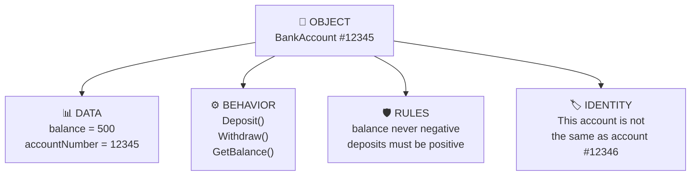

### 💻 The idea as code

```csharp
public class BankAccount
{
    // 🏷️ IDENTITY — what makes this account different from every other one.
    public string AccountNumber { get; }

    // 📊 DATA — private, so nobody outside can corrupt it.
    private decimal balance;

    public BankAccount(string accountNumber, decimal openingBalance)
    {
        // 🛡️ RULES — enforced at the moment of creation.
        if (string.IsNullOrWhiteSpace(accountNumber))
            throw new ArgumentException("Account number is required.");

        if (openingBalance < 0)
            throw new ArgumentException("Opening balance cannot be negative.");

        AccountNumber = accountNumber;
        balance = openingBalance;
    }

    // ⚙️ BEHAVIOR — the only doors into the object.
    public void Deposit(decimal amount)
    {
        if (amount <= 0)
            throw new ArgumentException("Amount must be positive.");

        balance += amount;
    }

    public decimal GetBalance() => balance;
}
```

**Using it:**

```csharp
BankAccount account = new BankAccount("ACC-1001", 500);
account.Deposit(250);
Console.WriteLine(account.GetBalance());   // 750

// ❌ These do not even compile — the object refuses:
// account.balance = -999;      // 'balance' is private
// account.AccountNumber = "X"; // no setter
```

### 🎯 When to model something as an object

| ✅ Make it an object when | Example |
|---|---|
| It has data **and** rules about that data | `Order`, `Invoice`, `Password` |
| It represents a real-world noun | `Customer`, `Book`, `Vehicle` |
| It has a lifecycle (created → changed → finished) | `Booking`, `Ticket` |
| You want to swap different versions of it | `IEmailSender` → SMTP / SendGrid / fake |

| 🚫 Do **not** make it an object when | Do this instead |
|---|---|
| It is a single pure calculation | A static method |
| It is just a bag of values with no rules | A `record` (Chapter 25) |
| It only exists to hold other classes' work | You probably have a "God class" (Chapter 44) |

> 🎓 **Professor's rule**
> An object is not a container for variables. It is a **guardian of rules**.
> If your class has no rules, ask yourself whether it should be a `record` instead.

🧪 **Try it** — Model a `TrafficLight`. Its data is the current colour. Its rule is that it can
only go Green → Yellow → Red → Green. Nothing else. Try to make an illegal transition impossible.

---

# 4. 🏛️ The four pillars of OOP

**Level: ⭐ Beginner**

Every OOP course on Earth teaches these four words. Most courses never explain them properly.
Here is the honest version.

### 🗣️ In plain English

Imagine a **washing machine**.

| What you experience | The pillar behind it |
|---|---|
| 🛡️ You cannot reach the motor. The door locks while it spins. | **Encapsulation** — it protects itself, and you |
| 🎭 You press "Cotton 40°". You do not think about heaters or pumps. | **Abstraction** — a simple face over a complex machine |
| 🧬 A washer-dryer is a washing machine that also dries. | **Inheritance** — a specialised version of a general thing |
| 🔀 Any appliance with a plug works in the same socket. | **Polymorphism** — one connection, many machines |

That is all four pillars, in one appliance. The rest of this chapter is the same idea in code.

<div align="center">

| 🛡️ | 🎭 | 🧬 | 🔀 |
|:---:|:---:|:---:|:---:|
| **ENCAPSULATION** | **ABSTRACTION** | **INHERITANCE** | **POLYMORPHISM** |
| *protects* | *simplifies* | *specialises* | *makes flexible* |

</div>

### 📊 The four pillars at a glance

| Pillar | Plain-English meaning | Real-world analogy | C# tools | Chapter |
|---|---|---|---|:---:|
| **Encapsulation** | Hide your data; expose only safe operations | A pill capsule — you swallow it, you don't open it | `private`, properties, methods | [13](#13--encapsulation) |
| **Abstraction** | Show *what* it does, hide *how* it does it | A car's steering wheel — you turn it, you don't think about the rack | `abstract`, `interface` | [14](#14--abstraction) |
| **Inheritance** | Build a specialised type from a general one | A "Manager" is a specialised "Employee" | `: BaseClass`, `virtual`, `override` | [15](#15--inheritance) |
| **Polymorphism** | One handle, many machines behind it | A power socket — kettle, laptop, lamp all plug in | interfaces, `override` | [16](#16--polymorphism) |

### 🎬 All four in one tiny example

Read the comments — each pillar is labelled where it appears.

```csharp
// 🎭 ABSTRACTION: this says WHAT a payment method must do, never HOW.
public interface IPaymentMethod
{
    void Pay(decimal amount);
}

// 🛡️ ENCAPSULATION: cardNumber is private and can never leak or be changed.
public class CreditCard : IPaymentMethod
{
    private readonly string cardNumber;

    public CreditCard(string cardNumber)
    {
        if (cardNumber.Length != 16)
            throw new ArgumentException("Card number must be 16 digits.");

        this.cardNumber = cardNumber;
    }

    public void Pay(decimal amount)
        => Console.WriteLine($"Charged {amount:C} to card ending {cardNumber[^4..]}");
}

public class PayPal : IPaymentMethod
{
    private readonly string email;

    public PayPal(string email) => this.email = email;

    public void Pay(decimal amount)
        => Console.WriteLine($"Charged {amount:C} to PayPal account {email}");
}

// 🧬 INHERITANCE: a business card IS A credit card, with one extra behaviour.
public class BusinessCreditCard : CreditCard
{
    public string CompanyName { get; }

    public BusinessCreditCard(string cardNumber, string companyName)
        : base(cardNumber)
    {
        CompanyName = companyName;
    }
}
```

```csharp
// 🔀 POLYMORPHISM: this method does not know or care which one it got.
void Checkout(IPaymentMethod method, decimal total)
{
    method.Pay(total);   // The right version runs automatically.
}

Checkout(new CreditCard("1234567812345678"), 99.99m);
Checkout(new PayPal("anna@example.com"), 99.99m);
Checkout(new BusinessCreditCard("1111222233334444", "Acme Ltd"), 250m);
```

**Output:**

```text
Charged $99.99 to card ending 5678
Charged $99.99 to PayPal account anna@example.com
Charged $250.00 to card ending 4444
```

Notice: to add **Apple Pay** tomorrow, you write one new class. You change **zero** existing
lines. That is what all four pillars working together buy you.

### 🧠 The memory rule

```text
  Encapsulation  ──▶  PROTECTS   (nobody can corrupt my data)
  Abstraction    ──▶  SIMPLIFIES (you see a button, not the wiring)
  Inheritance    ──▶  SPECIALISES (Manager is a kind of Employee)
  Polymorphism   ──▶  FLEXES     (one call, many behaviours)
```

> ⚠️ **Gotcha** — Beginners over-use **inheritance** and under-use the other three. In real
> professional code, encapsulation and polymorphism appear constantly; deep inheritance is rare.

## 4.1 🧪 Hands-on exercise

Take the payment example above and, **without looking back at it**, do the following:

1. Add an `ApplePay` payment method. Count how many existing lines you had to change.
   (The answer should be **zero** — if it wasn't, find out why.)
2. Point at the exact line where **encapsulation** protects something. What would break
   if you made that field `public`?
3. Point at the line where **abstraction** appears. What does `Checkout` know about
   `CreditCard`? (Answer: nothing — prove it to yourself.)
4. Write one sentence for each pillar, in your own words, without using the word itself.

If you can do step 4, you understand this chapter. If you cannot, re-read the table above —
that is the whole point of it.

---

# 5. 🏗️ Classes and objects

**Level: ⭐ Beginner**

## 5.1 What a class is

### 🗣️ In plain English

A **class** is a *blueprint*. An **object** is a *building made from that blueprint*.

You can build a thousand houses from one blueprint. Each house has its own address, its own
furniture, its own occupants — but they all share the same *shape* defined by the blueprint.

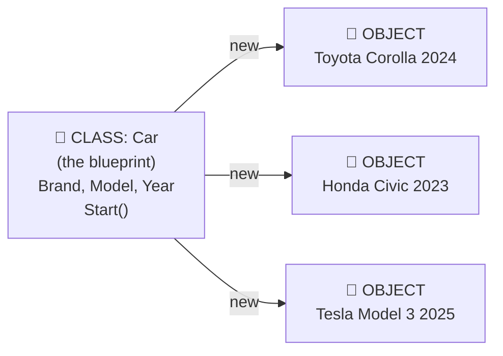

| Class | Object |
|---|---|
| Exists once, in your source code | Exists many times, in memory while the program runs |
| Costs nothing at runtime | Takes up memory |
| Defines *what members exist* | Holds *the actual values* |
| Blueprint / recipe / mould | House / cake / casting |

```csharp
public class Car
{
    public string Brand { get; set; } = "";
    public string Model { get; set; } = "";
    public int Year { get; set; }

    public void Start()
    {
        Console.WriteLine($"{Brand} {Model} ({Year}) is starting.");
    }
}
```

**🎯 When to use:** any time you need a thing that has both data and behaviour, and there will be
more than one of them (or there might be later).

## 5.2 Creating an object

The keyword `new` builds an object from the blueprint.

```csharp
Car car = new Car();   // 👈 `new` allocates memory and runs the constructor
car.Brand = "Toyota";
car.Model = "Corolla";
car.Year  = 2024;
car.Start();           // Toyota Corolla (2024) is starting.
```

Each object is independent:

```csharp
Car a = new Car { Brand = "Toyota" };
Car b = new Car { Brand = "Honda"  };

Console.WriteLine(a.Brand);   // Toyota  — changing b did nothing to a
Console.WriteLine(b.Brand);   // Honda
```

## 5.3 Object initializer — set several properties at once

Instead of four separate lines, use `{ ... }` right after `new`:

```csharp
Car car = new Car
{
    Brand = "Toyota",
    Model = "Corolla",
    Year  = 2024
};
```

**🎯 When to use:** when the class has a parameterless constructor and settable properties —
typical for simple data holders, configuration objects, and test data.

**🚫 When NOT to use:** when the object has *rules*. An object initializer runs **after** the
constructor, so the object briefly exists in an invalid state. For anything with invariants,
pass the values through the **constructor** instead ([Chapter 8](#8--constructors-and-object-initialization)).

## 5.4 `var` and target-typed `new` — two ways to type less

C# lets you avoid repeating the type name. Both of these mean exactly the same thing:

```csharp
var car1 = new Car();     // type on the RIGHT  — compiler infers `Car` for the variable
Car car2 = new();         // type on the LEFT   — compiler infers `Car` for the constructor
```

```csharp
// Target-typed `new` really shines when the type name is long:
Dictionary<string, List<Order>> ordersByCustomer = new();

// ...instead of the painful:
Dictionary<string, List<Order>> old = new Dictionary<string, List<Order>>();
```

| Style | Use when |
|---|---|
| `var x = new Car();` | The type is obvious from the right-hand side |
| `Car x = new();` | You want the declared type visible (fields, long generic names) |
| `Car x = new Car();` | You are teaching, or the extra clarity genuinely helps |

> ⚠️ **Gotcha** — `var` does **not** mean "dynamic" or "any type". C# is still fully static.
> `var` just saves you typing; the type is fixed at compile time and can never change.

## 5.5 Where do objects live?

```csharp
Car car = new Car();
```

Two things happen:

1. The **object** (`Brand`, `Model`, `Year` and their values) is created on the **heap** — a big
   shared pool of memory.
2. The **variable** `car` holds a *reference* — essentially the address of that object.

This matters enormously, and [Chapter 11](#11--value-types-vs-reference-types) explains exactly why.

## 5.6 🧪 Hands-on exercise

Create a `Student` class with:

- `Name`, `Age`, `Grade`
- a `DisplayInfo()` method

Expected output:

```text
Name: Anna
Age: 22
Grade: A
```

**Then extend it:** make `Age` refuse any value below 0 or above 130. You will need
[Chapter 6](#6--fields-properties-and-methods) for that — come back after reading it.

---

# 6. 🧱 Fields, properties, and methods

**Level: ⭐ Beginner**

These three are the *members* of a class. Get the difference clear now and everything else is easier.

### 🗣️ In plain English

| Member | Analogy | What it is |
|---|---|---|
| **Field** | The safe inside the shop | Raw storage. Usually `private`. |
| **Property** | The counter window | A controlled way in and out of that storage. |
| **Method** | The shop's services | An action the object can perform. |

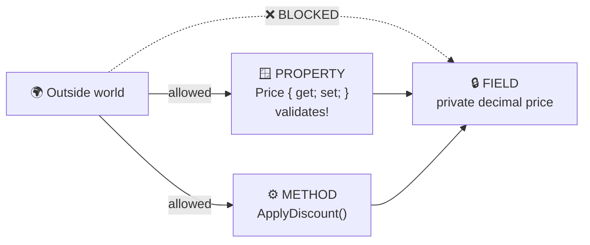

## 6.1 Fields — raw storage

```csharp
public class Product
{
    private decimal price;      // ✅ private: the normal case
    private readonly int id;    // ✅ readonly: set once, never changed again
}
```

**🎯 When to use a field:** to hold the actual value behind a property, or to store a dependency
passed into the constructor.

**🚫 When NOT to use:** never make a field `public`. A public field has no validation, cannot be
changed later without breaking callers, and cannot be part of an interface.

> 🎓 **Professor's rule** — Fields are private. Properties are public. There is almost no exception.

## 6.2 Properties — the controlled doorway

The short form (an **auto-property**) — C# creates the hidden field for you:

```csharp
public class Product
{
    public string Name { get; set; } = "";
    public decimal Price { get; set; }
}
```

**🎯 When to use:** simple data with no rules yet. It is safe, because you can add validation later
*without changing any calling code* — that is the whole reason properties exist.

## 6.3 Property with validation — the real reason properties exist

```csharp
public class Product
{
    private decimal price;   // the "backing field"

    public string Name { get; set; } = "";

    public decimal Price
    {
        get => price;
        set
        {
            if (value < 0)                              // 👈 `value` = whatever was assigned
                throw new ArgumentException("Price cannot be negative.");

            price = value;
        }
    }
}
```

```csharp
Product laptop = new Product { Name = "Laptop", Price = 1200 };   // ✅ fine
laptop.Price = -5;   // 💥 ArgumentException: Price cannot be negative.
```

**🎯 When to use:** the moment a value has *any* rule. Price ≥ 0, age 0–130, name not blank,
percentage 0–100.

> 💡 **Tip** — Inside a setter, the special keyword `value` holds the incoming assignment.
> You never declare it; C# provides it.

## 6.4 The property toolbox — six kinds, and when each one is right

This is the single most useful table in this chapter. Bookmark it.

| Kind | Syntax | Who can set it? | 🎯 Use it for |
|---|---|---|---|
| **Auto** | `{ get; set; }` | Anyone, anytime | Simple mutable data, DTOs |
| **Read-only** | `{ get; }` | Only the constructor | Values fixed at birth (`CreatedAt`) |
| **Private set** | `{ get; private set; }` | Only methods inside the class | State the object changes itself (`Balance`) |
| **Init-only** | `{ get; init; }` | Only during object creation | Immutable objects built with `{ }` syntax |
| **Required** | `required ... { get; init; }` | Must be supplied at creation | Values with no sensible default |
| **Computed** | `=> expression;` | Nobody — it's calculated | Derived values (`Total = Price * Qty`) |

Now each one, with a reason.

### ① Read-only property — set once, at birth

```csharp
public class Order
{
    public DateTime CreatedAt { get; } = DateTime.UtcNow;
    public string OrderNumber { get; }

    public Order(string orderNumber) => OrderNumber = orderNumber;
}
```

**🎯 Use when:** the value is decided when the object is created and must never change.
Creation timestamps, IDs, order numbers.

### ② Private setter — only the object may change its own state

```csharp
public class BankAccount
{
    public decimal Balance { get; private set; }

    public void Deposit(decimal amount)
    {
        if (amount <= 0)
            throw new ArgumentException("Amount must be positive.");

        Balance += amount;    // ✅ allowed — we're inside the class
    }
}
```

```csharp
var account = new BankAccount();
account.Deposit(100);        // ✅ the only legal way in
Console.WriteLine(account.Balance);   // ✅ reading is fine
// account.Balance = 1_000_000;       // ❌ compiler error — cannot set
```

**🎯 Use when:** the outside world may *look* at a value but only the object's own methods may
*change* it. This is the workhorse of encapsulation.

### ③ Init-only property — settable in `{ }`, frozen forever after

```csharp
public class Customer
{
    public string Name { get; init; } = "";
    public string Country { get; init; } = "";
}
```

```csharp
Customer customer = new Customer { Name = "Gehan", Country = "Sri Lanka" };   // ✅
// customer.Name = "Someone else";    // ❌ compiler error — init-only
```

**🎯 Use when:** you want the *convenience* of object-initializer syntax **and** immutability.
Very common in DTOs and configuration objects.

**🚫 Don't use when:** the value has validation rules — `init` setters can validate, but a
constructor makes the requirement obvious and impossible to skip.

### ④ Required property — the compiler forces the caller to supply it

```csharp
public class Customer
{
    public required string Name { get; init; }     // 👈 must be provided
    public string? PhoneNumber { get; set; }       // 👈 optional (note the ?)
}
```

```csharp
Customer ok = new Customer { Name = "Gehan" };     // ✅
// Customer bad = new Customer();                  // ❌ compiler error:
//    "Required member 'Customer.Name' must be set"
```

**🎯 Use when:** a value has **no sensible default** and forgetting it would be a bug.
`required` gives you constructor-like safety with initializer-like syntax.

> 💡 **Tip** — `required` is checked at **compile time**, which is strictly better than throwing
> at runtime. Prefer it over a nullable property plus a runtime null-check where you can.

### ⑤ Computed property — never store what you can calculate

```csharp
public class OrderLine
{
    public decimal UnitPrice { get; set; }
    public int Quantity { get; set; }

    // ✅ Always correct, because it is recalculated every time it's read.
    public decimal Total => UnitPrice * Quantity;
}
```

```csharp
var line = new OrderLine { UnitPrice = 10, Quantity = 3 };
Console.WriteLine(line.Total);   // 30

line.Quantity = 5;
Console.WriteLine(line.Total);   // 50  ✅ automatically correct
```

❌ **The mistake this prevents:**

```csharp
public decimal Total { get; set; }   // ❌ a stored copy
// ...now every place that changes Quantity must REMEMBER to update Total.
// One day, someone forgets. The invoice is wrong. The customer is angry.
```

**🎯 Use when:** the value is 100% derived from other values in the object.
**🚫 Don't use when:** the calculation is genuinely expensive (a database call, a big loop) —
use a method instead, so the caller knows it costs something.

> 🎓 **Professor's rule** — Cheap and derived → computed property.
> Expensive or has side-effects → method.

## 6.5 Methods — what the object can *do*

```csharp
public class Calculator
{
    public int Add(int a, int b)
    {
        return a + b;
    }
}
```

Anatomy of a method signature:

```text
   public      int      Add      (int a, int b)
   ──────      ───      ───      ─────────────
   access     returns   name       parameters
   modifier    type
```

### Expression-bodied methods — one-line shorthand

When a method is a single expression, `=>` is cleaner:

```csharp
public class Calculator
{
    public int Add(int a, int b) => a + b;
    public int Square(int n) => n * n;
    public bool IsEven(int n) => n % 2 == 0;
}
```

**🎯 Use when:** the whole body is one expression. **🚫 Don't** contort a 5-line method into one
unreadable expression just to use `=>`.

### `void` — a method that does something instead of returning something

```csharp
public void PrintReceipt() => Console.WriteLine("Thank you!");
```

## 6.6 Method overloading — same name, different inputs

```csharp
public class Calculator
{
    public int Add(int a, int b) => a + b;
    public int Add(int a, int b, int c) => a + b + c;
    public double Add(double a, double b) => a + b;
    public decimal Add(params decimal[] numbers) => numbers.Sum();
}
```

```csharp
var calc = new Calculator();
calc.Add(1, 2);            // picks Add(int, int)
calc.Add(1, 2, 3);         // picks Add(int, int, int)
calc.Add(1.5, 2.5);        // picks Add(double, double)
calc.Add(1m, 2m, 3m, 4m);  // picks Add(params decimal[])
```

**🎯 Use when:** the operations are genuinely *the same idea* with different inputs.

**🚫 Don't use when:** the methods do different things. `Save(int)` writing to a file and
`Save(string)` writing to a database is a lie to whoever reads the code — name them
`SaveToFile` and `SaveToDatabase`.

> ⚠️ **Gotcha** — Overloads cannot differ **only** by return type. This will not compile:
> ```csharp
> public int    Parse(string s) => 0;
> public double Parse(string s) => 0;   // ❌ error: already defined
> ```

## 6.7 🧪 Hands-on exercise

Build a `Thermostat` class:

- `CurrentTemperature` — readable by anyone, changeable only inside the class
- `TargetTemperature` — settable, but must be between 5 and 30 °C
- `IsHeating` — a **computed** property: `true` when current < target
- `SetTarget(double)` and `RecordReading(double)` methods

Then try to break it from the outside. You should not be able to.

---

# 7. 🎛️ Method parameters in depth

**Level: ⭐⭐ Intermediate**

Most guides skip this chapter. Then learners meet `out` in real code and panic.
Here is everything, in order of how often you will actually use it.

### 🗣️ In plain English

A method's parameters are the **order form** you fill in before the method does its job.

C# gives you several ways to design that form:

| The form can... | C# feature |
|---|---|
| Leave a box blank and use a sensible default | **Optional parameters** |
| Label each box so the form reads clearly | **Named arguments** |
| Accept "as many items as you like" | **`params`** |
| Hand back a second answer alongside the main one | **`out`** |
| Let the method edit your own copy | **`ref`** |
| Pass something big without photocopying it | **`in`** |

You will use the first four constantly and the last two rarely — which is exactly the order
they appear below.

## 7.1 Optional parameters — sensible defaults

```csharp
public class EmailService
{
    public void Send(
        string to,
        string subject,
        string body,
        bool isHtml = false,          // 👈 optional, defaults to false
        int retryCount = 3)           // 👈 optional, defaults to 3
    {
        Console.WriteLine($"To: {to} | HTML: {isHtml} | Retries: {retryCount}");
    }
}
```

```csharp
var email = new EmailService();

email.Send("a@b.com", "Hi", "Hello");                  // uses both defaults
email.Send("a@b.com", "Hi", "Hello", true);            // overrides isHtml
email.Send("a@b.com", "Hi", "Hello", true, 5);         // overrides both
```

**🎯 Use when:** a parameter has an obvious default that 90% of callers want.
**🚫 Don't use when:** the default is arbitrary, or when there are many of them — that is a sign
you should pass a small **options object** instead.

> ⚠️ **Gotcha** — Default values are baked into the *caller's* compiled code. If you ship a
> library and later change a default from `3` to `5`, code compiled against the old version
> keeps using `3` until it is recompiled. This is a real source of confusing bugs in libraries.

## 7.2 Named arguments — make call sites readable

```csharp
// ❌ What do `true` and `false` mean? Nobody can tell from the call site.
CreateUser("anna", "anna@x.com", true, false, true);

// ✅ Now it reads like a sentence.
CreateUser(
    userName:      "anna",
    email:         "anna@x.com",
    isActive:      true,
    isAdmin:       false,
    sendWelcome:   true);
```

Named arguments also let you skip optional parameters in the middle:

```csharp
email.Send("a@b.com", "Hi", "Hello", retryCount: 10);   // skipped isHtml
```

**🎯 Use when:** the call site has multiple booleans, numbers, or same-typed parameters.
Your future self will thank you.

> 🎓 **Professor's rule** — If a call has more than one `true`/`false` in a row, use named
> arguments. Or better, replace the booleans with an **enum** ([Chapter 20](#20--enums-and-type-safe-choices)).

## 7.3 `params` — accept any number of arguments

```csharp
public class Logger
{
    public void LogAll(params string[] messages)
    {
        foreach (string message in messages)
            Console.WriteLine(message);
    }
}
```

```csharp
var log = new Logger();
log.LogAll("one");                       // 1 argument
log.LogAll("one", "two", "three");       // 3 arguments
log.LogAll();                            // 0 arguments — also legal
log.LogAll(new[] { "a", "b" });          // an actual array also works
```

**🎯 Use when:** the count genuinely varies — `Console.WriteLine`, `string.Format`, `Math.Max`
style APIs. **Rule:** `params` must be the **last** parameter, and there can be only one.

## 7.4 `ref`, `out`, and `in` — passing the variable itself

This is the part everyone finds confusing. Here is the whole thing in one table:

| Keyword | Must be initialised **before** the call? | Must the method assign it? | Can the method change it? | 🎯 Typical use |
|---|:---:|:---:|:---:|---|
| *(nothing)* | Yes | No | No effect on caller | 99% of everything |
| `ref` | ✅ Yes | No | ✅ Yes | Swap, in-place modify |
| `out` | ❌ No | ✅ Yes | ✅ Yes | Returning a *second* value |
| `in` | ✅ Yes | No | ❌ No (read-only) | Passing a big `struct` cheaply |

### `out` — the one you will actually use

`out` lets a method return a **second** value. You have already used it without knowing:

```csharp
if (int.TryParse("123", out int number))
{
    Console.WriteLine(number * 2);   // 246
}
else
{
    Console.WriteLine("Not a valid number.");
}
```

Writing your own:

```csharp
public class PriceParser
{
    // Returns true/false for success, AND hands back the parsed value.
    public bool TryParse(string input, out decimal price)
    {
        price = 0;                                     // must assign before returning

        if (!decimal.TryParse(input, out decimal parsed) || parsed < 0)
            return false;

        price = parsed;
        return true;
    }
}
```

**🎯 Use `out` when:** an operation can fail and you want to avoid throwing an exception for a
*normal, expected* failure (parsing user input, looking up a dictionary key).

> 💡 **Tip** — The naming convention is `TryXxx` returning `bool` with an `out` result. Follow it,
> and every C# developer will instantly understand your API.

### `ref` — modify the caller's variable

```csharp
public static void Swap(ref int a, ref int b)
{
    (a, b) = (b, a);
}
```

```csharp
int x = 1, y = 2;
Swap(ref x, ref y);          // 👈 `ref` required at the call site too
Console.WriteLine($"{x}, {y}");   // 2, 1
```

**🚫 When NOT to use `ref`:** almost always. In modern C#, returning a value or a tuple is
clearer. `ref` on *reference types* is especially confusing and rarely what you want.

### `in` — read-only, but avoids copying

```csharp
public readonly struct Matrix4x4 { /* 64 bytes of data */ }

// Without `in`, all 64 bytes are copied on every call.
public static double Determinant(in Matrix4x4 m) { /* ... */ return 0; }
```

**🎯 Use when:** passing a **large struct** in a performance-sensitive loop. For classes and small
structs it makes no difference — do not sprinkle it everywhere.

## 7.5 🧪 Hands-on exercise

Write a `SafeDivider` class with a method
`bool TryDivide(double numerator, double denominator, out double result)`
that returns `false` (instead of throwing) when the denominator is zero.
Then call it both ways — with a valid and an invalid divisor.

---

# 8. 🏭 Constructors and object initialization

**Level: ⭐ Beginner**

### 🗣️ In plain English

A **constructor** is the object's *birth certificate ceremony*. It runs exactly once, the moment
the object is created, and its job is to make sure the object is **born valid**.

An object with a good constructor **cannot exist in a broken state**. That is a superpower.

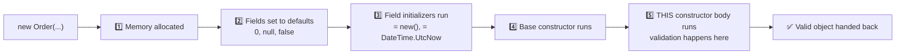

## 8.1 Basic constructor

```csharp
public class Student
{
    public string Name { get; }
    public int Age { get; }

    public Student(string name, int age)
    {
        if (string.IsNullOrWhiteSpace(name))
            throw new ArgumentException("Name is required.", nameof(name));

        if (age is < 0 or > 130)
            throw new ArgumentOutOfRangeException(nameof(age), "Age must be 0–130.");

        Name = name;
        Age = age;
    }
}
```

```csharp
Student student = new Student("Anna", 22);     // ✅
// Student bad = new Student("", -5);          // 💥 throws immediately
```

**🎯 Use a constructor when:** the object needs values to be valid. Which is most of the time.

> 💡 **Tip** — `nameof(name)` produces the string `"name"`, but the compiler checks it. If you
> rename the parameter, `nameof` updates automatically; a hard-coded `"name"` silently rots.

## 8.2 Default (parameterless) constructor

```csharp
public class Student
{
    public string Name { get; set; } = "";

    public Student() { }        // explicit parameterless constructor
}
```

> ⚠️ **Gotcha — the disappearing constructor**
> If you write **no** constructor at all, C# gives you a free parameterless one.
> The instant you write **any** constructor, that free one **disappears**:
> ```csharp
> public class Product
> {
>     public Product(string name) { }
> }
>
> var p = new Product();    // ❌ compiler error — no parameterless constructor exists
> ```
> Add it back explicitly if you need it.

## 8.3 Constructor overloading — several ways to build the same thing

```csharp
public class Product
{
    public string Name { get; }
    public decimal Price { get; }

    public Product(string name)
    {
        Name = name;
        Price = 0;
    }

    public Product(string name, decimal price)
    {
        Name = name;
        Price = price;
    }
}
```

**🎯 Use when:** there are genuinely different, equally valid ways to create the object.

## 8.4 Constructor chaining with `this` — never duplicate validation

The version above has a bug waiting to happen: if you add validation, you must remember to add it
to *both* constructors. Chain them instead:

```csharp
public class Product
{
    public string Name { get; }
    public decimal Price { get; }

    // This one just forwards to the "real" constructor with a default price.
    public Product(string name) : this(name, 0) { }

    // 👑 The one, single, authoritative constructor.
    public Product(string name, decimal price)
    {
        if (string.IsNullOrWhiteSpace(name))
            throw new ArgumentException("Name is required.");

        if (price < 0)
            throw new ArgumentException("Price cannot be negative.");

        Name = name;
        Price = price;
    }
}
```

> 🎓 **Professor's rule** — Have **one** constructor that does all the real work. Every other
> constructor should chain into it with `: this(...)`. Validation then lives in exactly one place.

## 8.5 Base constructor with `base` — building on a parent

```csharp
public class Person
{
    public string Name { get; }

    public Person(string name)
    {
        if (string.IsNullOrWhiteSpace(name))
            throw new ArgumentException("Name is required.");

        Name = name;
    }
}

public class Student : Person
{
    public string Grade { get; }

    public Student(string name, string grade)
        : base(name)                  // 👈 run Person's constructor first
    {
        Grade = grade;
    }
}
```

> ⚠️ **Gotcha — order of execution**
> The **base** constructor always runs **before** the derived one. So you cannot rely on
> derived-class fields inside a base constructor. In particular:
> **never call a `virtual` method from a constructor** — the override will run before the derived
> object is fully built, and it will see uninitialised fields.

## 8.6 Private constructor — control who is allowed to create the object

```csharp
public class AppSettings
{
    public string Environment { get; }

    private AppSettings(string environment) => Environment = environment;   // 🔒

    // ✅ The only doors in — named, meaningful, and validated.
    public static AppSettings CreateDevelopment() => new AppSettings("Development");
    public static AppSettings CreateProduction()  => new AppSettings("Production");
}
```

```csharp
var settings = AppSettings.CreateDevelopment();
// var bad = new AppSettings("anything");     // ❌ inaccessible
```

**🎯 Use when:**
- You want **named** creation methods (`Money.FromDollars(5)` reads better than `new Money(5, "USD")`).
- Creation requires work the constructor shouldn't do (validation that returns a result, caching).
- You want to guarantee only certain instances exist.

🔗 **Connects to:** the Factory pattern ([Chapter 40](#40--design-patterns-for-c-oop)).

## 8.7 Static constructor — runs once, for the whole type

```csharp
public class Logger
{
    public static string ApplicationName { get; }

    // Runs automatically ONCE, before the type is first used. You never call it.
    static Logger()
    {
        ApplicationName = Environment.GetEnvironmentVariable("APP_NAME") ?? "OOP App";
    }
}
```

**🎯 Use when:** you must initialise static state that needs real logic (reading config, building
a lookup table). **🚫 Don't use for:** simple values — a field initializer is clearer:

```csharp
public static string ApplicationName { get; } = "OOP App";   // ✅ simpler
```

> ⚠️ **Gotcha** — If a static constructor throws, the type becomes permanently unusable for the
> rest of the process, with a confusing `TypeInitializationException`. Keep it trivial.

## 8.8 Primary constructors — modern shorthand

```csharp
// The parameters (name, age) are available throughout the whole class body.
public class Person(string name, int age)
{
    public string Name { get; } = name;
    public int Age { get; } = age;

    public string Describe() => $"{name} is {age} years old.";   // 👈 usable directly
}
```

Where it shines most — services with injected dependencies:

```csharp
// ❌ The old, noisy way:
public class OrderService
{
    private readonly IEmailSender emailSender;
    private readonly IOrderRepository repository;

    public OrderService(IEmailSender emailSender, IOrderRepository repository)
    {
        this.emailSender = emailSender;
        this.repository = repository;
    }
}

// ✅ The same thing, with a primary constructor:
public class OrderService(IEmailSender emailSender, IOrderRepository repository)
{
    public void Place(Order order)
    {
        repository.Add(order);
        emailSender.Send("Order placed");
    }
}
```

**🎯 Use when:** the class is mostly "take these dependencies and use them" — services, handlers.
**🚫 Don't use when:** you need validation in the constructor body, or the class has several
constructors. A classic constructor is clearer there.

> ⚠️ **Gotcha** — Primary constructor parameters on a **class** are *not* automatically public
> properties. (On a `record`, they *are* — see [Chapter 25](#25--classes-structs-records-immutability-and-serialization).)
> They are captured, private, and mutable — so avoid reassigning them.

## 8.9 Constructor vs object initializer vs `required` — which one?

| You want... | Use |
|---|---|
| The object to be **impossible to build wrong** | 🏆 **Constructor** |
| Convenience for simple data with no rules | Object initializer `{ }` |
| Initializer syntax **and** compile-time safety | `required` + `init` |
| Terse dependency injection | Primary constructor |

> 🎓 **Professor's rule** — If breaking a rule would corrupt your data, it belongs in a
> **constructor**. Object initializers are for convenience, not for safety.

## 8.10 🧪 Hands-on exercise

Create a `BankAccount` with:

- `AccountHolder` (read-only), `Balance` (private setter)
- A constructor that rejects a blank holder name or a negative opening balance
- `Deposit`, `Withdraw`
- A minimum-balance rule of 25.00 that `Withdraw` must respect
- A second constructor `BankAccount(string holder)` that chains with `: this(holder, 0)`

Then prove to yourself that you cannot create an invalid account from outside.

---

# 9. 🚪 Access modifiers

**Level: ⭐ Beginner**

### 🗣️ In plain English

Access modifiers are the **locks on the doors** of your code. They decide who is allowed in.

Think of a hospital:

| Area | Who can enter | C# equivalent |
|---|---|---|
| 🏥 Reception | Anybody | `public` |
| 🔬 Staff-only lab | Only this department | `private` |
| 👨‍⚕️ Doctors' room | This department + its specialists | `protected` |
| 🏢 Whole hospital | Any staff in this building | `internal` |

## 9.1 The complete table

| Modifier | Who can see it | 🎯 Use it for |
|---|---|---|
| `public` | Everyone, everywhere | The deliberate API of your class |
| `private` | Only inside the same class | **The default. Everything, until proven otherwise.** |
| `protected` | This class + classes that inherit from it | Helpers a subclass genuinely needs |
| `internal` | Any code in the same project (assembly) | Implementation shared across your project but hidden from consumers |
| `protected internal` | Same project **OR** any derived class | Rare. Library base classes. |
| `private protected` | Derived classes **in the same project only** | Rare. Tighter than `protected`. |
| `file` | Only within the same `.cs` file | Very rare. Source generators. |

If you write no modifier at all:

| Where | Default |
|---|---|
| Class members (fields, methods, properties) | `private` |
| Top-level types (class, interface, record) | `internal` |

> ⚠️ **Gotcha** — A `class Foo` with no modifier is `internal`, so it is invisible from other
> projects. This bites everyone once when building a class library.

## 9.2 Seeing them in action

```csharp
public class BankAccount
{
    private decimal balance;                    // 🔒 nobody outside

    public decimal GetBalance() => balance;     // 🌍 the public door

    protected void ApplyInterest(decimal rate)  // 👨‍👦 subclasses only
    {
        balance += balance * rate;
    }

    internal void ForceSetBalanceForTesting(decimal amount)  // 🏢 same project only
    {
        balance = amount;
    }
}

public class SavingsAccount : BankAccount
{
    public void AddMonthlyInterest()
    {
        ApplyInterest(0.02m);        // ✅ allowed: we inherit from BankAccount
        // balance = 0;              // ❌ not allowed: `balance` is private to BankAccount
    }
}
```

From completely outside:

```csharp
var account = new BankAccount();
account.GetBalance();                    // ✅ public
// account.balance = 100;                // ❌ private
// account.ApplyInterest(0.05m);         // ❌ protected
account.ForceSetBalanceForTesting(50);   // ✅ only if in the same project
```

## 9.3 The decision flowchart

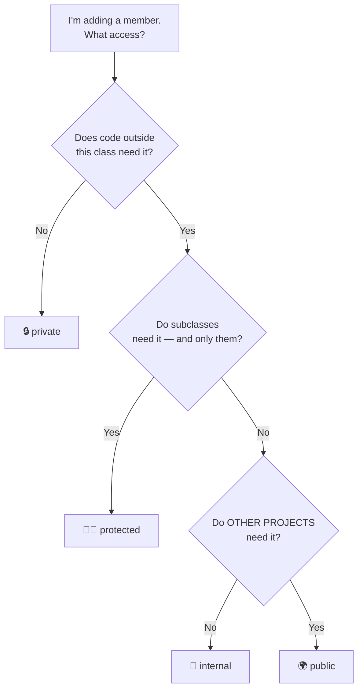

> 🎓 **Professor's rule**
> **Start at `private`. Loosen only when something genuinely cannot work otherwise.**
> Making a member public is a promise you may have to keep for years. Making it private costs
> nothing and can be reversed any time.

## 9.4 Why this matters more than it looks

Every `public` member is part of your **contract**. Once other code uses it:

- You cannot rename it without breaking them.
- You cannot change its type.
- You cannot add validation that might reject what they already pass.
- You cannot delete it.

A `private` member has **none** of those problems. You can rewrite it at 3 a.m. and nobody notices.

🧪 **Try it** — Take the `Thermostat` from Chapter 6. Add a `private void Recalibrate()`. Try to
call it from `Program.cs`. Read the error. Now change it to `public`. Notice how you just made a
promise you may not want to keep.

---

# 10. 🌳 `object` — the ancestor of everything

**Level: ⭐⭐ Intermediate**

### 🗣️ In plain English

In C#, **every single type is descended from one common ancestor**, called `object`
(or `System.Object` — same thing).

Think of a family tree where everyone — `int`, `string`, `Car`, `List<T>`, your classes,
Microsoft's classes — traces back to one great-great-grandparent.

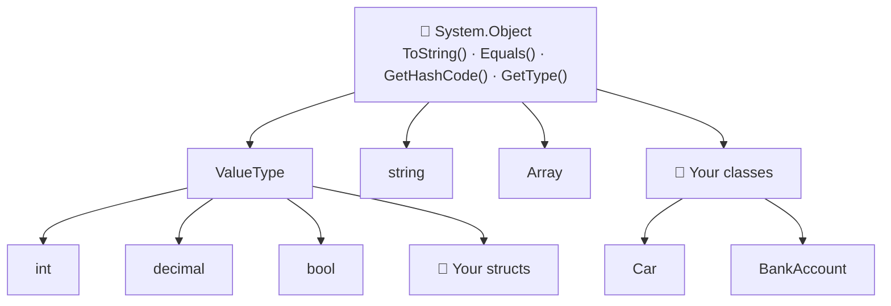

This is why every object in .NET already has four methods, **even if you never wrote them**.

## 10.1 The four inherited methods

| Method | What it does by default | Should you override it? |
|---|---|---|
| `ToString()` | Returns the type's full name — usually useless | ✅ **Almost always yes** |
| `Equals(object)` | Compares *references* (are they the same object?) | Only for value-like types |
| `GetHashCode()` | A number used by `Dictionary` / `HashSet` | Always, **if** you override `Equals` |
| `GetType()` | The runtime type of the object | ❌ You cannot — it's sealed |

Prove it to yourself:

```csharp
public class Car { }

var car = new Car();
Console.WriteLine(car.ToString());     // "Car"  — technically true, practically useless
Console.WriteLine(car.GetType().Name); // "Car"
Console.WriteLine(car.GetHashCode());  // some number like 58225482
```

## 10.2 `ToString()` — the free win most beginners miss

Every time you print an object or look at it in the debugger, `ToString()` is called.
Overriding it takes five seconds and pays back forever.

❌ **Without an override:**

```csharp
public class Product
{
    public string Name { get; init; } = "";
    public decimal Price { get; init; }
}

var laptop = new Product { Name = "Laptop", Price = 1200 };
Console.WriteLine(laptop);   // "Product"   😞  tells you nothing
```

✅ **With an override:**

```csharp
public class Product
{
    public string Name { get; init; } = "";
    public decimal Price { get; init; }

    public override string ToString() => $"{Name} ({Price:C})";
}

Console.WriteLine(laptop);   // "Laptop ($1,200.00)"   😊
```

**🎯 Use when:** always, for any class you will print, log, or inspect in a debugger.

> 💡 **Tip** — `records` generate a good `ToString()` for you automatically. That alone is a
> reason to use them for data types ([Chapter 25](#25--classes-structs-records-immutability-and-serialization)).

> ⚠️ **Gotcha** — Never put secrets (passwords, tokens, full card numbers) into `ToString()`.
> Logs are the #1 place credentials leak.

## 10.3 `GetType()` — asking an object what it really is

```csharp
object thing = "hello";

Console.WriteLine(thing.GetType());            // System.String
Console.WriteLine(thing.GetType().Name);       // String
Console.WriteLine(thing is string);            // True
```

**🎯 Use when:** logging, diagnostics, reflection ([Chapter 34](#34--attributes-and-reflection)).
**🚫 Don't use for branching logic** — that is what polymorphism is for:

```csharp
// ❌ Fighting the type system
if (shape.GetType().Name == "Circle") { /* ... */ }

// ✅ Letting it work for you
shape.CalculateArea();
```

## 10.4 `object` as a "holds anything" type

Because everything inherits from `object`, an `object` variable can hold anything:

```csharp
object a = 42;
object b = "hello";
object c = new Car();
object d = DateTime.Now;
```

**🚫 When NOT to use `object`:** almost always. You lose all type safety and get runtime crashes
instead of compiler errors. Use **generics** ([Chapter 21](#21--generics)) instead:

```csharp
// ❌ The pre-2005 way — unsafe and slow
object item = GetItem();
string name = (string)item;      // 💥 InvalidCastException if it wasn't a string

// ✅ The modern way — the compiler protects you
string name = GetItem<string>();
```

## 10.5 Equality preview

`object.Equals` compares **references** by default: "are these the same object in memory?"
For `Money`, `EmailAddress`, or `Product` you usually want "do they have the same *values*?"
That is a whole chapter: [Chapter 24](#24--equality-comparison-sorting-and-copying).

> 🎓 **Professor's rule** — Override `ToString()` on every class you'll ever look at.
> Override `Equals`/`GetHashCode` only on types where two instances with the same data
> should count as "the same thing".

## 10.6 🧪 Hands-on exercise

1. Create a `Book` class with `Title`, `Author`, and `Year`. Print an instance with
   `Console.WriteLine(book)` and note the useless output.
2. Override `ToString()` so it prints `"Clean Code by Robert C. Martin (2008)"`. Print it again.
3. Print `book.GetType().Name` and `book.GetType().FullName`. Explain the difference.
4. Create two books with **identical** data and print `book1.Equals(book2)`.
   Explain, in one sentence, why the answer is `False`.
5. Now put both books in a `List<object>` alongside an `int`, a `string`, and a `DateTime`.
   Loop over the list and print `item.GetType().Name` for each.
   This proves the chapter's main claim: **everything descends from `object`.**

---

# 11. ⚖️ Value types vs reference types

**Level: ⭐⭐ Intermediate**

This chapter explains a category of bug that confuses **every** learner exactly once.
Read it carefully and you will skip that day of confusion.

### 🗣️ In plain English

There are two ways to hand someone information:

| | Analogy | C# name |
|---|---|---|
| 📄 **Give them a photocopy** | They can scribble on it; your original is untouched | **Value type** |
| 🔑 **Give them a key to your house** | They walk in and move your furniture; you see the change | **Reference type** |

That is the entire difference. Everything below follows from it.

## 11.1 Which is which?

| 📄 Value types (copy) | 🔑 Reference types (share) |
|---|---|
| `int`, `long`, `double`, `decimal` | `class` (all of them) |
| `bool`, `char` | `string`* |
| `struct` (yours and .NET's) | `record` (class-based) |
| `enum` | arrays, `List<T>`, `Dictionary<,>` |
| `DateTime`, `TimeSpan`, `Guid` | delegates |
| tuples `(int, string)` | `object` |

\* `string` is technically a reference type, but it is **immutable**, so it *behaves* like a value
type in practice. You can never accidentally modify someone else's string.

## 11.2 The demonstration that makes it click

📄 **Value type — a photocopy:**

```csharp
int a = 10;
int b = a;      // 📄 b gets a COPY of the number 10

b = 99;

Console.WriteLine(a);   // 10  ✅ untouched
Console.WriteLine(b);   // 99
```

🔑 **Reference type — a shared key:**

```csharp
public class Customer
{
    public string Name { get; set; } = "";
}

Customer a = new Customer { Name = "Anna" };
Customer b = a;         // 🔑 b gets a COPY OF THE KEY — same house!

b.Name = "Maria";

Console.WriteLine(a.Name);   // "Maria"  😱  surprise!
Console.WriteLine(b.Name);   // "Maria"
```

There is only **one** `Customer` object. `a` and `b` are two labels pointing at it.

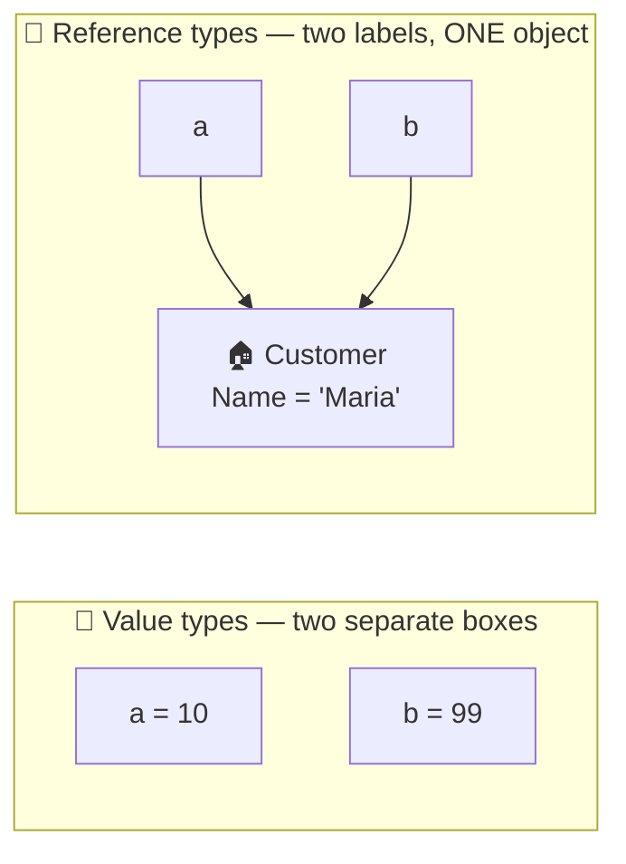

> ⚠️ **Gotcha — the bug this causes in real code**
> ```csharp
> void ApplyDiscount(Order order)
> {
>     order.Total = order.Total * 0.9m;   // 🔑 This changes the CALLER'S order!
> }
> ```
> If the caller did not expect that, you have just silently modified their data.
> This is why professionals prefer **immutable** objects ([Chapter 25](#25--classes-structs-records-immutability-and-serialization)).

## 11.3 Passing to methods

```csharp
void ChangeNumber(int n)      { n = 999; }
void ChangeCustomer(Customer c) { c.Name = "Changed"; }
void ReplaceCustomer(Customer c) { c = new Customer { Name = "Brand new" }; }
```

```csharp
int number = 1;
ChangeNumber(number);
Console.WriteLine(number);        // 1  📄 the copy was changed, not the original

Customer customer = new Customer { Name = "Anna" };
ChangeCustomer(customer);
Console.WriteLine(customer.Name); // "Changed"  🔑 same object was modified

ReplaceCustomer(customer);
Console.WriteLine(customer.Name); // "Changed"  ← still! Only the local key was repointed.
```

That last one catches people. `ReplaceCustomer` received a **copy of the key**. Pointing that copy
at a new house does not move the caller's key.

> 💡 **Tip** — Reference types are passed **by value** — the *reference* is copied. You can change
> what the object contains, but you cannot change which object the caller is holding
> (unless you use `ref`, see [Chapter 7](#7--method-parameters-in-depth)).

## 11.4 Where they live: stack and heap

| | 📄 Value type | 🔑 Reference type |
|---|---|---|
| **Stored** | Usually on the **stack** (or inline inside its owner) | Object on the **heap**; reference on the stack |
| **Cleaned up** | Instantly, when the method ends | By the **garbage collector**, whenever it decides |
| **Copy cost** | Copies all the bytes | Copies 8 bytes (the reference) |
| **Default value** | Zero-filled (`0`, `false`) | `null` |

```csharp
int number = 42;              // 📄 the value 42 sits directly in `number`
Customer c = new Customer();  // 🔑 `c` holds an address; the object lives on the heap
Customer d = null;            // 🔑 `d` holds no address at all
// int n = null;              // ❌ impossible — value types are never null
```

## 11.5 Boxing and unboxing — the hidden cost

**Boxing** is what happens when a value type is forced into a reference-shaped hole.

```csharp
int number = 42;
object boxed = number;        // 📦 BOXING: 42 is copied onto the heap, wrapped in an object
int back = (int)boxed;        // 📤 UNBOXING: copied back out
```

Why care? Because it allocates memory, and in a hot loop that is real, measurable slowness:

```csharp
// ❌ Every single int gets boxed — 1,000,000 heap allocations
ArrayList oldList = new ArrayList();
for (int i = 0; i < 1_000_000; i++)
    oldList.Add(i);          // 📦 box, box, box...

// ✅ No boxing at all — List<int> stores ints directly
List<int> list = new List<int>();
for (int i = 0; i < 1_000_000; i++)
    list.Add(i);             // ✅
```

> 🎓 **Professor's rule** — If you use generics (`List<int>`, not `ArrayList`) you will
> essentially never think about boxing again. Which is exactly why generics exist.

## 11.6 So which should *you* write?

| Write a `class` (🔑) when | Write a `struct` (📄) when |
|---|---|
| The thing has identity (`Customer #42`) | It's a single small value (`Money`, `Point`, `Temperature`) |
| It is large or has many fields | It is **≤ 16 bytes** and immutable |
| It changes over its lifetime | It never changes after creation |
| It needs inheritance | You create millions of them in a tight loop |
| **← this is 95% of your types** | ← this is rare; measure before choosing it |

> 🎓 **Professor's rule** — **When in doubt, write a `class`.** Structs are a performance
> optimisation with sharp edges. Reach for one only when you can explain why.

## 11.7 🧪 Hands-on exercise

1. Create a `class Point { public int X; public int Y; }` and a
   `struct PointS { public int X; public int Y; }`.
2. For each: create one, assign it to a second variable, modify the second, print the first.
3. Explain out loud why the results differ. If you can do that, you own this chapter.

---

# 12. ♻️ Object lifecycle and resource management

**Level: ⭐⭐ Intermediate**

### 🗣️ In plain English

Objects are born, live, and die.

.NET cleans up **memory** for you automatically — you never free memory by hand. But some things
are **not memory**: an open file, a database connection, a network socket. Those the operating
system gives you and expects back. If you forget, your app slowly runs out of them and dies
mysteriously three hours into production.

This chapter is about giving those back properly.

## 12.1 The lifecycle

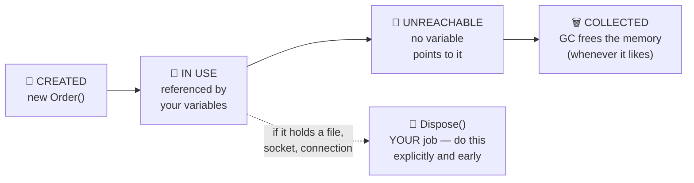

## 12.2 Garbage collection, in one minute

The **Garbage Collector (GC)** periodically looks for objects that no code can reach any more,
and frees their memory.

```csharp
void DoWork()
{
    var temp = new Customer();    // created
    Console.WriteLine(temp.Name);
}                                 // `temp` goes out of scope → object is now unreachable
                                  // GC will free it... eventually. Not immediately.
```

| ✅ The GC handles | ❌ The GC does NOT handle |
|---|---|
| Memory for your objects | Open file handles |
| Cleaning up unreachable objects | Database connections |
| Compacting the heap | Network sockets |
| — | Unmanaged OS handles |

> ⚠️ **Gotcha** — Do **not** call `GC.Collect()` in application code. It is almost always the
> wrong answer, and it usually makes performance worse. If you think you need it, you actually
> need `Dispose()`.

## 12.3 `IDisposable` — the "please give it back" contract

Any type that holds a non-memory resource implements `IDisposable`, which means it has one
method: `Dispose()`.

```csharp
public class ReportWriter : IDisposable
{
    private readonly StreamWriter writer;
    private bool disposed;

    public ReportWriter(string path)
    {
        writer = new StreamWriter(path);
    }

    public void Write(string text)
    {
        ObjectDisposedException.ThrowIf(disposed, this);   // 🛡️ fail loudly if misused
        writer.WriteLine(text);
    }

    public void Dispose()
    {
        if (disposed) return;      // safe to call twice
        writer.Dispose();          // hand the file handle back to the OS
        disposed = true;
    }
}
```

**🎯 Implement `IDisposable` when:** your class **owns** something that must be released —
a stream, a connection, a timer, a subscription, an unmanaged handle.

**🚫 Don't implement it when:** your class only holds plain data and other managed objects.
The GC has that covered.

## 12.4 `using` — the safety net that never forgets

Calling `Dispose()` by hand is fragile: one exception, one early `return`, and you leak.
`using` guarantees it runs no matter what.

**Classic `using` statement** — scope is the braces:

```csharp
using (StreamWriter writer = new StreamWriter("log.txt"))
{
    writer.WriteLine("Application started.");
    throw new Exception("boom");     // 💥 even here...
}
// ...Dispose() is STILL called. Guaranteed.
```

**`using` declaration** (modern, preferred) — scope is the rest of the enclosing block:

```csharp
void WriteLog()
{
    using StreamWriter writer = new StreamWriter("log.txt");
    writer.WriteLine("Application started.");
}   // 👈 Dispose() runs automatically here
```

| Style | Use when |
|---|---|
| `using (...) { }` | You need the resource for only part of the method |
| `using var x = ...;` | The resource lives until the end of the method — **prefer this** |

> 🎓 **Professor's rule** — If a type implements `IDisposable`, it goes in a `using`.
> No exceptions, no "I'll remember".

## 12.5 `IAsyncDisposable` and `await using`

Modern resources (database connections, HTTP handlers, streams) often need to *await* their cleanup.

```csharp
public class AsyncReportWriter : IAsyncDisposable
{
    private readonly StreamWriter writer = new("report.txt");

    public async ValueTask DisposeAsync()
    {
        await writer.FlushAsync();
        await writer.DisposeAsync();
    }
}
```

```csharp
await using var reportWriter = new AsyncReportWriter();
// ... use it ...
// DisposeAsync() is awaited automatically at the end of scope
```

🔗 **Connects to:** [Chapter 33 — Async, await, and OOP](#33--async-await-and-oop).

## 12.6 The full Dispose pattern (for inheritable classes)

If your class holds resources **and** can be inherited, use the standard pattern so subclasses
can clean up too:

```csharp
public class ResourceHolder : IDisposable
{
    private bool disposed;

    public void Dispose()
    {
        Dispose(disposing: true);
        GC.SuppressFinalize(this);       // "I've cleaned up — skip my finalizer"
    }

    protected virtual void Dispose(bool disposing)
    {
        if (disposed) return;

        if (disposing)
        {
            // Release MANAGED resources here (other IDisposable objects).
        }

        // Release UNMANAGED resources here (raw OS handles).

        disposed = true;
    }
}
```

**🚫 You almost certainly do not need this.** Use it only if you are writing a base class in a
library. For everyday code, the simple `Dispose()` in 12.3 is correct.

## 12.7 Finalizers — the last resort you should avoid

```csharp
public class NativeResourceWrapper
{
    ~NativeResourceWrapper()      // 👈 a finalizer
    {
        // Runs (maybe) when the GC collects this object.
    }
}
```

| ❌ Why finalizers are bad | |
|---|---|
| Unpredictable timing | You have no idea *when* it runs — or if it ever will |
| Slows down the GC | Finalizable objects survive an extra collection cycle |
| May never run | Not guaranteed at process shutdown |
| Easy to get wrong | Exceptions in a finalizer crash the process |

> 🎓 **Professor's rule** — In ~99% of application code you should write **zero** finalizers.
> Use `IDisposable` + `using`. If you truly wrap a raw OS handle, use `SafeHandle` instead.

## 12.8 🧪 Hands-on exercise

Write a `TemporaryFile : IDisposable` class that:

1. Creates a file in the temp directory in its constructor
2. Exposes a `Path` property and a `Write(string)` method
3. **Deletes the file** in `Dispose()`

Then use it inside a `using` block, throw an exception in the middle, and verify the file was
still deleted.

---
<div align="center">

# 🟣 PART 2 — THE FOUR PILLARS, IN DEPTH

*You met them in Chapter 4. Now you learn to actually use them.*

</div>

---

# 13. 🛡️ Encapsulation

**Level: ⭐ Beginner**

### 🗣️ In plain English

Encapsulation means: **hide your insides, and only offer safe buttons to press.**

Think of a **medicine capsule**. You swallow it whole. You do not open it, re-mix the powder, and
decide the dose yourself. The capsule protects both the medicine and you.

Or think of an **ATM**. You can:
- ✅ Check your balance
- ✅ Withdraw money (within rules)
- ✅ Deposit money

You cannot:
- ❌ Open the cash drawer
- ❌ Set your balance to a number you like
- ❌ Withdraw more than you have

The ATM is your class. The buttons are your public methods. The cash inside is your private field.

## 13.1 ❌ Bad encapsulation — the open cash drawer

```csharp
public class BankAccount
{
    public decimal Balance { get; set; }     // 🚨 anyone can write anything
}
```

Look what any code, anywhere, can now do:

```csharp
BankAccount account = new BankAccount();
account.Balance = -999_999;      // 💸 negative balance — allowed
account.Balance = 1_000_000;     // 💰 free money — allowed
```

There is no bug here in the *language*. The bug is in the **design**: the class made a promise it
cannot keep.

### Why this is worse than it looks

1. **The rule has to live somewhere else.** Now every screen, service, and API endpoint that
   touches `Balance` must remember to validate.
2. **You cannot find the bug.** When a negative balance appears, the culprit could be any of the
   200 lines in your codebase that assign to `Balance`.
3. **You cannot fix it later.** Adding validation means finding and changing every caller.

## 13.2 ✅ Good encapsulation — the ATM

```csharp
public class BankAccount
{
    private decimal balance;                        // 🔒 locked away

    public string AccountHolder { get; }            // 🔍 readable, never changeable
    public decimal Balance => balance;              // 🔍 readable, never writable

    public BankAccount(string accountHolder, decimal openingBalance)
    {
        if (string.IsNullOrWhiteSpace(accountHolder))
            throw new ArgumentException("Account holder is required.");

        if (openingBalance < 0)
            throw new ArgumentException("Opening balance cannot be negative.");

        AccountHolder = accountHolder;
        balance = openingBalance;
    }

    // ✅ Button 1
    public void Deposit(decimal amount)
    {
        if (amount <= 0)
            throw new ArgumentException("Deposit amount must be positive.");

        balance += amount;
    }

    // ✅ Button 2
    public void Withdraw(decimal amount)
    {
        if (amount <= 0)
            throw new ArgumentException("Withdrawal amount must be positive.");

        if (amount > balance)
            throw new InvalidOperationException(
                $"Insufficient balance. Available: {balance:C}, requested: {amount:C}");

        balance -= amount;
    }
}
```

Now compare what the *outside world* can do:

| Attempt | Before | After |
|---|:---:|:---:|
| `account.Balance = -999` | 😱 allowed | ✅ **compiler error** |
| `account.Deposit(-50)` | n/a | ✅ **throws — clear message** |
| `account.Withdraw(1_000_000)` | 😱 allowed | ✅ **throws — clear message** |
| `account.Deposit(100)` | n/a | ✅ works |

> 🎓 **Professor's rule**
> **Make invalid states unrepresentable.** Do not detect bad data later — make it impossible to
> create in the first place.

## 13.3 Protecting collections — the leak everyone misses

This one is subtle and catches almost everybody.

❌ **The leak:**

```csharp
public class Order
{
    public List<OrderItem> Items { get; set; } = new();
}
```

```csharp
var order = new Order();
order.Items.Add(item);          // 😱 bypasses every rule you ever wrote
order.Items.Clear();            // 😱 wipes the order
order.Items = null!;            // 😱 breaks everything downstream
```

You carefully wrote `AddItem()` with validation... and nobody has to use it.

✅ **The fix:**

```csharp
public class Order
{
    private readonly List<OrderItem> items = new();       // 🔒 the real list

    // 🔍 A read-only VIEW. Callers can look and loop, but not modify.
    public IReadOnlyList<OrderItem> Items => items;

    public OrderStatus Status { get; private set; } = OrderStatus.Draft;

    public void AddItem(OrderItem item)
    {
        ArgumentNullException.ThrowIfNull(item);

        if (Status != OrderStatus.Draft)
            throw new InvalidOperationException("Cannot modify a submitted order.");

        items.Add(item);
    }

    public void RemoveItem(OrderItem item)
    {
        if (Status != OrderStatus.Draft)
            throw new InvalidOperationException("Cannot modify a submitted order.");

        items.Remove(item);
    }
}
```

```csharp
var order = new Order();
order.AddItem(item);                // ✅ the only way in — rules enforced
Console.WriteLine(order.Items.Count);   // ✅ reading is fine
// order.Items.Add(item);           // ❌ compiler error — IReadOnlyList has no Add
```

### Which read-only type should you expose?

| Type | Gives the caller | 🎯 Use for |
|---|---|---|
| `IReadOnlyList<T>` | Count + indexing + `foreach` | **The default choice** |
| `IReadOnlyCollection<T>` | Count + `foreach` | When index access is meaningless |
| `IEnumerable<T>` | `foreach` only | Lazy sequences, streaming |
| `IReadOnlyDictionary<K,V>` | Lookup by key | Exposing a dictionary |

> ⚠️ **Gotcha** — `IReadOnlyList<T>` is a read-only **view**, not a read-only copy. If a caller
> somehow gets hold of the underlying `List<T>` and changes it, the view changes too. For a
> genuine snapshot, return `items.ToList()` or use `ImmutableList<T>`.

## 13.4 Invariants — the rules that must ALWAYS be true

### 🗣️ In plain English

An **invariant** is a promise your object makes about itself that is true from the moment it is
born until the moment it dies.

| Class | Its invariants |
|---|---|
| `BankAccount` | Balance is never below the minimum |
| `Order` | An order cannot be shipped before it is paid |
| `EmailAddress` | The value always contains `@` and is never blank |
| `Percentage` | The value is always between 0 and 100 |
| `DateRange` | `End` is never before `Start` |

Encapsulation exists to **protect invariants**. That is its entire job.

```csharp
public class DateRange
{
    public DateOnly Start { get; }
    public DateOnly End { get; }

    public DateRange(DateOnly start, DateOnly end)
    {
        // 🛡️ The invariant is enforced at birth...
        if (end < start)
            throw new ArgumentException("End date cannot be before start date.");

        Start = start;
        End = end;
    }

    // ...and there are no setters, so it can never be broken afterwards.
    public int TotalDays => End.DayNumber - Start.DayNumber;
    public bool Contains(DateOnly date) => date >= Start && date <= End;
}
```

## 13.5 The encapsulation checklist

Run this over any class you write:

- [ ] Are all fields `private`?
- [ ] Does every property that shouldn't change from outside have `{ get; }` or `{ get; private set; }`?
- [ ] Are collections exposed as `IReadOnlyList<T>`, not `List<T>`?
- [ ] Does the constructor reject invalid input?
- [ ] Can I write a line of code outside this class that puts it in an invalid state?
      (If yes — that's your bug.)

## 13.6 🧪 Hands-on exercise

Write a `ShoppingCart` class that guarantees **all** of these, from the outside:

1. Total is never negative
2. You cannot add an item with quantity ≤ 0
3. You cannot check out an empty cart
4. Once checked out, no items can be added or removed
5. Callers can read the items but cannot modify the list

Then deliberately try to break each rule from `Program.cs`. Every attempt should either fail to
compile or throw a clear exception.

---

# 14. 🎭 Abstraction

**Level: ⭐⭐ Intermediate**

### 🗣️ In plain English

Abstraction means: **show what something does, hide how it does it.**

You drive a car by turning a wheel and pressing pedals. You do not think about the steering rack,
fuel injection, or ABS controller. The car gives you a **simple surface** over a complicated machine.

| The simple surface (abstraction) | The complicated reality (implementation) |
|---|---|
| 🎚️ A light switch | Circuit breakers, wiring, the national grid |
| 🚗 A steering wheel | Rack, pinion, power-steering pump, sensors |
| ☕ A coffee machine button | Pumps, heaters, pressure valves, timers |
| `IPaymentGateway.Charge(100)` | HTTPS, retries, tokenisation, bank protocols |

### 🔍 Encapsulation vs Abstraction — the difference beginners blur

They sound similar. They are not the same.

| | 🛡️ Encapsulation | 🎭 Abstraction |
|---|---|---|
| **Question it answers** | "How do I protect my data?" | "What does the caller need to know?" |
| **Operates on** | One class's internals | The shape of a whole concept |
| **Tool** | `private`, properties | `abstract class`, `interface` |
| **Analogy** | The capsule around the medicine | The label saying "one tablet, twice daily" |

**Encapsulation hides *data*. Abstraction hides *complexity*.**

## 14.1 Abstract class — a partially-built blueprint

An **abstract class** is a class you cannot create directly. It exists to be inherited from.
It can contain both *finished* code and *unfinished* holes for subclasses to fill.

```csharp
public abstract class Shape
{
    public string Name { get; }

    protected Shape(string name) => Name = name;

    // 🕳️ THE HOLE: every shape must supply this. No body here.
    public abstract double CalculateArea();

    // ✅ FINISHED CODE: shared by every shape, written once.
    public void DisplayArea()
    {
        Console.WriteLine($"{Name} area: {CalculateArea():F2}");
    }
}
```

Two subclasses filling the hole differently:

```csharp
public class Circle : Shape
{
    public double Radius { get; }

    public Circle(double radius) : base("Circle")
    {
        if (radius <= 0)
            throw new ArgumentException("Radius must be positive.");

        Radius = radius;
    }

    public override double CalculateArea() => Math.PI * Radius * Radius;
}

public class Rectangle : Shape
{
    public double Width { get; }
    public double Height { get; }

    public Rectangle(double width, double height) : base("Rectangle")
    {
        Width = width;
        Height = height;
    }

    public override double CalculateArea() => Width * Height;
}
```

**Using them:**

```csharp
List<Shape> shapes = [new Circle(5), new Rectangle(4, 6)];

foreach (Shape shape in shapes)
{
    shape.DisplayArea();     // 👈 the shared method calls YOUR CalculateArea()
}

// Shape s = new Shape("???");   // ❌ compiler error: cannot create an abstract class
```

**Output:**

```text
Circle area: 78.54
Rectangle area: 24.00
```

**🎯 Use an abstract class when:**
- Several types share **real code** you don't want to write twice (`DisplayArea`)
- They also share **state** (`Name`)
- There is a genuine "is-a" relationship (a Circle *is a* Shape)
- You want to force subclasses to supply certain pieces

**🚫 Don't use one when:** the types are unrelated, or you only need a contract with no shared
code — use an **interface** instead ([Chapter 17](#17--interfaces)).

## 14.2 `abstract`, `virtual`, `override`, `sealed`, `new` — the complete map

This table is the reason most people are confused about inheritance. Learn it once.

| Keyword | Where | Has a body? | Must a subclass...? | Meaning in plain English |
|---|---|:---:|---|---|
| `abstract` | base | ❌ No | **must** override | "You MUST fill this in." |
| `virtual` | base | ✅ Yes | *may* override | "Here's a default. Replace it if you like." |
| `override` | derived | ✅ Yes | — | "I'm replacing the parent's version." |
| `sealed override` | derived | ✅ Yes | can't override further | "I'm replacing it, and this is final." |
| `new` | derived | ✅ Yes | — | "I'm HIDING the parent's version." ⚠️ usually a mistake |
| *(nothing)* | base | ✅ Yes | cannot override | "This behaviour is fixed." |

### `abstract` — a mandatory hole

```csharp
public abstract class Payment
{
    public abstract void Pay(decimal amount);   // no body, no choice
}

public class CashPayment : Payment
{
    public override void Pay(decimal amount)    // ✅ required
        => Console.WriteLine($"Received {amount:C} in cash.");
}
```

Forget the override, and the compiler stops you:
`'CashPayment' does not implement inherited abstract member 'Payment.Pay(decimal)'`.
That is a *good* error — it caught a bug before you ran the program.

### `virtual` — an optional upgrade

```csharp
public class Report
{
    public virtual void Print()
    {
        Console.WriteLine("Printing a plain-text report.");
    }
}

public class PdfReport : Report
{
    public override void Print()
    {
        Console.WriteLine("Printing a PDF report.");
    }
}

public class CsvReport : Report
{
    // No override — happily uses the base version.
}
```

```csharp
List<Report> reports = [new Report(), new PdfReport(), new CsvReport()];
foreach (Report report in reports) report.Print();
```

```text
Printing a plain-text report.
Printing a PDF report.
Printing a plain-text report.
```

### Calling the parent's version with `base`

Extend behaviour instead of replacing it:

```csharp
public class TimestampedReport : Report
{
    public override void Print()
    {
        Console.WriteLine($"--- {DateTime.UtcNow:u} ---");
        base.Print();                  // 👈 run the parent's version too
        Console.WriteLine("--- end ---");
    }
}
```

**🎯 Use `base.Method()` when:** you want to *add* to the parent behaviour, not throw it away.
This is exactly how the Decorator pattern thinks ([Chapter 40](#40--design-patterns-for-c-oop)).

### `sealed override` — stop the chain here

```csharp
public class SecureReport : Report
{
    public sealed override void Print()      // no further subclass may change this
    {
        Console.WriteLine("Printing a security-audited report.");
    }
}
```

**🎯 Use when:** overriding further would break a security or correctness guarantee.

## 14.3 Abstract properties and abstract members generally

Abstract isn't just for methods:

```csharp
public abstract class Member
{
    public abstract int BorrowLimit { get; }              // abstract property
    public abstract string MembershipTier { get; }
    public abstract decimal CalculateLateFee(int daysLate); // abstract method
}

public class RegularMember : Member
{
    public override int BorrowLimit => 3;
    public override string MembershipTier => "Regular";
    public override decimal CalculateLateFee(int daysLate) => daysLate * 0.50m;
}

public class PremiumMember : Member
{
    public override int BorrowLimit => 10;
    public override string MembershipTier => "Premium";
    public override decimal CalculateLateFee(int daysLate) => daysLate * 0.20m;
}
```

Notice how each subclass answers the same three questions differently. That is abstraction and
polymorphism working together.

## 14.4 The Template Method — abstraction's most useful shape

An abstract class can define the **order of steps**, and let subclasses fill in the steps.

```csharp
public abstract class DataImporter
{
    // 👑 The algorithm, fixed. Subclasses cannot reorder these steps.
    public void Import(string path)
    {
        Console.WriteLine($"Starting import from {path}");
        string raw = ReadFile(path);              // ← step varies
        var records = Parse(raw);                 // ← step varies
        Validate(records);                        // ← shared, but overridable
        Save(records);                            // ← step varies
        Console.WriteLine($"Imported {records.Count} records.");
    }

    protected abstract string ReadFile(string path);
    protected abstract List<string> Parse(string raw);
    protected abstract void Save(List<string> records);

    protected virtual void Validate(List<string> records)
    {
        if (records.Count == 0)
            throw new InvalidOperationException("No records found.");
    }
}

public class CsvImporter : DataImporter
{
    protected override string ReadFile(string path) => File.ReadAllText(path);
    protected override List<string> Parse(string raw) => [.. raw.Split('\n')];
    protected override void Save(List<string> records) => Console.WriteLine("Saved to database.");
}
```

**🎯 Use when:** several processes follow the *same steps in the same order* but differ in the
details. Import pipelines, report generation, game turns, checkout flows.

🔗 **Connects to:** [Template Method pattern](#40--design-patterns-for-c-oop).

## 14.5 🧪 Hands-on exercise

Build an abstract `Vehicle` class with:

- A read-only `Wheels` **abstract property**
- An abstract `decimal CalculateTax()`
- A **concrete** `Describe()` that prints the type name, wheel count, and tax

Then implement `Motorcycle` (2 wheels), `Car` (4), and `Truck` (6), each with a different tax
formula. Put them all in one `List<Vehicle>` and loop.

---

# 15. 🧬 Inheritance

**Level: ⭐⭐ Intermediate**

### 🗣️ In plain English

Inheritance lets you say: *"This new type is a specialised version of that existing type."*

A **Manager** is an **Employee** who can also approve expenses.
A **Circle** is a **Shape** that happens to be round.
A **SavingsAccount** is a **BankAccount** that earns interest.

The child gets everything the parent has, for free, and adds or changes a little.

## 15.1 Basic inheritance

```csharp
public class Employee
{
    public string Name { get; }
    public decimal BaseSalary { get; }

    public Employee(string name, decimal baseSalary)
    {
        Name = name;
        BaseSalary = baseSalary;
    }

    public virtual decimal CalculateMonthlyPay() => BaseSalary / 12;

    public void Display()
        => Console.WriteLine($"{Name}: {CalculateMonthlyPay():C} / month");
}
```

```csharp
public class Manager : Employee              // 👈 the ":" means "inherits from"
{
    public string Department { get; }
    public decimal Bonus { get; }

    public Manager(string name, decimal baseSalary, string department, decimal bonus)
        : base(name, baseSalary)             // 👈 give the parent what it needs
    {
        Department = department;
        Bonus = bonus;
    }

    // Change just this one behaviour.
    public override decimal CalculateMonthlyPay()
        => base.CalculateMonthlyPay() + (Bonus / 12);
}
```

```csharp
Employee dev = new Employee("Anna", 60_000);
Manager boss = new Manager("Gehan", 90_000, "Engineering", 12_000);

dev.Display();    // Anna: $5,000.00 / month
boss.Display();   // Gehan: $8,500.00 / month   ← the SAME Display() method!
```

Notice: `Display()` was written **once**, in `Employee`, and it correctly calls `Manager`'s
version of `CalculateMonthlyPay()`. That is inheritance plus polymorphism.

## 15.2 The "is-a" test — the only rule that matters

Before you write `class B : A`, say this sentence out loud:

> **"A B *is a* kind of A."**

If it sounds wrong, do not inherit.

| ✅ Passes the test | ❌ Fails the test | What to do instead |
|---|---|---|
| A Dog **is an** Animal | A Car **is an** Engine ❌ | A Car **has an** Engine → composition |
| A Manager **is an** Employee | An Order **is a** DatabaseConnection ❌ | An Order **uses a** connection → dependency |
| A Circle **is a** Shape | An Invoice **is a** Printer ❌ | An Invoice **can be** printed → interface |
| A PdfReport **is a** Report | A User **is a** List ❌ | A User **has a** list of roles → composition |

> 🎓 **Professor's rule**
> **Inherit for specialisation, not for code reuse.** If you only want to reuse some code,
> use **composition** ([Chapter 19](#19--composition-and-object-relationships)) — it is safer,
> more flexible, and easier to test.

## 15.3 What is inherited, and what isn't

| ✅ Inherited | ❌ Not inherited |
|---|---|
| `public` members | `private` members (they exist, but are invisible) |
| `protected` members | Constructors |
| `internal` members (same project) | Finalizers |
| Virtual/abstract behaviour | `static` constructors |

> ⚠️ **Gotcha** — Constructors are **not** inherited. Even if `Employee` has a
> `(string, decimal)` constructor, `Manager` must declare its own and chain with `: base(...)`.

## 15.4 C# has single inheritance — and why that's fine

```csharp
public class A { }
public class B { }
// public class C : A, B { }   // ❌ error: a class can have only ONE base class
```

But a class may implement **as many interfaces as it likes**:

```csharp
public class C : A, IPrintable, IComparable<C>, IDisposable   // ✅ 1 base + N interfaces
{
    // ...
}
```

> 💡 **Tip** — The order matters syntactically: the base **class** comes first, then interfaces.

## 15.5 `sealed` — closing the door

```csharp
public sealed class SecurityToken
{
    // Nobody may inherit from this.
}
```

**🎯 Use `sealed` when:**
- Inheriting would break a security or correctness guarantee
- The class is a value-like leaf type (`Money`, `EmailAddress`)
- You want the tiny performance win (the JIT can devirtualise calls)

> 💡 **Tip** — Some teams seal every class by default and unseal deliberately. That is a
> defensible, disciplined choice: it forces you to *decide* that inheritance is intended.

## 15.6 ⚠️ Member hiding with `new` — the trap

```csharp
public class BasePrinter
{
    public void Print() => Console.WriteLine("Base print");
}

public class SpecialPrinter : BasePrinter
{
    public new void Print() => Console.WriteLine("Special print");   // ⚠️ HIDING, not overriding
}
```

Here is why this is dangerous:

```csharp
SpecialPrinter special = new SpecialPrinter();
special.Print();                       // "Special print"

BasePrinter asBase = special;          // SAME OBJECT, different variable type
asBase.Print();                        // "Base print"  😱  ← the SAME object behaves differently!
```

Compare with proper `virtual`/`override`:

```csharp
public class BasePrinter
{
    public virtual void Print() => Console.WriteLine("Base print");
}

public class SpecialPrinter : BasePrinter
{
    public override void Print() => Console.WriteLine("Special print");
}
```

```csharp
BasePrinter asBase = new SpecialPrinter();
asBase.Print();          // "Special print"  ✅ the object's real behaviour, always
```

| | `new` (hiding) | `override` |
|---|---|---|
| Which version runs? | Depends on the **variable's** type 😱 | Depends on the **object's** type ✅ |
| Polymorphism works? | ❌ No | ✅ Yes |
| When is it right? | Almost never | Almost always |

> 🎓 **Professor's rule** — If you find yourself typing `new` on a method, stop.
> You almost certainly want `virtual` + `override`. The only legitimate use of `new` is when a
> base class you do not control adds a member that clashes with yours.

## 15.7 The fragile base class problem

Inheritance is the **tightest coupling** in object-oriented programming. A subclass depends on the
parent's *internal behaviour*, not just its public surface.

```csharp
public class CountingList
{
    private readonly List<string> items = new();
    public int AddCount { get; private set; }

    public virtual void Add(string item)
    {
        items.Add(item);
        AddCount++;
    }

    public virtual void AddRange(IEnumerable<string> range)
    {
        foreach (string item in range)
            Add(item);              // 👈 calls Add — which the subclass may have overridden
    }
}

public class LoggingList : CountingList
{
    public override void Add(string item)
    {
        Console.WriteLine($"Adding {item}");
        base.Add(item);
    }

    public override void AddRange(IEnumerable<string> range)
    {
        Console.WriteLine("Adding a range");
        base.AddRange(range);        // 💥 base calls Add() → logs EACH item too
    }
}
```

Calling `AddRange(["a", "b"])` logs *"Adding a range"*, then *"Adding a"*, then *"Adding b"* —
probably not what the author intended. And if the base class author later changes `AddRange` to
insert directly instead of calling `Add`, the subclass's behaviour silently changes.

That is the **fragile base class problem**: a base class change breaks subclasses that compile fine.

**How professionals avoid it:**

1. Prefer **composition** over inheritance ([Chapter 19](#19--composition-and-object-relationships))
2. `sealed` by default
3. Document *exactly* which methods call which, if you do allow inheritance
4. Keep inheritance hierarchies **shallow** — 2 levels, maybe 3, never 6

## 15.8 Covariant return types — an override may return something more specific

### 🗣️ In plain English

When you override a method, you are allowed to promise **something better** than the parent did.
If the parent promises "I return an `Animal`", the child may promise "I return a `Dog`" — because
every `Dog` *is* an `Animal`, so nobody who expected an `Animal` is disappointed.

```csharp
public abstract class Document
{
    public virtual Document Clone() => throw new NotImplementedException();
}

public class Invoice : Document
{
    public string Number { get; init; } = "";

    // 👇 Returns Invoice, not Document. This is legal in modern C#.
    public override Invoice Clone() => new Invoice { Number = Number };
}
```

Why it helps — the caller stops needing a cast:

```csharp
Invoice invoice = new Invoice { Number = "INV-001" };

Invoice copy = invoice.Clone();          // ✅ no cast needed
Console.WriteLine(copy.Number);

// ❌ Before covariant returns you had to write:
// Invoice copy = (Invoice)invoice.Clone();
```

**🎯 Use it when:** a base method returns a base type but your subclass can honestly return
something more specific — `Clone()`, `Build()`, `CreateEmpty()`, builder methods.

> ⚠️ **The direction is fixed.** You may return something **more** specific, never less.
> Returning `object` where the parent promised `Document` would break every caller, so the
> compiler forbids it. This is the [Liskov Substitution Principle](#37--solid-principles)
> enforced by the language itself.

> 💡 **Note** — Parameters do **not** work this way. An override must accept exactly the same
> parameter types as the base method. Accepting *less* would break callers.

## 15.9 🧪 Hands-on exercise

1. Build `Account` → `SavingsAccount` and `CheckingAccount`.
2. `Account` has a `virtual decimal MonthlyFee()` returning `5`.
3. `SavingsAccount` overrides it to return `0`; `CheckingAccount` returns `12`.
4. Put all three in a `List<Account>` and print each fee.
5. **Then**, deliberately change `override` to `new` on `SavingsAccount` and re-run.
   Observe the difference. That single experiment teaches the whole chapter.

---

# 16. 🔀 Polymorphism

**Level: ⭐⭐ Intermediate**

### 🗣️ In plain English

Polymorphism (Greek: "many shapes") means: **one handle, many machines behind it.**

Think of a **wall socket**. It has one shape. You plug in a kettle, a laptop charger, a lamp — the
socket doesn't know or care which. Each device does its own thing with the same electricity.

Or a **remote control's power button**. One button. It turns on a TV, a projector, or a sound bar
depending on what it's paired with.

In code: **you call one method name, and the right implementation runs automatically.**

## 16.1 Runtime polymorphism — the important kind

```csharp
public abstract class Animal
{
    public string Name { get; }
    protected Animal(string name) => Name = name;

    public abstract string MakeSound();
}

public class Dog : Animal
{
    public Dog(string name) : base(name) { }
    public override string MakeSound() => "Woof!";
}

public class Cat : Animal
{
    public Cat(string name) : base(name) { }
    public override string MakeSound() => "Meow!";
}

public class Cow : Animal
{
    public Cow(string name) : base(name) { }
    public override string MakeSound() => "Moo!";
}
```

```csharp
List<Animal> farm = [new Dog("Rex"), new Cat("Whiskers"), new Cow("Bella")];

foreach (Animal animal in farm)
{
    // ✨ ONE line of code. THREE different behaviours. Zero if-statements.
    Console.WriteLine($"{animal.Name} says {animal.MakeSound()}");
}
```

```text
Rex says Woof!
Whiskers says Meow!
Bella says Moo!
```

The loop has **no idea** which animal it is holding. The runtime picks the right `MakeSound()`
based on what the object *actually is*. That is **runtime polymorphism** (or *dynamic dispatch*).

### Why this is such a big deal

Adding a `Duck` tomorrow:

```csharp
public class Duck : Animal
{
    public Duck(string name) : base(name) { }
    public override string MakeSound() => "Quack!";
}
```

Lines of existing code you must change: **zero**. That is the Open/Closed Principle
([Chapter 37](#37--solid-principles)) delivered by polymorphism.

## 16.2 Compile-time polymorphism — overloading

The compiler chooses which method to call, based on the argument types:

```csharp
public class Messenger
{
    public void Send(string message)
        => Console.WriteLine($"Broadcast: {message}");

    public void Send(string message, string recipient)
        => Console.WriteLine($"To {recipient}: {message}");

    public void Send(string message, IEnumerable<string> recipients)
        => Console.WriteLine($"To {string.Join(", ", recipients)}: {message}");
}
```

| | ⚡ Compile-time (overloading) | 🔀 Runtime (overriding) |
|---|---|---|
| **Decided** | When you compile | While the program runs |
| **Based on** | The declared types of arguments | The real type of the object |
| **Mechanism** | Method overloading | `virtual`/`abstract` + `override` |
| **Also called** | Static / early binding | Dynamic / late binding |
| **Which matters more?** | Convenience | 🏆 **This is "real" polymorphism** |

## 16.3 Interface polymorphism — the professional workhorse

Inheritance-based polymorphism forces a family tree. Interfaces don't:

```csharp
public interface IPaymentProcessor
{
    string Name { get; }
    void Process(decimal amount);
}

public class CardPaymentProcessor : IPaymentProcessor
{
    public string Name => "Credit Card";
    public void Process(decimal amount) => Console.WriteLine($"💳 Card: {amount:C}");
}

public class PayPalPaymentProcessor : IPaymentProcessor
{
    public string Name => "PayPal";
    public void Process(decimal amount) => Console.WriteLine($"🅿️ PayPal: {amount:C}");
}

public class CryptoPaymentProcessor : IPaymentProcessor
{
    public string Name => "Crypto";
    public void Process(decimal amount) => Console.WriteLine($"₿ Crypto: {amount:C}");
}
```

```csharp
public class CheckoutService
{
    // 🎯 Depends on the CONTRACT, not on any concrete class.
    public void Checkout(IPaymentProcessor processor, decimal amount)
    {
        Console.WriteLine($"Processing via {processor.Name}...");
        processor.Process(amount);
    }
}
```

```csharp
var checkout = new CheckoutService();
checkout.Checkout(new CardPaymentProcessor(), 99.99m);
checkout.Checkout(new PayPalPaymentProcessor(), 45.00m);
checkout.Checkout(new CryptoPaymentProcessor(), 1200m);
```

**🎯 Use interface polymorphism when:** the implementations are genuinely unrelated (a card
processor and a crypto processor have nothing in common except the *job*), or when you need to
swap in a **fake** for testing.

This is the single most common form of polymorphism in professional .NET code.

## 16.4 Replace `if`/`switch` with polymorphism

This is the refactoring that turns junior code into senior code.

❌ **Before — the switch that grows forever:**

```csharp
public class DiscountCalculator
{
    public decimal CalculateDiscount(string customerType, decimal orderTotal)
    {
        if (customerType == "Regular")  return orderTotal * 0.05m;
        if (customerType == "Premium")  return orderTotal * 0.10m;
        if (customerType == "VIP")      return orderTotal * 0.20m;
        return 0;
    }
}
```

**What's wrong with it?**

| Problem | Consequence |
|---|---|
| Every new customer type edits this method | You risk breaking working code (violates Open/Closed) |
| The same `if` chain appears elsewhere | Shipping rules, loyalty points, support priority... |
| `"Regular"` is a magic string | A typo compiles fine and silently gives 0% |
| Hard to test one rule in isolation | You must go through the whole method |

✅ **After — one class per rule:**

```csharp
public interface IDiscountPolicy
{
    string CustomerType { get; }
    decimal CalculateDiscount(decimal orderTotal);
}

public class RegularDiscountPolicy : IDiscountPolicy
{
    public string CustomerType => "Regular";
    public decimal CalculateDiscount(decimal orderTotal) => orderTotal * 0.05m;
}

public class PremiumDiscountPolicy : IDiscountPolicy
{
    public string CustomerType => "Premium";
    public decimal CalculateDiscount(decimal orderTotal) => orderTotal * 0.10m;
}

public class VipDiscountPolicy : IDiscountPolicy
{
    public string CustomerType => "VIP";

    // VIPs get 20%, but capped at $500.
    public decimal CalculateDiscount(decimal orderTotal)
        => Math.Min(orderTotal * 0.20m, 500m);
}
```

**Using it:**

```csharp
public class PricingService
{
    private readonly IDiscountPolicy discountPolicy;

    public PricingService(IDiscountPolicy discountPolicy)
        => this.discountPolicy = discountPolicy;

    public decimal CalculateFinalPrice(decimal orderTotal)
        => orderTotal - discountPolicy.CalculateDiscount(orderTotal);
}
```

```csharp
var vipPricing = new PricingService(new VipDiscountPolicy());
Console.WriteLine(vipPricing.CalculateFinalPrice(1000m));   // 800

var regularPricing = new PricingService(new RegularDiscountPolicy());
Console.WriteLine(regularPricing.CalculateFinalPrice(1000m)); // 950
```

**Picking the right policy at runtime** — the `switch` shrinks to one place, and one line:

```csharp
public class DiscountPolicyFactory
{
    private readonly Dictionary<string, IDiscountPolicy> policies;

    public DiscountPolicyFactory(IEnumerable<IDiscountPolicy> allPolicies)
        => policies = allPolicies.ToDictionary(p => p.CustomerType);

    public IDiscountPolicy For(string customerType)
        => policies.TryGetValue(customerType, out var policy)
            ? policy
            : throw new ArgumentException($"Unknown customer type: {customerType}");
}
```

> 🎓 **Professor's rule** — When the **same** `if`/`switch` on a type appears in more than one
> place, that is polymorphism trying to be born. Let it.

> ⚠️ **But don't overdo it** — A `switch` that appears **once**, on data that will never grow,
> is perfectly fine. Three classes to replace three lines is not always progress.
> Refactor when the switch **repeats** or **keeps growing**.

## 16.5 🧪 Hands-on exercise

Refactor this into polymorphic classes:

```csharp
public decimal CalculateShipping(string method, decimal weight)
{
    if (method == "standard") return 5 + weight * 0.5m;
    if (method == "express")  return 15 + weight * 1.2m;
    if (method == "overnight") return 30 + weight * 2m;
    throw new ArgumentException("Unknown shipping method");
}
```

Then add **"drone"** shipping without editing a single existing line.

---

# 17. 📜 Interfaces

**Level: ⭐⭐ Intermediate**

### 🗣️ In plain English

An **interface** is a **contract**: a list of things a type promises to be able to do — with no
say in *how* it does them.

Think of a **job description**. It says: *"Must be able to answer phones, write reports, schedule
meetings."* It does not say *how*. Any candidate who can do those three things qualifies, whether
they are a robot, a graduate, or a 30-year veteran.

Or think of a **power plug shape**. Any device with that plug shape fits the socket. The socket
doesn't care what the device is.

## 17.1 Your first interface

```csharp
public interface IPrintable
{
    void Print();          // 👈 no body — just the promise
}
```

```csharp
public class Invoice : IPrintable
{
    public string Number { get; init; } = "";
    public decimal Total { get; init; }

    public void Print() => Console.WriteLine($"INVOICE {Number} — {Total:C}");
}

public class Photo : IPrintable
{
    public string FileName { get; init; } = "";

    public void Print() => Console.WriteLine($"Sending {FileName} to the photo printer.");
}
```

Notice: `Invoice` and `Photo` have **nothing in common**. No shared base class, no shared data.
But both can be printed — so both can go here:

```csharp
List<IPrintable> printQueue = [
    new Invoice { Number = "INV-001", Total = 250 },
    new Photo   { FileName = "holiday.jpg" }
];

foreach (IPrintable item in printQueue)
    item.Print();
```

This is the thing inheritance **cannot** do. That is why interfaces matter.

## 17.2 Multiple interfaces — a type can wear many hats

```csharp
public interface IPrinter { void Print(string document); }
public interface IScanner { string Scan(); }
public interface IFax     { void SendFax(string number, string document); }

// A basic printer does one job.
public class BasicPrinter : IPrinter
{
    public void Print(string document) => Console.WriteLine($"Printing: {document}");
}

// An office machine does three.
public class MultiFunctionDevice : IPrinter, IScanner, IFax
{
    public void Print(string document) => Console.WriteLine($"Printing: {document}");
    public string Scan() => "scanned-content";
    public void SendFax(string number, string document)
        => Console.WriteLine($"Faxing to {number}");
}
```

Now code can ask for exactly the capability it needs — no more, no less:

```csharp
void PrintReport(IPrinter printer) => printer.Print("Monthly report");

PrintReport(new BasicPrinter());          // ✅
PrintReport(new MultiFunctionDevice());   // ✅ also works
```

🔗 **Connects to:** this is the Interface Segregation Principle
([Chapter 37](#37--solid-principles)) in action.

## 17.3 Interface inheritance — building bigger contracts from smaller ones

### 🗣️ In plain English

An interface can extend another interface. The child contract says: *"everything the parent
requires, plus these extra things."*

Think of **driving licences**. A bus licence includes everything a car licence covers, and adds
more. Anyone who can drive a bus can certainly drive a car.

```csharp
public interface IReadable
{
    string Read();
}

public interface IWritable
{
    void Write(string content);
}

// 👇 This one contract requires BOTH, plus something of its own.
public interface IReadWriteFile : IReadable, IWritable
{
    string FilePath { get; }
}
```

A class implementing `IReadWriteFile` must supply **all three** members:

```csharp
public class TextFile : IReadWriteFile
{
    public string FilePath { get; }

    public TextFile(string filePath) => FilePath = filePath;

    public string Read() => File.ReadAllText(FilePath);
    public void Write(string content) => File.WriteAllText(FilePath, content);
}
```

And it can be used as **any** of the interfaces in the chain:

```csharp
TextFile file = new TextFile("notes.txt");

IReadWriteFile full = file;      // ✅
IReadable reader = file;         // ✅ inherited contract
IWritable writer = file;         // ✅ inherited contract

void PrintContents(IReadable source) => Console.WriteLine(source.Read());
PrintContents(file);             // ✅ works — a TextFile IS readable
```

### 🎯 When to use interface inheritance

| ✅ Use it when | Example from .NET |
|---|---|
| A contract is genuinely "the smaller one, plus more" | `IList<T>` extends `ICollection<T>` extends `IEnumerable<T>` |
| You want callers to depend on the **smallest** piece they need | A method takes `IEnumerable<T>`, not `IList<T>` |
| You are layering capabilities | `IReadOnlyRepository<T>` → `IRepository<T>` |

.NET's own collection hierarchy is the textbook example:

```text
IEnumerable<T>          "you can loop over me"
    ↑
ICollection<T>          "...and count, add, and remove"
    ↑
IList<T>                "...and access me by index"
```

Each level adds a little. A method that only loops asks for `IEnumerable<T>`, so *everything*
fits. That is [Interface Segregation](#37--solid-principles) built into the framework.

### 🚫 When NOT to use it

> ⚠️ **Do not build deep interface chains just because you can.** An interface inheriting from
> four others recreates exactly the rigidity that made deep class inheritance a problem.
> If two contracts are not genuinely "one is a bigger version of the other", let a class
> implement **both separately** instead:
> ```csharp
> // ✅ Usually better — the class picks what it needs
> public class MultiFunctionDevice : IPrinter, IScanner, IFax { }
>
> // ⚠️ Only if "an office machine" really IS "a printer, plus more"
> public interface IOfficeMachine : IPrinter, IScanner, IFax { }
> ```

> 🎓 **Professor's rule** — Inherit interfaces when the bigger contract is honestly a
> **superset** of the smaller one. Otherwise just implement several interfaces side by side.

## 17.4 What can go inside an interface?

| Member | Allowed? | Example |
|---|:---:|---|
| Methods | ✅ | `void Save();` |
| Properties | ✅ | `int Id { get; }` |
| Indexers | ✅ | `string this[int i] { get; }` |
| Events | ✅ | `event EventHandler Changed;` |
| Default implementations | ✅ (modern C#) | `void Log(string m) => Console.WriteLine(m);` |
| Static members | ✅ (modern C#) | `static abstract T Parse(string s);` |
| **Instance fields** | ❌ **Never** | interfaces hold no state |
| Constructors | ❌ | you cannot `new` an interface |

```csharp
public interface IEntity
{
    int Id { get; }                      // property — read-only
    DateTime CreatedAt { get; }
}

public interface IAuditable
{
    string? ModifiedBy { get; set; }     // property — read/write
    void MarkModified(string user);      // method
}
```

## 17.5 Default interface implementations

An interface can supply a **default body**, so implementers don't have to write it.

```csharp
public interface ILogger
{
    void Log(string level, string message);

    // ✅ Default implementations — free convenience methods for every implementer.
    void Info(string message)  => Log("INFO",  message);
    void Warn(string message)  => Log("WARN",  message);
    void Error(string message) => Log("ERROR", message);
}

public class ConsoleLogger : ILogger
{
    // Only ONE method to implement. The other three come free.
    public void Log(string level, string message)
        => Console.WriteLine($"[{level}] {DateTime.UtcNow:HH:mm:ss} {message}");
}
```

```csharp
ILogger logger = new ConsoleLogger();
logger.Info("Application started");    // ✅ works via the default implementation
logger.Error("Something broke");
```

**🎯 Use when:**
- Adding a method to a **published** interface without breaking existing implementers
- Providing convenience overloads over one core method (as above)

> ⚠️ **Gotcha** — Default implementations are only callable **through the interface**, not through
> the class:
> ```csharp
> ConsoleLogger concrete = new ConsoleLogger();
> // concrete.Info("hi");      // ❌ compiler error!
> ((ILogger)concrete).Info("hi");   // ✅ works
> ```
> This surprises everyone. Use default implementations sparingly.

## 17.6 Explicit interface implementation

Sometimes two interfaces demand a member with the same name, or you want a method available only
when the object is used *as* that interface.

```csharp
public interface IEnglishSpeaker { void Speak(); }
public interface ISinhalaSpeaker { void Speak(); }

public class BilingualPerson : IEnglishSpeaker, ISinhalaSpeaker
{
    // 👇 No access modifier, and the interface name is a prefix.
    void IEnglishSpeaker.Speak() => Console.WriteLine("Hello!");
    void ISinhalaSpeaker.Speak() => Console.WriteLine("Ayubowan!");
}
```

```csharp
BilingualPerson person = new BilingualPerson();

// person.Speak();                     // ❌ not available on the class itself

IEnglishSpeaker english = person;
english.Speak();                       // "Hello!"

ISinhalaSpeaker sinhala = person;
sinhala.Speak();                       // "Ayubowan!"
```

**🎯 Use when:**
1. Two interfaces genuinely collide on a member name
2. You want to keep a required-but-ugly interface method out of your class's public surface
   (a common trick with `IDisposable` or legacy interfaces)

**🚫 Don't use it** just to hide things from yourself — normal implementation is clearer 95% of the time.

## 17.7 Generic interfaces

```csharp
public interface IRepository<T>
{
    void Add(T item);
    T? GetById(int id);
    IReadOnlyList<T> GetAll();
    bool Remove(int id);
}
```

```csharp
public class CustomerRepository : IRepository<Customer> { /* ... */ }
public class ProductRepository  : IRepository<Product>  { /* ... */ }
```

🔗 Full treatment in [Chapter 21 — Generics](#21--generics).

## 17.8 Static abstract members — interfaces over static behaviour

Modern C# lets an interface require **static** members, which unlocks generic factories and
generic math.

```csharp
public interface IParsable<TSelf> where TSelf : IParsable<TSelf>
{
    static abstract TSelf Parse(string input);
}

public readonly struct Temperature : IParsable<Temperature>
{
    public double Celsius { get; }
    private Temperature(double celsius) => Celsius = celsius;

    public static Temperature Parse(string input) => new(double.Parse(input));

    public override string ToString() => $"{Celsius}°C";
}
```

```csharp
// A generic method that can parse ANY type implementing the interface.
static T ParseValue<T>(string input) where T : IParsable<T> => T.Parse(input);

Temperature t = ParseValue<Temperature>("21.5");
Console.WriteLine(t);        // 21.5°C
```

**🎯 Use when:** writing generic algorithms that need to *create* or *parse* `T`, or generic
maths. **⭐⭐⭐ Advanced** — you can safely skip this until you need it.

## 17.9 Naming conventions

| Convention | Example |
|---|---|
| Prefix with `I` | `IRepository`, `ILogger` |
| Capability interfaces end in `-able` | `IPrintable`, `IComparable`, `IDisposable` |
| Service interfaces are nouns | `IEmailSender`, `IOrderRepository` |
| Don't name it after the implementation | ❌ `ISqlOrderRepository` — the *interface* shouldn't know about SQL |

## 17.10 The most valuable thing interfaces buy you: testing

```csharp
public interface IEmailSender
{
    void Send(string to, string subject, string body);
}

public class OrderService
{
    private readonly IEmailSender emailSender;

    public OrderService(IEmailSender emailSender) => this.emailSender = emailSender;

    public void PlaceOrder(string customerEmail)
    {
        // ... business logic ...
        emailSender.Send(customerEmail, "Order confirmed", "Thank you!");
    }
}
```

In a test, you swap in a fake — **no real emails, no network, instant**:

```csharp
public class FakeEmailSender : IEmailSender
{
    public List<(string To, string Subject, string Body)> Sent { get; } = new();

    public void Send(string to, string subject, string body)
        => Sent.Add((to, subject, body));
}
```

```csharp
[Fact]
public void PlaceOrder_SendsConfirmationEmail()
{
    var fakeEmail = new FakeEmailSender();
    var service = new OrderService(fakeEmail);

    service.PlaceOrder("anna@example.com");

    Assert.Single(fakeEmail.Sent);
    Assert.Equal("Order confirmed", fakeEmail.Sent[0].Subject);
}
```

Without the interface, this test would send a real email. With it, the test runs in microseconds.

> 🎓 **Professor's rule** — Ask *"could I need a fake version of this for a test, or a second
> real implementation one day?"* If yes, put an interface in front of it.

## 17.11 🧪 Hands-on exercise

Design a small notification system:

1. `INotificationSender` with `Task SendAsync(string recipient, string message)`
2. Implementations: `EmailSender`, `SmsSender`, `PushSender`
3. A `NotificationService` that takes `IEnumerable<INotificationSender>` and sends via all of them
4. A `FakeSender` that records messages, and a test proving all three senders were called

---

# 18. ⚖️ Abstract classes vs interfaces

**Level: ⭐⭐ Intermediate**

This is the #1 C# interview question, and the #1 real design decision you will make.

### 🗣️ In plain English

Both let you say *"these different types have something in common"*. The difference is **what
kind of thing they have in common**.

Think about people at a hospital:

| Statement | What it describes | Tool |
|---|---|---|
| *"A surgeon **is a** doctor."* | What they **are** — their identity | 🏛️ **Abstract class** |
| *"A surgeon **is a** person."* | Same — identity, deeper up the family tree | 🏛️ **Abstract class** |
| *"A surgeon **can** speak French."* | What they **can do** — a skill | 📜 **Interface** |
| *"A receptionist **can** speak French."* | The same skill, a completely different job | 📜 **Interface** |

A surgeon and a receptionist share **no identity at all** — but they can share a *skill*.
That is exactly the situation an interface exists for, and exactly the situation a base class
cannot handle.

## 18.1 The side-by-side comparison

| | 🏛️ Abstract class | 📜 Interface |
|---|---|---|
| **Answers the question** | "What **is** this thing?" | "What **can** this thing do?" |
| **Can hold per-object data (instance fields)?** | ✅ Yes | ❌ **No** — this is the big one |
| **Can have constructors?** | ✅ Yes | ❌ No |
| **Can have implemented methods?** | ✅ Yes, freely | ⚠️ Only default implementations |
| **How many can a class have?** | 1️⃣ Exactly one | ♾️ As many as you like |
| **Can have `private` helper members?** | ✅ Yes | ✅ Yes (modern C#) — see the note |
| **Relationship it expresses** | **is-a** (identity) | **can-do** (capability) |
| **Coupling created** | 🔗 Tight | 🪶 Loose |
| **Typical use** | Shared code + shared state | Contract + substitution + testing |

> ⚠️ **A common out-of-date claim** — You will often read *"interfaces can only have public
> members."* That stopped being true in C# 8. A modern interface may contain `private`, `static`,
> and even `protected` members to support its default implementations:
> ```csharp
> public interface IThing
> {
>     void Run() => Helper();                    // default implementation
>     private void Helper() { /* ... */ }        // ✅ private — legal today
>     static string Describe() => "a thing";     // ✅ static — legal today
> }
> ```
> **The real, permanent difference is the first row: an interface can never hold per-object
> state.** That is what makes it a contract rather than a base class.

## 18.2 🏛️ Use an ABSTRACT CLASS when...

- ✅ Several types share **real, working code** you don't want to duplicate
- ✅ They also share **state** (fields, properties)
- ✅ There is a genuine **is-a** relationship
- ✅ You want to control the **order of steps** (Template Method)
- ✅ You need `protected` helpers only subclasses may use

```csharp
public abstract class Employee
{
    // Shared STATE — impossible in an interface.
    public string Name { get; }
    public string EmployeeNumber { get; }
    private readonly List<DateOnly> leaveDays = new();

    // Shared CONSTRUCTOR logic — impossible in an interface.
    protected Employee(string name, string employeeNumber)
    {
        if (string.IsNullOrWhiteSpace(name))
            throw new ArgumentException("Name is required.");

        Name = name;
        EmployeeNumber = employeeNumber;
    }

    // The unfinished hole every employee type must fill.
    public abstract decimal CalculateMonthlyPay();

    // Shared BEHAVIOUR, written once.
    public void TakeLeave(DateOnly date)
    {
        if (leaveDays.Count >= 25)
            throw new InvalidOperationException("Annual leave exhausted.");

        leaveDays.Add(date);
    }

    public int RemainingLeave => 25 - leaveDays.Count;
}
```

```csharp
public class SalariedEmployee : Employee
{
    private readonly decimal annualSalary;

    public SalariedEmployee(string name, string number, decimal annualSalary)
        : base(name, number) => this.annualSalary = annualSalary;

    public override decimal CalculateMonthlyPay() => annualSalary / 12;
}

public class HourlyEmployee : Employee
{
    private readonly decimal hourlyRate;
    private readonly int hoursThisMonth;

    public HourlyEmployee(string name, string number, decimal rate, int hours)
        : base(name, number)
    {
        hourlyRate = rate;
        hoursThisMonth = hours;
    }

    public override decimal CalculateMonthlyPay() => hourlyRate * hoursThisMonth;
}
```

The leave-tracking code, the name validation, the employee number — written **once**.

## 18.3 📜 Use an INTERFACE when...

- ✅ You are describing a **capability**, not an identity
- ✅ The implementing types may be completely **unrelated**
- ✅ You need a type to have **several** such capabilities
- ✅ You want **loose coupling** and easy substitution
- ✅ You will need a **fake** for tests

```csharp
public interface IEmailSender
{
    Task SendAsync(string to, string subject, string body);
}
```

Implementations that share nothing at all:

```csharp
public class SmtpEmailSender : IEmailSender { /* talks to an SMTP server */ }
public class SendGridEmailSender : IEmailSender { /* calls a REST API */ }
public class FileEmailSender : IEmailSender { /* writes .eml files for local dev */ }
public class NullEmailSender : IEmailSender { /* does nothing — used in tests */ }
```

None of these is "a kind of" the others. They just do the same **job**.

## 18.4 🎓 The Professor's rule

> ### **Abstract classes model IDENTITY. Interfaces model CAPABILITY.**
>
> Say the sentence out loud:
> - *"A Manager **is an** Employee"* → 🏛️ abstract/base class
> - *"A Manager **can** approve expenses"* → 📜 interface
> - *"An Invoice **can be** printed"* → 📜 interface
> - *"A Dog **is an** Animal"* → 🏛️ abstract/base class

| Sentence | Answer |
|---|---|
| A `SavingsAccount` **is a** `BankAccount` | 🏛️ abstract class |
| A `Report` **can be** exported | 📜 `IExportable` |
| A `PdfExporter` **is an** exporter of documents | 📜 `IDocumentExporter` (unrelated implementations) |
| A `Circle` **is a** `Shape` | 🏛️ abstract class (shared `Name`, shared `Display`) |
| A `Customer` **can be** compared for sorting | 📜 `IComparable<Customer>` |

## 18.5 The best answer: use BOTH

Professional code very often combines them. The interface is the contract the world depends on;
the abstract class is a convenience for implementers.

```csharp
// 📜 The contract the rest of the application depends on.
public interface IRepository<T>
{
    void Add(T entity);
    T? GetById(int id);
    IReadOnlyList<T> GetAll();
}

// 🏛️ A base class that does the boring 80% for any implementer who wants it.
public abstract class RepositoryBase<T> : IRepository<T> where T : Entity
{
    protected abstract IEnumerable<T> Source { get; }

    public abstract void Add(T entity);

    // Written once, inherited by every repository.
    public T? GetById(int id) => Source.FirstOrDefault(e => e.Id == id);
    public IReadOnlyList<T> GetAll() => Source.ToList();
}

// A concrete implementation writes almost nothing.
public class InMemoryRepository<T> : RepositoryBase<T> where T : Entity
{
    private readonly List<T> items = new();

    protected override IEnumerable<T> Source => items;
    public override void Add(T entity) => items.Add(entity);
}
```

Consumers depend on `IRepository<Customer>` and never know or care whether an abstract base was involved.

> 💡 **Tip** — This is exactly how .NET itself is built: `IList<T>` is the contract,
> `Collection<T>` is the convenient base class, `List<T>` is a concrete implementation.

## 18.6 Decision flowchart

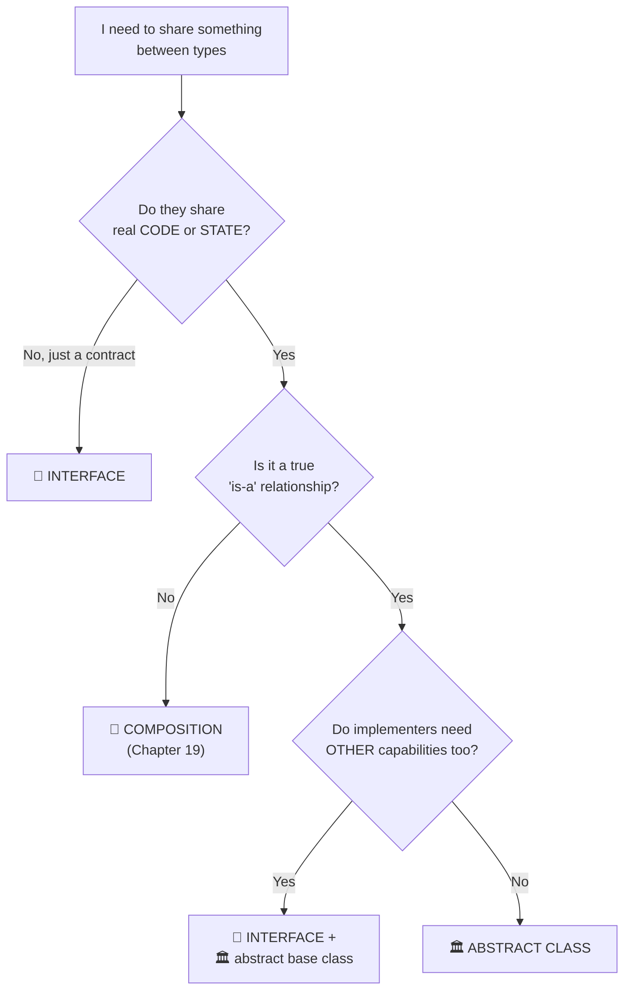

## 18.7 🧪 Hands-on exercise

For each of these, decide: abstract class, interface, both, or neither. Write one sentence of
justification for each.

1. `Shape` with `Circle`, `Square`, `Triangle`
2. Something that can be saved to disk
3. `Vehicle` with `Car`, `Motorcycle`, `Truck`
4. Something that can be compared for sorting
5. `PaymentMethod` with `Card`, `Cash`, `Crypto`
6. Something that can be undone (an editor command)

---
<div align="center">

# 🟠 PART 3 — BUILDING REAL TYPES

*Everything C# gives you for modelling real problems.*

</div>

---

# 19. 🧩 Composition and object relationships

**Level: ⭐⭐ Intermediate**

### 🗣️ In plain English

**Composition** means building a thing out of other things.

A car is not "a kind of engine". A car **has** an engine, **has** wheels, **has** a gearbox.
That is composition — and it is how almost everything in the real world is built.

Inheritance says **"is a"**. Composition says **"has a"** or **"uses a"**.

> 🎓 **The single most repeated piece of advice in OOP:**
> ### **Favour composition over inheritance.**
> Not "never inherit". *Favour.* Reach for composition first, and inherit only when
> "is-a" is genuinely true.

## 19.1 Composition in code

```csharp
public class Engine
{
    public int HorsePower { get; }

    public Engine(int horsePower) => HorsePower = horsePower;

    public void Start() => Console.WriteLine($"Engine ({HorsePower}hp) started.");
    public void Stop()  => Console.WriteLine("Engine stopped.");
}

public class GpsNavigator
{
    public void NavigateTo(string destination)
        => Console.WriteLine($"Navigating to {destination}.");
}

public class Car
{
    // 🧩 The Car HAS these. It is not a kind of them.
    private readonly Engine engine;
    private readonly GpsNavigator navigator;

    public string Model { get; }

    public Car(string model, Engine engine, GpsNavigator navigator)
    {
        Model = model;
        this.engine = engine;
        this.navigator = navigator;
    }

    public void StartTrip(string destination)
    {
        engine.Start();
        navigator.NavigateTo(destination);
        Console.WriteLine($"{Model} is on its way.");
    }
}
```

```csharp
var car = new Car("Corolla", new Engine(132), new GpsNavigator());
car.StartTrip("Colombo");
```

## 19.2 Why composition usually wins

Here is the same problem solved both ways. Judge for yourself.

❌ **With inheritance — the class count explodes:**

```csharp
public class Vehicle { }
public class ElectricVehicle : Vehicle { }
public class AutonomousVehicle : Vehicle { }
public class AutonomousElectricVehicle : ??? // 💥 you can only pick ONE base class
```

You now need `ElectricCar`, `PetrolCar`, `AutonomousElectricCar`, `AutonomousPetrolCar`,
`AutonomousElectricTruck`... The class count multiplies.

✅ **With composition — features plug in:**

```csharp
public interface IPowerSource { void Supply(); }
public class ElectricMotor : IPowerSource { public void Supply() => Console.WriteLine("⚡ Battery"); }
public class PetrolEngine  : IPowerSource { public void Supply() => Console.WriteLine("⛽ Petrol"); }

public interface IDriver { void Drive(); }
public class HumanDriver     : IDriver { public void Drive() => Console.WriteLine("🧑 Human driving"); }
public class AutonomousDriver: IDriver { public void Drive() => Console.WriteLine("🤖 Self-driving"); }

public class Vehicle
{
    private readonly IPowerSource power;
    private readonly IDriver driver;

    public Vehicle(IPowerSource power, IDriver driver)
    {
        this.power = power;
        this.driver = driver;
    }

    public void Go() { power.Supply(); driver.Drive(); }
}
```

Every combination, from four small classes:

```csharp
new Vehicle(new ElectricMotor(), new AutonomousDriver()).Go();  // ⚡ + 🤖
new Vehicle(new PetrolEngine(),  new HumanDriver()).Go();       // ⛽ + 🧑
new Vehicle(new ElectricMotor(), new HumanDriver()).Go();       // ⚡ + 🧑
```

And you can even **change it at runtime**, which inheritance can never do.

| | 🧬 Inheritance | 🧩 Composition |
|---|---|---|
| Decided | At compile time, permanently | At runtime, swappable |
| Coupling | 🔗 Very tight | 🪶 Loose |
| Combinations | Multiply into class explosion | Mix and match freely |
| Testability | Must construct the whole hierarchy | Inject a fake for one part |
| Base class changes | Can silently break subclasses | Contained behind an interface |

## 19.3 The five relationship types

There is a spectrum of "how strongly does A depend on B". Learn all five — they show up in every
design discussion and every UML diagram.

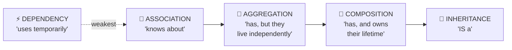

### ① ⚡ Dependency — "uses temporarily"

The weakest link. A passes through a method, and is gone.

```csharp
public class ReportService
{
    // IFileWriter is used only for the duration of this call. Not stored.
    public void Export(Report report, IFileWriter writer)
    {
        writer.Write(report.Content);
    }
}
```

**🎯 Use when:** the collaborator is needed for one operation only.

### ② 🤝 Association — "knows about"

A holds a reference to B, but neither owns the other.

```csharp
public class Teacher
{
    public string Name { get; init; } = "";
    public List<Student> Students { get; } = new();     // Teacher knows Students
}

public class Student
{
    public string Name { get; init; } = "";
    public Teacher? Advisor { get; set; }               // Student knows Teacher
}
```

**Real examples:** Teacher ↔ Student, Customer ↔ Order, Author ↔ Book.

### ③ 🔗 Aggregation — "has, but they live independently"

A whole-part relationship where the part **survives** the whole.

```csharp
public class Department
{
    private readonly List<Employee> employees = new();

    public string Name { get; init; } = "";
    public IReadOnlyList<Employee> Employees => employees;

    public void Assign(Employee employee) => employees.Add(employee);
    public void Release(Employee employee) => employees.Remove(employee);
}
```

Delete the Department, and the Employees still exist — they just move somewhere else.

**Real examples:** Department ↔ Employees, Team ↔ Players, Playlist ↔ Songs.

### ④ 🧩 Composition — "has, and owns their lifetime"

The part **cannot exist** without the whole, and dies with it.

```csharp
public class Order
{
    private readonly List<OrderItem> items = new();

    public IReadOnlyList<OrderItem> Items => items;

    // 👑 The Order CREATES its own items — they have no life outside it.
    public void AddItem(string productName, int quantity, decimal unitPrice)
    {
        if (quantity <= 0)
            throw new ArgumentException("Quantity must be positive.");

        items.Add(new OrderItem(productName, quantity, unitPrice));
    }

    public decimal Total => items.Sum(i => i.LineTotal);
}

public class OrderItem
{
    public string ProductName { get; }
    public int Quantity { get; }
    public decimal UnitPrice { get; }

    // internal: only the Order (in this assembly) may create one.
    internal OrderItem(string productName, int quantity, decimal unitPrice)
    {
        ProductName = productName;
        Quantity = quantity;
        UnitPrice = unitPrice;
    }

    public decimal LineTotal => Quantity * UnitPrice;
}
```

Delete the Order, and its OrderItems are meaningless. They go with it.

**Real examples:** Order ↔ OrderItems, House ↔ Rooms, Invoice ↔ InvoiceLines, Human ↔ Heart.

🔗 **Connects to:** this is exactly what an **Aggregate** is in domain modelling
([Chapter 41](#41--domain-modeling-and-architecture)).

### ⑤ 🧬 Inheritance — "IS a"

Covered fully in [Chapter 15](#15--inheritance). The strongest and least flexible relationship.

### The summary table

| Relationship | Strength | Lifetime | Question to ask | Example |
|---|:---:|---|---|---|
| ⚡ Dependency | ▁ | none | "Does A *use* B for a moment?" | `Export(report, writer)` |
| 🤝 Association | ▃ | independent | "Does A *know* B?" | Teacher ↔ Student |
| 🔗 Aggregation | ▅ | independent | "Does A *have* B, but B survives?" | Department ↔ Employees |
| 🧩 Composition | ▇ | shared | "Does B die with A?" | Order ↔ OrderItems |
| 🧬 Inheritance | █ | n/a | "Is A *a kind of* B?" | Manager → Employee |

## 19.4 Multiplicity — how many of each?

```text
One-to-one    Customer  ──── 1:1 ────  Profile
One-to-many   Customer  ──── 1:N ────  Orders
Many-to-many  Student   ──── N:N ────  Courses
```

In code:

```csharp
public class Customer
{
    public Profile Profile { get; init; } = new();       // 1 : 1
    public List<Order> Orders { get; } = new();          // 1 : N
}

public class Student
{
    public List<Enrollment> Enrollments { get; } = new(); // N : N via a join entity
}

public class Course
{
    public List<Enrollment> Enrollments { get; } = new();
}

// For many-to-many, the join usually deserves to be a real class —
// it almost always carries its own data.
public class Enrollment
{
    public Student Student { get; init; } = null!;
    public Course Course { get; init; } = null!;
    public DateOnly EnrolledOn { get; init; }
    public decimal? FinalGrade { get; set; }
}
```

> 💡 **Tip** — When you model many-to-many, ask *"is there any data about the relationship
> itself?"* (a date, a grade, a role). There almost always is. Make it a class.

## 19.5 Composition + interfaces = the professional default

```csharp
public class OrderProcessor
{
    private readonly IPaymentGateway payment;
    private readonly IInventoryService inventory;
    private readonly IEmailSender email;
    private readonly ILogger logger;

    public OrderProcessor(
        IPaymentGateway payment,
        IInventoryService inventory,
        IEmailSender email,
        ILogger logger)
    {
        this.payment = payment;
        this.inventory = inventory;
        this.email = email;
        this.logger = logger;
    }

    public void Process(Order order)
    {
        logger.Info($"Processing order {order.Id}");
        inventory.Reserve(order.Items);
        payment.Charge(order.Total);
        email.Send(order.CustomerEmail, "Order confirmed", "Thanks!");
    }
}
```

Every collaborator is an **interface**, injected from outside. This class:
- can be tested with four fakes, offline, in milliseconds
- has no idea whether payment is Stripe or PayPal
- has exactly one responsibility: **orchestrating** the steps

🔗 **Connects to:** [Dependency Injection](#39--dependency-injection).

## 19.6 🧪 Hands-on exercise

Model a **pizza ordering system** and label each relationship:

- `Pizza` and `Topping` — which relationship?
- `Order` and `Pizza` — which?
- `Customer` and `Order` — which?
- `Restaurant` and `Chef` — which?
- `Chef` and `Oven` (shared kitchen equipment) — which?

Then implement it, and make it **impossible** to create a `Topping` that isn't attached to a pizza.

---

# 20. 🎚️ Enums and type-safe choices

**Level: ⭐ Beginner**

### 🗣️ In plain English

An **enum** is a fixed list of named choices.

Days of the week. Order statuses. Traffic-light colours. Card suits. There are exactly N options
and never any others — so let the compiler enforce that.

## 20.1 The problem enums solve

❌ **Magic strings — the silent-bug factory:**

```csharp
public class Order
{
    public string Status { get; set; } = "Draft";
}
```

```csharp
order.Status = "Shipped";
order.Status = "shipped";        // 😱 different! Now comparisons fail
order.Status = "Shiped";         // 😱 typo — compiles fine, breaks at runtime
order.Status = "banana";         // 😱 totally invalid — nothing stops it
```

The compiler cannot help you. Every comparison is a coin flip.

✅ **An enum — the compiler becomes your proofreader:**

```csharp
public enum OrderStatus
{
    Draft,        // = 0
    Submitted,    // = 1
    Paid,         // = 2
    Shipped,      // = 3
    Delivered,    // = 4
    Cancelled     // = 5
}
```

```csharp
order.Status = OrderStatus.Shipped;   // ✅
// order.Status = OrderStatus.Shiped; // ❌ compiler error — typo caught instantly
// order.Status = "banana";           // ❌ compiler error — wrong type
```

Plus you get **IntelliSense**: type `OrderStatus.` and your editor lists every legal value.

## 20.2 Using an enum properly

```csharp
public class Order
{
    public OrderStatus Status { get; private set; } = OrderStatus.Draft;

    public void Submit()
    {
        if (Status != OrderStatus.Draft)
            throw new InvalidOperationException($"Cannot submit an order that is {Status}.");

        Status = OrderStatus.Submitted;
    }

    public void MarkPaid()
    {
        if (Status != OrderStatus.Submitted)
            throw new InvalidOperationException($"Cannot pay an order that is {Status}.");

        Status = OrderStatus.Paid;
    }

    public void Ship()
    {
        if (Status != OrderStatus.Paid)
            throw new InvalidOperationException("Cannot ship an unpaid order.");

        Status = OrderStatus.Shipped;
    }
}
```

Switching on an enum, with the compiler checking you:

```csharp
public string GetStatusMessage(OrderStatus status) => status switch
{
    OrderStatus.Draft     => "Still being prepared",
    OrderStatus.Submitted => "Waiting for payment",
    OrderStatus.Paid      => "Payment received",
    OrderStatus.Shipped   => "On its way",
    OrderStatus.Delivered => "Delivered",
    OrderStatus.Cancelled => "Cancelled",
    _ => throw new ArgumentOutOfRangeException(nameof(status))
};
```

> 💡 **Tip** — Leave out the `_` arm and the compiler will **warn you** when you add a new enum
> value and forget to handle it. That warning is worth more than the convenience of `_`.

## 20.3 Explicit values and underlying types

```csharp
public enum HttpStatusCode
{
    Ok = 200,
    Created = 201,
    BadRequest = 400,
    Unauthorized = 401,
    NotFound = 404,
    ServerError = 500
}

// You can also choose the underlying integer type:
public enum SmallStatus : byte
{
    Inactive = 0,
    Active = 1
}
```

**🎯 Set explicit values when:** the numbers matter outside your program — database columns,
API contracts, file formats, protocol codes.

> ⚠️ **Gotcha** — If the values are stored anywhere (a database, a saved file), **never reorder
> or renumber** an enum. `Shipped = 3` yesterday and `Shipped = 4` today means every stored row
> now means something different. Always append new values at the end.

## 20.4 `[Flags]` — combining several options at once

```csharp
[Flags]
public enum FileAccess
{
    None    = 0,
    Read    = 1,     // 0001
    Write   = 2,     // 0010
    Execute = 4,     // 0100
    Delete  = 8,     // 1000

    ReadWrite = Read | Write,        // 0011
    All = Read | Write | Execute | Delete
}
```

```csharp
FileAccess permissions = FileAccess.Read | FileAccess.Write;

Console.WriteLine(permissions);                           // "ReadWrite"  ← see the gotcha below
Console.WriteLine(permissions.HasFlag(FileAccess.Read));  // True
Console.WriteLine(permissions.HasFlag(FileAccess.Delete));// False

permissions |= FileAccess.Execute;                        // add a flag
permissions &= ~FileAccess.Write;                         // remove a flag
Console.WriteLine(permissions);                           // "Read, Execute"
```

**🎯 Use `[Flags]` when:** several options can be true simultaneously (permissions, feature
toggles, event filters).

> ⚠️ **Gotcha 1 — the values must be powers of two**
> Flag values **must** be 1, 2, 4, 8, 16... Otherwise the bit-combining silently produces
> nonsense. (Composite names like `ReadWrite = Read | Write` are fine — they're combinations,
> not new bits.)

> ⚠️ **Gotcha 2 — `ToString()` prefers named composites**
> Because `ReadWrite = Read | Write` is a *named* value, `Read | Write` prints as **`"ReadWrite"`**,
> not `"Read, Write"`. Only combinations with no name of their own get the comma-separated form.
> If you want the individual flags listed, don't define composite names — or build the string
> yourself from `Enum.GetValues<FileAccess>()`.

## 20.5 Converting to and from enums

```csharp
// Enum → int
int code = (int)HttpStatusCode.NotFound;              // 404

// int → Enum  (⚠️ no validation!)
HttpStatusCode status = (HttpStatusCode)404;          // Ok
HttpStatusCode bad = (HttpStatusCode)9999;            // 😱 compiles, and is meaningless

// ✅ Always validate when the number comes from outside:
if (Enum.IsDefined(typeof(HttpStatusCode), 9999))
    Console.WriteLine("valid");
else
    Console.WriteLine("invalid");                     // ← this runs

// string → Enum
if (Enum.TryParse<OrderStatus>("Shipped", ignoreCase: true, out var parsed))
    Console.WriteLine(parsed);                        // Shipped

// List every value
foreach (OrderStatus value in Enum.GetValues<OrderStatus>())
    Console.WriteLine(value);
```

> ⚠️ **Gotcha 1** — Casting *any* integer to an enum succeeds, even nonsense values. Any enum
> arriving from a database, API, or user input **must** be validated with `Enum.IsDefined` or
> `Enum.TryParse`.

> ⚠️ **Gotcha 2 — `Enum.IsDefined` does NOT work for `[Flags]` enums**
> It checks for a **single named value**, so a perfectly legal combination fails it:
> ```csharp
> var permissions = FileAccess.Read | FileAccess.Execute;   // a valid combination
> Enum.IsDefined(typeof(FileAccess), permissions);          // ❌ False!
> ```
> For a flags enum, check that no unknown bits are set instead:
> ```csharp
> public static bool IsValid(FileAccess value)
> {
>     FileAccess all = FileAccess.Read | FileAccess.Write
>                    | FileAccess.Execute | FileAccess.Delete;
>
>     return (value & ~all) == 0;      // ✅ true if every bit set is one we know
> }
> ```

## 20.6 When an enum is NOT enough

Enums hold names and numbers. They cannot hold behaviour. When each option needs its own logic,
you have two better options.

### Option A — a `switch` expression over the enum (simple cases)

```csharp
public static class OrderStatusExtensions
{
    public static bool CanBeCancelled(this OrderStatus status) => status switch
    {
        OrderStatus.Draft or OrderStatus.Submitted or OrderStatus.Paid => true,
        _ => false
    };
}

// Usage reads beautifully:
if (order.Status.CanBeCancelled()) { /* ... */ }
```

### Option B — polymorphic classes (complex cases)

When each option carries real, differing logic, use classes instead
([Chapter 16.4](#164-replace-ifswitch-with-polymorphism)):

```csharp
// ❌ An enum plus a giant switch that keeps growing
public enum SubscriptionTier { Free, Pro, Enterprise }

// ✅ Each tier owns its own rules
public interface ISubscriptionTier
{
    string Name { get; }
    int MaxProjects { get; }
    decimal MonthlyPrice { get; }
    bool SupportsSso { get; }
}

public class FreeTier : ISubscriptionTier
{
    public string Name => "Free";
    public int MaxProjects => 3;
    public decimal MonthlyPrice => 0m;
    public bool SupportsSso => false;
}

public class EnterpriseTier : ISubscriptionTier
{
    public string Name => "Enterprise";
    public int MaxProjects => int.MaxValue;
    public decimal MonthlyPrice => 499m;
    public bool SupportsSso => true;
}
```

### The decision table

| Situation | Use |
|---|---|
| A fixed list of labels, no behaviour | 🎚️ **Enum** |
| A few simple rules per value | 🎚️ Enum + `switch` expression / extension methods |
| Each value has meaningful, differing behaviour | 🏗️ **Polymorphic classes** |
| Options combine (permissions) | 🎚️ `[Flags]` enum |
| The list comes from a database and can grow | 🗄️ A lookup table / entity, not an enum |

> 🎓 **Professor's rule** — Enums are for **naming choices**, not for **holding behaviour**.
> The moment your enum has a `switch` in three different files, it wants to be a class hierarchy.

## 20.7 🧪 Hands-on exercise

1. Create a `TrafficLight` enum (`Red`, `Yellow`, `Green`).
2. Write a `TrafficLightController` that only allows Green → Yellow → Red → Green.
3. Any other transition throws with a clear message.
4. Add a `[Flags] enum VehiclePermission { None, Cars, Trucks, Bicycles, Pedestrians }` and
   report which are allowed at each light.

---

# 21. 🧰 Generics

**Level: ⭐⭐ Intermediate**

### 🗣️ In plain English

A **generic** is a class or method with a **blank** in it — a placeholder for a type you fill in
later.

Think of a **shipping box**. The box's design (dimensions, handles, "this way up" label) is the
same whether you put books, shoes, or laptops in it. You do not design a `BookBox`, a `ShoeBox`,
and a `LaptopBox`. You design **one** `Box<T>` and say what goes in it when you use it.

## 21.1 The problem generics solve

❌ **Without generics — write it once per type:**

```csharp
public class IntList  { private int[] items;    /* 50 lines */ }
public class StringList { private string[] items; /* the SAME 50 lines */ }
public class OrderList  { private Order[] items;  /* the SAME 50 lines again */ }
```

❌ **Or use `object` — and lose all safety:**

```csharp
public class ObjectList
{
    private readonly List<object> items = new();
    public void Add(object item) => items.Add(item);
    public object Get(int index) => items[index];
}
```

```csharp
var list = new ObjectList();
list.Add("hello");
list.Add(42);                            // 😱 nothing stops mixing types
string s = (string)list.Get(1);          // 💥 InvalidCastException at RUNTIME
```

✅ **With generics — write it once, safe for every type:**

```csharp
public class Box<T>          // 👈 T is the blank
{
    public T Value { get; }

    public Box(T value) => Value = value;

    public void Describe() => Console.WriteLine($"Box containing: {Value}");
}
```

```csharp
Box<int> numberBox = new Box<int>(100);
Box<string> textBox = new Box<string>("Hello");
Box<Order> orderBox = new Box<Order>(myOrder);

int number = numberBox.Value;      // ✅ no cast — the compiler knows it's an int
// numberBox = new Box<int>("oops"); // ❌ compiler error — caught before you run
```

| | `object` version | Generic version |
|---|---|---|
| Type errors caught | 💥 At runtime | ✅ At compile time |
| Casting needed | Yes, everywhere | No |
| Boxing value types | Yes (slow) | No |
| IntelliSense help | Useless (`object`) | Full |

> 🎓 **Professor's rule** — Generics let you write code **once** that is **type-safe for every
> type**. If you're writing the same class twice for two types, you want a generic.

## 21.2 Generic methods

The type parameter can live on a single method instead of the whole class:

```csharp
public static class Utility
{
    public static void Swap<T>(ref T a, ref T b) => (a, b) = (b, a);

    public static T? FirstOrDefault<T>(IEnumerable<T> source, Func<T, bool> predicate)
    {
        foreach (T item in source)
            if (predicate(item))
                return item;

        return default;      // 👈 default(T): 0 for int, null for reference types
    }
}
```

```csharp
int x = 1, y = 2;
Utility.Swap(ref x, ref y);          // 👈 no <int> needed — the compiler infers it

string a = "first", b = "second";
Utility.Swap(ref a, ref b);          // 👈 same method, different type
```

> 💡 **Tip** — **Type inference** means you rarely write the `<T>` at the call site. The compiler
> works it out from the arguments. You only specify it explicitly when it cannot (e.g. when `T`
> appears only in the return type).

## 21.3 Generic interfaces

```csharp
public interface IRepository<T>
{
    void Add(T item);
    T? GetById(int id);
    IReadOnlyList<T> GetAll();
    bool Remove(int id);
}
```

```csharp
public class CustomerRepository : IRepository<Customer> { /* ... */ }
public class ProductRepository  : IRepository<Product>  { /* ... */ }
```

## 21.4 Constraints — telling the compiler what `T` can do

By default, the compiler knows **nothing** about `T`, so you can barely use it:

```csharp
public class Repository<T>
{
    private readonly List<T> items = new();

    public T? GetById(int id)
    {
        // ❌ compiler error: 'T' does not contain a definition for 'Id'
        // return items.FirstOrDefault(item => item.Id == id);
        return default;
    }
}
```

A **constraint** fixes that — it is a promise about what `T` will be:

```csharp
public abstract class Entity
{
    public int Id { get; protected set; }
}

public class Repository<T> where T : Entity      // 👈 "T is always an Entity or a subclass"
{
    private readonly List<T> items = new();

    public void Add(T item)
    {
        ArgumentNullException.ThrowIfNull(item);
        items.Add(item);
    }

    public T? GetById(int id)
        => items.FirstOrDefault(item => item.Id == id);   // ✅ now legal — T has an Id

    public IReadOnlyList<T> GetAll() => items;

    public bool Remove(int id)
    {
        T? found = GetById(id);
        return found is not null && items.Remove(found);
    }
}
```

```csharp
public class Product : Entity { public string Name { get; set; } = ""; }
public class Customer : Entity { public string Email { get; set; } = ""; }

var products = new Repository<Product>();
var customers = new Repository<Customer>();
// var bad = new Repository<string>();   // ❌ string is not an Entity
```

### The full constraint list

| Constraint | Means | 🎯 Use when |
|---|---|---|
| `where T : class` | T is a reference type | You need `null` to be valid |
| `where T : struct` | T is a non-nullable value type | Numeric or small-value algorithms |
| `where T : notnull` | T is never null | Dictionary keys |
| `where T : new()` | T has a public parameterless constructor | You need to `new T()` |
| `where T : SomeBaseClass` | T inherits from that class | You need its members |
| `where T : ISomeInterface` | T implements that interface | You need its contract |
| `where T : U` | T derives from another type parameter | Advanced generic relationships |
| `where T : unmanaged` | T contains no references | Interop, `Span<T>` |
| `where T : Enum` | T is an enum | Generic enum helpers |
| `where T : Delegate` | T is a delegate | Generic event plumbing |

### Multiple constraints

```csharp
public class EntityFactory<T> where T : Entity, IValidatable, new()
{
    public T Create()
    {
        T entity = new T();      // ✅ legal because of new()
        entity.Validate();       // ✅ legal because of IValidatable
        return entity;
    }
}
```

> ⚠️ **Gotcha** — Order matters: `class`/`struct` first, then base class, then interfaces,
> then `new()` last. The compiler will tell you if you get it wrong.

## 21.5 Generic classes with interface constraints — a real example

```csharp
public interface INotificationSender
{
    string Channel { get; }
    void Send(string recipient, string message);
}

public class EmailSender : INotificationSender
{
    public string Channel => "Email";
    public void Send(string recipient, string message)
        => Console.WriteLine($"📧 {recipient}: {message}");
}

public class SmsSender : INotificationSender
{
    public string Channel => "SMS";
    public void Send(string recipient, string message)
        => Console.WriteLine($"📱 {recipient}: {message}");
}

public class NotificationService<TSender> where TSender : INotificationSender
{
    private readonly TSender sender;

    public NotificationService(TSender sender) => this.sender = sender;

    public void Notify(string recipient, string message)
    {
        Console.WriteLine($"Sending via {sender.Channel}...");
        sender.Send(recipient, message);
    }
}
```

```csharp
var emailService = new NotificationService<EmailSender>(new EmailSender());
emailService.Notify("anna@example.com", "Welcome!");
```

> 💡 **When would you NOT make this generic?** If you never need the *specific* type, a plain
> `INotificationSender` field is simpler:
> ```csharp
> public class NotificationService
> {
>     private readonly INotificationSender sender;
>     public NotificationService(INotificationSender sender) => this.sender = sender;
> }
> ```
> **Use a generic parameter only when the concrete type actually matters** (for `new T()`,
> for avoiding boxing, or for returning `T`).

## 21.6 Multiple type parameters

```csharp
public class Cache<TKey, TValue> where TKey : notnull
{
    private readonly Dictionary<TKey, TValue> store = new();

    public void Set(TKey key, TValue value) => store[key] = value;

    public bool TryGet(TKey key, out TValue? value) => store.TryGetValue(key, out value);
}
```

```csharp
var cache = new Cache<string, Customer>();
cache.Set("anna", annaCustomer);

var scores = new Cache<int, List<double>>();
```

> 💡 **Naming convention** — A single parameter is `T`. Multiple parameters get descriptive names
> starting with `T`: `TKey`, `TValue`, `TResult`, `TEntity`, `TSender`.

## 21.7 Generic delegates

```csharp
public delegate TResult Transformer<TInput, TResult>(TInput input);
```

```csharp
Transformer<string, int> lengthOf = text => text.Length;
Console.WriteLine(lengthOf("Hello"));      // 5

Transformer<Order, decimal> totalOf = order => order.Total;
```

In practice, .NET's built-in `Func<>` and `Action<>` cover almost everything
([Chapter 30](#30--delegates-lambdas-events-and-callbacks)):

```csharp
Func<string, int> lengthOf2 = text => text.Length;      // same thing, no custom delegate
```

## 21.8 Variance: `out` and `in` ⭐⭐⭐

This is the part of generics people find hardest. Here it is in plain English.

### The question variance answers

A `Dog` **is an** `Animal`. So — is a `List<Dog>` also a `List<Animal>`?

**Answer: no.** And here is exactly why:

```csharp
List<Dog> dogs = new List<Dog>();
// List<Animal> animals = dogs;      // ❌ if C# allowed this...
// animals.Add(new Cat());           // ...you could put a Cat in your List<Dog>! 💥
```

That is called **invariance**: `List<T>` is neither up- nor down-compatible. It protects you.

### 📤 Covariance (`out`) — safe when T only comes OUT

If a generic type only ever **returns** `T` and never **accepts** it, going "up" is safe:

```csharp
public interface IProducer<out T>       // 👈 `out` = T only appears in output positions
{
    T Produce();
}
```

```csharp
IProducer<Dog> dogFactory = new DogFactory();
IProducer<Animal> animalFactory = dogFactory;   // ✅ safe!

Animal a = animalFactory.Produce();   // it hands you a Dog, which IS an Animal. Fine.
```

You already rely on this every day:

```csharp
IEnumerable<string> strings = new List<string> { "a", "b" };
IEnumerable<object> objects = strings;      // ✅ works — IEnumerable<out T> is covariant
```

### 📥 Contravariance (`in`) — safe when T only goes IN

If a generic type only ever **accepts** `T` and never returns it, going "down" is safe:

```csharp
public interface IConsumer<in T>        // 👈 `in` = T only appears in input positions
{
    void Consume(T item);
}
```

```csharp
IConsumer<Animal> animalHandler = new AnimalHandler();
IConsumer<Dog> dogHandler = animalHandler;     // ✅ safe!

dogHandler.Consume(new Dog());
// Something that can handle ANY animal can certainly handle a Dog.
```

The classic real use: comparers.

```csharp
IComparer<Animal> byName = Comparer<Animal>.Create((x, y) => 0);
IComparer<Dog> dogComparer = byName;    // ✅ IComparer<in T> is contravariant
```

### The memory aid

```text
  out  📤  T comes OUT     →  COvariant     →  you can go UP   (Dog → Animal)
  in   📥  T goes IN       →  CONTRAvariant →  you can go DOWN (Animal → Dog)
  both 🔄  T does both     →  INvariant     →  no conversion at all
```

| Type | Variance | Why |
|---|---|---|
| `IEnumerable<out T>` | 📤 Covariant | You only read items out |
| `IReadOnlyList<out T>` | 📤 Covariant | Same |
| `Func<out TResult>` | 📤 Covariant | Only returns |
| `IComparer<in T>` | 📥 Contravariant | Only accepts |
| `Action<in T>` | 📥 Contravariant | Only accepts |
| `IList<T>`, `List<T>` | 🔄 Invariant | Both reads and writes |

> ⚠️ **Gotcha — array covariance is a historic mistake**
> ```csharp
> object[] array = new string[3];     // ✅ compiles (arrays are covariant)
> array[0] = 42;                      // 💥 ArrayTypeMismatchException at RUNTIME
> ```
> Arrays got covariance before generics existed, and it is unsafe. Generics fixed it.
> **Use `List<T>`/`IReadOnlyList<T>`, not arrays**, and this can never bite you.

## 21.9 Generics you will use every single day

```csharp
List<Student> students;                 // a list of anything
Dictionary<int, Product> productsById;  // key → value lookup
HashSet<string> uniqueTags;             // unique items
IEnumerable<Order> orderSequence;       // "something I can foreach over"
Nullable<int> maybeNumber;              // usually written int?
Task<ApiResponse<User>> apiCall;        // async result
Func<Order, bool> isLargeOrder;         // a function you can pass around
Action<string> logMessage;              // an action you can pass around
IRepository<Customer> customerRepo;     // your own generic abstraction
```

## 21.10 🧪 Hands-on exercise

Build a reusable, generic, in-memory repository:

1. `public abstract class Entity { public int Id { get; protected set; } }`
2. `Product : Entity` and `Customer : Entity`
3. `Repository<T> where T : Entity` with `Add`, `GetById`, `GetAll`, `Remove`, and
   `Find(Func<T, bool> predicate)`
4. Use the **same** repository class for both `Product` and `Customer`
5. **Bonus:** add `where T : Entity, new()` and a `CreateAndAdd()` method

---

# 22. 📚 Collections and LINQ with objects

**Level: ⭐⭐ Intermediate**

### 🗣️ In plain English

Real programs rarely have *one* customer. They have thousands. **Collections** are how you store
many objects; **LINQ** is how you ask questions about them.

Think of collections as different kinds of containers:

| Container | Analogy |
|---|---|
| `List<T>` | A numbered shopping list — order matters, duplicates allowed |
| `Dictionary<K,V>` | A phone book — look up instantly by name |
| `HashSet<T>` | A guest list — each person appears once |
| `Queue<T>` | A ticket queue — first in, first served |
| `Stack<T>` | A stack of plates — take the top one |

## 22.1 Choosing the right collection

| Collection | Ordered? | Duplicates? | Lookup speed | 🎯 Use when |
|---|:---:|:---:|:---:|---|
| `List<T>` | ✅ | ✅ | O(n) by value | **The default.** You need an ordered, growable list |
| `Dictionary<TKey,TValue>` | ❌ | Keys unique | ⚡ O(1) by key | You look things up by an ID or name |
| `HashSet<T>` | ❌ | ❌ | ⚡ O(1) | You need uniqueness, or fast "does it contain X?" |
| `Queue<T>` | ✅ FIFO | ✅ | — | Processing in arrival order (jobs, messages) |
| `Stack<T>` | ✅ LIFO | ✅ | — | Undo history, back button, recursion |
| `SortedList<K,V>` / `SortedDictionary` | ✅ by key | Keys unique | O(log n) | You need sorted key order |
| `LinkedList<T>` | ✅ | ✅ | O(n) | Constant-time insert/remove in the middle (rare) |
| `T[]` (array) | ✅ | ✅ | O(n) | Fixed size, performance-critical |

And the **abstractions** you should use in method signatures:

| Interface | Gives the caller | 🎯 Use as |
|---|---|---|
| `IEnumerable<T>` | `foreach` only | **Parameter type** — accept the widest range |
| `IReadOnlyList<T>` | Count + index + `foreach` | **Return type / property** — safe exposure |
| `IReadOnlyCollection<T>` | Count + `foreach` | Return type when index is meaningless |
| `ICollection<T>` | Add / Remove / Count | Rarely — you're giving away control |
| `IList<T>` | Everything a list does | Rarely |

> 🎓 **Professor's rule**
> **Accept the most general type you can (`IEnumerable<T>`); return the most useful safe type
> (`IReadOnlyList<T>`).**

## 22.2 Working with a list of objects

```csharp
public record Product(int Id, string Name, string Category, decimal Price, int Stock);
```

```csharp
List<Product> products =
[
    new(1, "Laptop",   "Electronics", 1200m, 5),
    new(2, "Mouse",    "Electronics",   25m, 50),
    new(3, "Desk",     "Furniture",    350m, 8),
    new(4, "Chair",    "Furniture",    150m, 0),
    new(5, "Monitor",  "Electronics",  300m, 12),
];
```

```csharp
products.Add(new Product(6, "Keyboard", "Electronics", 75m, 30));
products.RemoveAll(p => p.Stock == 0);          // remove everything out of stock
Console.WriteLine(products.Count);
Console.WriteLine(products[0].Name);            // index access
```

## 22.3 Dictionary — instant lookup by key

```csharp
Dictionary<int, Product> productsById = products.ToDictionary(p => p.Id);

// ✅ The safe way to read
if (productsById.TryGetValue(3, out Product? desk))
    Console.WriteLine(desk.Name);               // "Desk"

// ⚠️ The unsafe way — throws KeyNotFoundException if the key is missing
Product p = productsById[999];                  // 💥
```

> 🎓 **Professor's rule** — Use `TryGetValue`, not `[key]`, unless you have **just** checked that
> the key exists. `KeyNotFoundException` is one of the most common runtime crashes in .NET.

Handy dictionary patterns:

```csharp
productsById.TryAdd(7, newProduct);             // add only if absent, no exception
productsById[7] = newProduct;                   // add OR overwrite
bool exists = productsById.ContainsKey(3);
productsById.Remove(3);
```

## 22.4 LINQ — asking questions about objects

LINQ (Language INtegrated Query) lets you filter, sort, group, and reshape collections in a way
that reads almost like English.

```csharp
// "Give me electronics over $100, cheapest first, just the names."
List<string> result = products
    .Where(p => p.Category == "Electronics" && p.Price > 100)   // filter
    .OrderBy(p => p.Price)                                      // sort
    .Select(p => p.Name)                                        // reshape
    .ToList();                                                  // materialise
```

### The LINQ methods you will actually use

| Method | Does | Example |
|---|---|---|
| `Where` | Filter | `.Where(p => p.Price > 100)` |
| `Select` | Transform each item | `.Select(p => p.Name)` |
| `SelectMany` | Flatten nested lists | `.SelectMany(o => o.Items)` |
| `OrderBy` / `OrderByDescending` | Sort | `.OrderBy(p => p.Name)` |
| `ThenBy` | Secondary sort | `.OrderBy(c).ThenBy(p)` |
| `GroupBy` | Group into buckets | `.GroupBy(p => p.Category)` |
| `First` / `FirstOrDefault` | Get one | `.FirstOrDefault(p => p.Id == 3)` |
| `Single` / `SingleOrDefault` | Get exactly one (throws if 2+) | `.Single(p => p.Id == 3)` |
| `Any` | Does at least one match? | `.Any(p => p.Stock == 0)` |
| `All` | Do all match? | `.All(p => p.Price > 0)` |
| `Count` / `Sum` / `Average` / `Min` / `Max` | Aggregate | `.Sum(p => p.Price)` |
| `Distinct` | Remove duplicates | `.Select(p => p.Category).Distinct()` |
| `Take` / `Skip` | Paging | `.Skip(20).Take(10)` |
| `ToList` / `ToArray` / `ToDictionary` | Materialise | `.ToList()` |

### Realistic examples

```csharp
// 💰 Total inventory value
decimal totalValue = products.Sum(p => p.Price * p.Stock);

// 📊 Group by category with counts and totals
var byCategory = products
    .GroupBy(p => p.Category)
    .Select(g => new
    {
        Category = g.Key,
        Count = g.Count(),
        TotalValue = g.Sum(p => p.Price * p.Stock),
        MostExpensive = g.MaxBy(p => p.Price)!.Name
    })
    .OrderByDescending(x => x.TotalValue);

foreach (var group in byCategory)
    Console.WriteLine($"{group.Category}: {group.Count} items, {group.TotalValue:C}");

// ⚠️ Anything out of stock?
bool hasOutOfStock = products.Any(p => p.Stock == 0);

// 🔎 Find one, safely
Product? found = products.FirstOrDefault(p => p.Name == "Laptop");
if (found is not null)
    Console.WriteLine(found.Price);

// 📄 Page 3, 10 per page
var page3 = products.OrderBy(p => p.Id).Skip(20).Take(10).ToList();
```

### `First` vs `FirstOrDefault` vs `Single` — the difference that bites

| Method | 0 matches | 1 match | 2+ matches |
|---|---|---|---|
| `First()` | 💥 throws | ✅ returns it | ✅ returns the first |
| `FirstOrDefault()` | ✅ returns `null`/`default` | ✅ returns it | ✅ returns the first |
| `Single()` | 💥 throws | ✅ returns it | 💥 **throws** |
| `SingleOrDefault()` | ✅ returns `null` | ✅ returns it | 💥 **throws** |

**🎯 Use `Single`** when "more than one" would be a bug you *want* to know about (looking up by a
unique ID). **Use `FirstOrDefault`** for ordinary searching.

## 22.5 ⚠️ Deferred execution — the #1 LINQ gotcha

LINQ queries are **lazy**. They do nothing until you enumerate them.

```csharp
var query = products.Where(p => p.Price > 100);   // 👈 NOTHING has happened yet

products.Add(new Product(99, "Server", "Electronics", 5000m, 1));

foreach (var p in query)                          // 👈 NOW it runs
    Console.WriteLine(p.Name);                    // ...and includes the Server! 😱
```

Worse — it runs **again** every time you enumerate:

```csharp
var expensive = products.Where(p => { Console.WriteLine("filtering..."); return p.Price > 100; });

Console.WriteLine(expensive.Count());    // prints "filtering..." 6 times
Console.WriteLine(expensive.Count());    // prints "filtering..." 6 MORE times 😱
```

✅ **The fix — call `.ToList()` when you want the answer *now*:**

```csharp
List<Product> expensive = products.Where(p => p.Price > 100).ToList();   // ✅ evaluated once
```

> 🎓 **Professor's rule** — If you will use a query result **more than once**, or if the source
> might change, end it with `.ToList()`. If you're passing it straight into one `foreach`,
> leave it lazy — that's cheaper.

## 22.6 Exposing collections safely (recap)

```csharp
public class Order
{
    private readonly List<OrderItem> items = new();

    public IReadOnlyList<OrderItem> Items => items;         // ✅ safe view

    // ❌ public List<OrderItem> Items { get; set; }         // anyone can wreck it
}
```

🔗 Explained fully in [Chapter 13.3](#133-protecting-collections--the-leak-everyone-misses).

## 22.7 Collection expressions — modern initialisation

```csharp
List<int> numbers = [1, 2, 3, 4, 5];
int[] array = [1, 2, 3];
Span<char> letters = ['a', 'b', 'c'];

// The spread operator merges collections:
int[] more = [0, ..numbers, 6];         // [0, 1, 2, 3, 4, 5, 6]

List<Product> catalog =
[
    new(1, "Laptop", "Electronics", 1200m, 5),
    new(2, "Mouse",  "Electronics",   25m, 50),
];
```

## 22.8 🧪 Hands-on exercise

Given a `List<Order>` where each `Order` has a `CustomerName`, `PlacedOn`, and
`List<OrderItem> Items`:

1. Find the total revenue
2. Find the top 3 customers by total spend
3. Group orders by month and show the count per month
4. Find any customer who has ordered the same product twice
5. Produce a `Dictionary<string, decimal>` of customer name → total spend

Do all five with LINQ. Then rewrite #1 with a plain `foreach` and compare readability.

---

# 23. 🔁 Iterators and `yield`

**Level: ⭐⭐⭐ Advanced**

### 🗣️ In plain English

Normally a method does all its work and then hands you the finished result.

An **iterator** is a method that hands you results **one at a time, on demand** — and pauses in
between.

Think of a **vending machine that makes fresh coffee**. You do not get 100 cups delivered at once.
You press the button, it makes one cup, and waits. Press again, another cup. If you walk away
after two, it never makes the other 98.

## 23.1 The problem `yield` solves

❌ **Without `yield` — build the whole list first:**

```csharp
public List<int> GetEvenNumbers(int max)
{
    List<int> result = new();
    for (int i = 0; i <= max; i++)
        if (i % 2 == 0)
            result.Add(i);

    return result;      // 😱 for max = 10,000,000 this allocates a huge list
}
```

```csharp
// Even if you only want the first 5:
var first5 = GetEvenNumbers(10_000_000).Take(5);   // built 5 million items, used 5
```

✅ **With `yield` — produce items only as they are asked for:**

```csharp
public IEnumerable<int> GetEvenNumbers(int max)
{
    for (int i = 0; i <= max; i++)
        if (i % 2 == 0)
            yield return i;      // 👈 hand back ONE item, then PAUSE here
}
```

```csharp
var first5 = GetEvenNumbers(10_000_000).Take(5).ToList();
// ✅ The loop ran exactly 10 times, produced 5 items, then stopped. Zero waste.
```

## 23.2 How `yield return` actually behaves

```csharp
public IEnumerable<string> Steps()
{
    Console.WriteLine("→ starting");
    yield return "one";
    Console.WriteLine("→ resumed after one");
    yield return "two";
    Console.WriteLine("→ resumed after two");
    yield return "three";
    Console.WriteLine("→ finished");
}
```

```csharp
foreach (string step in Steps())
    Console.WriteLine($"got: {step}");
```

**Output — notice the interleaving:**

```text
→ starting
got: one
→ resumed after one
got: two
→ resumed after two
got: three
→ finished
```

The method **suspends** at each `yield return` and **resumes** exactly where it left off.

> ⚠️ **Gotcha** — Calling an iterator method runs **none** of its body:
> ```csharp
> var steps = Steps();      // nothing printed! The method has not started.
> foreach (var s in steps) { }   // NOW it runs.
> ```
> This means argument validation inside an iterator won't run until enumeration. Split it:
> ```csharp
> public IEnumerable<int> Take(int count)
> {
>     if (count < 0) throw new ArgumentOutOfRangeException(nameof(count));  // runs immediately
>     return TakeIterator(count);
> }
>
> private IEnumerable<int> TakeIterator(int count) { /* yield here */ yield break; }
> ```

## 23.3 `yield break` — stopping early

```csharp
public IEnumerable<string> ReadUntilBlank(IEnumerable<string> lines)
{
    foreach (string line in lines)
    {
        if (string.IsNullOrWhiteSpace(line))
            yield break;        // 👈 stop the sequence here

        yield return line.Trim();
    }
}
```

## 23.4 Making your own class `foreach`-able

Implement `IEnumerable<T>` and your class works with `foreach`, LINQ, and collection expressions.

```csharp
public class Playlist : IEnumerable<Song>
{
    private readonly List<Song> songs = new();

    public string Name { get; }

    public Playlist(string name) => Name = name;

    public void Add(Song song)
    {
        ArgumentNullException.ThrowIfNull(song);
        songs.Add(song);
    }

    // 👇 One method, and the whole world of foreach/LINQ opens up.
    public IEnumerator<Song> GetEnumerator() => songs.GetEnumerator();

    System.Collections.IEnumerator System.Collections.IEnumerable.GetEnumerator()
        => GetEnumerator();
}

public record Song(string Title, string Artist, TimeSpan Duration);
```

```csharp
var playlist = new Playlist("Road trip");
playlist.Add(new Song("Song A", "Artist 1", TimeSpan.FromMinutes(3.5)));
playlist.Add(new Song("Song B", "Artist 2", TimeSpan.FromMinutes(4.2)));

foreach (Song song in playlist)                     // ✅ foreach works
    Console.WriteLine(song.Title);

var longSongs = playlist.Where(s => s.Duration > TimeSpan.FromMinutes(4));  // ✅ LINQ works
TimeSpan total = playlist.Aggregate(TimeSpan.Zero, (sum, s) => sum + s.Duration);
```

**🎯 Use when:** your class *is* a collection of something — a `Playlist` of songs, an `Order` of
items, a `Matrix` of rows.

### Custom iteration order with `yield`

```csharp
public class BinaryTree<T> : IEnumerable<T>
{
    public T Value { get; init; } = default!;
    public BinaryTree<T>? Left { get; init; }
    public BinaryTree<T>? Right { get; init; }

    // In-order traversal, produced lazily.
    public IEnumerator<T> GetEnumerator()
    {
        if (Left is not null)
            foreach (T item in Left) yield return item;

        yield return Value;

        if (Right is not null)
            foreach (T item in Right) yield return item;
    }

    System.Collections.IEnumerator System.Collections.IEnumerable.GetEnumerator()
        => GetEnumerator();
}
```

Writing that traversal by hand, without `yield`, requires an explicit stack and about 40 lines.

## 23.5 `IAsyncEnumerable<T>` — streaming with `await`

For data that arrives over time (a database cursor, an API with paging, a live feed):

```csharp
public async IAsyncEnumerable<Order> StreamOrdersAsync()
{
    int page = 0;

    while (true)
    {
        List<Order> batch = await FetchPageAsync(page++);
        if (batch.Count == 0)
            yield break;

        foreach (Order order in batch)
            yield return order;
    }
}
```

```csharp
await foreach (Order order in StreamOrdersAsync())
    Console.WriteLine(order.Id);
```

🔗 **Connects to:** [Chapter 33 — Async, await, and OOP](#33--async-await-and-oop).

## 23.6 When to use `yield` — and when not to

| ✅ Use `yield` when | 🚫 Don't use `yield` when |
|---|---|
| The sequence is large or infinite | The collection is small and already in memory |
| The caller may not need all of it | The caller always needs all of it (just return a `List<T>`) |
| Producing each item is expensive | You need `Count` or index access |
| You're reading a file or stream line by line | The source might change while enumerating |
| You want to avoid holding everything in memory | The result will be enumerated many times |

> ⚠️ **Gotcha** — An `IEnumerable<T>` from `yield` re-runs its whole body **every time** you
> enumerate it. If enumerating is expensive or has side effects, call `.ToList()` once.

## 23.7 🧪 Hands-on exercise

1. Write `IEnumerable<int> Fibonacci()` that yields Fibonacci numbers **forever**.
   Use `.Take(10)` to prove it doesn't hang.
2. Write `IEnumerable<string> ReadLines(string path)` that yields file lines one at a time
   (hint: `using var reader = new StreamReader(path);`).
3. Make a `Deck` class of 52 `Card`s that implements `IEnumerable<Card>`, and use LINQ to find
   all the hearts.

---

# 24. ⚖️ Equality, comparison, sorting, and copying

**Level: ⭐⭐ Intermediate**

### 🗣️ In plain English

Three questions that look similar but are completely different:

| Question | Mechanism |
|---|---|
| "Are these two things **the same object**?" | Reference equality |
| "Are these two things **equal in value**?" | Value equality (`Equals`) |
| "Which of these comes **first**?" | Comparison (`IComparable`) |

Getting these wrong causes some of the strangest bugs in .NET — items that vanish from a
`HashSet`, `Contains` returning `false` for something you just added, sorts in random order.

## 24.1 Reference equality — "the same object"

```csharp
public class Customer
{
    public string Name { get; init; } = "";
}
```

```csharp
Customer a = new Customer { Name = "Anna" };
Customer b = a;                                  // same object, two labels
Customer c = new Customer { Name = "Anna" };     // different object, same data

Console.WriteLine(ReferenceEquals(a, b));   // True
Console.WriteLine(ReferenceEquals(a, c));   // False
Console.WriteLine(a == c);                  // False 😕  — surprising to most people
```

By default, `==` on a class compares **references**. Two customers with identical data are "not
equal", because they are two different objects.

**Sometimes that's exactly right** (two different `BankAccount`s that both hold $100 are *not* the
same account). **Sometimes it's wrong** (two `Money(100, "USD")` values *are* the same amount).

## 24.2 Value equality — "the same data"

To make two objects with the same data count as equal, implement `IEquatable<T>` and override
`Equals` and `GetHashCode`.

```csharp
public class Product : IEquatable<Product>
{
    public int Id { get; }
    public string Name { get; }

    public Product(int id, string name)
    {
        Id = id;
        Name = name;
    }

    // 1️⃣ The strongly-typed version — fast, no casting.
    public bool Equals(Product? other)
    {
        if (other is null) return false;
        if (ReferenceEquals(this, other)) return true;
        return Id == other.Id;                      // identity is the Id
    }

    // 2️⃣ The object version — required, delegates to #1.
    public override bool Equals(object? obj) => Equals(obj as Product);

    // 3️⃣ MUST match Equals. Equal objects MUST have equal hash codes.
    public override int GetHashCode() => Id.GetHashCode();

    // 4️⃣ Optional but very nice: make == and != work too.
    public static bool operator ==(Product? left, Product? right)
        => left?.Equals(right) ?? right is null;

    public static bool operator !=(Product? left, Product? right) => !(left == right);
}
```

```csharp
var p1 = new Product(1, "Laptop");
var p2 = new Product(1, "Laptop");

Console.WriteLine(p1.Equals(p2));           // True  ✅
Console.WriteLine(p1 == p2);                // True  ✅
Console.WriteLine(ReferenceEquals(p1, p2)); // False (still two objects — correct)
```

## 24.3 ⚠️ Why `GetHashCode` matters — the invisible bug

`Dictionary` and `HashSet` find items in two steps:
1. Compute the hash code → jump straight to a "bucket"
2. Inside that bucket, use `Equals` to find the exact item

If you override `Equals` but **not** `GetHashCode`, step 1 looks in the wrong bucket and step 2
never runs.

```csharp
// ❌ Equals overridden, GetHashCode forgotten:
var set = new HashSet<Product>();
set.Add(new Product(1, "Laptop"));

Console.WriteLine(set.Contains(new Product(1, "Laptop")));   // False 😱😱😱
```

The object is in there. You just cannot find it. This is a genuinely nasty bug.

### The three rules of `GetHashCode`

| Rule | Meaning |
|---|---|
| 1️⃣ | If `a.Equals(b)` then `a.GetHashCode() == b.GetHashCode()` — **mandatory** |
| 2️⃣ | Equal hash codes do **not** imply equality (collisions are normal and fine) |
| 3️⃣ | **Never** base a hash code on a value that can change while the object is in a set/dictionary |

Rule 3 explained:

```csharp
var set = new HashSet<MutableProduct>();
var product = new MutableProduct { Id = 1 };
set.Add(product);          // stored in bucket for hash(1)

product.Id = 2;            // 😱 hash is now hash(2), but it's sitting in bucket 1

set.Contains(product);     // False — it's lost inside its own set
```

> 🎓 **Professor's rule** — Hash on **immutable** values only. Ideally, on values set in the
> constructor and never changed.

For multiple fields, use the built-in helper — never invent your own formula:

```csharp
public override int GetHashCode() => HashCode.Combine(Id, Name, Category);
```

## 24.4 Records — value equality for free

All that ceremony, replaced by one line:

```csharp
public record Money(decimal Amount, string Currency);
```

```csharp
Money a = new Money(100, "USD");
Money b = new Money(100, "USD");

Console.WriteLine(a == b);          // True   ✅ generated for you
Console.WriteLine(a.Equals(b));     // True   ✅
Console.WriteLine(a.GetHashCode() == b.GetHashCode());  // True ✅
Console.WriteLine(a);               // Money { Amount = 100, Currency = USD }  ✅ ToString too
```

> 🎓 **Professor's rule** — If you want value equality, **use a `record`**. Hand-writing
> `Equals`/`GetHashCode` is only for the rare case where equality means something custom
> (e.g. "equal if the Ids match, ignoring every other field").

## 24.5 Comparison and sorting — `IComparable<T>`

Equality answers *"are these the same?"*. Comparison answers *"which comes first?"*.

```csharp
public class Employee : IComparable<Employee>
{
    public string Name { get; init; } = "";
    public decimal Salary { get; init; }

    // Return: negative = I come first, 0 = tie, positive = other comes first
    public int CompareTo(Employee? other)
    {
        if (other is null) return 1;
        return Salary.CompareTo(other.Salary);      // default order: by salary
    }

    public override string ToString() => $"{Name} ({Salary:C})";
}
```

```csharp
List<Employee> staff =
[
    new() { Name = "Anna",  Salary = 70_000 },
    new() { Name = "Gehan", Salary = 95_000 },
    new() { Name = "Maria", Salary = 60_000 },
];

staff.Sort();                       // ✅ uses CompareTo — sorted by salary
foreach (var e in staff) Console.WriteLine(e);
```

**🎯 Use `IComparable<T>` when:** the type has one obvious, natural order (dates by time, money by
amount, versions by number).

### `IComparer<T>` — many different orders

When there is no single natural order, or you need several:

```csharp
public class EmployeeByNameComparer : IComparer<Employee>
{
    public int Compare(Employee? x, Employee? y)
        => string.Compare(x?.Name, y?.Name, StringComparison.OrdinalIgnoreCase);
}
```

```csharp
staff.Sort(new EmployeeByNameComparer());

// Or, far more commonly, just use LINQ:
var bySalaryDesc = staff.OrderByDescending(e => e.Salary).ToList();
var byNameThenSalary = staff.OrderBy(e => e.Name).ThenByDescending(e => e.Salary).ToList();
```

| Use | When |
|---|---|
| `IComparable<T>` | The type has ONE natural order |
| `IComparer<T>` | You need several orders, or you can't modify the type |
| **LINQ `OrderBy`** | 🏆 **Almost always — simplest and clearest** |

> 💡 **Tip** — In modern C# you will use `OrderBy`/`ThenBy` 95% of the time. Implement
> `IComparable<T>` when your type will be used in `SortedSet<T>`, `SortedDictionary<,>`, or
> `Array.Sort`, or when a natural order genuinely exists.

## 24.6 Copying objects — shallow vs deep

### 🗣️ In plain English

- **Shallow copy** — you photocopy a form. The photocopy has the *same* attachment paperclipped to
  it. Change the attachment, and both "copies" see it.
- **Deep copy** — you photocopy the form **and** every attachment. Fully independent.

```csharp
public class Address
{
    public string City { get; set; } = "";
}

public class Person
{
    public string Name { get; set; } = "";
    public Address Address { get; set; } = new();
}
```

❌ **Shallow copy — the shared attachment:**

```csharp
Person original = new Person { Name = "Anna", Address = new Address { City = "Colombo" } };

Person shallow = new Person
{
    Name = original.Name,                // 📄 string is copied (immutable, so safe)
    Address = original.Address           // 🔑 SAME Address object shared!
};

shallow.Address.City = "Kandy";
Console.WriteLine(original.Address.City);   // "Kandy"  😱 the original changed too
```

✅ **Deep copy — everything duplicated:**

```csharp
Person deep = new Person
{
    Name = original.Name,
    Address = new Address { City = original.Address.City }   // ✅ a NEW Address
};

deep.Address.City = "Galle";
Console.WriteLine(original.Address.City);   // "Colombo"  ✅ untouched
```

### `with` on records — a shallow copy with changes

```csharp
public record Person(string Name, Address Address);

Person original = new("Anna", new Address { City = "Colombo" });
Person renamed = original with { Name = "Maria" };   // ⚠️ SHALLOW — Address is still shared
```

> ⚠️ **Gotcha** — `with` produces a **shallow** copy. If a record contains a mutable reference
> type, the copy shares it. The fix: make everything the record holds **immutable too**
> (records all the way down, or `IReadOnlyList<T>`).

### How to deep-copy properly

| Approach | Pros | Cons |
|---|---|---|
| 🏆 **Manual copy constructor** | Explicit, fast, correct | You must maintain it |
| Serialise → deserialise (JSON) | Easy, generic | Slow, loses non-serialisable state |
| `ICloneable` | Built-in interface | ❌ **Avoid** — its contract never says shallow or deep |
| **Make everything immutable** | 🏆 No copying needed at all | Requires design discipline |

```csharp
// 🏆 The professional approach: a copy constructor
public class Person
{
    public string Name { get; set; } = "";
    public Address Address { get; set; } = new();

    public Person() { }

    public Person(Person source)
    {
        Name = source.Name;
        Address = new Address { City = source.Address.City };
    }
}
```

> 🎓 **Professor's rule** — The best solution to the copying problem is to **not need copies**.
> Immutable objects can be shared freely and safely by everyone, forever.
> 🔗 [Chapter 25](#25--classes-structs-records-immutability-and-serialization).

## 24.7 The equality decision table

| Your type is... | Do this |
|---|---|
| An **entity** (has an ID, identity matters) | Override `Equals`/`GetHashCode` on the **Id only** |
| A **value object** (Money, Email, Date range) | 🏆 Use a `record` — value equality is free |
| A plain data carrier / DTO | 🏆 Use a `record` |
| A service, repository, controller | Do nothing — reference equality is correct |

## 24.8 🧪 Hands-on exercise

1. Create `class Money` with `Amount` and `Currency`. Implement `IEquatable<Money>`,
   `GetHashCode`, `==`, `!=`, and `IComparable<Money>` (throwing if currencies differ).
2. Put several `Money` objects in a `HashSet<Money>` and prove duplicates are rejected.
3. Now delete the whole class and replace it with
   `public readonly record struct Money(decimal Amount, string Currency);`
   Verify the tests still pass. Count the lines you saved.

---

# 25. 🧱 Classes, structs, records, immutability, and serialization

**Level: ⭐⭐ Intermediate**

### 🗣️ In plain English

C# gives you several ways to define a type. Choosing the right one is a real design decision, and
most of the time the answer is simple once you know the questions.

| | 🏛️ `class` | 📦 `struct` | 📋 `record` | 📋📦 `record struct` |
|---|---|---|---|---|
| **Memory** | 🔑 Reference (heap) | 📄 Value (copied) | 🔑 Reference | 📄 Value |
| **Equality** | By reference | By all fields | ✅ **By value** | ✅ By value |
| **Inheritance** | ✅ Yes | ❌ No | ✅ From other records | ❌ No |
| **Mutable?** | Your choice | Your choice (prefer no) | Prefer immutable | Prefer immutable |
| **`with` expression** | ❌ | ❌ | ✅ | ✅ |
| **Auto `ToString()`** | ❌ | ❌ | ✅ | ✅ |
| **🎯 Use for** | Entities, services | Tiny values (≤16 bytes) | DTOs, value objects | Tiny immutable values |

## 25.1 `class` — your default

```csharp
public class Customer
{
    public int Id { get; }
    public string Name { get; private set; }
    private readonly List<Order> orders = new();

    public Customer(int id, string name)
    {
        Id = id;
        Name = name;
    }

    public IReadOnlyList<Order> Orders => orders;

    public void Rename(string newName)
    {
        if (string.IsNullOrWhiteSpace(newName))
            throw new ArgumentException("Name is required.");

        Name = newName;
    }
}
```

**🎯 Use a class when:** the thing has **identity**, changes over time, has behaviour, or needs
inheritance. **This is 90% of your types.**

## 25.2 `struct` — small, copied values

```csharp
public readonly struct Temperature
{
    public double Celsius { get; }

    public Temperature(double celsius)
    {
        if (celsius < -273.15)
            throw new ArgumentOutOfRangeException(nameof(celsius), "Below absolute zero.");

        Celsius = celsius;
    }

    public double Fahrenheit => Celsius * 9 / 5 + 32;

    public override string ToString() => $"{Celsius:F1}°C";
}
```

**🎯 Use a struct when ALL of these are true:**
- It represents a **single value** (a point, an amount, a measurement)
- It is **small** — 16 bytes or less as a rule of thumb
- It is **immutable** (mark it `readonly struct`)
- You create very many of them, or want to avoid heap allocation

**🚫 Don't use a struct when:** it's large, mutable, or needs inheritance. A big mutable struct
is one of the classic sources of confusing bugs in C#.

> ⚠️ **Gotcha — the mutable struct trap**
> ```csharp
> public struct Counter { public int Value; }
>
> List<Counter> counters = [new Counter()];
> // counters[0].Value = 5;      // ❌ compiler error — you'd be modifying a temporary COPY
> ```
> The compiler protects you here, but in other places (a `foreach` variable, a property return)
> your change silently applies to a copy and vanishes. **Always mark structs `readonly`.**
>
> ⚠️ **Note** — Arrays behave differently and *do* allow it (`array[0].Value = 5;` compiles and
> works), because an array indexer hands back the real element, not a copy. That inconsistency
> between `List<T>` and `T[]` is exactly why mutable structs are best avoided.

> ⚠️ **Gotcha — a struct's constructor can be skipped entirely**
> This is the trap that makes structs genuinely dangerous for validation.
> ```csharp
> public struct Percentage
> {
>     public int Value { get; }
>
>     public Percentage(int value)
>     {
>         if (value is < 0 or > 100)
>             throw new ArgumentOutOfRangeException(nameof(value));
>
>         Value = value;
>     }
> }
> ```
> Your validation looks airtight. It isn't:
> ```csharp
> var good = new Percentage(50);        // ✅ constructor runs
> var bad  = default(Percentage);       // 😱 constructor SKIPPED — Value is 0
> var arr  = new Percentage[10];        // 😱 ten un-validated zeros
> Percentage field;                     // 😱 a struct field in a class starts at default too
> ```
> **Every value type can always be created as all-zero bytes, bypassing every constructor
> you wrote.** There is no way to prevent it.
>
> ➡️ **What to do:** if the "zero" state is *invalid* for your type, use a **`class` or a
> `record` class**, where `default` is `null` and the compiler's null checks will catch it.
> Use a struct only when all-zeros is a *legitimate* value — `Point(0,0)`, `Money(0)`,
> `TimeSpan.Zero`.

## 25.3 `record` — data with value semantics

The **positional** form — one line gives you everything:

```csharp
public record CustomerDto(int Id, string Name, string Email);
```

That single line generates:

```csharp
// ✅ public init-only properties: Id, Name, Email
// ✅ a constructor
// ✅ value-based Equals, ==, !=, GetHashCode
// ✅ a readable ToString()
// ✅ Deconstruct
// ✅ support for `with`
```

```csharp
var dto = new CustomerDto(1, "Anna", "anna@example.com");

Console.WriteLine(dto);
// CustomerDto { Id = 1, Name = Anna, Email = anna@example.com }

var same = new CustomerDto(1, "Anna", "anna@example.com");
Console.WriteLine(dto == same);            // True ✅

var (id, name, email) = dto;               // ✅ deconstruction
```

The **nominal** form — when you need validation or extra members:

```csharp
public record EmailAddress
{
    public string Value { get; }

    public EmailAddress(string value)
    {
        if (string.IsNullOrWhiteSpace(value))
            throw new ArgumentException("Email is required.");

        if (!value.Contains('@') || !value.Contains('.'))
            throw new ArgumentException($"'{value}' is not a valid email address.");

        Value = value.Trim().ToLowerInvariant();
    }

    public string Domain => Value.Split('@')[1];

    public override string ToString() => Value;
}
```

```csharp
var e1 = new EmailAddress("Anna@Example.COM");
var e2 = new EmailAddress("anna@example.com");

Console.WriteLine(e1 == e2);       // True ✅ (both normalised)
Console.WriteLine(e1.Domain);      // example.com
// new EmailAddress("nonsense");   // 💥 caught at creation
```

**🎯 Use a record when:** the type is defined by its **data**, not its identity — DTOs, API
models, value objects, events, messages, configuration.

## 25.4 `record struct` — the best of both

```csharp
public readonly record struct Money(decimal Amount, string Currency)
{
    public static Money Zero(string currency) => new(0, currency);

    public Money Add(Money other)
    {
        if (Currency != other.Currency)
            throw new InvalidOperationException(
                $"Cannot add {Currency} to {other.Currency}.");

        return new Money(Amount + other.Amount, Currency);
    }

    public override string ToString() => $"{Amount:N2} {Currency}";
}
```

```csharp
var a = new Money(100, "USD");
var b = new Money(50, "USD");

Console.WriteLine(a.Add(b));       // 150.00 USD
Console.WriteLine(a == new Money(100, "USD"));   // True
// a.Add(new Money(20, "EUR"));    // 💥 InvalidOperationException — good!
```

**🎯 Use when:** a small immutable value that you create a lot of. This is the ideal shape for a
domain **value object**.

## 25.5 `with` expressions — change by making a new one

```csharp
public record Order(int Id, string Customer, OrderStatus Status, decimal Total);
```

```csharp
Order draft = new(1, "Anna", OrderStatus.Draft, 250m);

Order submitted = draft with { Status = OrderStatus.Submitted };
Order corrected = draft with { Total = 300m, Customer = "Anna Smith" };

Console.WriteLine(draft.Status);       // Draft      ✅ original untouched
Console.WriteLine(submitted.Status);   // Submitted
```

**🎯 Use when:** you want "the same thing but with one field different" — state transitions,
test-data builders, updating configuration.

> ⚠️ **Gotcha** — `with` is a **shallow** copy. See [24.6](#246-copying-objects--shallow-vs-deep).

## 25.6 Record inheritance

```csharp
public abstract record Shape(string Name);

public record Circle(double Radius) : Shape("Circle");
public record Rectangle(double Width, double Height) : Shape("Rectangle");
```

```csharp
Shape shape = new Circle(5);

// ✅ Records pair beautifully with pattern matching:
double area = shape switch
{
    Circle c => Math.PI * c.Radius * c.Radius,
    Rectangle r => r.Width * r.Height,
    _ => throw new NotSupportedException()
};
```

> ⚠️ **Gotcha** — Record equality includes the **runtime type**. A `Circle(5)` is never equal to
> a hypothetical `Sphere(5)` even if their data matches. That is usually what you want.

## 25.7 Immutability — the single best habit in this guide

### 🗣️ In plain English

An **immutable** object cannot be changed after it is created. Want a different value? Make a new
object.

Like a **printed receipt**. You do not edit a receipt. If the price was wrong, you issue a new one.

### Why professionals love it

| Benefit | Why it matters |
|---|---|
| 🧠 **Easier to reason about** | If it can't change, you know its value everywhere. Forever. |
| 🔒 **Thread-safe for free** | No locks needed. Nothing can change while another thread reads. |
| 🛡️ **No surprise side effects** | Passing it to a method can never corrupt your copy |
| ✅ **Valid by construction** | Validate once in the constructor; it stays valid forever |
| 🔑 **Safe as dictionary keys** | Hash codes never go stale |
| 🐛 **Whole bug classes disappear** | "Who changed this?" stops being a question |

### The three levels of immutability

```csharp
// ① Read-only properties — set in the constructor, never again
public class Level1
{
    public string Name { get; }
    public Level1(string name) => Name = name;
}

// ② Init-only — settable in an object initializer, then frozen
public class Level2
{
    public required string Name { get; init; }
}

// ③ Record — immutable by default, plus value equality and `with`
public record Level3(string Name);
```

### ⚠️ The trap: a collection inside an immutable object

```csharp
// ❌ Looks immutable. Isn't.
public record Order(int Id, List<OrderItem> Items);

var order = new Order(1, new List<OrderItem>());
order.Items.Add(newItem);          // 😱 the "immutable" order just changed
```

✅ **The fix:**

```csharp
public record Order
{
    private readonly List<OrderItem> items;

    public int Id { get; }
    public IReadOnlyList<OrderItem> Items => items;

    public Order(int id, IEnumerable<OrderItem> items)
    {
        Id = id;
        this.items = items.ToList();     // ✅ our OWN copy — the caller can't touch it
    }

    // Changes produce a NEW order.
    public Order WithItem(OrderItem item) => new Order(Id, items.Append(item));
}
```

> 🎓 **Professor's rule**
> **Default to immutable. Add mutability only where you can point at a reason.**
> Every mutable field is a question someone will have to answer at 2 a.m.: *"who changed this?"*

## 25.8 The decision flowchart

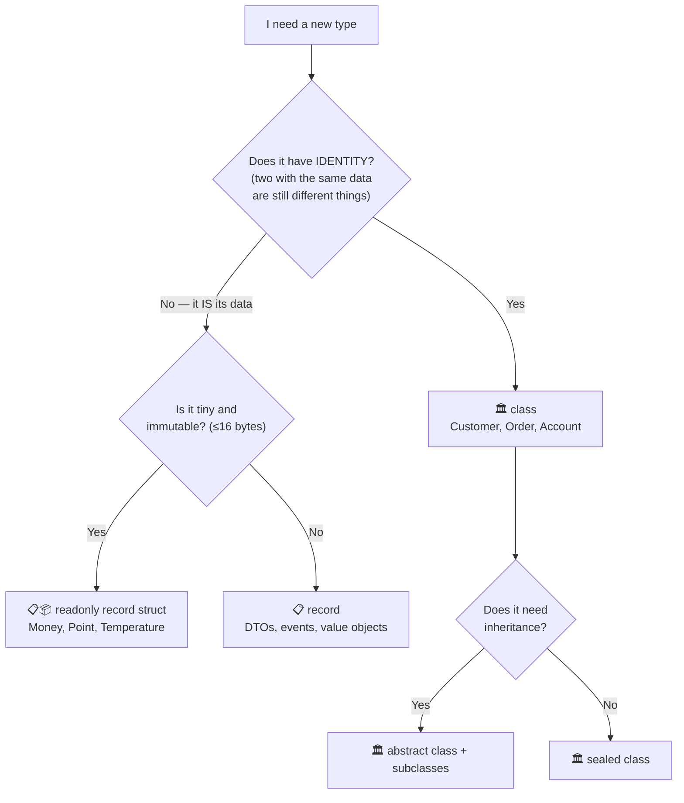

## 25.9 Serialization — where your objects meet the outside world

### 🗣️ In plain English

**Serialization** means turning an object into text (usually JSON) so it can be saved to a file
or sent over a network. **Deserialization** is turning that text back into an object.

This is where OOP design meets reality, and it is where beginners get a nasty surprise.

```csharp
using System.Text.Json;

public record ProductDto(int Id, string Name, decimal Price);
```

```csharp
var product = new ProductDto(1, "Laptop", 1200m);

string json = JsonSerializer.Serialize(product);
Console.WriteLine(json);
// {"Id":1,"Name":"Laptop","Price":1200}

ProductDto? back = JsonSerializer.Deserialize<ProductDto>(json);
Console.WriteLine(back?.Name);      // Laptop
```

Nicely formatted, with camelCase names as most web APIs expect:

```csharp
var options = new JsonSerializerOptions
{
    WriteIndented = true,
    PropertyNamingPolicy = JsonNamingPolicy.CamelCase
};

Console.WriteLine(JsonSerializer.Serialize(product, options));
// {
//   "id": 1,
//   "name": "Laptop",
//   "price": 1200
// }
```

### ⚠️ The surprise: deserialization ignores your rules

Here is the trap. This class carefully protects itself:

```csharp
public class Order
{
    private readonly List<OrderItem> items = new();

    public OrderStatus Status { get; private set; } = OrderStatus.Draft;
    public IReadOnlyList<OrderItem> Items => items;

    public Order(int customerId)
    {
        if (customerId <= 0)
            throw new ArgumentException("Customer id must be positive.");

        CustomerId = customerId;
    }

    public int CustomerId { get; }

    public void AddItem(OrderItem item) { /* rules enforced here */ }
}
```

But a deserializer builds objects by **reflection**, not by calling your public API. Depending
on the settings, it can set private setters and skip your validation completely — producing an
`Order` that your own code says is impossible.

### ✅ The professional solution: separate DTOs from domain objects

Do not serialize your domain entities. Use a **DTO** (Data Transfer Object) at the boundary, and
map between them.

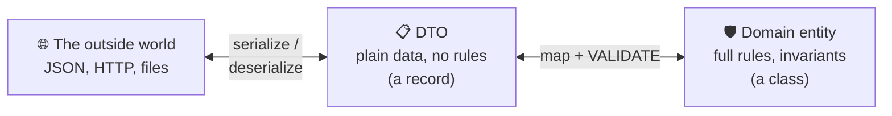

```csharp
// 📋 The DTO — a dumb, honest data carrier. Safe to deserialize.
public record CreateOrderDto(int CustomerId, List<OrderItemDto> Items);
public record OrderItemDto(int ProductId, string ProductName, int Quantity, decimal UnitPrice);

// 🛡️ The mapper — the ONE place where untrusted data becomes a valid domain object.
public static class OrderMapper
{
    public static Order ToDomain(CreateOrderDto dto)
    {
        ArgumentNullException.ThrowIfNull(dto);

        // ✅ Goes through the real constructor and the real methods,
        //    so every business rule is enforced.
        var order = new Order(dto.CustomerId);

        foreach (OrderItemDto item in dto.Items)
            order.AddItem(item.ProductId, item.ProductName, item.Quantity,
                          new Money(item.UnitPrice, "USD"));

        return order;
    }
}
```

| | 📋 DTO | 🛡️ Domain entity |
|---|---|---|
| Purpose | Carry data across a boundary | Enforce business rules |
| Rules / validation | None | All of them |
| Shape | Matches the wire format | Matches the business |
| Type | `record` with `init` properties | `class` with private setters |
| Safe to deserialize? | ✅ Yes | ❌ No |
| Changes when... | The API contract changes | The business changes |

### Useful attributes

```csharp
using System.Text.Json.Serialization;

public record CustomerDto
{
    [JsonPropertyName("customer_id")]        // the wire name differs from the C# name
    public int Id { get; init; }

    public required string Name { get; init; }

    [JsonIgnore]                             // never send this out
    public string? InternalNotes { get; init; }

    [JsonPropertyOrder(1)]                   // control the order in the output
    public string Email { get; init; } = "";
}
```

> 🎓 **Professor's rule** — **Never serialize your domain model directly.** The moment your JSON
> shape and your business model are the same object, every API change forces a domain change,
> and every deserializer becomes a back door around your rules. One extra `record` per boundary
> is a very cheap price for keeping both free.

> 💡 **Tip** — `System.Text.Json` is built into .NET and is the default choice. `Newtonsoft.Json`
> is the older library; you will meet it in existing projects, and it is more flexible but slower.

## 25.10 🧪 Hands-on exercise

Convert this mutable class into an immutable `record`, then show three state changes using `with`:

```csharp
public class Booking
{
    public int Id { get; set; }
    public string GuestName { get; set; } = "";
    public DateOnly CheckIn { get; set; }
    public DateOnly CheckOut { get; set; }
    public string Status { get; set; } = "Pending";
}
```

Requirements: `CheckOut` must be after `CheckIn`, `Status` must be an enum, and it must be
impossible to create an invalid booking.

---

# 26. 🔍 Casting, conversion, and pattern matching

**Level: ⭐⭐ Intermediate**

### 🗣️ In plain English

Sometimes you have a value in a general box (`object`, `Shape`, `Animal`) and you need to know
what it *really* is, or turn it into something else. That's casting and conversion.

**Pattern matching** is C#'s modern, safe way of doing this — and it is one of the language's
best features.

## 26.1 The three ways to change a type

| Operator | If it fails | 🎯 Use when |
|---|---|---|
| `(Type)value` — cast | 💥 throws `InvalidCastException` | You are **certain** of the type |
| `value as Type` | Returns `null` | You expect it might not match |
| `value is Type t` | Returns `false` | 🏆 **The modern default** |

```csharp
object thing = "hello";

// ① Direct cast — confident, but explosive if wrong
string s1 = (string)thing;              // ✅ works
// int n = (int)thing;                  // 💥 InvalidCastException

// ② `as` — returns null on failure (reference types only)
string? s2 = thing as string;           // "hello"
int[]? arr = thing as int[];            // null — no exception

// ③ `is` with a pattern — 🏆 test and convert in one step
if (thing is string s3)
{
    Console.WriteLine(s3.ToUpper());    // s3 is a real string, guaranteed
}
```

> 🎓 **Professor's rule** — Use `is` with a pattern. It tests and converts in one safe step, and
> the compiler tracks that `s3` is definitely not null inside the block.

## 26.2 Implicit vs explicit numeric conversion

```csharp
// ✅ IMPLICIT — always safe, no data can be lost. C# does it for you.
int small = 42;
long big = small;
double d = small;

// ⚠️ EXPLICIT — data CAN be lost, so you must ask for it in writing.
double price = 19.99;
int rounded = (int)price;        // 19  — the .99 is discarded silently!

long huge = 3_000_000_000;
int overflowed = (int)huge;      // -1294967296  😱 silent nonsense
```

> ⚠️ **Gotcha** — Numeric casts **truncate**, they don't round, and they **wrap around** on
> overflow without complaining. Use `Math.Round`, `Convert.ToInt32`, or a `checked` block:
> ```csharp
> int correct = (int)Math.Round(price);      // 20
> checked { int guarded = (int)huge; }       // 💥 OverflowException — much better than nonsense
> ```

## 26.3 Parsing strings — always use `TryParse`

```csharp
string input = Console.ReadLine() ?? "";

// ❌ Throws FormatException on bad input — for something users do constantly
int bad = int.Parse(input);

// ✅ The correct way
if (int.TryParse(input, out int number))
    Console.WriteLine($"You entered {number}");
else
    Console.WriteLine("That wasn't a number.");
```

```csharp
// Works for every built-in type:
decimal.TryParse("19.99", out decimal price);
DateTime.TryParse("2026-01-15", out DateTime date);
Guid.TryParse(someString, out Guid id);
Enum.TryParse<OrderStatus>("Shipped", out var status);
```

> 🎓 **Professor's rule** — Any value that comes from a **human, a file, or a network** goes
> through `TryParse`. Exceptions are for *unexpected* problems; bad user input is entirely expected.

## 26.4 Custom conversions

Your own types can define conversions:

```csharp
public readonly record struct Celsius(double Degrees)
{
    // IMPLICIT: always safe, no information lost
    public static implicit operator double(Celsius c) => c.Degrees;

    // EXPLICIT: the caller must ask, because meaning could be misread
    public static explicit operator Celsius(double degrees) => new(degrees);
}
```

```csharp
Celsius temp = new Celsius(21.5);
double asNumber = temp;                 // ✅ implicit — no cast needed
Celsius back = (Celsius)30.0;           // ✅ explicit — cast required
```

**🎯 Rule of thumb:** `implicit` only when the conversion **cannot fail and cannot surprise**.
Everything else is `explicit`. Better still — use a named method like `ToCelsius()`, which is
always clearer than a mystery operator.

## 26.5 Pattern matching — the modern way to inspect objects

This is where C# gets genuinely elegant.

### Type pattern

```csharp
void Describe(object item)
{
    if (item is int number)
        Console.WriteLine($"An integer: {number}");
    else if (item is string text && text.Length > 5)
        Console.WriteLine($"A long string: {text}");
    else if (item is null)
        Console.WriteLine("Nothing at all");
}
```

### `switch` expression — the workhorse

```csharp
public abstract record Shape;
public record Circle(double Radius) : Shape;
public record Rectangle(double Width, double Height) : Shape;
public record Triangle(double Base, double Height) : Shape;

public static double Area(Shape shape) => shape switch
{
    Circle c    => Math.PI * c.Radius * c.Radius,
    Rectangle r => r.Width * r.Height,
    Triangle t  => 0.5 * t.Base * t.Height,
    _           => throw new NotSupportedException($"Unknown shape: {shape}")
};
```

Compare with the old style:

```csharp
// ❌ The old way — six times as long
public static double AreaOld(Shape shape)
{
    if (shape is Circle)
    {
        Circle c = (Circle)shape;
        return Math.PI * c.Radius * c.Radius;
    }
    // ... and so on
    throw new NotSupportedException();
}
```

### Property patterns — match on the contents

```csharp
public static string Classify(Order order) => order switch
{
    { Total: > 10_000, Customer.IsVip: true } => "🏆 VIP large order — expedite",
    { Total: > 10_000 }                       => "💰 Large order — manager approval",
    { Items.Count: 0 }                        => "⚠️ Empty order",
    { Status: OrderStatus.Cancelled }         => "❌ Cancelled",
    _                                         => "📦 Standard order"
};
```

### Relational and logical patterns

```csharp
public static string Grade(int score) => score switch
{
    >= 90 and <= 100 => "A",
    >= 80 and < 90   => "B",
    >= 70 and < 80   => "C",
    >= 60 and < 70   => "D",
    >= 0  and < 60   => "F",
    _ => throw new ArgumentOutOfRangeException(nameof(score), "Score must be 0–100.")
};

public static bool IsWeekend(DayOfWeek day)
    => day is DayOfWeek.Saturday or DayOfWeek.Sunday;

public static bool IsValidAge(int age) => age is >= 0 and <= 130;
```

### `when` clauses — extra conditions

```csharp
public static decimal ShippingCost(Order order) => order switch
{
    var o when o.Total > 100                    => 0m,        // free shipping
    var o when o.Country == "LK" && o.IsExpress => 15m,
    var o when o.Country == "LK"                => 5m,
    _                                           => 25m
};
```

### List patterns

```csharp
public static string DescribeSequence(int[] numbers) => numbers switch
{
    []              => "empty",
    [var single]    => $"one item: {single}",
    [var a, var b]  => $"two items: {a} and {b}",
    [1, ..]         => "starts with 1",
    [.., var last]  => $"ends with {last}"
};
```

### The complete pattern reference

| Pattern | Example | Matches when |
|---|---|---|
| Type | `is Circle c` | The object is a `Circle` |
| Constant | `is 0`, `is "abc"`, `is null` | Equals that value |
| Relational | `is > 100` | Comparison holds |
| Logical | `is > 0 and < 100`, `is 1 or 2` | Combined patterns |
| Negation | `is not null` | Pattern does not match |
| Property | `is { Total: > 100 }` | Property matches |
| Nested property | `is { Customer.Name: "Anna" }` | Deep property matches |
| Positional | `is Circle(> 5)` | Deconstructed values match |
| `var` | `is var x` | Always matches; binds `x` |
| Discard | `_` | Always matches; binds nothing |
| List | `is [1, 2, ..]` | Sequence shape matches |

## 26.6 ⚠️ When pattern matching is the WRONG tool

Pattern matching on types is often a sign that **polymorphism** would be better.

```csharp
// ⚠️ This switch will need editing every time a new shape appears.
public static double Area(Shape shape) => shape switch { /* ... */ };

// ✅ Polymorphism: adding a new shape edits nothing.
public abstract class Shape { public abstract double Area(); }
```

| Use pattern matching when | Use polymorphism when |
|---|---|
| The types come from outside your control | You own all the types |
| You're at a boundary (parsing JSON, an API) | The logic is core to the domain |
| The set of types is **closed** and stable | New types will keep appearing |
| Behaviour is about the *caller*, not the type | Behaviour belongs *to* the type |
| Records + `switch` — a functional-style design | Classic OOP design |

> 🎓 **Professor's rule** — A `switch` on **data** is fine forever. A `switch` on **type** that
> keeps growing is polymorphism asking to be born.

## 26.7 `dynamic` — the escape hatch you should almost never open

### 🗣️ In plain English

`dynamic` tells the compiler: *"stop checking this. Work it out while the program is running."*

It looks convenient. It is almost always a mistake.

```csharp
dynamic thing = "hello";

Console.WriteLine(thing.Length);        // 5    — works, resolved at runtime
Console.WriteLine(thing.ToUpper());     // HELLO

thing = 42;                             // now it's an int
Console.WriteLine(thing.Length);        // 💥 RuntimeBinderException — int has no Length
```

That last line **compiles perfectly**. It only fails when a user hits it in production.

### Why it's dangerous

| Problem | Consequence |
|---|---|
| ❌ No compile-time checking | Typos and wrong members ship to production |
| ❌ No IntelliSense | Your editor cannot help you at all |
| ❌ Slow | Every call does a runtime lookup |
| ❌ Invisible to refactoring | "Rename" and "Find references" cannot see it |
| ❌ Breaks trimming / AOT | The compiler cannot know what you'll call |

### What to use instead

| You reached for `dynamic` because... | Use this instead |
|---|---|
| "The type varies" | **Generics** ([Chapter 21](#21--generics)) |
| "It could be several types" | **Pattern matching** (§26.5) or an **interface** |
| "I'm reading JSON of unknown shape" | `JsonDocument` / `JsonNode` |
| "I need to inspect a type at runtime" | **Reflection** ([Chapter 34](#34--attributes-and-reflection)) |
| "I'm calling COM / a scripting language" | ✅ This is the one legitimate use |

```csharp
// ❌ Loses every safety net
dynamic repo = GetRepository();
repo.Save(order);

// ✅ The compiler works for you
IOrderRepository repo = GetRepository();
repo.Save(order);
```

> 🎓 **Professor's rule** — `dynamic` throws away the single biggest advantage C# gives you:
> a compiler that catches your mistakes before your users do. In years of normal application
> work you should need it approximately **never**.

## 26.8 🧪 Hands-on exercise

Write a `TransactionDescriber` that takes an `object` and returns a description, using a single
`switch` expression that handles:

- `decimal` over 1,000 → "Large payment"
- `decimal` 0 or less → "Invalid amount"
- any other `decimal` → "Payment of X"
- `string` that parses as a decimal → recurse into the above
- `null` → "No transaction"
- anything else → "Unknown"

---

# 27. 🛡️ Nullable reference types and null safety

**Level: ⭐⭐ Intermediate**

### 🗣️ In plain English

`null` means "there is nothing here". Its inventor, Tony Hoare, called it his
*"billion-dollar mistake"* — because for 40 years, the single most common crash in software has
been `NullReferenceException`.

Modern C# fixes this at **compile time**. But you have to switch it on.

## 27.1 Turn it on — always

```xml
<PropertyGroup>
  <Nullable>enable</Nullable>
</PropertyGroup>
```

With this on, the compiler tracks which references can be `null` and warns you when you forget to
check. Suddenly a whole class of runtime crashes becomes a squiggly line in your editor.

## 27.2 The `?` changes everything

```csharp
string name = "Anna";        // 🚫 NOT nullable — the compiler warns if you assign null
string? phone = null;        // ✅ Nullable — you're saying "this may be missing"
```

```csharp
Console.WriteLine(name.Length);      // ✅ fine — the compiler knows it's not null

Console.WriteLine(phone.Length);     // ⚠️ WARNING: "Dereference of a possibly null reference"
```

The `?` is you **documenting your intent**, and the compiler holding you to it.

```csharp
public class Customer
{
    public required string Name { get; init; }        // must always exist
    public required string Email { get; init; }       // must always exist
    public string? PhoneNumber { get; set; }          // genuinely optional
    public Address? BillingAddress { get; set; }      // genuinely optional
}
```

That class declaration is now **documentation the compiler enforces**. Anyone reading it knows
instantly which fields might be missing.

## 27.3 The five tools for handling null

### ① Null check with `is not null`

```csharp
if (phone is not null)
{
    Console.WriteLine(phone.Length);   // ✅ compiler knows it's safe here
}
```

> 💡 **Tip** — Prefer `is null` / `is not null` over `== null` / `!= null`. A class can override
> `==` to do something strange; `is null` can never be overridden and always means what it says.

### ② `??` — null-coalescing ("use this instead")

```csharp
string display = phone ?? "No phone number on file";

// The assignment form: set it only if it's currently null
phone ??= "unknown";
```

### ③ `?.` — null-conditional ("only if not null")

```csharp
int? length = phone?.Length;                       // null if phone is null

// Chain them safely:
string? city = customer?.BillingAddress?.City;     // null if ANY link is null

// Works on method calls and indexers too:
customer?.Orders?[0]?.Cancel();
```

### ④ Combining `?.` and `??` — the most common idiom

```csharp
int length = phone?.Length ?? 0;
string city = customer?.BillingAddress?.City ?? "Unknown";
```

### ⑤ Guard clauses — reject null at the door

```csharp
public class Customer
{
    public string Name { get; }

    public Customer(string name)
    {
        ArgumentNullException.ThrowIfNull(name);                    // null check
        ArgumentException.ThrowIfNullOrWhiteSpace(name);            // null + blank check

        Name = name;
    }
}
```

**🎯 Use guard clauses when:** the value comes from outside your control — a public API, user
input, deserialised JSON. The nullable annotations don't survive those boundaries.

## 27.4 ⚠️ The null-forgiving operator `!` — use with great care

```csharp
string value = phone!;      // "Trust me, compiler, this isn't null."
```

This **silences the warning without adding any safety**. If you're wrong, you get the exact
`NullReferenceException` the feature was designed to prevent.

| ✅ Legitimate uses of `!` | ❌ Illegitimate uses |
|---|---|
| In a test, where you just set the value | To make a warning go away |
| A field the framework sets (EF Core entities) | Because you're "pretty sure" |
| After a check the compiler can't see | Anywhere in normal business logic |

```csharp
// ✅ A common, legitimate use — EF Core sets navigation properties
public class Order
{
    public Customer Customer { get; set; } = null!;   // "EF will populate this"
}
```

> 🎓 **Professor's rule** — Every `!` in your code is a promise you made to the compiler.
> If you break it, the program crashes. Count them, and justify each one.

## 27.5 Designing so null barely appears

The best null handling is not needing it.

| ❌ Instead of | ✅ Do this |
|---|---|
| Returning `null` from a "find" | Return `T?` **and name it clearly** (`FindById` vs `GetById`) |
| Returning `null` for a collection | Return an **empty** collection |
| A nullable property with a default | Give it a real default (`""`, `0`, `DateTime.MinValue`) |
| `null` meaning "not found" | A `TryGet` method with `out` |
| `null` meaning "no behaviour" | A **Null Object** ([Chapter 40](#40--design-patterns-for-c-oop)) |

```csharp
// ❌ Every caller must remember to null-check
public List<Order>? GetOrders(int customerId) { /* ... */ }

// ✅ No caller ever has to
public IReadOnlyList<Order> GetOrders(int customerId)
{
    // ... returns an empty list if there are none
}
```

```csharp
// ✅ Naming that tells the truth
public Customer GetById(int id)         // throws if missing — "I promise it exists"
    => FindById(id) ?? throw new KeyNotFoundException($"Customer {id} not found.");

public Customer? FindById(int id)       // returns null if missing — "it might not"
    => customers.FirstOrDefault(c => c.Id == id);
```

> 💡 **Tip** — The convention `GetX` (throws) vs `FindX` / `TryGetX` (may be absent) is used
> throughout .NET. Follow it and your API explains itself.

## 27.6 `required` — the compile-time guarantee

```csharp
public class Customer
{
    public required string Name { get; init; }
    public required string Email { get; init; }
    public string? Phone { get; set; }
}
```

```csharp
var ok = new Customer { Name = "Anna", Email = "anna@x.com" };   // ✅
// var bad = new Customer { Name = "Anna" };                     // ❌ compiler error
```

**🎯 Use `required` when:** the value has no sensible default and you want object-initializer
syntax. It gives you constructor-level safety without writing a constructor.

> ⚠️ **Gotcha — `required` and constructors fight each other by default**
> If you add a constructor that already sets the required members, the compiler *still* demands
> them in the initializer:
> ```csharp
> public class Customer
> {
>     public required string Name { get; init; }
>
>     public Customer(string name) => Name = name;    // we DID set it...
> }
>
> var c = new Customer("Anna");    // ❌ error CS9035: Required member 'Name' must be set
> ```
> The compiler cannot tell that your constructor covers it. Tell it explicitly:
> ```csharp
> using System.Diagnostics.CodeAnalysis;
>
> public class Customer
> {
>     public required string Name { get; init; }
>
>     [SetsRequiredMembers]                            // 👈 "this constructor handles them"
>     public Customer(string name) => Name = name;
> }
>
> var c = new Customer("Anna");    // ✅ now fine
> ```
> ⚠️ Use `[SetsRequiredMembers]` **only** when the constructor really does set every required
> member — the compiler takes your word for it and stops checking.

> 💡 **Simplest advice** — Pick one style per class and stay with it:
> **either** a constructor **or** `required` + `init`. Mixing them is where the confusion starts.

## 27.7 Nullable **value** types — a different thing

```csharp
int? age = null;             // Nullable<int> — a struct that may hold no value
DateTime? deliveredOn = null;
```

```csharp
if (age.HasValue)
    Console.WriteLine(age.Value);

int actualAge = age ?? 0;
int alsoFine = age.GetValueOrDefault();
```

| | `string?` (reference) | `int?` (value) |
|---|---|---|
| What it is | A compile-time **annotation** | A real type, `Nullable<int>` |
| Exists at runtime? | ❌ No — erased | ✅ Yes |
| Enforced by | Compiler warnings | The type system itself |

> ⚠️ **Gotcha** — Nullable *reference* annotations are **compile-time only**. They vanish at
> runtime. Data arriving from JSON, a database, or reflection can absolutely be null even though
> the type says it can't. That is exactly why you still validate at the boundaries.

## 27.8 🧪 Hands-on exercise

Take this class and make it fully null-safe:

```csharp
public class UserProfile
{
    public string Name { get; set; }
    public string Bio { get; set; }
    public Address Address { get; set; }
    public List<string> Tags { get; set; }

    public string GetSummary()
        => $"{Name} from {Address.City} — {Bio.Substring(0, 50)} — {Tags.Count} tags";
}
```

Requirements: `Name` required; `Bio` and `Address` optional; `Tags` never null (empty instead);
`GetSummary()` must never throw, whatever is missing.

---

# 28. 💥 Exceptions and error handling

**Level: ⭐⭐ Intermediate**

### 🗣️ In plain English

An **exception** is your code saying: *"I cannot do the job you asked, and I refuse to pretend
I did."*

Think of a **fire alarm**. It is loud, it interrupts everything, and it exists for genuine
emergencies. You do not use it to announce lunch.

## 28.1 `try` / `catch` / `finally`

```csharp
try
{
    int number = int.Parse("abc");
    Console.WriteLine(number);
}
catch (FormatException ex)
{
    Console.WriteLine($"Not a valid number: {ex.Message}");
}
catch (OverflowException ex)
{
    Console.WriteLine($"Number too large: {ex.Message}");
}
finally
{
    // Runs ALWAYS — whether it succeeded, threw, or returned early.
    Console.WriteLine("Cleanup complete.");
}
```

| Block | Runs when |
|---|---|
| `try` | Always — the code you're attempting |
| `catch (SpecificType)` | Only if that exception type (or a subclass) was thrown |
| `finally` | **Always**, no matter what — even on `return` or an unhandled throw |

> 💡 **Tip** — If your `finally` only disposes something, use `using` instead
> ([Chapter 12](#12--object-lifecycle-and-resource-management)). It's shorter and impossible to get wrong.

## 28.2 Throwing exceptions

```csharp
public class BankAccount
{
    public decimal Balance { get; private set; }

    public void Withdraw(decimal amount)
    {
        // Guard clauses first — fail fast, at the top.
        if (amount <= 0)
            throw new ArgumentException("Amount must be positive.", nameof(amount));

        if (amount > Balance)
            throw new InvalidOperationException(
                $"Insufficient balance. Available: {Balance:C}, requested: {amount:C}");

        Balance -= amount;
    }
}
```

### Choosing the right exception type

| Exception | Throw it when |
|---|---|
| `ArgumentNullException` | A required argument is `null` |
| `ArgumentException` | An argument's value is wrong |
| `ArgumentOutOfRangeException` | A numeric/index argument is out of bounds |
| `InvalidOperationException` | The *object's state* makes the call invalid |
| `NotSupportedException` | This operation is never valid on this type |
| `KeyNotFoundException` | A lookup failed |
| `ObjectDisposedException` | The object has been disposed |
| **Your own** `DomainException` | A business rule was broken |

> ⚠️ **Never throw `Exception` itself.** `throw new Exception("something went wrong")` forces
> every caller to catch everything, which means they catch bugs they should have let crash.

Modern guard-clause helpers save typing:

```csharp
ArgumentNullException.ThrowIfNull(customer);
ArgumentException.ThrowIfNullOrWhiteSpace(name);
ArgumentOutOfRangeException.ThrowIfNegative(amount);
ArgumentOutOfRangeException.ThrowIfGreaterThan(quantity, 100);
ObjectDisposedException.ThrowIf(disposed, this);
```

## 28.3 Custom exceptions — carrying real information

A good custom exception carries **data**, not just a message.

```csharp
public class InsufficientBalanceException : Exception
{
    public decimal AvailableBalance { get; }
    public decimal RequestedAmount { get; }
    public decimal Shortfall => RequestedAmount - AvailableBalance;

    public InsufficientBalanceException(decimal availableBalance, decimal requestedAmount)
        : base($"Insufficient balance. Available: {availableBalance:C}, " +
               $"requested: {requestedAmount:C}, short by {requestedAmount - availableBalance:C}.")
    {
        AvailableBalance = availableBalance;
        RequestedAmount = requestedAmount;
    }
}
```

Now the *caller* can do something intelligent:

```csharp
try
{
    account.Withdraw(500);
}
catch (InsufficientBalanceException ex)
{
    Console.WriteLine($"You need {ex.Shortfall:C} more.");     // ✅ actionable
    offerOverdraft(ex.Shortfall);
}
```

## 28.4 A domain exception base class

Give your business rules one recognisable family:

```csharp
public class DomainException : Exception
{
    public DomainException(string message) : base(message) { }
    public DomainException(string message, Exception inner) : base(message, inner) { }
}

public class OrderCannotBeShippedException : DomainException
{
    public int OrderId { get; }

    public OrderCannotBeShippedException(int orderId, string reason)
        : base($"Order {orderId} cannot be shipped: {reason}")
        => OrderId = orderId;
}
```

This lets an API layer translate cleanly:

```csharp
try
{
    orderService.Ship(orderId);
}
catch (DomainException ex)
{
    return BadRequest(ex.Message);      // 400 — the user did something invalid
}
catch (Exception ex)
{
    logger.LogError(ex, "Unexpected failure shipping order {OrderId}", orderId);
    return StatusCode(500);             // 500 — WE did something wrong
}
```

> 🎓 **Professor's rule** — A `DomainException` means *"the user asked for something invalid"* →
> a 4xx. Any other exception means *"we have a bug"* → a 5xx. That single distinction makes error
> handling in an API almost trivial.

## 28.5 ⚠️ `throw;` vs `throw ex;` — the stack trace killer

```csharp
try { DoWork(); }
catch (Exception ex)
{
    logger.LogError(ex, "Failed");
    throw;          // ✅ RE-THROWS — the original stack trace is preserved
}
```

```csharp
try { DoWork(); }
catch (Exception ex)
{
    throw ex;       // ❌ RESETS the stack trace to THIS line
}
```

With `throw ex;`, your log says the error happened in the catch block. The real location — three
methods deep — is gone forever. You will spend hours hunting a bug you had already caught.

> 🎓 **Professor's rule** — It is `throw;` — never `throw ex;`. Memorise this one.

## 28.6 Wrapping exceptions with `innerException`

```csharp
public Customer LoadCustomer(int id)
{
    try
    {
        return database.Query<Customer>(id);
    }
    catch (SqlException ex)
    {
        // Add context, but keep the original cause attached.
        throw new DataAccessException($"Failed to load customer {id}.", ex);
    }
}
```

```csharp
catch (DataAccessException ex)
{
    Console.WriteLine(ex.Message);              // your friendly message
    Console.WriteLine(ex.InnerException?.Message);  // the real SQL error
}
```

**🎯 Use when:** crossing a layer boundary. The upper layer shouldn't know about `SqlException`,
but you must not throw the diagnostic information away.

## 28.7 Exception filters with `when`

```csharp
try
{
    await httpClient.GetAsync(url);
}
catch (HttpRequestException ex) when (ex.StatusCode == HttpStatusCode.NotFound)
{
    Console.WriteLine("Not found — that's fine, using a default.");
}
catch (HttpRequestException ex) when (ex.StatusCode >= HttpStatusCode.InternalServerError)
{
    Console.WriteLine("Server error — retrying.");
    await RetryAsync();
}
```

**Why `when` beats an `if` inside the catch:** if the filter returns false, the exception keeps
travelling **with its original stack intact**. An `if` + `throw;` is messier and loses clarity.

## 28.8 Exceptions vs the Result pattern

Exceptions are for the **exceptional**. When failure is a normal, expected outcome, returning a
result is often better.

```csharp
// ❌ Using exceptions for expected, routine failures — slow and noisy
public Customer GetCustomer(string email)
{
    var found = repo.Find(email);
    if (found is null)
        throw new CustomerNotFoundException(email);   // happens 40% of the time!

    return found;
}
```

```csharp
// ✅ A Result type — failure is part of the signature
public readonly record struct Result<T>
{
    public bool IsSuccess { get; }
    public T? Value { get; }
    public string? Error { get; }

    private Result(bool isSuccess, T? value, string? error)
        => (IsSuccess, Value, Error) = (isSuccess, value, error);

    public static Result<T> Success(T value) => new(true, value, null);
    public static Result<T> Failure(string error) => new(false, default, error);
}
```

```csharp
public Result<Customer> GetCustomer(string email)
{
    Customer? found = repo.Find(email);

    return found is null
        ? Result<Customer>.Failure($"No customer with email {email}.")
        : Result<Customer>.Success(found);
}

// The caller cannot forget to handle failure — it's in the type.
var result = service.GetCustomer("anna@example.com");

if (result.IsSuccess)
    Console.WriteLine(result.Value!.Name);
else
    Console.WriteLine(result.Error);
```

### Which to use?

| Situation | Use |
|---|---|
| A programming bug (null argument, invalid state) | 💥 **Exception** |
| A genuinely rare, unrecoverable failure | 💥 **Exception** |
| Validation failure on user input | 📋 **Result** (or a validation object) |
| "Not found" when absence is normal | 📋 **Result** or `T?` |
| Parsing user-supplied text | 📋 `TryParse` |
| A business rule violation | 💥 `DomainException` — either is defensible |

> ⚠️ **Performance note** — Throwing an exception costs roughly 5,000–10,000× more than returning
> a value. In a loop or a hot path, that matters enormously. In a once-per-request path, it does not.

## 28.9 The rules of exception handling

| ✅ Do | ❌ Don't |
|---|---|
| Throw when you cannot fulfil your promise | Use exceptions for ordinary control flow |
| Catch only what you can actually handle | `catch (Exception)` and swallow it silently |
| Use the most specific exception type | `throw new Exception("error")` |
| Use `throw;` to re-throw | `throw ex;` — it destroys the stack trace |
| Include useful data in the message | Say "an error occurred" |
| Validate early with guard clauses | Let bad data travel three layers deep |
| Log at the boundary, once | Log the same exception at every level |
| Let unexpected exceptions crash loudly | Hide bugs behind an empty catch |

The worst code in the world:

```csharp
// ❌❌❌ Never, ever, do this.
try { DoImportantWork(); }
catch { }        // "It works now!" — no, it fails silently forever.
```

## 28.10 🧪 Hands-on exercise

Build an `OrderValidator` that:

1. Throws `ArgumentNullException` for a null order
2. Throws a custom `EmptyOrderException` (carrying the order Id) for an order with no items
3. Throws a custom `OrderTotalMismatchException` (carrying both totals) when the stored total
   doesn't match the sum of the items
4. Then **rewrite it** to return `Result<Order>` instead
5. Write a short paragraph on which version you'd ship, and why

---

# 29. ⚡ Static members, constants, readonly, and thread safety

**Level: ⭐ Beginner**

### 🗣️ In plain English

Most members belong to an **object**. Static members belong to the **type itself**.

- Every `Car` object has its own `Colour`. → **instance** member
- There is exactly one `Car.TotalManufactured` for all cars ever. → **static** member

Think of a school: each *student* has their own name and grade (instance). But the *school* has
one name and one address, shared by everyone (static).

## 29.1 Static methods

```csharp
public static class MathHelper
{
    public static int Square(int number) => number * number;
    public static bool IsPrime(int number)
    {
        if (number < 2) return false;
        for (int i = 2; i * i <= number; i++)
            if (number % i == 0) return false;
        return true;
    }
}
```

```csharp
int result = MathHelper.Square(5);      // ✅ no `new` needed
// var helper = new MathHelper();       // ❌ can't instantiate a static class
```

**🎯 Use a static method when:**
- It is a pure calculation — same inputs always give the same output
- It uses **no** instance state
- It has no dependencies you'd ever want to swap

**🚫 Don't use static when:**
- It touches a database, file, network, or clock — those need to be **mockable** for tests
- It holds mutable state (that's a hidden global variable, and it will bite you)

> ⚠️ **Gotcha — the testability trap**
> ```csharp
> // ❌ Impossible to test without a real database
> public class OrderService
> {
>     public void Save(Order o) => Database.Save(o);      // static call, hard-wired
> }
>
> // ✅ Injectable, mockable, testable
> public class OrderService(IOrderRepository repository)
> {
>     public void Save(Order o) => repository.Add(o);
> }
> ```
> This is the single most common reason static helpers become a problem in real projects.

## 29.2 Static properties and fields

```csharp
public class AppInfo
{
    public static string Name { get; } = "OOP Guide";
    public static Version Version { get; } = new Version(1, 0, 0);
}
```

```csharp
public class Counter
{
    private static int instanceCount;      // ⚠️ shared by ALL instances

    public Counter() => instanceCount++;

    public static int InstanceCount => instanceCount;
}
```

```csharp
new Counter(); new Counter(); new Counter();
Console.WriteLine(Counter.InstanceCount);   // 3
```

> ⚠️ **Gotcha** — Mutable static state is **shared across your entire process**, including across
> threads and across web requests. That makes it a thread-safety hazard and a testing nightmare
> (one test's data leaks into the next). Use it for genuinely global, read-only values only.

## 29.3 `const` — a compile-time value

```csharp
public class TaxRules
{
    public const decimal VatRate = 0.25m;
    public const int MaxLineItems = 100;
    public const string DefaultCurrency = "USD";
}
```

Rules for `const`:

| Rule | Detail |
|---|---|
| Value fixed at compile time | Must be a literal |
| Implicitly `static` | You never write `static const` |
| Only certain types | Numbers, `bool`, `char`, `string`, `enum`, `null` |
| Cannot be `DateTime` or an object | Use `static readonly` for those |

> ⚠️ **Gotcha — the const versioning trap**
> `const` values are **copied into the calling code** at compile time. If your library says
> `VatRate = 0.25m` and a consumer compiles against it, then you ship `0.20m`, that consumer
> **keeps using 0.25 until they recompile**.
> ➡️ For anything that could ever change, use `static readonly` instead — it's read at runtime.

## 29.4 `readonly` — set once, per object

```csharp
public class Order
{
    private readonly DateTime createdAt;
    private readonly IOrderRepository repository;    // typical: an injected dependency

    public Order(IOrderRepository repository)
    {
        this.repository = repository;
        createdAt = DateTime.UtcNow;      // ✅ assignable in the constructor
    }

    public void Touch()
    {
        // createdAt = DateTime.UtcNow;   // ❌ compiler error — readonly
    }
}
```

**🎯 Use `readonly` on:** every field you don't intend to reassign. It costs nothing and the
compiler enforces your intent.

## 29.5 `static readonly` — one shared value, computed at runtime

```csharp
public class AppSettings
{
    // ✅ Can be any type, computed at runtime, shared by everyone.
    public static readonly Guid InstanceId = Guid.NewGuid();
    public static readonly DateTime StartedAt = DateTime.UtcNow;
    public static readonly string[] SupportedCultures = ["en-US", "si-LK", "ta-LK"];
}
```

## 29.6 The comparison table

| | `const` | `readonly` | `static readonly` |
|---|---|---|---|
| Fixed at | Compile time | Runtime (constructor) | Runtime (type load) |
| Belongs to | The type | Each object | The type |
| Allowed types | Primitives + string | Anything | Anything |
| Baked into callers? | ⚠️ **Yes** | No | No |
| 🎯 Use for | Mathematical truths, fixed protocol values | Per-object values fixed at birth | Shared computed values |
| Example | `const double Pi = 3.14159;` | `readonly DateTime createdAt;` | `static readonly HttpClient client;` |

> ⚠️ **Gotcha** — `static readonly` on a **collection** is not immutable!
> ```csharp
> public static readonly List<string> Cultures = ["en", "si"];
> AppSettings.Cultures.Add("hacked");    // 😱 allowed — readonly only protects the reference
> ```
> Use `ImmutableArray<T>`, `IReadOnlyList<T>`, or `FrozenSet<T>` for genuinely fixed collections.

## 29.7 Static classes and utility helpers

```csharp
public static class StringHelper       // static class: cannot be instantiated or inherited
{
    public static string Truncate(this string text, int maxLength)
        => text.Length <= maxLength ? text : text[..maxLength] + "…";
}
```

**🎯 Good static classes:** `Math`, `File`, `Path`, `string.Join` — pure functions with no state
and no external dependencies.

**🚫 Bad static classes:** anything named `Helper`, `Manager`, or `Utils` that keeps growing.
That's usually a sign that behaviour belongs on a real object.

> 🎓 **Professor's rule** — A static method is fine when it is a **pure function**.
> The moment it needs configuration, a database, the current time, or a random number, it
> should become an injectable object.

## 29.8 Thread safety — when two things happen at once

**Level: ⭐⭐⭐ Advanced**

### 🗣️ In plain English

Modern applications do several things at the same time. A web server handles 200 requests
simultaneously. A desktop app runs work in the background while you keep typing.

If two of those things touch the **same object at the same moment**, they can corrupt it.

Think of **two people editing the same paper form at once**. Both read "quantity: 5". Both cross
it out and write "6". Two people added one item each, but the form says 6 instead of 7. Nobody
did anything wrong, and the data is still wrong.

### The problem, in code

```csharp
public class Counter
{
    public int Value { get; private set; }

    public void Increment() => Value++;      // ⚠️ looks atomic. It is not.
}
```

`Value++` is really **three** separate steps:

```text
   1. READ  Value   (both threads read 5)
   2. ADD   1       (both compute 6)
   3. WRITE Value   (both write 6)   ← one increment vanished
```

```csharp
var counter = new Counter();

Parallel.For(0, 100_000, _ => counter.Increment());

Console.WriteLine(counter.Value);    // 😱 something like 94,182 — not 100,000
```

The result is different every run. This is a **race condition**, and it is the hardest category
of bug to find: it passes every test on your machine and fails once a week in production.

### 🔧 Fix 1: `lock` — one at a time, please

```csharp
public class Counter
{
    private readonly Lock gate = new();      // a private object used only as a lock
    private int value;

    public int Value
    {
        get { lock (gate) return value; }
    }

    public void Increment()
    {
        lock (gate)                          // 👈 only one thread inside at a time
        {
            value++;
        }
    }
}
```

> 💡 **Note on syntax** — Modern .NET provides a dedicated `System.Threading.Lock` type, as used
> above. In older code you will see `private readonly object gate = new();` instead. Both work
> the same way; `Lock` is slightly faster and clearer about intent.

Rules for `lock`:

| ✅ Do | ❌ Don't |
|---|---|
| Lock on a **private** field | Lock on `this` or on a public object |
| Keep the locked block **tiny** | Do I/O or call unknown code inside a lock |
| Always lock in the **same order** if you need two | Risk a deadlock with inconsistent ordering |
| Lock **both** reads and writes | Lock only the write and assume reads are safe |

> ⚠️ **Deadlock** — If thread A holds lock 1 and wants lock 2, while thread B holds lock 2 and
> wants lock 1, both wait forever and the application freezes. The cure is discipline: always
> acquire multiple locks in the same order everywhere.

### 🔧 Fix 2: `Interlocked` — faster, for simple numbers

```csharp
public class Counter
{
    private int value;

    public int Value => Volatile.Read(ref value);

    public void Increment() => Interlocked.Increment(ref value);   // ✅ atomic, no lock
}
```

`Interlocked` performs read-modify-write as a **single uninterruptible operation**. Use it for
counters and simple flags — it is much cheaper than a lock.

### 🔧 Fix 3: concurrent collections

```csharp
// ❌ Not safe for multiple threads
private readonly Dictionary<string, int> cache = new();

// ✅ Built for it
private readonly ConcurrentDictionary<string, int> cache = new();

cache.AddOrUpdate("hits", 1, (key, old) => old + 1);
int value = cache.GetOrAdd("misses", _ => 0);
```

| Normal | Thread-safe version |
|---|---|
| `Dictionary<K,V>` | `ConcurrentDictionary<K,V>` |
| `List<T>` | `ConcurrentBag<T>` (unordered) |
| `Queue<T>` | `ConcurrentQueue<T>` |
| `Stack<T>` | `ConcurrentStack<T>` |

### 🏆 Fix 4 (the best one): immutability

An object that **cannot change** can never be corrupted by two threads, because there is nothing
to corrupt. No locks. No races. No deadlocks. Nothing to get wrong.

```csharp
// ✅ Completely thread-safe, with no locking anywhere.
public readonly record struct Money(decimal Amount, string Currency);
public record OrderSummary(int Id, string Customer, decimal Total);
```

This is the real, practical reason professionals reach for immutability
([Chapter 25.7](#257-immutability--the-single-best-habit-in-this-guide)) — not elegance,
but the fact that a whole category of horrible bugs simply cannot happen.

### 🎯 What this means for your OOP design

| Situation | What to do |
|---|---|
| A short-lived object used by one request | 😌 Nothing — it is never shared |
| An **immutable** object | 😌 Nothing — always safe |
| A **singleton** service with mutable fields | ⚠️ Must be made thread-safe |
| **Static mutable** state | 🚨 The most dangerous of all — avoid it |
| A shared cache or counter | Use `Interlocked` or a concurrent collection |

> 🎓 **Professor's rule** — Design so the question rarely comes up.
> **Keep objects immutable, keep shared state to a minimum, and prefer per-request objects
> over singletons that remember things.** Reach for `lock` only when you genuinely cannot
> avoid shared mutable state.

## 29.9 🧪 Hands-on exercise

1. Write an `IdGenerator` with a static counter that hands out unique sequential IDs.
2. Call it from `Parallel.For(0, 100_000, ...)` and collect the results in a list.
3. Count how many **duplicate** IDs you got. (There will be some.)
4. Fix it with `Interlocked.Increment` and prove the duplicates are gone.
5. Then fix the list too — you will find it was also unsafe.

---

# 30. 📡 Delegates, lambdas, events, and callbacks

**Level: ⭐⭐ Intermediate**

### 🗣️ In plain English

Normally you pass **data** to a method. A **delegate** lets you pass **behaviour** — a method
itself — as if it were a value.

Think of giving someone your **phone number**. You're not doing the work; you're saying
*"call me when you need this done."* That's a delegate. And when several people hold your number
and you announce something to all of them at once — that's an **event**.

## 30.1 Delegates — a variable that holds a method

```csharp
// The declaration describes a SHAPE: "takes two ints, returns an int".
public delegate int Operation(int a, int b);
```

```csharp
int Add(int a, int b) => a + b;
int Multiply(int a, int b) => a * b;

Operation op = Add;
Console.WriteLine(op(2, 3));        // 5

op = Multiply;                      // 👈 the same variable now holds a different method
Console.WriteLine(op(2, 3));        // 6
```

**🎯 Use when:** the *caller* should decide the behaviour — sorting comparators, filters,
event handlers, retry policies, transformations.

## 30.2 `Func`, `Action`, `Predicate` — the built-ins you'll actually use

You almost never need to declare your own delegate type. .NET provides these:

| Type | Shape | Example |
|---|---|---|
| `Action` | takes nothing, returns nothing | `Action greet = () => Console.WriteLine("Hi");` |
| `Action<T>` | takes T, returns nothing | `Action<string> log = m => Console.WriteLine(m);` |
| `Action<T1,T2>` | takes 2, returns nothing | `Action<string,int> f = (s,i) => {};` |
| `Func<TResult>` | takes nothing, returns TResult | `Func<int> roll = () => Random.Shared.Next(6);` |
| `Func<T,TResult>` | takes T, returns TResult | `Func<string,int> len = s => s.Length;` |
| `Func<T1,T2,TResult>` | takes 2, returns TResult | `Func<int,int,int> add = (a,b) => a + b;` |
| `Predicate<T>` | takes T, returns bool | `Predicate<int> isEven = n => n % 2 == 0;` |

```csharp
Func<int, int, int> add = (a, b) => a + b;
Action<string> print = message => Console.WriteLine(message);
Predicate<int> isEven = number => number % 2 == 0;

Console.WriteLine(add(2, 3));       // 5
print("Hello");
Console.WriteLine(isEven(4));       // True
```

> 💡 **Tip** — In `Func<A, B, C>`, the **last** type parameter is always the return type.
> `Func<string, int>` takes a string and returns an int.

## 30.3 Lambdas — writing a method inline

```csharp
// All of these are the same thing, from most to least verbose:
Func<int, int> a = delegate (int x) { return x * 2; };     // old anonymous method
Func<int, int> b = (int x) => { return x * 2; };           // lambda, explicit
Func<int, int> c = (x) => x * 2;                           // inferred type
Func<int, int> d = x => x * 2;                             // 🏆 the usual, everyday style
```

Multi-statement lambdas need braces:

```csharp
Func<Order, decimal> calculateTotal = order =>
{
    decimal subtotal = order.Items.Sum(i => i.LineTotal);
    decimal tax = subtotal * 0.15m;
    return subtotal + tax;
};
```

### ⚠️ Closures — lambdas capture variables, not values

```csharp
int multiplier = 3;
Func<int, int> multiply = x => x * multiplier;   // captures the VARIABLE

Console.WriteLine(multiply(5));    // 15

multiplier = 10;                   // 👈 changed AFTER the lambda was created
Console.WriteLine(multiply(5));    // 50  😲 — the lambda sees the new value
```

### ⚠️ The loop trap — and why `for` and `foreach` behave differently

This one still catches experienced developers, because the two loops are **not** the same.

❌ **A `for` loop has ONE variable, shared by every lambda:**

```csharp
var actions = new List<Action>();

for (int i = 0; i < 3; i++)
    actions.Add(() => Console.Write($"{i} "));

foreach (var action in actions) action();
// Prints: 3 3 3     😱  ← there is only ONE `i`, and by now it holds 3
```

✅ **A `foreach` loop makes a NEW variable each pass:**

```csharp
var actions = new List<Action>();

foreach (int i in new[] { 0, 1, 2 })
    actions.Add(() => Console.Write($"{i} "));

foreach (var action in actions) action();
// Prints: 0 1 2     ✅  ← each lambda captured its own `i`
```

| Loop | How many variables? | Result |
|---|:---:|---|
| `for (int i = ...)` | **One**, shared by all iterations | `3 3 3` ❌ |
| `foreach (int i in ...)` | **A new one** per iteration | `0 1 2` ✅ |

> ⚠️ **Why the difference?** C# 5 changed `foreach` to create a fresh variable each pass,
> precisely because this trap caused so many bugs. The `for` loop was **not** changed — its
> variable is declared once, so it is genuinely one variable. This is still true today.

✅ **The fix for a `for` loop — copy it into a fresh local:**

```csharp
for (int i = 0; i < 3; i++)
{
    int captured = i;                                  // 👈 a NEW variable each pass
    actions.Add(() => Console.Write($"{captured} "));
}
// Prints: 0 1 2  ✅
```

> 🎓 **Professor's rule** — A lambda captures the **variable**, not a snapshot of its value.
> If the variable changes later, the lambda sees the change. When that isn't what you want,
> copy the value into a new local first.

## 30.4 Delegates as strategy — passing behaviour into a method

```csharp
public class OrderProcessor
{
    public void ProcessAll(
        IEnumerable<Order> orders,
        Func<Order, bool> shouldProcess,        // ← caller decides WHICH
        Action<Order> onSuccess,                // ← caller decides what happens on success
        Action<Order, Exception> onFailure)     // ← ...and on failure
    {
        foreach (Order order in orders.Where(shouldProcess))
        {
            try
            {
                order.Process();
                onSuccess(order);
            }
            catch (Exception ex)
            {
                onFailure(order, ex);
            }
        }
    }
}
```

```csharp
processor.ProcessAll(
    orders,
    shouldProcess: o => o.Total > 100,
    onSuccess:     o => Console.WriteLine($"✅ Processed {o.Id}"),
    onFailure:     (o, ex) => Console.WriteLine($"❌ Order {o.Id}: {ex.Message}"));
```

**🎯 Use a delegate when:** the behaviour is small and varies per call site.
**🎯 Use an interface when:** the behaviour is substantial, needs several methods, needs state,
or you want to name it (`IDiscountPolicy` explains itself; `Func<decimal, decimal>` does not).

## 30.5 Multicast delegates — one call, many methods

```csharp
Action<string> notify = message => Console.WriteLine($"Console: {message}");
notify += message => File.AppendAllText("log.txt", message);     // add another
notify += message => Console.WriteLine($"Email: {message}");

notify("System started");      // 👈 all three run, in order
```

> ⚠️ **Gotcha** — If one handler throws, the remaining ones **never run**. And for a
> `Func<>`, you only get the **last** handler's return value. Multicast is really for `void`.

## 30.6 Events — the publisher/subscriber pattern

An **event** is a delegate with safety rails: only the declaring class can raise it; outsiders
can only subscribe (`+=`) and unsubscribe (`-=`).

```csharp
public class Button
{
    public event EventHandler? Clicked;      // 👈 `event` keyword

    public void Click()
    {
        Console.WriteLine("Button pressed.");
        Clicked?.Invoke(this, EventArgs.Empty);   // ?. handles "nobody subscribed"
    }
}
```

```csharp
var button = new Button();

button.Clicked += (sender, args) => Console.WriteLine("Handler 1: saving...");
button.Clicked += (sender, args) => Console.WriteLine("Handler 2: logging...");

button.Click();
```

```text
Button pressed.
Handler 1: saving...
Handler 2: logging...
```

**Why `event` rather than a plain delegate field:**

```csharp
public Action? OnClick;              // ❌ plain field
button.OnClick = null;               // 😱 an outsider just deleted everyone's handlers
button.OnClick?.Invoke();            // 😱 an outsider can raise it

public event EventHandler? Clicked;  // ✅ event
// button.Clicked = null;            // ❌ compiler error
// button.Clicked.Invoke(...);       // ❌ compiler error — only Button can raise it
```

## 30.7 Custom event arguments

```csharp
public class OrderPlacedEventArgs : EventArgs
{
    public int OrderId { get; }
    public decimal Total { get; }
    public DateTime PlacedAt { get; }

    public OrderPlacedEventArgs(int orderId, decimal total)
    {
        OrderId = orderId;
        Total = total;
        PlacedAt = DateTime.UtcNow;
    }
}
```

```csharp
public class OrderService
{
    public event EventHandler<OrderPlacedEventArgs>? OrderPlaced;
    public event EventHandler<OrderPlacedEventArgs>? LargeOrderPlaced;

    public void PlaceOrder(int orderId, decimal total)
    {
        // ... core business logic ...

        var args = new OrderPlacedEventArgs(orderId, total);
        OrderPlaced?.Invoke(this, args);

        if (total > 10_000)
            LargeOrderPlaced?.Invoke(this, args);
    }
}
```

```csharp
var service = new OrderService();

service.OrderPlaced += (sender, e)
    => Console.WriteLine($"📧 Confirmation email for order {e.OrderId}");

service.OrderPlaced += (sender, e)
    => Console.WriteLine($"📊 Analytics recorded: {e.Total:C}");

service.LargeOrderPlaced += (sender, e)
    => Console.WriteLine($"🔔 Manager alerted about order {e.OrderId}");

service.PlaceOrder(1001, 25_000);
```

**🎯 Use events when:** something happened and **zero or more** interested parties may want to
react — and the publisher genuinely doesn't care who they are or whether anyone is listening.

## 30.8 ⚠️ Events and memory leaks

This is the #1 real-world event bug:

```csharp
public class Subscriber
{
    public Subscriber(OrderService service)
    {
        service.OrderPlaced += OnOrderPlaced;    // 🔗 the service now holds a reference to ME
    }

    private void OnOrderPlaced(object? sender, OrderPlacedEventArgs e) { }
}
```

Even after you drop every reference to the `Subscriber`, the long-lived `OrderService` still
holds one through the event. The subscriber can **never** be garbage collected. Do this in a
long-running app and memory climbs forever.

✅ **The fix — unsubscribe, usually via `IDisposable`:**

```csharp
public class Subscriber : IDisposable
{
    private readonly OrderService service;

    public Subscriber(OrderService service)
    {
        this.service = service;
        service.OrderPlaced += OnOrderPlaced;
    }

    private void OnOrderPlaced(object? sender, OrderPlacedEventArgs e) { }

    public void Dispose() => service.OrderPlaced -= OnOrderPlaced;   // ✅ let go
}
```

> 🎓 **Professor's rule** — Every `+=` deserves a matching `-=`. If the publisher outlives the
> subscriber, that `-=` is mandatory.

## 30.9 Events vs interfaces — which one?

| | 📡 Events | 📜 Interface callbacks |
|---|---|---|
| Number of listeners | 0 to many | Exactly 1 |
| Publisher knows listeners? | No | Yes (it holds one) |
| Can the listener return a value? | ❌ Effectively no | ✅ Yes |
| Ordering guarantees | Subscription order, fragile | Explicit |
| Testability | Harder (must subscribe) | Easier (inject a fake) |
| 🎯 Best for | UI, notifications, "FYI" broadcasts | Business collaborators |

> 💡 **Tip** — In modern application architecture, in-process events are often replaced by a
> **mediator** or **message bus** (`IPublisher.Publish(new OrderPlaced(...))`), which is easier
> to test and doesn't leak. Events remain the right tool for UI frameworks.

## 30.10 🧪 Hands-on exercise

Build a `StockMonitor`:

1. It has `PriceChanged` and `ThresholdCrossed` events with custom `EventArgs`
2. Three subscribers: a console logger, an email alerter, a trade executor
3. `ThresholdCrossed` fires only when the price crosses a configured limit
4. Make the subscribers `IDisposable` and prove that after `Dispose()` they stop receiving events

---

# 31. 🔧 Extension methods

**Level: ⭐⭐ Intermediate**

### 🗣️ In plain English

An extension method lets you add a method to a type **you do not own** — `string`, `int`,
`DateTime`, a third-party library class — without modifying it or inheriting from it.

Think of a **phone case with a bottle opener**. You didn't change the phone. You didn't build a
new phone. You just attached something so the phone now *appears* to open bottles.

## 31.1 Writing one

```csharp
public static class StringExtensions          // ① must be a STATIC class
{
    public static bool IsLongerThan(          // ② must be a STATIC method
        this string text,                     // ③ first parameter uses `this`
        int length)
    {
        ArgumentNullException.ThrowIfNull(text);
        return text.Length > length;
    }

    public static string Truncate(this string text, int maxLength)
        => text.Length <= maxLength ? text : text[..maxLength] + "…";

    public static bool IsValidEmail(this string text)
        => !string.IsNullOrWhiteSpace(text)
           && text.Contains('@')
           && text.LastIndexOf('.') > text.IndexOf('@');
}
```

```csharp
string title = "The Complete Guide to Object-Oriented Programming";

Console.WriteLine(title.IsLongerThan(10));       // True
Console.WriteLine(title.Truncate(20));           // "The Complete Guide t…"
Console.WriteLine("anna@example.com".IsValidEmail());  // True
```

The three rules, again:

| Rule | Why |
|---|---|
| ① The class must be `static` | Extension methods have no instance |
| ② The method must be `static` | Same reason |
| ③ First parameter has `this` | That's what marks it as an extension |

Plus: the namespace must be in scope (a `using`, or implicit usings).

## 31.2 What extension methods can and cannot do

| ✅ Can | ❌ Cannot |
|---|---|
| Add methods to any type | Access `private` or `protected` members |
| Extend `sealed` classes | Add fields or state |
| Extend interfaces | Override existing methods |
| Extend `string`, `int`, `DateTime` | Add constructors |
| Be chained fluently | Beat an instance method with the same name |

> ⚠️ **Gotcha** — If the type already has an instance method with the same name and signature,
> the **instance method always wins**. Your extension is silently ignored. This causes genuinely
> baffling debugging sessions.

## 31.3 Extending interfaces — where they really shine

This is the most valuable use. Add convenience to an interface without forcing every implementer
to write it.

```csharp
public interface IRepository<T>
{
    IReadOnlyList<T> GetAll();
}

public static class RepositoryExtensions
{
    public static IReadOnlyList<T> GetPage<T>(
        this IRepository<T> repository, int page, int pageSize)
        => repository.GetAll().Skip((page - 1) * pageSize).Take(pageSize).ToList();

    public static bool Any<T>(this IRepository<T> repository)
        => repository.GetAll().Count > 0;
}
```

Now **every** repository, present and future, gets `GetPage` and `Any` for free.

> 💡 **This is exactly how LINQ works.** `Where`, `Select`, `OrderBy` are all extension methods on
> `IEnumerable<T>`. That's why they work on `List<T>`, arrays, `Dictionary<,>`, your own iterator
> classes — everything.

## 31.4 Domain-specific extensions that read like English

```csharp
public static class DateOnlyExtensions
{
    public static bool IsWeekend(this DateOnly date)
        => date.DayOfWeek is DayOfWeek.Saturday or DayOfWeek.Sunday;

    public static DateOnly NextBusinessDay(this DateOnly date)
    {
        DateOnly next = date.AddDays(1);
        while (next.IsWeekend()) next = next.AddDays(1);
        return next;
    }

    public static int Age(this DateOnly birthDate, DateOnly asOf)
    {
        int age = asOf.Year - birthDate.Year;
        if (birthDate.AddYears(age) > asOf) age--;
        return age;
    }
}
```

```csharp
var today = DateOnly.FromDateTime(DateTime.Today);

if (today.IsWeekend())
    Console.WriteLine($"Next business day: {today.NextBusinessDay()}");

var birthday = new DateOnly(1995, 6, 15);
Console.WriteLine($"Age: {birthday.Age(today)}");
```

Read that last line aloud. It sounds like a sentence. That's the goal.

## 31.5 🎯 When to use — and 🚫 when not to

| ✅ Use an extension method when | 🚫 Use a regular method when |
|---|---|
| You don't own the type | You own the type — just add the method |
| Adding convenience over an interface | The behaviour needs private state |
| Building a fluent, readable API | It needs dependencies (a database, a clock) |
| Adapting a third-party library | It's core domain behaviour |
| Writing LINQ-style operators | It would confuse discoverability |

> ⚠️ **The big anti-pattern**
> ```csharp
> // ❌ You own Order! Just put this method ON Order.
> public static class OrderExtensions
> {
>     public static decimal CalculateTotal(this Order order) => order.Items.Sum(i => i.Total);
> }
> ```
> Business logic living in extension methods outside the class it belongs to is a symptom of an
> **anemic domain model** ([Chapter 44](#44--common-oop-mistakes)). Behaviour belongs *with* data.

> 🎓 **Professor's rule** — Extension methods are for **types you don't control**, and for
> **convenience over an interface**. They are not a way to avoid putting behaviour on your own classes.

## 31.6 🧪 Hands-on exercise

Write a `ValidationExtensions` static class with:

- `bool IsValidPhoneNumber(this string)`
- `string Mask(this string value, int visibleChars)` → `"1234567890"` → `"******7890"`
- `bool IsBetween<T>(this T value, T min, T max) where T : IComparable<T>`
- `IEnumerable<IEnumerable<T>> Chunk<T>(this IEnumerable<T> source, int size)`
  (then discover that .NET already has `Chunk` — and note how it differs from yours)

---

# 32. 🎁 Indexers, operators, tuples, and everyday essentials

**Level: ⭐⭐ Intermediate**

A grab-bag of C# features that make your types feel like first-class citizens of the language.

## 32.1 Indexers — make your object behave like an array

### 🗣️ In plain English

An indexer lets people write `myObject[something]` instead of `myObject.Get(something)`.

```csharp
public class Classroom
{
    private readonly List<Student> students = new();

    // Indexer by position
    public Student this[int index] => students[index];

    // Indexer by name — overloading works here too
    public Student? this[string name]
        => students.FirstOrDefault(s =>
               s.Name.Equals(name, StringComparison.OrdinalIgnoreCase));

    public int Count => students.Count;

    public void Add(Student student)
    {
        ArgumentNullException.ThrowIfNull(student);
        students.Add(student);
    }
}
```

```csharp
var classroom = new Classroom();
classroom.Add(new Student("Anna"));
classroom.Add(new Student("Gehan"));

Student first = classroom[0];              // ✅ by position
Student? anna = classroom["anna"];         // ✅ by name
```

A read/write indexer:

```csharp
public class Configuration
{
    private readonly Dictionary<string, string> settings = new();

    public string this[string key]
    {
        get => settings.TryGetValue(key, out string? value)
            ? value
            : throw new KeyNotFoundException($"No setting named '{key}'.");

        set
        {
            ArgumentException.ThrowIfNullOrWhiteSpace(key);
            settings[key] = value;
        }
    }
}
```

```csharp
var config = new Configuration();
config["ConnectionString"] = "Server=localhost;";
Console.WriteLine(config["ConnectionString"]);
```

**🎯 Use an indexer when:** your type genuinely *is* a collection or a lookup.
**🚫 Don't use one when:** the "lookup" is expensive or has side effects — `[]` looks free, so
people will call it in loops.

## 32.2 Operator overloading — making `+` work on your types

```csharp
public readonly record struct Money(decimal Amount, string Currency)
{
    public static Money operator +(Money left, Money right)
    {
        EnsureSameCurrency(left, right);
        return new Money(left.Amount + right.Amount, left.Currency);
    }

    public static Money operator -(Money left, Money right)
    {
        EnsureSameCurrency(left, right);
        return new Money(left.Amount - right.Amount, left.Currency);
    }

    public static Money operator *(Money money, decimal factor)
        => new(money.Amount * factor, money.Currency);

    public static bool operator >(Money left, Money right)
    {
        EnsureSameCurrency(left, right);
        return left.Amount > right.Amount;
    }

    public static bool operator <(Money left, Money right) => right > left;

    private static void EnsureSameCurrency(Money a, Money b)
    {
        if (a.Currency != b.Currency)
            throw new InvalidOperationException(
                $"Cannot combine {a.Currency} with {b.Currency}.");
    }

    public override string ToString() => $"{Amount:N2} {Currency}";
}
```

```csharp
Money price = new(100, "USD");
Money tax   = new(15, "USD");

Money total = price + tax;              // 115.00 USD
Money doubled = price * 2;              // 200.00 USD
bool expensive = total > new Money(50, "USD");   // True

// Money invalid = price + new Money(10, "EUR");  // 💥 clear exception
```

**🎯 Use operator overloading when:** the operator has an **obvious, universally understood**
meaning for your type — money, vectors, matrices, dates, measurements.

**🚫 Don't use it when:** the meaning is your invention. `customer + order` means nothing to a
reader. Use a named method.

> ⚠️ **Gotcha** — Some operators must be defined in pairs: `==` with `!=`, `<` with `>`,
> `<=` with `>=`, `true` with `false`. And if you overload `==`, you should also override
> `Equals` and `GetHashCode` ([Chapter 24](#24--equality-comparison-sorting-and-copying)).

## 32.3 Tuples and deconstruction

### Tuples — a quick, temporary group of values

```csharp
// ❌ Needing a whole class just to return two numbers
public class MinMaxResult { public int Min; public int Max; }

// ✅ A tuple with named elements
public (int Min, int Max) FindRange(IEnumerable<int> numbers)
{
    int min = numbers.Min();
    int max = numbers.Max();
    return (min, max);
}
```

```csharp
var range = FindRange([5, 3, 9, 1]);
Console.WriteLine($"{range.Min} to {range.Max}");     // 1 to 9

// Or deconstruct straight into variables:
var (low, high) = FindRange([5, 3, 9, 1]);
Console.WriteLine($"{low} to {high}");
```

**🎯 Use a tuple when:** the grouping is **private or short-lived** — an internal helper, a local
grouping in a LINQ query.

**🚫 Don't use a tuple when:** it crosses a public API boundary. A `record` gives the values names,
documentation, validation, and a future. Tuples give you `Item1`.

### Deconstruction — teach your own type to be unpacked

```csharp
public class Point
{
    public double X { get; }
    public double Y { get; }

    public Point(double x, double y) => (X, Y) = (x, y);

    // 👇 Add this and your type supports `var (a, b) = point;`
    public void Deconstruct(out double x, out double y)
    {
        x = X;
        y = Y;
    }
}
```

```csharp
var point = new Point(3, 4);
var (x, y) = point;                       // ✅ deconstruction
Console.WriteLine($"({x}, {y})");
```

> 💡 **Tip** — `record` types get `Deconstruct` generated automatically.

## 32.4 Nested classes

```csharp
public class Invoice
{
    private readonly List<InvoiceLine> lines = new();

    public IReadOnlyList<InvoiceLine> Lines => lines;

    public void AddLine(string description, decimal amount)
        => lines.Add(new InvoiceLine(description, amount));

    // 👇 InvoiceLine only makes sense inside an Invoice.
    public class InvoiceLine
    {
        public string Description { get; }
        public decimal Amount { get; }

        internal InvoiceLine(string description, decimal amount)
        {
            Description = description;
            Amount = amount;
        }
    }
}
```

```csharp
var line = new Invoice.InvoiceLine("...", 10);   // note the qualified name
```

**🎯 Use a nested class when:** the inner type is a genuine implementation detail of the outer
one, and nobody outside should use it independently — a builder, a node in a tree, an enumerator.

**🚫 Don't use one when:** the type is meaningful on its own. `Invoice.InvoiceLine` is awkward to
type and awkward to reuse; a top-level `InvoiceLine` is usually better.

> 💡 **Tip** — A nested class **can** access the outer class's private static members, but it does
> **not** automatically get a reference to an outer instance (unlike Java's inner classes).

## 32.5 Partial classes and methods

**Partial** splits one type across several files.

```csharp
// Customer.cs — hand-written
public partial class Customer
{
    public string Name { get; set; } = "";
    public string Email { get; set; } = "";
}
```

```csharp
// Customer.Behaviour.cs — also hand-written
public partial class Customer
{
    public void SendWelcomeEmail() => Console.WriteLine($"Welcome, {Name}!");
    public bool IsValid() => !string.IsNullOrWhiteSpace(Name) && Email.Contains('@');
}
```

The compiler merges them into one class.

**🎯 Use `partial` when:**
- Part of the class is **generated** (source generators, EF Core, WinForms designers, gRPC,
  Razor, regex generators) and you want to add hand-written code without it being overwritten
- A genuinely large class benefits from separate files

**🚫 Don't use `partial` to:** hide the fact that a class is too big. If a class needs four files
to be readable, it has four responsibilities. Split it into four classes
([Chapter 37](#37--solid-principles)).

### Partial methods — hooks for generated code

```csharp
public partial class Customer
{
    partial void OnNameChanged(string newName);   // declared, maybe never implemented

    public void Rename(string newName)
    {
        Name = newName;
        OnNameChanged(newName);   // if nobody implements it, this call is removed entirely
    }
}
```

## 32.6 Anonymous types — a throwaway shape with no name

### 🗣️ In plain English

Sometimes you need to group a few values together for **three lines of code**, and writing a
whole class for that would be silly. An anonymous type is a class the compiler writes for you,
on the spot, that you never have to name.

Think of a **sticky note**. You would not print a hardback book to jot down two numbers.

```csharp
var summary = new { Name = "Laptop", Price = 1200m, InStock = true };

Console.WriteLine(summary.Name);      // Laptop
Console.WriteLine(summary.Price);     // 1200
Console.WriteLine(summary);           // { Name = Laptop, Price = 1200, InStock = True }
```

You have almost certainly already met them inside LINQ:

```csharp
var report = products
    .GroupBy(p => p.Category)
    .Select(g => new                       // 👈 an anonymous type
    {
        Category = g.Key,
        Count = g.Count(),
        TotalValue = g.Sum(p => p.Price * p.Stock)
    })
    .OrderByDescending(x => x.TotalValue);

foreach (var row in report)
    Console.WriteLine($"{row.Category}: {row.Count} items, {row.TotalValue:C}");
```

### What the compiler gives you for free

| Feature | Included? |
|---|:---:|
| Read-only properties | ✅ |
| Value-based `Equals` and `GetHashCode` | ✅ |
| A readable `ToString()` | ✅ |
| A type name you can write down | ❌ **No — that's the whole point** |

```csharp
var a = new { X = 1, Y = 2 };
var b = new { X = 1, Y = 2 };
Console.WriteLine(a.Equals(b));       // True — same shape, same values
```

**🎯 Use an anonymous type when:** the grouping lives and dies inside **one method** — LINQ
projections, quick grouping, shaping data just before printing it.

**🚫 Do NOT use one when:** the values leave the method. You **cannot** write the type name, so
you cannot use it as a return type, a parameter, or a field.

```csharp
// ❌ Impossible — there is no name to write here.
public ??? GetSummary() => new { Name = "Laptop", Price = 1200m };

// ✅ Use a record instead the moment the shape crosses a method boundary.
public record ProductSummary(string Name, decimal Price);
public ProductSummary GetSummary() => new("Laptop", 1200m);
```

> 🎓 **Professor's rule** — Anonymous type **inside** one method. `record` the moment it
> **leaves** that method. A `record` costs one line and gives you a name, documentation,
> and a future.

## 32.7 `nameof` — a string the compiler checks

### 🗣️ In plain English

`nameof(something)` turns a code symbol into its name as text — but unlike a hand-typed string,
the compiler **verifies it exists** and **renames it with you**.

```csharp
public class Customer
{
    public string Name { get; set; } = "";

    public void Rename(string newName)
    {
        if (string.IsNullOrWhiteSpace(newName))
            throw new ArgumentException("Name is required.", nameof(newName));
    }
}

Console.WriteLine(nameof(Customer));        // "Customer"
Console.WriteLine(nameof(Customer.Name));   // "Name"
```

### Why it matters

```csharp
// ❌ A hand-typed string. Rename the parameter and this silently becomes a lie.
throw new ArgumentException("Name is required.", "newName");

// ✅ Rename `newName` in your IDE and this updates automatically.
throw new ArgumentException("Name is required.", nameof(newName));
```

**🎯 Use `nameof` for:**

| Use | Example |
|---|---|
| Exception parameter names | `throw new ArgumentNullException(nameof(order));` |
| Log messages | `logger.Info($"{nameof(OrderService)} started");` |
| Property-changed notifications | `OnPropertyChanged(nameof(Total));` |
| Validation messages | `$"{nameof(Quantity)} must be positive"` |

> 💡 **Tip** — `nameof` costs **nothing at runtime**. The compiler replaces it with the literal
> string. It is a free improvement over typing the string yourself, so there is never a reason
> not to use it.

## 32.8 Local functions — a helper that lives inside one method

### 🗣️ In plain English

A **local function** is a method declared *inside* another method. Use it when a helper is only
meaningful to that one method, and putting it on the class would just add clutter.

```csharp
public decimal CalculateInvoiceTotal(IEnumerable<OrderLine> lines, decimal taxRate)
{
    decimal subtotal = lines.Sum(LineTotal);       // 👈 used as a method group
    decimal tax = ApplyTax(subtotal);

    return subtotal + tax;

    // 👇 Local functions — invisible outside this method.
    static decimal LineTotal(OrderLine line) => line.UnitPrice * line.Quantity;

    decimal ApplyTax(decimal amount) => amount * taxRate;   // captures `taxRate`
}
```

### Local function vs private method vs lambda

| | Local function | Private method | Lambda (`Func<>`) |
|---|---|---|---|
| Visible to | One method only | The whole class | Wherever the variable goes |
| Can be recursive | ✅ Easily | ✅ | ⚠️ Awkward |
| Allocates memory | ❌ No (if `static`) | ❌ No | ⚠️ Yes, usually |
| Can be declared after use | ✅ Yes | ✅ Yes | ❌ No |
| 🎯 Best for | A helper only this method needs | A helper the class needs | Behaviour you pass around |

**🎯 Use a local function when:** the helper would be meaningless as a class member, or you want
to give a name to a step without expanding the class's surface.

> 💡 **Tip** — Mark a local function `static` whenever it does not need the enclosing method's
> variables. The compiler then guarantees it captures nothing, which avoids a hidden allocation
> and makes the dependency obvious.

Local functions also solve the iterator-validation problem from
[Chapter 23](#23--iterators-and-yield) neatly:

```csharp
public IEnumerable<int> TakeEvery(int step)
{
    // ✅ This runs IMMEDIATELY when the method is called.
    if (step <= 0)
        throw new ArgumentOutOfRangeException(nameof(step));

    return Iterate();

    // ✅ This runs only when the caller starts enumerating.
    IEnumerable<int> Iterate()
    {
        for (int i = 0; i < 100; i += step)
            yield return i;
    }
}
```

## 32.9 🧪 Hands-on exercise

Build a `Matrix` class with:

- A 2-D indexer: `matrix[row, col]`
- Overloaded `+` and `*` operators (throwing clearly on dimension mismatch)
- A `Deconstruct(out int rows, out int cols)`
- An `override ToString()` that prints the matrix in a readable grid
- A **local function** inside `ToString()` that formats one row
- `nameof` in every exception message

---

# 33. ⏳ Async, await, and OOP

**Level: ⭐⭐⭐ Advanced**

### 🗣️ In plain English

Most real work involves **waiting**: for a database, a web API, a file, a user. `async`/`await`
lets your program do something else while it waits, instead of standing frozen.

Think of a **restaurant waiter**. A bad waiter takes your order, walks to the kitchen, and stands
there watching the chef cook — while 20 other tables wait. A good waiter takes your order, hands
it to the kitchen, and serves other tables. When your food is ready, they come back.

`async`/`await` turns your program into the good waiter.

## 33.1 The shapes

```csharp
public class OrderService
{
    // Returns a value  →  Task<T>
    public async Task<Order> GetOrderAsync(int id)
    {
        Order order = await repository.FindAsync(id);
        return order;
    }

    // Returns nothing  →  Task  (NOT void)
    public async Task SaveOrderAsync(Order order)
    {
        await repository.AddAsync(order);
    }
}
```

| Return type | Use for |
|---|---|
| `Task<T>` | An async method that produces a value |
| `Task` | An async method that produces nothing |
| `ValueTask<T>` | Hot paths that often complete synchronously (⭐⭐⭐, measure first) |
| `IAsyncEnumerable<T>` | Streaming many results ([Chapter 23](#23--iterators-and-yield)) |
| ❌ `async void` | **Only** event handlers. Nothing else, ever. |

> ⚠️ **Gotcha — `async void` is genuinely dangerous**
> An exception thrown from an `async void` method **cannot be caught** by the caller. It goes
> straight to the top and crashes the process. The only legitimate use is an event handler,
> because the event signature forces `void`:
> ```csharp
> private async void Button_Click(object sender, EventArgs e)
> {
>     try { await DoWorkAsync(); }         // ✅ handle EVERYTHING inside
>     catch (Exception ex) { ShowError(ex); }
> }
> ```

## 33.2 Async in interfaces — designing for it up front

```csharp
public interface IOrderRepository
{
    Task<Order?> FindAsync(int id, CancellationToken cancellationToken = default);
    Task AddAsync(Order order, CancellationToken cancellationToken = default);
    Task<IReadOnlyList<Order>> GetAllAsync(CancellationToken cancellationToken = default);
}
```

```csharp
public class SqlOrderRepository : IOrderRepository
{
    public async Task<Order?> FindAsync(int id, CancellationToken cancellationToken = default)
    {
        await using var connection = new SqlConnection(connectionString);
        await connection.OpenAsync(cancellationToken);
        // ...
        return null;
    }

    public Task AddAsync(Order order, CancellationToken cancellationToken = default)
        => Task.CompletedTask;

    public Task<IReadOnlyList<Order>> GetAllAsync(CancellationToken cancellationToken = default)
        => Task.FromResult<IReadOnlyList<Order>>([]);
}
```

> 🎓 **Professor's rule** — If **any** implementation of an interface might do I/O, make the
> interface async from day one. Retrofitting async into a synchronous interface means changing
> every caller in the codebase — a genuinely painful refactor known as "async all the way".

## 33.3 The rules that keep you out of trouble

### ✅ Async all the way — never block

```csharp
// ❌ DEADLOCK RISK and thread starvation
public Order GetOrder(int id) => GetOrderAsync(id).Result;      // 💀
public Order GetOrder2(int id) { GetOrderAsync(id).Wait(); }    // 💀

// ✅ Make the caller async too
public async Task<Order> GetOrderAsync(int id) => await repository.FindAsync(id);
```

`.Result` and `.Wait()` block the calling thread while the async work needs that same thread to
resume. In UI and older ASP.NET apps, this deadlocks — the app just freezes, forever.

### ✅ Run independent work in parallel

```csharp
// ❌ Sequential: 300ms + 200ms + 150ms = 650ms
var customer = await GetCustomerAsync(id);
var orders   = await GetOrdersAsync(id);
var prefs    = await GetPreferencesAsync(id);

// ✅ Parallel: max(300, 200, 150) = 300ms
Task<Customer> customerTask = GetCustomerAsync(id);
Task<List<Order>> ordersTask = GetOrdersAsync(id);
Task<Preferences> prefsTask = GetPreferencesAsync(id);

await Task.WhenAll(customerTask, ordersTask, prefsTask);

Customer c = await customerTask;
List<Order> o = await ordersTask;
Preferences p = await prefsTask;
```

> ⚠️ Only do this when the calls are genuinely **independent**. If the second needs the first's
> result, sequential is the only option.

### ✅ Always accept a `CancellationToken`

```csharp
public async Task<IReadOnlyList<Order>> SearchAsync(
    string term,
    CancellationToken cancellationToken = default)
{
    await using var connection = new SqlConnection(connectionString);
    await connection.OpenAsync(cancellationToken);

    cancellationToken.ThrowIfCancellationRequested();    // check at natural points

    return [];
}
```

When a user closes the browser tab or a request times out, cancellation stops work that nobody
wants any more. Without it, your server keeps churning on abandoned requests.

### ✅ Name async methods with the `Async` suffix

`GetOrderAsync`, `SaveAsync`, `SendEmailAsync`. It's a universal convention and it makes
`await`-forgetting bugs obvious in review.

## 33.4 Async and the four pillars

Async doesn't change OOP — it changes method signatures.

```csharp
// 🎭 ABSTRACTION: the contract is async
public interface INotificationSender
{
    Task SendAsync(string recipient, string message, CancellationToken ct = default);
}

// 🔀 POLYMORPHISM: different implementations, same await
public class EmailSender : INotificationSender
{
    private readonly HttpClient http;
    public EmailSender(HttpClient http) => this.http = http;

    public async Task SendAsync(string recipient, string message, CancellationToken ct = default)
    {
        var response = await http.PostAsJsonAsync("/send", new { recipient, message }, ct);
        response.EnsureSuccessStatusCode();
    }
}

public class ConsoleSender : INotificationSender
{
    public Task SendAsync(string recipient, string message, CancellationToken ct = default)
    {
        Console.WriteLine($"{recipient}: {message}");
        return Task.CompletedTask;      // ✅ synchronous implementation of an async contract
    }
}
```

```csharp
// 🧩 COMPOSITION: an orchestrator that doesn't care which sender it got
public class NotificationService
{
    private readonly IEnumerable<INotificationSender> senders;

    public NotificationService(IEnumerable<INotificationSender> senders)
        => this.senders = senders;

    public async Task NotifyAllAsync(string recipient, string message, CancellationToken ct = default)
    {
        IEnumerable<Task> tasks = senders.Select(s => s.SendAsync(recipient, message, ct));
        await Task.WhenAll(tasks);
    }
}
```

## 33.5 Exception handling in async code

```csharp
try
{
    await service.ProcessAsync();
}
catch (OperationCanceledException)
{
    Console.WriteLine("Cancelled — that's expected, not an error.");
}
catch (HttpRequestException ex)
{
    Console.WriteLine($"Network problem: {ex.Message}");
}
```

> ⚠️ **Gotcha — `Task.WhenAll` and multiple failures**
> If three tasks fail, `await Task.WhenAll(...)` throws only the **first** exception.
> To see them all:
> ```csharp
> Task all = Task.WhenAll(t1, t2, t3);
> try { await all; }
> catch
> {
>     foreach (var ex in all.Exception!.InnerExceptions)
>         Console.WriteLine(ex.Message);
> }
> ```

## 33.6 `IAsyncDisposable` — async cleanup

```csharp
public class AsyncOrderRepository : IAsyncDisposable
{
    private readonly SqlConnection connection = new("...");

    public async ValueTask DisposeAsync()
    {
        await connection.DisposeAsync();
        GC.SuppressFinalize(this);
    }
}
```

```csharp
await using var repository = new AsyncOrderRepository();
```

🔗 See [Chapter 12](#12--object-lifecycle-and-resource-management).

## 33.7 The async checklist

| ✅ Do | ❌ Don't |
|---|---|
| `async` all the way up the call stack | Call `.Result` or `.Wait()` |
| Return `Task` / `Task<T>` | Use `async void` (except event handlers) |
| Accept a `CancellationToken` | Ignore cancellation |
| Suffix method names with `Async` | Mix sync and async versions of the same thing |
| Use `Task.WhenAll` for independent work | `await` in a loop when calls are independent |
| Use `await using` for `IAsyncDisposable` | Fire and forget without handling exceptions |
| Design interfaces async from the start | Retrofit async later |

## 33.8 🧪 Hands-on exercise

Build an async `WeatherService`:

1. `IWeatherProvider` with `Task<Weather> GetAsync(string city, CancellationToken ct)`
2. Two implementations: one that calls an HTTP API, one fake that returns canned data
3. A `WeatherAggregator` that queries **three** cities **in parallel** with `Task.WhenAll`
4. Correct handling of cancellation and per-provider failures
5. A unit test using the fake — with no network access

---

# 34. 🏷️ Attributes and reflection

**Level: ⭐⭐⭐ Advanced**

### 🗣️ In plain English

**Attributes** are sticky notes you attach to your code — extra information that travels with the
type and can be read later.

**Reflection** is your program looking at itself: *"What types do I have? What properties? What
sticky notes are on them?"*

You use both every day without noticing: `[Fact]` on a test, `[HttpGet]` on a controller,
`[Required]` on a model property. Something reads those notes and acts on them.

## 34.1 Using built-in attributes

```csharp
public class Customer
{
    [Required]
    [StringLength(100, MinimumLength = 2)]
    public string Name { get; set; } = "";

    [EmailAddress]
    public string Email { get; set; } = "";

    [Range(0, 130)]
    public int Age { get; set; }

    [Obsolete("Use PhoneNumbers instead. Will be removed in v3.")]
    public string? Phone { get; set; }
}
```

```csharp
public class Legacy
{
    [Obsolete("Use CalculateTotalAsync instead.", error: false)]
    public decimal CalculateTotal() => 0;
}

// Calling it produces a compiler warning with your exact message.
```

Common ones you'll meet:

| Attribute | Meaning |
|---|---|
| `[Obsolete("...")]` | Warn (or error) when this is used |
| `[Required]`, `[Range]`, `[StringLength]` | Validation rules |
| `[Serializable]`, `[JsonPropertyName("x")]` | Serialisation control |
| `[Fact]`, `[Theory]` | This method is a test |
| `[HttpGet]`, `[Route("...")]` | ASP.NET routing |
| `[Flags]` | This enum combines with bitwise OR |
| `[CallerMemberName]` | Compiler fills in the caller's name |

## 34.2 Writing your own attribute

```csharp
[AttributeUsage(AttributeTargets.Property, AllowMultiple = false)]
public class DisplayColumnAttribute : Attribute
{
    public string Header { get; }
    public int Order { get; }
    public string Format { get; }

    public DisplayColumnAttribute(string header, int order = 0, string format = "")
    {
        Header = header;
        Order = order;
        Format = format;
    }
}
```

```csharp
public class Product
{
    [DisplayColumn("Product Name", order: 1)]
    public string Name { get; set; } = "";

    [DisplayColumn("Price", order: 2, format: "C")]
    public decimal Price { get; set; }

    [DisplayColumn("In Stock", order: 3)]
    public int Stock { get; set; }

    // No attribute — this one won't be displayed.
    public string InternalSku { get; set; } = "";
}
```

## 34.3 Reading attributes with reflection

```csharp
public static class TableRenderer
{
    public static void Render<T>(IEnumerable<T> items)
    {
        // Find every property carrying our attribute, in the declared order.
        var columns = typeof(T)
            .GetProperties()
            .Select(p => new
            {
                Property = p,
                Attribute = p.GetCustomAttribute<DisplayColumnAttribute>()
            })
            .Where(x => x.Attribute is not null)
            .OrderBy(x => x.Attribute!.Order)
            .ToList();

        // Header row
        Console.WriteLine(string.Join(" | ", columns.Select(c => c.Attribute!.Header)));
        Console.WriteLine(new string('-', 50));

        // Data rows
        foreach (T item in items)
        {
            var values = columns.Select(c =>
            {
                object? value = c.Property.GetValue(item);
                string format = c.Attribute!.Format;

                return string.IsNullOrEmpty(format)
                    ? value?.ToString() ?? ""
                    : string.Format($"{{0:{format}}}", value);
            });

            Console.WriteLine(string.Join(" | ", values));
        }
    }
}
```

```csharp
List<Product> products =
[
    new() { Name = "Laptop", Price = 1200, Stock = 5, InternalSku = "X-1" },
    new() { Name = "Mouse",  Price = 25,   Stock = 50, InternalSku = "X-2" },
];

TableRenderer.Render(products);
```

```text
Product Name | Price | In Stock
--------------------------------------------------
Laptop | $1,200.00 | 5
Mouse | $25.00 | 50
```

You just built a tiny version of what every ORM, serialiser, and test framework does.

## 34.4 Reflection basics

```csharp
Type type = typeof(Product);
// or, from an instance:
Type sameType = product.GetType();

Console.WriteLine(type.Name);            // Product
Console.WriteLine(type.FullName);        // MyApp.Domain.Product
Console.WriteLine(type.IsAbstract);      // False

foreach (PropertyInfo prop in type.GetProperties())
    Console.WriteLine($"{prop.PropertyType.Name} {prop.Name}");

foreach (MethodInfo method in type.GetMethods(BindingFlags.Public | BindingFlags.Instance))
    Console.WriteLine(method.Name);

// Create an instance dynamically
object? instance = Activator.CreateInstance(type);

// Read and write a property by name
PropertyInfo? nameProp = type.GetProperty("Name");
nameProp?.SetValue(instance, "Dynamic Product");
Console.WriteLine(nameProp?.GetValue(instance));

// Find every implementation of an interface in this assembly
var senders = typeof(Program).Assembly
    .GetTypes()
    .Where(t => typeof(INotificationSender).IsAssignableFrom(t)
                && !t.IsAbstract && !t.IsInterface);
```

## 34.5 🚫 When NOT to use reflection

Reflection is powerful and slow, and it turns compile-time errors into runtime crashes.

| ❌ Problem | Detail |
|---|---|
| **Slow** | 10–100× slower than a direct call |
| **No compile-time safety** | Rename a property, and `GetProperty("Name")` silently returns null |
| **Breaks refactoring tools** | "Find all references" cannot see reflected usage |
| **Breaks trimming/AOT** | The linker cannot tell what you'll reflect on |
| **Hard to read** | Nobody can follow the control flow |

| ✅ Use reflection for | ❌ Use something else for |
|---|---|
| Frameworks (DI containers, ORMs, serialisers) | Ordinary business logic |
| Plugin discovery at startup | Anything in a loop |
| Test frameworks | Choosing behaviour → use **polymorphism** |
| Mapping between layers | Simple mapping → write it by hand or use a source generator |

> 🎓 **Professor's rule** — Reflection is for building **frameworks**, not for building
> **features**. If you reach for it in application code, ask whether an interface and
> polymorphism would do the job — 90% of the time they would.

> 💡 **The modern alternative: source generators.** They produce real C# at compile time, so you
> get reflection's flexibility with zero runtime cost and full type safety. `System.Text.Json`,
> logging, and regex all have source-generated modes now.

## 34.6 🧪 Hands-on exercise

Build a tiny validation framework:

1. Attributes: `[NotEmpty]`, `[MaxLength(int)]`, `[InRange(min, max)]`
2. A `Validator.Validate<T>(T obj)` that returns `IReadOnlyList<string>` of error messages
3. Test it on a `RegistrationForm` class
4. Then write the **same** validation by hand, as ordinary code, and compare: which is clearer?
   Which is faster? When would you use each?

---
<div align="center">

# 🔴 PART 4 — PROFESSIONAL DESIGN

*Everything from here separates "code that works" from "code a team can live with."*

</div>

---

# 35. 📦 Namespaces, projects, assemblies, solutions

**Level: ⭐⭐ Intermediate**

### 🗣️ In plain English

OOP isn't only about classes. It's also about **where you put them**. A codebase with 400
excellent classes in one folder is still an unusable codebase.

The hierarchy, from smallest to largest:

```text
  📄 File        →  one class (usually)
  📁 Namespace   →  a logical grouping of related classes
  📦 Project     →  compiles to ONE .dll or .exe (an "assembly")
  🗂️ Solution    →  a set of projects that build together
```

## 35.1 Namespaces

```csharp
namespace MyApp.Domain.Customers;      // 👈 file-scoped — modern, no extra indentation

public class Customer
{
}
```

The older block form still works, but costs you an indent level:

```csharp
namespace MyApp.Domain.Customers
{
    public class Customer { }
}
```

**Naming convention:** `Company.Product.Layer.Feature`

```text
MyApp.Domain.Orders
MyApp.Application.Orders
MyApp.Infrastructure.Persistence
MyApp.Api.Controllers
```

> 💡 **Tip** — Match your namespaces to your **folders**. `MyApp.Domain/Orders/Order.cs` should
> declare `namespace MyApp.Domain.Orders;`. Every tool and every developer expects this.

## 35.2 Assemblies — the unit of deployment

An **assembly** is what one project compiles into: a single `.dll` or `.exe`.

```text
MyApp.Domain.dll
MyApp.Application.dll
MyApp.Infrastructure.dll
MyApp.Api.exe
```

Why it matters:

| Concept | Meaning |
|---|---|
| `internal` | Visible inside **this assembly** only — your privacy boundary |
| Project reference | A one-way arrow: "A can see B" |
| Circular references | ❌ **Forbidden** — the compiler will refuse |

That last point is your best architectural tool: **you cannot accidentally create a circular
dependency between projects.** If Domain doesn't reference Infrastructure, no domain class can
ever call the database directly, no matter how tempting.

## 35.3 Creating a real solution

```bash
# 1. Create the solution file
dotnet new sln -n MyApp

# 2. Create the projects
dotnet new classlib -n MyApp.Domain
dotnet new classlib -n MyApp.Application
dotnet new classlib -n MyApp.Infrastructure
dotnet new console  -n MyApp.ConsoleApp
dotnet new xunit    -n MyApp.Domain.Tests

# 3. Add them to the solution
dotnet sln add MyApp.Domain/MyApp.Domain.csproj
dotnet sln add MyApp.Application/MyApp.Application.csproj
dotnet sln add MyApp.Infrastructure/MyApp.Infrastructure.csproj
dotnet sln add MyApp.ConsoleApp/MyApp.ConsoleApp.csproj
dotnet sln add MyApp.Domain.Tests/MyApp.Domain.Tests.csproj

# 4. Wire up the DEPENDENCY ARROWS — this is the important step
dotnet add MyApp.Application/MyApp.Application.csproj      reference MyApp.Domain
dotnet add MyApp.Infrastructure/MyApp.Infrastructure.csproj reference MyApp.Application
dotnet add MyApp.ConsoleApp/MyApp.ConsoleApp.csproj        reference MyApp.Application
dotnet add MyApp.ConsoleApp/MyApp.ConsoleApp.csproj        reference MyApp.Infrastructure
dotnet add MyApp.Domain.Tests/MyApp.Domain.Tests.csproj    reference MyApp.Domain

# 5. Build and test
dotnet build
dotnet test
```

## 35.4 The recommended structure

```text
MyApp/
├── MyApp.sln
│
├── 🟢 MyApp.Domain/                    ← NO project references. Pure business rules.
│   ├── Customers/
│   │   ├── Customer.cs
│   │   ├── CustomerId.cs
│   │   └── ICustomerRepository.cs      ← the INTERFACE lives here
│   ├── Orders/
│   │   ├── Order.cs
│   │   ├── OrderItem.cs
│   │   ├── OrderStatus.cs
│   │   └── IOrderRepository.cs
│   └── Common/
│       ├── Entity.cs
│       └── DomainException.cs
│
├── 🔵 MyApp.Application/               ← references Domain
│   ├── Orders/
│   │   ├── PlaceOrderService.cs
│   │   └── OrderDto.cs
│   └── Abstractions/
│       ├── IEmailSender.cs
│       └── IPaymentGateway.cs
│
├── 🟠 MyApp.Infrastructure/            ← references Application + Domain
│   ├── Persistence/
│   │   ├── SqlOrderRepository.cs       ← the IMPLEMENTATION lives here
│   │   └── AppDbContext.cs
│   ├── Email/
│   │   └── SmtpEmailSender.cs
│   └── Payments/
│       └── StripePaymentGateway.cs
│
├── 🟣 MyApp.ConsoleApp/                ← references everything; wires it all together
│   └── Program.cs
│
└── 🧪 MyApp.Domain.Tests/              ← references Domain only
    └── OrderTests.cs
```

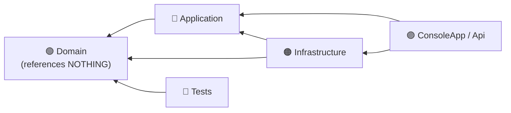

**Notice the direction of every arrow: they all point INWARD, toward Domain.**

> 🎓 **Professor's rule**
> **The Domain project must reference nothing.** No Entity Framework, no ASP.NET, no HTTP client.
> If your business rules can't compile without a database driver, they aren't business rules any
> more — they're database code.

🔗 Explained fully in [Chapter 41 — Domain modeling and architecture](#41--domain-modeling-and-architecture).

## 35.5 Useful project settings

```xml
<!-- Directory.Build.props at the solution root — applies to EVERY project -->
<Project>
  <PropertyGroup>
    <TargetFramework>net9.0</TargetFramework>
    <Nullable>enable</Nullable>
    <ImplicitUsings>enable</ImplicitUsings>
    <LangVersion>latest</LangVersion>
    <EnforceCodeStyleInBuild>true</EnforceCodeStyleInBuild>
  </PropertyGroup>
</Project>
```

Letting your test project see `internal` members:

```xml
<ItemGroup>
  <InternalsVisibleTo Include="MyApp.Domain.Tests" />
</ItemGroup>
```

## 35.6 🧪 Hands-on exercise

Create the full five-project solution above from scratch with the CLI.
Then **deliberately try** to add a reference from `MyApp.Domain` to `MyApp.Infrastructure`.
Read the error. That error is your architecture defending itself.

---

# 36. ✍️ Naming and coding conventions

**Level: ⭐ Beginner**

### 🗣️ In plain English

Code is read **ten times more often than it is written**. Conventions exist so that every C#
developer on Earth can read your code without a translation guide.

These aren't opinions. They're the near-universal .NET standard.

## 36.1 The casing rules

| Element | Casing | Example |
|---|---|---|
| Class, record, struct | `PascalCase` | `CustomerOrder` |
| Interface | `IPascalCase` | `IOrderRepository` |
| Enum + its values | `PascalCase` | `OrderStatus.Shipped` |
| Public method | `PascalCase` | `CalculateTotal()` |
| Public property | `PascalCase` | `TotalAmount` |
| Public field (rare) | `PascalCase` | `MaxRetries` |
| Private field | `camelCase` | `orderTotal` |
| Private static field | `camelCase` | `instanceCount` |
| Constant | `PascalCase` | `MaxLineItems` |
| Local variable | `camelCase` | `customerName` |
| Method parameter | `camelCase` | `orderId` |
| Generic type parameter | `TPascalCase` | `TEntity`, `TKey` |
| Namespace | `PascalCase.Dotted` | `MyApp.Domain.Orders` |
| Async method | `PascalCase` + `Async` | `GetOrderAsync` |

> 💡 **Tip** — Some teams prefix private fields with `_` (`_orderTotal`). Microsoft's own runtime
> code does. Either is fine — **just be consistent within a codebase.** This guide uses no prefix.

## 36.2 Naming that actually communicates

| ❌ Poor | ✅ Better | Why |
|---|---|---|
| `d` | `elapsedDays` | Say what it *is*, not what type it is |
| `data`, `info`, `temp` | `customerOrders` | Every variable holds data |
| `ProcessData()` | `CalculateMonthlyPay()` | "Process" means nothing |
| `Manager`, `Helper`, `Util` | `OrderValidator`, `PriceCalculator` | Name the responsibility |
| `flag` | `isApproved` | Booleans read as questions |
| `list` | `pendingOrders` | What's in it? |
| `GetData()` | `GetUnpaidInvoices()` | Be specific |
| `x1`, `x2` | `startDate`, `endDate` | Numbers aren't names |

### Boolean naming

```csharp
public bool IsActive { get; }         // state
public bool HasItems { get; }         // possession
public bool CanBeCancelled { get; }   // capability
public bool ShouldRetry { get; }      // decision
// ❌ public bool Active;             // ambiguous — is it a state or a command?
```

### Method naming

| Prefix | Means | Example |
|---|---|---|
| `Get` | Returns something; throws if absent | `GetCustomer(id)` |
| `Find` | Returns something or `null` | `FindCustomer(email)` |
| `Try` | Returns `bool` + `out` value | `TryParse(s, out x)` |
| `Is` / `Has` / `Can` | Returns `bool` | `IsValid()` |
| `Calculate` / `Compute` | Does real work, returns a value | `CalculateTax()` |
| `Create` / `Build` | Makes a new object | `CreateInvoice()` |
| `Ensure` | Throws if a condition isn't met | `EnsureNotCancelled()` |

## 36.3 Formatting

```csharp
// ✅ Allman braces (opening brace on its own line) — the .NET standard
public class Order
{
    public void Process()
    {
        if (Items.Count == 0)
        {
            throw new InvalidOperationException("Cannot process an empty order.");
        }
    }
}
```

| Rule | Setting |
|---|---|
| Indentation | 4 spaces (not tabs) |
| Braces | Allman style — opening brace on a new line |
| Line length | ~120 characters |
| `using` directives | At the top, `System` first, then alphabetical |
| One public type per file | File named after the type |
| Blank lines | Between methods, and between logical blocks |

> 💡 **Tip** — Do not argue about formatting. Put an **`.editorconfig`** at the solution root and
> let the tools enforce it. Every debate about braces is time not spent on the actual problem.

```ini
# .editorconfig
root = true

[*.cs]
indent_style = space
indent_size = 4
end_of_line = crlf
insert_final_newline = true
csharp_new_line_before_open_brace = all
dotnet_style_qualification_for_field = false:suggestion
csharp_style_var_when_type_is_apparent = true:suggestion
dotnet_diagnostic.CA1822.severity = suggestion
```

## 36.4 Class member ordering

A consistent order means anyone can find anything:

```csharp
public class Order
{
    // 1️⃣ Constants
    private const int MaxItems = 100;

    // 2️⃣ Static fields
    private static int instanceCount;

    // 3️⃣ Instance fields
    private readonly List<OrderItem> items = new();
    private readonly IOrderRepository repository;

    // 4️⃣ Constructors
    public Order(IOrderRepository repository) => this.repository = repository;

    // 5️⃣ Properties
    public int Id { get; }
    public IReadOnlyList<OrderItem> Items => items;
    public decimal Total => items.Sum(i => i.LineTotal);

    // 6️⃣ Public methods
    public void AddItem(OrderItem item) { /* ... */ }

    // 7️⃣ Private methods
    private void EnsureModifiable() { /* ... */ }

    // 8️⃣ Nested types
    public class Builder { /* ... */ }
}
```

## 36.5 Comments — write fewer, better ones

```csharp
// ❌ Useless — the code already says this
// Increment the counter by one
counter++;

// ❌ A comment compensating for a bad name
// The list of customers who have not paid
var list = GetList();

// ✅ Better: fix the name, delete the comment
var unpaidCustomers = GetUnpaidCustomers();

// ✅ GOOD comments explain WHY, not WHAT
// We retry three times because the payment gateway's load balancer
// occasionally drops the first connection after an idle period. See ticket #4821.
const int MaxRetries = 3;
```

XML documentation comments on public APIs:

```csharp
/// <summary>
/// Calculates the total payable amount including tax and shipping.
/// </summary>
/// <param name="taxRate">The tax rate as a decimal fraction (e.g. 0.15 for 15%).</param>
/// <returns>The total amount payable, never negative.</returns>
/// <exception cref="InvalidOperationException">Thrown when the order has no items.</exception>
public decimal CalculateTotal(decimal taxRate) { /* ... */ return 0; }
```

> 🎓 **Professor's rule** — A comment explaining **what** the code does is a sign the code needs
> a better name. A comment explaining **why** it does it is often the most valuable line in the file.

## 36.6 The naming checklist

- [ ] Could a new developer guess what this class does from its name alone?
- [ ] Does every boolean read as a yes/no question?
- [ ] Have I avoided `Manager`, `Helper`, `Util`, `Data`, `Info`, `Processor`?
- [ ] Do method names contain a **verb**?
- [ ] Do class names contain a **noun**?
- [ ] Do async methods end in `Async`?
- [ ] Is there exactly one public type per file, named after the file?

## 36.7 🧪 Hands-on exercise

Rename everything in this class so it explains itself. Change **no logic** — names only.

```csharp
public class DataManager
{
    private List<Order> l = new();
    public bool flag;
    public decimal Process(string t, decimal d)
    {
        var temp = l.Where(x => x.Status == t).Sum(x => x.Total);
        return temp * d;
    }
    public bool Check(Order o) => o.Total > 1000 && !o.IsPaid;
}
```

Then answer:
- Which name was hardest to fix, and what does that tell you about the class?
- Did any name turn out to describe **two** things? (That is a [Single Responsibility](#37--solid-principles) problem hiding inside a naming problem.)

---

# 37. 🎯 SOLID principles

**Level: ⭐⭐ Intermediate**

### 🗣️ In plain English

SOLID is five rules that make code **easy to change**. That's the whole point. Not "elegant",
not "clever" — **changeable**, because requirements always change.

<div align="center">

| **S** | **O** | **L** | **I** | **D** |
|:---:|:---:|:---:|:---:|:---:|
| Single<br/>Responsibility | Open/<br/>Closed | Liskov<br/>Substitution | Interface<br/>Segregation | Dependency<br/>Inversion |
| *One job* | *Extend,<br/>don't edit* | *Subtypes must<br/>be substitutable* | *Small, focused<br/>contracts* | *Depend on<br/>abstractions* |

</div>

---

## 37.1 🔹 S — Single Responsibility Principle

> **A class should have one, and only one, reason to change.**

### 🗣️ In plain English

Each class does **one job**. Like a kitchen: the fridge stores, the oven cooks, the dishwasher
cleans. You do not buy a fridge-oven-dishwasher.

❌ **Bad — four reasons to change:**

```csharp
public class InvoiceService
{
    public decimal CalculateTotal(Invoice invoice) { /* business rules */ return 0; }
    public void SaveToDatabase(Invoice invoice)    { /* SQL */ }
    public void SendEmail(Invoice invoice)         { /* SMTP */ }
    public void PrintToPdf(Invoice invoice)        { /* PDF library */ }
    public string RenderHtml(Invoice invoice)      { /* HTML */ return ""; }
}
```

This class changes when: tax law changes, the database changes, the email provider changes, the
PDF library changes, **or** the HTML design changes. Five teams edit the same file. Every change
risks breaking the other four.

✅ **Good — one reason each:**

```csharp
public class InvoiceCalculator
{
    public decimal CalculateTotal(Invoice invoice)
        => invoice.Lines.Sum(l => l.Amount) * (1 + invoice.TaxRate);
}

public class InvoiceRepository : IInvoiceRepository
{
    public Task SaveAsync(Invoice invoice, CancellationToken ct = default)
        => Task.CompletedTask;
}

public class InvoiceEmailSender
{
    private readonly IEmailSender emailSender;
    public InvoiceEmailSender(IEmailSender emailSender) => this.emailSender = emailSender;

    public Task SendAsync(Invoice invoice) => emailSender.SendAsync(/* ... */);
}

public class InvoicePdfRenderer
{
    public byte[] Render(Invoice invoice) => [];
}
```

### The test for SRP

Describe the class in one sentence. If you need the word **"and"**, split it.

- ✅ *"Calculates invoice totals."*
- ❌ *"Calculates invoice totals **and** saves them **and** emails them."*

> ⚠️ **Don't overdo it.** SRP does not mean "one method per class". A `Customer` class with
> `Rename`, `ChangeEmail`, and `Deactivate` has one responsibility: *being a customer*.

---

## 37.2 🔹 O — Open/Closed Principle

> **Open for extension, closed for modification.**

### 🗣️ In plain English

You should be able to add new behaviour by **adding new code**, not by **editing working code**.

Think of a **power strip**. To plug in a new device, you don't rewire the strip. You just plug in.

❌ **Bad — every new type edits this method:**

```csharp
public class ShippingCalculator
{
    public decimal Calculate(string method, decimal weight)
    {
        if (method == "standard")  return 5 + weight * 0.5m;
        if (method == "express")   return 15 + weight * 1.2m;
        if (method == "overnight") return 30 + weight * 2m;
        return 0;
    }
}
```

Every new shipping option means editing, re-testing, and re-deploying tested code.

✅ **Good — new options are new files:**

```csharp
public interface IShippingMethod
{
    string Code { get; }
    string DisplayName { get; }
    decimal Calculate(decimal weight);
}

public class StandardShipping : IShippingMethod
{
    public string Code => "standard";
    public string DisplayName => "Standard (5–7 days)";
    public decimal Calculate(decimal weight) => 5 + weight * 0.5m;
}

public class ExpressShipping : IShippingMethod
{
    public string Code => "express";
    public string DisplayName => "Express (2 days)";
    public decimal Calculate(decimal weight) => 15 + weight * 1.2m;
}
```

Adding **drone delivery** tomorrow:

```csharp
public class DroneShipping : IShippingMethod
{
    public string Code => "drone";
    public string DisplayName => "Drone (2 hours)";
    public decimal Calculate(decimal weight) => weight > 5
        ? throw new InvalidOperationException("Drones carry a maximum of 5kg.")
        : 40 + weight * 3m;
}
```

**Existing lines changed: zero.** Existing tests that could break: zero.

> ⚠️ **Don't over-apply it.** You cannot make everything extensible, and trying makes code
> unreadable. Apply OCP where change is **likely** — payment methods, discount rules,
> notification channels, export formats. Not to a method that has never changed in three years.

---

## 37.3 🔹 L — Liskov Substitution Principle

> **Anywhere the base type works, every subtype must work too — without surprises.**

### 🗣️ In plain English

If your code expects a `Bird` and you hand it a `Penguin`, nothing should break.

If a subclass **throws** where the base worked, **tightens** what it accepts, or **weakens** what
it promises, it has broken the substitution rule.

❌ **The classic violation:**

```csharp
public class Bird
{
    public virtual void Fly() => Console.WriteLine("Flying!");
}

public class Penguin : Bird
{
    public override void Fly() => throw new NotSupportedException("Penguins can't fly!");
}
```

```csharp
void MakeAllBirdsFly(IEnumerable<Bird> birds)
{
    foreach (Bird bird in birds)
        bird.Fly();          // 💥 crashes the moment a Penguin appears
}
```

The `Penguin` **is** a bird biologically, but it is not substitutable for this `Bird` class.
The class hierarchy modelled the wrong thing.

✅ **The fix — model capability separately from identity:**

```csharp
public abstract class Bird
{
    public string Name { get; }
    protected Bird(string name) => Name = name;

    public abstract void Move();
}

public interface IFlyingBird
{
    void Fly();
}

public class Eagle : Bird, IFlyingBird
{
    public Eagle() : base("Eagle") { }
    public override void Move() => Fly();
    public void Fly() => Console.WriteLine("Eagle soars.");
}

public class Penguin : Bird
{
    public Penguin() : base("Penguin") { }
    public override void Move() => Console.WriteLine("Penguin waddles and swims.");
}
```

```csharp
void MoveAll(IEnumerable<Bird> birds)
{
    foreach (Bird bird in birds) bird.Move();     // ✅ always works
}

void FlySquadron(IEnumerable<IFlyingBird> flyers)
{
    foreach (IFlyingBird flyer in flyers) flyer.Fly();   // ✅ penguins can't get in here
}
```

### The second classic: Square/Rectangle

```csharp
public class Rectangle
{
    public virtual int Width { get; set; }
    public virtual int Height { get; set; }
    public int Area => Width * Height;
}

public class Square : Rectangle
{
    public override int Width  { set { base.Width = base.Height = value; } }
    public override int Height { set { base.Width = base.Height = value; } }
}
```

```csharp
void Test(Rectangle rect)
{
    rect.Width = 5;
    rect.Height = 4;
    Console.WriteLine(rect.Area);      // Expected 20. A Square gives 16. 💥
}
```

A Square **is a** rectangle in geometry. But a *mutable* Square is **not** substitutable for a
*mutable* Rectangle. (Note: if both were **immutable**, the problem disappears — another argument
for immutability.)

### The LSP checklist for any override

- [ ] Does it throw where the base didn't?
- [ ] Does it require **stricter** inputs than the base?
- [ ] Does it return **weaker** guarantees than the base?
- [ ] Does it have side effects the base didn't have?
- [ ] Would a caller holding a base reference be surprised?

Any "yes" means you have an LSP violation.

> 🎓 **Professor's rule** — If a subclass has to throw `NotSupportedException`, your inheritance
> hierarchy is wrong. Split the capability into an interface.

---

## 37.4 🔹 I — Interface Segregation Principle

> **No client should be forced to depend on methods it does not use.**

### 🗣️ In plain English

Many small, focused interfaces beat one big one. Don't hand someone a 40-button remote when they
only need the on/off switch.

❌ **Bad — the fat interface:**

```csharp
public interface IMachine
{
    void Print(string document);
    void Scan();
    void Fax(string number);
    void Staple();
    void Bind();
}

public class SimplePrinter : IMachine
{
    public void Print(string document) => Console.WriteLine(document);

    // 😩 Forced to implement four things it cannot do:
    public void Scan()  => throw new NotSupportedException();
    public void Fax(string number) => throw new NotSupportedException();
    public void Staple() => throw new NotSupportedException();
    public void Bind()   => throw new NotSupportedException();
}
```

Note that this also violates **Liskov** — those `NotSupportedException`s are the tell.

✅ **Good — small, composable interfaces:**

```csharp
public interface IPrinter { void Print(string document); }
public interface IScanner { string Scan(); }
public interface IFax     { void Fax(string number); }
public interface IStapler { void Staple(); }
```

```csharp
public class SimplePrinter : IPrinter
{
    public void Print(string document) => Console.WriteLine(document);
}

public class OfficeMultiFunction : IPrinter, IScanner, IFax, IStapler
{
    public void Print(string document) => Console.WriteLine(document);
    public string Scan() => "scanned";
    public void Fax(string number) { }
    public void Staple() { }
}
```

And consumers ask for exactly what they need:

```csharp
public class ReportService
{
    private readonly IPrinter printer;      // ✅ only needs printing
    public ReportService(IPrinter printer) => this.printer = printer;
}
```

`ReportService` can now be tested with a five-line fake, and it can accept a `SimplePrinter`.

> 💡 **Tip** — .NET itself follows this: `IEnumerable<T>` → `ICollection<T>` → `IList<T>`.
> Each adds a little. You depend on the smallest one that does the job.

---

## 37.5 🔹 D — Dependency Inversion Principle

> **High-level modules should not depend on low-level modules. Both should depend on abstractions.**

### 🗣️ In plain English

Your **business rules** should not know about SQL Server, SMTP, or Stripe. They should know about
`IOrderRepository`, `IEmailSender`, `IPaymentGateway` — and someone else decides what plugs in.

Think of a **lamp**. It doesn't know about the power station. It knows about a **plug shape**.

❌ **Bad — business logic welded to infrastructure:**

```csharp
public class OrderService
{
    private readonly SmtpEmailSender emailSender = new SmtpEmailSender();   // 🔗 hard-wired
    private readonly SqlOrderRepository repository = new SqlOrderRepository();

    public void PlaceOrder(Order order)
    {
        repository.Save(order);
        emailSender.Send(order.CustomerEmail, "Order confirmed");
    }
}
```

Problems:
- 🧪 **Untestable** — every test sends a real email and hits a real database
- 🔒 **Unchangeable** — switching to SendGrid means editing business logic
- 🐌 **Slow** — a "unit" test takes seconds and needs a network

✅ **Good — depend on abstractions, receive them from outside:**

```csharp
// The abstractions live with the BUSINESS code, not with the implementations.
public interface IOrderRepository
{
    Task SaveAsync(Order order, CancellationToken ct = default);
}

public interface IEmailSender
{
    Task SendAsync(string to, string subject, string body, CancellationToken ct = default);
}
```

```csharp
public class OrderService
{
    private readonly IOrderRepository repository;
    private readonly IEmailSender emailSender;

    public OrderService(IOrderRepository repository, IEmailSender emailSender)
    {
        this.repository = repository;
        this.emailSender = emailSender;
    }

    public async Task PlaceOrderAsync(Order order, CancellationToken ct = default)
    {
        await repository.SaveAsync(order, ct);
        await emailSender.SendAsync(order.CustomerEmail, "Order confirmed", "Thanks!", ct);
    }
}
```

Now:
- 🧪 Test with two fakes, in milliseconds, offline
- 🔄 Swap SMTP → SendGrid by changing **one registration line**
- 🎯 `OrderService` contains only business logic, and reads like the business process

### The "inversion" explained

```text
❌ BEFORE — the arrow points DOWN, toward the details
   OrderService  ───▶  SmtpEmailSender  (a low-level detail)

✅ AFTER — the arrow is INVERTED; details point UP at the abstraction
   OrderService  ───▶  IEmailSender  ◀───  SmtpEmailSender
                       (owned by the business layer)
```

That's the inversion: the **detail** now depends on the **abstraction**, instead of the
business logic depending on the detail.

🔗 **Connects to:** [Chapter 39 — Dependency Injection](#39--dependency-injection), which is the
*mechanism* for delivering these dependencies.

---

## 37.6 SOLID summary card

| Letter | One-line rule | The smell it fixes |
|---|---|---|
| **S** | One class, one job | God classes, 2,000-line files |
| **O** | Add code, don't edit code | `switch` statements that keep growing |
| **L** | Subtypes must be substitutable | `NotSupportedException` in overrides |
| **I** | Small, focused interfaces | Interfaces with 15 methods |
| **D** | Depend on abstractions | `new SqlRepository()` inside business logic |

> ⚠️ **A warning about SOLID**
> SOLID is a set of **heuristics**, not laws. Applied blindly, it produces 200 tiny classes and
> six layers of indirection for a program that should have been 300 lines. Apply a principle when
> you can name the **specific pain** it relieves. "It felt more SOLID" is not a reason.

## 37.7 🧪 Hands-on exercise

Take this class and refactor it, applying **all five** principles. Write down which principle each
change served:

```csharp
public class ReportManager
{
    public void GenerateAndSendReport(string type, string email)
    {
        string content = "";
        if (type == "sales")     content = "Sales data...";
        else if (type == "stock") content = "Stock data...";
        else if (type == "hr")    content = "HR data...";

        File.WriteAllText($"report_{type}.txt", content);

        var smtp = new SmtpClient("smtp.company.com");
        smtp.Send("noreply@company.com", email, $"{type} report", content);

        Console.WriteLine($"Report sent to {email}");
    }
}
```

---

# 38. 🧭 Other principles every professional uses

**Level: ⭐⭐ Intermediate**

SOLID gets the headlines. These principles come up just as often in real code review.

## 38.1 DRY — Don't Repeat Yourself

> **Every piece of knowledge should have one authoritative representation.**

❌ **The same rule, in three places:**

```csharp
// In OrderService
if (order.Total > 1000) discount = order.Total * 0.1m;

// In InvoiceService
if (invoice.Amount > 1000) discount = invoice.Amount * 0.1m;

// In the UI
if (cart.Total > 1000) ShowMessage("You qualify for 10% off!");
```

The day the threshold changes to 1,500, you'll fix two of the three.

✅ **One home for the rule:**

```csharp
public class BulkDiscountPolicy
{
    private const decimal Threshold = 1000m;
    private const decimal Rate = 0.10m;

    public bool Qualifies(decimal total) => total > Threshold;
    public decimal Calculate(decimal total) => Qualifies(total) ? total * Rate : 0m;
}
```

> ⚠️ **DRY is about KNOWLEDGE, not about text.** Two methods that happen to look identical but
> encode **different rules** should stay separate — they will diverge. Merging them creates a
> coupling that will hurt more than the duplication did.
>
> 🎓 **The rule of three:** duplicate once, shrug. Duplicate twice, notice. Duplicate three times,
> extract.

## 38.2 KISS — Keep It Simple

> **The simplest thing that works is usually right.**

❌ **Over-engineered:**

```csharp
public interface IStringReverser { string Reverse(string input); }
public class StringReverserFactory { /* ... */ }
public class DefaultStringReverser : IStringReverser { /* ... */ }
public class StringReverserService { /* ... */ }
```

✅ **What was actually needed:**

```csharp
public static string Reverse(this string text) => new string(text.Reverse().ToArray());
```

## 38.3 YAGNI — You Aren't Gonna Need It

> **Don't build it until you actually need it.**

```csharp
// ❌ "We might support other databases one day."
public interface IDatabaseProvider { }
public interface IQueryTranslator { }
public interface IConnectionPoolStrategy { }
// ...six months later, still only SQL Server. Six abstractions nobody uses.
```

Every speculative abstraction is code you must read, test, and maintain — to support a future that
usually never arrives. Build for **today's** requirement, but keep the code **easy to change**.

> 💡 **The balance:** YAGNI says don't build the feature. It does **not** say write untestable,
> tangled code. Clean, simple, well-named code is what makes tomorrow's change cheap.

## 38.4 Tell, Don't Ask

> **Tell an object what to do. Don't ask it for its data and decide for it.**

❌ **Asking — the logic leaks out of the object:**

```csharp
if (account.Balance >= amount)
{
    account.Balance -= amount;          // caller does the work
    Console.WriteLine("Withdrawn");
}
else
{
    Console.WriteLine("Insufficient funds");
}
```

Every caller must repeat this logic — and one will get it wrong.

✅ **Telling — the object owns its rules:**

```csharp
account.Withdraw(amount);       // the account decides; it cannot be done wrong
```

**The test:** if you find yourself writing `if (obj.SomeProperty)` and then calling
`obj.SomeMethod()`, that `if` probably belongs **inside** the object.

## 38.5 The Law of Demeter — "only talk to your friends"

> **Don't reach through one object to get at another.**

❌ **A train wreck:**

```csharp
string city = order.Customer.Address.City.Name;
```

Now `order`'s caller depends on `Customer`, on `Address`, **and** on `City`. Change any of the
four and this line breaks. And if any link is null — crash.

✅ **Ask the object you actually have:**

```csharp
public class Order
{
    private readonly Customer customer;
    public string ShippingCity => customer.ShippingCity;
}
```

```csharp
string city = order.ShippingCity;      // ✅ one dependency, not four
```

> ⚠️ **The exception** — LINQ chains and fluent builders (`items.Where(...).OrderBy(...)`) are
> not violations. Each call returns a new object of the *same* kind. Demeter is about reaching
> through **other people's** object graphs.

## 38.6 Composition Root — wire everything in one place

> **Objects should be composed once, at the entry point of the application.**

```csharp
// Program.cs — the ONE place that knows about concrete types
var services = new ServiceCollection();

services.AddScoped<IOrderRepository, SqlOrderRepository>();
services.AddScoped<IEmailSender, SendGridEmailSender>();
services.AddScoped<IPaymentGateway, StripePaymentGateway>();
services.AddScoped<OrderService>();

var provider = services.BuildServiceProvider();
var orderService = provider.GetRequiredService<OrderService>();
```

Everywhere else, classes just declare what they need in their constructor. No `new` of a
dependency anywhere in the business code.

## 38.7 Fail Fast

> **Detect problems as early and as loudly as possible.**

```csharp
public class Order
{
    public Order(Customer customer, IEnumerable<OrderItem> items)
    {
        // ✅ Reject bad input at the door, not three layers deep.
        ArgumentNullException.ThrowIfNull(customer);
        ArgumentNullException.ThrowIfNull(items);

        var itemList = items.ToList();
        if (itemList.Count == 0)
            throw new ArgumentException("An order must have at least one item.", nameof(items));

        Customer = customer;
        Items = itemList;
    }

    public Customer Customer { get; }
    public IReadOnlyList<OrderItem> Items { get; }
}
```

A crash at line 3 with a clear message beats corrupt data discovered a week later.

## 38.8 Principle summary

| Principle | One line | The pain it prevents |
|---|---|---|
| **DRY** | One home per piece of knowledge | Fixing the same bug in four files |
| **KISS** | Simplest thing that works | Unreadable cleverness |
| **YAGNI** | Build it when you need it | Dead abstractions nobody uses |
| **Tell, Don't Ask** | Give orders, not interrogations | Logic scattered outside its object |
| **Law of Demeter** | Talk to friends, not strangers | Fragile chains of dots |
| **Composition Root** | Wire it all up in one place | `new` scattered everywhere |
| **Fail Fast** | Crash early, crash clearly | Silent corruption |

## 38.9 🧪 Hands-on exercise

For each snippet below, name **which principle it breaks** and rewrite it:

```csharp
// A
if (customer.Account.Balance >= order.Total.Amount)
{
    customer.Account.Balance -= order.Total.Amount;
    order.IsPaid = true;
}

// B
string country = order.Customer.Address.Country.Code.Value;

// C  (this exact check also appears in two other files)
if (order.Total > 1000) discount = order.Total * 0.1m;

// D
public interface IRepositoryFactoryProviderStrategy { }   // used by exactly one class

// E
public void Process(Order order)
{
    var total = order.Items.Sum(i => i.Total);   // order might be null; items might be empty
    Save(total);
}
```

**Answers to check yourself against:**
A = Tell, Don't Ask · B = Law of Demeter · C = DRY · D = YAGNI + KISS · E = Fail Fast

---

# 39. 💉 Dependency injection

**Level: ⭐⭐ Intermediate**

### 🗣️ In plain English

**Dependency Injection** means: a class doesn't *find* or *build* the things it needs — it is
**given** them.

Think of a **coffee shop barista**. A bad design: the barista grows the coffee beans, milks the
cow, and builds the espresso machine. A good design: the beans, milk, and machine are **delivered**
to them, and they just make coffee.

Change supplier? The barista doesn't notice. That's dependency injection.

## 39.1 The problem it solves

❌ **Without DI:**

```csharp
public class OrderService
{
    private readonly SqlOrderRepository repository = new SqlOrderRepository();
    private readonly SmtpEmailSender emailSender = new SmtpEmailSender();

    public void PlaceOrder(Order order)
    {
        repository.Save(order);
        emailSender.Send(order.CustomerEmail, "Confirmed");
    }
}
```

| Problem | Consequence |
|---|---|
| 🧪 Cannot be tested | Every test hits a real database and sends real email |
| 🔒 Cannot be changed | Switching email providers means editing business logic |
| 🐌 Slow | A "unit" test takes seconds |
| 🔗 Tightly coupled | `OrderService` knows about SQL Server and SMTP |
| ⚙️ Cannot be configured | Different settings per environment? Not possible |

✅ **With DI:**

```csharp
public class OrderService
{
    private readonly IOrderRepository repository;
    private readonly IEmailSender emailSender;

    public OrderService(IOrderRepository repository, IEmailSender emailSender)
    {
        this.repository = repository;
        this.emailSender = emailSender;
    }

    public async Task PlaceOrderAsync(Order order, CancellationToken ct = default)
    {
        await repository.SaveAsync(order, ct);
        await emailSender.SendAsync(order.CustomerEmail, "Confirmed", "Thanks!", ct);
    }
}
```

Or, more concisely, with a primary constructor:

```csharp
public class OrderService(IOrderRepository repository, IEmailSender emailSender)
{
    public async Task PlaceOrderAsync(Order order, CancellationToken ct = default)
    {
        await repository.SaveAsync(order, ct);
        await emailSender.SendAsync(order.CustomerEmail, "Confirmed", "Thanks!", ct);
    }
}
```

The constructor is now **honest documentation**: "to use me, you need a repository and an email
sender." No hidden requirements.

## 39.2 The three kinds of injection

| Kind | How | Use it |
|---|---|---|
| 🏆 **Constructor** | Passed to the constructor | **Almost always** — required dependencies |
| Property | Set via a public property | Rarely — genuinely optional dependencies |
| Method | Passed to a single method | When only one method needs it |

```csharp
// 🏆 Constructor injection — the default
public class OrderService(IOrderRepository repository) { }

// Property injection — optional, has a working default
public class OrderService2
{
    public ILogger Logger { get; set; } = NullLogger.Instance;
}

// Method injection — needed by exactly one method
public class ReportService
{
    public void Export(Report report, IFileWriter writer) => writer.Write(report.Content);
}
```

> 🎓 **Professor's rule** — Use **constructor injection**. If a dependency is optional, that is
> usually a hint the class is doing two jobs. And if a constructor has 8 parameters, the class
> is doing 8 things — split it ([SRP](#371--s--single-responsibility-principle)).

## 39.3 The .NET DI container

For a console app, add the package:

```bash
dotnet add package Microsoft.Extensions.DependencyInjection
```

(ASP.NET Core and Worker Services have it built in.)

```csharp
using Microsoft.Extensions.DependencyInjection;

// 1️⃣ REGISTER: describe what implements what
var services = new ServiceCollection();

services.AddScoped<IOrderRepository, SqlOrderRepository>();
services.AddScoped<IEmailSender, SendGridEmailSender>();
services.AddScoped<IPaymentGateway, StripePaymentGateway>();
services.AddScoped<OrderService>();
services.AddSingleton<IClock, SystemClock>();

// 2️⃣ BUILD the container
ServiceProvider provider = services.BuildServiceProvider();

// 3️⃣ RESOLVE — the container builds the whole object graph for you
OrderService orderService = provider.GetRequiredService<OrderService>();
await orderService.PlaceOrderAsync(order);
```

The container reads `OrderService`'s constructor, sees it needs an `IOrderRepository` and an
`IEmailSender`, builds those (and *their* dependencies, recursively), and hands you a finished
object. You never write `new` again for anything in the graph.

### Registration variations

```csharp
// By interface → implementation
services.AddScoped<IOrderRepository, SqlOrderRepository>();

// Concrete type, no interface
services.AddScoped<OrderService>();

// With a factory, when construction needs logic
services.AddScoped<IEmailSender>(sp =>
{
    var config = sp.GetRequiredService<IConfiguration>();
    return new SendGridEmailSender(config["SendGrid:ApiKey"]!);
});

// An existing instance
services.AddSingleton<IClock>(new SystemClock());

// MANY implementations of one interface — inject IEnumerable<T>
services.AddScoped<INotificationSender, EmailSender>();
services.AddScoped<INotificationSender, SmsSender>();
services.AddScoped<INotificationSender, PushSender>();
```

```csharp
// The consumer receives all three:
public class NotificationService(IEnumerable<INotificationSender> senders)
{
    public async Task NotifyAllAsync(string recipient, string message)
        => await Task.WhenAll(senders.Select(s => s.SendAsync(recipient, message)));
}
```

## 39.4 Service lifetimes — the part people get wrong

| Lifetime | You get | 🎯 Use for |
|---|---|---|
| **Transient** | A **brand-new** instance every single time | Lightweight, stateless services |
| **Scoped** | **One per scope** (per web request) | DbContext, repositories, unit of work |
| **Singleton** | **One for the whole application** | Caches, config, `HttpClient` factories, clocks |

```csharp
services.AddTransient<IEmailFormatter, HtmlEmailFormatter>();   // new each time
services.AddScoped<IOrderRepository, SqlOrderRepository>();     // one per request
services.AddSingleton<IConfiguration>(configuration);           // one, forever
```

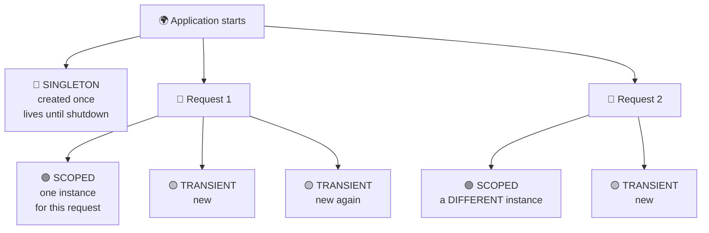

### ⚠️ The captive dependency — the #1 DI bug

```csharp
services.AddSingleton<OrderService>();              // ❌ lives forever
services.AddScoped<IOrderRepository, SqlRepo>();    //    lives one request
```

The singleton `OrderService` grabs **one** repository at startup and holds it **forever**. That
repository (and its database connection) was meant to live for one request. Result: a stale or
disposed connection, cross-request data leakage, and thread-safety bugs that appear only under
load and are almost impossible to reproduce.

**The rule:**

| A service of this lifetime... | ...may depend on |
|---|---|
| Singleton | Singleton only |
| Scoped | Scoped, Singleton |
| Transient | Anything |

> 💡 **Tip** — In development, `BuildServiceProvider(validateScopes: true)` (which ASP.NET Core
> does automatically) makes the container **throw** on captive dependencies at startup instead of
> failing mysteriously in production.

If a singleton genuinely needs a scoped service, create a scope explicitly:

```csharp
public class BackgroundWorker(IServiceScopeFactory scopeFactory)
{
    public async Task RunAsync()
    {
        using IServiceScope scope = scopeFactory.CreateScope();
        var repository = scope.ServiceProvider.GetRequiredService<IOrderRepository>();
        // ✅ safe — this repository lives and dies with the scope
    }
}
```

## 39.5 Keyed services — several implementations, chosen by name

```csharp
services.AddKeyedScoped<IPaymentGateway, StripeGateway>("stripe");
services.AddKeyedScoped<IPaymentGateway, PayPalGateway>("paypal");
```

```csharp
public class CheckoutService([FromKeyedServices("stripe")] IPaymentGateway gateway)
{
    public Task ChargeAsync(decimal amount) => gateway.ChargeAsync(amount);
}
```

## 39.6 ⚠️ The Service Locator anti-pattern

```csharp
// ❌ Don't do this
public class OrderService
{
    private readonly IServiceProvider provider;
    public OrderService(IServiceProvider provider) => this.provider = provider;

    public void PlaceOrder(Order order)
    {
        var repository = provider.GetRequiredService<IOrderRepository>();   // 😱 hidden
        repository.Save(order);
    }
}
```

Why it's bad:
- The constructor **lies** — it hides what the class really needs
- Failures happen at **runtime**, deep in a method, not at startup
- Tests must configure a whole container instead of passing two fakes

✅ Just declare the dependency:

```csharp
public class OrderService(IOrderRepository repository)
{
    public void PlaceOrder(Order order) => repository.Save(order);
}
```

## 39.7 The payoff: testing

```csharp
public class OrderServiceTests
{
    [Fact]
    public async Task PlaceOrder_SavesOrderAndSendsEmail()
    {
        // Arrange — two tiny fakes, no container, no database, no network
        var repository = new FakeOrderRepository();
        var emailSender = new FakeEmailSender();
        var service = new OrderService(repository, emailSender);
        var order = new Order(/* ... */);

        // Act
        await service.PlaceOrderAsync(order);

        // Assert
        Assert.Single(repository.Saved);
        Assert.Single(emailSender.Sent);
        Assert.Equal("Confirmed", emailSender.Sent[0].Subject);
    }
}
```

This test runs in **under a millisecond**, works offline, and never flakes. That is what DI buys
you, and it is why every professional .NET codebase uses it.

## 39.8 DI benefits summary

| Benefit | Because |
|---|---|
| 🪶 **Loose coupling** | Classes depend on contracts, not concretes |
| 🧪 **Testability** | Swap in fakes without changing any production code |
| 🔄 **Flexibility** | Change implementations by editing one registration line |
| 📖 **Honest APIs** | The constructor lists everything the class needs |
| ⚙️ **Configurability** | Different implementations per environment |
| ♻️ **Lifetime management** | The container disposes `IDisposable` services for you |

## 39.9 🧪 Hands-on exercise

Build a console app with a DI container:

1. `IGreetingService` → `EnglishGreeting`, `SinhalaGreeting` (registered as keyed services)
2. `IClock` → `SystemClock` (singleton) and `FixedClock` (for tests)
3. `IMessageLog` → `ConsoleLog` (scoped) which records the time from `IClock`
4. A `GreetingApp` that takes all three via constructor injection
5. Write one test that uses `FixedClock` and asserts on the exact timestamp

---

# 40. 🎨 Design patterns for C# OOP

**Level: ⭐⭐⭐ Advanced**

### 🗣️ In plain English

A **design pattern** is a name for a solution that many people have independently arrived at.
They are not rules to follow — they are **vocabulary**, so you can say *"let's use a Strategy
here"* instead of describing five classes.

> ⚠️ **Read this before the patterns**
> Do **not** memorise patterns and then hunt for places to use them. That produces terrible code.
> Learn the **problem** each pattern solves. When you meet that problem, you'll recognise it.

<div align="center">

| 🏭 Creational | 🏗️ Structural | 🎭 Behavioural |
|---|---|---|
| How objects get made | How objects fit together | How objects collaborate |
| Factory, Builder, Singleton, Prototype | Adapter, Decorator, Facade, Composite | Strategy, Observer, Command, Template Method, State, Chain of Responsibility, Mediator, Specification, Null Object |

</div>

---

## 40.1 🏭 Factory Method

**The problem:** creating an object requires logic, and callers shouldn't have to know it.

```csharp
public interface INotificationSender
{
    void Send(string message);
}

public class EmailSender : INotificationSender
{
    public void Send(string message) => Console.WriteLine($"📧 {message}");
}

public class SmsSender : INotificationSender
{
    public void Send(string message) => Console.WriteLine($"📱 {message}");
}

public class PushSender : INotificationSender
{
    public void Send(string message) => Console.WriteLine($"🔔 {message}");
}

public static class NotificationSenderFactory
{
    public static INotificationSender Create(NotificationChannel channel) => channel switch
    {
        NotificationChannel.Email => new EmailSender(),
        NotificationChannel.Sms   => new SmsSender(),
        NotificationChannel.Push  => new PushSender(),
        _ => throw new ArgumentOutOfRangeException(nameof(channel))
    };
}

public enum NotificationChannel { Email, Sms, Push }
```

```csharp
INotificationSender sender = NotificationSenderFactory.Create(NotificationChannel.Sms);
sender.Send("Your order has shipped.");
```

**🎯 Use when:** the concrete type depends on a runtime value (config, user choice, data).
**🚫 Don't use when:** a DI container already does the job — which, in modern .NET, is often.

---

## 40.2 🎭 Strategy

**The problem:** an algorithm should be swappable at runtime.

```csharp
public interface IShippingCostStrategy
{
    string Name { get; }
    decimal Calculate(decimal orderTotal, decimal weightKg);
}

public class StandardShipping : IShippingCostStrategy
{
    public string Name => "Standard";
    public decimal Calculate(decimal orderTotal, decimal weightKg)
        => orderTotal > 100 ? 0 : 5 + weightKg * 0.5m;
}

public class ExpressShipping : IShippingCostStrategy
{
    public string Name => "Express";
    public decimal Calculate(decimal orderTotal, decimal weightKg) => 15 + weightKg * 1.2m;
}

public class CheckoutService
{
    private readonly IShippingCostStrategy shipping;

    public CheckoutService(IShippingCostStrategy shipping) => this.shipping = shipping;

    public decimal CalculateTotal(decimal orderTotal, decimal weightKg)
        => orderTotal + shipping.Calculate(orderTotal, weightKg);
}
```

```csharp
var express = new CheckoutService(new ExpressShipping());
Console.WriteLine(express.CalculateTotal(50m, 2m));    // 17.4
```

**🎯 Use when:** you have several interchangeable ways to do the same job — pricing, shipping,
compression, sorting, validation, retry policies.

> 💡 **The lightweight version** — for a one-method strategy, a delegate often beats an interface:
> ```csharp
> public class CheckoutService2(Func<decimal, decimal, decimal> calculateShipping) { }
> ```
> Use the interface when the strategy needs a name, state, or several methods.

---

## 40.3 🗂️ Repository

**The problem:** business logic shouldn't know how data is stored.

```csharp
public interface IOrderRepository
{
    Task<Order?> GetByIdAsync(int id, CancellationToken ct = default);
    Task<IReadOnlyList<Order>> GetByCustomerAsync(int customerId, CancellationToken ct = default);
    Task AddAsync(Order order, CancellationToken ct = default);
    Task RemoveAsync(int id, CancellationToken ct = default);
}
```

```csharp
// Production
public class SqlOrderRepository : IOrderRepository { /* Entity Framework */ }

// Tests — same contract, no database
public class InMemoryOrderRepository : IOrderRepository
{
    private readonly List<Order> orders = new();

    public Task<Order?> GetByIdAsync(int id, CancellationToken ct = default)
        => Task.FromResult(orders.FirstOrDefault(o => o.Id == id));

    public Task<IReadOnlyList<Order>> GetByCustomerAsync(int customerId, CancellationToken ct = default)
        => Task.FromResult<IReadOnlyList<Order>>(
               orders.Where(o => o.CustomerId == customerId).ToList());

    public Task AddAsync(Order order, CancellationToken ct = default)
    {
        orders.Add(order);
        return Task.CompletedTask;
    }

    public Task RemoveAsync(int id, CancellationToken ct = default)
    {
        orders.RemoveAll(o => o.Id == id);
        return Task.CompletedTask;
    }
}
```

**🎯 Use when:** you want to test business logic without a database, or you might change storage.

> ⚠️ **The debate** — Some argue that Entity Framework's `DbContext` *is already* a repository,
> and wrapping it adds a layer for nothing. Both positions are defensible. Wrap it if you value
> the testing and the abstraction; skip it if your app is a thin CRUD layer over the database.

---

## 40.4 📦 Unit of Work

**The problem:** several repository changes must all succeed, or all fail.

```csharp
public interface IUnitOfWork : IAsyncDisposable
{
    IOrderRepository Orders { get; }
    ICustomerRepository Customers { get; }
    IProductRepository Products { get; }

    Task<int> SaveChangesAsync(CancellationToken ct = default);
}
```

```csharp
public class PlaceOrderService(IUnitOfWork unitOfWork)
{
    public async Task PlaceAsync(int customerId, IEnumerable<OrderItem> items)
    {
        Customer customer = await unitOfWork.Customers.GetByIdAsync(customerId)
            ?? throw new DomainException("Customer not found.");

        var order = customer.PlaceOrder(items);
        await unitOfWork.Orders.AddAsync(order);

        foreach (var item in items)
        {
            var product = await unitOfWork.Products.GetByIdAsync(item.ProductId);
            product!.ReduceStock(item.Quantity);
        }

        // ✅ One transaction. Everything commits, or nothing does.
        await unitOfWork.SaveChangesAsync();
    }
}
```

---

## 40.5 👁️ Observer

**The problem:** several parts of the system need to react when something happens.

```csharp
public class StockPriceEventArgs(string symbol, decimal oldPrice, decimal newPrice) : EventArgs
{
    public string Symbol { get; } = symbol;
    public decimal OldPrice { get; } = oldPrice;
    public decimal NewPrice { get; } = newPrice;
    public decimal PercentChange => (NewPrice - OldPrice) / OldPrice * 100;
}

public class StockTicker
{
    private readonly Dictionary<string, decimal> prices = new();

    public event EventHandler<StockPriceEventArgs>? PriceChanged;

    public void UpdatePrice(string symbol, decimal newPrice)
    {
        decimal oldPrice = prices.GetValueOrDefault(symbol, newPrice);
        prices[symbol] = newPrice;

        PriceChanged?.Invoke(this, new StockPriceEventArgs(symbol, oldPrice, newPrice));
    }
}
```

```csharp
var ticker = new StockTicker();

ticker.PriceChanged += (s, e) => Console.WriteLine($"📊 {e.Symbol}: {e.NewPrice:C}");

ticker.PriceChanged += (s, e) =>
{
    if (Math.Abs(e.PercentChange) > 5)
        Console.WriteLine($"🚨 ALERT: {e.Symbol} moved {e.PercentChange:F1}%");
};

ticker.UpdatePrice("MSFT", 420m);
ticker.UpdatePrice("MSFT", 450m);
```

🔗 Full details in [Chapter 30](#30--delegates-lambdas-events-and-callbacks).

---

## 40.6 🎁 Decorator

**The problem:** add behaviour to an object without changing its class.

```csharp
public interface IPaymentGateway
{
    Task<bool> ChargeAsync(decimal amount);
}

// The real thing.
public class StripePaymentGateway : IPaymentGateway
{
    public Task<bool> ChargeAsync(decimal amount)
    {
        Console.WriteLine($"💳 Charging {amount:C} via Stripe");
        return Task.FromResult(true);
    }
}

// 🎁 Decorator 1: logging
public class LoggingPaymentGateway(IPaymentGateway inner, ILogger logger) : IPaymentGateway
{
    public async Task<bool> ChargeAsync(decimal amount)
    {
        logger.Info($"Charge started: {amount:C}");
        bool result = await inner.ChargeAsync(amount);
        logger.Info($"Charge finished: {result}");
        return result;
    }
}

// 🎁 Decorator 2: retry
public class RetryingPaymentGateway(IPaymentGateway inner, int maxAttempts = 3) : IPaymentGateway
{
    public async Task<bool> ChargeAsync(decimal amount)
    {
        for (int attempt = 1; attempt <= maxAttempts; attempt++)
        {
            try { return await inner.ChargeAsync(amount); }
            catch when (attempt < maxAttempts)
            {
                await Task.Delay(TimeSpan.FromSeconds(Math.Pow(2, attempt)));
            }
        }
        return false;
    }
}
```

**Stack them like Russian dolls:**

```csharp
IPaymentGateway gateway =
    new LoggingPaymentGateway(
        new RetryingPaymentGateway(
            new StripePaymentGateway()),
        logger);

await gateway.ChargeAsync(100m);
```

`StripePaymentGateway` knows nothing about logging or retries. Each concern lives in its own
class, and you compose exactly the combination you want.

**🎯 Use when:** you want cross-cutting concerns (logging, caching, retry, validation, timing)
without cluttering the real implementation.

---

## 40.7 🔌 Adapter

**The problem:** a third-party class has the wrong shape for your code.

```csharp
// What YOUR application wants.
public interface IEmailSender
{
    Task SendAsync(string to, string subject, string body);
}

// What the third-party library actually gives you — you cannot change it.
public class ThirdPartyMailer
{
    public void Deliver(string recipientAddress, string messageTitle, string content, int priority)
        => Console.WriteLine($"Delivered to {recipientAddress}");
}

// 🔌 The adapter: a translator between the two shapes.
public class ThirdPartyMailerAdapter(ThirdPartyMailer mailer) : IEmailSender
{
    public Task SendAsync(string to, string subject, string body)
    {
        mailer.Deliver(to, subject, body, priority: 1);   // translate the call
        return Task.CompletedTask;
    }
}
```

**🎯 Use when:** integrating a library, a legacy system, or an external API whose shape you don't
control — and you refuse to let its shape leak into your whole codebase.

---

## 40.8 🏛️ Facade

**The problem:** a complicated subsystem needs a simple front door.

```csharp
// Complicated internals
public class InventoryService { public bool Reserve(int productId, int qty) => true; }
public class PricingService { public decimal Calculate(int productId, int qty) => qty * 10m; }
public class TaxService { public decimal Calculate(decimal amount) => amount * 0.15m; }
public class ShippingService { public decimal Quote(string country) => 12m; }
public class PaymentService { public bool Charge(decimal amount) => true; }

// 🏛️ One simple door
public class CheckoutFacade(
    InventoryService inventory,
    PricingService pricing,
    TaxService tax,
    ShippingService shipping,
    PaymentService payment)
{
    public CheckoutResult Checkout(int productId, int quantity, string country)
    {
        if (!inventory.Reserve(productId, quantity))
            return new CheckoutResult(false, 0, "Out of stock");

        decimal subtotal = pricing.Calculate(productId, quantity);
        decimal total = subtotal + tax.Calculate(subtotal) + shipping.Quote(country);

        return payment.Charge(total)
            ? new CheckoutResult(true, total, "Success")
            : new CheckoutResult(false, total, "Payment declined");
    }
}

public record CheckoutResult(bool Succeeded, decimal Total, string Message);
```

```csharp
var result = facade.Checkout(productId: 1, quantity: 2, country: "LK");   // one call
```

**🎯 Use when:** callers only ever need one common path through a complex subsystem.

---

## 40.9 📋 Command

**The problem:** you want to treat "an action" as an object — to queue it, log it, or undo it.

```csharp
public interface ICommand
{
    string Description { get; }
    void Execute();
    void Undo();
}

public class AddTextCommand(Document document, string text) : ICommand
{
    public string Description => $"Add '{text}'";

    public void Execute() => document.Append(text);
    public void Undo() => document.RemoveLast(text.Length);
}

public class Document
{
    private readonly System.Text.StringBuilder content = new();

    public void Append(string text) => content.Append(text);
    public void RemoveLast(int count) => content.Remove(content.Length - count, count);
    public override string ToString() => content.ToString();
}

// The invoker — gives you undo/redo for free.
public class CommandHistory
{
    private readonly Stack<ICommand> executed = new();
    private readonly Stack<ICommand> undone = new();

    public void Run(ICommand command)
    {
        command.Execute();
        executed.Push(command);
        undone.Clear();
    }

    public void Undo()
    {
        if (executed.Count == 0) return;
        ICommand command = executed.Pop();
        command.Undo();
        undone.Push(command);
    }

    public void Redo()
    {
        if (undone.Count == 0) return;
        ICommand command = undone.Pop();
        command.Execute();
        executed.Push(command);
    }
}
```

```csharp
var document = new Document();
var history = new CommandHistory();

history.Run(new AddTextCommand(document, "Hello "));
history.Run(new AddTextCommand(document, "World"));
Console.WriteLine(document);      // "Hello World"

history.Undo();
Console.WriteLine(document);      // "Hello "

history.Redo();
Console.WriteLine(document);      // "Hello World"
```

**🎯 Use when:** you need undo/redo, a job queue, an audit log of actions, or macro recording.

---

## 40.10 🧱 Builder

**The problem:** an object has many optional parts, and a 9-parameter constructor is unreadable.

```csharp
public class Pizza
{
    public string Size { get; init; } = "Medium";
    public string Crust { get; init; } = "Regular";
    public IReadOnlyList<string> Toppings { get; init; } = [];
    public bool ExtraCheese { get; init; }

    public override string ToString()
        => $"{Size} {Crust} pizza with {string.Join(", ", Toppings)}" +
           (ExtraCheese ? " + extra cheese" : "");
}

public class PizzaBuilder
{
    private string size = "Medium";
    private string crust = "Regular";
    private readonly List<string> toppings = new();
    private bool extraCheese;

    public PizzaBuilder OfSize(string size) { this.size = size; return this; }
    public PizzaBuilder WithCrust(string crust) { this.crust = crust; return this; }
    public PizzaBuilder AddTopping(string topping) { toppings.Add(topping); return this; }
    public PizzaBuilder WithExtraCheese() { extraCheese = true; return this; }

    public Pizza Build()
    {
        if (toppings.Count > 8)
            throw new InvalidOperationException("Maximum 8 toppings.");

        return new Pizza
        {
            Size = size, Crust = crust,
            Toppings = toppings.ToList(), ExtraCheese = extraCheese
        };
    }
}
```

```csharp
Pizza pizza = new PizzaBuilder()
    .OfSize("Large")
    .WithCrust("Thin")
    .AddTopping("Mushroom")
    .AddTopping("Olive")
    .WithExtraCheese()
    .Build();

Console.WriteLine(pizza);
```

**🎯 Use when:** many optional parameters, or construction must be validated as a whole.
**💡 In modern C#**, object initializers plus `required`/`init` often cover this with less code —
use a builder when there is real validation or step ordering.

---

## 40.11 1️⃣ Singleton

**The problem:** exactly one instance should exist.

```csharp
public sealed class ApplicationCache
{
    // Lazy<T> gives you thread-safe, lazy initialisation for free.
    private static readonly Lazy<ApplicationCache> instance = new(() => new ApplicationCache());

    public static ApplicationCache Instance => instance.Value;

    private readonly Dictionary<string, object> store = new();

    private ApplicationCache() { }        // 🔒 nobody else can construct one

    public void Set(string key, object value) => store[key] = value;
    public T? Get<T>(string key) => store.TryGetValue(key, out var v) ? (T)v : default;
}
```

> ⚠️ **In modern .NET, prefer the DI container:**
> ```csharp
> services.AddSingleton<IApplicationCache, ApplicationCache>();
> ```
> You get the same "one instance" guarantee, but the class stays **testable** (you can inject a
> different one) and its dependencies are explicit. The hand-written Singleton is a global
> variable in a nice coat — it makes testing hard and hides coupling.

---

## 40.12 📐 Template Method

**The problem:** several processes share the same steps in the same order, but differ in details.

```csharp
public abstract class ReportGenerator
{
    // 👑 The algorithm is fixed here. Subclasses cannot reorder it.
    public string Generate(DateOnly from, DateOnly to)
    {
        var data = FetchData(from, to);
        var filtered = Filter(data);
        var formatted = Format(filtered);
        return AddHeaderAndFooter(formatted, from, to);
    }

    protected abstract IReadOnlyList<string> FetchData(DateOnly from, DateOnly to);
    protected abstract string Format(IReadOnlyList<string> data);

    // A hook with a sensible default — subclasses MAY override it.
    protected virtual IReadOnlyList<string> Filter(IReadOnlyList<string> data) => data;

    private string AddHeaderAndFooter(string body, DateOnly from, DateOnly to)
        => $"=== Report {from} to {to} ===\n{body}\n=== End ===";
}

public class SalesReportGenerator : ReportGenerator
{
    protected override IReadOnlyList<string> FetchData(DateOnly from, DateOnly to)
        => ["Sale 1: $100", "Sale 2: $250"];

    protected override string Format(IReadOnlyList<string> data)
        => string.Join("\n", data);
}
```

**🎯 Use when:** the *order* of steps must never vary, but the steps themselves do.
🔗 See also [Chapter 14.4](#144-the-template-method--abstractions-most-useful-shape).

---

## 40.13 🚦 State

**The problem:** an object behaves completely differently depending on its state, and the
`if`-chains are getting out of hand.

```csharp
public interface IOrderState
{
    string Name { get; }
    IOrderState Pay();
    IOrderState Ship();
    IOrderState Cancel();
}

public class DraftState : IOrderState
{
    public string Name => "Draft";
    public IOrderState Pay() => new PaidState();
    public IOrderState Ship() => throw new DomainException("Cannot ship an unpaid order.");
    public IOrderState Cancel() => new CancelledState();
}

public class PaidState : IOrderState
{
    public string Name => "Paid";
    public IOrderState Pay() => throw new DomainException("Order is already paid.");
    public IOrderState Ship() => new ShippedState();
    public IOrderState Cancel() => new CancelledState();
}

public class ShippedState : IOrderState
{
    public string Name => "Shipped";
    public IOrderState Pay() => throw new DomainException("Order is already paid.");
    public IOrderState Ship() => throw new DomainException("Order is already shipped.");
    public IOrderState Cancel() => throw new DomainException("Cannot cancel a shipped order.");
}

public class CancelledState : IOrderState
{
    public string Name => "Cancelled";
    public IOrderState Pay() => throw new DomainException("Order is cancelled.");
    public IOrderState Ship() => throw new DomainException("Order is cancelled.");
    public IOrderState Cancel() => throw new DomainException("Order is already cancelled.");
}
```

```csharp
public class Order
{
    private IOrderState state = new DraftState();

    public string Status => state.Name;

    public void Pay() => state = state.Pay();
    public void Ship() => state = state.Ship();
    public void Cancel() => state = state.Cancel();
}
```

```csharp
var order = new Order();
Console.WriteLine(order.Status);   // Draft
order.Pay();
order.Ship();
Console.WriteLine(order.Status);   // Shipped
order.Cancel();                    // 💥 DomainException — impossible transition
```

**🎯 Use when:** you have a genuine state machine with many states and many transitions.
**🚫 For 2–3 states**, an enum plus guard clauses is simpler — don't over-build.

---

## 40.14 ⛓️ Chain of Responsibility

**The problem:** several handlers might deal with a request; pass it along until one does.

```csharp
public abstract class ApprovalHandler
{
    private ApprovalHandler? next;

    public ApprovalHandler Then(ApprovalHandler next)
    {
        this.next = next;
        return next;
    }

    public void Handle(ExpenseRequest request)
    {
        if (CanApprove(request))
            Approve(request);
        else if (next is not null)
            next.Handle(request);
        else
            throw new InvalidOperationException($"No one can approve {request.Amount:C}.");
    }

    protected abstract bool CanApprove(ExpenseRequest request);
    protected abstract void Approve(ExpenseRequest request);
}

public record ExpenseRequest(string Employee, decimal Amount, string Reason);

public class TeamLeadHandler : ApprovalHandler
{
    protected override bool CanApprove(ExpenseRequest r) => r.Amount <= 500;
    protected override void Approve(ExpenseRequest r)
        => Console.WriteLine($"👤 Team Lead approved {r.Amount:C}");
}

public class ManagerHandler : ApprovalHandler
{
    protected override bool CanApprove(ExpenseRequest r) => r.Amount <= 5_000;
    protected override void Approve(ExpenseRequest r)
        => Console.WriteLine($"👔 Manager approved {r.Amount:C}");
}

public class DirectorHandler : ApprovalHandler
{
    protected override bool CanApprove(ExpenseRequest r) => r.Amount <= 50_000;
    protected override void Approve(ExpenseRequest r)
        => Console.WriteLine($"🎩 Director approved {r.Amount:C}");
}
```

```csharp
var teamLead = new TeamLeadHandler();
teamLead.Then(new ManagerHandler()).Then(new DirectorHandler());

teamLead.Handle(new ExpenseRequest("Anna", 250m, "Books"));     // 👤 Team Lead
teamLead.Handle(new ExpenseRequest("Gehan", 3_000m, "Laptop")); // 👔 Manager
teamLead.Handle(new ExpenseRequest("Maria", 20_000m, "Server"));// 🎩 Director
```

**🎯 Use when:** approval workflows, ASP.NET middleware pipelines, validation chains, event
bubbling.

---

## 40.15 🕳️ Null Object

**The problem:** you're writing `if (x is not null)` everywhere.

```csharp
public interface ILogger
{
    void Info(string message);
    void Error(string message, Exception? ex = null);
}

public class ConsoleLogger : ILogger
{
    public void Info(string message) => Console.WriteLine($"INFO: {message}");
    public void Error(string message, Exception? ex = null)
        => Console.WriteLine($"ERROR: {message} {ex?.Message}");
}

// 🕳️ The Null Object: does nothing, safely and correctly.
public sealed class NullLogger : ILogger
{
    public static readonly NullLogger Instance = new();
    private NullLogger() { }

    public void Info(string message) { }
    public void Error(string message, Exception? ex = null) { }
}
```

```csharp
// ❌ Before — a null check at every single call site
public class OrderService1(ILogger? logger)
{
    public void Place(Order o)
    {
        logger?.Info("Placing order");
        // ...
        logger?.Info("Order placed");
    }
}

// ✅ After — never null, never checked
public class OrderService2(ILogger? logger = null)
{
    private readonly ILogger logger = logger ?? NullLogger.Instance;

    public void Place(Order o)
    {
        logger.Info("Placing order");
        // ...
        logger.Info("Order placed");
    }
}
```

**🎯 Use when:** an optional collaborator's absence should mean "do nothing", not "crash".
.NET itself ships `NullLogger` for exactly this.

---

## 40.16 🔎 Specification

**The problem:** business rules about "which items qualify" are scattered and duplicated.

```csharp
public interface ISpecification<T>
{
    bool IsSatisfiedBy(T candidate);
}

public class HighValueOrderSpecification : ISpecification<Order>
{
    private readonly decimal threshold;
    public HighValueOrderSpecification(decimal threshold) => this.threshold = threshold;
    public bool IsSatisfiedBy(Order order) => order.Total >= threshold;
}

public class OverdueOrderSpecification : ISpecification<Order>
{
    public bool IsSatisfiedBy(Order order)
        => order.Status != OrderStatus.Delivered
           && order.PlacedOn < DateOnly.FromDateTime(DateTime.Today.AddDays(-30));
}

// Combine them:
public class AndSpecification<T>(ISpecification<T> left, ISpecification<T> right) : ISpecification<T>
{
    public bool IsSatisfiedBy(T candidate)
        => left.IsSatisfiedBy(candidate) && right.IsSatisfiedBy(candidate);
}
```

```csharp
var needsEscalation = new AndSpecification<Order>(
    new HighValueOrderSpecification(10_000m),
    new OverdueOrderSpecification());

var escalate = orders.Where(needsEscalation.IsSatisfiedBy).ToList();
```

**🎯 Use when:** the same business rule is needed in filtering, validation, and reporting — and
you want it defined exactly once, with a name.

---

## 40.17 Pattern chooser

| Your problem | Pattern |
|---|---|
| Creating objects requires logic | 🏭 Factory |
| Many optional construction parameters | 🧱 Builder |
| Exactly one instance | 1️⃣ Singleton (or a DI singleton) |
| Swappable algorithms | 🎭 Strategy |
| Add behaviour without editing a class | 🎁 Decorator |
| Wrong-shaped third-party API | 🔌 Adapter |
| Complex subsystem needs a simple door | 🏛️ Facade |
| Many listeners for one event | 👁️ Observer |
| Undo / redo / queue of actions | 📋 Command |
| Same steps, varying details | 📐 Template Method |
| Behaviour depends heavily on state | 🚦 State |
| A request passes through handlers | ⛓️ Chain of Responsibility |
| Business logic shouldn't know about the database | 🗂️ Repository |
| Several changes must commit together | 📦 Unit of Work |
| Tired of null checks | 🕳️ Null Object |
| Reusable, combinable business rules | 🔎 Specification |

> 🎓 **Professor's final word on patterns**
> The best code is the **simplest** code that solves the problem. A pattern is justified when it
> removes real pain you can name. If you cannot say which pain it removes, you're decorating,
> not designing.

## 40.18 🧪 Hands-on exercise

For each problem below, name the pattern **and say what pain it removes**. Then implement two
of them.

| # | The problem in front of you |
|---|---|
| 1 | Users choose "email", "SMS" or "push" in settings; you must create the right sender |
| 2 | Your `PaymentGateway` works, but now every call must be logged and retried |
| 3 | A text editor needs unlimited undo and redo |
| 4 | Reports differ in how they fetch and format data, but the steps are always the same |
| 5 | The third-party SMS library's method signature does not match your interface |
| 6 | An order behaves completely differently when Draft, Paid, Shipped, or Cancelled |
| 7 | Expenses are approved by a team lead, manager, or director depending on the amount |
| 8 | You have `if (logger is not null)` in 40 places |
| 9 | "Is this order eligible for free shipping?" is needed in three separate features |
| 10 | Checkout requires calling five services in a fixed order, and callers keep getting it wrong |

Then answer the hardest question: **for which of these ten would you NOT use a pattern**,
and just write the simple code instead? Justify your answer.

---

# 41. 🏛️ Domain modeling and architecture

**Level: ⭐⭐⭐ Advanced**

### 🗣️ In plain English

Everything so far taught you *how* to build classes. This chapter is about **which classes to
build**, and **where to put them**, so that a real application stays understandable at 50,000
lines instead of collapsing at 5,000.

The core idea: **your business rules are the most valuable thing you own.** Protect them from
databases, web frameworks, and UI libraries — all of which will be replaced long before the
business rules change.

## 41.1 The building blocks

| Block | What it is | Example |
|---|---|---|
| 🆔 **Entity** | Has identity; two with the same data are still different | `Customer`, `Order` |
| 💎 **Value object** | Defined entirely by its values; interchangeable | `Money`, `EmailAddress` |
| 🛡️ **Aggregate** | A cluster of objects with one guardian and one rule boundary | `Order` + its `OrderItems` |
| ⚙️ **Domain service** | Business logic that belongs to no single entity | `PricingService` |
| 🎬 **Application service** | Orchestrates a use case, no business rules of its own | `PlaceOrderService` |
| 🔌 **Infrastructure** | The technical details | `SqlOrderRepository` |

## 41.2 🆔 Entities — identity matters

```csharp
public abstract class Entity
{
    public int Id { get; protected set; }

    public override bool Equals(object? obj)
        => obj is Entity other
           && GetType() == other.GetType()
           && Id != 0
           && Id == other.Id;                 // 👈 identity, not data

    public override int GetHashCode() => HashCode.Combine(GetType(), Id);
}
```

```csharp
public class Customer : Entity
{
    public string Name { get; private set; }
    public EmailAddress Email { get; private set; }

    public Customer(string name, EmailAddress email)
    {
        if (string.IsNullOrWhiteSpace(name))
            throw new DomainException("Customer name is required.");

        Name = name;
        Email = email;
    }

    public void ChangeEmail(EmailAddress newEmail)
    {
        if (newEmail == Email) return;
        Email = newEmail;
    }
}
```

**The test for an entity:** if you change every field, is it still *the same thing*?
A customer who changes their name, email, and address is still **customer #42**. ✅ Entity.

## 41.3 💎 Value objects — the values ARE the identity

```csharp
public readonly record struct Money(decimal Amount, string Currency)
{
    public static Money Zero(string currency) => new(0, currency);

    public Money Add(Money other) => SameCurrency(other)
        ? new Money(Amount + other.Amount, Currency)
        : throw new DomainException($"Cannot add {other.Currency} to {Currency}.");

    public Money Multiply(decimal factor) => new(Amount * factor, Currency);

    private bool SameCurrency(Money other) => Currency == other.Currency;

    public override string ToString() => $"{Amount:N2} {Currency}";
}
```

**The test for a value object:** are two with the same data **interchangeable**?
A $100 note is interchangeable with any other $100 note. ✅ Value object.

| Typical value objects |
|---|
| `Money`, `EmailAddress`, `PhoneNumber`, `Address`, `DateRange`, `Quantity`, `Percentage`, `Coordinates`, `Sku`, `Isbn` |

> 🎓 **Professor's rule** — Every time you use a bare `string` or `decimal` for something with
> **rules**, you've missed a value object. This is the "primitive obsession" smell
> ([Chapter 44](#44--common-oop-mistakes)).

### Why value objects pay for themselves

```csharp
// ❌ Everything is a string. Nothing is validated. Anything can be swapped by mistake.
public void Register(string email, string phone, string country) { }
Register(phone, email, country);   // 😱 compiles perfectly. Ships to production.

// ✅ The compiler catches it before you even save the file.
public void Register(EmailAddress email, PhoneNumber phone, CountryCode country) { }
// Register(phone, email, country);   // ❌ compiler error
```

## 41.4 🛡️ Aggregates — the consistency boundary

### 🗣️ In plain English

An **aggregate** is a group of objects that must stay consistent together, with **one** object in
charge — the **aggregate root**. All changes go through the root.

Think of a **contract with clauses**. You do not edit a clause on its own. You go through the
contract, which checks whether the change is legal.

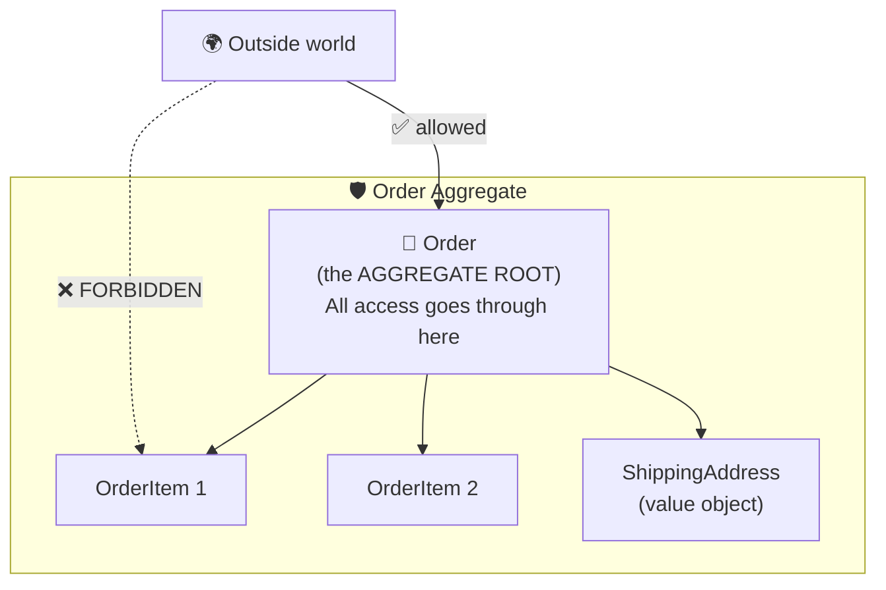

```csharp
public class Order : Entity
{
    private readonly List<OrderItem> items = new();

    public int CustomerId { get; }
    public OrderStatus Status { get; private set; } = OrderStatus.Draft;
    public IReadOnlyList<OrderItem> Items => items;
    public Money Total => items.Aggregate(
        Money.Zero("USD"), (sum, item) => sum.Add(item.LineTotal));

    public Order(int customerId) => CustomerId = customerId;

    // ✅ The ONLY way to add an item. Every rule is checked here.
    public void AddItem(int productId, string productName, int quantity, Money unitPrice)
    {
        EnsureModifiable();

        if (quantity <= 0)
            throw new DomainException("Quantity must be positive.");

        if (items.Count >= 100)
            throw new DomainException("An order cannot have more than 100 lines.");

        OrderItem? existing = items.FirstOrDefault(i => i.ProductId == productId);

        if (existing is not null)
            existing.IncreaseQuantity(quantity);          // merge duplicates
        else
            items.Add(new OrderItem(productId, productName, quantity, unitPrice));
    }

    public void RemoveItem(int productId)
    {
        EnsureModifiable();
        items.RemoveAll(i => i.ProductId == productId);
    }

    public void Submit()
    {
        EnsureModifiable();

        if (items.Count == 0)
            throw new DomainException("Cannot submit an empty order.");

        Status = OrderStatus.Submitted;
    }

    public void MarkPaid()
    {
        if (Status != OrderStatus.Submitted)
            throw new DomainException($"Cannot pay an order that is {Status}.");

        Status = OrderStatus.Paid;
    }

    private void EnsureModifiable()
    {
        if (Status != OrderStatus.Draft)
            throw new DomainException($"Cannot modify an order that is {Status}.");
    }
}
```

```csharp
public class OrderItem : Entity
{
    public int ProductId { get; }
    public string ProductName { get; }
    public int Quantity { get; private set; }
    public Money UnitPrice { get; }
    public Money LineTotal => UnitPrice.Multiply(Quantity);

    // 👇 internal — only the Order (and code in this assembly) can create one.
    internal OrderItem(int productId, string productName, int quantity, Money unitPrice)
    {
        ProductId = productId;
        ProductName = productName;
        Quantity = quantity;
        UnitPrice = unitPrice;
    }

    internal void IncreaseQuantity(int amount) => Quantity += amount;
}
```

### The rules of aggregates

| Rule | Why |
|---|---|
| Outside code references **only the root** | The root can then guarantee every invariant |
| The root enforces **all** invariants | Rules live in exactly one place |
| One transaction changes **one** aggregate | Keeps transactions small and scalable |
| Reference other aggregates **by ID**, not by object | Prevents accidentally loading half the database |

```csharp
// ❌ An object reference drags the whole Customer aggregate along
public class Order { public Customer Customer { get; set; } }

// ✅ Just the ID
public class Order { public int CustomerId { get; } }
```

## 41.5 ⚙️ Domain services

Some logic belongs to no single entity. That's a **domain service** — but it still contains
**business rules**, not plumbing.

```csharp
public class PricingService
{
    public Money CalculateFinalPrice(
        Order order,
        IDiscountPolicy discountPolicy,
        ITaxPolicy taxPolicy)
    {
        Money subtotal = order.Total;
        Money discount = discountPolicy.CalculateDiscount(subtotal);
        Money afterDiscount = subtotal.Add(discount.Multiply(-1));
        Money tax = taxPolicy.CalculateTax(afterDiscount);

        return afterDiscount.Add(tax);
    }
}
```

**🎯 Use a domain service when:** the operation involves several aggregates, or the rule genuinely
belongs to none of them. **🚫 Don't use one** as a dumping ground — if the logic touches only one
entity's data, it belongs *on that entity*.

## 41.6 🎬 Application services — orchestrating a use case

An application service is a **conductor**. It contains **no business rules** — it fetches, calls,
and saves.

```csharp
public class PlaceOrderService(
    IOrderRepository orderRepository,
    ICustomerRepository customerRepository,
    IPaymentGateway paymentGateway,
    IEmailSender emailSender,
    IUnitOfWork unitOfWork)
{
    public async Task<int> PlaceAsync(PlaceOrderRequest request, CancellationToken ct = default)
    {
        // 1️⃣ Load
        Customer customer = await customerRepository.GetByIdAsync(request.CustomerId, ct)
            ?? throw new DomainException($"Customer {request.CustomerId} not found.");

        // 2️⃣ Let the DOMAIN do the thinking
        var order = new Order(customer.Id);
        foreach (var line in request.Lines)
            order.AddItem(line.ProductId, line.ProductName, line.Quantity,
                          new Money(line.UnitPrice, "USD"));

        order.Submit();

        // 3️⃣ Talk to the outside world
        bool charged = await paymentGateway.ChargeAsync(order.Total.Amount, ct);
        if (!charged)
            throw new DomainException("Payment was declined.");

        order.MarkPaid();

        // 4️⃣ Persist
        await orderRepository.AddAsync(order, ct);
        await unitOfWork.SaveChangesAsync(ct);

        // 5️⃣ Notify
        await emailSender.SendAsync(customer.Email.Value, "Order confirmed", "Thank you!", ct);

        return order.Id;
    }
}

public record PlaceOrderRequest(int CustomerId, IReadOnlyList<OrderLineRequest> Lines);
public record OrderLineRequest(int ProductId, string ProductName, int Quantity, decimal UnitPrice);
```

Notice: **not one business rule** lives in this class. "An order can't be empty", "you can't pay
twice", "quantity must be positive" — all of that is inside `Order`. The service just runs the play.

| 🏛️ Domain service | 🎬 Application service |
|---|---|
| Contains business rules | Contains orchestration only |
| Lives in the Domain project | Lives in the Application project |
| Knows nothing about databases or email | Coordinates repositories and gateways |
| `PricingService`, `TransferService` | `PlaceOrderService`, `RegisterUserService` |

## 41.7 🔌 Infrastructure

Everything technical:

```text
🗄️  Database access (Entity Framework, Dapper)
📧  Email (SMTP, SendGrid)
📁  File system, blob storage
🌐  External APIs (Stripe, Twilio)
📨  Message queues (RabbitMQ, Azure Service Bus)
📝  Logging providers
🔐  Identity providers
```

Every one of these implements an interface **defined by the Domain or Application layer**:

```csharp
// 🟢 Defined in Domain — expressed in business language
public interface IOrderRepository
{
    Task<Order?> GetByIdAsync(int id, CancellationToken ct = default);
    Task AddAsync(Order order, CancellationToken ct = default);
}

// 🟠 Implemented in Infrastructure — full of technical detail
public class SqlOrderRepository(AppDbContext context) : IOrderRepository
{
    public async Task<Order?> GetByIdAsync(int id, CancellationToken ct = default)
        => await context.Orders.Include(o => o.Items).FirstOrDefaultAsync(o => o.Id == id, ct);

    public async Task AddAsync(Order order, CancellationToken ct = default)
        => await context.Orders.AddAsync(order, ct);
}
```

## 41.8 🧅 The dependency rule

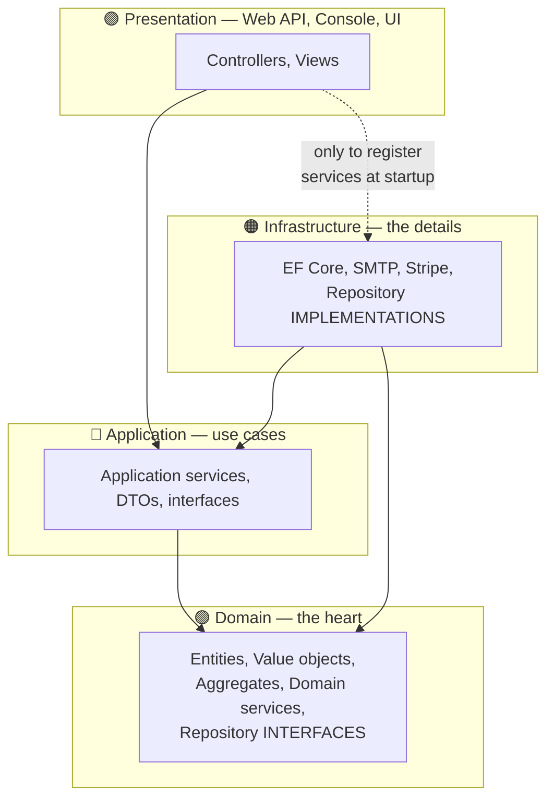

> ### 🎓 **THE DEPENDENCY RULE**
> **Source code dependencies point INWARD only. Nothing in an inner circle knows anything about
> an outer circle.**

What this buys you:

| Benefit | How |
|---|---|
| 🧪 **The Domain is trivially testable** | No database, no mocks, no setup — just `new Order()` |
| 🔄 **Infrastructure is replaceable** | Swap SQL Server for PostgreSQL; Domain never notices |
| 📖 **Business rules are findable** | They're all in one project, in business language |
| 🛡️ **Rules cannot be bypassed** | The Domain project physically cannot call the database |
| ⏳ **Decisions can be deferred** | Build and test the domain before choosing a database |

The compiler enforces it. `MyApp.Domain` has **no project references**, so it *cannot* call
Entity Framework even if someone wants to.

## 41.9 Putting it together

```csharp
// ═══════════════ 🟢 DOMAIN ═══════════════
public readonly record struct Money(decimal Amount, string Currency);

public class Order : Entity
{
    private readonly List<OrderItem> items = new();
    public OrderStatus Status { get; private set; }
    public IReadOnlyList<OrderItem> Items => items;
    public void AddItem(/* ... */) { /* business rules */ }
}

public interface IOrderRepository
{
    Task<Order?> GetByIdAsync(int id, CancellationToken ct = default);
    Task AddAsync(Order order, CancellationToken ct = default);
}

// ═══════════════ 🔵 APPLICATION ═══════════════
public interface IEmailSender
{
    Task SendAsync(string to, string subject, string body, CancellationToken ct = default);
}

public class PlaceOrderService(IOrderRepository orders, IEmailSender email)
{
    public async Task PlaceAsync(PlaceOrderRequest request, CancellationToken ct = default)
    {
        /* orchestration only */
    }
}

// ═══════════════ 🟠 INFRASTRUCTURE ═══════════════
public class SqlOrderRepository(AppDbContext context) : IOrderRepository { /* EF Core */ }
public class SendGridEmailSender(HttpClient http) : IEmailSender { /* HTTP */ }

// ═══════════════ 🟣 PRESENTATION (Program.cs) ═══════════════
// The ONE place that knows about every concrete type:
services.AddScoped<IOrderRepository, SqlOrderRepository>();
services.AddScoped<IEmailSender, SendGridEmailSender>();
services.AddScoped<PlaceOrderService>();
```

> ⚠️ **Is this overkill for a small app?** Often, yes. A 500-line tool does not need four
> projects. But the **habits** — business rules on the entity, interfaces for infrastructure —
> cost nothing at any size and save you enormously when the app grows.

## 41.10 🧪 Hands-on exercise

Model a **hotel booking** domain:

- **Value objects:** `DateRange` (validates end > start), `Money`, `RoomNumber`
- **Entities:** `Room`, `Guest`
- **Aggregate:** `Booking` (root) with `BookingNight` children
- **Invariants:** no overlapping bookings for a room; a booking must be ≥ 1 night; you cannot
  cancel a booking that has already started
- **Domain service:** `AvailabilityService` (spans multiple bookings)
- **Application service:** `MakeBookingService`
- **Interfaces:** `IBookingRepository`, `IRoomRepository`

Write tests for the domain **with no database and no mocking framework**. If that is easy,
your model is right.

---

# 42. 🧪 Unit testing OOP code

**Level: ⭐⭐ Intermediate**

### 🗣️ In plain English

A **unit test** is a small program that checks one behaviour of your code, automatically.

Think of a **factory quality check**. You don't ship 10,000 units and hope. You test one bolt,
one weld, one circuit — automatically, every time.

The real payoff isn't finding bugs today. It is **being able to change code tomorrow without fear**.

## 42.1 Setting up

```bash
dotnet new xunit -n MyApp.Domain.Tests
dotnet sln add MyApp.Domain.Tests
dotnet add MyApp.Domain.Tests reference MyApp.Domain
dotnet test
```

| Framework | Notes |
|---|---|
| **xUnit** | The modern .NET default. Used here. |
| **NUnit** | Mature, feature-rich, very popular |
| **MSTest** | Microsoft's original; fine, less common in new projects |

## 42.2 Your first test — Arrange, Act, Assert

```csharp
public class BankAccountTests
{
    [Fact]
    public void Deposit_IncreasesBalance()
    {
        // 🅰️ ARRANGE — set up the world
        var account = new BankAccount("Anna", 100m);

        // 🅱️ ACT — do the one thing you're testing
        account.Deposit(50m);

        // 🅲 ASSERT — check exactly one outcome
        Assert.Equal(150m, account.Balance);
    }
}
```

### Naming tests so failures explain themselves

```csharp
// Pattern:  MethodName_Scenario_ExpectedResult
[Fact] public void Withdraw_WhenAmountExceedsBalance_Throws() { }
[Fact] public void AddItem_WhenOrderIsSubmitted_Throws() { }
[Fact] public void Total_WithThreeItems_ReturnsSum() { }
```

When CI says *"Withdraw_WhenAmountExceedsBalance_Throws FAILED"*, you already know what broke
before opening a single file.

## 42.3 Testing that something throws

```csharp
[Fact]
public void Withdraw_WhenAmountExceedsBalance_ThrowsInvalidOperationException()
{
    var account = new BankAccount("Anna", 100m);

    var exception = Assert.Throws<InvalidOperationException>(
        () => account.Withdraw(200m));

    Assert.Contains("Insufficient", exception.Message);
}

[Fact]
public async Task PlaceOrderAsync_WhenCustomerNotFound_ThrowsDomainException()
{
    var service = new PlaceOrderService(new EmptyRepository(), new FakeEmailSender());

    await Assert.ThrowsAsync<DomainException>(
        () => service.PlaceAsync(new PlaceOrderRequest(999, [])));
}
```

## 42.4 `[Theory]` — one test, many inputs

```csharp
public class DiscountTests
{
    [Theory]
    [InlineData(100, 0)]        // below threshold → no discount
    [InlineData(1000, 0)]       // exactly at threshold → no discount
    [InlineData(1001, 100.1)]   // just above → 10%
    [InlineData(5000, 500)]
    public void Calculate_ReturnsExpectedDiscount(decimal total, decimal expected)
    {
        var policy = new BulkDiscountPolicy();

        decimal actual = policy.Calculate(total);

        Assert.Equal(expected, actual);
    }

    [Theory]
    [InlineData("")]
    [InlineData("   ")]
    [InlineData("no-at-sign")]
    [InlineData("@nolocal.com")]
    public void Constructor_WithInvalidEmail_Throws(string invalidEmail)
        => Assert.Throws<ArgumentException>(() => new EmailAddress(invalidEmail));
}
```

**🎯 Use `[Theory]` when:** the same logic must hold across many inputs — especially **boundaries**
(0, 1, max, max+1, empty, null).

## 42.5 Test doubles — fakes, stubs, and mocks

| Double | Does | Example |
|---|---|---|
| **Dummy** | Nothing; just fills a parameter | `new NullLogger()` |
| **Stub** | Returns canned data | A repository that always returns the same customer |
| **Fake** | A working, simplified implementation | An in-memory repository |
| **Mock** | Records calls so you can assert on them | "Was `SendAsync` called once?" |
| **Spy** | A real object that also records | Rare |

### Hand-written fakes — clearer than you'd think

```csharp
public class FakeEmailSender : IEmailSender
{
    public List<(string To, string Subject, string Body)> Sent { get; } = new();

    public Task SendAsync(string to, string subject, string body, CancellationToken ct = default)
    {
        Sent.Add((to, subject, body));
        return Task.CompletedTask;
    }
}

public class InMemoryOrderRepository : IOrderRepository
{
    private readonly Dictionary<int, Order> orders = new();
    private int nextId = 1;

    public Task<Order?> GetByIdAsync(int id, CancellationToken ct = default)
        => Task.FromResult(orders.GetValueOrDefault(id));

    public Task AddAsync(Order order, CancellationToken ct = default)
    {
        orders[nextId++] = order;
        return Task.CompletedTask;
    }
}
```

```csharp
[Fact]
public async Task PlaceOrder_SendsConfirmationEmail()
{
    // Arrange
    var emailSender = new FakeEmailSender();
    var repository = new InMemoryOrderRepository();
    var service = new PlaceOrderService(repository, emailSender);

    // Act
    await service.PlaceAsync(new PlaceOrderRequest(1, [new(1, "Book", 2, 10m)]));

    // Assert
    Assert.Single(emailSender.Sent);
    Assert.Equal("Order confirmed", emailSender.Sent[0].Subject);
}
```

### Mocking libraries (Moq, NSubstitute)

```csharp
// With NSubstitute:
var emailSender = Substitute.For<IEmailSender>();
var service = new PlaceOrderService(repository, emailSender);

await service.PlaceAsync(request);

await emailSender.Received(1).SendAsync(
    Arg.Any<string>(), "Order confirmed", Arg.Any<string>(), Arg.Any<CancellationToken>());
```

> 💡 **Fakes vs mocks** — Mocking libraries save typing, but hand-written fakes are easier to read
> and get reused across dozens of tests. Use a fake for anything you'll need more than twice;
> use a mock when you specifically need to assert *"this was called with exactly these arguments"*.

## 42.6 The most important rule: test behaviour, not implementation

❌ **Testing implementation — this test breaks on every refactor:**

```csharp
[Fact]
public void AddItem_CallsInternalValidateMethod()
{
    // Testing HOW it works. Rename a private method and this fails,
    // even though nothing is actually broken.
}
```

✅ **Testing behaviour — this test survives refactoring:**

```csharp
[Fact]
public void AddItem_WithZeroQuantity_Throws()
{
    var order = new Order(customerId: 1);

    Assert.Throws<DomainException>(
        () => order.AddItem(1, "Book", quantity: 0, new Money(10, "USD")));
}
```

> 🎓 **Professor's rule** — Test through the **public API only**. If you feel the urge to make a
> private method public "so it can be tested", that method probably wants to be its **own class**
> with its own public API.

## 42.7 What to test, and what not to

| ✅ Definitely test | 🚫 Don't bother testing |
|---|---|
| Business rules and invariants | Auto-properties with no logic |
| Boundary conditions (0, 1, max, max+1) | Framework code (Microsoft tested it) |
| Error paths and exceptions | Third-party libraries |
| Calculations | Simple pass-through wrappers |
| State transitions | Generated code |
| Bugs you just fixed (a regression test) | Private methods (indirectly, via public ones) |

### The test pyramid

```text
              ▲
             ╱ ╲        🔺 E2E tests — few, slow, brittle, high value
            ╱   ╲          (the whole app through a browser)
           ╱─────╲
          ╱       ╲     🔶 Integration tests — some
         ╱         ╲       (does the repository really talk to the database?)
        ╱───────────╲
       ╱             ╲  🟩 UNIT TESTS — MANY, fast, focused
      ╱_______________╲    (your domain, your rules, no I/O)
```

Aim for the **base** to be big. A thousand unit tests that run in two seconds are worth more than
twenty end-to-end tests that take twenty minutes and fail randomly.

## 42.8 Well-designed code is testable code

This is the great secret: **if something is hard to test, its design is wrong.**

| Test pain | The design problem it reveals |
|---|---|
| Needs a database to test one rule | Missing repository abstraction ([DIP](#375--d--dependency-inversion-principle)) |
| Needs 20 lines of setup | The class has too many responsibilities ([SRP](#371--s--single-responsibility-principle)) |
| You must make a private method public | That logic wants to be its own class |
| The result changes every run | Hidden dependency on `DateTime.Now` or `Random` |
| Tests interfere with each other | Mutable static state ([Chapter 29](#29--static-members-constants-readonly-and-thread-safety)) |
| You must test through the UI | Business logic is in the UI ([Chapter 44](#44--common-oop-mistakes)) |

The classic fix — injecting the clock:

```csharp
// ❌ Untestable: the result depends on when the test runs
public class Order
{
    public bool IsOverdue => DateTime.UtcNow > DueDate.AddDays(30);
}

// ✅ Testable: time is a dependency like any other
public interface IClock { DateTime UtcNow { get; } }
public class SystemClock : IClock { public DateTime UtcNow => DateTime.UtcNow; }
public class FixedClock(DateTime fixedTime) : IClock { public DateTime UtcNow => fixedTime; }

public class Order(IClock clock)
{
    public DateOnly DueDate { get; init; }
    public bool IsOverdue => clock.UtcNow > DueDate.ToDateTime(TimeOnly.MinValue).AddDays(30);
}
```

```csharp
[Fact]
public void IsOverdue_ThirtyOneDaysAfterDueDate_ReturnsTrue()
{
    var clock = new FixedClock(new DateTime(2026, 3, 1));
    var order = new Order(clock) { DueDate = new DateOnly(2026, 1, 15) };

    Assert.True(order.IsOverdue);       // ✅ same result every single run
}
```

## 42.9 Testing principles checklist

- [ ] One logical assertion per test
- [ ] Arrange / Act / Assert, visibly separated
- [ ] Tests are independent — any order, any subset
- [ ] No shared mutable state between tests
- [ ] No real database, network, file system, or clock in a unit test
- [ ] The test name says what broke
- [ ] Tests run in **milliseconds**
- [ ] A failing test tells you *why*, not just *that*

## 42.10 🧪 Hands-on exercise

For the `Order` aggregate from [Chapter 41](#41--domain-modeling-and-architecture), write tests for:

1. Adding an item increases the total
2. Adding the same product twice merges the quantities
3. Adding an item with quantity 0 throws
4. Submitting an empty order throws
5. Adding an item to a submitted order throws
6. Paying an unsubmitted order throws
7. A `[Theory]` covering quantities −1, 0, 1, 99, 100, 101

Then **change the internal implementation** of `Order` (use a `Dictionary` instead of a `List`).
If your tests still pass unchanged, you tested behaviour. If they broke, you tested implementation.

---

# 43. 🔨 Refactoring OOP code

**Level: ⭐⭐ Intermediate**

### 🗣️ In plain English

**Refactoring** means improving the *structure* of code **without changing what it does**.

Like tidying a workshop. Same tools, same jobs — but now you can find the screwdriver.

> ⚠️ **The absolute rule:** refactoring changes structure, **never** behaviour.
> If behaviour changes, that's not refactoring — that's a rewrite, and it needs different care.
> **You must have tests before you refactor.** Without them, you're just editing and hoping.

## 43.1 The refactoring catalogue

| Refactoring | 🚨 The smell that triggers it |
|---|---|
| **Extract Method** | A method longer than a screen; a comment explaining a block |
| **Extract Class** | A class with unrelated groups of fields and methods |
| **Rename** | You had to read the body to understand the name |
| **Move Method** | A method uses another class's data more than its own |
| **Introduce Parameter Object** | The same 3–4 parameters travel together everywhere |
| **Replace Conditional with Polymorphism** | The same `switch`/`if` on type in several places |
| **Replace Inheritance with Composition** | A subclass ignores or throws on inherited members |
| **Encapsulate Collection** | A public `List<T>` property |
| **Introduce Value Object** | A `string`/`decimal` with validation rules attached |
| **Replace Magic Number with Constant** | An unexplained `0.15` in the code |
| **Introduce Guard Clause** | Deeply nested `if` pyramids |
| **Split Loop** | One loop doing three unrelated things |

## 43.2 Extract Method

❌ **Before:**

```csharp
public void ProcessOrder(Order order)
{
    // validate
    if (order is null) throw new ArgumentNullException(nameof(order));
    if (order.Items.Count == 0) throw new DomainException("Empty order.");
    if (order.Items.Any(i => i.Quantity <= 0)) throw new DomainException("Bad quantity.");

    // calculate
    decimal subtotal = 0;
    foreach (var item in order.Items) subtotal += item.UnitPrice * item.Quantity;
    decimal discount = subtotal > 1000 ? subtotal * 0.1m : 0;
    decimal tax = (subtotal - discount) * 0.15m;
    decimal total = subtotal - discount + tax;

    // save
    database.Execute("INSERT INTO Orders ...", total);

    // notify
    smtp.Send(order.CustomerEmail, "Confirmed", $"Total: {total}");
}
```

✅ **After — each step is named and testable:**

```csharp
public void ProcessOrder(Order order)
{
    Validate(order);
    decimal total = CalculateTotal(order);
    Save(order, total);
    NotifyCustomer(order, total);
}

private static void Validate(Order order)
{
    ArgumentNullException.ThrowIfNull(order);

    if (order.Items.Count == 0)
        throw new DomainException("An order must contain at least one item.");

    if (order.Items.Any(i => i.Quantity <= 0))
        throw new DomainException("All quantities must be positive.");
}

private static decimal CalculateTotal(Order order)
{
    decimal subtotal = order.Items.Sum(i => i.UnitPrice * i.Quantity);
    decimal discount = CalculateDiscount(subtotal);
    decimal tax = (subtotal - discount) * TaxRate;
    return subtotal - discount + tax;
}
```

> 💡 **Tip** — Every comment saying *"// validate"* or *"// calculate"* is a method waiting to be
> extracted. The comment becomes the method name and then the comment can be deleted.

## 43.3 Introduce Value Object (fixing primitive obsession)

❌ **Before:**

```csharp
public class Customer
{
    public string Email { get; set; } = "";
}
```

Now every place that touches `Email` must validate it. Some will forget. Some will validate
differently. Bad data gets in.

✅ **After:**

```csharp
public readonly record struct EmailAddress
{
    public string Value { get; }

    public EmailAddress(string value)
    {
        if (string.IsNullOrWhiteSpace(value))
            throw new ArgumentException("Email address is required.");

        string trimmed = value.Trim().ToLowerInvariant();

        int at = trimmed.IndexOf('@');
        if (at <= 0 || at == trimmed.Length - 1 || trimmed.LastIndexOf('.') < at)
            throw new ArgumentException($"'{value}' is not a valid email address.");

        Value = trimmed;
    }

    public string Domain => Value[(Value.IndexOf('@') + 1)..];
    public override string ToString() => Value;
}

public class Customer
{
    public EmailAddress Email { get; private set; }
    public Customer(EmailAddress email) => Email = email;
}
```

**What you gained:** validation in one place, normalisation for free, value equality, a `Domain`
property, and a compiler that will not let you pass a phone number where an email is expected.

## 43.4 Replace Conditional with Polymorphism

❌ **Before:**

```csharp
public decimal CalculateShipping(string method, decimal weight) => method switch
{
    "standard"  => 5 + weight * 0.5m,
    "express"   => 15 + weight * 1.2m,
    "overnight" => 30 + weight * 2m,
    _ => throw new ArgumentException("Unknown method")
};
```

✅ **After:**

```csharp
public interface IShippingMethod
{
    string Code { get; }
    decimal CalculateCost(decimal weightKg);
}

public class StandardShipping : IShippingMethod
{
    public string Code => "standard";
    public decimal CalculateCost(decimal weightKg) => 5 + weightKg * 0.5m;
}

public class ExpressShipping : IShippingMethod
{
    public string Code => "express";
    public decimal CalculateCost(decimal weightKg) => 15 + weightKg * 1.2m;
}

public class OvernightShipping : IShippingMethod
{
    public string Code => "overnight";
    public decimal CalculateCost(decimal weightKg) => 30 + weightKg * 2m;
}

public class ShippingMethodRegistry(IEnumerable<IShippingMethod> methods)
{
    private readonly Dictionary<string, IShippingMethod> byCode =
        methods.ToDictionary(m => m.Code);

    public IShippingMethod Get(string code)
        => byCode.TryGetValue(code, out var method)
            ? method
            : throw new ArgumentException($"Unknown shipping method: {code}");
}
```

🔗 See [Chapter 16.4](#164-replace-ifswitch-with-polymorphism) for when this is *not* worth it.

## 43.5 Introduce Parameter Object

❌ **Before — these four always travel together:**

```csharp
public void CreateBooking(
    int roomId, DateOnly checkIn, DateOnly checkOut, int guests,
    string guestName, string guestEmail, string guestPhone) { }
```

✅ **After:**

```csharp
public record BookingPeriod
{
    public DateOnly CheckIn { get; }
    public DateOnly CheckOut { get; }

    public BookingPeriod(DateOnly checkIn, DateOnly checkOut)
    {
        if (checkOut <= checkIn)
            throw new ArgumentException("Check-out must be after check-in.");

        CheckIn = checkIn;
        CheckOut = checkOut;
    }

    public int Nights => CheckOut.DayNumber - CheckIn.DayNumber;
}

public record GuestDetails(string Name, EmailAddress Email, PhoneNumber Phone);

public void CreateBooking(int roomId, BookingPeriod period, int guests, GuestDetails guest) { }
```

The validation now lives with the data, and the parameter list is readable.

## 43.6 Introduce Guard Clauses (flatten the pyramid)

❌ **Before:**

```csharp
public void Process(Order order)
{
    if (order is not null)
    {
        if (order.Items.Count > 0)
        {
            if (order.Status == OrderStatus.Draft)
            {
                if (order.Customer.IsActive)
                {
                    // ...the actual work, 4 levels deep
                }
            }
        }
    }
}
```

✅ **After:**

```csharp
public void Process(Order order)
{
    ArgumentNullException.ThrowIfNull(order);

    if (order.Items.Count == 0)
        throw new DomainException("Order has no items.");

    if (order.Status != OrderStatus.Draft)
        throw new DomainException($"Order is {order.Status}, not Draft.");

    if (!order.Customer.IsActive)
        throw new DomainException("Customer account is inactive.");

    // ...the actual work, at indentation level 1, with every precondition already proven
}
```

## 43.7 The safe refactoring workflow

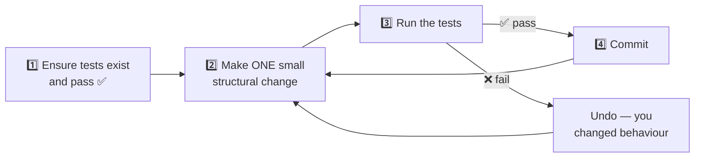

| ✅ Do | ❌ Don't |
|---|---|
| Refactor in tiny steps | Rewrite a whole class at once |
| Run tests after every step | Refactor for a day, then run tests |
| Commit after every green run | Mix refactoring with feature work |
| Use your IDE's automated refactorings | Rename by find-and-replace |
| Refactor **before** adding a feature, to make room | Refactor "while you're in there" without tests |

> 🎓 **Professor's rule** — *"Make the change easy, then make the easy change."* — Kent Beck.
> When a feature is hard to add, refactor first so it becomes easy, then add it.

## 43.8 🧪 Hands-on exercise

Refactor this class step by step. After **each** step, list which refactoring you applied:

```csharp
public class ReportService
{
    public string Generate(string type, DateTime start, DateTime end, bool includeCharts,
                           bool sendEmail, string email, string format)
    {
        if (type == "sales")
        {
            var data = new SqlConnection("...").Query("SELECT * FROM Sales WHERE ...");
            string result = "";
            foreach (var row in data) result += row.ToString() + "\n";
            if (includeCharts) result += "[chart]";
            if (format == "pdf") result = "%PDF" + result;
            if (sendEmail) new SmtpClient().Send("noreply@x.com", email, "Report", result);
            return result;
        }
        else if (type == "stock") { /* the same 8 lines again */ }
        return "";
    }
}
```

---

# 44. 🚨 Common OOP mistakes

**Level: ⭐⭐ Intermediate**

Every one of these is something you will see in real code — and probably write once yourself.
Learn to spot them.

## 44.1 🏢 The God class

**Symptom:** one class does everything.

```csharp
// ❌ 2,400 lines. 47 methods. 19 dependencies.
public class OrderManager
{
    public void CreateOrder() { }
    public void ValidateOrder() { }
    public void CalculatePricing() { }
    public void ApplyDiscounts() { }
    public void CalculateTax() { }
    public void ProcessPayment() { }
    public void UpdateInventory() { }
    public void GenerateInvoicePdf() { }
    public void SendConfirmationEmail() { }
    public void SendSms() { }
    public void LogToDatabase() { }
    public void ExportToCsv() { }
    public void SyncToWarehouse() { }
    // ...34 more
}
```

| 🚩 How to spot it | 🔧 The fix |
|---|---|
| More than ~300 lines | Extract Class along responsibility lines |
| More than ~5 constructor dependencies | Each group of dependencies is a separate class |
| Merge conflicts on it constantly | Split it — several people need different parts |
| You scroll to find anything | [SRP](#371--s--single-responsibility-principle) |

## 44.2 🩸 The anemic domain model

**Symptom:** classes hold data but no behaviour; all the logic lives in "services".

❌ **Anemic — the `Order` is a glorified struct:**

```csharp
public class Order
{
    public List<OrderItem> Items { get; set; } = new();
    public string Status { get; set; } = "";
    public decimal Total { get; set; }
}

public class OrderService
{
    public void AddItem(Order order, OrderItem item)
    {
        if (order.Status == "Completed") throw new Exception("Cannot modify.");
        order.Items.Add(item);
        order.Total = order.Items.Sum(i => i.Price * i.Quantity);   // must remember!
    }
}
```

The problems: nothing stops `order.Items.Add(...)` directly. Nothing stops `order.Total = -5`.
The rule "completed orders are frozen" lives outside the object, so every new service must
remember it.

✅ **Rich — the object owns its rules:**

```csharp
public class Order
{
    private readonly List<OrderItem> items = new();

    public IReadOnlyList<OrderItem> Items => items;
    public OrderStatus Status { get; private set; } = OrderStatus.Draft;
    public decimal Total => items.Sum(i => i.LineTotal);      // always correct

    public void AddItem(OrderItem item)
    {
        ArgumentNullException.ThrowIfNull(item);

        if (Status != OrderStatus.Draft)
            throw new DomainException($"Cannot modify an order that is {Status}.");

        items.Add(item);
    }

    public void Complete()
    {
        if (items.Count == 0)
            throw new DomainException("Cannot complete an empty order.");

        Status = OrderStatus.Completed;
    }
}
```

> 🎓 **Professor's rule** — **Behaviour belongs with the data it operates on.** If your classes
> are all properties and your services are all logic, you have written procedural code with
> `class` keywords sprinkled on it.

## 44.3 🌲 Too much inheritance

```text
❌ BaseEntity → Person → Employee → Manager → RegionalManager → SeniorRegionalManager
```

Six levels means: to understand `SeniorRegionalManager`, you must read six files. Change anything
at the top and five layers may break in ways no test catches.

| 🔧 The fix |
|---|
| Keep hierarchies **2, at most 3** levels deep |
| Replace "reuse" inheritance with [composition](#19--composition-and-object-relationships) |
| Use interfaces for capabilities, base classes only for genuine identity |

## 44.4 🔓 Public mutable state

```csharp
// ❌ Every one of these is a hole in your design
public class Order
{
    public decimal Total;                              // public field
    public List<OrderItem> Items { get; set; } = new();// public mutable collection
    public string Status { get; set; } = "";           // anyone can write anything
}
```

```csharp
// ✅
public class Order
{
    private readonly List<OrderItem> items = new();
    public IReadOnlyList<OrderItem> Items => items;
    public OrderStatus Status { get; private set; }
    public decimal Total => items.Sum(i => i.LineTotal);
}
```

## 44.5 🔤 Primitive obsession

```csharp
// ❌ Everything is a string or a decimal
public class Customer
{
    public string Email { get; set; } = "";
    public string Phone { get; set; } = "";
    public string Country { get; set; } = "";
    public decimal CreditLimit { get; set; }
}

public void Transfer(string fromAccount, string toAccount, decimal amount, string currency) { }
Transfer(toAccount, fromAccount, amount, currency);   // 😱 arguments swapped. Compiles fine.
```

```csharp
// ✅ Types that carry their own rules and cannot be confused
public class Customer
{
    public EmailAddress Email { get; }
    public PhoneNumber Phone { get; }
    public CountryCode Country { get; }
    public Money CreditLimit { get; }
}

public void Transfer(AccountNumber from, AccountNumber to, Money amount) { }
```

🔗 [Chapter 41.3](#413--value-objects--the-values-are-the-identity).

## 44.6 🔗 Tight coupling

```csharp
// ❌ Cannot be tested, cannot be changed
public class OrderService
{
    private readonly SmtpEmailSender sender = new SmtpEmailSender();
    private readonly SqlConnection connection = new SqlConnection("Server=prod;...");
}

// ✅ Testable, swappable, honest
public class OrderService(IEmailSender sender, IOrderRepository repository) { }
```

## 44.7 🎪 Over-abstraction

The opposite mistake, and just as real:

```csharp
// ❌ Six files, one behaviour, one implementation each. Nobody can follow it.
public interface IUserNameFormatterFactory { IUserNameFormatter Create(); }
public interface IUserNameFormatter { string Format(IUserName name); }
public interface IUserName { string GetValue(); }
public class DefaultUserNameFormatterFactory : IUserNameFormatterFactory { }
public class DefaultUserNameFormatter : IUserNameFormatter { }
public class UserName : IUserName { }
```

```csharp
// ✅ What was actually needed
public string FormatUserName(string first, string last) => $"{last}, {first}";
```

**Create an interface when you can name a reason:**

| ✅ Create an interface when | 🚫 Don't when |
|---|---|
| There are (or will genuinely be) 2+ implementations | There's exactly one, forever |
| You need a fake for tests | The class has no dependencies to fake |
| It's a boundary between layers | It's an internal helper |
| It's a plugin/extension point | You're following a rule you read once |

> 🎓 **Professor's rule** — An interface with exactly one implementation, that will never have
> another, and that you never fake in a test, is **pure overhead**. Delete it.

## 44.8 🖥️ Business logic in the UI

```csharp
// ❌ In a button click handler
private void CheckoutButton_Click(object sender, EventArgs e)
{
    decimal total = 0;
    foreach (var item in cartGrid.Rows) total += item.Price * item.Quantity;
    if (customerTypeCombo.Text == "Premium") total *= 0.9m;
    if (total > 1000) total -= 50;
    totalLabel.Text = total.ToString("C");
}
```

Now those pricing rules exist **only** in the desktop app. Build a mobile app or an API, and
you rewrite them — slightly differently. Two truths, one of them wrong.

```csharp
// ✅ The UI does UI. The domain does rules.
private void CheckoutButton_Click(object sender, EventArgs e)
{
    Money total = checkoutService.CalculateTotal(cart, customer);
    totalLabel.Text = total.ToString();
}
```

## 44.9 🗄️ Business logic only in the database

Stored procedures containing all your rules have the mirror-image problem: they cannot be unit
tested, cannot be versioned properly with the application, and cannot be reused by anything that
isn't a database client.

Keep rules **in the domain**. Use the database for storage and for the things it's genuinely
better at (set-based reporting, constraints as a safety net).

## 44.10 🚫 Ignoring nullability

```csharp
// ❌ Warnings suppressed, `!` everywhere
#pragma warning disable CS8618
public class Customer
{
    public string Name { get; set; }
    public Address Address { get; set; }
}
```

Turn `<Nullable>enable</Nullable>` on, and **fix the warnings** rather than silencing them. Each
one is a `NullReferenceException` you're being handed for free, at compile time.

## 44.11 The code-smell reference table

| 🚩 Smell | 🔧 Fix | Chapter |
|---|---|---|
| God class | Extract Class, SRP | [37](#37--solid-principles), [43](#43--refactoring-oop-code) |
| Anemic model | Move behaviour onto the entity | [41](#41--domain-modeling-and-architecture) |
| Long method | Extract Method | [43](#43--refactoring-oop-code) |
| Long parameter list | Introduce Parameter Object | [43](#43--refactoring-oop-code) |
| Deep inheritance | Composition | [19](#19--composition-and-object-relationships) |
| `switch` on type, repeated | Polymorphism | [16](#16--polymorphism) |
| Public `List<T>` | Encapsulate Collection | [13](#13--encapsulation) |
| Primitive obsession | Value objects | [41](#41--domain-modeling-and-architecture) |
| `new` inside business logic | Dependency injection | [39](#39--dependency-injection) |
| `NotSupportedException` in an override | Fix the hierarchy (LSP) | [37](#37--solid-principles) |
| Interfaces with one implementation | Delete them | [44.7](#447--over-abstraction) |
| Static mutable state | Inject it instead | [29](#29--static-members-constants-readonly-and-thread-safety) |
| Hard to test | Look for the design problem behind it | [42](#42--unit-testing-oop-code) |

## 44.12 🧪 Hands-on exercise

Find a project you wrote more than three months ago. Go through this chapter's list and honestly
mark every smell you find. Pick the **worst one**, write a test that captures its current
behaviour, then refactor it.

That exercise teaches more than any tutorial.

---
<div align="center">

# 🟡 PART 5 — PRACTICE AND REFERENCE

*Reading teaches you words. Building teaches you the language.*

</div>

---

# 45. 🛠️ Hands-on projects

**Level: ⭐ → ⭐⭐⭐**

### Why projects, and not more reading

You do not learn OOP by understanding it. You learn it by **making design decisions and living
with the consequences**. Every project below is chosen because it forces a specific decision.

## 45.1 🟢 Beginner projects

| # | Project | Forces you to learn |
|---|---|---|
| 1 | **Student Management System** | Classes, properties, collections, validation |
| 2 | **Bank Account System** | Encapsulation, invariants, custom exceptions |
| 3 | **Product Inventory** | Collections, LINQ, computed properties |
| 4 | **Employee Salary Calculator** | Inheritance, abstract classes, polymorphism |
| 5 | **Shape Area Calculator** | Abstract classes, method overriding |
| 6 | **Notification Sender** | Interfaces, dependency injection |
| 7 | **Traffic Light Controller** | Enums, state transitions, guard clauses |
| 8 | **Temperature Converter** | Value objects, structs, operator overloading |

### Worked brief — Bank Account System

> **Requirements**
> - `Account` types: `Savings` (earns interest, min balance 100) and `Checking` (overdraft to −500)
> - Deposit, withdraw, transfer between accounts
> - A transaction history that callers can read but not modify
> - Every rule enforced **inside** the objects
>
> **You must be able to prove:** no line of code outside `Account` can produce an invalid balance.
>
> **Concepts exercised:** encapsulation, abstract classes, invariants, custom exceptions,
> `IReadOnlyList<T>`, value objects (`Money`).

## 45.2 🟡 Intermediate projects

| # | Project | Forces you to learn |
|---|---|---|
| 1 | **Library Management System** | Aggregates, generics, repository — see the [capstone](#46--capstone-library-management-system) |
| 2 | **Hotel Booking System** | Value objects (`DateRange`), overlap rules, domain services |
| 3 | **Restaurant Ordering** | Composition, state machine, Strategy for pricing |
| 4 | **Hospital Appointments** | Scheduling invariants, conflicts, aggregates |
| 5 | **Vehicle Rental** | Availability rules, late fees, polymorphic pricing |
| 6 | **Course Enrollment** | Many-to-many with a join entity, prerequisites |
| 7 | **Support Ticket System** | State pattern, Chain of Responsibility for escalation |
| 8 | **Expense Approval Workflow** | Chain of Responsibility, Specification |

## 45.3 🔴 Advanced projects

| # | Project | Forces you to learn |
|---|---|---|
| 1 | **E-Commerce Cart & Checkout** | Aggregates, Strategy, Decorator, DI, async |
| 2 | **Payroll System** | Complex polymorphic calculation, Template Method |
| 3 | **Learning Management System** | Layered architecture, many aggregates |
| 4 | **Banking System** | Transactions, Unit of Work, audit trail, concurrency |
| 5 | **Event Booking Platform** | Seat reservation concurrency, expiry, async |
| 6 | **Inventory + Warehouse Sync** | Integration boundaries, Adapter, retries |
| 7 | **Plugin-based Report Engine** | Reflection, plugin discovery, Open/Closed |
| 8 | **Mini ORM** | Reflection, attributes, generics, expression trees |

## 45.4 The checklist every project should satisfy

Whatever you build, before you call it done:

**Design**
- [ ] Every class can be described in one sentence without "and"
- [ ] All fields are private
- [ ] Collections are exposed as `IReadOnlyList<T>`
- [ ] At least one value object replaces a primitive
- [ ] Business rules live on entities, not in services
- [ ] Composition used at least once where inheritance was tempting
- [ ] Interfaces exist only where you can name a reason

**C# craft**
- [ ] `<Nullable>enable</Nullable>` and zero warnings
- [ ] Custom exceptions for domain rules
- [ ] Enums instead of magic strings
- [ ] `ToString()` overridden on printable types
- [ ] Async used for any I/O
- [ ] Records for DTOs and value objects

**Quality**
- [ ] Unit tests for every business rule
- [ ] Tests run with no database and no network
- [ ] At least one design pattern, with a written justification
- [ ] One deliberate refactoring, done with tests green

## 45.5 How to run a project properly

```text
DAY 1  ── Write the RULES in plain English. No code. Just sentences like
          "An order cannot be shipped before it is paid."

DAY 2  ── Model the domain. Entities, value objects, aggregates. Still no database.

DAY 3  ── Write TESTS for the rules. Watch them fail.

DAY 4  ── Implement until the tests pass.

DAY 5  ── Add the boring outside: console UI, in-memory repositories.

DAY 6  ── Refactor. Apply one pattern where it removes real pain.

DAY 7  ── Write a README explaining your design decisions — and the ones you rejected.
```

That last step is the one people skip, and it's the one that turns knowledge into understanding.

---

# 46. 🏆 Capstone: Library Management System

**Level: ⭐⭐⭐ Advanced**

This capstone deliberately combines **everything**: encapsulation, abstraction, inheritance,
polymorphism, generics, value objects, aggregates, domain exceptions, dependency injection,
and unit tests.

## 46.1 Requirements

> **Build a console application that manages a library.**
>
> **Books**
> - A book has an ISBN, title, author, and availability
> - A book cannot be borrowed if it is already out
>
> **Members**
> - Two kinds: `RegularMember` (3 books) and `PremiumMember` (10 books)
> - A member cannot exceed their borrow limit
> - A member cannot return a book they did not borrow
>
> **Borrowing**
> - Borrowing marks the book unavailable and records a due date
> - Returning marks it available and calculates any late fee
> - Late fee rate depends on membership type
>
> **Search**
> - Find books by title or author, case-insensitive
>
> **Technical**
> - Generic repository
> - Domain exceptions
> - Value objects for ISBN and Money
> - Unit tests with no database

## 46.2 Create the solution

```bash
dotnet new sln -n LibraryManagement

dotnet new classlib -n LibraryManagement.Domain
dotnet new console  -n LibraryManagement.ConsoleApp
dotnet new xunit    -n LibraryManagement.Tests

dotnet sln add LibraryManagement.Domain
dotnet sln add LibraryManagement.ConsoleApp
dotnet sln add LibraryManagement.Tests

dotnet add LibraryManagement.ConsoleApp reference LibraryManagement.Domain
dotnet add LibraryManagement.Tests      reference LibraryManagement.Domain
```

## 46.3 Domain foundations

```csharp
// LibraryManagement.Domain/Common/DomainException.cs
namespace LibraryManagement.Domain;

/// <summary>Raised when a library business rule is violated.</summary>
public class DomainException : Exception
{
    public DomainException(string message) : base(message) { }
    public DomainException(string message, Exception inner) : base(message, inner) { }
}
```

```csharp
// LibraryManagement.Domain/Common/Entity.cs
namespace LibraryManagement.Domain;

public abstract class Entity
{
    public int Id { get; protected set; }

    public override bool Equals(object? obj)
        => obj is Entity other && GetType() == other.GetType() && Id != 0 && Id == other.Id;

    public override int GetHashCode() => HashCode.Combine(GetType(), Id);
}
```

## 46.4 Value objects

```csharp
// LibraryManagement.Domain/Common/Money.cs
namespace LibraryManagement.Domain;

public readonly record struct Money(decimal Amount, string Currency = "USD")
{
    public static Money Zero => new(0);

    public static Money operator +(Money left, Money right)
        => left.Currency == right.Currency
            ? new Money(left.Amount + right.Amount, left.Currency)
            : throw new DomainException($"Cannot add {right.Currency} to {left.Currency}.");

    public static Money operator *(Money money, int factor)
        => new(money.Amount * factor, money.Currency);

    public override string ToString() => $"{Amount:N2} {Currency}";
}
```

```csharp
// LibraryManagement.Domain/Books/Isbn.cs
namespace LibraryManagement.Domain;

public readonly record struct Isbn
{
    public string Value { get; }

    public Isbn(string value)
    {
        if (string.IsNullOrWhiteSpace(value))
            throw new DomainException("ISBN is required.");

        string normalized = value.Replace("-", "").Replace(" ", "").ToUpperInvariant();

        if (normalized.Length is not (10 or 13))
            throw new DomainException($"'{value}' is not a valid ISBN (must be 10 or 13 digits).");

        Value = normalized;
    }

    public override string ToString() => Value;
}
```

## 46.5 The `Book` entity

```csharp
// LibraryManagement.Domain/Books/Book.cs
namespace LibraryManagement.Domain;

public class Book : Entity
{
    public Isbn Isbn { get; }
    public string Title { get; }
    public string Author { get; }
    public bool IsAvailable { get; private set; } = true;
    public DateOnly? DueDate { get; private set; }

    public Book(int id, Isbn isbn, string title, string author)
    {
        if (string.IsNullOrWhiteSpace(title))
            throw new DomainException("Book title is required.");

        if (string.IsNullOrWhiteSpace(author))
            throw new DomainException("Book author is required.");

        Id = id;
        Isbn = isbn;
        Title = title.Trim();
        Author = author.Trim();
    }

    // 👇 internal: only the Member aggregate may drive these transitions.
    internal void Borrow(DateOnly dueDate)
    {
        if (!IsAvailable)
            throw new DomainException($"'{Title}' is already borrowed.");

        IsAvailable = false;
        DueDate = dueDate;
    }

    internal int Return(DateOnly returnedOn)
    {
        if (IsAvailable)
            throw new DomainException($"'{Title}' is not currently borrowed.");

        int daysLate = DueDate is not null && returnedOn > DueDate.Value
            ? returnedOn.DayNumber - DueDate.Value.DayNumber
            : 0;

        IsAvailable = true;
        DueDate = null;

        return daysLate;
    }

    public bool Matches(string searchText)
        => Title.Contains(searchText, StringComparison.OrdinalIgnoreCase)
           || Author.Contains(searchText, StringComparison.OrdinalIgnoreCase)
           || Isbn.Value.Contains(searchText, StringComparison.OrdinalIgnoreCase);

    public override string ToString()
        => $"[{Id}] {Title} by {Author} — " +
           $"{(IsAvailable ? "✅ Available" : $"❌ Due {DueDate:yyyy-MM-dd}")}";
}
```

## 46.6 The `Member` abstraction — the aggregate root

```csharp
// LibraryManagement.Domain/Members/Member.cs
namespace LibraryManagement.Domain;

public abstract class Member : Entity
{
    private readonly List<Book> borrowedBooks = new();

    public string Name { get; }
    public IReadOnlyList<Book> BorrowedBooks => borrowedBooks;
    public Money OutstandingFees { get; private set; } = Money.Zero;

    protected Member(int id, string name)
    {
        if (string.IsNullOrWhiteSpace(name))
            throw new DomainException("Member name is required.");

        Id = id;
        Name = name.Trim();
    }

    // 🕳️ Each membership type answers these differently.
    public abstract int BorrowLimit { get; }
    public abstract int LoanDays { get; }
    public abstract Money DailyLateFee { get; }
    public abstract string Tier { get; }

    public void BorrowBook(Book book, DateOnly today)
    {
        ArgumentNullException.ThrowIfNull(book);

        if (borrowedBooks.Count >= BorrowLimit)
            throw new DomainException(
                $"{Name} has reached the {Tier} borrow limit of {BorrowLimit} books.");

        if (OutstandingFees.Amount > 10m)
            throw new DomainException(
                $"{Name} has outstanding fees of {OutstandingFees} and cannot borrow.");

        book.Borrow(today.AddDays(LoanDays));      // the Book validates its own state
        borrowedBooks.Add(book);
    }

    public Money ReturnBook(Book book, DateOnly today)
    {
        ArgumentNullException.ThrowIfNull(book);

        if (!borrowedBooks.Contains(book))
            throw new DomainException($"{Name} did not borrow '{book.Title}'.");

        int daysLate = book.Return(today);
        borrowedBooks.Remove(book);

        Money fee = DailyLateFee * daysLate;
        OutstandingFees += fee;

        return fee;
    }

    public void PayFees(Money amount)
    {
        if (amount.Amount <= 0)
            throw new DomainException("Payment must be positive.");

        if (amount.Amount > OutstandingFees.Amount)
            throw new DomainException($"Payment exceeds outstanding fees of {OutstandingFees}.");

        OutstandingFees += new Money(-amount.Amount);
    }

    public override string ToString()
        => $"[{Id}] {Name} ({Tier}) — {borrowedBooks.Count}/{BorrowLimit} books, " +
           $"fees {OutstandingFees}";
}
```

## 46.7 Membership types — polymorphism in action

```csharp
// LibraryManagement.Domain/Members/RegularMember.cs
namespace LibraryManagement.Domain;

public class RegularMember : Member
{
    public RegularMember(int id, string name) : base(id, name) { }

    public override int BorrowLimit => 3;
    public override int LoanDays => 14;
    public override Money DailyLateFee => new(0.50m);
    public override string Tier => "Regular";
}
```

```csharp
// LibraryManagement.Domain/Members/PremiumMember.cs
namespace LibraryManagement.Domain;

public class PremiumMember : Member
{
    public PremiumMember(int id, string name) : base(id, name) { }

    public override int BorrowLimit => 10;
    public override int LoanDays => 30;
    public override Money DailyLateFee => new(0.20m);
    public override string Tier => "Premium";
}
```

Adding a `StudentMember` tomorrow requires **zero** changes to `Member`, `Book`, or the service.

## 46.8 The generic repository

```csharp
// LibraryManagement.Domain/Common/IRepository.cs
namespace LibraryManagement.Domain;

public interface IRepository<T> where T : Entity
{
    void Add(T entity);
    T? GetById(int id);
    IReadOnlyList<T> GetAll();
    bool Remove(int id);
}
```

```csharp
// LibraryManagement.Domain/Common/InMemoryRepository.cs
namespace LibraryManagement.Domain;

public class InMemoryRepository<T> : IRepository<T> where T : Entity
{
    private readonly Dictionary<int, T> items = new();

    public void Add(T entity)
    {
        ArgumentNullException.ThrowIfNull(entity);

        if (!items.TryAdd(entity.Id, entity))
            throw new DomainException($"An item with id {entity.Id} already exists.");
    }

    public T? GetById(int id) => items.GetValueOrDefault(id);

    public IReadOnlyList<T> GetAll() => items.Values.ToList();

    public bool Remove(int id) => items.Remove(id);
}
```

## 46.9 The library service

```csharp
// LibraryManagement.Domain/LibraryService.cs
namespace LibraryManagement.Domain;

public interface IClock
{
    DateOnly Today { get; }
}

public class SystemClock : IClock
{
    public DateOnly Today => DateOnly.FromDateTime(DateTime.Today);
}

public class LibraryService(
    IRepository<Book> bookRepository,
    IRepository<Member> memberRepository,
    IClock clock)
{
    public void AddBook(Book book) => bookRepository.Add(book);
    public void AddMember(Member member) => memberRepository.Add(member);

    public void BorrowBook(int memberId, int bookId)
    {
        Member member = GetMember(memberId);
        Book book = GetBook(bookId);

        member.BorrowBook(book, clock.Today);       // all rules live in the domain
    }

    public Money ReturnBook(int memberId, int bookId)
    {
        Member member = GetMember(memberId);
        Book book = GetBook(bookId);

        return member.ReturnBook(book, clock.Today);
    }

    public IReadOnlyList<Book> SearchBooks(string searchText)
        => string.IsNullOrWhiteSpace(searchText)
            ? bookRepository.GetAll()
            : bookRepository.GetAll().Where(b => b.Matches(searchText)).ToList();

    public IReadOnlyList<Book> GetAvailableBooks()
        => bookRepository.GetAll().Where(b => b.IsAvailable).ToList();

    public IReadOnlyList<Member> GetMembersWithOverdueBooks()
        => memberRepository.GetAll()
            .Where(m => m.BorrowedBooks.Any(b => b.DueDate < clock.Today))
            .ToList();

    private Member GetMember(int id) => memberRepository.GetById(id)
        ?? throw new DomainException($"Member {id} not found.");

    private Book GetBook(int id) => bookRepository.GetById(id)
        ?? throw new DomainException($"Book {id} not found.");
}
```

## 46.10 The console app

```csharp
// LibraryManagement.ConsoleApp/Program.cs
using LibraryManagement.Domain;

IRepository<Book> books = new InMemoryRepository<Book>();
IRepository<Member> members = new InMemoryRepository<Member>();
IClock clock = new SystemClock();

var library = new LibraryService(books, members, clock);

// Seed
library.AddBook(new Book(1, new Isbn("9780132350884"), "Clean Code", "Robert C. Martin"));
library.AddBook(new Book(2, new Isbn("9781617294532"), "C# in Depth", "Jon Skeet"));
library.AddBook(new Book(3, new Isbn("9780201616224"), "The Pragmatic Programmer", "Andrew Hunt"));
library.AddBook(new Book(4, new Isbn("9780134757599"), "Refactoring", "Martin Fowler"));

library.AddMember(new RegularMember(1, "Gehan"));
library.AddMember(new PremiumMember(2, "Anna"));

Console.WriteLine("📚 LIBRARY MANAGEMENT SYSTEM\n");

// Borrow
library.BorrowBook(memberId: 1, bookId: 1);
library.BorrowBook(memberId: 2, bookId: 2);

Console.WriteLine("── All books ──");
foreach (Book book in library.SearchBooks(""))
    Console.WriteLine("  " + book);

Console.WriteLine("\n── Search: 'code' ──");
foreach (Book book in library.SearchBooks("code"))
    Console.WriteLine("  " + book);

Console.WriteLine("\n── Members ──");
foreach (Member member in members.GetAll())
    Console.WriteLine("  " + member);

// Try to break a rule
Console.WriteLine("\n── Trying to borrow an already-borrowed book ──");
try
{
    library.BorrowBook(memberId: 2, bookId: 1);
}
catch (DomainException ex)
{
    Console.WriteLine($"  ❌ {ex.Message}");
}

// Try to exceed a limit
Console.WriteLine("\n── Trying to exceed the Regular borrow limit ──");
try
{
    library.BorrowBook(1, 3);
    library.BorrowBook(1, 4);
    library.AddBook(new Book(5, new Isbn("9780321125217"), "DDD", "Eric Evans"));
    library.BorrowBook(1, 5);      // 4th book for a Regular member
}
catch (DomainException ex)
{
    Console.WriteLine($"  ❌ {ex.Message}");
}
```

**Expected output:**

```text
📚 LIBRARY MANAGEMENT SYSTEM

── All books ──
  [1] Clean Code by Robert C. Martin — ❌ Due 2026-09-21
  [2] C# in Depth by Jon Skeet — ❌ Due 2026-10-07
  [3] The Pragmatic Programmer by Andrew Hunt — ✅ Available
  [4] Refactoring by Martin Fowler — ✅ Available

── Search: 'code' ──
  [1] Clean Code by Robert C. Martin — ❌ Due 2026-09-21

── Members ──
  [1] Gehan (Regular) — 1/3 books, fees 0.00 USD
  [2] Anna (Premium) — 1/10 books, fees 0.00 USD

── Trying to borrow an already-borrowed book ──
  ❌ 'Clean Code' is already borrowed.

── Trying to exceed the Regular borrow limit ──
  ❌ Gehan has reached the Regular borrow limit of 3 books.
```

## 46.11 Unit tests

```csharp
// LibraryManagement.Tests/LibraryTests.cs
using LibraryManagement.Domain;
using Xunit;

public class FixedClock(DateOnly today) : IClock
{
    public DateOnly Today { get; } = today;
}

public class BookTests
{
    private static Book NewBook(int id = 1)
        => new(id, new Isbn("9780132350884"), "Clean Code", "Robert C. Martin");

    [Fact]
    public void Constructor_WithBlankTitle_ThrowsDomainException()
        => Assert.Throws<DomainException>(
            () => new Book(1, new Isbn("9780132350884"), "", "Author"));

    [Theory]
    [InlineData("")]
    [InlineData("123")]
    [InlineData("12345678901234")]
    public void Isbn_WithInvalidValue_ThrowsDomainException(string value)
        => Assert.Throws<DomainException>(() => new Isbn(value));

    [Fact]
    public void Isbn_NormalisesDashesAndCase()
        => Assert.Equal("9780132350884", new Isbn("978-0-13-235088-4").Value);
}

public class MemberTests
{
    private static readonly DateOnly Today = new(2026, 1, 1);

    private static Book NewBook(int id)
        => new(id, new Isbn("978013235088" + id), $"Book {id}", "Author");

    [Fact]
    public void BorrowBook_MarksBookUnavailableAndRecordsIt()
    {
        Member member = new RegularMember(1, "Anna");
        Book book = NewBook(1);

        member.BorrowBook(book, Today);

        Assert.False(book.IsAvailable);
        Assert.Contains(book, member.BorrowedBooks);
        Assert.Equal(Today.AddDays(14), book.DueDate);
    }

    [Fact]
    public void BorrowBook_WhenLimitReached_ThrowsDomainException()
    {
        Member member = new RegularMember(1, "Anna");
        member.BorrowBook(NewBook(1), Today);
        member.BorrowBook(NewBook(2), Today);
        member.BorrowBook(NewBook(3), Today);

        var ex = Assert.Throws<DomainException>(() => member.BorrowBook(NewBook(4), Today));

        Assert.Contains("borrow limit of 3", ex.Message);
    }

    [Fact]
    public void BorrowBook_WhenAlreadyBorrowed_ThrowsDomainException()
    {
        Book book = NewBook(1);
        Member anna = new RegularMember(1, "Anna");
        Member gehan = new PremiumMember(2, "Gehan");

        anna.BorrowBook(book, Today);

        Assert.Throws<DomainException>(() => gehan.BorrowBook(book, Today));
    }

    [Fact]
    public void ReturnBook_WhenNotBorrowedByMember_ThrowsDomainException()
    {
        Member member = new RegularMember(1, "Anna");

        Assert.Throws<DomainException>(() => member.ReturnBook(NewBook(1), Today));
    }

    [Theory]
    [InlineData(0, 0)]        // on time
    [InlineData(1, 0.50)]     // 1 day late, Regular rate
    [InlineData(10, 5.00)]
    public void ReturnBook_CalculatesLateFeeForRegularMember(int daysLate, decimal expectedFee)
    {
        Member member = new RegularMember(1, "Anna");
        Book book = NewBook(1);
        member.BorrowBook(book, Today);

        DateOnly returnDate = Today.AddDays(14 + daysLate);
        Money fee = member.ReturnBook(book, returnDate);

        Assert.Equal(expectedFee, fee.Amount);
        Assert.True(book.IsAvailable);
    }

    [Fact]
    public void PremiumMember_HasHigherLimitAndLowerFees()
    {
        Member premium = new PremiumMember(1, "Anna");

        Assert.Equal(10, premium.BorrowLimit);
        Assert.Equal(30, premium.LoanDays);
        Assert.Equal(0.20m, premium.DailyLateFee.Amount);
    }
}

public class LibraryServiceTests
{
    private static LibraryService NewLibrary(out IRepository<Book> books,
                                             out IRepository<Member> members)
    {
        books = new InMemoryRepository<Book>();
        members = new InMemoryRepository<Member>();
        return new LibraryService(books, members, new FixedClock(new DateOnly(2026, 1, 1)));
    }

    [Fact]
    public void SearchBooks_IsCaseInsensitiveOnTitleAndAuthor()
    {
        var library = NewLibrary(out _, out _);
        library.AddBook(new Book(1, new Isbn("9780132350884"), "Clean Code", "Robert C. Martin"));
        library.AddBook(new Book(2, new Isbn("9781617294532"), "C# in Depth", "Jon Skeet"));

        Assert.Single(library.SearchBooks("CLEAN"));
        Assert.Single(library.SearchBooks("skeet"));
        Assert.Empty(library.SearchBooks("nonexistent"));
    }

    [Fact]
    public void BorrowBook_WithUnknownMember_ThrowsDomainException()
    {
        var library = NewLibrary(out _, out _);
        library.AddBook(new Book(1, new Isbn("9780132350884"), "Clean Code", "Martin"));

        var ex = Assert.Throws<DomainException>(() => library.BorrowBook(999, 1));
        Assert.Contains("Member 999 not found", ex.Message);
    }

    [Fact]
    public void GetAvailableBooks_ExcludesBorrowedBooks()
    {
        var library = NewLibrary(out _, out _);
        library.AddBook(new Book(1, new Isbn("9780132350884"), "Clean Code", "Martin"));
        library.AddBook(new Book(2, new Isbn("9781617294532"), "C# in Depth", "Skeet"));
        library.AddMember(new RegularMember(1, "Anna"));

        library.BorrowBook(1, 1);

        Assert.Single(library.GetAvailableBooks());
    }
}
```

```bash
dotnet test
```

Notice: **every test runs with no database, no file system, no network, and no mocking library.**
That is the reward for a clean domain model.

## 46.12 Extensions — take it further

| Extension | Concept it teaches |
|---|---|
| `Librarian` with permissions | Interfaces for capability, authorisation |
| `Reservation` (queue for a borrowed book) | New aggregate, `Queue<T>`, expiry rules |
| `IFinePolicy` injected into `Member` | Strategy pattern, DI |
| `INotificationSender` for overdue reminders | Interfaces, async, DI |
| JSON file persistence | `IRepository<T>` implementation, serialisation |
| Wire up `Microsoft.Extensions.DependencyInjection` | DI container, lifetimes |
| A CLI menu loop | Command pattern |
| An ASP.NET Core Web API on the same domain | Proves the domain is UI-independent |
| Event sourcing for the borrow history | Domain events, immutability |

> 💡 **The real test of your design:** build the ASP.NET Core API version. If you can do it
> **without changing a single line** in `LibraryManagement.Domain`, your architecture is correct.

---

# 47. ✅ Professional checklist

Use this to audit yourself. You are ready for professional C# OOP work when you can **explain and
implement** every item.

## 47.1 Core syntax and mechanics

- [ ] Class, object, `new`
- [ ] Field vs property vs method
- [ ] All six property kinds and when each is right
- [ ] Constructors, chaining with `this`, `base`
- [ ] Access modifiers, and why you start at `private`
- [ ] Static members, `const`, `readonly`, `static readonly`
- [ ] `object` and the four inherited methods
- [ ] Value types vs reference types, and boxing
- [ ] Method parameters: optional, named, `params`, `ref`, `out`, `in`

## 47.2 The four pillars

- [ ] Encapsulation with real invariants
- [ ] Safe collection exposure (`IReadOnlyList<T>`)
- [ ] Abstraction with abstract classes and interfaces
- [ ] `abstract` vs `virtual` vs `override` vs `new` vs `sealed`
- [ ] Inheritance, and the "is-a" test
- [ ] Runtime vs compile-time polymorphism
- [ ] Replacing conditionals with polymorphism
- [ ] Choosing between an abstract class and an interface

## 47.3 Type design

- [ ] Composition over inheritance, with a reason
- [ ] The five relationship types (dependency → inheritance)
- [ ] Enums, `[Flags]`, and when an enum should be a class
- [ ] Generics, constraints, and variance (`in` / `out`)
- [ ] Collections, and which to choose
- [ ] LINQ, including deferred execution
- [ ] `yield` and custom iteration
- [ ] Equality, `GetHashCode`, `IComparable<T>`
- [ ] Shallow vs deep copy
- [ ] class vs struct vs record vs record struct
- [ ] Why a struct's constructor can be skipped by `default`
- [ ] Immutability, and why it's the default
- [ ] Interface inheritance, and when not to chain interfaces
- [ ] Covariant return types
- [ ] Why DTOs and domain entities must be separate

## 47.4 Modern C#

- [ ] Nullable reference types, with zero warnings
- [ ] `required` and `init` (and `[SetsRequiredMembers]`)
- [ ] Pattern matching and `switch` expressions
- [ ] Records and `with`
- [ ] Extension methods (and when not to)
- [ ] Delegates, lambdas, closures — including the `for` vs `foreach` capture trap
- [ ] Events, and unsubscribing to avoid leaks
- [ ] Indexers, operator overloading
- [ ] Tuples, deconstruction, and anonymous types
- [ ] `nameof` and local functions
- [ ] Why `dynamic` is almost never the answer
- [ ] `async` / `await`, `CancellationToken`, `IAsyncEnumerable<T>`
- [ ] Attributes and (sparing) reflection
- [ ] `IDisposable`, `IAsyncDisposable`, `using`
- [ ] JSON serialization, and why you never serialize a domain entity
- [ ] Thread safety: race conditions, `lock`, `Interlocked`, concurrent collections
- [ ] Why immutability is the best answer to thread safety

## 47.5 Professional design

- [ ] All five SOLID principles, with a real example of each
- [ ] DRY, KISS, YAGNI, Tell-Don't-Ask, Law of Demeter
- [ ] Dependency injection and the three lifetimes
- [ ] Captive dependencies, and how to avoid them
- [ ] At least eight design patterns, and the problem each solves
- [ ] Entities, value objects, aggregates
- [ ] Domain services vs application services
- [ ] The dependency rule and layered architecture
- [ ] Naming and coding conventions

## 47.6 Quality

- [ ] Unit tests with Arrange / Act / Assert
- [ ] `[Theory]` for boundary conditions
- [ ] Fakes, stubs, and mocks — and when to use each
- [ ] Testing behaviour, not implementation
- [ ] Injecting the clock so tests give the same result every run
- [ ] Refactoring safely, with tests green
- [ ] Recognising all twelve code smells in [Chapter 44](#44--common-oop-mistakes)

## 47.7 Real-world readiness

- [ ] I can build a multi-project console application from scratch
- [ ] I can separate domain logic from UI and from the database
- [ ] I can write a unit test that runs in under a millisecond
- [ ] I can wire up a DI container
- [ ] I can explain why composition is usually better than inheritance
- [ ] I can refactor a growing `switch` into polymorphism
- [ ] I can design a class so that invalid state is **impossible**
- [ ] I can look at a class and name its single responsibility
- [ ] I can justify every interface in my codebase
- [ ] I can explain a design decision I **rejected**, and why

---

# 48. 📅 30-day learning plan

One to two hours a day. Each week ends with something you built.

## 🟢 Week 1 — Foundations

| Day | Topic | Chapters |
|:---:|---|---|
| 1 | Why OOP exists; setup; classes and objects | 1, 2, 3, 5 |
| 2 | Fields, properties, methods; the property toolbox | 6 |
| 3 | Constructors; method parameters | 7, 8 |
| 4 | Access modifiers; encapsulation; invariants | 9, 13 |
| 5 | **Build:** Bank Account System | — |
| 6 | `object`; value vs reference types; boxing | 10, 11 |
| 7 | Object lifecycle; `IDisposable`; `using` | 12 |

🎁 **Deliverable:** a Bank Account system where invalid state is impossible from outside.

## 🔵 Week 2 — The pillars and everyday C#

| Day | Topic | Chapters |
|:---:|---|---|
| 8 | Abstraction; abstract vs virtual vs override | 14 |
| 9 | Inheritance; the "is-a" test; the `new` trap | 15 |
| 10 | Polymorphism; replacing conditionals | 16 |
| 11 | Interfaces; abstract class vs interface | 17, 18 |
| 12 | **Build:** Shape calculator + Payment processors | — |
| 13 | Composition; the five relationships | 19 |
| 14 | Enums; collections; LINQ | 20, 22 |

🎁 **Deliverable:** a shape/payment system where adding a new type changes zero existing lines.

## 🟠 Week 3 — Type design and modern C#

| Day | Topic | Chapters |
|:---:|---|---|
| 15 | Generics and constraints | 21 |
| 16 | Variance; iterators and `yield` | 21.8, 23 |
| 17 | Equality, comparison, copying | 24 |
| 18 | class / struct / record; immutability | 25 |
| 19 | Casting; pattern matching; nullable reference types | 26, 27 |
| 20 | Exceptions and the Result pattern | 28 |
| 21 | **Build:** generic repository + inventory system | — |

🎁 **Deliverable:** an inventory system with value objects, generics, and zero nullable warnings.

## 🔴 Week 4 — Professional design and architecture

| Day | Topic | Chapters |
|:---:|---|---|
| 22 | Static members; delegates, lambdas, events | 29, 30 |
| 23 | Extension methods; indexers, operators, tuples | 31, 32 |
| 24 | Async/await; attributes and reflection | 33, 34 |
| 25 | Projects and solutions; naming conventions | 35, 36 |
| 26 | SOLID; the other principles | 37, 38 |
| 27 | Dependency injection | 39 |
| 28 | Design patterns (pick 6 and implement them) | 40 |
| 29 | Domain modeling; the dependency rule | 41 |
| 30 | Unit testing; refactoring; the smell checklist | 42, 43, 44 |

🎁 **Deliverable:** the [Library Management System capstone](#46--capstone-library-management-system),
fully tested.

### 📈 After day 30

| Next step | Why |
|---|---|
| Build the ASP.NET Core API on the same domain | Proves your domain is truly UI-independent |
| Add Entity Framework behind `IRepository<T>` | Proves your abstraction was real |
| Read *Refactoring* (Fowler) | Turns your instincts into named techniques |
| Read *Domain-Driven Design Distilled* (Vernon) | Deepens Chapter 41 |
| Contribute to an open-source .NET project | Real code review is the fastest teacher |

---

# 49. 📖 Glossary and reference links

## 49.1 Glossary

| Term | Meaning |
|---|---|
| **Abstraction** | Exposing what matters and hiding how it works |
| **Access modifier** | Keyword controlling visibility (`public`, `private`, `protected`, `internal`) |
| **Aggregate** | A cluster of objects treated as one consistency boundary |
| **Aggregate root** | The single entry point through which an aggregate is changed |
| **Anemic domain model** | Classes with data but no behaviour — an anti-pattern |
| **Assembly** | The compiled output of one project (`.dll` / `.exe`) |
| **Association** | A relationship where one object knows about another |
| **Boxing** | Wrapping a value type in an object so it can live on the heap |
| **Class** | A blueprint for creating objects |
| **Closure** | A lambda that captures variables from its surrounding scope |
| **Composition** | Building an object out of other objects ("has-a") |
| **Constructor** | The method that runs when an object is created |
| **Constraint** | A rule limiting what a generic type parameter can be (`where T : ...`) |
| **Contravariance** | Substituting a *less* derived type (`in T`) |
| **Covariance** | Substituting a *more* derived type (`out T`) |
| **Coupling** | How much one piece of code depends on another |
| **Deferred execution** | A LINQ query that runs only when enumerated |
| **Dependency injection** | Giving a class its dependencies instead of it creating them |
| **Deep copy** | A copy where nested objects are duplicated too |
| **Domain service** | Business logic that belongs to no single entity |
| **Encapsulation** | Protecting internal state and exposing safe operations |
| **Entity** | A domain object identified by an ID, not by its values |
| **Extension method** | A static method that appears as an instance method on another type |
| **Fake** | A working, simplified test implementation |
| **Finalizer** | A method the GC may call before reclaiming an object (`~Type()`) |
| **Garbage collector** | The .NET service that frees memory for unreachable objects |
| **Generic** | A type or method parameterised by another type |
| **Guard clause** | An early check that rejects invalid input at the top of a method |
| **Immutable** | Cannot be changed after creation |
| **Indexer** | A member allowing `obj[key]` syntax |
| **Inheritance** | Deriving a specialised type from a general one ("is-a") |
| **Interface** | A contract listing what a type must be able to do |
| **Invariant** | A rule that must always be true for an object |
| **Iterator** | A method that produces a sequence lazily with `yield` |
| **LINQ** | Language-Integrated Query — filtering and shaping collections |
| **Liskov Substitution** | Subtypes must be usable wherever the base type is |
| **Mock** | A test double that records calls so you can assert on them |
| **Namespace** | A logical grouping of types |
| **Nullable reference type** | A compile-time annotation (`string?`) marking a reference as possibly null |
| **Object** | A runtime instance of a class |
| **Pattern matching** | Testing shape and extracting data in one expression (`is`, `switch`) |
| **Polymorphism** | One abstraction, many implementations |
| **Primitive obsession** | Using `string`/`int` where a purpose-built type belongs |
| **Property** | A controlled doorway to a field |
| **Record** | A type designed for data, with value-based equality |
| **Refactoring** | Improving structure without changing behaviour |
| **Reflection** | A program inspecting its own types at runtime |
| **Repository** | An abstraction over data storage |
| **Shallow copy** | A copy that shares the nested objects with the original |
| **SOLID** | Five design principles for maintainable OOP |
| **Struct** | A value type — copied on assignment |
| **Template Method** | A base class fixing the steps; subclasses filling them in |
| **Unit of Work** | Coordinating several changes into one transaction |
| **Value object** | An object defined entirely by its values, with no identity |
| **Variance** | Whether generic types can substitute up or down a hierarchy |
| **Virtual member** | A member a subclass is allowed to override |

## 49.2 Official Microsoft documentation

**Fundamentals**
- Object-oriented programming in C#: https://learn.microsoft.com/en-us/dotnet/csharp/fundamentals/tutorials/oop
- Classes, structs, and records: https://learn.microsoft.com/en-us/dotnet/csharp/fundamentals/object-oriented/
- Inheritance: https://learn.microsoft.com/en-us/dotnet/csharp/fundamentals/object-oriented/inheritance
- Polymorphism: https://learn.microsoft.com/en-us/dotnet/csharp/fundamentals/object-oriented/polymorphism
- Interfaces: https://learn.microsoft.com/en-us/dotnet/csharp/fundamentals/types/interfaces
- Access modifiers: https://learn.microsoft.com/en-us/dotnet/csharp/programming-guide/classes-and-structs/access-modifiers

**Types and generics**
- Generics: https://learn.microsoft.com/en-us/dotnet/csharp/fundamentals/types/generics
- Generics in .NET: https://learn.microsoft.com/en-us/dotnet/standard/generics/
- Covariance and contravariance: https://learn.microsoft.com/en-us/dotnet/standard/generics/covariance-and-contravariance
- Records: https://learn.microsoft.com/en-us/dotnet/csharp/language-reference/builtin-types/record
- Value types: https://learn.microsoft.com/en-us/dotnet/csharp/language-reference/builtin-types/value-types

**Safety and modern features**
- Nullable reference types: https://learn.microsoft.com/en-us/dotnet/csharp/nullable-references
- Pattern matching: https://learn.microsoft.com/en-us/dotnet/csharp/fundamentals/functional/pattern-matching
- Exceptions: https://learn.microsoft.com/en-us/dotnet/csharp/fundamentals/exceptions/
- Async programming: https://learn.microsoft.com/en-us/dotnet/csharp/asynchronous-programming/
- LINQ: https://learn.microsoft.com/en-us/dotnet/csharp/linq/
- Iterators: https://learn.microsoft.com/en-us/dotnet/csharp/iterators
- Implementing Dispose: https://learn.microsoft.com/en-us/dotnet/standard/garbage-collection/implementing-dispose

**Architecture and quality**
- Dependency injection in .NET: https://learn.microsoft.com/en-us/dotnet/core/extensions/dependency-injection
- DI guidelines: https://learn.microsoft.com/en-us/dotnet/core/extensions/dependency-injection-guidelines
- Testing in .NET: https://learn.microsoft.com/en-us/dotnet/core/testing/
- Unit testing best practices: https://learn.microsoft.com/en-us/dotnet/core/testing/unit-testing-best-practices
- Common web application architectures: https://learn.microsoft.com/en-us/dotnet/architecture/modern-web-apps-azure/common-web-application-architectures
- .NET microservices / DDD: https://learn.microsoft.com/en-us/dotnet/architecture/microservices/
- C# coding conventions: https://learn.microsoft.com/en-us/dotnet/csharp/fundamentals/coding-style/coding-conventions
- Framework design guidelines: https://learn.microsoft.com/en-us/dotnet/standard/design-guidelines/

## 49.3 Recommended books

| Book | Author | Read it when |
|---|---|---|
| *C# in Depth* | Jon Skeet | You want to truly understand the language |
| *CLR via C#* | Jeffrey Richter | You want to know what the runtime is doing |
| *Clean Code* | Robert C. Martin | Early — it changes how you name things |
| *Refactoring* | Martin Fowler | Right after you finish this guide |
| *Head First Design Patterns* | Freeman & Robson | Patterns, explained visually |
| *Dependency Injection Principles, Practices, and Patterns* | Seemann & van Deursen | You want DI done properly |
| *Domain-Driven Design Distilled* | Vaughn Vernon | Chapter 41 left you wanting more |
| *Domain-Driven Design* | Eric Evans | You're ready for the deep version |
| *Implementing Domain-Driven Design* | Vaughn Vernon | You want the practical companion |
| *The Pragmatic Programmer* | Hunt & Thomas | Any time. It's about being a professional. |

---

<div align="center">

# 🎓 Final professor note

</div>

Learning OOP is not about memorising keywords. `class`, `interface`, `virtual` — you'll have
those in a week.

It is about learning to **protect rules**, **model real problems**, **reduce coupling**, and make
code that is **easy to change** — because the one certainty in software is that the requirements
will change.

> **A beginner asks:**
> *"How do I create a class?"*
>
> **A professional asks:**
> *"What responsibility should this class own?
> What should it hide?
> What should it expose?
> What must always be true about it?
> And how will I test it?"*

That shift — from *syntax* to *responsibility* — is the whole journey. This guide exists to
make it as short as possible.

Now close the guide and go build something. 🚀

---

<div align="center">

**Complete Object-Oriented Programming with C# and .NET**
*by Gehan Fernando*

*Read it once. Use it forever. Break things on purpose.*

</div>
