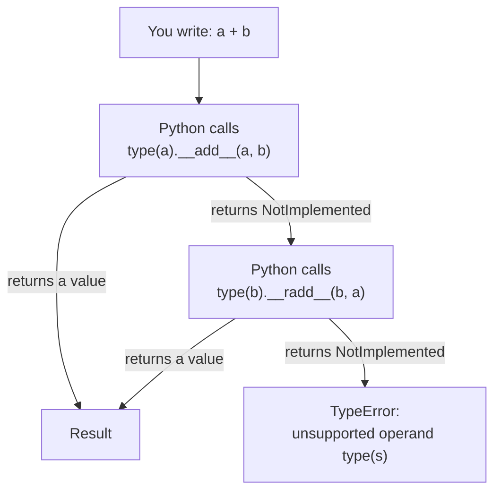
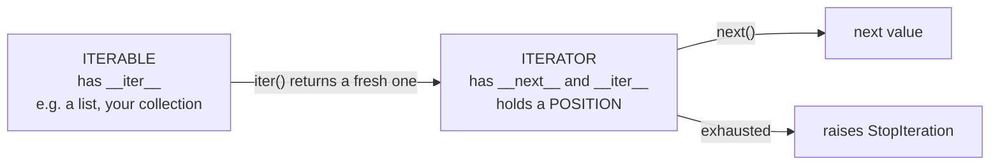

<div align="center">

# 📖 The Complete Bible of Python Dunder Methods

### *Every special method and special attribute Python offers — explained from first principles, with runnable examples.*

**_By Gehan Fernando_**

</div>

---

## 🎯 A Note Before You Begin

This is a long guide, but it is built to be used, not endured. It works two ways:

- **As a course.** Read Part 1, then Parts A through D in order. Those four parts carry every idea the rest of the guide builds on.
- **As a reference.** After that, jump anywhere. Each entry is self-contained and states what it assumes.

Every entry answers the same questions:

- 🎨 **A real-world story** — an analogy to anchor the idea (with its limits stated, because analogies leak).
- 🔍 **When to use it** — the situations where the method actually earns its place.
- 💻 **How to use it** — code you can paste into a file and run.
- 🧾 **The contract** — what triggers it, what arguments it receives, what it must return, and what happens on failure.
- ⚠️ **Traps** — the mistakes that produce confusing bugs, and how to recognise them.

### What you need to know first

This guide assumes you can write and run a basic Python class:

```python
class Dog:
    def __init__(self, name):
        self.name = name

    def speak(self):
        return f"{self.name} says woof"
```

If that snippet is unfamiliar, work through a general Python OOP introduction first — the companion `python_oop_guide.md` covers exactly this ground, and its Chapters 1–6 are the intended prerequisite. You do **not** need prior knowledge of decorators, metaclasses, or async; each is introduced where it is first needed.
## 📊 What's Inside

> **145 numbered entries** covering Python's special methods and special attributes, across **25 parts**. Every entry has a story, a "when to use", a "how to use", and a runnable example.

Entry numbers are stable: where several closely-related members share one explanation (such as the nine reflected arithmetic methods), the entry is numbered as a range and counted once.

### 🚦 Difficulty Legend

Every entry is tagged so you know how often you will actually use it:

- 🟢 **Everyday** — Learn this early. You will use it constantly.
- 🟡 **Sometimes** — Good to know. Comes up in real projects.
- 🔴 **Rare / Advanced** — Framework territory. Safe to skim for now.

### 🧭 The block at the end of every Part

Each entry answers the five questions listed above. At the end of each **Part**, one larger block answers the five questions that matter once you leave the example behind:

| Label | What it answers |
|---|---|
| **How to use it** | The steps, what you need first, and what you should see |
| **When to use it** | The situations that justify it |
| **Where to use it** | Which part of a real system it belongs in, with a concrete scenario |
| **When _not_ to use it** | The unsuitable cases, the limitation, and what to reach for instead |
| **Best practices** | The recommended approach, the mistakes people actually make, and any safety or performance cost |

Most Parts also end with a short **🧪 Check your understanding** and collapsed answers.

### 🗺️ Table of Contents

**🧠 Core Concepts**
- Part 1 — The One Big Idea

**📦 Class Dunders (special methods on your objects)**
- Part A — Object Creation and Destruction
- Part B — String Representation
- Part C — Comparison Operators
- Part D — Arithmetic Operators
- Part E — Reflected Arithmetic (right-hand side)
- Part F — In-Place Operators (`+=`, `-=`, etc.)
- Part G — Unary and Sign Operators
- Part H — Bitwise Operators
- Part I — Type Conversion
- Part J — Container Behavior (list-like)
- Part K — Iteration
- Part L — Callable Objects
- Part M — Context Managers (`with`)
- Part N — Attribute Access
- Part O — Descriptors
- Part P — Class and Metaclass Magic
- Part Q — Async / Await
- Part R — Copying and Pickling
- Part S — Path-Like Objects

**🎁 Wrap-up**
- Part T — Grand Finale: The Complete Vector Class

**📦 Beyond Classes**
- Part U — Package & Module Dunders

**🔍 Introspection & Modern Python**
- Part V — Introspection Attributes
- Part W — Function & Method Attributes
- Part X — Modern Python Dunders (3.10+)

**📋 Reference**
- Glossary
- The Complete Cheat Sheet
- The Golden Best Practices
- Exercise Solutions

---

## 🧪 How These Examples Were Checked

Honesty about verification matters more than a reassuring claim, so here is exactly what was done.

- **Environment:** CPython **3.12.10** on Windows 11.
- **Method:** every ` ```python ` block in this guide was extracted to its own `.py` file and executed. Printed output was compared against the `#` comments in the code.
- **Scope of that check:** it confirms the code runs and prints what the comments say. It does not prove the surrounding prose is complete, nor that behaviour is identical on other Python versions.
- **Version-specific entries** are labelled inline. `__type_params__` and `__buffer__` require 3.12+; `__match_args__` requires 3.10+. These were executed on 3.12.10 and pass there.
- **Deliberate fragments** — examples that cannot run standalone because they describe files in a multi-file package — are labelled **📄 Fragment** together with the file layout they belong to. Anything not labelled that way is a complete program you can run as-is.
- **Memory addresses** (`0x000002D4A3858080`) and **absolute file paths** differ on every run and every machine; where output contains one, this guide shows it as `0x...` or `/path/to/...`.

**To run any complete example:** save it as `demo.py` and run `python demo.py` from that folder.
## 🧒 First: How to Read the Code Examples

*If you are new to Python, this primer explains every building block the examples use.*

**`class Dog:`** — Defines a **class**, a template for making objects. Think of it as a cookie cutter; each cookie it stamps out is an **instance**.

**`def __init__(self, name):`** — Defines a **method**, a function that belongs to the class. The first parameter is always `self`, which means "the particular object this call is working on."

**`self.name = name`** — Stores data *on* the object. This creates an **instance attribute** — a value belonging to this one object, not to the class.

**`buddy = Dog("Buddy")`** — Creates a new `Dog` instance and binds it to the name `buddy`.

**`return x`** — Sends a value back to whoever called the method.

**`f"Hello {name}"`** — An **f-string**, a text template. The `{name}` is replaced with that variable's value.

**`# a comment`** — A note for humans. Python ignores it.

**`super()`** — Refers to the parent class, used to reuse the parent's behaviour. Introduced properly in Part A.

**`**kwargs`** — Collects any extra keyword arguments into a dictionary. Explained where first used.

**`@decorator`** — A modifier written above a function or class that wraps it in extra behaviour. Explained in Part W.

**`raise ValueError("...")`** — Stops execution and reports an error. Python's way of saying "this input is not acceptable."

**Output comments** like `# Buddy` show what the line prints.

---

## 🧠 Part 1: The One Big Idea You Need First

### What is a "dunder"?

"Dunder" is short for **d**ouble **under**score. These are names with two underscores at the start and two at the end:

```
__init__      __add__      __str__      __call__
```

The double underscores are a **naming convention that marks a name as belonging to Python itself**. Python reserves this shape of name so that your ordinary attribute names (`name`, `total`, `items`) can never collide with the language's own hooks.

### Two different things share the dunder name shape

This distinction causes more confusion than any other topic in this guide, so it comes first.

| | **Special methods** | **Special attributes** |
|---|---|---|
| **What they are** | Functions **you write** that Python calls for you | Values **Python fills in** that you read |
| **Who defines them** | You, in your class body | The interpreter, automatically |
| **You interact by** | Defining them | Reading them |
| **Examples** | `__init__`, `__add__`, `__len__`, `__enter__` | `__class__`, `__name__`, `__mro__`, `__bases__` |
| **Covered in** | Parts A–T | Parts U–W |

A third, smaller group is **conventions**: names such as `__all__`, `__version__`, and `__author__` that Python's import system or the wider community agrees to look for, but which are just ordinary module variables you assign. They are covered in Part U and labelled there.

A few names sit deliberately in between, and each says so where it appears:

- **`__slots__`** is a class attribute you *assign*, not a method you define — but assigning it changes how instances store data. (Entry 86.)
- **`__subclasses__()`** is a *method you call*, not one you define. (Entry 128.)
- **`__init__.py`** and **`__main__.py`** are *filenames*, not code members at all. (Entries 118–119.)
- **`__dict__`** is a special attribute, but it exists at two levels — on modules and on objects — which is why it appears twice (Entries 109 and 122).

### The magic translation table

When you write ordinary Python, the interpreter translates it into special-method calls. This is the core mechanism:

| What you write | What Python actually calls |
|----------------|----------------------------|
| `a + b` | `type(a).__add__(a, b)` |
| `a - b` | `type(a).__sub__(a, b)` |
| `a == b` | `type(a).__eq__(a, b)` |
| `len(x)` | `type(x).__len__(x)` |
| `x[0]` | `type(x).__getitem__(x, 0)` |
| `item in x` | `type(x).__contains__(x, item)` |
| `print(x)` | `type(x).__str__(x)` |
| `if x:` | `type(x).__bool__(x)` |
| `x()` | `type(x).__call__(x)` |
| `with x:` | `type(x).__enter__(x)`, then `type(x).__exit__(x, ...)` |

**Your job as a programmer:** decide what these methods should *do*. That is the entire art of special methods.

### ⚠️ The rule that explains a whole class of bugs: lookup happens on the *type*

Notice that the right-hand column says `type(a).__add__(a, b)` and not `a.__add__(b)`. That difference is not pedantry — it is the actual rule, and it has consequences you will hit.

For **implicit** invocations (an operator, `len()`, `print()`, a `with` block), Python looks the special method up **on the object's class, skipping the instance entirely**. Attaching a dunder to a single instance does nothing.

**Objective:** prove that a special method attached to an instance is ignored.

```python
class Greeter:
    pass

g = Greeter()

# Attach __len__ directly to this one instance:
g.__len__ = lambda: 42

print(g.__len__())      # 42  — an explicit call finds the instance attribute

try:
    print(len(g))       # len() consults type(g), which has no __len__
except TypeError as e:
    print(f"TypeError: {e}")
# TypeError: object of type 'Greeter' has no len()
```

**Expected output:**

```
42
TypeError: object of type 'Greeter' has no len()
```

**Why the two lines differ.** `g.__len__()` is a normal attribute lookup: Python checks the instance dictionary first, finds the lambda, calls it, gets `42`. But `len(g)` does not perform a normal attribute lookup — it asks `type(g)`, the `Greeter` class, for `__len__`. The class has none, so it raises. The lambda on the instance is never consulted.

**The practical rule:** define special methods in the class body. That is where Python looks.

**The everyday consequence:** this is why you cannot make one object print differently by assigning `obj.__str__ = ...`. You must define `__str__` on the class, or make a subclass.

### ⚠️ The second rule: `NotImplemented` is how operators cooperate

When your `__add__` (or `__eq__`, or `__lt__`) receives an operand it does not understand, it has two options, and only one is correct.

**The wrong option — let it crash:**

```python
class Money:
    def __init__(self, amount):
        self.amount = amount

    def __add__(self, other):
        return Money(self.amount + other.amount)   # assumes 'other' has .amount

try:
    Money(5) + 10
except AttributeError as e:
    print(f"AttributeError: {e}")
# AttributeError: 'int' object has no attribute 'amount'
```

`AttributeError` is the wrong error to show a user. It leaks your implementation details, it names the wrong culprit, and it stops Python from trying any alternative.

**The right option — return `NotImplemented`:**

```python
class Money:
    def __init__(self, amount):
        self.amount = amount

    def __add__(self, other):
        if not isinstance(other, Money):
            return NotImplemented          # "I don't handle this; try something else"
        return Money(self.amount + other.amount)

    def __repr__(self):
        return f"Money({self.amount})"

print(Money(5) + Money(10))    # Money(15)

try:
    Money(5) + 10
except TypeError as e:
    print(f"TypeError: {e}")
# TypeError: unsupported operand type(s) for +: 'Money' and 'int'
```

**Expected output:**

```
Money(15)
TypeError: unsupported operand type(s) for +: 'Money' and 'int'
```

**What `NotImplemented` is:** a built-in singleton value meaning *"this operation is not defined for these operand types."* It is **not** an exception, and it is **not** the same as `NotImplementedError`. Confusing the two is a common error:

| Name | What it is | Used for |
|------|-----------|----------|
| `NotImplemented` | A value you **return** | "Wrong operand type — Python, try the other side" |
| `NotImplementedError` | An exception you **raise** | "A subclass must override this method" |

**What Python does when it receives `NotImplemented`:**

1. It tries the **reflected** operation on the right-hand operand — for `a + b`, that is `type(b).__radd__(b, a)`. (Part E covers reflected methods.)
2. If that also returns `NotImplemented`, Python raises a clear `TypeError` naming both types.

That clear `TypeError` is the message your users want, and returning `NotImplemented` is what produces it.



**In words, if the diagram does not render.** For `a + b`, Python asks the **left** operand first.
If `a.__add__` returns a real value, that is the answer. If it returns `NotImplemented`, Python asks
the **right** operand's reflected method, `b.__radd__`. Only when *both* decline does Python raise a
`TypeError` — and that `TypeError` names both types, which is exactly the error message a user can
act on.

This is why returning `NotImplemented` matters so much: raising an exception yourself cuts the
negotiation short at step two, so `b` never gets its turn, and the error blames the wrong thing.

> **Convention used in this guide.** Short examples that isolate a single idea often omit the `isinstance` guard so the concept stays visible; each such example carries a note saying so. The production-quality versions — **Part T's `Vector` class** and the exercise solutions — include the guards. Include them in real code.

### The fallback chains

Several special methods have *automatic backups*. Knowing these saves you writing methods you do not need:

| If Python needs… | It tries… | Then falls back to… | And finally… |
|---|---|---|---|
| `str(x)` / `print(x)` | `__str__` | `__repr__` | the default `<Foo object at 0x...>` |
| `repr(x)` | `__repr__` | — | the default `<Foo object at 0x...>` |
| `bool(x)` / `if x:` | `__bool__` | `__len__` (zero → `False`) | `True` |
| `item in x` | `__contains__` | `__iter__` (scan for a match) | `__getitem__` from index 0 |
| `iter(x)` | `__iter__` | `__getitem__` from index 0 upward | `TypeError` |
| `a != b` | `__ne__` | the negation of `__eq__` | `TypeError` |
| `reversed(x)` | `__reversed__` | `__len__` + `__getitem__` | `TypeError` |

This is why defining `__repr__` alone already makes `print()` useful, and why a class with `__len__` is automatically falsy when empty.

### The mental model, and where it breaks

Imagine every Python object as a **house with many labeled doors**. Each door has a purpose: one is used when someone adds something, another when someone measures it, another when someone visits. By default most doors are locked. Special methods are how you unlock and design each door.

**Where this analogy is accurate:** you genuinely choose, door by door, which behaviours your object supports, and each door corresponds to one specific piece of syntax.

**Where it misleads, and why that matters:**

- **The doors belong to the blueprint, not the house.** As shown above, Python checks the *class*, not the instance. In analogy terms, the doors are drawn on the architectural plan that every house of that design shares.
- **Some doors are pre-installed.** Your class inherits from `object`, so `__eq__`, `__repr__`, and `__hash__` already exist before you write anything. You are usually *replacing* a door, not adding one.
- **Doors can redirect.** The fallback chains above mean that knocking on the "print" door may quietly route you to the "repr" door.

Keep the analogy for intuition; rely on the two rules and the fallback table for accuracy.

### 🧪 Check your understanding

Try these before moving on. Solutions are in the [Exercise Solutions](#-exercise-solutions) section at the end.

1. A class defines only `__repr__`. What does `print(instance)` show, and why?
2. You write `obj.__add__ = some_function` on an instance. Why does `obj + 1` still fail?
3. What is the difference between returning `NotImplemented` and raising `NotImplementedError`?
4. A class defines `__len__` returning `0` and nothing else. Is `if instance:` true or false? Which row of the fallback table tells you?

---

# 📦 PART A: Object Creation and Destruction

*Everything that happens when your object is born, lives, and dies.*

---

## 1. `__new__` — The Object Creator

### 🎨 The story
Imagine a cake factory. Before anyone can decorate a cake, someone has to actually *bake* the cake first. `__new__` is the baker — it creates the raw, empty object that others will later customize.

### 🔍 When to use it
Almost never. Beginners can safely skip this for years. You would only use it for advanced tricks like:
- **Singletons** — making sure only one instance of a class ever exists
- **Immutable classes** — customizing how tuples or strings are created
- **Metaclass magic** — very advanced stuff

### 🧾 The contract

| | |
|---|---|
| **Triggered by** | `SomeClass(...)` — it runs *before* `__init__` |
| **Receives** | `cls` (the class itself), then the same arguments passed to the class |
| **Must return** | A new object. Returning an instance of `cls` causes `__init__` to run next |
| **If it returns something else** | `__init__` is **skipped** entirely |
| **Implicitly** | A `staticmethod`, even though the first parameter is named `cls`. You do not write `@staticmethod` |

### 💻 How to use it

**Objective:** make a class that only ever produces one object, however many times you call it.

```python
class Singleton:
    _instance = None

    def __new__(cls):
        # Only create ONE instance, ever.
        if cls._instance is None:
            cls._instance = super().__new__(cls)
        return cls._instance

a = Singleton()
b = Singleton()
print(a is b)   # True — they are literally the same object
```

**Expected output:**

```
True
```

### 🧒 In Plain English
Normally, `Singleton()` creates a brand-new object every time you call it. This code says: *"Only make an object the very first time. After that, always give back the same one."*

- `cls` means "the class itself" (like passing `Singleton` around as a variable).
- `cls._instance` is a **class attribute** — one shared box belonging to the class, not to any instance. That is what lets it survive between calls.
- `super().__new__(cls)` says "let Python's default object-maker produce me an empty instance." You must pass `cls`, otherwise Python would not know which class to build.
- `is` asks "are these the exact same object in memory?", which is different from `==` ("do these hold equal values?"). Part C covers that difference in detail.
- Result: `a` and `b` are **the same object**, not two equal ones.

### ⚠️ The trap that catches everyone: `__init__` still runs every time

This is the single most common `__new__` bug. `__new__` controls *creation*; it does not control *initialisation*. If you add an `__init__`, Python calls it after **every** `Singleton()` call — including the ones that returned the cached object.

```python
class BrokenSingleton:
    _instance = None

    def __new__(cls, value):
        if cls._instance is None:
            cls._instance = super().__new__(cls)
        return cls._instance

    def __init__(self, value):
        print(f"__init__ running with value={value}")
        self.value = value

a = BrokenSingleton(1)
b = BrokenSingleton(2)
print(a is b)       # True  — still one object
print(a.value)      # 2     — but the second call OVERWROTE the data!
```

**Expected output:**

```
__init__ running with value=1
__init__ running with value=2
True
2
```

**Read that carefully.** `a` and `b` are the same object, so `a.value` is `2` — the second construction silently clobbered the first one's state. Anyone holding `a` from earlier in the program just had their data changed underneath them.

**Why it happens:** Python's object construction is two steps. `type.__call__` runs `__new__` to get an object, and then — because the returned object *is* an instance of `cls` — runs `__init__` on it. Your `__new__` short-circuited step one but not step two.

**Two ways to fix it.** Guard the initialisation:

```python
class GuardedSingleton:
    _instance = None

    def __new__(cls, value):
        if cls._instance is None:
            cls._instance = super().__new__(cls)
        return cls._instance

    def __init__(self, value):
        if hasattr(self, "_ready"):      # already initialised — do nothing
            return
        self.value = value
        self._ready = True

a = GuardedSingleton(1)
b = GuardedSingleton(2)
print(a.value)      # 1 — the first call wins, later calls are ignored
```

**Expected output:**

```
1
```

Or — usually better — **do not use `__new__` at all.** A module-level instance, or a function wrapped in `functools.lru_cache`, achieves the same thing with far less surprise:

```python
class Config:
    def __init__(self, path):
        self.path = path

# A plain module-level object IS a singleton in Python:
# other modules that `from settings import CONFIG` all share this one.
CONFIG = Config("app.ini")
print(CONFIG.path)   # app.ini
```

**Expected output:**

```
app.ini
```

Python modules are only executed once per process, so a module-level object is naturally shared. This is the idiomatic Python answer to the problem the Singleton pattern solves in other languages.

### ⚠️ Tip
If you are just starting out, skip `__new__`. The situations that genuinely require it are: subclassing an **immutable** built-in (`int`, `str`, `tuple`), where there is no mutable object yet for `__init__` to fill in; and a handful of metaclass techniques. Everything else is better served by `__init__`.

---

## 2. `__init__` — The Setup Ceremony

### 🎨 The story
Think of the moment you get a new phone. The instant you unbox it, you set your name, choose a wallpaper, and add your Wi-Fi password. All that setup happens once, at the very start. That is what `__init__` does for your Python objects.

### 🔍 When to use it
**Almost every class you write.** This is the most common dunder method. Use it whenever your object needs starting information.

### 💻 How to use it

```python
class Dog:
    def __init__(self, name, age, breed):
        self.name = name
        self.age = age
        self.breed = breed

buddy = Dog("Buddy", 3, "Golden Retriever")
print(buddy.name)   # Buddy
print(buddy.age)    # 3
```

**Expected output:**

```
Buddy
3
```

You never call `__init__` yourself. Python calls it automatically when you write `Dog(...)`.

### 🧾 The contract

| | |
|---|---|
| **Triggered by** | `SomeClass(...)`, immediately after `__new__` returns an instance of that class |
| **Receives** | `self` (the newly created object), then the arguments passed to the class |
| **Must return** | `None`. Returning anything else raises `TypeError` |
| **Its job** | Fill in the object's attributes. Not to create the object — `__new__` already did that |

### ⚠️ It must return `None`

A surprisingly common beginner instinct is to `return self` from `__init__`. Python rejects it:

```python
class Broken:
    def __init__(self):
        self.x = 1
        return self          # wrong — __init__ must return None

try:
    Broken()
except TypeError as e:
    print(f"TypeError: {e}")
# TypeError: __init__() should return None, not 'Broken'
```

**Expected output:**

```
TypeError: __init__() should return None, not 'Broken'
```

**Why:** `__init__` is an *initialiser*, not a constructor. The object already exists by the time it runs; its only job is to set up state. The value of `Dog(...)` comes from `__new__`, not from `__init__`, so returning anything would be ambiguous. A bare `return` (to exit early) is fine — that returns `None`.

### 💡 Related: `__init__` is the right place for validation

Because `__init__` runs before anyone can use the object, it is where you reject impossible values — this is the "fail fast" habit:

```python
class Dog:
    def __init__(self, name, age):
        if age < 0:
            raise ValueError(f"age must be >= 0, got {age}")
        self.name = name
        self.age = age

print(Dog("Buddy", 3).age)      # 3

try:
    Dog("Ghost", -1)
except ValueError as e:
    print(f"ValueError: {e}")
# ValueError: age must be >= 0, got -1
```

**Expected output:**

```
3
ValueError: age must be >= 0, got -1
```

Raising inside `__init__` means the half-built object never escapes into your program. An invalid `Dog` simply cannot exist.

---

## 3. `__del__` — The Farewell

### 🎨 The story
When you leave a hotel room, housekeeping comes in to clean up. `__del__` is the housekeeping — it runs when Python is about to remove your object from memory.

### 🔍 When to use it
Rarely. Python cleans up most things automatically. Only use `__del__` when your object holds an external resource (like a file or network connection) that must be released — and even then, `__enter__`/`__exit__` (context managers) are usually a better choice.

### 💻 How to use it

```python
class FileWatcher:
    def __init__(self, filename):
        self.filename = filename
        print(f"Started watching {filename}")

    def __del__(self):
        print(f"Stopped watching {self.filename}")

watcher = FileWatcher("app.log")
del watcher   # Stopped watching app.log
```

**Expected output:**

```
Started watching app.log
Stopped watching app.log
```

### 🧾 The contract

| | |
|---|---|
| **Triggered by** | The interpreter, when the object's reference count drops to zero or the garbage collector reclaims it |
| **Receives** | `self` |
| **Must return** | `None` (its return value is discarded) |
| **Guarantees** | **None worth relying on.** See below |

### ⚠️ Why `__del__` is unreliable — the specifics

The warning "don't rely on it" is repeated everywhere but rarely explained. Here is what actually goes wrong.

**1. `del x` does not mean "destroy x."** It removes one name binding. `__del__` runs only when the *last* reference disappears:

```python
class Noisy:
    def __del__(self):
        print("__del__ ran")

a = Noisy()
b = a            # now TWO names refer to the same object
del a            # nothing printed — 'b' still holds it
print("after del a")
del b            # now the last reference is gone
print("after del b")
```

**Expected output:**

```
after del a
__del__ ran
after del b
```

Notice `__del__` ran between the two `print` calls, not at `del a`.

**2. Timing is an implementation detail.** CPython uses reference counting, so cleanup usually looks immediate. Other Python implementations (PyPy, Jython) use different garbage collectors where an object may be collected much later, or only at shutdown. Code that depends on prompt `__del__` is not portable.

**3. Reference cycles delay it.** If two objects refer to each other, neither's count reaches zero; they are freed only when the cycle collector runs, at an unpredictable time.

**4. Exceptions inside `__del__` are swallowed.** They cannot propagate — there is no calling frame to receive them — so Python prints a warning to stderr and continues. A bug in your `__del__` may be nearly invisible.

**5. At interpreter shutdown, module globals may already be `None`.** A `__del__` that calls `open()` or a logger during shutdown can fail in confusing ways.

### ✅ What to do instead

For anything that genuinely must be released — files, sockets, locks, database connections — use a **context manager** (Part M), which guarantees cleanup at a precise, visible point in your code:

```python
class FileWatcher:
    def __init__(self, filename):
        self.filename = filename

    def __enter__(self):
        print(f"Started watching {self.filename}")
        return self

    def __exit__(self, exc_type, exc_value, traceback):
        print(f"Stopped watching {self.filename}")
        return False        # don't suppress exceptions

with FileWatcher("app.log") as w:
    print("doing work")
```

**Expected output:**

```
Started watching app.log
doing work
Stopped watching app.log
```

The cleanup point is now the closing of the `with` block — a place you can see in the source, guaranteed to run even if `doing work` raises.

**A reasonable use of `__del__`** is as a *safety net that warns*: if the object reaches collection without having been closed properly, log a warning so the leak is discoverable. It is a diagnostic, not the primary mechanism.

---

## 4. `__init_subclass__` — The Class Family Registrar

### 🎨 The story
Imagine you run a private school. Every time a new student enrolls, they automatically get a uniform and a school ID. `__init_subclass__` is that automatic enrollment — it runs whenever a new class inherits from yours.

### 🔍 When to use it
When you build a framework or library where all subclasses need automatic setup, like being registered in a list.

### 💻 How to use it

```python
class Plugin:
    plugins = []

    def __init_subclass__(cls, **kwargs):
        super().__init_subclass__(**kwargs)
        Plugin.plugins.append(cls)
        print(f"Registered plugin: {cls.__name__}")

class EmailPlugin(Plugin):
    pass

class SMSPlugin(Plugin):
    pass

print(Plugin.plugins)
```

**Expected output:**

```
Registered plugin: EmailPlugin
Registered plugin: SMSPlugin
[<class '__main__.EmailPlugin'>, <class '__main__.SMSPlugin'>]
```

Note the `__main__.` prefix in the class repr: that is the module the classes were defined in. Run the same code inside a module named `plugins.py` and you would see `<class 'plugins.EmailPlugin'>`.

Note also **when** those lines appear. The two "Registered plugin" messages print while Python is still reading the `class` statements — before `print(Plugin.plugins)` is reached. Registration happens at class-definition time, not when anyone creates an instance.

### 🧒 In Plain English
First, some vocabulary:
- **Inheritance** — when one class is "built on top of" another, like a child inheriting traits from a parent. `class EmailPlugin(Plugin):` means "EmailPlugin is a special kind of Plugin."
- **`cls`** — refers to the child class that is being created (`EmailPlugin`, then `SMSPlugin`). Note it is *not* `self`: no instance exists here, only a new class.

What this code does:
1. `Plugin` keeps a list, as a class attribute, of all its subclasses.
2. `__init_subclass__` runs **once** each time a new subclass is defined.
3. It appends that subclass to the master list automatically.

Real-world use: plugin systems where every new plugin registers itself just by existing, with no manual registration list to keep in sync.

### 🧾 The contract

| | |
|---|---|
| **Triggered by** | The `class Child(Parent):` statement, once per subclass, at definition time |
| **Receives** | `cls` — the **new subclass**, not the parent. Plus any keyword arguments given in the class header |
| **Must return** | `None` |
| **Implicitly** | A `classmethod`. Python applies `@classmethod` for you, so do **not** write it yourself |
| **Not called for** | The class that defines it. `Plugin` itself is not registered — only its subclasses |

### ⚠️ Three things that trip people up

**1. It is implicitly a `classmethod`.** You write it with `cls` as the first parameter and no decorator. Adding `@classmethod` yourself is harmless but redundant; adding `@staticmethod` breaks it.

**2. Always call `super().__init_subclass__(**kwargs)`.** If another class in the hierarchy also defines the hook, skipping `super()` silently disables it. The `**kwargs` forwarding matters because class definitions can pass keyword arguments:

```python
class Plugin:
    registry = {}

    def __init_subclass__(cls, name=None, **kwargs):
        super().__init_subclass__(**kwargs)     # pass the rest along
        key = name or cls.__name__.lower()
        Plugin.registry[key] = cls

class EmailPlugin(Plugin, name="email"):        # keyword goes to __init_subclass__
    pass

class SMSPlugin(Plugin):                         # no keyword — falls back to the name
    pass

print(sorted(Plugin.registry))     # ['email', 'smsplugin']
```

**Expected output:**

```
['email', 'smsplugin']
```

Here `name="email"` in the class header is not a base class — Python routes any keyword argument in a class header straight into `__init_subclass__`.

**3. It writes to `Plugin.plugins` explicitly, not `cls.plugins`.** Using `cls.plugins.append(...)` would still work here (because attribute *lookup* finds the parent's list), but it reads as though each subclass has its own list, which it does not. Naming the owner explicitly makes the shared state obvious.

---

## 5. `__set_name__` — The Descriptor's Name Tag

### 🎨 The story
When a new employee joins a company, they get a name tag with their name on it. `__set_name__` gives your special class attributes a name tag automatically when they are assigned inside a class.

### 🔍 When to use it
When building custom descriptors (advanced) that need to know what name they were given inside their parent class.

### 💻 How to use it

```python
class LoggedAttribute:
    def __set_name__(self, owner, name):
        self.name = name

    def __get__(self, obj, objtype=None):
        print(f"Reading {self.name}")
        return obj.__dict__.get(self.name)

    def __set__(self, obj, value):
        print(f"Setting {self.name} = {value}")
        obj.__dict__[self.name] = value

class User:
    username = LoggedAttribute()

u = User()
u.username = "alice"
print(u.username)
```

**Expected output:**

```
Setting username = alice
Reading username
alice
```

Three lines, not two: `print(u.username)` first triggers `__get__`, which prints `Reading username`, and only then does `print` output the returned value `alice`.

### 🧒 In Plain English
This is advanced — feel free to skip on your first read. It is included here because it is the one piece that makes **descriptors** (Part O) usable, and Part O refers back to it.

The idea: when you write `username = LoggedAttribute()` inside the `User` class body, the `LoggedAttribute` object has no idea what name it was assigned to. It is just an object sitting in a class namespace. Python then calls `__set_name__` to tell it: *"you are being stored under the name `username`."*

Storing that name matters because the descriptor uses it as the key in each instance's `__dict__` — that is how `obj.__dict__.get(self.name)` finds the right per-object value.

**Before `__set_name__` existed** (Python 3.6 added it), descriptor authors had to repeat the name by hand — `username = LoggedAttribute("username")` — which meant a typo silently produced a descriptor writing to the wrong key.

### 🧾 The contract

| | |
|---|---|
| **Triggered by** | The completion of a `class` statement, for every attribute in the class body whose value defines `__set_name__` |
| **Receives** | `self` (the descriptor object), `owner` (the class it was defined in), `name` (the attribute name as a string) |
| **Must return** | `None` |
| **Timing** | Runs once, at class-creation time — never again |
| **Not called for** | Attributes assigned *after* the class is created (`User.other = LoggedAttribute()` does not trigger it) |

That last row is a genuine gotcha: attaching a descriptor to an existing class after the fact leaves it without a name, and you must then call `descriptor.__set_name__(User, "other")` manually.

> ### 🧭 In practice — object creation and destruction
>
> **How to use it.** Put your setup in `__init__` — it receives the already-created object as `self` and returns `None`. Touch `__new__` only when you must control *creation* itself. Use `__init_subclass__` on a base class to react when someone subclasses it, and `__set_name__` on a descriptor to learn the attribute name it was assigned to. **Expected result:** a fully valid object by the time `__init__` returns.
>
> **When to use it.** `__init__` on essentially every class. `__new__` for immutable types (subclassing `str`, `int`, `tuple`), caching, or singleton-like behaviour. `__init_subclass__` for plugin registries — a base class that automatically collects every subclass.
>
> **Where to use it.** `__init_subclass__` shines in framework and library code. **Scenario:** a `Handler` base class registers every subclass in a dictionary as it is defined, so an application can look handlers up by name without anyone maintaining a list — and forgetting to register a new handler becomes impossible.
>
> **When _not_ to use it.** Avoid `__new__` in ordinary application code: it runs before `__init__`, and the most common bug is forgetting that **`__init__` still runs every time** even when `__new__` returned a cached instance — so a “singleton” gets re-initialised on every call. Avoid `__del__` as a cleanup mechanism entirely; you cannot know when or whether it runs.
>
> **Best practices.** `__init__` must return `None` — returning anything else raises `TypeError`. Validate in `__init__` so an invalid object never exists. For resource cleanup use a **context manager** (Part M), not `__del__`; treat `__del__` as a last-resort safety net whose exceptions are silently swallowed.

### 🧪 Check your understanding

1. Why can a singleton implemented with `__new__` still have its state reset on every call?
2. You define `__init__` and it returns `self`. What happens?
3. When is `__init_subclass__` a better choice than a metaclass?

<details>
<summary><b>📝 Answers</b></summary>

1. Because `__new__` and `__init__` are separate steps. Python calls `__init__` on whatever object `__new__` returns — including a cached one — so the initialiser re-runs and overwrites the state. Guard it with a flag, or use a module-level value instead.

2. `TypeError: __init__() should return None`. `__init__` initialises an object that already exists; it does not produce one. `__new__` is the method that returns an object.

3. Almost always. It covers the common need — “run something when a subclass is defined” — with an ordinary method and no metaclass conflicts. Reach for a metaclass only when you must alter how the class itself is built.

</details>


---

# 📝 PART B: String Representation

*How your object describes itself to the world.*

---

## 6. `__str__` — The Friendly Introduction

### 🎨 The story
At a networking event, when someone asks who you are, you say something friendly: *"I'm Sarah, I work in marketing."* You do not recite your passport number. That friendly answer is `__str__`.

### 🔍 When to use it
Whenever you want `print(your_object)` to show something readable.

### 💻 How to use it

```python
class Book:
    def __init__(self, title, author):
        self.title = title
        self.author = author

    def __str__(self):
        return f"'{self.title}' by {self.author}"

my_book = Book("The Alchemist", "Paulo Coelho")
print(my_book)   # 'The Alchemist' by Paulo Coelho
```

**Expected output:**

```
'The Alchemist' by Paulo Coelho
```

### 🧾 The contract

| | |
|---|---|
| **Triggered by** | `str(x)`, `print(x)`, `f"{x}"`, and `format(x)` with an empty spec |
| **Receives** | `self` |
| **Must return** | A `str`. Returning anything else raises `TypeError` |
| **If absent** | Python falls back to `__repr__` |
| **Inherited default** | `object.__str__` simply calls `__repr__` |

### ⚠️ It must return a string, not print one

The most common beginner mistake here is using `print` instead of `return`:

```python
class Broken:
    def __str__(self):
        print("hello")          # wrong: prints, returns None

try:
    str(Broken())
except TypeError as e:
    print(f"TypeError: {e}")
# TypeError: __str__ returned non-string (type NoneType)
```

**Expected output:**

```
hello
TypeError: __str__ returned non-string (type NoneType)
```

Notice that `hello` *is* printed — the method body ran — and then Python rejected the `None` it returned. Seeing your text appear followed by a `TypeError` is the signature of this bug.

### 💡 `__str__` vs `__repr__` — which to write

If you write only one, write `__repr__` (next entry). The fallback goes one way only:

| You define | `print(x)` shows | `repr(x)` shows |
|---|---|---|
| Neither | `<__main__.Book object at 0x...>` | `<__main__.Book object at 0x...>` |
| Only `__repr__` | Your `__repr__` | Your `__repr__` |
| Only `__str__` | Your `__str__` | `<__main__.Book object at 0x...>` |
| Both | Your `__str__` | Your `__repr__` |

Defining only `__str__` leaves you with useless debugger and list output, which is exactly when you most need the information.

**When both are worth writing:** when the audience genuinely differs. `__str__` for an end user reading a report (`'The Alchemist' by Paulo Coelho`), `__repr__` for you at 2 a.m. reading a traceback (`Book(title='The Alchemist', author='Paulo Coelho')`).

---

## 7. `__repr__` — The Technical Description

### 🎨 The story
If `__str__` is you introducing yourself at a party, `__repr__` is your ID card — precise, detailed, meant for professionals. Ideally, it looks like the code that would recreate the object.

### 🔍 When to use it
**Always.** Every class deserves a `__repr__` for debugging. If you write only one description method, write this one — Python falls back to it when `__str__` is missing.

### 💻 How to use it

```python
class Book:
    def __init__(self, title, author):
        self.title = title
        self.author = author

    def __repr__(self):
        return f"Book(title={self.title!r}, author={self.author!r})"

my_book = Book("The Alchemist", "Paulo Coelho")
print(repr(my_book))   # Book(title='The Alchemist', author='Paulo Coelho')
```

**Expected output:**

```
Book(title='The Alchemist', author='Paulo Coelho')
```

### 🧒 In Plain English
Notice the `!r` inside `{self.title!r}`. This is a **conversion flag**: it tells the f-string to call `repr()` on the value instead of `str()`. For a string, `repr()` adds the quotes. Without `!r` you would get `title=The Alchemist`; with it, `title='The Alchemist'` — which you could paste straight back into Python.

`!r` matters more than it looks. Compare these two reprs of a value that is a *string containing a number*:

```python
value = "42"
print(f"count={value}")     # count=42   — looks like the integer 42
print(f"count={value!r}")   # count='42' — unmistakably a string
```

**Expected output:**

```
count=42
count='42'
```

When you are debugging a type confusion, that pair of quotes is the whole answer.

### 🧾 The contract

| | |
|---|---|
| **Triggered by** | `repr(x)`, the interactive prompt echoing a value, `f"{x!r}"`, and the display of `x` inside a container (`print([x])`) |
| **Receives** | `self` |
| **Must return** | A `str` |
| **If absent** | Python uses `object.__repr__`, giving `<__main__.Book object at 0x...>` |
| **Goal** | Ideally, valid Python that would recreate the object. Where that is impossible, an unambiguous `<...>` description |

### 💡 Why `__repr__` is the one to write: containers ignore `__str__`

This is the argument that convinces most people. Printing a *list* of your objects calls `__repr__` on each element, never `__str__`:

```python
class WithStrOnly:
    def __str__(self):
        return "friendly"

class WithRepr:
    def __repr__(self):
        return "WithRepr()"

print(WithStrOnly())          # friendly
print([WithStrOnly()])        # [<__main__.WithStrOnly object at 0x...>]
print([WithRepr()])           # [WithRepr()]
```

**Expected output** (the hex address varies every run):

```
friendly
[<__main__.WithStrOnly object at 0x000001B2C3D40E50>]
[WithRepr()]
```

**Why containers do this:** `list.__str__` is defined to build its text from the `repr()` of each element. That is deliberate — a list is a debugging-oriented display, and ambiguity there (`['a, b']` versus `['a', 'b']`) would be actively misleading.

So a class with only `__str__` looks fine alone and useless in every collection, dictionary value, and traceback. That is the reverse of what you want.

### 💡 The two shapes of a good `__repr__`

**Shape 1 — evaluable**, for simple data-holding classes. `eval(repr(x))` would reconstruct it:

```python
class Point:
    def __init__(self, x, y):
        self.x, self.y = x, y

    def __repr__(self):
        return f"Point({self.x!r}, {self.y!r})"

p = Point(1, 2)
print(repr(p))                     # Point(1, 2)
print(eval(repr(p)).x)             # 1 — it really does reconstruct
```

**Expected output:**

```
Point(1, 2)
1
```

(That `eval` call is a demonstration, not a recommendation — never `eval` untrusted text.)

**Shape 2 — angle-bracket description**, for objects that cannot be reconstructed from text, such as anything holding a live connection or file handle. The convention is to start with `<` so no reader mistakes it for runnable code:

```python
class Connection:
    def __init__(self, host, port):
        self.host, self.port = host, port
        self.is_open = True

    def __repr__(self):
        state = "open" if self.is_open else "closed"
        return f"<Connection {self.host}:{self.port} [{state}]>"

print(repr(Connection("db.internal", 5432)))
```

**Expected output:**

```
<Connection db.internal:5432 [open]>
```

Both shapes satisfy the real goal: someone reading this in a traceback learns which object it is and what state it was in.

---

## 8. `__format__` — Custom Formatting

### 🎨 The story
Think of a chef preparing the same dish in different ways — plated for a fine restaurant, wrapped for takeaway, or arranged for a buffet. `__format__` lets your object present itself differently depending on the format string requested.

### 🔍 When to use it
When you want your object to work nicely with `format()` and f-strings using format specifiers.

### 💻 How to use it

```python
class Money:
    def __init__(self, amount):
        self.amount = amount

    def __format__(self, spec):
        if spec == "long":
            return f"{self.amount} US dollars"
        elif spec == "short":
            return f"${self.amount}"
        return str(self.amount)

price = Money(50)
print(f"{price:short}")   # $50
print(f"{price:long}")    # 50 US dollars
print(f"{price}")         # 50
```

**Expected output:**

```
$50
50 US dollars
50
```

### 🧒 In Plain English
In f-strings you can add a colon and a "format specification" like `f"{price:short}"`. Python passes everything after the colon to your `__format__` method as a plain string. Your method inspects it and returns the version the caller asked for. It is like telling a photo printer *"give me the wallet-size version"* or *"the poster-size version."*

### 🧾 The contract

| | |
|---|---|
| **Triggered by** | `format(x, spec)` and any f-string or `str.format` field with a `:spec` |
| **Receives** | `self`, and `format_spec` — a `str`, empty when no spec was given |
| **Must return** | A `str` |
| **If absent** | `object.__format__` handles an **empty** spec by calling `str(self)`, and raises `TypeError` for any non-empty spec |

That last row explains an error you may have met:

```python
class Plain:
    def __str__(self):
        return "plain"

print(f"{Plain()}")            # plain — empty spec, falls back to __str__

try:
    print(f"{Plain():>10}")    # non-empty spec, no __format__ defined
except TypeError as e:
    print(f"TypeError: {e}")
# TypeError: unsupported format string passed to Plain.__format__
```

**Expected output:**

```
plain
TypeError: unsupported format string passed to Plain.__format__
```

**Why:** alignment and padding specs like `>10` are not universal — they are implemented by each type's `__format__`. `object` refuses to guess.

### ⚠️ Handle the empty spec, and consider delegating the rest

The `Money` example above returns a bare number for an unrecognised spec, which quietly swallows typos: `f"{price:shrot}"` silently prints `50` instead of reporting the mistake. A more helpful version handles its own specs, delegates standard numeric specs to the underlying value, and rejects the rest:

```python
class Money:
    def __init__(self, amount):
        self.amount = amount

    def __format__(self, spec):
        if spec == "":
            return f"${self.amount:.2f}"
        if spec == "long":
            return f"{self.amount:.2f} US dollars"
        if spec == "short":
            return f"${self.amount:.0f}"
        # Anything else: let float handle it (".2f", ">12", "+,.2f", ...)
        return format(self.amount, spec)

price = Money(1234.5)
print(f"{price}")           # $1234.50
print(f"{price:short}")     # $1234
print(f"{price:long}")      # 1234.50 US dollars
print(f"{price:>12,.2f}")   # '    1,234.50' padded to width 12
```

**Expected output:**

```
$1234.50
$1234
1234.50 US dollars
    1,234.50
```

**Walking through the last line:** `>12,.2f` is not one of our named specs, so we pass it to `format(self.amount, spec)` — a float. `,` inserts thousands separators, `.2f` fixes two decimals, `>12` right-aligns in twelve columns. Delegating means every numeric spec Python supports works on `Money` for free, and only genuinely invalid specs raise.

---

## 9. `__bytes__` — Raw Bytes Representation

### 🎨 The story
Sometimes you need to send your object over a network or save it to a file — situations that need raw bytes, not friendly text. `__bytes__` provides that raw form.

### 🔍 When to use it
When your object needs to be converted to `bytes` for network transmission, file storage, or low-level protocols.

### 💻 How to use it

```python
class Message:
    def __init__(self, text):
        self.text = text

    def __bytes__(self):
        return self.text.encode("utf-8")

msg = Message("Hello")
print(bytes(msg))   # b'Hello'
```

**Expected output:**

```
b'Hello'
```

### 🧾 The contract

| | |
|---|---|
| **Triggered by** | `bytes(x)` |
| **Receives** | `self` |
| **Must return** | A `bytes` object. Returning `str` raises `TypeError` |
| **If absent** | `bytes(x)` falls back to the buffer protocol, then to treating `x` as an iterable of ints, then raises `TypeError` |

### 🧒 In Plain English
- **Text** vs **bytes**: humans read text ("Hello"). Computers, networks, and files store **bytes** — sequences of 0s and 1s.
- **`.encode("utf-8")`** translates text into bytes using the standard "UTF-8" encoding rules.
- **`b'Hello'`** is how Python prints bytes — the `b` in front just means "these are bytes, not text."

Think of it like converting a letter into Morse code before sending it over telegraph.

> ### 🧭 In practice — string representation
>
> **How to use it.** Define `__repr__` to return an unambiguous, developer-facing string — ideally one that looks like the call that would recreate the object. Define `__str__` only when a separate user-facing form is genuinely needed. Add `__format__` to support format specifiers in f-strings. **Expected result:** your object prints as something meaningful in logs, tracebacks, debuggers, and lists.
>
> **When to use it.** **Write `__repr__` on essentially every class you define.** It is three lines and it improves every debugging session for the life of the class. `__str__` when the friendly form differs; `__format__` when values need alignment or precision control.
>
> **Where to use it.** Logging, debugging, and REPL work. **Scenario:** a list of `Product` objects printed in a test failure. Without `__repr__` you get eight lines of `<__main__.Product object at 0x...>` and learn nothing; with it you see the actual data and the cause is obvious.
>
> **When _not_ to use it.** Do not put expensive work or anything that can raise inside `__repr__` — it runs in debuggers and exception paths, exactly where a second failure is least welcome. Do not use `__str__` alone: containers ignore it, so a list of your objects still prints the default.
>
> **Best practices.** If you write only one, write `__repr__` — `str()` falls back to it, but not the other way round. Both **must return a string**, not print one; returning `None` raises `TypeError`. Prefer the `ClassName(field=value)` shape so the output doubles as documentation. Handle an empty format spec in `__format__` and delegate the rest.

### 🧪 Check your understanding

1. A class defines only `__repr__`. What does `print(obj)` show?
2. Why does a list of your objects ignore `__str__`?

<details>
<summary><b>📝 Answers</b></summary>

1. The `__repr__` output. `str()` falls back to `__repr__` when `__str__` is absent — which is exactly why `__repr__` is the one to write first.

2. Because a container builds its own representation by calling `repr()` on each element, never `str()`. Defining only `__str__` leaves every list, dict, and set printing the default `<object at 0x...>`.

</details>


---

# ⚖️ PART C: Comparison Operators

*Teaching Python how to compare your objects.*

---

## 10. `__eq__` — Are We Equal? 🟢

### 🎨 The story
Two twins can look identical. But are they *the same person*? `__eq__` decides what counts as "equal" for your objects.

**Where the analogy is precise:** you are drawing a line between *identical* and *the same*. Python already has a separate operator for "the same one" — `is` — and `__eq__` is how you define the other question.

### 🔍 When to use it
Whenever your object has a meaningful notion of equality — two products with the same ID, two dates on the same day, two coordinates at the same location.

### First: `==` and `is` are different questions

Before writing `__eq__`, be clear about what you are changing:

```python
a = [1, 2, 3]
b = [1, 2, 3]
c = a

print(a == b)   # True  — same contents
print(a is b)   # False — two separate list objects
print(a is c)   # True  — c is another name for the very same object
```

**Expected output:**

```
True
False
True
```

`is` compares **identity** (the same object in memory) and you can never override it. `==` compares **value**, and `__eq__` is where you decide what "value" means for your type.

**The default:** if you do not define `__eq__`, `object.__eq__` treats `==` as identity — two separately built objects are never equal, even with identical data. That default is why `Point(1, 2) == Point(1, 2)` is `False` until you write the method.

### 💻 How to use it — the smallest version

**Objective:** make two points with the same coordinates compare equal.

```python
class Point:
    def __init__(self, x, y):
        self.x = x
        self.y = y

    def __eq__(self, other):
        return self.x == other.x and self.y == other.y

print(Point(1, 2) == Point(1, 2))   # True
print(Point(1, 2) == Point(3, 4))   # False
```

**Expected output:**

```
True
False
```

This isolates the idea, and it has **two defects** that matter in real code. Both are worth understanding, because both produce confusing bugs.

### ⚠️ Defect 1: it crashes on foreign types

```python
class Point:
    def __init__(self, x, y):
        self.x, self.y = x, y

    def __eq__(self, other):
        return self.x == other.x and self.y == other.y

try:
    Point(1, 2) == "not a point"
except AttributeError as e:
    print(f"AttributeError: {e}")
# AttributeError: 'str' object has no attribute 'x'
```

**Expected output:**

```
AttributeError: 'str' object has no attribute 'x'
```

Comparing two unrelated things with `==` should never raise — it should simply answer `False`. This bug bites hardest indirectly: `Point(1, 2) in ["a", "b"]` crashes, because `in` compares against each element.

**The fix is `NotImplemented`**, as introduced in Part 1:

```python
class Point:
    def __init__(self, x, y):
        self.x, self.y = x, y

    def __eq__(self, other):
        if not isinstance(other, Point):
            return NotImplemented
        return self.x == other.x and self.y == other.y

print(Point(1, 2) == Point(1, 2))        # True
print(Point(1, 2) == "not a point")      # False — no crash
print(Point(1, 2) != "not a point")      # True  — derived from __eq__
print(Point(1, 2) in [Point(0, 0), Point(1, 2)])   # True
```

**Expected output:**

```
True
False
True
True
```

**Why returning `NotImplemented` yields `False` here:** Python tries the reflected comparison, `"not a point".__eq__(Point(1, 2))`, which also returns `NotImplemented`. With both sides declining, Python falls back to its last resort for `==` — identity comparison — which is `False`. Unlike arithmetic, `==` never raises `TypeError`; it always produces an answer.

### ⚠️ Defect 2: defining `__eq__` silently makes your object unhashable

This one surprises nearly everyone, and the error message arrives far from the cause.

```python
class Point:
    def __init__(self, x, y):
        self.x, self.y = x, y

    def __eq__(self, other):
        if not isinstance(other, Point):
            return NotImplemented
        return self.x == other.x and self.y == other.y

p = Point(1, 2)
print(Point.__hash__)          # None

try:
    {p}                        # try to put it in a set
except TypeError as e:
    print(f"TypeError: {e}")
# TypeError: unhashable type: 'Point'
```

**Expected output:**

```
None
TypeError: unhashable type: 'Point'
```

**What happened:** when a class defines `__eq__` but not `__hash__`, Python sets `__hash__` to `None`, which makes the type unhashable. Your `Point` can no longer go into a `set` or be used as a `dict` key.

**Why Python does this — and it is doing you a favour.** Sets and dictionaries find items by hash first, then confirm with `==`. If `Point(1, 2)` and `Point(1, 2)` are equal but hash differently, a dictionary would store them in different buckets and never notice they are duplicates. Rather than let you build that silent corruption, Python disables hashing until you make a deliberate choice.

**The fix** is Entry 16, `__hash__`. The rule in one line: **if you define `__eq__` and want the object usable in sets or as a dict key, define `__hash__` from the same fields.**

**When you do *not* need `__hash__`:** if the object is mutable and never belongs in a set, leaving it unhashable is the correct, safe outcome — not something to work around.

### 🧾 The contract

| | |
|---|---|
| **Triggered by** | `a == b`, and indirectly by `in`, `.index()`, `.count()`, `dict`/`set` lookups |
| **Receives** | `self`, `other` — `other` can be **any** type |
| **Should return** | `True`, `False`, or `NotImplemented` |
| **Side effect** | Setting it to anything but the inherited default sets `__hash__ = None` unless you also define `__hash__` |
| **Gives you `!=` free** | Python derives `!=` by negating `__eq__` |
| **Inherited default** | Identity comparison (`self is other`) |

### 💡 The shortcut: let `@dataclass` write it

For classes that mainly hold data, you rarely need to write any of this by hand:

```python
from dataclasses import dataclass

@dataclass(frozen=True)
class Point:
    x: int
    y: int

print(Point(1, 2) == Point(1, 2))     # True
print(Point(1, 2) == "nope")          # False
print(len({Point(1, 2), Point(1, 2)}))  # 1 — hashable, duplicates collapse
print(Point(1, 2))                     # Point(x=1, y=2)
```

**Expected output:**

```
True
False
1
Point(x=1, y=2)
```

`@dataclass` generates `__init__`, `__repr__`, and `__eq__` (comparing all fields, with the `isinstance` guard built in). Adding `frozen=True` makes instances immutable and generates a matching `__hash__`.

**Choose by situation.** Reach for `@dataclass` when the class is mostly fields, which covers most cases. Write `__eq__` by hand when equality is not "all fields match" — for example an `Order` that is equal when `order_id` matches, regardless of its other contents.

---

## 11. `__ne__` — Are We Not Equal? 🔴

### 🎨 The story
The opposite of `__eq__` — and in Python 3, you almost never write it, because Python derives it for you.

### 🔍 When to use it
**Almost never.** Define `__eq__` and stop. This entry exists mainly so you can recognise `__ne__` in older code and know why it is usually redundant.

### 💻 Demonstration: `!=` works without you writing anything

**Objective:** confirm that `__eq__` alone gives you a correct `!=`.

```python
class Point:
    def __init__(self, x, y):
        self.x, self.y = x, y

    def __eq__(self, other):
        if not isinstance(other, Point):
            return NotImplemented
        return self.x == other.x and self.y == other.y

print(Point(1, 2) != Point(1, 2))    # False
print(Point(1, 2) != Point(3, 4))    # True
print(Point(1, 2) != "banana")       # True
```

**Expected output:**

```
False
True
True
```

No `__ne__` anywhere, yet `!=` behaves correctly on all three — including the foreign type.

### 🧾 The contract

| | |
|---|---|
| **Triggered by** | `a != b` |
| **Receives** | `self`, `other` |
| **Should return** | `True`, `False`, or `NotImplemented` |
| **Inherited default** | `object.__ne__` calls `__eq__` and inverts the result — unless `__eq__` returned `NotImplemented`, which it passes through unchanged |

That last detail is the reason the default is better than most hand-written versions: it preserves `NotImplemented` so the reflected operand still gets its turn.

### ⚠️ Why the hand-written version is usually a bug

The `__ne__` in older code typically looks like the one this entry used to show:

```python
class Point:
    def __init__(self, x, y):
        self.x, self.y = x, y

    def __eq__(self, other):
        if not isinstance(other, Point):
            return NotImplemented
        return self.x == other.x and self.y == other.y

    def __ne__(self, other):
        return self.x != other.x or self.y != other.y    # no type guard!

print(Point(1, 2) != Point(3, 4))    # True — fine

try:
    Point(1, 2) != "banana"
except AttributeError as e:
    print(f"AttributeError: {e}")
# AttributeError: 'str' object has no attribute 'x'
```

**Expected output:**

```
True
AttributeError: 'str' object has no attribute 'x'
```

Adding `__ne__` here **broke** a case that worked when only `__eq__` existed. Hand-writing `__ne__` gives you a second place to forget the type guard, and a second place for the two definitions to drift apart — a class where `a == b` and `a != b` are both `True` is a genuinely nasty bug to track down.

### 📜 Historical note

In **Python 2**, `!=` did *not* fall back to `__eq__`, so defining both was mandatory. Code that still defines `__ne__` is usually a Python 2 habit, or was written to run on both. In Python 3 it is redundant. If you find one in code you maintain, deleting it is normally a safe improvement — verify first that it is a plain negation and not deliberately asymmetric.

**The rare legitimate case:** a type where "not equal" is genuinely not the negation of "equal". SQL-style three-valued logic and IEEE `NaN` semantics are the usual examples. If you are not deliberately building one of those, you do not need `__ne__`.

---

## 12. `__lt__` — Less Than (`<`) 🟢

### 🎨 The story
A teacher lining up students by height needs to compare any two and decide who goes first. `__lt__` is that comparison.

### 🔍 When to use it
When your objects have a natural ordering. `__lt__` is the most valuable of the four ordering methods because `sorted()`, `min()`, `max()`, `list.sort()`, and `heapq` are all built on it alone — they never call `__gt__`.

### 💻 How to use it

**Objective:** sort a list of students by score, ascending.

```python
class Student:
    def __init__(self, name, score):
        self.name = name
        self.score = score

    def __lt__(self, other):
        return self.score < other.score

    def __repr__(self):
        return f"{self.name}({self.score})"

students = [Student("Alice", 85), Student("Bob", 92), Student("Carol", 78)]
print(sorted(students))   # [Carol(78), Alice(85), Bob(92)]
```

**Expected output:**

```
[Carol(78), Alice(85), Bob(92)]
```

**Why `__repr__` and not `__str__`:** `print` on a *list* calls `repr` on each element — the rule from Entry 7. With only `__str__`, this would have printed three `<__main__.Student object at 0x...>`.

**Why sorting works from `__lt__` alone:** Python's sort only ever asks "does this one come before that one?" It never needs `>`, `<=`, or `>=`. One method buys you the whole sorting toolkit.

### 🧾 The contract

| | |
|---|---|
| **Triggered by** | `a < b`; also `sorted()`, `min()`, `max()`, `list.sort()`, `heapq` |
| **Receives** | `self`, `other` |
| **Should return** | Usually `True`/`False`, or `NotImplemented` for types you cannot order against |
| **Reflected as** | `b > a` — Python tries `__gt__` on the other operand when yours declines |
| **Inherited default** | None. Without it, `a < b` raises `TypeError` |

### ⚠️ Ordering methods should return `NotImplemented`, not crash

Unlike `==`, an unorderable comparison *should* raise `TypeError` — and returning `NotImplemented` is what produces the right one:

```python
class Student:
    def __init__(self, name, score):
        self.name, self.score = name, score

    def __lt__(self, other):
        if not isinstance(other, Student):
            return NotImplemented
        return self.score < other.score

print(Student("A", 85) < Student("B", 92))    # True

try:
    Student("A", 85) < 90
except TypeError as e:
    print(f"TypeError: {e}")
# TypeError: '<' not supported between instances of 'Student' and 'int'
```

**Expected output:**

```
True
TypeError: '<' not supported between instances of 'Student' and 'int'
```

That message names both types and the operator — exactly what a user needs. Compare it with the `AttributeError: 'int' object has no attribute 'score'` you would get without the guard.

### 💡 Often you do not need `__lt__` at all

If you only want to sort one particular way, `sorted(key=...)` is simpler and does not commit your class to a single "natural" order:

```python
class Student:
    def __init__(self, name, score):
        self.name, self.score = name, score

    def __repr__(self):
        return f"{self.name}({self.score})"

students = [Student("Alice", 85), Student("Bob", 92), Student("Carol", 78)]

print(sorted(students, key=lambda s: s.score))          # by score
print(sorted(students, key=lambda s: s.name))           # by name
print(sorted(students, key=lambda s: -s.score))         # by score, descending
```

**Expected output:**

```
[Carol(78), Alice(85), Bob(92)]
[Alice(85), Bob(92), Carol(78)]
[Bob(92), Alice(85), Carol(78)]
```

**How to choose.** Define `__lt__` when there is one ordering that is genuinely *inherent* to the type — version numbers, dates, money. Use `key=` when the ordering is a property of the task rather than the type, which is most of the time. A `Student` has no single obviously-correct order, so `key=` is the better fit here; the `__lt__` version above is a teaching example, not a recommendation for this particular class.

**Sorting by several fields** is a `key=` speciality — return a tuple, and Python compares element by element:

```python
class Student:
    def __init__(self, name, score):
        self.name, self.score = name, score

    def __repr__(self):
        return f"{self.name}({self.score})"

students = [Student("Bob", 85), Student("Alice", 85), Student("Carol", 78)]
# Highest score first; ties broken alphabetically by name.
print(sorted(students, key=lambda s: (-s.score, s.name)))
```

**Expected output:**

```
[Alice(85), Bob(85), Carol(78)]
```

---

## 13. `__le__` — Less Than or Equal (`<=`) 🟡

### 🎨 The story
A theme park height sign: *"You must be **this tall or shorter** to enter the kids' zone."* `__le__` decides when your object counts as "less than or equal to" another.

### 🔍 When to use it
Whenever you need `<=` comparisons — filtering items up to a threshold, checking eligibility bands, sorting with ties.

### 💻 How to use it

```python
class Version:
    def __init__(self, number):
        self.number = number

    def __le__(self, other):
        return self.number <= other.number

print(Version(1) <= Version(2))   # True
print(Version(3) <= Version(3))   # True
```

---

## 14. `__gt__` — Greater Than (`>`) 🟡

### 🎨 The story
A gym's leaderboard: *"Who lifted more than 100 kg today?"* `__gt__` powers those "greater than" comparisons.

### 🔍 When to use it
Whenever `>` should work on your objects — leaderboards, thresholds, filtering the top performers.

### 💻 How to use it

```python
class Score:
    def __init__(self, value):
        self.value = value

    def __gt__(self, other):
        return self.value > other.value

print(Score(90) > Score(70))   # True
```

---

## 15. `__ge__` — Greater Than or Equal (`>=`) 🟡

### 🎨 The story
A voting-age check: *"You must be **18 or older** to vote."* `__ge__` handles the "at least this much" comparisons.

### 🔍 When to use it
Whenever your object needs `>=` — age checks, minimum-requirement filters, "meets or exceeds" logic.

### 💻 How to use it

```python
class Age:
    def __init__(self, years):
        self.years = years

    def __ge__(self, other):
        return self.years >= other.years

print(Age(21) >= Age(18))   # True
print(Age(17) >= Age(18))   # False
```

### 🧾 The contract for all four ordering methods

| Method | Operator | Reflected partner |
|---|---|---|
| `__lt__` | `a < b` | `b.__gt__(a)` |
| `__le__` | `a <= b` | `b.__ge__(a)` |
| `__gt__` | `a > b` | `b.__lt__(a)` |
| `__ge__` | `a >= b` | `b.__le__(a)` |

All four take `(self, other)`, should return a boolean or `NotImplemented`, and have no inherited default — an undefined ordering operator raises `TypeError`.

**The reflection column is why `__gt__` is often unnecessary.** Given only `__lt__`, the expression `a > b` makes Python try `a.__gt__(b)` (absent), then the reflected `b.__lt__(a)` — which exists. So `>` frequently works between two objects of *your* type from `__lt__` alone. Define `__gt__` explicitly only when comparing against a *different* type that does not know yours.

### ⚠️ Time-saving tip: `functools.total_ordering`

Writing all four ordering methods by hand is repetitive and easy to get subtly inconsistent. `functools.total_ordering` fills in the rest from `__eq__` plus **any one** of the four:

```python
from functools import total_ordering

@total_ordering
class Product:
    def __init__(self, price):
        self.price = price

    def __eq__(self, other):
        if not isinstance(other, Product):
            return NotImplemented
        return self.price == other.price

    def __lt__(self, other):
        if not isinstance(other, Product):
            return NotImplemented
        return self.price < other.price

    def __hash__(self):
        return hash(self.price)     # __eq__ would otherwise unset this

a, b = Product(10), Product(20)
print(a < b, a <= b, a > b, a >= b)     # True True False False
print(a == Product(10))                  # True

try:
    a < 5
except TypeError as e:
    print(f"TypeError: {e}")
# TypeError: '<' not supported between instances of 'Product' and 'int'
```

**Expected output:**

```
True True False False
True
TypeError: '<' not supported between instances of 'Product' and 'int'
```

**What the decorator did.** It saw `__eq__` and `__lt__` and generated `__le__`, `__gt__`, and `__ge__` in terms of them — for example `a > b` becomes `not (a < b or a == b)`. It correctly propagates `NotImplemented`, which is why the last comparison raises a proper `TypeError`.

**Three things to know before using it:**

1. **Supply `__eq__` plus exactly one of `__lt__`/`__le__`/`__gt__`/`__ge__`.** With `__eq__` alone, the decorator raises `ValueError: must define at least one ordering operation`.
2. **`__hash__` is still your problem.** Defining `__eq__` sets `__hash__ = None` (Entry 10); `total_ordering` does not restore it. The example defines `__hash__` explicitly.
3. **The generated methods are slower** than hand-written ones — each derived comparison calls one or two others. That matters only inside a hot sorting loop over large data; measure before worrying.

**The simpler alternative.** For a class that is mostly data, `@dataclass(order=True)` generates all four ordering methods *and* `__eq__` *and* `__repr__`, comparing fields in declaration order:

```python
from dataclasses import dataclass

@dataclass(order=True, frozen=True)
class Version:
    major: int
    minor: int
    patch: int

print(Version(1, 2, 3) < Version(1, 10, 0))    # True
print(sorted([Version(2, 0, 0), Version(1, 9, 9)]))
print(max(Version(1, 0, 0), Version(1, 0, 1))) # Version(major=1, minor=0, patch=1)
```

**Expected output:**

```
True
[Version(major=1, minor=9, patch=9), Version(major=2, minor=0, patch=0)]
Version(major=1, minor=0, patch=1)
```

Note `Version(1, 2, 3) < Version(1, 10, 0)` is `True`: fields compare as a tuple, so `2 < 10` numerically. Comparing version *strings* would wrongly put `"1.10.0"` before `"1.2.3"`.

**Choosing between the three approaches:**

| Situation | Use |
|---|---|
| Ordering is "compare these fields in this order" | `@dataclass(order=True)` |
| Ordering is a custom rule, and you want all four operators | `@total_ordering` + `__eq__` + `__lt__` |
| You only need sorting, not the operators | `sorted(key=...)` — no dunder at all |

---

## 16. `__hash__` — The Object's Fingerprint 🟢

### 🎨 The story
A library shelves books by the first letter of the title. To find *Dune*, you go straight to the D shelf instead of walking the whole library — then read the few spines there to find the exact book.

`__hash__` is the "which shelf" calculation. `__eq__` is reading the spines. That two-step is exactly how `set` and `dict` work, and it is why the two methods must agree.

**Where the analogy holds:** the shelf number is a cheap summary, and many books can share a shelf (a **hash collision**), which is fine — equality sorts them out.

**Where it misleads:** a hash is not an *identifier*. Two different objects may legitimately hash the same. It narrows the search; it does not answer it.

### 🔍 When to use it
Whenever you define `__eq__` and want the object usable in a `set` or as a `dict` key. If your object is mutable and never needs to be, leave it unhashable.

### 💻 How to use it

**Objective:** make equal points collapse to a single entry in a set.

```python
class Point:
    def __init__(self, x, y):
        self.x = x
        self.y = y

    def __eq__(self, other):
        if not isinstance(other, Point):
            return NotImplemented
        return self.x == other.x and self.y == other.y

    def __hash__(self):
        return hash((self.x, self.y))     # delegate to the tuple

points = {Point(1, 2), Point(1, 2), Point(3, 4)}
print(len(points))                         # 2 — duplicates removed
print(Point(1, 2) in points)               # True — lookup by value
```

**Expected output:**

```
2
True
```

**The `hash((self.x, self.y))` idiom** is the standard way to write `__hash__`: build a tuple of exactly the fields `__eq__` compares, and hand it to the built-in `hash()`. Tuples hash from their contents, so equal field values always produce equal hashes. You get correctness for free and never invent your own arithmetic.

### 🧾 The contract

| | |
|---|---|
| **Triggered by** | `hash(x)`, and every `set` / `dict` / `frozenset` operation involving `x` |
| **Receives** | `self` |
| **Must return** | An `int` |
| **Must satisfy** | `a == b` implies `hash(a) == hash(b)` |
| **Must be** | Constant for the object's lifetime |
| **Inherited default** | Derived from the object's identity — set to `None` if you define `__eq__` |

### ⚠️ Golden rule 1: equal objects must hash equal

If two objects are equal but hash differently, they land on different shelves and the container never discovers they are duplicates:

```python
class Broken:
    def __init__(self, value):
        self.value = value

    def __eq__(self, other):
        return isinstance(other, Broken) and self.value == other.value

    def __hash__(self):
        return id(self)          # WRONG: different for every object

a, b = Broken(1), Broken(1)
print(a == b)                    # True  — they are equal
print(hash(a) == hash(b))        # False — but hash disagrees
print(len({a, b}))               # 2     — the set holds two "equal" items
print(a in {b})                  # False — lookup fails
```

**Expected output:**

```
True
False
2
False
```

A set containing two equal elements is a corrupt data structure, and nothing raised to tell you. This is why Python sets `__hash__ = None` by default rather than letting you inherit the identity hash.

**The reverse is allowed.** Unequal objects *may* share a hash — that is a collision, and Python resolves it with `__eq__`. Only the one-way implication is required.

### ⚠️ Golden rule 2: never hash on mutable state

This is the subtler failure, and it loses data silently:

```python
class Tag:
    def __init__(self, name):
        self.name = name

    def __eq__(self, other):
        return isinstance(other, Tag) and self.name == other.name

    def __hash__(self):
        return hash(self.name)

t = Tag("python")
bucket = {t}
print(t in bucket)          # True

t.name = "rust"             # mutate a field the hash depends on
print(t in bucket)          # False — cannot find it any more
print(list(bucket))         # [<__main__.Tag object at 0x...>] — still in there
print(len(bucket))          # 1
```

**Expected output** (the hex address varies):

```
True
False
[<__main__.Tag object at 0x000001F0B2A10D10>]
1
```

**What happened:** the set filed `t` on the shelf for `hash("python")`. Changing `name` changed the hash, so the lookup now searches the `hash("rust")` shelf and finds nothing. The object is still in the set — you can iterate over it — but it is unreachable by lookup. It is lost in plain sight.

**The rule:** hash only on fields that never change. In practice that means **make hashable objects immutable**, which is exactly what `@dataclass(frozen=True)` gives you:

```python
from dataclasses import dataclass

@dataclass(frozen=True)
class Tag:
    name: str

t = Tag("python")
print(t in {t})             # True

try:
    t.name = "rust"
except Exception as e:
    print(f"{type(e).__name__}: {e}")
# FrozenInstanceError: cannot assign to field 'name'
```

**Expected output:**

```
True
FrozenInstanceError: cannot assign to field 'name'
```

The mutation is now rejected at the moment it is attempted, instead of corrupting a set somewhere later.

### 💡 Why `hash()` of a string changes between runs

Run `python -c "print(hash('abc'))"` twice and you will usually get two different numbers. That is deliberate: Python randomises string hashing per process to defend against a denial-of-service attack in which crafted keys all collide and degrade dict performance. Set `PYTHONHASHSEED=0` to disable it.

**The practical consequence:** never persist a hash value to a file or database, and never assume set or dict iteration order reflects hashes. Within a single run everything is consistent, which is all the contract promises. For a stable fingerprint across runs, use `hashlib` (`hashlib.sha256(b"abc").hexdigest()`) — that is a different tool for a different job.

### 🧪 Exercise

Write a `Coordinate` class holding `lat` and `lon` that:

1. compares equal when both fields match, and returns `False` rather than raising when compared with a non-`Coordinate`;
2. can be used as a dictionary key;
3. cannot be mutated after creation.

Then verify that `{Coordinate(1.0, 2.0): "home"}[Coordinate(1.0, 2.0)]` returns `"home"`.

*Expected behaviour:* the lookup succeeds because the second `Coordinate` hashes and compares equal to the key. Solution in [Exercise Solutions](#-exercise-solutions).

> ### 🧭 In practice — comparison and hashing
>
> **How to use it.** Define `__eq__` to compare the fields that matter, returning `NotImplemented` for types you do not handle. If instances must go in a `set` or be dict keys, define `__hash__` over the *same* fields. For ordering, define `__lt__` and add `@functools.total_ordering`, or use `@dataclass(order=True)`. **Expected result:** `==` means what your domain means by equal, and equal objects are interchangeable in hash-based collections.
>
> **When to use it.** Whenever the type is a **value** — money, coordinates, an email address — rather than an identity. Also whenever objects are compared in tests, deduplicated, or used as dictionary keys.
>
> **Where to use it.** Value objects and any collection-based code. **Scenario:** deduplicating `EmailAddress` objects in a set. Without `__eq__` and `__hash__`, two objects holding the identical address count as two different people and the mailing goes out twice.
>
> **When _not_ to use it.** Do **not** make a mutable object hashable. A set files an object by its hash; mutate a hashed field and the object sits in the wrong bucket, so `obj in my_set` returns `False` for an object that is physically inside it. And do not hand-write `__ne__` — Python derives it from `__eq__`, and a hand-written version is usually subtly wrong.
>
> **Best practices.** Remember that **defining `__eq__` silently sets `__hash__` to `None`**, making the class unhashable — one of the most confusing surprises in Python. Define both together, or use a frozen dataclass and get both for free. Always return `NotImplemented` (do not raise) for unknown operand types, so Python can try the reflected operation and then produce a clear `TypeError`.

### 🧪 Check your understanding

1. You add `__eq__` to a class and `set()` suddenly raises `TypeError: unhashable type`. Why?
2. Why should `__eq__` return `NotImplemented` rather than `False` for a foreign type?

<details>
<summary><b>📝 Answers</b></summary>

1. Defining `__eq__` sets `__hash__` to `None`, because Python cannot assume your equality and the default identity hash agree. Define `__hash__` explicitly over the same fields, or use `@dataclass(frozen=True)`.

2. `False` asserts the two are genuinely unequal and stops the conversation. `NotImplemented` says “I do not handle this”, letting Python try the other operand's `__eq__` — which may well know how to compare them.

</details>


---

# ➕ PART D: Arithmetic Operators

*Making your objects do math.*

### Read this first: three rules that apply to every method in this part

The individual entries below are short because they all follow the same pattern. The pattern is what matters.

**1. Return a *new* object; do not modify `self`.**
`a + b` must leave `a` and `b` untouched. This matches how numbers behave — `3 + 4` does not change `3` — and readers rely on it. The in-place versions (`+=`) in Part F are where mutation belongs, and even there it is optional.

**2. Guard the operand type and return `NotImplemented`.**
Every example in this part is written in its shortest form to keep the concept visible, so most omit the guard. Part 1 explains why real code needs it; the [Part T `Vector` class](#-part-t-the-grand-finale--a-complete-example) shows the complete form. As a reminder, the difference:

```python
class Distance:
    def __init__(self, km):
        self.km = km

    def __add__(self, other):
        if not isinstance(other, Distance):
            return NotImplemented
        return Distance(self.km + other.km)

    def __repr__(self):
        return f"Distance({self.km})"

print(Distance(5) + Distance(3))     # Distance(8)

try:
    Distance(5) + "3km"
except TypeError as e:
    print(f"TypeError: {e}")
# TypeError: unsupported operand type(s) for +: 'Distance' and 'str'
```

**Expected output:**

```
Distance(8)
TypeError: unsupported operand type(s) for +: 'Distance' and 'str'
```

**3. Only overload an operator when the meaning is obvious to a reader.**
`+` on two money amounts, two vectors, or two durations reads naturally. `+` meaning "send this email" does not. The test: could a colleague predict what `a + b` does without reading your class? If not, write a named method — `account.transfer(other)` is always clearer than a clever `>>`.

**A note on the `Money` examples that follow.** They use plain `float` amounts to keep the arithmetic in focus. Real currency code should use `decimal.Decimal`, because binary floats cannot represent values like `0.10` exactly:

```python
from decimal import Decimal

print(0.1 + 0.2)                            # 0.30000000000000004
print(0.1 + 0.2 == 0.3)                     # False
print(Decimal("0.1") + Decimal("0.2"))      # 0.3
print(Decimal("0.1") + Decimal("0.2") == Decimal("0.3"))   # True
```

**Expected output:**

```
0.30000000000000004
False
0.3
True
```

That first line is not a Python quirk — it is the IEEE 754 binary floating-point standard used by nearly every language. `Decimal` stores digits in base 10, which is why it gets currency right. Use it whenever fractions of a unit must be exact.

---

## 17. `__add__` — Addition (`+`)

### 🎨 The story
Two piggy banks — one with $50, one with $30. Pour them together and you get $80. `__add__` lets your objects combine using the `+` sign.

### 🔍 When to use it
When "adding" two of your objects has a natural meaning — money, distances, times, coordinates.

### 💻 How to use it

```python
class Money:
    def __init__(self, amount):
        self.amount = amount

    def __add__(self, other):
        return Money(self.amount + other.amount)

    def __str__(self):
        return f"${self.amount}"

wallet = Money(50) + Money(30)
print(wallet)   # $80
```

---

## 18. `__sub__` — Subtraction (`-`)

### 💻 How to use it

```python
class Money:
    def __init__(self, amount):
        self.amount = amount

    def __sub__(self, other):
        return Money(self.amount - other.amount)

    def __str__(self):
        return f"${self.amount}"

print(Money(100) - Money(30))   # $70
```

---

## 19. `__mul__` — Multiplication (`*`)

### 💻 How to use it

```python
class Money:
    def __init__(self, amount):
        self.amount = amount

    def __mul__(self, times):
        return Money(self.amount * times)

    def __str__(self):
        return f"${self.amount}"

print(Money(10) * 5)   # $50
```

---

## 20. `__truediv__` — True Division (`/`)

### 🎨 The story
Splitting a $100 restaurant bill among 4 friends. Each pays $25. That is `__truediv__`.

### 💻 How to use it

```python
class Money:
    def __init__(self, amount):
        self.amount = amount

    def __truediv__(self, divisor):
        return Money(self.amount / divisor)

    def __str__(self):
        return f"${self.amount}"

print(Money(100) / 4)   # $25.0
```

---

## 21. `__floordiv__` — Floor Division (`//`)

### 🎨 The story
Dividing 10 candies among 3 kids. Each kid gets 3 (with 1 candy left over). `__floordiv__` gives the whole-number result without the leftover.

### 💻 How to use it

```python
class Candy:
    def __init__(self, count):
        self.count = count

    def __floordiv__(self, kids):
        return Candy(self.count // kids)

    def __str__(self):
        return f"{self.count} candies"

print(Candy(10) // 3)   # 3 candies
```

---

## 22. `__mod__` — Modulo / Remainder (`%`)

### 🎨 The story
After splitting 10 candies among 3 kids, 1 candy is left over. `__mod__` gives you that remainder.

### 💻 How to use it

```python
class Candy:
    def __init__(self, count):
        self.count = count

    def __mod__(self, kids):
        return Candy(self.count % kids)

    def __str__(self):
        prefix = "1 candy" if self.count == 1 else f"{self.count} candies"
        return prefix

print(Candy(10) % 3)   # 1 candy
```

**Expected output:**

```
1 candy
```

### 💡 The pair `//` and `%` always belong together

`10 // 3` is `3` and `10 % 3` is `1`, and those two answers reconstruct the original: `3 * 3 + 1 == 10`. Python guarantees this identity for integers, which is why the next entry, `__divmod__`, exists — it returns both at once so you compute the division only once.

```python
each, leftover = divmod(10, 3)
print(each, leftover)               # 3 1
print(each * 3 + leftover)          # 10 — the identity holds
```

**Expected output:**

```
3 1
10
```

**One surprise worth knowing:** with negative operands, Python's `%` follows the sign of the *divisor*, unlike C or Java.

```python
print(-10 // 3, -10 % 3)      # -4 2   (Python)
# C and Java would give      -3 -1
print(-4 * 3 + 2)             # -10 — Python's identity still holds
```

**Expected output:**

```
-4 2
-10
```

Python chose this because `x % n` then always lands in `0..n-1`, which is what you want for cyclic indexing (days of the week, ring buffers). If you port modulo arithmetic from another language, check the sign convention.

---

## 23. `__divmod__` — Divide and Get Remainder Together

### 🎨 The story
Sometimes you want both answers at once — how many each kid gets, *and* how many are left over. That is `divmod()`.

### 💻 How to use it

```python
class Candy:
    def __init__(self, count):
        self.count = count

    def __divmod__(self, kids):
        each, leftover = divmod(self.count, kids)
        return (each, leftover)

print(divmod(Candy(10), 3))   # (3, 1)
```

---

## 24. `__pow__` — Power (`**`)

### 🎨 The story
Raising a number to a power — 2 to the 3rd is 8. `__pow__` handles the `**` operator.

### 💻 How to use it

```python
class Number:
    def __init__(self, value):
        self.value = value

    def __pow__(self, exponent):
        return Number(self.value ** exponent)

    def __str__(self):
        return str(self.value)

print(Number(2) ** 3)   # 8
```

---

## 25. `__matmul__` — Matrix Multiplication (`@`)

### 🎨 The story
Used in scientific computing (like NumPy) for matrix multiplication. `@` is a special operator for this.

### 💻 How to use it

```python
class Matrix:
    def __init__(self, name):
        self.name = name

    def __matmul__(self, other):
        return f"{self.name} @ {other.name}"

a = Matrix("A")
b = Matrix("B")
print(a @ b)   # A @ B
```

---

# ↔️ PART E: Reflected Arithmetic (Right-Hand Side)

*When your object appears on the RIGHT of the operator.*

### 🎨 The big story
Imagine two people in a conversation. Python first asks the person on the LEFT how to handle an operation. If they shrug, Python asks the person on the RIGHT. The "r" methods (`__radd__`, `__rsub__`, etc.) are the person on the right stepping in to help.

**Example:** `5 + my_object`. Python asks `5` first. Integer `5` has no idea what a `my_object` is, so its `__add__` returns `NotImplemented`. Python then calls `my_object.__radd__(5)`.

### Why these exist at all

You cannot edit `int`. When you write `5 + Money(50)`, the left operand belongs to a built-in type that has never heard of your class and cannot be taught. Without reflected methods, any expression with your object on the right would be impossible, and `sum()` — which starts from the integer `0` — would never work on your types.

### 🧾 The exact algorithm for a binary operator

For `a OP b`, Python does this:

1. **If `type(b)` is a proper subclass of `type(a)` *and* overrides the reflected method**, try `b.__rop__(a)` first. (This lets a subclass win over its parent.)
2. Otherwise try `a.__op__(b)`.
3. If that returned `NotImplemented` (or does not exist), try `b.__rop__(a)`.
4. If that also returned `NotImplemented`, raise `TypeError`.

Step 3 is the one that matters day to day. Step 1 is an edge case you will rarely rely on, but it explains the occasional surprise where a subclass's `__radd__` runs before the parent's `__add__`.

**Note the argument order.** In `__radd__(self, other)`, `self` is the **right**-hand operand and `other` is the **left**. For commutative operations (`+`, `*`) that does not matter. For non-commutative ones it is everything:

```python
class Length:
    def __init__(self, m):
        self.m = m

    def __sub__(self, other):          # self - other
        return Length(self.m - other)

    def __rsub__(self, other):         # other - self  <- order flipped!
        return Length(other - self.m)

    def __repr__(self):
        return f"Length({self.m})"

print(Length(10) - 3)     # Length(7)   -> 10 - 3
print(3 - Length(10))     # Length(-7)  -> 3 - 10
```

**Expected output:**

```
Length(7)
Length(-7)
```

Writing `__rsub__` as `return self.__sub__(other)` would have produced `Length(7)` for both — a silent sign error. Reverse the operands in every non-commutative reflected method: `__rsub__`, `__rtruediv__`, `__rfloordiv__`, `__rmod__`, `__rpow__`, `__rmatmul__`, `__rlshift__`, `__rrshift__`.

---

## 26–33. The Full Reflected Family

| Method | Handles |
|--------|---------|
| `__radd__` | `other + self` |
| `__rsub__` | `other - self` |
| `__rmul__` | `other * self` |
| `__rtruediv__` | `other / self` |
| `__rfloordiv__` | `other // self` |
| `__rmod__` | `other % self` |
| `__rdivmod__` | `divmod(other, self)` |
| `__rpow__` | `other ** self` |
| `__rmatmul__` | `other @ self` |

### 🔍 When to use them
Whenever you want your object to work with primitive types on either side.

### 💻 How to use them

```python
class Money:
    def __init__(self, amount):
        self.amount = amount

    def __add__(self, other):
        n = other.amount if isinstance(other, Money) else other
        return Money(self.amount + n)

    def __radd__(self, other):
        return self.__add__(other)

    def __rmul__(self, times):
        return Money(self.amount * times)

    def __str__(self):
        return f"${self.amount}"

print(Money(50) + 10)   # $60  (uses __add__)
print(10 + Money(50))   # $60  (uses __radd__)
print(3 * Money(20))    # $60  (uses __rmul__)
```

---

# 🔄 PART F: In-Place Operators (`+=`, `-=`, etc.)

*Modifying an object instead of creating a new one.*

### 🎨 The big story
Normally, `a = a + 5` creates a new value. But `a += 5` can update the existing object directly — like refilling a glass instead of pouring a new one. The "i" methods (`__iadd__`, `__isub__`, etc.) power these.

### 🧾 The contract — and the rule that catches everyone

| | |
|---|---|
| **Triggered by** | `a += b` and friends |
| **Receives** | `self`, `other` |
| **Must return** | The object to **rebind the name to** — usually `self` |
| **If absent** | Python falls back to `a = a + b` using `__add__`, then `__radd__` |

**The rule: `a += b` always rebinds `a` to whatever `__iadd__` returns.** It is not "call a method and forget the result." Python compiles `a += b` to roughly `a = type(a).__iadd__(a, b)`.

**So forgetting the `return` destroys your object:**

```python
class Counter:
    def __init__(self, value=0):
        self.value = value

    def __iadd__(self, n):
        self.value += n
        # BUG: no return statement, so this returns None

    def __repr__(self):
        return f"Counter({self.value})"

c = Counter(10)
c += 5
print(c)              # None
print(type(c))        # <class 'NoneType'>
```

**Expected output:**

```
None
<class 'NoneType'>
```

The mutation *did* happen — but then `c` was rebound to the `None` the method returned, and the updated object was discarded. The symptom (`AttributeError: 'NoneType' object has no attribute ...` a few lines later) points nowhere near the cause. **Always `return self`.**

### 💡 The famous list-vs-tuple surprise, finally explained

This behaviour confuses many people, and the in-place protocol is the whole explanation:

```python
a = [1, 2]
b = a
a += [3]
print(a, b)          # [1, 2, 3] [1, 2, 3]  — b changed too!

c = [1, 2]
d = c
c = c + [3]
print(c, d)          # [1, 2, 3] [1, 2]     — d did not
```

**Expected output:**

```
[1, 2, 3] [1, 2, 3]
[1, 2, 3] [1, 2]
```

**Why:** `list` defines `__iadd__`, which extends the list **in place** and returns the same object. `b` refers to that same list, so it sees the change. But `c + [3]` calls `__add__`, which builds a **new** list; `c` is rebound to the new one while `d` still holds the original. `+=` and `x = x + y` are not interchangeable for mutable types.

Tuples have no `__iadd__`, so `t += (3,)` falls back to `__add__` and always rebinds to a new tuple — which is why the same code on a tuple never surprises anyone.

**A consequence worth remembering:**

```python
t = ([1, 2], "x")
try:
    t[0] += [3]
except TypeError as e:
    print(f"TypeError: {e}")
print(t[0])          # [1, 2, 3] — the append SUCCEEDED anyway
```

**Expected output:**

```
TypeError: 'tuple' object does not support item assignment
[1, 2, 3]
```

Both things are true at once. `t[0] += [3]` runs `__iadd__` on the inner list (which mutates it successfully), then tries to store the result back into `t[0]`, which the tuple refuses. You get an exception *and* the mutation.

### 💡 When to define in-place methods at all

**Do not define them for immutable types.** If your object is immutable (a `Money`, a `Point`, a frozen dataclass), omit `__iadd__` entirely. Python's automatic fallback to `__add__` gives correct `+=` behaviour for free, and adding a mutating `__iadd__` would break the immutability guarantee that other code relies on.

**Define them when the object is mutable and copying is genuinely expensive** — a large buffer, a matrix, an accumulating collection. In-place mutation avoids allocating a new object per operation.

```python
class Accumulator:
    def __init__(self, items=None):
        self.items = list(items or [])

    def __iadd__(self, other):
        self.items.extend(other)      # mutate in place, no new list
        return self                   # ALWAYS return self

    def __repr__(self):
        return f"Accumulator({self.items})"

acc = Accumulator([1, 2])
acc += [3, 4]
acc += [5]
print(acc)            # Accumulator([1, 2, 3, 4, 5])
```

**Expected output:**

```
Accumulator([1, 2, 3, 4, 5])
```

---

## 34–41. The Full In-Place Family

| Method | Handles |
|--------|---------|
| `__iadd__` | `+=` |
| `__isub__` | `-=` |
| `__imul__` | `*=` |
| `__itruediv__` | `/=` |
| `__ifloordiv__` | `//=` |
| `__imod__` | `%=` |
| `__ipow__` | `**=` |
| `__imatmul__` | `@=` |

### 💻 How to use them

```python
class Counter:
    def __init__(self, value=0):
        self.value = value

    def __iadd__(self, n):
        self.value += n
        return self

    def __isub__(self, n):
        self.value -= n
        return self

    def __str__(self):
        return f"Counter({self.value})"

c = Counter(10)
c += 5
c -= 2
print(c)   # Counter(13)
```

> ### 🧭 In practice — arithmetic, reflected, and in-place operators (Parts D–F)
>
> **How to use it.** Define `__add__`, `__sub__`, `__mul__` and friends for the left-hand operand. Define the **reflected** versions (`__radd__`, `__rmul__`…) so your type works when it appears on the *right* of an expression with a type that does not know it. Define the **in-place** versions (`__iadd__`…) only when mutating in place is genuinely cheaper. **Expected result:** `a + b`, `3 * vector`, and `total += item` all behave as a reader expects.
>
> **When to use it.** When the operator has an obvious, natural meaning for your type: money, vectors, matrices, durations, physical quantities. Reflected methods whenever the other operand might be a built-in number.
>
> **Where to use it.** Value objects and numeric types. **Scenario:** `2 * Vector(1, 2)` — `int.__mul__` has no idea what a `Vector` is and returns `NotImplemented`, so Python tries `Vector.__rmul__`. Without it, a perfectly reasonable expression raises `TypeError`.
>
> **When _not_ to use it.** Do not overload an operator to mean something surprising — `+` that sends an email, or `-` meaning “remove from a list” — because it makes code shorter and comprehension much worse. Do not define in-place operators on an **immutable** type; returning a new object from `__iadd__` is correct there, and Python already does it for you by falling back to `__add__`.
>
> **Best practices.** Always return `NotImplemented` for operand types you do not handle, never raise — that is what lets Python try the reflected method and then produce a clear `TypeError` naming both types. The famous list-versus-tuple `+=` surprise comes straight from this: `__iadd__` mutates in place, and when it is absent Python rebinds the name instead, which fails on a tuple *after* having already mutated the inner list.

### 🧪 Check your understanding

1. Why does `2 * my_vector` need `__rmul__` when `my_vector * 2` only needs `__mul__`?
2. What is the difference between returning `NotImplemented` and raising `NotImplementedError`?

<details>
<summary><b>📝 Answers</b></summary>

1. Python tries the left operand first. `int.__mul__(2, my_vector)` returns `NotImplemented` because `int` has never heard of your class, so Python then tries the reflected call `my_vector.__rmul__(2)`. Without it, the expression raises `TypeError`.

2. `NotImplemented` is a **value you return** meaning “wrong operand type — Python, try the other side”. `NotImplementedError` is an **exception you raise** meaning “a subclass must override this method”. Confusing them turns a recoverable negotiation into a crash.

</details>


---

# ➖ PART G: Unary and Sign Operators

*Operators that work on a single value.*

---

## 42. `__neg__` — Negation (`-x`)

### 🎨 The story
Turning something positive into negative — like flipping a coin. If you owe $100 (debt of -100), negating gives you a credit of +100.

### 💻 How to use it

```python
class Balance:
    def __init__(self, amount):
        self.amount = amount

    def __neg__(self):
        return Balance(-self.amount)

    def __str__(self):
        return f"${self.amount}"

b = Balance(100)
print(-b)   # $-100
```

---

## 43. `__pos__` — Unary Plus (`+x`) 🔴

### 🎨 The story
The `+` in front of a single value, as in `+x`. On ordinary numbers it does nothing visible: `+5` is `5` and `+(-5)` is `-5`. It is the least-used operator in Python, and it exists mainly so that `+x` is not a syntax error.

### 🔍 When to use it
Rarely. The correct default is to return the object unchanged (or an equal copy). There is one well-known case where it does real work — see below.

### ⚠️ Do not make `+x` mean "absolute value"

A tempting but wrong implementation is `return Number(abs(self.value))`. That makes `+x` silently discard the sign, which no reader expects — `+` and `abs()` are different operations, and Python provides `__abs__` for the second. Writing it this way means `+x != x` for every negative value, quietly breaking anyone's assumption that unary plus is a no-op.

### 💻 How to use it — the conventional version

```python
class Number:
    def __init__(self, value):
        self.value = value

    def __pos__(self):
        return Number(self.value)     # unchanged, as readers expect

    def __neg__(self):
        return Number(-self.value)    # THIS is where the sign flips

    def __abs__(self):
        return Number(abs(self.value))  # and THIS is magnitude

    def __repr__(self):
        return f"Number({self.value})"

n = Number(-5)
print(+n)        # Number(-5) — unchanged
print(-n)        # Number(5)
print(abs(n))    # Number(5)
```

**Expected output:**

```
Number(-5)
Number(5)
Number(5)
```

### 💡 The one place `+x` genuinely does something

In the standard library, `decimal.Decimal` uses unary plus to apply the current precision context — the idiomatic way to round a value to the active precision:

```python
from decimal import Decimal, localcontext

with localcontext() as ctx:
    ctx.prec = 3
    d = Decimal("1.23456")
    print(d)      # 1.23456  — unchanged
    print(+d)     # 1.23     — rounded to 3 significant digits
```

**Expected output:**

```
1.23456
1.23
```

This is the pattern to imitate if you ever need `__pos__`: a *normalisation* that leaves the value conceptually the same. If your `+x` changes what the value means, use a named method instead.

### 🧾 The contract

| | |
|---|---|
| **Triggered by** | `+x` |
| **Receives** | `self` |
| **Should return** | A value of the same type, conceptually unchanged |
| **If absent** | `+x` raises `TypeError: bad operand type for unary +` |

---

## 44. `__abs__` — Absolute Value (`abs()`)

### 🎨 The story
Distance from zero. Whether it is -5 or +5, the *magnitude* is 5. `abs()` gives you that magnitude.

### 💻 How to use it

```python
class Vector:
    def __init__(self, x, y):
        self.x = x
        self.y = y

    def __abs__(self):
        return (self.x ** 2 + self.y ** 2) ** 0.5

print(abs(Vector(3, 4)))   # 5.0
```

---

## 45. `__invert__` — Bitwise NOT (`~x`)

### 🎨 The story
The `~` operator flips every bit in a number (0s become 1s and vice versa). Think of it as **inverting a photo negative** — everything swaps to its opposite.

### 🔍 When to use it
Rare in everyday code — mostly for bit manipulation or building custom permission systems.

### 💻 How to use it

```python
class Flag:
    def __init__(self, value):
        self.value = value

    def __invert__(self):
        return Flag(~self.value)

f = Flag(5)
inverted = ~f
print(inverted.value)   # -6
```

### 🧒 In Plain English
Why does `~5` give `-6`? Because of how computers store numbers using bits. The math shortcut is: `~x` always equals `-(x + 1)`. So `~5 = -6`, `~10 = -11`, and so on. Unless you're doing low-level bit tricks, you can safely ignore this one.

---

## 46. `__round__` — Rounding (`round()`)

### 💻 How to use it

```python
class Price:
    def __init__(self, amount):
        self.amount = amount

    def __round__(self, digits=0):
        return Price(round(self.amount, digits))

    def __str__(self):
        return f"${self.amount}"

p = Price(19.876)
print(round(p, 2))   # $19.88
```

---

## 47. `__trunc__` — Chop Off the Decimals

### 🎨 The story
Cutting off everything after the decimal point — like slicing off the fractional part with scissors. `3.7` becomes `3`, and `-3.7` becomes `-3`.

### 💻 How to use it

```python
import math

class Number:
    def __init__(self, value):
        self.value = value

    def __trunc__(self):
        return int(self.value)

print(math.trunc(Number(3.7)))    # 3
print(math.trunc(Number(-3.7)))   # -3
```

---

## 48. `__floor__` — Round Down

### 🎨 The story
Always rounds **down** to the nearest whole number. Whether you have `3.2` or `3.9`, both become `3`. Different from `trunc` when it comes to negative numbers.

### 💻 How to use it

```python
import math

class Number:
    def __init__(self, value):
        self.value = value

    def __floor__(self):
        return math.floor(self.value)

print(math.floor(Number(3.7)))   # 3
print(math.floor(Number(3.2)))   # 3
```

---

## 49. `__ceil__` — Round Up

### 🎨 The story
Ordering pizzas for 13 people (3 per pizza). You can't buy 4.33 pizzas — you round **up** to 5. `math.ceil()` always rounds up.

### 💻 How to use it

```python
import math

class Number:
    def __init__(self, value):
        self.value = value

    def __ceil__(self):
        return math.ceil(self.value)

print(math.ceil(Number(3.2)))   # 4
print(math.ceil(Number(3.9)))   # 4
```

### 🧒 In Plain English
Both `3.2` and `3.9` round **up** to `4` — that's what "ceiling" means. Whereas floor rounds down, ceiling rounds up.

---

# 🔀 PART H: Bitwise Operators

*Working with individual bits — used in permissions, flags, low-level code.*

### 🧒 First: What Are Binary Numbers?

Computers store everything as **bits** — tiny switches that are either 0 (off) or 1 (on). A group of bits like `1100` is a **binary number**.

In Python code, binary numbers are written with a `0b` prefix, so `0b1100` means "the binary number 1100" (which equals 12 in normal decimal).

Bitwise operators work on each bit individually:

```
  1100    (12 in binary)
& 1010    (10 in binary)  <- the & operator
------
  1000    (8 in binary) — 1 only where BOTH have 1
```

Think of each bit like a **light switch**. Bitwise operators are ways of comparing or flipping many switches at once. This is used for **permissions** (read/write/execute), **feature flags**, and low-level programming.

If you never plan to build a permissions system or write low-level code, you can skip this entire section — beginners rarely need it.

---

## 50. `__and__` — Bitwise AND (`&`)

### 🎨 The story
Two people can only enter a room if **both** have keys. AND is true only when both sides are true.

### 💻 How to use it

```python
class Permission:
    def __init__(self, bits):
        self.bits = bits

    def __and__(self, other):
        return Permission(self.bits & other.bits)

    def __str__(self):
        return bin(self.bits)

result = Permission(0b1100) & Permission(0b1010)
print(result)   # 0b1000
```

### 🧒 In Plain English
Bit by bit: `1&1=1`, but `1&0=0` and `0&0=0`. Only where **both** have 1 does the result get a 1. Useful for checking "does this user have both permissions?"

---

## 51. `__or__` — Bitwise OR (`|`)

### 🎨 The story
Anyone with *either* key can enter. OR is true if either side is true.

### 💻 How to use it

```python
class Permission:
    def __init__(self, bits):
        self.bits = bits

    def __or__(self, other):
        return Permission(self.bits | other.bits)

    def __str__(self):
        return bin(self.bits)

print(Permission(0b1100) | Permission(0b1010))   # 0b1110
```

---

## 52. `__xor__` — Exclusive OR (`^`)

### 🎨 The story
"Either one but not both." XOR is true when the two sides differ.

### 💻 How to use it

```python
class Bits:
    def __init__(self, value):
        self.value = value

    def __xor__(self, other):
        return Bits(self.value ^ other.value)

    def __str__(self):
        return bin(self.value)

print(Bits(0b1100) ^ Bits(0b1010))   # 0b110
```

---

## 53. `__lshift__` — Left Shift (`<<`)

### 🎨 The story
Shifting bits to the left is like **multiplying by powers of 2**. `x << 1` doubles it. `x << 2` multiplies by 4. `x << 3` multiplies by 8.

### 💻 How to use it

```python
class Number:
    def __init__(self, value):
        self.value = value

    def __lshift__(self, n):
        return Number(self.value << n)

    def __str__(self):
        return str(self.value)

print(Number(4) << 2)   # 16  (4 * 4)
print(Number(3) << 3)   # 24  (3 * 8)
```

---

## 54. `__rshift__` — Right Shift (`>>`)

### 🎨 The story
The opposite — shifting right is like **dividing by powers of 2** (throwing away any remainder). `x >> 1` halves it. `x >> 2` divides by 4.

### 💻 How to use it

```python
class Number:
    def __init__(self, value):
        self.value = value

    def __rshift__(self, n):
        return Number(self.value >> n)

    def __str__(self):
        return str(self.value)

print(Number(16) >> 2)   # 4  (16 / 4)
print(Number(20) >> 1)   # 10 (20 / 2)
```

---

## 55–60. Reflected and In-Place Bitwise Operators

Just like arithmetic, bitwise operations have reflected and in-place versions:

- `__rand__`, `__ror__`, `__rxor__`, `__rlshift__`, `__rrshift__` — for right-side operations
- `__iand__`, `__ior__`, `__ixor__`, `__ilshift__`, `__irshift__` — for `&=`, `|=`, `^=`, `<<=`, `>>=`

### 💻 Example

```python
class Flags:
    def __init__(self, value):
        self.value = value

    def __ior__(self, other):
        self.value |= other.value
        return self

    def __str__(self):
        return bin(self.value)

f = Flags(0b1000)
f |= Flags(0b0011)
print(f)   # 0b1011
```

> ### 🧭 In practice — unary, sign, rounding, and bitwise operators (Parts G–H)
>
> **How to use it.** Define `__neg__` for `-x`, `__abs__` for `abs(x)`, `__round__`/`__floor__`/`__ceil__` for the rounding built-ins, and `__and__`/`__or__`/`__xor__`/`__lshift__`/`__rshift__` for the bitwise operators. **Expected result:** built-in functions and operators work on your type exactly as they do on numbers.
>
> **When to use it.** Unary and rounding methods on any numeric-like value object — money, measurements, vectors. Bitwise operators mainly for flag sets and permission types, where `read | write` reads naturally.
>
> **Where to use it.** Domain types that behave like numbers, and flag/permission systems. **Scenario:** a `Permissions` type where `Permissions.Read | Permissions.Write` produces a combined value and `perms & Permissions.Write` tests for one — which is exactly how `enum.Flag` in the standard library works.
>
> **When _not_ to use it.** Do not repurpose bitwise operators for unrelated ideas simply because they are available — `>>` meaning “save to a file” is clever and unreadable. And do not make `+x` mean “absolute value”: convention says unary plus returns the value essentially unchanged, and breaking that surprises everyone.
>
> **Best practices.** Keep these operators **pure**: readers assume arithmetic has no side effects. If a rounding method is defined, make sure it agrees with the type's other numeric behaviour. For flag-like types, prefer the standard library's `enum.Flag` over hand-rolled bitwise classes — it gives you the operators, the naming, and a sensible `repr` for free.


---

# 🔢 PART I: Type Conversion

*Turning your object into other basic types.*

---

## 61. `__bool__` — True or False?

### 🎨 The story
A bouncer at a club asking, "Are you *something* or *nothing*?" `__bool__` answers.

### 🔍 When to use it
Whenever `if my_object:` should behave in a special way (like "an empty cart is falsy").

### 💻 How to use it

```python
class ShoppingCart:
    def __init__(self):
        self.items = []

    def __bool__(self):
        return len(self.items) > 0

cart = ShoppingCart()
if cart:
    print("Ready!")
else:
    print("Cart is empty.")   # This runs
```

**Expected output:**

```
Cart is empty.
```

### 🧾 The contract

| | |
|---|---|
| **Triggered by** | `bool(x)`, `if x:`, `while x:`, `not x`, and `and`/`or` expressions |
| **Receives** | `self` |
| **Must return** | An actual `bool`. Returning `0`/`1` or any non-bool raises `TypeError` |
| **If absent** | Python tries `__len__` — zero is falsy, non-zero truthy |
| **If both absent** | The object is always truthy |

### 💡 You usually do not need to write it

That fourth row is the useful one. If your class already has `__len__`, emptiness-based truthiness comes free:

```python
class Playlist:
    def __init__(self, songs=None):
        self.songs = list(songs or [])

    def __len__(self):
        return len(self.songs)

print(bool(Playlist()))              # False — __len__ returned 0
print(bool(Playlist(["a"])))         # True
print(not Playlist())                # True
```

**Expected output:**

```
False
True
True
```

Write `__bool__` explicitly only when truthiness is **not** the same as "non-empty" — for example a `Temperature` where `0` degrees is a perfectly valid, truthy reading, or a `Result` object that is falsy when it carries an error even though it has contents.

### ⚠️ It must return a real `bool`

```python
class Sloppy:
    def __bool__(self):
        return 1            # an int, not a bool

try:
    bool(Sloppy())
except TypeError as e:
    print(f"TypeError: {e}")
# TypeError: __bool__ should return bool, returned int
```

**Expected output:**

```
TypeError: __bool__ should return bool, returned int
```

The fix is to wrap the expression: `return bool(self.count)` rather than `return self.count`. Note that a *comparison* such as `return len(self.items) > 0` already produces a real `bool`, which is why the `ShoppingCart` example above is correct.

### ⚠️ The default is "always true" — and that hides bugs

A class with neither `__bool__` nor `__len__` is truthy even when it is conceptually empty:

```python
class Box:
    def __init__(self, items):
        self.items = items

empty = Box([])
if empty:
    print("Python thinks this box is non-empty")   # this runs
```

**Expected output:**

```
Python thinks this box is non-empty
```

`if empty:` is testing "does this object exist?", not "does it contain anything?" If your class has a meaningful notion of emptiness, give it `__len__` so `if obj:` means what readers assume.

---

## 62. `__int__` — Convert to Integer

### 💻 How to use it

```python
class Temperature:
    def __init__(self, celsius):
        self.celsius = celsius

    def __int__(self):
        return int(self.celsius)

print(int(Temperature(36.6)))   # 36
```

---

## 63. `__float__` — Convert to Float

### 💻 How to use it

```python
class Distance:
    def __init__(self, meters):
        self.meters = meters

    def __float__(self):
        return float(self.meters)

print(float(Distance(5)))   # 5.0
```

---

## 64. `__complex__` — Convert to Complex Number

### 🎨 The story
A **complex number** is a number with two parts: a "real" part and an "imaginary" part (used in engineering, physics, and signal processing). In Python, `3+4j` means "3 real plus 4 imaginary." Ignore this if you don't do math-heavy work.

### 💻 How to use it

```python
class Point:
    def __init__(self, x, y):
        self.x = x
        self.y = y

    def __complex__(self):
        return complex(self.x, self.y)

print(complex(Point(3, 4)))   # (3+4j)
```

### 🧒 In Plain English
Very few people ever need this. Skip unless you work with signal processing, electrical engineering, or advanced math.

---

## 65. `__index__` — Use as an Index

### 🎨 The story
Only integers can be used as list indices. `__index__` tells Python, "Treat me as an integer for indexing purposes."

### 💻 How to use it

```python
class Position:
    def __init__(self, value):
        self.value = value

    def __index__(self):
        return self.value

items = ["a", "b", "c", "d"]
print(items[Position(2)])   # c
```

**Expected output:**

```
c
```

### 🧾 The contract

| | |
|---|---|
| **Triggered by** | Any context requiring a true integer: list/tuple/string indexing and slicing, `range()`, `hex()`/`oct()`/`bin()`, `operator.index()` |
| **Receives** | `self` |
| **Must return** | An `int` — exactly. Returning a `float` raises `TypeError` |
| **Bonus** | Defining it also makes `int(x)` work, even without `__int__` |

### 💡 `__index__` vs `__int__` — a distinction with real consequences

They look interchangeable and are not:

| | `__int__` | `__index__` |
|---|---|---|
| **Means** | "I can be *converted* to an int, possibly lossily" | "I *am* an integer, exactly" |
| **Called by** | `int(x)` only | Indexing, slicing, `range`, `bin`, `hex`, `oct` |
| **Appropriate for** | `float`-like values, numeric strings | Integer-like values only |

`float` deliberately defines `__int__` but **not** `__index__`, and that is why this fails:

```python
items = ["a", "b", "c", "d"]
print(int(2.7))              # 2 — __int__ exists, truncates

try:
    items[2.7]
except TypeError as e:
    print(f"TypeError: {e}")
# TypeError: list indices must be integers or slices, not float
```

**Expected output:**

```
2
TypeError: list indices must be integers or slices, not float
```

**Why Python refuses:** `items[2.7]` has no correct answer. Silently truncating to `items[2]` would turn a calculation bug into wrong data rather than an error. By requiring `__index__` — which only *lossless* integer types implement — Python guarantees indexing never rounds behind your back.

**The rule for your own classes:** implement `__index__` only if your object represents a whole number exactly. If it wraps a measurement that happens to be round today, implement `__int__` and let callers convert explicitly.

> ### 🧭 In practice — type conversion
>
> **How to use it.** Define `__bool__` for truthiness, `__int__`/`__float__`/`__complex__` for explicit numeric conversion, and `__index__` when the object is genuinely usable as an *index* (which also makes it work with `hex()`, `bin()`, and slicing). **Expected result:** `if my_object:`, `int(my_object)`, and `my_list[my_object]` behave sensibly.
>
> **When to use it.** `__bool__` on any container-like or nullable-like type where “empty” should be falsy. The numeric conversions on value types that genuinely have a numeric equivalent.
>
> **Where to use it.** Domain wrappers and container types. **Scenario:** a `Cart` class with `__len__` is automatically falsy when empty — so `if cart:` works without a `__bool__` at all, because Python falls back to `__len__`. That fallback is why so few classes need `__bool__`.
>
> **When _not_ to use it.** Do not define `__bool__` when `__len__` already gives the right answer; you would be writing code Python already provides. Do not define `__int__` on a type where conversion is lossy or ambiguous — a silent, wrong integer is worse than a `TypeError`. And never define `__index__` on a type that is not conceptually an integer, because it makes the object usable in slicing where it has no business being.
>
> **Best practices.** `__bool__` **must return an actual `bool`** — returning `1` raises `TypeError`. Remember the default: an object with neither `__bool__` nor `__len__` is **always truthy**, which quietly hides bugs in code like `if result:` where `result` is an empty custom container. `__index__` is the strict one — it must be exact and lossless, which is precisely why Python uses it for indexing rather than `__int__`.


---

# 📦 PART J: Container Behavior (Making Objects Act Like Lists)

*The methods that turn your object into a collection.*

---

## 66. `__len__` — How Big Am I?

### 🎨 The story
Counting items in a shopping basket. `len()` uses this method.

### 💻 How to use it

```python
class Playlist:
    def __init__(self):
        self.songs = []

    def add(self, song):
        self.songs.append(song)

    def __len__(self):
        return len(self.songs)

p = Playlist()
p.add("Song A")
p.add("Song B")
print(len(p))   # 2
```

**Expected output:**

```
2
```

### 🧾 The contract

| | |
|---|---|
| **Triggered by** | `len(x)`; also `bool(x)` when `__bool__` is absent |
| **Receives** | `self` |
| **Must return** | A **non-negative** `int` |
| **If absent** | `len(x)` raises `TypeError: object of type 'X' has no len()` |

### ⚠️ Two constraints Python enforces

```python
class Negative:
    def __len__(self):
        return -1

class Floaty:
    def __len__(self):
        return 2.0

for cls in (Negative, Floaty):
    try:
        len(cls())
    except (ValueError, TypeError) as e:
        print(f"{type(e).__name__}: {e}")
# ValueError: __len__() should return >= 0
# TypeError: 'float' object cannot be interpreted as an integer
```

**Expected output:**

```
ValueError: __len__() should return >= 0
TypeError: 'float' object cannot be interpreted as an integer
```

If your size is computed (`return self.end - self.start`), clamp it: `return max(0, self.end - self.start)`.

### 💡 `__len__` should be cheap

Callers assume `len()` is effectively instant, because it is for every built-in container. If computing your length means walking a linked list or querying a database, either cache the count or do not define `__len__` at all — a named `count()` method signals the cost honestly. A `len()` that performs a network round-trip will be called inside loops by people who have no idea.

---

## 67. `__length_hint__` — An Educated Guess

### 🎨 The story
Imagine you're delivering a truckload of items, but you don't know the exact count — you can estimate *"about 1,000."* That estimate helps the receiver prepare the right size of storage. `__length_hint__` is that estimate, used when Python doesn't know the exact size but a rough number helps.

### 🔍 When to use it
Very rare. Used for custom streams or generators where the exact count is unknown but Python can benefit from a hint (for example, when converting to a list, Python can pre-allocate the right size).

### 💻 How to use it

```python
class MyStream:
    def __length_hint__(self):
        return 1000   # rough estimate

import operator
print(operator.length_hint(MyStream()))   # 1000
```

---

## 68. `__getitem__` — Reading by Key or Index

### 🎨 The story
Picking a specific book from a shelf by its position or its title. `__getitem__` handles `obj[key]`.

### 💻 How to use it

```python
class Playlist:
    def __init__(self):
        self.songs = []

    def add(self, song):
        self.songs.append(song)

    def __getitem__(self, index):
        return self.songs[index]

p = Playlist()
p.add("Song A")
p.add("Song B")
print(p[0])   # Song A
```

**Expected output:**

```
Song A
```

### 🧾 The contract

| | |
|---|---|
| **Triggered by** | `x[key]`, and — if `__iter__` is absent — by `for`, `in`, and `list(x)` |
| **Receives** | `self`, `key` (an int, a `slice`, or any object for mapping-style classes) |
| **Should return** | The value, or raise `IndexError` (sequences) / `KeyError` (mappings) |
| **If absent** | `x[key]` raises `TypeError: 'X' object is not subscriptable` |

### 💡 You get slicing free here — but not always

The example above delegates to `self.songs[index]`, so slices already work, because `list` handles them:

```python
class Playlist:
    def __init__(self, songs):
        self.songs = list(songs)

    def __getitem__(self, index):
        return self.songs[index]

p = Playlist(["A", "B", "C", "D"])
print(p[0])         # A
print(p[1:3])       # ['B', 'D'][0:0] -> ['B', 'C']
print(p[::-1])      # ['D', 'C', 'B', 'A']
```

**Expected output:**

```
A
['B', 'C']
['D', 'C', 'B', 'A']
```

**What actually happened with `p[1:3]`:** Python turned `1:3` into a `slice(1, 3)` object and passed it as `index`. Our method handed it to `self.songs[...]`, and `list` did the work.

**To return your own type from a slice** — usually what you want — check for it explicitly:

```python
class Playlist:
    def __init__(self, songs):
        self.songs = list(songs)

    def __getitem__(self, index):
        if isinstance(index, slice):
            return Playlist(self.songs[index])   # a Playlist, not a list
        return self.songs[index]

    def __repr__(self):
        return f"Playlist({self.songs})"

p = Playlist(["A", "B", "C", "D"])
print(p[1])         # B          — a single song
print(p[1:3])       # Playlist(['B', 'C'])
```

**Expected output:**

```
B
Playlist(['B', 'C'])
```

This is the pattern every well-behaved sequence follows: slicing a `list` gives a `list`, slicing a `str` gives a `str`. Returning a bare list from a `Playlist` slice would break method chaining for anyone using your class.

### ⚠️ Raise `IndexError`, not something else — iteration depends on it

If you do not define `__iter__`, Python falls back to calling `__getitem__` with `0, 1, 2, …` and stops when it sees `IndexError`. Raise the wrong exception and the loop never terminates cleanly:

```python
class Broken:
    data = ["a", "b"]

    def __getitem__(self, i):
        if i >= len(self.data):
            raise ValueError("out of range")   # WRONG exception type
        return self.data[i]

try:
    for item in Broken():
        print(item)
except ValueError as e:
    print(f"ValueError escaped the loop: {e}")
```

**Expected output:**

```
a
b
ValueError escaped the loop: out of range
```

The two items print, then the `ValueError` escapes instead of ending the loop. Changing it to `raise IndexError` makes `for item in Broken():` terminate normally — worth trying, to see the difference.

---

## 69. `__setitem__` — Writing by Key or Index

### 💻 How to use it

```python
class Playlist:
    def __init__(self):
        self.songs = []

    def add(self, song):
        self.songs.append(song)

    def __setitem__(self, index, value):
        self.songs[index] = value

    def __getitem__(self, index):
        return self.songs[index]

p = Playlist()
p.add("Song A")
p[0] = "New Song"
print(p[0])   # New Song
```

---

## 70. `__delitem__` — Deleting by Key or Index

### 💻 How to use it

```python
class Playlist:
    def __init__(self):
        self.songs = ["A", "B", "C"]

    def __delitem__(self, index):
        del self.songs[index]

p = Playlist()
del p[1]
print(p.songs)   # ['A', 'C']
```

---

## 71. `__missing__` — Handling Missing Dictionary Keys

### 🎨 The story
When you look up a word in a paper dictionary and it isn't there, most people just close the book. But some dictionaries add a note: *"See related word instead."* `__missing__` lets you decide what happens when someone looks up a key you don't have — you can return a default instead of raising an error.

### 🔍 When to use it
When you want a dictionary-like object with smart defaults, fallbacks, or auto-generated values.

### 💻 How to use it

```python
class SmartDict(dict):
    def __missing__(self, key):
        return f"'{key}' not found"

d = SmartDict()
d["hello"] = "hi"
print(d["hello"])     # hi
print(d["missing"])   # 'missing' not found
```

### 🧒 In Plain English
- **`class SmartDict(dict):`** means "SmartDict is a **special kind of** regular dict." It gets all the normal dict behavior for free, then adds `__missing__` on top.
- Normally, doing `d["missing"]` on a dictionary crashes with a `KeyError`. But now, thanks to `__missing__`, it politely returns a friendly message instead.

Real-world use: word counters that start at 0, cache lookups with defaults, config systems with sensible fallbacks.

---

## 72. `__contains__` — The `in` Operator

### 💻 How to use it

```python
class Playlist:
    def __init__(self):
        self.songs = ["A", "B", "C"]

    def __contains__(self, song):
        return song in self.songs

p = Playlist()
print("A" in p)   # True
print("Z" in p)   # False
```

**Expected output:**

```
True
False
```

### 🧾 The contract

| | |
|---|---|
| **Triggered by** | `item in x` and `item not in x` |
| **Receives** | `self`, `item` |
| **Should return** | Something truthy or falsy — Python coerces it to `bool` |
| **If absent** | Python iterates via `__iter__` comparing each element with `==`; failing that, indexes via `__getitem__` |
| **`not in`** | Derived automatically — never define a separate method |

### 💡 So why define it at all?

Because the fallback is a linear scan. Define `__contains__` when you can answer faster, or when membership means something other than "an element equals this":

```python
class NumberRange:
    def __init__(self, low, high):
        self.low, self.high = low, high

    def __contains__(self, value):
        return self.low <= value <= self.high    # O(1), no scanning

r = NumberRange(1, 1_000_000)
print(500_000 in r)      # True  — instant
print(2_000_000 in r)    # False
```

**Expected output:**

```
True
False
```

Without `__contains__`, answering this would require generating a million values. This is exactly how the built-in `range` behaves: `999_999 in range(1_000_000)` is instant, because `range.__contains__` does arithmetic instead of iterating.

---

# 🔁 PART K: Iteration

*Making your object usable in `for` loops.*

---

## 73. `__iter__` — Start of the Journey 🟢

## 74. `__next__` — The Next Item 🟡

### 🎨 The story
A Pez dispenser. `__iter__` is picking it up and getting ready; `__next__` is clicking out one candy. When the dispenser is empty, it says so — and that "I'm empty" signal is `StopIteration`.

### First: iterable vs iterator — the distinction everything rests on

These two words are used interchangeably in casual speech and they are not the same thing.

| | **Iterable** | **Iterator** |
|---|---|---|
| **Defines** | `__iter__` | `__iter__` **and** `__next__` |
| **Is** | Something you *can* loop over | Something tracking a *position* |
| **Reusable** | Yes — each loop gets a fresh iterator | **No** — once exhausted, it stays exhausted |
| **Examples** | `list`, `dict`, `str`, `range` | the object `iter([1,2])` returns; a generator |

A `list` is an **iterable**, not an iterator: it has no `__next__`, and it holds no position. Each `for` loop over it calls `iter(mylist)` to get a brand-new iterator, which is why you can loop over the same list repeatedly.

You can see the two roles directly:

```python
nums = [1, 2, 3]
print(hasattr(nums, "__iter__"))      # True  — it is iterable
print(hasattr(nums, "__next__"))      # False — it is NOT an iterator

it = iter(nums)                        # ask the iterable for an iterator
print(type(it).__name__)               # list_iterator
print(hasattr(it, "__next__"))         # True
print(next(it), next(it), next(it))    # 1 2 3

try:
    next(it)
except StopIteration:
    print("StopIteration — this iterator is used up")
```

**Expected output:**

```
True
False
list_iterator
True
1 2 3
StopIteration — this iterator is used up
```

**What a `for` loop actually does.** `for n in nums:` is shorthand for: call `iter(nums)` once, then call `next()` on the result repeatedly, and stop when `StopIteration` is raised. That is the entire protocol.



**In words:** an **iterable** is something you can start looping over; an **iterator** is the thing
doing the looping, and it remembers *where it has got to*. `for x in thing:` calls `iter(thing)` once
to get an iterator, then calls `next()` on it until `StopIteration`. A list is iterable but is *not*
its own iterator — which is exactly why you can loop over the same list twice.

### ⚠️ The classic bug: an object that is its own iterator

The tempting shortcut is `__iter__` returning `self`. It works for one loop and then quietly fails:

```python
class Countdown:
    def __init__(self, start):
        self.start = start

    def __iter__(self):
        self.current = self.start     # reset position ON the object
        return self                   # the object IS its own iterator

    def __next__(self):
        if self.current <= 0:
            raise StopIteration
        self.current -= 1
        return self.current + 1

c = Countdown(3)
print(list(c))        # [3, 2, 1]
print(list(c))        # [3, 2, 1]  — looks fine, because __iter__ resets

# But nesting two loops over the same object breaks badly:
pairs = [(a, b) for a in c for b in c]
print(pairs)          # 3 pairs, not the 9 you expected
```

**Expected output:**

```
[3, 2, 1]
[3, 2, 1]
[(3, 3), (3, 2), (3, 1)]
```

**Why the nested loop produced 3 pairs instead of 9.** Both loops share one position counter, so they fight over it:

1. The **outer** loop calls `__iter__` (resetting `current` to 3) and takes `3`, leaving `current` at 2.
2. The **inner** loop calls `__iter__` on the *same object*, which resets `current` back to 3. It then runs to exhaustion — yielding `3, 2, 1` — and leaves `current` at 0.
3. Control returns to the **outer** loop, which calls `__next__`, sees `current <= 0`, and stops immediately.

So the outer loop ran exactly **once** instead of three times, and the result is
`[(3, 3), (3, 2), (3, 1)]` — three pairs where nine were intended.

**And this is the dangerous part:** nothing raised. There was no error, no warning, and the output
*looks* like plausible data. A correct implementation and this broken one differ only in a result
nobody checked. The same failure hits `zip(c, c)`, passing the object to two functions, and any
library that iterates its argument twice.

### ✅ The fix: make `__iter__` return a *fresh* iterator

**Objective:** a countdown that can be iterated any number of times, including nested.

```python
class Countdown:
    def __init__(self, start):
        self.start = start

    def __iter__(self):
        # A generator function returns a NEW generator on every call.
        current = self.start          # local, not shared state
        while current > 0:
            yield current
            current -= 1

c = Countdown(3)
print(list(c))                        # [3, 2, 1]
print(list(c))                        # [3, 2, 1]
print([(a, b) for a in c for b in c])
```

**Expected output:**

```
[3, 2, 1]
[3, 2, 1]
[(3, 3), (3, 2), (3, 1), (2, 3), (2, 2), (2, 1), (1, 3), (1, 2), (1, 1)]
```

Nine pairs, as expected. Each `for` calls `__iter__`, and each call produces an independent generator with its own `current`.

**Why `yield` is the idiomatic answer.** A function containing `yield` is a **generator function**: calling it returns a new generator object that already implements `__iter__` and `__next__`, remembers its position between calls, and raises `StopIteration` when the function body ends. You get the whole iterator protocol from one keyword, with no shared-state bug available to write.

### 💻 When you *should* write `__next__` by hand

Two cases justify the longer form:

**1. A genuine iterator class** — one that models a cursor and is deliberately single-use, such as a file reader. Here, `__iter__` returning `self` is correct, because the object really is a position:

```python
class Cursor:
    """A deliberately single-use iterator over a list of rows."""

    def __init__(self, rows):
        self._rows = rows
        self._i = 0

    def __iter__(self):
        return self              # correct HERE: this object IS the position

    def __next__(self):
        if self._i >= len(self._rows):
            raise StopIteration
        row = self._rows[self._i]
        self._i += 1
        return row

cur = Cursor(["row1", "row2"])
print(list(cur))     # ['row1', 'row2']
print(list(cur))     # []  — correctly exhausted, like a real cursor
```

**Expected output:**

```
['row1', 'row2']
[]
```

The empty second result is now *intended* behaviour, matching how files and database cursors work, rather than an accident.

**2. You need extra methods on the iterator itself** — `peek()`, `reset()`, a progress counter — which a bare generator cannot carry.

Otherwise, use `yield`.

### 🧾 The contracts

**`__iter__`**

| | |
|---|---|
| **Triggered by** | `iter(x)`, `for`, `list(x)`, unpacking, comprehensions, `zip`, `map`, `in` |
| **Must return** | An **iterator** — an object with `__next__` |
| **Common bug** | Returning a list instead of an iterator. Return `iter(mylist)`, or use `yield` |

**`__next__`**

| | |
|---|---|
| **Triggered by** | `next(it)`, and every step of a `for` loop |
| **Must return** | The next item |
| **Must raise** | `StopIteration` when exhausted — and keep raising it on every later call |
| **Note** | Inside a generator, `return value` raises `StopIteration(value)` automatically |

### 🧪 Exercise

Write a `Fibonacci` class taking a `limit`, iterable **any number of times**, yielding Fibonacci numbers below that limit.

```text
fib = Fibonacci(50)
print(list(fib))    # [0, 1, 1, 2, 3, 5, 8, 13, 21, 34]
print(list(fib))    # the same list again — not []
```

*Hint:* use a generator function for `__iter__` and keep all state in local variables. Solution in [Exercise Solutions](#-exercise-solutions).

---

## 75. `__reversed__` — Iterate Backward

### 💻 How to use it

```python
class Deck:
    def __init__(self):
        self.cards = ["A", "K", "Q", "J"]

    def __reversed__(self):
        return reversed(self.cards)

for card in reversed(Deck()):
    print(card)
```

**Expected output:**

```
J
Q
K
A
```

### 🧾 The contract

| | |
|---|---|
| **Triggered by** | `reversed(x)` |
| **Receives** | `self` |
| **Must return** | An **iterator** going backwards |
| **If absent** | Python uses `__len__` + `__getitem__`, counting down from `len(x) - 1` |
| **If neither** | `TypeError: argument to reversed() must be a sequence` |

### 💡 You often do not need it

If your class already has `__len__` and integer `__getitem__`, `reversed()` works with no extra code:

```python
class Deck:
    def __init__(self):
        self.cards = ["A", "K", "Q", "J"]

    def __len__(self):
        return len(self.cards)

    def __getitem__(self, i):
        return self.cards[i]

print(list(reversed(Deck())))     # ['J', 'Q', 'K', 'A']
```

**Expected output:**

```
['J', 'Q', 'K', 'A']
```

Define `__reversed__` explicitly when going backwards can be done more efficiently than random-access indexing — a doubly-linked list walking `prev` pointers — or when `__getitem__` is expensive.

⚠️ **A class with only `__iter__` is not reversible.** `reversed()` needs either `__reversed__` or the `__len__`+`__getitem__` pair; a generator-based `__iter__` gives it neither, since Python cannot run a generator backwards. In that case, `reversed(list(obj))` is the honest workaround.

> ### 🧭 In practice — containers and iteration (Parts J–K)
>
> **How to use it.** Define `__len__` for `len()`, `__getitem__` for `obj[key]`, `__setitem__`/`__delitem__` for assignment and deletion, `__contains__` for `in`, and `__iter__` to make the object iterable. `__iter__` should return a **fresh iterator** each time — usually by being a generator function. **Expected result:** your object works with `for`, `in`, `len()`, unpacking, and comprehensions exactly like a built-in collection.
>
> **When to use it.** Whenever a class *is* a collection of something, or wraps one. Defining `__iter__` and `__len__` alone already buys you most of the built-in vocabulary.
>
> **Where to use it.** Collection wrappers and lazily loaded data. **Scenario:** a `ResultSet` that pages through an API. `__iter__` as a generator yields rows on demand, so `for row in results:` streams them and a `break` stops the fetching — the caller does not need to know any of that.
>
> **When _not_ to use it.** Do not make an object **its own iterator** by defining `__next__` on the class and returning `self` from `__iter__` — the classic bug. It can only be iterated once, and two nested loops over it interfere with each other. Do not make `__len__` expensive either; callers assume it is cheap and Python calls it for truthiness.
>
> **Best practices.** Make `__iter__` a generator function so each call produces an independent iterator. `__getitem__` **must raise `IndexError`** when an index is out of range — the old iteration protocol depends on it, and raising the wrong exception turns a `for` loop into an infinite one or a crash. `__len__` must return a non-negative `int`. If you implement several of these, consider inheriting from `collections.abc.Sequence`, which derives the rest for you.

### 🧪 Check your understanding

1. Why must `__iter__` return a fresh iterator rather than `self`?
2. What happens if `__getitem__` raises `KeyError` instead of `IndexError` for an out-of-range index?
3. A class defines `__len__` returning 0 and nothing else. Is `if instance:` true or false?

<details>
<summary><b>📝 Answers</b></summary>

1. Because an iterator holds a *position*. If `__iter__` returns `self`, the position is shared: the object can be iterated only once, and nested or repeated loops silently consume each other's progress. Making `__iter__` a generator function gives each caller its own independent cursor.

2. Iteration breaks. The legacy protocol calls `__getitem__` with 0, 1, 2… and stops on `IndexError`; any other exception propagates, so `for x in obj:` crashes instead of ending.

3. False. With no `__bool__`, Python falls back to `__len__`, and a length of zero is falsy.

</details>


---

# ⚡ PART L: Callable Objects

*Making your objects usable like functions.*

---

## 76. `__call__` — Object as a Function

### 🎨 The story
A Swiss Army knife is an object — but you can also *use* it directly for tasks. `__call__` gives your objects that same double life.

### 💻 How to use it

```python
class Multiplier:
    def __init__(self, factor):
        self.factor = factor

    def __call__(self, number):
        return number * self.factor

double = Multiplier(2)
triple = Multiplier(3)
print(double(10))   # 20
print(triple(10))   # 30
```

### 🔍 When to use it
When you need a function-like thing that also remembers state — counters, configurable tools, machine learning models.

---

# 🚪 PART M: Context Managers (`with` Statement)

*Automatic setup and cleanup.*

---

## 77. `__enter__` — Setting Up

### 🎨 The story
Checking into a hotel room. Lights turn on, keycard given.

### 💻 How to use it

```python
class DatabaseConnection:
    def __enter__(self):
        print("Opening connection")
        return self

    def __exit__(self, exc_type, exc_value, traceback):
        print("Closing connection")

with DatabaseConnection() as db:
    print("Doing work")
# Output:
# Opening connection
# Doing work
# Closing connection
```

---

## 78. `__exit__` — Cleaning Up 🟢

### 🔍 When to use it
For anything that needs guaranteed cleanup — files, connections, locks, temporary state.

### 🧾 The contract — read the return-value row carefully

| | |
|---|---|
| **`__enter__` triggered by** | Entering a `with` block |
| **`__enter__` returns** | The value bound by `as` — very often `self`, but it need not be |
| **`__exit__` triggered by** | Leaving the block, **for any reason**: normal end, `return`, `break`, or an exception |
| **`__exit__` receives** | `exc_type`, `exc_value`, `traceback` — all three are `None` if no exception occurred |
| **`__exit__` returns** | **Truthy → suppress the exception. Falsy → let it propagate.** |

That last row is the part most guides omit, and it is the one that causes silent data loss.

### ⚠️ Returning a truthy value from `__exit__` swallows exceptions

```python
class Swallower:
    def __enter__(self):
        return self

    def __exit__(self, exc_type, exc_value, traceback):
        print(f"__exit__ saw: {exc_type.__name__ if exc_type else None}")
        return True          # DANGER: suppresses ANY exception

with Swallower():
    raise ValueError("something went badly wrong")

print("execution continues as if nothing happened")
```

**Expected output:**

```
__exit__ saw: ValueError
execution continues as if nothing happened
```

The `ValueError` vanished. No traceback, no log line, no clue. If this wrapped a database write, the program would carry on believing the write succeeded.

**How it happens by accident:** a `__exit__` whose last statement is `return self.cleanup()`, where `cleanup()` happens to return something truthy. There is no warning.

**The safe default** is to return `None` — which is what a method with no `return` does:

```python
class Safe:
    def __enter__(self):
        return self

    def __exit__(self, exc_type, exc_value, traceback):
        print("cleaning up")
        # no return statement -> returns None -> falsy -> exception propagates

try:
    with Safe():
        raise ValueError("boom")
except ValueError as e:
    print(f"caught outside: {e}")
```

**Expected output:**

```
cleaning up
caught outside: boom
```

Cleanup still happened — that is the guarantee — but the error reached the caller.

### 💡 Deliberate suppression: return `True` *selectively*

Suppressing is occasionally exactly right. The rule is to suppress one specific exception type, never everything:

```python
class Suppress:
    """Ignore only the exception types we were told to ignore."""

    def __init__(self, *exception_types):
        self.exception_types = exception_types

    def __enter__(self):
        return self

    def __exit__(self, exc_type, exc_value, traceback):
        return exc_type is not None and issubclass(exc_type, self.exception_types)

with Suppress(FileNotFoundError):
    raise FileNotFoundError("config.ini")
print("missing config ignored, using defaults")

try:
    with Suppress(FileNotFoundError):
        raise PermissionError("access denied")
except PermissionError as e:
    print(f"PermissionError still propagates: {e}")
```

**Expected output:**

```
missing config ignored, using defaults
PermissionError still propagates: access denied
```

The standard library already provides this as `contextlib.suppress`:

```python
from contextlib import suppress

with suppress(FileNotFoundError):
    open("no-such-file.txt")
print("reached")
```

**Expected output:**

```
reached
```

### 💡 The three arguments let you react to failure

Because `__exit__` is told *why* the block ended, a context manager can commit on success and roll back on error — the pattern behind every database transaction:

```python
class Transaction:
    def __init__(self):
        self.log = []

    def __enter__(self):
        self.log.append("BEGIN")
        return self

    def write(self, row):
        self.log.append(f"WRITE {row}")

    def __exit__(self, exc_type, exc_value, traceback):
        if exc_type is None:
            self.log.append("COMMIT")
        else:
            self.log.append(f"ROLLBACK ({exc_type.__name__}: {exc_value})")
        return False            # never hide the error

t1 = Transaction()
with t1:
    t1.write("alice")
print(t1.log)

t2 = Transaction()
try:
    with t2:
        t2.write("bob")
        raise RuntimeError("disk full")
except RuntimeError:
    pass
print(t2.log)
```

**Expected output:**

```
['BEGIN', 'WRITE alice', 'COMMIT']
['BEGIN', 'WRITE bob', 'ROLLBACK (RuntimeError: disk full)']
```

Returning `False` is deliberate: the transaction rolls back **and** the caller still learns it failed.

### 💡 The shortcut: `@contextlib.contextmanager`

For a context manager with no other methods, the decorator form is shorter and harder to get wrong:

```python
from contextlib import contextmanager

@contextmanager
def database_connection(name):
    print(f"Opening {name}")
    conn = {"name": name}
    try:
        yield conn                    # everything before = __enter__
    finally:
        print(f"Closing {name}")      # the finally block = __exit__

with database_connection("users") as conn:
    print(f"Using {conn['name']}")

try:
    with database_connection("orders"):
        raise ValueError("query failed")
except ValueError as e:
    print(f"caught: {e}")
```

**Expected output:**

```
Opening users
Using users
Closing users
Opening orders
Closing orders
caught: query failed
```

The connection closes in both cases. **The `try`/`finally` is mandatory** — without it, an exception inside the `with` body would skip everything after `yield`, and the cleanup would never run. This form also cannot accidentally suppress an exception, because suppression would require an explicit `except`.

**Which form to choose:**

| Situation | Use |
|---|---|
| Setup and teardown only | `@contextmanager` |
| The object has other methods callers use (like `t.write()` above) | `__enter__`/`__exit__` |
| You need to inspect or selectively suppress the exception | `__enter__`/`__exit__` |
| Cleanup for an existing object with a `close()` method | `contextlib.closing` |

### ⚠️ `__enter__` need not return `self`

A common misreading is that `with X() as x` always binds the object itself. It binds whatever `__enter__` returns:

```python
class Opener:
    def __enter__(self):
        return "the payload"      # NOT self

    def __exit__(self, *args):
        return False

with Opener() as value:
    print(value)          # the payload
    print(type(value))    # <class 'str'>
```

**Expected output:**

```
the payload
<class 'str'>
```

This is why `with open("f.txt") as f` gives you a file object, and why `with lock:` (no `as`) works fine — `threading.Lock.__enter__` returns a bool nobody needs.

**The related trap:** an `__enter__` with no `return` binds `None`, so `with MyThing() as t:` leaves `t` as `None` and the next line fails with `AttributeError: 'NoneType' object has no attribute ...`. If you see that, check for a missing `return self`.

### 🧪 Exercise

Write a `Timer` context manager that prints the elapsed time on exit, reporting whether the block succeeded or raised — and that never hides an exception.

```text
with Timer("loading"):
    sum(range(1_000_000))
# loading: completed in 0.02s

try:
    with Timer("parsing"):
        raise ValueError("bad input")
except ValueError:
    pass
# parsing: failed after 0.00s (ValueError)
```

*Hint:* `time.perf_counter()` for timing; check `exc_type is None`; return a falsy value. Solution in [Exercise Solutions](#-exercise-solutions).

---

## 79. `__aenter__` and 80. `__aexit__` — Async Context Managers

### 🎨 The story
The same idea, but for asynchronous code (running things in parallel without blocking).

### 💻 How to use it

```python
import asyncio

class AsyncResource:
    async def __aenter__(self):
        print("Opening resource")
        return self

    async def __aexit__(self, exc_type, exc_value, traceback):
        print("Closing resource")

async def main():
    async with AsyncResource() as r:
        print("Using resource")

asyncio.run(main())
```

> ### 🧭 In practice — callables and context managers (Parts L–M)
>
> **How to use it.** `__call__` makes an instance usable as a function — an object that carries configuration and behaves like a callable. `__enter__`/`__exit__` make it usable with `with`: acquire in `__enter__` and return the usable thing, release in `__exit__`. `@contextlib.contextmanager` does the same in a few lines for simple cases. **Expected result:** setup and cleanup that cannot be forgotten, and that run even when an exception is raised.
>
> **When to use it.** `__call__` for configured strategies, decorators with parameters, and stateful functions. Context managers for **anything that must be released** — files, sockets, database connections, locks, temporary state changes.
>
> **Where to use it.** Resource handling and test setup. **Scenario:** a `Transaction` context manager commits on a clean exit and rolls back when an exception passes through. Every caller gets that guarantee without remembering it, and a `return` in the middle of the block still triggers cleanup.
>
> **When _not_ to use it.** Do not write a context manager for something with no resource to release — it is noise. Do not use `__call__` where a plain function or a named method would be clearer: an object that is callable but whose purpose is unclear is harder to read than `handler.process(x)`.
>
> **Best practices.** The critical rule is the **return value of `__exit__`**: returning a truthy value **swallows the exception**, which is almost never what you want and produces failures that vanish without trace. Return `None` (or `False`) unless you are deliberately suppressing a specific exception type, and then do it selectively. Note that `__enter__` need not return `self` — returning the underlying resource is often more useful.

### 🧪 Check your understanding

1. Your context manager's `__exit__` ends with `return True`. What have you just done?
2. Why is a context manager better than a `try`/`finally` written by each caller?

<details>
<summary><b>📝 Answers</b></summary>

1. Silently swallowed every exception raised inside the `with` block. The code continues as if nothing failed, and the error disappears with no traceback. Return `None` unless you are deliberately suppressing a specific exception, and check the exception type before doing so.

2. Because it moves the guarantee from every call site into one place. A caller cannot forget it, cannot get the ordering wrong, and cannot skip it on an early `return` — and the intent is visible in one line.

</details>


---

# 🔍 PART N: Attribute Access

*Controlling what happens when someone reads or writes attributes.*

---

## 81. `__getattr__` — When Attribute Is Missing

### 🎨 The story
A helpful receptionist who, when asked about something the office does not have, provides a friendly default instead of a rude error.

### 🔍 When to use it
When you want to provide fallback behavior for missing attributes.

### 💻 How to use it

```python
class Flexible:
    def __getattr__(self, name):
        return f"'{name}' is not set"

f = Flexible()
print(f.anything)   # 'anything' is not set
```

**Expected output:**

```
'anything' is not set
```

### 🧾 The contract — and the crucial word "missing"

| | |
|---|---|
| **Triggered by** | An attribute lookup that has **already failed** through the normal route |
| **Receives** | `self`, `name` (a string) |
| **Should return** | The value, or `raise AttributeError(name)` if you cannot supply one |
| **Not called for** | Attributes that exist — in the instance `__dict__`, the class, or any base class |

**The order of events for `obj.thing`:**

1. `__getattribute__` runs (Entry 82). It searches data descriptors, then `obj.__dict__`, then the class and its bases.
2. If step 1 finds a value, you get it and **`__getattr__` never runs**.
3. Only if step 1 raises `AttributeError` does Python call `__getattr__(obj, "thing")`.

This is why `__getattr__` is cheap: it sits on the failure path, adding nothing to ordinary attribute access.

```python
class Demo:
    existing = "I am a real class attribute"

    def __init__(self):
        self.instance_attr = "I am a real instance attribute"

    def __getattr__(self, name):
        return f"<fallback for {name!r}>"

d = Demo()
print(d.existing)         # I am a real class attribute      — no fallback
print(d.instance_attr)    # I am a real instance attribute   — no fallback
print(d.missing)          # <fallback for 'missing'>         — fallback runs
```

**Expected output:**

```
I am a real class attribute
I am a real instance attribute
<fallback for 'missing'>
```

### ⚠️ Trap 1: always raise `AttributeError` for names you cannot supply

The `Flexible` example returns a string for *every* name, including dunders Python probes internally. That breaks `copy`, `pickle`, `hasattr`, and interactive completion, because those tests rely on a missing attribute actually being missing:

```python
class TooFlexible:
    def __getattr__(self, name):
        return f"'{name}' is not set"          # answers EVERYTHING

t = TooFlexible()
print(hasattr(t, "anything_at_all"))     # True — hasattr can never say no
print(bool(t.__class__))                  # fine, that one is real
print(t.__deepcopy__)                     # 'not set' — confuses copy.deepcopy
```

**Expected output:**

```
True
True
'__deepcopy__' is not set
```

The first `True` is the real problem: `hasattr` can never return `False`, so every "does this object support X?" test in the standard library now answers yes. The last line shows the consequence — `copy.deepcopy` probes for `__deepcopy__`, receives a string instead of a callable, and fails with a confusing error far from this class.

**The disciplined version** answers only for names it genuinely owns and delegates the rest to the normal error:

```python
class Config:
    def __init__(self, data):
        self._data = data

    def __getattr__(self, name):
        if name.startswith("_"):
            # Never intercept private or dunder names.
            raise AttributeError(name)
        try:
            return self._data[name]
        except KeyError:
            raise AttributeError(
                f"{type(self).__name__!r} object has no attribute {name!r}"
            ) from None

c = Config({"host": "localhost", "port": 8080})
print(c.host)                    # localhost
print(hasattr(c, "port"))        # True
print(hasattr(c, "nonsense"))    # False — correctly reports absence

try:
    c.nonsense
except AttributeError as e:
    print(f"AttributeError: {e}")
```

**Expected output:**

```
localhost
True
False
AttributeError: 'Config' object has no attribute 'nonsense'
```

**Two details worth naming.** `hasattr` is literally "try the lookup, return `False` if it raises `AttributeError`" — so raising correctly is what makes `hasattr` truthful. And `raise ... from None` suppresses the chained "During handling of the above exception" `KeyError`, which would otherwise leak your storage mechanism into the traceback.

### ⚠️ Trap 2: infinite recursion via `self.something`

If `__getattr__` touches an attribute that does not exist yet, it calls itself:

```python
class Recursive:
    def __getattr__(self, name):
        return self._store[name]      # if _store is missing, we re-enter here

r = Recursive()
try:
    r.anything
except RecursionError:
    print("RecursionError: __getattr__ called itself until the stack ran out")
```

**Expected output:**

```
RecursionError: __getattr__ called itself until the stack ran out
```

**Why:** `self._store` is missing, so Python calls `__getattr__(self, "_store")`, which evaluates `self._store` again, and so on.

**Two reliable fixes.** Set the attribute in `__init__` so it exists (as `Config` above does), and bypass the hook when you must:

```python
class Safe:
    def __getattr__(self, name):
        store = object.__getattribute__(self, "__dict__").get("_store", {})
        if name in store:
            return store[name]
        raise AttributeError(name)

s = Safe()
try:
    s.anything
except AttributeError as e:
    print(f"AttributeError: {e}")      # no recursion
```

**Expected output:**

```
AttributeError: anything
```

---

## 82. `__getattribute__` — Every Attribute Read

### 🎨 The story
Every single time someone reads any attribute — even `obj.x` — this method runs. It's like a **security camera** watching every access. Powerful, but easy to break.

### ⚠️ Warning
This runs for **every** attribute access, not just missing ones. Very easy to create infinite loops.

### 💻 How to use it

```python
class Logged:
    def __getattribute__(self, name):
        print(f"Reading {name}")
        return super().__getattribute__(name)

    def __init__(self):
        self.x = 10

obj = Logged()
print(obj.x)
# Reading x
# 10
```

### 🧒 In Plain English
- **`super().__getattribute__(name)`** means: *"Let Python's normal machinery do the actual lookup — I just want to add my log message before it happens."*
- Why `super()`? Because if you tried to write `return self.x` inside `__getattribute__`, that would trigger `__getattribute__` again... which would trigger it again... infinite loop! Using `super()` is the safe way to escape.

Think of it like sneaking a note into someone else's process without breaking their workflow.

---

## 83. `__setattr__` — Every Attribute Write

### 🎨 The story
Every time someone writes to an attribute (`obj.x = 5`), this method runs first. Perfect for **logging, validation, or blocking** certain writes.

### 💻 How to use it

```python
class Logged:
    def __setattr__(self, name, value):
        print(f"Setting {name} = {value}")
        super().__setattr__(name, value)

obj = Logged()
obj.x = 5   # Setting x = 5
```

### 🧒 In Plain English
Same trap as `__getattribute__` — if you write `self.name = value` directly inside `__setattr__`, it triggers itself in an infinite loop. `super().__setattr__(name, value)` is the safe way to actually store the value.

---

## 84. `__delattr__` — Deleting Attributes

### 🎨 The story
Runs whenever someone uses `del obj.x`. Lets you block or log deletions.

### 🔍 When to use it
When you want to protect certain attributes from being deleted, or log deletions.

### 💻 How to use it

```python
class Protected:
    def __delattr__(self, name):
        print(f"Deleting {name}")
        super().__delattr__(name)

p = Protected()
p.x = 5
del p.x   # Deleting x
```

---

## 85. `__dir__` — Custom `dir()` Output

### 🎨 The story
`dir(obj)` normally lists all methods and attributes of an object — useful for exploration. `__dir__` lets you customize that list, showing only what you want users to see.

### 🔍 When to use it
When building objects with many "hidden" attributes and you want `dir()` to show only the public ones.

### 💻 How to use it

```python
class Custom:
    def __dir__(self):
        return ["custom", "attributes", "only"]

print(dir(Custom()))   # ['attributes', 'custom', 'only']
```

---

## 86. `__slots__` — Limiting Attributes 🟡

> **Note on category:** `__slots__` is a **special class attribute you assign**, not a special method you define. It appears in this part because it changes how attribute access works, but you never write `def __slots__`.

### 🎨 The story
A normal Python object carries a drawer (`__dict__`) that can hold anything you toss in, at any time. `__slots__` replaces the drawer with a small rack of **labelled, fixed slots** — one per declared name. Nothing else fits.

**Where the analogy holds:** the space is allocated up front, and unlisted names are refused.

**Where it misleads:** the saving is not just the space of the extra names. Removing `__dict__` removes a whole dictionary object per instance, which is why the effect is large and why it only matters when instance *count* is large.

### 🔍 When to use it
- You create very large numbers of small objects and memory is measurably a problem.
- You want typos like `p.xyz = 5` to raise instead of silently creating a useless attribute.

### 💻 How to use it

```python
class Point:
    __slots__ = ("x", "y")

    def __init__(self, x, y):
        self.x = x
        self.y = y

p = Point(1, 2)
print(p.x, p.y)   # 1 2

try:
    p.z = 3
except AttributeError as e:
    print(f"AttributeError: {e}")
# AttributeError: 'Point' object has no attribute 'z'
```

**Expected output:**

```
1 2
AttributeError: 'Point' object has no attribute 'z'
```

### 🧒 In Plain English
Normally Python lets you attach **any** new attribute to an object at any time, because each object carries its own dictionary. `__slots__` says: *"only these names, and no dictionary."* That is both stricter and smaller.

### 💻 Measure the saving yourself

Do not take the memory claim on faith — this is measurable in a few lines:

```python
import sys

class WithDict:
    def __init__(self, x, y):
        self.x, self.y = x, y

class WithSlots:
    __slots__ = ("x", "y")

    def __init__(self, x, y):
        self.x, self.y = x, y

a = WithDict(1, 2)
b = WithSlots(1, 2)

a_total = sys.getsizeof(a) + sys.getsizeof(a.__dict__)
b_total = sys.getsizeof(b)

print(f"with __dict__: {sys.getsizeof(a)} + {sys.getsizeof(a.__dict__)} = {a_total} bytes")
print(f"with __slots__: {b_total} bytes")
print(f"saved per instance: {a_total - b_total} bytes")
print(f"has __dict__: {hasattr(a, '__dict__')} / {hasattr(b, '__dict__')}")
```

**Measured output on CPython 3.12.10, 64-bit Windows:**

```
with __dict__: 48 + 296 = 344 bytes
with __slots__: 48 bytes
saved per instance: 296 bytes
has __dict__: True / False
```

**Read these numbers carefully.** They come from one specific interpreter build. `sys.getsizeof` is explicitly implementation-defined, and the figures will differ on other Python versions, other platforms, and even with a different number of attributes — dictionaries resize in steps, so a class with five attributes will not simply scale from this. Run the snippet on your own interpreter rather than quoting these numbers.

What *does* generalise is the shape of the result: the per-instance dictionary dominates the cost of a small object, and removing it shrinks the instance several-fold.

**What that means in practice.** At 1,000 objects the saving here is under 300 KB — irrelevant. At 10 million it is around 3 GB — decisive. `__slots__` is a scale optimisation; applying it to a handful of config objects adds restrictions and buys nothing.

**A caveat on the measurement itself:** `sys.getsizeof` reports only the object's own footprint, not what its attributes point to. The integers, strings, and lists held in `x` and `y` are counted separately and are unaffected by `__slots__`. Slots shrink the container, never the contents.

Note also that `sys.getsizeof` does not count the *contents* — the ints, strings, or lists the attributes point to are shared and counted separately. `__slots__` shrinks the container, not the data.

### ⚠️ Five things `__slots__` breaks

**1. A subclass without its own `__slots__` gets a `__dict__` back**, silently undoing the benefit:

```python
class Base:
    __slots__ = ("x",)

class Child(Base):        # no __slots__ declared here
    pass

c = Child()
c.anything = 1            # works — Child instances have a __dict__ again
print(hasattr(c, "__dict__"))     # True
```

**Expected output:**

```
True
```

Every class in the chain must declare `__slots__` — and a subclass lists only its **new** names, never repeating the parent's.

**2. Class-level defaults collide with slot names.** A slot and a class attribute of the same name cannot coexist:

```python
try:
    class Bad:
        __slots__ = ("x",)
        x = 0             # same name as the slot
except ValueError as e:
    print(f"ValueError: {e}")
# ValueError: 'x' in __slots__ conflicts with class variable
```

**Expected output:**

```
ValueError: 'x' in __slots__ conflicts with class variable
```

**3. Weak references stop working** unless you ask for them:

```python
import weakref

class NoRef:
    __slots__ = ("x",)

class CanRef:
    __slots__ = ("x", "__weakref__")      # opt back in

try:
    weakref.ref(NoRef())
except TypeError as e:
    print(f"TypeError: {e}")

print(weakref.ref(CanRef()) is not None)   # True
```

**Expected output:**

```
TypeError: cannot create weak reference to 'NoRef' object
True
```

**4. A bare string means *one* slot, not one slot per character.** This surprises people in both directions, so it is worth pinning down:

```python
class Oops:
    __slots__ = "xy"           # ONE slot named "xy" — not slots 'x' and 'y'

o = Oops()
o.xy = 1
print(Oops.__slots__)          # xy
print(o.xy)                    # 1

try:
    o.x = 1
except AttributeError as e:
    print(f"AttributeError: {e}")
```

**Expected output:**

```
xy
1
AttributeError: 'Oops' object has no attribute 'x'
```

CPython special-cases a plain string here rather than iterating it, so `__slots__ = "xy"` is equivalent to `__slots__ = ("xy",)`. The result is correct but easy to misread — note that `Oops.__slots__` prints as `xy`, not as a tuple, so introspecting it gives you back the string.

**Write a tuple anyway**, even for a single name: `__slots__ = ("xy",)`. It keeps `__slots__` the same type in every class, makes the trailing-comma habit automatic, and reads unambiguously. Be aware of the related trap that `("xy")` — parentheses with no comma — is still just a string; only the comma creates a tuple.

**5. Multiple inheritance from two slotted classes fails** if both define non-empty slots — Python cannot lay out two independent slot tables. `__slots__ = ()` on a mixin is the workaround.

### 💡 Compare with `@dataclass(slots=True)` — Python 3.10+

Since 3.10, dataclasses can generate the slots for you, which avoids the repetition and the single-string trap:

```python
from dataclasses import dataclass

@dataclass(slots=True)
class Point:
    x: int
    y: int

p = Point(1, 2)
print(p)                          # Point(x=1, y=2)
print(hasattr(p, "__dict__"))     # False — slots really are in effect
print(Point.__slots__)            # ('x', 'y')

try:
    p.z = 3
except AttributeError as e:
    print(f"AttributeError: {e}")
```

**Expected output:**

```
Point(x=1, y=2)
False
('x', 'y')
AttributeError: 'Point' object has no attribute 'z'
```

This is the form to prefer for new code: you get `__init__`, `__repr__`, `__eq__`, and correct slots together.

---

# 🧬 PART O: Descriptors

*Advanced: controlling attribute behavior at the class level.*

### 🧒 Before You Start: What's a Descriptor?

**Skip this section on your first read.** Descriptors are one of Python's most advanced features. You almost never write them yourself — but big frameworks (Django, SQLAlchemy) use them heavily.

**In one sentence:** a descriptor is a special class that decides what happens when you read, write, or delete an attribute of another class. Think of it as a **smart guard** standing at the door of an attribute, checking every visitor.

---

## 87. `__get__` — Custom Attribute Reading

## 88. `__set__` — Custom Attribute Writing

## 89. `__delete__` — Custom Attribute Deletion

### 🎨 The story
Think of a smart meter on your electricity supply. Every time electricity flows in or out, the meter records it. Descriptors are like smart meters for attributes — they intercept every read and write.

### 🔍 When to use them
When building frameworks. In everyday code, you'll almost never need them.

### 💻 How to use them

```python
class Positive:
    """A descriptor that only allows positive numbers."""

    def __set_name__(self, owner, name):
        self.name = name

    def __get__(self, obj, objtype=None):
        return obj.__dict__.get(self.name, 0)

    def __set__(self, obj, value):
        if value < 0:
            raise ValueError(f"{self.name} must be positive")
        obj.__dict__[self.name] = value

class Product:
    price = Positive()
    stock = Positive()

p = Product()
p.price = 10
p.stock = 5
print(p.price, p.stock)   # 10 5

# p.price = -1   # ValueError: price must be positive
```

### 🧒 In Plain English
- We create a `Positive` guard that only allows positive numbers.
- Inside `Product`, we say `price = Positive()` and `stock = Positive()` — meaning both `price` and `stock` are guarded.
- Now, `p.price = -1` gets **rejected** because the guard says no.

This is how form-validation libraries and database ORMs (like Django's models) enforce rules on every field.

> ### 🧭 In practice — attribute access and descriptors (Parts N–O)
>
> **How to use it.** `__getattr__` is called **only when normal lookup fails** — the hook for dynamic or proxied attributes. `__getattribute__` intercepts **every** read. `__setattr__` intercepts every write. `__slots__` replaces the instance dictionary with a fixed set of names. A **descriptor** (`__get__`/`__set__`/`__delete__`) moves attribute logic into a reusable object — which is exactly what `property` is. **Expected result:** attribute access that validates, computes, or forwards, without callers changing how they write it.
>
> **When to use it.** `__getattr__` for proxies, lazy loading, and wrapping another object. Descriptors when the *same* attribute logic — a validated positive number, a typed field — repeats across many classes. `__slots__` when you create very many instances or want typo protection.
>
> **Where to use it.** Frameworks and ORMs. **Scenario:** a validated-field descriptor used by twenty model classes puts the range check in one place. Writing twenty `@property` pairs instead is the duplication descriptors exist to remove — and `__set_name__` (Part A) lets the descriptor learn its own attribute name automatically.
>
> **When _not_ to use it.** Avoid `__getattribute__` almost always: it runs on *every* attribute access, so it is slow and extremely easy to send into infinite recursion. Avoid `__getattr__` on classes where a typo should be an error — it can turn `obj.naem` into a silent success. And `__slots__` is not a free optimisation: it blocks adding attributes dynamically, removes `__dict__`, and interacts awkwardly with multiple inheritance and some caching decorators.
>
> **Best practices.** Inside `__getattr__` or `__setattr__`, never touch `self.something` directly — that re-enters the same hook and recurses until the stack overflows. Use `object.__setattr__(self, name, value)` or `super().__getattr__`. Always raise `AttributeError` (not `KeyError`) for names you cannot supply, because `hasattr`, `copy`, and `pickle` all depend on that. Prefer `property` to a hand-written descriptor unless the logic is genuinely reused.

### 🧪 Check your understanding

1. Why does `self.value = x` inside `__setattr__` hang or crash?
2. What is the difference between `__getattr__` and `__getattribute__`?

<details>
<summary><b>📝 Answers</b></summary>

1. Because the assignment calls `__setattr__` again, which assigns again, forever — infinite recursion. Use `object.__setattr__(self, 'value', x)` or `super().__setattr__(...)` to reach the real machinery.

2. `__getattribute__` runs on **every** attribute read. `__getattr__` runs **only when normal lookup has already failed**. That makes `__getattr__` cheap and safe for fallbacks, and `__getattribute__` slow and dangerous.

</details>


---

# 🏛️ PART P: Class and Metaclass Magic

*Advanced customization of classes themselves.*

### 🧒 Before You Start: What's a Metaclass?

**Feel free to skip this whole section for now.** Metaclasses are Python's deepest magic — 99% of Python developers never write one.

**In one sentence:** if a class is a **factory** that produces objects, a **metaclass is a factory that produces classes**. Just like `Dog("Buddy")` creates a Dog object, `type("MyClass", ...)` can create classes on the fly.

**Real-world use:** almost only for building sophisticated frameworks like Django, Pydantic, or SQLAlchemy. In application code, you'll never need this.

---

## 90. `__instancecheck__` — Custom `isinstance()`

### 🎨 The story
Normally, `isinstance(x, Dog)` asks: *"Is `x` a Dog?"* With `__instancecheck__`, you can **redefine what counts as being a certain type** — regardless of actual inheritance.

### 🔍 When to use it
When building abstract type systems that don't rely on real inheritance (like `abc.ABC`).

### 💻 How to use it

```python
class EvenMeta(type):
    def __instancecheck__(cls, instance):
        return isinstance(instance, int) and instance % 2 == 0

class Even(metaclass=EvenMeta):
    pass

print(isinstance(4, Even))   # True
print(isinstance(5, Even))   # False
```

### 🧒 In Plain English
We built a fake class called `Even` that answers *"yes, I'm an instance of Even"* only for even numbers. Now `isinstance(4, Even)` is `True` and `isinstance(5, Even)` is `False` — even though `4` and `5` are plain integers with no relationship to `Even`. Weird, powerful, and almost never needed in normal code.

---

## 91. `__subclasscheck__` — Custom `issubclass()`

### 🎨 The story
Same idea as `__instancecheck__`, but for `issubclass()` — you can control what counts as being a **subclass**.

### 💻 How to use it

```python
class MyMeta(type):
    def __subclasscheck__(cls, subclass):
        return True   # accept anything as a subclass

class Universal(metaclass=MyMeta):
    pass

print(issubclass(str, Universal))   # True
print(issubclass(int, Universal))   # True
```

### 🧒 In Plain English
This example is silly on purpose — `Universal` claims **everything** is a subclass of it. In real code, you'd write specific rules, like "accept it as a subclass if it has certain methods."

---

## 92. `__subclasshook__` — Duck-Typing Hook

### 🎨 The story
"If it walks like a duck and quacks like a duck, it's a duck." `__subclasshook__` lets an abstract class say: *"I don't care about inheritance — just check if the object has the right methods."*

### 🔍 When to use it
When building abstract base classes (ABCs) that identify types by capability, not by inheritance.

### 💻 How to use it

```python
from abc import ABC

class Sized(ABC):
    @classmethod
    def __subclasshook__(cls, other):
        # Consider any class with __len__ a subclass of Sized
        if any("__len__" in B.__dict__ for B in other.__mro__):
            return True
        return NotImplemented

print(issubclass(list, Sized))    # True — list has __len__
print(issubclass(str, Sized))     # True — str has __len__
print(issubclass(int, Sized))     # False — int doesn't
```

### 🧒 In Plain English
We're saying: *"Any class that has a `__len__` method counts as `Sized`, no matter what its family tree looks like."* This is Python's way of doing type-checking based on **capability** instead of **ancestry**.

---

## 93. `__class_getitem__` — Generic Class Syntax

### 🎨 The story
Ever seen `list[int]` or `dict[str, int]` in type hints? That square-bracket syntax is powered by `__class_getitem__`. It lets your class accept parameters inside brackets, like a template.

### 🔍 When to use it
When building generic containers or type hint systems.

### 💻 How to use it

```python
class Container:
    def __class_getitem__(cls, item):
        return f"Container of {item}"

print(Container[int])   # Container of <class 'int'>
print(Container[str])   # Container of <class 'str'>
```

### 🧒 In Plain English
Normally `MyClass[X]` would be an error. But if you define `__class_getitem__`, Python calls it when someone uses that syntax. This is how `list[int]` (meaning "a list of ints") became valid Python.

---

## 94. `__mro_entries__` — Custom MRO Entries

### 🔍 When to use it
Rare — used when a class is not a proper class but should still work in an inheritance list. Safe to skip.

---

## 95. `__prepare__` — Metaclass Namespace Preparation

### 🔍 When to use it
Very advanced. Used inside metaclasses to control how the class body's namespace is built. Almost no one writes this. Safe to skip.

> ### 🧭 In practice — class and metaclass machinery
>
> **How to use it.** `__instancecheck__` and `__subclasscheck__` customise `isinstance` and `issubclass`. `__subclasshook__` lets an abstract base class accept any class with the right shape. `__class_getitem__` enables `MyType[int]` syntax. `__prepare__` chooses the namespace a class body is built in. **Expected result:** types that participate in Python's own type machinery the way the standard library's do.
>
> **When to use it.** Rarely, and almost always in library or framework code — building an abstract base class that recognises duck-typed implementations, or adding generic subscript syntax to your own container.
>
> **Where to use it.** Library authoring. **Scenario:** `collections.abc.Iterable` uses `__subclasshook__` so that `isinstance(x, Iterable)` is `True` for anything with `__iter__`, whether or not it ever registered. That is how Python's own abstract base classes support structural typing.
>
> **When _not_ to use it.** Do not use a metaclass where `__init_subclass__` (Part A) or a class decorator would do — both are simpler, compose better, and avoid metaclass conflicts when someone tries to combine your class with another. Do not customise `isinstance` in application code: readers reasonably assume it means what it always means, and breaking that is a debugging nightmare.
>
> **Best practices.** This is the most advanced material in the guide and the least often needed — **skim it, know it exists, and reach for the simpler tool first.** The order of preference is: plain class, class decorator, `__init_subclass__`, metaclass. If you find yourself writing a metaclass in an application, it is worth one more attempt at a simpler design.


---

# ⏳ PART Q: Async / Await

*For asynchronous programming.*

### 🧒 Before You Start: What's "Async"?

**Async** is a way to write programs that can do many things **at the same time** without waiting. Instead of "download file → wait → then do next thing," async code can start 100 downloads at once and handle each as it completes.

Real-world analogy: a **restaurant waiter**. A synchronous waiter takes one table's order, waits for the food to be cooked, delivers it, and only then goes to the next table. An async waiter takes many orders, checks back on each when the food is ready, and serves many tables in parallel.

Async is used heavily in **web servers, APIs, and network apps**. If you don't write those, you can skip this section.

---

## 96. `__await__` — Making Objects Awaitable

### 🎨 The story
`await` is the keyword you put in front of something to say *"wait for this to finish, but let other work happen in the meantime."* `__await__` is what makes your object usable with `await`.

### 🔍 When to use it
Almost never directly — most people use `async def` functions instead, which handle `__await__` automatically. Only used when building async libraries.

### 💻 How to use it

```python
class MyAwaitable:
    def __await__(self):
        yield         # pause here, letting others run
        return "done"

# Used inside an async function:
# result = await MyAwaitable()
```

### 🧒 In Plain English
Very advanced. In everyday async code, you'd just write `async def my_task():` and use `await`. Only library authors define `__await__` themselves.

---

## 97. `__aiter__` — Async Iteration Start

## 98. `__anext__` — Async Next Item

### 🎨 The story
Just like `__iter__` and `__next__` power regular `for` loops, `__aiter__` and `__anext__` power `async for` loops — where each step might involve waiting (like fetching pages from a website).

### 🔍 When to use them
When building an async data source — reading rows from a database one at a time, streaming API results, following a live feed.

### 💻 How to use it

```python
import asyncio

class AsyncCounter:
    def __init__(self, limit):
        self.limit = limit
        self.i = 0

    def __aiter__(self):
        return self

    async def __anext__(self):
        if self.i >= self.limit:
            raise StopAsyncIteration
        self.i += 1
        await asyncio.sleep(0.1)   # simulate a slow operation
        return self.i

async def main():
    async for n in AsyncCounter(3):
        print(n)

asyncio.run(main())
# 1
# 2
# 3
```

### 🧒 In Plain English
This is a counter that "waits 0.1 seconds" between each number — imitating a real-world async task like fetching data over the internet. `async for` walks through the counter, pausing at each step without blocking other work.

> ### 🧭 In practice — async and await
>
> **How to use it.** `__await__` makes an object awaitable. `__aiter__`/`__anext__` make it usable with `async for`, and `__aenter__`/`__aexit__` (Part M) with `async with`. These are the asynchronous counterparts of the synchronous protocols. **Expected result:** your object participates in async code without the caller needing special handling.
>
> **When to use it.** When writing a library that performs I/O — an HTTP client, a database driver, a message consumer — and you want callers to use ordinary `async for` and `async with` syntax.
>
> **Where to use it.** Async libraries and streaming APIs. **Scenario:** an async paginator implementing `__aiter__` lets a caller write `async for row in results:` while it fetches the next page in the background. The caller's code looks identical to a synchronous loop.
>
> **When _not_ to use it.** Do not add async protocols to a class that performs no I/O — async exists to avoid blocking while *waiting*, not to make computation faster, and an async wrapper around synchronous work adds overhead and complexity for nothing. Do not mix blocking calls into an async method either; one synchronous file read stalls the whole event loop.
>
> **Best practices.** Implement the async protocol only where there is genuine awaiting to do. Keep the synchronous and asynchronous versions of an API clearly separated rather than trying to support both from one class. And remember async is **contagious by design** — let it flow to the caller rather than blocking in the middle to hide it.


---

# 💾 PART R: Copying and Pickling

*Saving, loading, and duplicating objects.*

### 🧒 Before You Start: What's "Pickling"?

**Pickling** is Python's word for **serialising an object to bytes so you can store it and load it back later**, keeping its data and structure intact. Think of it as photographing an object's current state so you can restore it exactly — days or months later.

Real-world uses: caching expensive computations, `multiprocessing` passing objects between processes, and some machine-learning model files.

### 🔒 Read this before you use `pickle` for anything real

**Unpickling data you did not create is equivalent to running code from that source.** This is not a theoretical weakness or a bug; it is inherent to the format. The pickle format includes instructions to import modules and call callables, and `pickle.loads` follows them without asking.

```python
import pickle

class Harmless:
    def __reduce__(self):
        # Pickle records "call this function with these arguments on load".
        # Here it is harmless; it could just as easily be os.system.
        return (print, ("this ran during pickle.loads, not during dumps",))

payload = pickle.dumps(Harmless())
print("payload built; nothing has run yet")
pickle.loads(payload)
```

**Expected output:**

```
payload built; nothing has run yet
this ran during pickle.loads, not during dumps
```

Nothing was "hacked" here — `__reduce__` is a documented hook, and `loads` did exactly what the data instructed. That is the point: **anyone who controls the bytes controls what your program executes.** Swap `print` for a function that deletes files or opens a network connection and the consequence is obvious.

**The practical rules:**

| Situation | Safe? | Use instead |
|---|---|---|
| Data your own program wrote, in a location only it can write | Yes | `pickle` is fine |
| Anything received over a network | **No** | `json`, or a schema format like Protocol Buffers |
| Anything uploaded by a user | **No** | `json` |
| A model or dataset downloaded from the internet | **No** without verification | Check the publisher; prefer `safetensors` or similar |
| Files a less-privileged process can modify | **No** | Sign the data, or use `json` |

**`json` is not a drop-in replacement** — it handles only dicts, lists, strings, numbers, booleans, and `None`, and loses your classes. That limitation is exactly what makes it safe: there is no instruction in a JSON document that can cause code to run.

**If you must exchange pickles between trusted parties,** authenticate them: store an HMAC of the bytes using a shared secret key and verify it before calling `loads`. That confirms the data came from someone holding the key and was not altered in transit. It does not make an untrusted pickle safe — it just establishes who wrote it.

The rest of this part explains how the pickling hooks work, which you need for the legitimate uses above.

---

## 99. `__copy__` — Shallow Copy

### 🎨 The story
Making a **duplicate** of an object. A "shallow" copy makes a new outer box but the items inside are still shared with the original. Like photocopying a folder — you get a new folder, but the photos inside are the same photos.

### 🔍 When to use it
When you want to control how your objects are duplicated by `copy.copy()`.

### 💻 How to use it

```python
import copy

class Box:
    def __init__(self, items):
        self.items = items

    def __copy__(self):
        return Box(self.items[:])   # [:] means "make a copy of the list"

b1 = Box([1, 2, 3])
b2 = copy.copy(b1)
print(b2.items)   # [1, 2, 3]
```

---

## 100. `__deepcopy__` — Deep Copy

### 🎨 The story
A "deep" copy duplicates **everything** — the outer box AND everything inside, recursively. Nothing is shared with the original.

### 🔍 When to use it
When you have nested data (lists of lists, dicts of objects) and need a fully independent duplicate.

### 💻 How to use it

```python
import copy

class Box:
    def __init__(self, items):
        self.items = items

    def __deepcopy__(self, memo):
        return Box(copy.deepcopy(self.items, memo))

b1 = Box([[1, 2], [3, 4]])
b2 = copy.deepcopy(b1)
b2.items[0].append(99)
print(b1.items)   # [[1, 2], [3, 4]]  — original unaffected
print(b2.items)   # [[1, 2, 99], [3, 4]]
```

### 🧒 In Plain English
The `memo` argument is Python's way of tracking which objects have already been copied (to handle circular references). You just pass it along — you rarely need to think about it.

---

## 101. `__getstate__` — What to Save

## 102. `__setstate__` — How to Restore

### 🎨 The story
When Python saves your object with `pickle`, `__getstate__` decides **what** to save. `__setstate__` decides **how to rebuild** the object from that saved data. Together, they're like a snapshot-and-restore pair.

### 🔍 When to use them
When your object has data you **don't want saved** (temporary caches, open network connections, passwords).

### 💻 How to use them

```python
import pickle

class Config:
    def __init__(self):
        self.settings = {"theme": "dark"}
        self.temp_cache = "do not save"

    def __getstate__(self):
        # Return a copy without the cache
        state = self.__dict__.copy()
        del state["temp_cache"]
        return state

    def __setstate__(self, state):
        self.__dict__.update(state)
        self.temp_cache = None   # restore to default

c = Config()
data = pickle.dumps(c)         # save
loaded = pickle.loads(data)    # load
print(loaded.settings)     # {'theme': 'dark'}
print(loaded.temp_cache)   # None
```

---

## 103. `__reduce__` — Custom Pickling

## 104. `__reduce_ex__` — Version-Aware Custom Pickling

### 🎨 The story
The advanced version of `__getstate__`/`__setstate__`. Gives you full control over exactly how pickle recreates your object.

### 🔍 When to use them
Very rarely. Only when the default pickling behavior can't handle your object (like objects with unusual construction).

---

# 🗂️ PART S: Path-Like Objects

---

## 105. `__fspath__` — File System Path Protocol

### 🎨 The story
Python has many functions that expect a file path (like `open()`, `os.listdir()`). If you build a custom class to represent a path, `__fspath__` lets it work with ALL of those functions automatically — no conversion needed.

### 🔍 When to use it
When you build a custom path class (like `pathlib.Path` does).

### 💻 How to use it

```python
import os

class MyPath:
    def __init__(self, path):
        self.path = path

    def __fspath__(self):
        return self.path

p = MyPath("/tmp/file.txt")
print(os.fspath(p))   # /tmp/file.txt

# Now MyPath works with any function expecting a path:
# open(p)  →  works!
# os.listdir(MyPath("/tmp"))  →  works!
```

### 🧒 In Plain English
Without `__fspath__`, you'd have to write `open(p.path)`. With it, you can just write `open(p)` and Python figures it out. Same idea as when your object learns to speak Python's native language.

> ### 🧭 In practice — copying, pickling, and path-like objects (Parts R–S)
>
> **How to use it.** `__copy__` and `__deepcopy__` control what `copy.copy` and `copy.deepcopy` produce. `__getstate__`/`__setstate__` control what `pickle` saves and restores. `__fspath__` lets your object be passed anywhere a filename is accepted. **Expected result:** copies that share what should be shared, and objects that work with `open()` and `os.path` directly.
>
> **When to use it.** Define `__getstate__` when an object holds something unpicklable — an open file, a socket, a lock, a thread — so it can be excluded and rebuilt. Define `__fspath__` on any class that represents a path.
>
> **Where to use it.** Serialization and file-handling code. **Scenario:** a `Config` object holds an open log file handle. `__getstate__` drops the handle before pickling and `__setstate__` reopens it on load; without them, pickling raises `TypeError: cannot pickle '_io.TextIOWrapper' object`.
>
> **When _not_ to use it.** **Do not use `pickle` for data from an untrusted source.** Unpickling can execute arbitrary code, so a malicious payload is remote code execution — it is a serialization format for data you produced, not a transport format for data you received. Use JSON or another data-only format across a trust boundary. Also avoid custom `__copy__` when the default already does the right thing.
>
> **Best practices.** Know the difference between shallow and deep copying and be explicit about which your type needs: a shallow copy **shares** the nested objects, which is very often not what “copy” meant to the caller. Prefer `__fspath__` to a `str()` conversion, because it is the protocol the whole standard library actually checks for.


---

# 🎁 PART T: The Grand Finale — A Complete Example

This part brings the whole guide together in one class. Unlike the short examples earlier — which stripped away guards to keep a single idea visible — **this is the production-quality form**, with every type check, every `NotImplemented`, and every contract honoured.

Read it twice: once to see the breadth, once to notice what the earlier examples left out.

### Design decisions, stated up front

Before the code, three choices that shape everything below:

1. **`Vector` is immutable.** No method modifies `self`; every operation returns a new `Vector`. This is what makes `__hash__` safe (Entry 16) and lets vectors be dictionary keys and set members.
2. **Every binary operator guards its operand type** and returns `NotImplemented` when it cannot help, so Python produces clear `TypeError` messages instead of leaking `AttributeError`.
3. **It is a sequence of length 2**, so `x, y = v` unpacking, `v[0]`, and `list(v)` all work — the behaviours a caller expects from something coordinate-shaped.

### The class

**📄 Running this:** the class, the usage block, and the error block below form **one program**. Paste all three into a single file (in order) and run it — the later blocks depend on the class defined here.

```python
import math
from functools import total_ordering


@total_ordering
class Vector:
    """An immutable 2-D vector supporting arithmetic, comparison, and unpacking."""

    __slots__ = ("_x", "_y")          # immutable + compact (Entry 86)

    def __init__(self, x, y):
        # Reject bad input at construction so an invalid Vector cannot exist.
        if not isinstance(x, (int, float)) or not isinstance(y, (int, float)):
            raise TypeError("Vector components must be numbers")
        object.__setattr__(self, "_x", float(x))
        object.__setattr__(self, "_y", float(y))

    # --- read-only access ------------------------------------------------
    @property
    def x(self):
        return self._x

    @property
    def y(self):
        return self._y

    def __setattr__(self, name, value):
        # Enforce immutability: block ALL attribute assignment after __init__.
        raise AttributeError(f"Vector is immutable; cannot set {name!r}")

    # --- description (Entries 6-8) ---------------------------------------
    def __repr__(self):
        return f"Vector({self._x!r}, {self._y!r})"

    def __str__(self):
        return f"({self._x:g}, {self._y:g})"

    def __format__(self, spec):
        if spec == "":
            return str(self)
        if spec == "polar":
            return f"<r={abs(self):.3f}, theta={math.atan2(self._y, self._x):.3f}>"
        # Apply any numeric spec to both components: f"{v:.2f}" etc.
        return f"({format(self._x, spec)}, {format(self._y, spec)})"

    # --- arithmetic (Part D), each with a type guard ----------------------
    def __add__(self, other):
        if not isinstance(other, Vector):
            return NotImplemented
        return Vector(self._x + other._x, self._y + other._y)

    def __sub__(self, other):
        if not isinstance(other, Vector):
            return NotImplemented
        return Vector(self._x - other._x, self._y - other._y)

    def __mul__(self, scalar):
        if not isinstance(scalar, (int, float)):
            return NotImplemented
        return Vector(self._x * scalar, self._y * scalar)

    __rmul__ = __mul__            # multiplication is commutative here

    def __truediv__(self, scalar):
        if not isinstance(scalar, (int, float)):
            return NotImplemented
        if scalar == 0:
            raise ZeroDivisionError("cannot divide a Vector by zero")
        return Vector(self._x / scalar, self._y / scalar)

    def __matmul__(self, other):
        """The @ operator: dot product. Returns a scalar, not a Vector."""
        if not isinstance(other, Vector):
            return NotImplemented
        return self._x * other._x + self._y * other._y

    # --- unary (Part G) ---------------------------------------------------
    def __neg__(self):
        return Vector(-self._x, -self._y)

    def __pos__(self):
        return self              # unchanged, as convention requires

    def __abs__(self):
        return math.hypot(self._x, self._y)

    def __round__(self, ndigits=None):
        return Vector(round(self._x, ndigits), round(self._y, ndigits))

    # --- comparison (Part C) ---------------------------------------------
    def __eq__(self, other):
        if not isinstance(other, Vector):
            return NotImplemented
        return self._x == other._x and self._y == other._y

    def __lt__(self, other):
        if not isinstance(other, Vector):
            return NotImplemented
        return abs(self) < abs(other)      # ordered by magnitude

    def __hash__(self):
        return hash((self._x, self._y))    # safe: the object is immutable

    # --- truthiness and container behaviour (Parts I, J, K) ---------------
    def __bool__(self):
        return self._x != 0.0 or self._y != 0.0

    def __len__(self):
        return 2

    def __getitem__(self, index):
        return (self._x, self._y)[index]   # supports v[0], v[-1], v[:1]

    def __iter__(self):
        yield self._x                      # a fresh generator every call
        yield self._y

    def __contains__(self, value):
        return value == self._x or value == self._y
```

### Using it

```python
a = Vector(3, 4)
b = Vector(1, 2)

# Arithmetic
print(a + b)                 # (4, 6)
print(a - b)                 # (2, 2)
print(2 * a)                 # (6, 8)   — via __rmul__
print(a / 2)                 # (1.5, 2)
print(a @ b)                 # 11.0     — dot product: 3*1 + 4*2

# Unary
print(-a)                    # (-3, -4)
print(abs(a))                # 5.0

# Comparison and hashing
print(a == Vector(3, 4))     # True
print(a > b)                 # True     — total_ordering derived this
print(len({a, Vector(3, 4)}))  # 1      — equal vectors collapse in a set

# Sequence behaviour
print(len(a))                # 2
print(a[0], a[-1])           # 3.0 4.0
x, y = a                     # unpacking, via __iter__
print(x, y)                  # 3.0 4.0
print(list(a))               # [3.0, 4.0]
print(3.0 in a)              # True

# Formatting
print(f"{a}")                # (3, 4)
print(f"{a:.2f}")            # (3.00, 4.00)
print(f"{a:polar}")          # <r=5.000, theta=0.927>

# Truthiness
print(bool(Vector(0, 0)))    # False
print(bool(a))               # True
```

**Expected output:**

```
(4, 6)
(2, 2)
(6, 8)
(1.5, 2)
11.0
(-3, -4)
5.0
True
True
1
2
3.0 4.0
3.0 4.0
[3.0, 4.0]
True
(3, 4)
(3.00, 4.00)
<r=5.000, theta=0.927>
False
True
```

### And the errors it produces — this is the payoff

Every guard earns its place by turning a confusing failure into a clear one:

```python
a = Vector(3, 4)

for description, thunk in [
    ("add a string",      lambda: a + "hello"),
    ("multiply by vector", lambda: a * a),
    ("divide by zero",    lambda: a / 0),
    ("mutate",            lambda: setattr(a, "x", 99)),
    ("construct badly",   lambda: Vector("3", 4)),
]:
    try:
        thunk()
    except Exception as e:
        print(f"{description:20} -> {type(e).__name__}: {e}")
```

**Expected output:**

```
add a string         -> TypeError: unsupported operand type(s) for +: 'Vector' and 'str'
multiply by vector   -> TypeError: unsupported operand type(s) for *: 'Vector' and 'Vector'
divide by zero       -> ZeroDivisionError: cannot divide a Vector by zero
mutate               -> AttributeError: Vector is immutable; cannot set 'x'
construct badly      -> TypeError: Vector components must be numbers
```

Each message names the real problem. Compare with the unguarded version from earlier in this guide, where `a + "hello"` produced `AttributeError: 'str' object has no attribute 'x'` — an error about our private implementation, blaming the wrong object.

**Trace the second line to see the protocol working.** `a * a` is `Vector * Vector`:

1. `Vector.__mul__(a, a)` runs, finds `a` is not an `int` or `float`, and returns `NotImplemented`.
2. Python tries the reflected form, `Vector.__rmul__(a, a)`. Since `__rmul__ = __mul__`, it also returns `NotImplemented`.
3. Both sides have declined, so Python raises `TypeError` naming the operator and both operand types.

That final message was produced entirely by Python, not by us — it is the reward for returning `NotImplemented` instead of raising. Had `__mul__` raised its own `TypeError` immediately, step 2 could never happen, and a future `Matrix` class defining `__rmul__` would be unable to cooperate with `Vector`.

**A design note on `@`.** Multiplying two vectors is deliberately *not* `*`, because there are two defensible meanings — the dot product and the element-wise product — and a reader cannot tell which you meant. `@` (`__matmul__`) is unambiguous by convention, so `a @ b` gives the dot product and `a * a` is simply refused. Refusing an operation whose meaning is unclear is better design than guessing.

**Three of these five errors come from choices, not from Python.** `ZeroDivisionError` with a custom message, the immutability `AttributeError`, and the constructor `TypeError` are all raised explicitly. Raising early and specifically is what makes the class pleasant to debug.

### What to take from this

The class is readable *because* every operator does what a reader would predict, and every one that cannot help says so properly. That is the whole discipline of special methods:

| Principle | Where you can see it above |
|---|---|
| Return new objects, never mutate | Every arithmetic method |
| Guard operands, return `NotImplemented` | `__add__`, `__sub__`, `__mul__`, `__eq__`, `__lt__` |
| Keep `__eq__` and `__hash__` consistent | Both derive from `(_x, _y)` |
| Only hash immutable objects | `__setattr__` blocks mutation |
| Prefer `__repr__`; add `__str__` only if the audience differs | Both present, deliberately different |
| Let helpers do the work | `@total_ordering`, `math.hypot`, `format()` |
| Fail at construction, not later | `__init__` rejects non-numbers |

### ⚠️ And the honest counterpoint: most classes should not look like this

`Vector` is a showcase, not a template. It defines twenty special methods because a mathematical vector genuinely has twenty natural behaviours — `+`, `-`, `*`, indexing, and iteration all mean something obvious for coordinates.

**Your typical class does not.** An `Order`, a `UserAccount`, or an `HttpClient` has no natural `+`, and inventing one makes code harder to read, not easier. For the overwhelming majority of classes the right set is:

```python
from dataclasses import dataclass

@dataclass(frozen=True)
class Order:
    order_id: str
    total: float
```

That gives you `__init__`, `__repr__`, `__eq__`, and `__hash__` — which is genuinely all most classes need. Add a further special method only when you catch yourself writing a named method that duplicates existing syntax, such as an `add()` that is plainly `+`, or a `get_item(i)` that is plainly `[i]`.

**The test, once more:** could a colleague predict what `a + b` does without reading your class? For `Vector`, yes. For `Order`, no — so do not write it.

> ### 🧭 In practice — the complete `Vector` example
>
> **How to use it.** Read it as a **worked reference**, not a template: it deliberately implements far more protocols than any single class should, so that you can see each one in a realistic context and copy the pattern you need. Run it, then break one method and observe which built-in stops working. **Expected result:** you can see how the protocols interlock — how `__repr__`, `__eq__`, `__hash__`, `__iter__`, and the arithmetic methods reinforce one another.
>
> **When to use it.** After Parts A–S, as consolidation — and later as a reference whenever you need a correct example of a specific method with its `isinstance` guard and `NotImplemented` return in place.
>
> **Where to use it.** Value objects in numeric or geometric domains. **Scenario:** a physics or graphics codebase where vectors are added, scaled, compared, and printed constantly. There, a class of roughly this shape genuinely earns its size.
>
> **When _not_ to use it.** **Do not use it as a model for a typical class**, and the chapter says so itself. Most classes should implement two or three special methods, not twenty. A class that implements every protocol it *can* is harder to read and to maintain than one that implements the protocols it *needs*.
>
> **Best practices.** Notice what makes this version production-quality rather than illustrative: every operator has an `isinstance` guard and returns `NotImplemented` for unknown types, `__eq__` and `__hash__` agree, and the type is immutable so hashing is safe. Those three properties are the ones to carry into your own code.


---

# 📦 PART U: Package & Module Dunders

*Everything you have learned so far lives inside classes. But Python has another whole family of dunders that live at the **module** and **package** level — the code files and folders themselves.*

### 🎨 The big story

Think of a Python **module** as a book, and a Python **package** as a library of books.

- A **module** is a single `.py` file (like `math.py` or `my_script.py`).
- A **package** is a folder that contains modules, marked as a package by having a special file called `__init__.py` inside it.

The dunders in this section are like the **metadata printed on and inside a book** — the title, the author, the copyright page, the table of contents, the edition number. They tell Python (and other people who use your code) important things about the module or package.

Let's meet each one.

---

## 106. `__name__` — Who Am I?

### 🎨 The story
When you introduce yourself, you say your name. `__name__` is your module's name. But here is the magical twist: when you **run a file directly**, its `__name__` becomes the special string `"__main__"`. When the **same file is imported** by another file, `__name__` becomes the module's actual name.

This is how Python knows whether your file is being used as a **script** (run directly) or as a **library** (imported by other code).

### 🔍 When to use it
In almost every Python script. It is the standard way to write code that runs only when the file is executed directly — the famous `if __name__ == "__main__":` block.

### 💻 How to use it

```python
# File: greetings.py

def say_hello():
    print("Hello, world!")

def say_goodbye():
    print("Goodbye!")

# This block runs ONLY when you run this file directly.
# It does NOT run when someone imports this file.
if __name__ == "__main__":
    say_hello()
    say_goodbye()
```

Now:
- Running `python greetings.py` directly → prints both messages.
- Doing `import greetings` from another file → nothing is printed, but the functions are available.

### ⚠️ Why this matters
This pattern lets you write files that work as both a runnable script and a reusable library. It is one of the most important patterns in Python.

---

## 107. `__doc__` — The Module's Description

### 🎨 The story
The blurb on the back of a book. When you write a docstring at the very top of a file or package, it becomes `__doc__`.

### 🔍 When to use it
Every module and package deserves a docstring. It helps users (and future you) understand what the code is for.

### 💻 How to use it

```python
# File: auth.py
"""This module handles user authentication and password checking."""

def login(username, password):
    pass

print(__doc__)
# Output: This module handles user authentication and password checking.
```

The docstring is also what `help(auth)` shows.

---

## 108. `__file__` — Where Do I Live?

### 🎨 The story
The address of the module — where it physically lives on your computer's disk.

### 🔍 When to use it
When you need to find the location of the current module — often to load data files stored alongside your code.

### 💻 How to use it

```python
# File: my_module.py
import os

print(__file__)
# Output: /home/user/projects/my_module.py

# Get the folder the module lives in:
folder = os.path.dirname(__file__)
data_file = os.path.join(folder, "data.txt")
print(data_file)
# Output: /home/user/projects/data.txt
```

---

## 109. `__dict__` — The Module's Contents

### 🎨 The story
The table of contents of a book — a dictionary containing everything the module defines (functions, classes, variables).

### ⚠️ `__dict__` is not a plain name inside your own module

This is a real trap, because `__name__`, `__doc__`, and `__file__` *are* available as bare names, so `__dict__` looks like it should be too. It is not:

```python
APP_NAME = "MyApp"

try:
    print(list(__dict__.keys()))
except NameError as e:
    print(f"NameError: {e}")
# NameError: name '__dict__' is not defined
```

**Expected output:**

```
NameError: name '__dict__' is not defined
```

**Why:** `__dict__` is an attribute **of the module object**, not a variable inside the module's namespace. `__name__` and friends are genuinely injected as globals; `__dict__` is not, because it *is* the globals — putting it inside itself would be circular.

### 💻 How to use it — the three working forms

```python
import sys

APP_NAME = "MyApp"

def start():
    pass

class Config:
    pass

# 1. globals() — the module namespace as a dict. Simplest from inside.
print([n for n in globals() if not n.startswith("__")])

# 2. The module object's __dict__ — identical object.
me = sys.modules[__name__]
print(me.__dict__ is globals())

# 3. From OUTSIDE, on any imported module:
print("path" in sys.__dict__)
```

**Expected output:**

```
['sys', 'APP_NAME', 'start', 'Config']
True
True
```

Note that `sys` appears in the list — an `import` binds a name in the module namespace just like an assignment does.

Useful for introspection tools and plugin discovery, but you rarely need it directly.

---

## 110. `__package__` — Which Family Do I Belong To?

### 🎨 The story
Your family surname. It tells you which package a module belongs to. For a top-level module, it is an empty string.

### 💻 How to use it

**📄 Fragment** — this depends on the file living inside a package, so it cannot be run as a standalone script.

```
myapp/
    __init__.py
    utils/
        __init__.py
        helpers.py      <- the code below lives here
```

```python
# myapp/utils/helpers.py
print(__package__)
```

Then, from the folder *containing* `myapp/`, run:

```
python -c "import myapp.utils.helpers"
```

**Expected output:**

```
myapp.utils
```

⚠️ **Run the same file directly** (`python myapp/utils/helpers.py`) and `__package__` is `''` or `None` instead, because Python was told to treat it as a top-level script rather than part of a package. That difference is the usual cause of `ImportError: attempted relative import with no known parent package` — a relative import such as `from . import sibling` needs `__package__` to be set, which only happens when the file is imported as part of a package or run with `python -m`.

---

## 111. `__path__` — Package Search Paths

### 🎨 The story
This one exists **only for packages** (folders), not regular modules. It is a list of paths where Python looks for the package's submodules.

### 🔍 When to use it
Almost never directly. It is used by Python's import system. Advanced users occasionally modify it for plugin systems.

### 💻 How to use it

**📄 Fragment** — `__path__` exists only inside a package, never in a plain module.

```python
# myapp/__init__.py
print(__path__)
```

Then `import myapp` prints something like:

```
['/path/to/projects/myapp']
```

To inspect it from ordinary code, use any package you already have installed:

```python
import json, sys

print(hasattr(json, "__path__"))          # True  — json is a package (a folder)
print(hasattr(sys, "__path__"))           # False — sys is not
print(type(json.__path__).__name__)       # list
```

**Expected output:**

```
True
False
list
```

**This is the reliable test for "is this a package or a module?"** — packages have `__path__`, modules do not.

---

## 112. `__spec__` — The Import Blueprint

### 🎨 The story
A blueprint containing all the technical details about how the module was imported — its name, its loader, its location.

### 🔍 When to use it
Rarely. It is used internally by Python's import system and by tools that inspect modules.

### 💻 How to use it

```python
# In any module
print(__spec__)
# Output: ModuleSpec(name='mymodule', loader=..., origin='/path/to/mymodule.py')
```

---

## 113. `__loader__` — The Delivery Driver

### 🎨 The story
The object responsible for actually loading the module into memory. Like a delivery driver who brought the book to your library.

### 🔍 When to use it
Rarely. Used internally by Python's import machinery.

### 💻 How to use it

```python
print(__loader__)
# Output: <_frozen_importlib_external.SourceFileLoader object at 0x...>
```

---

## 114. `__builtins__` — The Always-Available Toolkit

### 🎨 The story
The toolbox that is always in the room — `print`, `len`, `str`, `int`, and all the built-in functions you can use anywhere without importing.

### 🔍 When to use it
Rarely need to touch it directly. It is what makes built-in functions available in every module automatically.

### ⚠️ `__builtins__` is an implementation detail — use `builtins` instead

`__builtins__` is genuinely inconsistent, and the inconsistency is documented as such by CPython:

- In the `__main__` module (a script you run directly), it is the **module** `builtins`.
- In any **imported** module, it is that module's **dictionary**.

So `__builtins__.__dict__` works in a script and raises `AttributeError` in a library — the kind of bug that appears only after you refactor code into a module.

### 💻 How to use it — the portable way

```python
import builtins

# The documented, always-consistent way:
print(builtins.len is len)               # True
print("print" in dir(builtins))          # True
print(len([n for n in dir(builtins) if not n.startswith("_")]) > 100)   # True
```

**Expected output:**

```
True
True
True
```

The `import builtins` module is the public, stable interface. Reach for `__builtins__` only when inspecting how a sandbox or `exec` environment was configured — one of its few legitimate uses.

### ⚠️ Warning
Do not assign to `builtins` to create globals visible everywhere. It works, and it makes code unreadable and untestable, because a name appears from nowhere with no import to trace. Pass values explicitly or use a module-level constant instead.

---

## 115. `__all__` — The Public API Sign

### 🎨 The story
Imagine a shop window with a sign saying **"These are our featured items."** When someone does `from mypackage import *`, only the names listed in `__all__` come along for the ride.

### 🔍 When to use it
- In `__init__.py` files, to define what your package publicly exposes.
- In modules, to control what gets imported with `import *`.
- To hide internal helper functions from users of your library.

### 💻 How to use it

**📄 Fragment (two files)** — create both, side by side, then run `python main.py`.

```python
# File: mymodule.py

__all__ = ["public_function", "PublicClass"]

def public_function():
    print("You can use me!")

def _internal_helper():
    print("I'm private.")

class PublicClass:
    pass

class _InternalClass:
    pass
```

```python
# File: main.py

from mymodule import *

public_function()             # Works
print(PublicClass())          # Works

try:
    _internal_helper()
except NameError as e:
    print(f"NameError: {e}")
```

**Expected output** (the object address varies):

```
You can use me!
<mymodule.PublicClass object at 0x...>
NameError: name '_internal_helper' is not defined
```

### 💡 Two rules about `__all__` that are easy to miss

**Without `__all__`, `import *` skips underscore-prefixed names anyway.** The leading underscore is already a "private" convention that `import *` honours. So `__all__` is not what hides `_internal_helper` — the underscore is. What `__all__` adds is *positive* control: it lets you export a deliberately chosen subset, and — importantly — exclude public names you did not intend to re-export, such as modules you imported at the top of your file.

**`__all__` also drives documentation tools.** Sphinx and most API-doc generators treat it as the module's declared public surface. That is often the better argument for writing one than `import *`, which most style guides discourage in application code anyway.

### ⚠️ Note
`__all__` only affects `import *`. Users can still do `from mymodule import _internal_helper` explicitly if they really want to. `__all__` is a **convention**, not a lock.

---

## 116. `__version__` — The Edition Number

### 🎨 The story
The edition number on a book. This is a **convention** (not enforced by Python) that packages use to declare their version.

### 🔍 When to use it
In every package you publish. Users and tools like `pip` and `importlib.metadata` check this.

### 💻 How to use it

**📄 Fragment** — needs a real package on your import path.

```python
# mypackage/__init__.py
__version__ = "1.2.3"
```

```python
# any other file
import mypackage
print(mypackage.__version__)   # 1.2.3
```

You can see the convention at work on packages you already have:

```python
import json, sys

print(json.__version__)          # 2.0.9
print(sys.version_info >= (3, 8))  # True
```

**Expected output** (the `json` version depends on your interpreter build):

```
2.0.9
True
```

### ⚠️ Convention
Use **semantic versioning**: `MAJOR.MINOR.PATCH` (for example `2.0.1`), where a MAJOR bump signals a breaking change, MINOR adds functionality compatibly, and PATCH is a backward-compatible fix.

### 💡 The modern way: do not repeat yourself

Declaring the version in both `pyproject.toml` and `__init__.py` means two places to update and eventually two different answers. Read it from the installed package metadata instead:

```python
from importlib.metadata import version, PackageNotFoundError

try:
    __version__ = version("pip")      # any installed distribution name
except PackageNotFoundError:
    __version__ = "unknown"

print(__version__.count(".") >= 1)    # True — looks like a version string
```

**Expected output:**

```
True
```

`importlib.metadata` is in the standard library from Python 3.8. With it, `pyproject.toml` holds the single source of truth and `__version__` is derived.

---

## 117. `__author__`, `__email__`, `__license__` — The Credits Page

### 🎨 The story
The credits page in a book — who wrote it, how to contact them, and what license it uses.

### 🔍 When to use them
Purely conventional metadata. Nice to include in libraries you share publicly.

### 💻 How to use them

```python
# Inside your package's __init__.py

__version__ = "1.0.0"
__author__ = "Jane Developer"
__email__ = "jane@example.com"
__license__ = "MIT"
```

### ⚠️ Modern practice
For serious packages published to PyPI, most of this metadata now belongs in `pyproject.toml` rather than in dunders. But the dunders still work fine and remain common.

---

## 118. `__init__.py` — The File That Makes a Folder a Package

### 🎨 The story
This is not a method — it is a **file**. Its presence in a folder tells Python, *"Treat this folder as a package."* Think of it as the **cover page** that binds the loose chapters into a proper book.

### 🔍 When to use it
Any time you build a package. Even an empty `__init__.py` is enough to make a folder a package.

### 💻 How to use it

Suppose your folder structure looks like this:

```
mypackage/
    __init__.py
    users.py
    orders.py
```

Inside `__init__.py`, you can:
- Leave it empty (the folder becomes a package, that's it).
- Expose things at the top level so users write shorter imports.
- Set package-level dunders like `__version__` and `__all__`.

**📄 Fragment** — the relative imports below require this file to be part of a real package, so it cannot run standalone.

```python
# mypackage/__init__.py
"""My awesome package for handling stuff."""

__version__ = "1.0.0"
__author__ = "You"
__all__ = ["User", "Order"]

from .users import User
from .orders import Order
```

Now users can write clean imports:

```python
# Any file that has mypackage on its import path:
from mypackage import User, Order
# Instead of:  from mypackage.users import User
```

**What the leading dot means.** `from .users import User` is a **relative import**: the `.` means "the package this file is in." It is preferred over `from mypackage.users import User` inside a package, because renaming the package does not break it.

⚠️ **This is the single most common source of `ImportError: attempted relative import with no known parent package`.** A relative import only works when the file is *imported as part of a package*. Running `python mypackage/__init__.py` directly makes Python treat it as a top-level script with no package context, and the dot has nothing to refer to. Run `python -m mypackage` or import it from outside instead.

### ⚠️ Modern Python note
Since Python 3.3, folders **without** `__init__.py` can also work as **namespace packages**. But for most projects, using `__init__.py` is still clearer and more common.

---

## 119. `__main__.py` — Making a Package Runnable

### 🎨 The story
If `__init__.py` is what makes a folder a package, `__main__.py` is what makes a package **runnable** with `python -m mypackage`. Think of it as adding a "Play" button to the package.

### 🔍 When to use it
When you want users to be able to run your package like a program:

```
python -m mypackage
```

Popular examples: `python -m http.server`, `python -m venv`, `python -m pip`.

### 💻 How to use it

```
mypackage/
    __init__.py
    __main__.py
    core.py
```

**📄 Fragment** — part of the package layout shown above.

```python
# mypackage/core.py
def run():
    print("mypackage is running")
```

```python
# mypackage/__main__.py
from .core import run

if __name__ == "__main__":
    run()
```

Now `python -m mypackage` prints:

```
mypackage is running
```

You can confirm the mechanism without writing any files, using a package that ships one:

```
python -m json.tool --help
```

That works because `json/tool.py` exists and is runnable as a module — the same machinery.

### 💡 Why `-m` matters, not just as a convenience

`python -m mypackage` and `python mypackage/__main__.py` are **not** equivalent:

| | `python -m mypackage` | `python mypackage/__main__.py` |
|---|---|---|
| `sys.path[0]` | The current directory | The `mypackage/` folder |
| Package context | Set — relative imports work | Absent — relative imports fail |
| `__init__.py` | Runs first | Never runs |

The second column is why `-m` is the supported way to run a package. The `from .core import run` line above fails under the third column.

### ⚠️ Keep `__main__.py` thin

Anything defined in `__main__.py` gets executed a second time if the package is also imported normally, which can produce two copies of a class that do not compare equal. Keep the real logic in `core.py` and let `__main__.py` do nothing but call it — exactly as shown.

---

## 120. `__pycache__` — Python's Cache Folder (Bonus)

### 🎨 The story
Not a dunder method, but you will see this folder appear next to your code. It is where Python stores **compiled bytecode** to make future imports faster — like a library keeping pre-highlighted copies of frequently-read books.

### 🔍 What to do about it
- Do not check it into version control (add `__pycache__/` to `.gitignore`).
- Do not edit files inside it manually.
- Safe to delete — Python will recreate it as needed.

---

## 🎯 Package & Module Dunders — Quick Summary

| Dunder | Purpose | Where it lives |
|--------|---------|----------------|
| `__name__` | Module's name (or `"__main__"` if run directly) | Every module |
| `__doc__` | Module docstring | Every module |
| `__file__` | Path to the file on disk | Every module |
| `__dict__` | Module's namespace | Every module |
| `__package__` | Parent package name | Every module |
| `__path__` | Search paths for submodules | Packages only |
| `__spec__` | Import specification | Every module |
| `__loader__` | The loader used to import | Every module |
| `__builtins__` | Reference to built-in names | Every module |
| `__all__` | Public API for `import *` | Convention |
| `__version__` | Package version | Convention |
| `__author__` | Author name | Convention |
| `__email__` | Author email | Convention |
| `__license__` | License name | Convention |
| `__init__.py` | Marks a folder as a package | File |
| `__main__.py` | Makes a package runnable | File |

> ### 🧭 In practice — package and module dunders
>
> **How to use it.** `__name__` tells a module whether it was imported or run directly — hence `if __name__ == "__main__":`. `__doc__` holds the docstring, `__file__` the path, `__all__` the public names exported by `from module import *`. `__init__.py` marks a package; `__main__.py` makes a package runnable with `python -m`. **Expected result:** modules that can be both imported and executed, and packages with a deliberate public surface.
>
> **When to use it.** `if __name__ == "__main__":` on any module that has a script mode. `__all__` on any module or package you publish. `__main__.py` when a package should be runnable as a command.
>
> **Where to use it.** Library and CLI packaging. **Scenario:** `python -m mypackage` runs `__main__.py`, giving a command-line entry point that works without installing a script shim — the same mechanism behind `python -m pip` and `python -m venv`.
>
> **When _not_ to use it.** Do not put substantial code at module top level that you do not want running on import — importing a module executes it, and a module that opens a database connection at import time is painful to test. Do not rely on `__file__` for locating data files in every deployment; frozen and zipped distributions may not have one, so use `importlib.resources`.
>
> **Best practices.** Guard executable code with `if __name__ == "__main__":` — without it, importing your module for its functions also runs its script, which on Windows can recurse badly with `multiprocessing`. Declare `__all__` deliberately: it is the difference between a module with a supported API and one where every internal helper is fair game for your users.


---

# 🔍 PART V: Introspection Attributes

*Every object in Python carries hidden information tags — like the barcode, batch number, and country-of-origin label on a product. These dunder **attributes** (not methods) let you inspect what an object really is.*

### 🎨 The big story
Imagine every object walking around with a **backpack of ID cards**. One card says which class it belongs to. Another lists its type hints. Another says which module it came from. Introspection attributes are those ID cards — Python fills them in automatically, and you can read them whenever you're curious.

---

## 121. `__class__` — What Kind of Thing Am I? 🟢

### 🎨 The story
Every object knows its own species. Ask a dog "what are you?" and it answers "Dog." That's `__class__`.

### 🔍 When to use it
- To check an object's class at runtime.
- To dynamically create another object of the same type.
- For debugging.

### 💻 How to use it

```python
class Dog:
    def __init__(self, name):
        self.name = name

buddy = Dog("Buddy")

print(buddy.__class__)          # <class '__main__.Dog'>
print(buddy.__class__.__name__) # Dog

# Create another object of the same class dynamically
another = buddy.__class__("Max")
print(another.name)             # Max
```

### ⚠️ Tip
`type(buddy)` and `buddy.__class__` usually return the same thing. Use `isinstance(buddy, Dog)` for regular class checks — it is safer because it respects inheritance.

---

## 122. `__dict__` — The Object's Storage Room 🟢

### 🎨 The story
The drawer where an object keeps all its personal belongings (its attributes). Every object has one, unless it uses `__slots__`.

### 🔍 When to use it
- To see all attributes of an object at once.
- To dynamically add or inspect attributes.
- For serialization and debugging.

### 💻 How to use it

```python
class User:
    def __init__(self, name, age):
        self.name = name
        self.age = age

alice = User("Alice", 30)
print(alice.__dict__)   # {'name': 'Alice', 'age': 30}

# You can even add attributes through it
alice.__dict__["email"] = "alice@example.com"
print(alice.email)      # alice@example.com
```

---

## 123. `__annotations__` — The Type-Hint Notebook 🟡

### 🎨 The story
A restaurant menu with dietary labels: *"gluten-free, vegan, contains nuts."* `__annotations__` stores the type hints your code declares — the labels attached to variables and function parameters.

### 🔍 When to use it
- To inspect type hints at runtime.
- To build validation frameworks (like Pydantic and FastAPI).
- To auto-generate documentation.

### 💻 How to use it

```python
class Employee:
    name: str
    age: int
    salary: float

print(Employee.__annotations__)
# {'name': <class 'str'>, 'age': <class 'int'>, 'salary': <class 'float'>}

def greet(name: str, times: int = 1) -> str:
    return f"Hello {name}! " * times

print(greet.__annotations__)
# {'name': <class 'str'>, 'times': <class 'int'>, 'return': <class 'str'>}
```

---

## 124. `__qualname__` — My Full Address 🟡

### 🎨 The story
`__name__` gives you your first name. `__qualname__` gives you your **full address** — including the class or function you live inside.

### 🔍 When to use it
- For clearer error messages and logging in nested classes/functions.
- When debugging complex code with many nested definitions.

### 💻 How to use it

```python
class Outer:
    class Inner:
        def method(self):
            pass

print(Outer.Inner.__name__)      # Inner
print(Outer.Inner.__qualname__)  # Outer.Inner

print(Outer.Inner.method.__name__)      # method
print(Outer.Inner.method.__qualname__)  # Outer.Inner.method
```

---

## 125. `__module__` — Which Neighborhood Do I Live In? 🟡

### 🎨 The story
Your home address's city. `__module__` tells you which module a class or function was defined in.

### 🔍 When to use it
- For debugging: identifying where a class actually came from.
- For building plugin systems and serialization.

### 💻 How to use it

Any class you can already import demonstrates it — no package setup required:

```python
from collections import OrderedDict
from json import JSONDecoder

print(OrderedDict.__module__)      # collections
print(JSONDecoder.__module__)      # json.decoder

class Local:
    pass

print(Local.__module__)            # __main__
```

**Expected output** when run as a script:

```
collections
json.decoder
__main__
```

Note `JSONDecoder.__module__` is `json.decoder`, not `json`: `__module__` records where a class was **defined**, not where you imported it from. `json/__init__.py` re-exports it for convenience, and `__module__` still points at the real home. That is exactly why it is useful for debugging — it tells you where to look.

Classes defined in the script you are running report `__main__`, for the same reason `__name__` does (Entry 106).

---

## 126. `__bases__` — Who Are My Parents? 🟡

### 🎨 The story
A family tree showing your direct parents. `__bases__` lists a class's immediate parent classes.

### 🔍 When to use it
- For understanding inheritance relationships.
- For building framework tools that need to walk class hierarchies.

### 💻 How to use it

```python
class Animal:
    pass

class Mammal(Animal):
    pass

class Dog(Mammal):
    pass

print(Dog.__bases__)     # (<class '__main__.Mammal'>,)
print(Mammal.__bases__)  # (<class '__main__.Animal'>,)
```

---

## 127. `__mro__` — Method Resolution Order 🟡

### 🎨 The story
The **order in which Python searches for methods** when your class inherits from multiple classes. Think of it as the priority list: *"If you don't find it in Dog, check Mammal, then Animal, then object."*

### 🔍 When to use it
- To understand and debug multiple inheritance.
- To predict which parent method will be called.

### 💻 How to use it

```python
class Animal:
    def speak(self):
        return "Some sound"

class Mammal(Animal):
    pass

class Dog(Mammal):
    def speak(self):
        return "Woof!"

print(Dog.__mro__)
print(Dog().speak())
```

**Expected output:**

```
(<class '__main__.Dog'>, <class '__main__.Mammal'>, <class '__main__.Animal'>, <class 'object'>)
Woof!
```

Python searched for `speak` in exactly that order and stopped at the first match — `Dog` — so `Woof!` wins over `Animal`'s `"Some sound"`. Every class ends with `object`, because everything inherits from it.

### 💡 Where the MRO stops being obvious: the diamond

With single inheritance the order is just the chain upward, and you rarely need to think about it. With multiple inheritance it is computed by an algorithm called **C3 linearisation**, and reading it becomes genuinely useful:

```python
class Base:
    def who(self):
        return "Base"

class Left(Base):
    def who(self):
        return "Left -> " + super().who()

class Right(Base):
    def who(self):
        return "Right -> " + super().who()

class Both(Left, Right):
    pass

print([c.__name__ for c in Both.__mro__])
print(Both().who())
```

**Expected output:**

```
['Both', 'Left', 'Right', 'Base', 'object']
Left -> Right -> Base
```

**That second line surprises almost everyone.** `Left.who` calls `super().who()`, and you might expect `super()` inside `Left` to mean `Base`. It does not. **`super()` means "the next class in the MRO of the actual object's type"** — and for a `Both` instance, the class after `Left` is `Right`. So `Base` is reached only once, at the end, even though both parents inherit from it.

That is the whole purpose of C3: each class in a diamond runs exactly once, in a consistent order. It is also why cooperative multiple inheritance requires every class to call `super()` — if `Left.who` returned `"Left"` without calling `super()`, `Right.who` would be skipped entirely.

⚠️ **If no consistent order exists, the class definition itself fails:**

```python
class A: pass
class B(A): pass

try:
    class Impossible(A, B):      # A before B, but B is a subclass of A
        pass
except TypeError as e:
    print(f"TypeError: {e}")
```

**Expected output** (Python wraps this message across two lines):

```
TypeError: Cannot create a consistent method resolution
order (MRO) for bases A, B
```

**Why it is impossible:** listing `A` before `B` asks for `A` to be searched first, but `B` is a *subclass* of `A`, and a subclass must always precede its parent. The two requirements contradict each other, so no valid order exists and Python refuses to create the class at all.

The fix is to reverse the bases to `class Fine(B, A)`, putting the more specific class first — which is the order C3 requires.

---

## 128. `__subclasses__()` — Who Are My Children? 🔴

### 🎨 The story
A parent asking, "Who are all my kids and grandkids?" `__subclasses__()` returns a class's *direct* subclasses.

### 🔍 When to use it
- For building plugin/registration systems where subclasses auto-register.
- For frameworks that need to discover all types of a category.

### 💻 How to use it

```python
class Shape:
    pass

class Circle(Shape):
    pass

class Square(Shape):
    pass

print(Shape.__subclasses__())
# [<class '__main__.Circle'>, <class '__main__.Square'>]
```

### ⚠️ Note
Unlike most dunders, this is a **method** — you call it with parentheses: `Shape.__subclasses__()`.

---

## 129. `__weakref__` — Support for Weak References 🔴

### 🎨 The story
A **sticky note** rather than a permanent tag. A weak reference points to an object without preventing it from being cleaned up by Python's memory manager.

### 🔍 When to use it
- Building caches that don't leak memory.
- Building observer patterns that don't keep dead objects alive.

### 💻 How to use it

```python
import weakref

class Data:
    pass

d = Data()
ref = weakref.ref(d)   # Create a weak reference

print(ref())   # <__main__.Data object at ...>

del d          # The original is gone
print(ref())   # None — the weak reference "knows" it's dead
```

### ⚠️ Note
`__weakref__` is a slot that Python creates automatically on most classes. You rarely touch it directly — you just use the `weakref` module.

---

# 🧰 PART W: Function & Method Attributes

*Functions are objects too — and they carry their own set of dunder attributes. Most Python users never need to touch these directly, but knowing they exist unlocks decorator writing, debugging, and metaprogramming.*

### 🎨 The big story
Every function in Python is like a **backpack** — you can open it up and see the code inside, the default arguments it carries, its captured variables. These dunders let you unzip and inspect that backpack.

---

## 130. `__code__` — The Function's Recipe 🔴

### 🎨 The story
The written recipe inside a cookbook. `__code__` is the compiled instructions of a function — the low-level details of what parameters it takes, what file it's from, and so on.

### 🔍 When to use it
- For advanced debugging.
- When building code-analysis tools.

### 💻 How to use it

```python
def add(a, b):
    return a + b

print(add.__code__.co_varnames)   # ('a', 'b')
print(add.__code__.co_argcount)   # 2
print(add.__code__.co_filename)   # <path to file>
```

### 🧒 In Plain English
- `co_varnames` = names of variables the function uses
- `co_argcount` = how many arguments the function takes
- `co_filename` = which file the function was defined in

Rarely useful in day-to-day work. Mostly for tools like linters and profilers.

---

## 131. `__globals__` — The Function's Neighborhood 🔴

### 🎨 The story
The list of things a function knows about from its module — its neighbors.

### 💻 How to use it

```python
APP_NAME = "MyApp"

def show():
    print(APP_NAME)

print("APP_NAME" in show.__globals__)   # True
```

---

## 132. `__defaults__` — The Default Suitcase 🟡

### 🎨 The story
What the function packs when you don't tell it otherwise. The default values of positional arguments.

### 🔍 When to use it
- For introspecting or dynamically modifying default arguments (advanced).

### 💻 How to use it

```python
def greet(name, greeting="Hello", times=1):
    return f"{greeting}, {name}! " * times

print(greet.__defaults__)   # ('Hello', 1)
```

---

## 133. `__kwdefaults__` — Keyword-Only Defaults 🔴

### 🎨 The story
Some function parameters must be called by name (like `port=8080`), not by position. Their default values live in `__kwdefaults__`.

### 💻 How to use it

```python
def config(*, host="localhost", port=8080):
    return f"{host}:{port}"

print(config.__kwdefaults__)   # {'host': 'localhost', 'port': 8080}
```

### 🧒 In Plain English
The `*` in `def config(*, host=..., port=...)` means: *"After this point, every parameter MUST be passed by name."* So `config("localhost", 80)` would fail — you have to write `config(host="localhost", port=80)`. Their defaults land in `__kwdefaults__` (instead of the regular `__defaults__`).

---

## 134. `__closure__` — Captured Variables 🔴

### 🎨 The story
When a function is defined inside another function, it can "remember" variables from the outer function even after the outer function has finished. `__closure__` is where those remembered values live.

### 💻 How to use it

```python
def make_multiplier(factor):
    def multiply(x):
        return x * factor    # 'factor' comes from outside — it's captured
    return multiply

double = make_multiplier(2)
print(double(5))                  # 10
print(double.__closure__[0].cell_contents)   # 2 — the captured factor
```

### 🧒 In Plain English
When we call `make_multiplier(2)`, it creates a `multiply` function that "remembers" `factor = 2` — even after `make_multiplier` has returned. That remembered `2` is stored in `__closure__`. `cell_contents` is just Python's word for "the value stored inside this closure slot."

This is how you build **function factories** — functions that make other functions with different settings baked in.

---

## 135. `__wrapped__` — The Decorator's Original 🟡

### 🎨 The story
A gift-wrapped box with a receipt showing what's inside. When you use `functools.wraps` in a decorator, `__wrapped__` points to the original, unwrapped function.

### 🔍 When to use it
When you want to access the original function beneath a decorator.

### 💻 How to use it

```python
import functools

def loud(func):
    @functools.wraps(func)
    def wrapper(*args, **kwargs):
        result = func(*args, **kwargs)
        return str(result).upper()
    return wrapper

@loud
def greet(name):
    return f"hello {name}"

print(greet("alice"))              # HELLO ALICE
print(greet.__wrapped__("alice"))  # hello alice — the original!
```

---

## 136. `__signature__` — Custom Signature Info 🔴

### 🎨 The story
`inspect.signature(func)` normally tells you what parameters a function takes. `__signature__` lets you **manually override** that — useful when your callable is a wrapper and you want tools to see the underlying parameters.

### 🔍 When to use it
When building wrappers or fake callables where the auto-detected signature would be misleading.

### 💻 How to use it

```python
import inspect

class Adder:
    """A fake callable that pretends to take (x, y)."""

    __signature__ = inspect.Signature(
        parameters=[
            inspect.Parameter("x", inspect.Parameter.POSITIONAL_OR_KEYWORD),
            inspect.Parameter("y", inspect.Parameter.POSITIONAL_OR_KEYWORD),
        ]
    )

    def __call__(self, *args, **kwargs):
        return sum(args) + sum(kwargs.values())

adder = Adder()
print(inspect.signature(adder))   # (x, y)
print(adder(3, 4))                # 7
```

### 🧒 In Plain English
`Adder.__call__` actually accepts anything (`*args, **kwargs`), but we lie to Python's inspector and say *"I take exactly two parameters, `x` and `y`."* Now IDE hints and `help()` show the friendly signature instead of the ugly real one. Advanced trick, rarely needed.

---

## 137. `__self__` — A Bound Method's Owner 🟡

### 🎨 The story
When you grab a method off an object (like `alice.greet`), the method remembers *who it belongs to*. `__self__` is that owner.

### 💻 How to use it

```python
class User:
    def __init__(self, name):
        self.name = name

    def greet(self):
        return f"Hi, I'm {self.name}"

alice = User("Alice")
bound_method = alice.greet
print(bound_method.__self__)   # <__main__.User object ...>
print(bound_method.__self__.name)   # Alice
```

---

## 138. `__func__` — The Underlying Function 🔴

### 🎨 The story
The unwrapped function inside a bound method — the one without the "owner" attached.

### 💻 How to use it

```python
class User:
    def greet(self):
        return "Hello"

alice = User()
bound_method = alice.greet
print(bound_method.__func__)   # <function User.greet at 0x...>
```

> ### 🧭 In practice — introspection and function attributes (Parts V–W)
>
> **How to use it.** `__class__`, `__dict__`, `__bases__`, `__mro__`, and `__subclasses__()` let you inspect types at run time; `__name__`, `__doc__`, `__defaults__`, `__annotations__`, `__wrapped__`, and `__closure__` do the same for functions. `functools.wraps` copies the important ones onto a decorator's wrapper. **Expected result:** tooling that can inspect and describe your code — and decorators that do not destroy the information other tools rely on.
>
> **When to use it.** When writing decorators, debugging tools, plugin loaders, or anything that must describe code it did not write. Also for understanding *why* something behaves as it does — `__mro__` explains exactly which method a call will reach.
>
> **Where to use it.** Decorators, above all. **Scenario:** a `@log_call` decorator without `functools.wraps` replaces the function's `__name__` and `__doc__` with the wrapper's, so `help()` becomes useless, Sphinx documents the wrong thing, and every log line reports `wrapper`. One line fixes all of it.
>
> **When _not_ to use it.** Do not use introspection as a substitute for design in application code — it bypasses compile-time and editor checking, breaks silently when someone renames a member, and is slow in hot paths. If you find yourself inspecting `__dict__` to decide what to do, an explicit interface or registry is almost always better.
>
> **Best practices.** **Always use `functools.wraps` on a decorator's wrapper.** Watching `__defaults__` change from `([],)` to `(['apple'],)` is also the clearest demonstration of the mutable-default trap there is — the default is stored on the function object itself and shared by every call. Treat these attributes as read-only unless you have a specific reason.


---

# 🚀 PART X: Modern Python Dunders (3.10+)

*Python keeps evolving. These dunders come from recent Python versions and unlock modern features like pattern matching, dataclass hooks, and generic type parameters.*

---

## 139. `__match_args__` — Pattern Matching Support 🟡

### 🎨 The story
Python 3.10 introduced **structural pattern matching** — a super-powered version of `if/elif` that lets you match complex data shapes. `__match_args__` tells the matcher **which attributes to unpack** when someone matches your class.

### 🔍 When to use it
- Whenever you build a class that users will match against in a `match` statement.
- Automatically set for you by `@dataclass`.

### 💻 How to use it

```python
class Point:
    __match_args__ = ("x", "y")

    def __init__(self, x, y):
        self.x = x
        self.y = y

def describe(p):
    match p:
        case Point(0, 0):
            return "Origin"
        case Point(x, 0):
            return f"On the X-axis at {x}"
        case Point(0, y):
            return f"On the Y-axis at {y}"
        case Point(x, y):
            return f"Point at ({x}, {y})"

print(describe(Point(0, 0)))   # Origin
print(describe(Point(3, 0)))   # On the X-axis at 3
print(describe(Point(2, 5)))   # Point at (2, 5)
```

### 🧒 In Plain English
The `match`/`case` statement is like a smart `if/elif`, but it can peek inside objects and match on their contents. `__match_args__ = ("x", "y")` tells Python: *"When someone writes `Point(a, b)` in a case, treat the first slot as `x` and the second as `y`."* Then Python can automatically unpack the point and match its shape.

---

## 140. `__post_init__` — After-Setup Hook (Dataclasses) 🟢

### 🎨 The story
After a dataclass automatically fills in your `__init__`, `__post_init__` runs to let you do extra setup — like a final quality-check step on an assembly line.

### 🔍 When to use it
- To validate fields after dataclass initialization.
- To compute derived fields.
- Any time you use `@dataclass` and need custom initialization logic.

### 💻 How to use it

```python
from dataclasses import dataclass

@dataclass
class Rectangle:
    width: float
    height: float

    def __post_init__(self):
        # Runs after width and height are set
        if self.width <= 0 or self.height <= 0:
            raise ValueError("Dimensions must be positive")
        self.area = self.width * self.height

r = Rectangle(3, 4)
print(r.area)   # 12

# Rectangle(-1, 4)   # Would raise ValueError!
```

### ⚠️ Note
This is specific to `@dataclass`. Regular classes just use `__init__`.

---

## 141. `__type_params__` — Generic Type Parameters (Python 3.12+) 🔴

### 🎨 The story
Python 3.12 added a cleaner syntax for generic types: `class Stack[T]:`. The `T` is a **placeholder** for whatever type will be stored — like a labeled empty box. `__type_params__` stores those placeholders.

### 💻 How to use it

```python
# Python 3.12+ syntax
class Stack[T]:
    def __init__(self):
        self.items: list[T] = []

    def push(self, item: T):
        self.items.append(item)

print(Stack.__type_params__)   # (T,)
```

### 🧒 In Plain English
`Stack[int]` means "a Stack that holds `int` values." `Stack[str]` means "a Stack of strings." The `T` inside the class definition is just a placeholder that gets swapped out when you use it. Only useful for type-hint-heavy code with static type checkers like `mypy`.

---

## 142. `__buffer__` and 143. `__release_buffer__` — Buffer Protocol (Python 3.12+) 🔴

### 🎨 The story
Imagine two machines sharing the **same storage room** instead of each keeping their own copy. That's what the buffer protocol does — it lets objects share raw memory efficiently, without copying. This is how NumPy arrays can hand raw data to image libraries or C code without duplication.

### 🔍 When to use it
Almost never in application code. Only when building low-level libraries that need direct memory access (like NumPy, Pillow, or PyTorch internals).

### 💻 How to use it

```python
# Python 3.12+
class MyBuffer:
    def __init__(self, data: bytes):
        self._data = bytearray(data)

    def __buffer__(self, flags):
        # Hand out a view of our internal storage
        return memoryview(self._data)

    def __release_buffer__(self, view):
        # Called when the borrower is done with the memory
        pass

buf = MyBuffer(b"Hello")
view = memoryview(buf)
print(bytes(view))   # b'Hello'
```

### 🧒 In Plain English
`memoryview` is Python's way of looking at bytes without copying them. `__buffer__` says "here's a window into my data — you can read from it directly." `__release_buffer__` says "thanks, I'm done borrowing." Zero-copy sharing means huge performance gains for scientific computing.

---

## 144. `__getnewargs__` — Pickling Support 🔴

### 🎨 The story
When you save an object with `pickle`, `__getnewargs__` tells pickle **what arguments to pass to `__new__`** when reconstructing the object.

### 🔍 When to use it
For objects whose creation requires specific arguments (like immutable types built with `__new__`).

### 💻 How to use it

```python
import pickle

class Point:
    def __init__(self, x, y):
        self.x = x
        self.y = y

    def __getnewargs__(self):
        return (self.x, self.y)

    def __repr__(self):
        return f"Point({self.x}, {self.y})"

p1 = Point(3, 4)
saved = pickle.dumps(p1)
p2 = pickle.loads(saved)
print(p2)   # Point(3, 4) — perfectly restored
```

---

## 145. `__getnewargs_ex__` — Pickling with Keywords 🔴

### 🎨 The story
Same as `__getnewargs__`, but also supports keyword arguments.

### 💻 How to use it

```python
class Config:
    def __init__(self, host, *, port=8080):
        self.host = host
        self.port = port

    def __getnewargs_ex__(self):
        # (positional args tuple, keyword args dict)
        return ((self.host,), {"port": self.port})
```

---

## 🎯 Introspection & Modern Dunders — Quick Summary

| Dunder | Purpose | Difficulty |
|--------|---------|:----------:|
| `__class__` | Object's class | 🟢 |
| `__dict__` | Attribute storage | 🟢 |
| `__annotations__` | Type hints | 🟡 |
| `__qualname__` | Full qualified name | 🟡 |
| `__module__` | Defining module | 🟡 |
| `__bases__` | Parent classes | 🟡 |
| `__mro__` | Method resolution order | 🟡 |
| `__subclasses__()` | Direct subclasses | 🔴 |
| `__weakref__` | Weak reference support | 🔴 |
| `__code__` | Function's bytecode | 🔴 |
| `__globals__` | Function's global scope | 🔴 |
| `__defaults__` | Default positional args | 🟡 |
| `__kwdefaults__` | Default keyword args | 🔴 |
| `__closure__` | Captured variables | 🔴 |
| `__wrapped__` | Original of a decorated function | 🟡 |
| `__signature__` | Custom callable signature | 🔴 |
| `__self__` | Bound method's owner | 🟡 |
| `__func__` | Underlying function of a bound method | 🔴 |
| `__match_args__` | Pattern matching (3.10+) | 🟡 |
| `__post_init__` | Dataclass after-init hook | 🟢 |
| `__type_params__` | Generic type params (3.12+) | 🔴 |
| `__buffer__` | Buffer protocol (3.12+) | 🔴 |
| `__release_buffer__` | Buffer release (3.12+) | 🔴 |
| `__getnewargs__` | Pickle args | 🔴 |
| `__getnewargs_ex__` | Pickle args with kwargs | 🔴 |

> ### 🧭 In practice — modern Python dunders
>
> **How to use it.** `__match_args__` (3.10+) controls positional patterns in `match` statements. `__type_params__` and `__buffer__` (3.12+) support generic syntax and the buffer protocol. **Expected result:** your classes work with the newest language features — provided your runtime is new enough.
>
> **When to use it.** `__match_args__` when your class will be destructured in `match` statements — dataclasses set it for you automatically, which is one more reason to prefer them for data types.
>
> **Where to use it.** Modern application code using structural pattern matching. **Scenario:** `case Point(x, y):` works positionally only because `Point.__match_args__` names the fields in order. Without it, only keyword patterns (`case Point(x=x, y=y)`) are available.
>
> **When _not_ to use it.** Do not use any of these if you must support an older interpreter — `__match_args__` needs 3.10, and `__type_params__` and `__buffer__` need 3.12. A `match` statement is a **syntax error** on 3.9, not a graceful failure, so it cannot be guarded by a version check at run time.
>
> **Best practices.** State your minimum Python version in `pyproject.toml` (`requires-python`) and mean it. Let `@dataclass` generate `__match_args__` rather than writing it by hand. When a feature is version-gated, say so in the code or the docs — the guide labels each of these inline for exactly that reason.


---

# 📋 The Complete Cheat Sheet

## Object lifecycle
`__new__`, `__init__`, `__del__`, `__init_subclass__`, `__set_name__`

## String representation
`__str__`, `__repr__`, `__format__`, `__bytes__`

## Comparison
`__eq__`, `__ne__`, `__lt__`, `__le__`, `__gt__`, `__ge__`, `__hash__`

## Arithmetic
`__add__`, `__sub__`, `__mul__`, `__truediv__`, `__floordiv__`, `__mod__`, `__divmod__`, `__pow__`, `__matmul__`

## Reflected arithmetic
`__radd__`, `__rsub__`, `__rmul__`, `__rtruediv__`, `__rfloordiv__`, `__rmod__`, `__rpow__`, `__rmatmul__`

## In-place arithmetic
`__iadd__`, `__isub__`, `__imul__`, `__itruediv__`, `__ifloordiv__`, `__imod__`, `__ipow__`, `__imatmul__`

## Unary
`__neg__`, `__pos__`, `__abs__`, `__invert__`, `__round__`, `__trunc__`, `__floor__`, `__ceil__`

## Bitwise
`__and__`, `__or__`, `__xor__`, `__lshift__`, `__rshift__`
Reflected: `__rand__`, `__ror__`, `__rxor__`, `__rlshift__`, `__rrshift__`
In-place: `__iand__`, `__ior__`, `__ixor__`, `__ilshift__`, `__irshift__`

## Type conversion
`__bool__`, `__int__`, `__float__`, `__complex__`, `__index__`

## Container behavior
`__len__`, `__length_hint__`, `__getitem__`, `__setitem__`, `__delitem__`, `__missing__`, `__contains__`

## Iteration
`__iter__`, `__next__`, `__reversed__`

## Callable
`__call__`

## Context managers
`__enter__`, `__exit__`, `__aenter__`, `__aexit__`

## Attribute access
`__getattr__`, `__getattribute__`, `__setattr__`, `__delattr__`, `__dir__`
*(`__slots__` is a class **attribute** you assign, not a method — see the attribute list below.)*

## Descriptors
`__get__`, `__set__`, `__delete__`

## Class magic
`__instancecheck__`, `__subclasscheck__`, `__subclasshook__`, `__class_getitem__`, `__mro_entries__`, `__prepare__`

## Async
`__await__`, `__aiter__`, `__anext__`, `__aenter__`, `__aexit__`

## Copying and pickling
`__copy__`, `__deepcopy__`, `__getstate__`, `__setstate__`, `__reduce__`, `__reduce_ex__`

## Path
`__fspath__`

## Module & package (module-level)
`__name__`, `__doc__`, `__file__`, `__dict__`, `__package__`, `__path__`, `__spec__`, `__loader__`, `__builtins__`

## Module & package (conventions)
`__all__`, `__version__`, `__author__`, `__email__`, `__license__`

## Package files
`__init__.py`, `__main__.py`

## Introspection attributes
`__class__`, `__dict__`, `__annotations__`, `__qualname__`, `__module__`, `__bases__`, `__mro__`, `__subclasses__()`, `__weakref__`

## Function & method attributes
`__code__`, `__globals__`, `__defaults__`, `__kwdefaults__`, `__closure__`, `__wrapped__`, `__signature__`, `__self__`, `__func__`

## Modern Python (3.10+)
`__match_args__`, `__post_init__`, `__type_params__`, `__buffer__`, `__release_buffer__`, `__getnewargs__`, `__getnewargs_ex__`

---

# 📖 Glossary

*Every term this guide uses more than once, in plain English. Terms are listed alphabetically.*

| Term | What it means |
|---|---|
| **Argument / parameter** | A *parameter* is the name in the `def` line; an *argument* is the value you pass in. |
| **Attribute** | A value reachable with a dot: `obj.name`. |
| **Awaitable** | An object that can follow `await` — it implements `__await__`. See Part Q. |
| **Callable** | Anything you can put `()` after: a function, a method, a class, or an object with `__call__`. |
| **Class attribute** | An attribute stored on the class and shared by every instance, as opposed to an *instance attribute*. |
| **Context manager** | An object usable with `with`, implementing `__enter__` and `__exit__`. Part M. |
| **Contract** | This guide's word for what a special method must accept, must return, and what happens on failure. |
| **Decorator** | A callable written `@name` above a function or class that wraps it in extra behaviour. |
| **Deep copy** | A copy in which nested objects are duplicated too, as opposed to a *shallow copy*, which shares them. Part R. |
| **Descriptor** | An object implementing `__get__`/`__set__`/`__delete__` that controls attribute access on the class holding it. `property` is one. Part O. |
| **Dunder** | Short for *double underscore* — a name of the form `__name__`, reserved by Python. |
| **Fallback chain** | Python's automatic backups: `str()` falls back to `__repr__`, `bool()` falls back to `__len__`, and so on. |
| **Generator** | A function containing `yield`; calling it returns an *iterator* that produces values on demand. |
| **Hashable** | Usable as a `dict` key or `set` member — it has a `__hash__` that does not change over the object's life. |
| **Idempotent** | Doing it twice has the same effect as doing it once. |
| **Immutable** | Cannot be changed after creation (`str`, `tuple`, a frozen dataclass). |
| **In-place operator** | `+=`, `-=`, `*=` and friends, backed by `__iadd__`, `__isub__`… Part F. |
| **Instance** | One object created from a class. |
| **Iterable** | Anything you can loop over — it has `__iter__` (or `__getitem__`). Not the same as an *iterator*. |
| **Iterator** | An object with `__next__` that holds a **position**; it is consumed as you read it. Part K. |
| **Metaclass** | The class of a class. Controls how classes themselves are created. Part P. |
| **MRO** | *Method Resolution Order* — the sequence Python searches for a method across base classes. Readable as `Type.__mro__`. |
| **Mutable** | Can be changed after creation (`list`, `dict`, `set`, an ordinary object). |
| **`NotImplemented`** | A **value you return** from an operator method meaning "I do not handle this operand type — try the other side." Not an exception. |
| **`NotImplementedError`** | An **exception you raise** meaning "a subclass must override this method." Not the same as `NotImplemented`. |
| **Pickling** | Python's built-in object serialization. **Never unpickle untrusted data** — it can execute arbitrary code. Part R. |
| **Protocol** | An informal contract defined by which methods an object has, rather than what it inherits from. |
| **Reflected operator** | The right-hand-side version of a binary operator: `__radd__` is tried when the left operand returns `NotImplemented`. Part E. |
| **Shallow copy** | A copy that shares the nested objects with the original. Part R. |
| **Singleton** | A value of which exactly one exists in the process. `None`, `True`, `False`, and `NotImplemented` are all singletons — which is why `is None` works. |
| **Slots** | `__slots__`, a class attribute that replaces the per-instance `__dict__` with a fixed set of names. Entry 86. |
| **Special attribute** | A dunder **Python fills in** that you read: `__class__`, `__name__`, `__mro__`. Parts U–W. |
| **Special method** | A dunder **you write** that Python calls for you: `__init__`, `__add__`, `__len__`. Parts A–T. |
| **Structural pattern matching** | The `match` statement (Python 3.10+). Uses `__match_args__`. Part X. |
| **Truthy / falsy** | Whether a value counts as true in `if x:`. Decided by `__bool__`, then `__len__`, then "always true". Part I. |

---

# ⭐ The Golden Best Practices

Each of these is demonstrated somewhere in this guide; the cross-reference says where.

**1. Define `__repr__` on every class.** If you write one special method beyond `__init__`, make it this one. Containers, tracebacks, and debuggers all use `repr`, never `str`, so a class without it is unreadable in exactly the situations where you need to read it. *(Entry 7.)*

**2. Keep `__eq__` and `__hash__` consistent, and hash only immutable state.** Equal objects must hash equal, or your sets and dicts silently hold duplicates and lose lookups. Mutating a field the hash depends on strands the object where nothing can find it. *(Entry 16.)*

**3. Return `NotImplemented`, do not raise, when an operand type is wrong.** It lets Python try the other operand and produce a clear `TypeError` naming both types. Raising `AttributeError` from inside your method blames the wrong object and blocks cooperation. *(Part 1; Part T.)*

**4. Return new objects from arithmetic; never mutate `self`.** `a + b` must leave both operands unchanged, matching how numbers behave. Mutation belongs in the in-place methods, and even there it is optional. *(Part D.)*

**5. If you write `__iadd__`, return `self`.** `a += b` rebinds `a` to whatever the method returns, so a missing `return` silently replaces your object with `None`. *(Part F.)*

**6. Return a falsy value from `__exit__` unless you deliberately mean to suppress.** A truthy return swallows every exception in the block, including ones you never anticipated. *(Entry 78.)*

**7. Make `__iter__` return a *fresh* iterator.** An object that is its own iterator breaks nested loops, `zip(x, x)`, and any second pass — usually without raising. A generator function gives you this for free. *(Entries 73–74.)*

**8. Never trust a pickle you did not create.** Unpickling untrusted bytes runs arbitrary code by design. Use `json` for anything crossing a trust boundary. *(Part R.)*

**9. Delegate to `super()` inside `__setattr__` and `__getattribute__`.** Assigning or reading directly re-enters the same method and recurses until the stack runs out. *(Entries 82–83.)*

**10. Raise `AttributeError` from `__getattr__` for names you cannot supply.** Answering every name makes `hasattr` always true and breaks `copy`, `pickle`, and introspection. *(Entry 81.)*

**11. Use context managers, not `__del__`, for cleanup.** `__del__` has no timing guarantee, is delayed by reference cycles, and swallows its own exceptions. *(Entry 3; Part M.)*

**12. Reach for the shortcuts before writing methods by hand.** `@dataclass` for `__init__`/`__repr__`/`__eq__`, `frozen=True` for `__hash__`, `@total_ordering` for the comparison set, `yield` for iteration, `@contextmanager` for simple `with` support. Less hand-written code means fewer places to forget a guard.

**13. Only overload an operator whose meaning a reader can predict.** `+` on two durations is obvious; `+` meaning "send email" is not. If a colleague could not guess what `a + b` does without reading your class, write a named method. *(Part T.)*

**14. Add special methods one at a time, when a real need appears.** The `Vector` in Part T has twenty because a vector genuinely has twenty natural behaviours. Most classes need four, and `@dataclass` writes all four.

---

# 🧪 Exercise Solutions

Each solution states the reasoning, not just the code. Try the exercise first — the value is in the attempt.

---

### Part 1 — Check your understanding

**1. A class defines only `__repr__`. What does `print(instance)` show, and why?**

It shows the `__repr__` output. `print` calls `str()`, which looks for `__str__`; not finding one, it inherits `object.__str__`, which is defined to call `__repr__`. The fallback runs this direction only — a class with only `__str__` still gets the default `<Foo object at 0x...>` from `repr()`.

**2. You write `obj.__add__ = some_function` on an instance. Why does `obj + 1` still fail?**

Implicit special-method invocation looks the method up on `type(obj)`, skipping the instance dictionary entirely. `obj + 1` asks the *class* for `__add__` and does not find one. The assignment did succeed — `obj.__add__(1)` called explicitly would work — but the operator never consults it. Special methods must be defined in the class body.

**3. What is the difference between returning `NotImplemented` and raising `NotImplementedError`?**

`NotImplemented` is a **value you return** from a binary special method, meaning "I cannot handle these operand types." Python responds by trying the reflected method on the other operand and, failing that, raising a clear `TypeError`. `NotImplementedError` is an **exception you raise**, meaning "this method is abstract and a subclass must override it." Returning `NotImplementedError` by mistake is a quiet bug: it is a truthy object, so `a == b` would evaluate to `True`.

**4. A class defines `__len__` returning `0` and nothing else. Is `if instance:` true or false?**

False. The `bool(x)` row of the fallback table: Python tries `__bool__`, does not find it, falls back to `__len__`, and treats zero as falsy.

---

### Entry 16 — `Coordinate`

**Objective:** equal on both fields, usable as a dict key, immutable.

```python
from dataclasses import dataclass

@dataclass(frozen=True)
class Coordinate:
    lat: float
    lon: float

places = {Coordinate(1.0, 2.0): "home"}
print(places[Coordinate(1.0, 2.0)])        # home
print(Coordinate(1.0, 2.0) == "not a coordinate")   # False

try:
    Coordinate(1.0, 2.0).lat = 5.0
except Exception as e:
    print(f"{type(e).__name__}: {e}")
```

**Expected output:**

```
home
False
FrozenInstanceError: cannot assign to field 'lat'
```

**Why the lookup succeeds:** the second `Coordinate(1.0, 2.0)` is a *different object*, but `frozen=True` generated a `__hash__` from the fields, so it hashes to the same bucket, and the generated `__eq__` confirms the match. All three requirements come from one decorator.

**The hand-written equivalent**, to show what the decorator saved you:

```python
class Coordinate:
    __slots__ = ("lat", "lon")

    def __init__(self, lat, lon):
        object.__setattr__(self, "lat", lat)
        object.__setattr__(self, "lon", lon)

    def __setattr__(self, name, value):
        raise AttributeError("Coordinate is immutable")

    def __eq__(self, other):
        if not isinstance(other, Coordinate):
            return NotImplemented              # never raise on a foreign type
        return self.lat == other.lat and self.lon == other.lon

    def __hash__(self):
        return hash((self.lat, self.lon))      # SAME fields as __eq__

    def __repr__(self):
        return f"Coordinate({self.lat!r}, {self.lon!r})"

places = {Coordinate(1.0, 2.0): "home"}
print(places[Coordinate(1.0, 2.0)])                  # home
print(Coordinate(1.0, 2.0) == "not a coordinate")    # False
```

**Expected output:**

```
home
False
```

Note `__hash__` uses exactly the fields `__eq__` compares. Using a subset would still be *correct* (equal objects would still hash equal, just with more collisions); using a field `__eq__` ignores would be a genuine bug.

---

### Entries 73–74 — Reusable `Fibonacci`

**Objective:** iterable any number of times, yielding values below a limit.

```python
class Fibonacci:
    def __init__(self, limit):
        if limit < 0:
            raise ValueError("limit must be >= 0")
        self.limit = limit

    def __iter__(self):
        # All state is LOCAL, so each call produces an independent generator.
        a, b = 0, 1
        while a < self.limit:
            yield a
            a, b = b, a + b

fib = Fibonacci(50)
print(list(fib))        # first pass
print(list(fib))        # second pass — identical, not empty
print(list(zip(fib, fib))[:3])
print(list(Fibonacci(0)))
```

**Expected output:**

```
[0, 1, 1, 2, 3, 5, 8, 13, 21, 34]
[0, 1, 1, 2, 3, 5, 8, 13, 21, 34]
[(0, 0), (1, 1), (1, 1)]
[]
```

**The key line is `a, b = 0, 1` inside `__iter__`.** Because it is local to each generator call, two simultaneous iterations cannot interfere — which is why `zip(fib, fib)` pairs the sequence with itself correctly instead of consuming one shared cursor.

**The broken version, for contrast:**

```python
class BrokenFib:
    def __init__(self, limit):
        self.limit = limit
        self.a, self.b = 0, 1        # state on the OBJECT — shared

    def __iter__(self):
        return self

    def __next__(self):
        if self.a >= self.limit:
            raise StopIteration
        value = self.a
        self.a, self.b = self.b, self.a + self.b
        return value

bf = BrokenFib(50)
print(list(bf))     # [0, 1, 1, 2, 3, 5, 8, 13, 21, 34]
print(list(bf))     # [] — exhausted, and it never recovers
```

**Expected output:**

```
[0, 1, 1, 2, 3, 5, 8, 13, 21, 34]
[]
```

The second call returns nothing because `self.a` is still past the limit. Nothing raises to warn you — this is the failure mode that makes the generator form worth the habit.

---

### Entry 78 — `Timer` context manager

**Objective:** report elapsed time and outcome; never hide an exception.

```python
import time

class Timer:
    def __init__(self, label):
        self.label = label
        self.elapsed = None

    def __enter__(self):
        self.start = time.perf_counter()
        return self                      # so callers can read timer.elapsed

    def __exit__(self, exc_type, exc_value, traceback):
        self.elapsed = time.perf_counter() - self.start
        if exc_type is None:
            print(f"{self.label}: completed in {self.elapsed:.2f}s")
        else:
            print(f"{self.label}: failed after {self.elapsed:.2f}s ({exc_type.__name__})")
        return False                     # falsy -> the exception propagates

with Timer("loading") as t:
    sum(range(1_000_000))
print(f"caller can read elapsed: {t.elapsed >= 0}")

try:
    with Timer("parsing"):
        raise ValueError("bad input")
except ValueError as e:
    print(f"caller still sees: {e}")
```

**Expected output** (timings vary by machine):

```
loading: completed in 0.01s
caller can read elapsed: True
parsing: failed after 0.00s (ValueError)
caller still sees: bad input
```

**Three decisions worth naming:**

- **`return False`** is the whole point. The timer reports the failure *and* lets it through. Returning `True` would make every timed block silently swallow its errors.
- **`time.perf_counter()`**, not `time.time()`. `perf_counter` is monotonic and intended for measuring intervals; `time.time()` is wall-clock and can jump backwards when the system clock is adjusted, producing negative durations.
- **`__enter__` returns `self`**, so `as t` gives access to `t.elapsed` afterwards. Had it returned nothing, `t` would be `None`.

**The `@contextmanager` equivalent**, when you do not need the object:

```python
import time
from contextlib import contextmanager

@contextmanager
def timer(label):
    start = time.perf_counter()
    try:
        yield
    except Exception as e:
        print(f"{label}: failed after {time.perf_counter() - start:.2f}s ({type(e).__name__})")
        raise                            # re-raise: do not swallow
    else:
        print(f"{label}: completed in {time.perf_counter() - start:.2f}s")

with timer("loading"):
    sum(range(1_000_000))

try:
    with timer("parsing"):
        raise ValueError("bad input")
except ValueError:
    print("propagated correctly")
```

**Expected output:**

```
loading: completed in 0.01s
parsing: failed after 0.00s (ValueError)
propagated correctly
```

The bare `raise` is essential — without it, the `except` clause would consume the exception and the caller would never learn the block failed.

---

# 🎉 Final Words

You now hold the complete map of Python's most powerful hidden feature. Every dunder method Python offers is on these pages, explained the same simple way.

You do not need to memorize them all. Just remember the pattern:

> **Python has hidden buttons. You get to decide what each one does.**

That is the entire secret. With this bible in hand, you can build classes that feel like natural extensions of the language itself — the mark of a true Python master.

Come back to this guide whenever you need it. Bookmark the sections you use most. And when you find yourself thinking, *"I wish my object could do X"*, there is almost certainly a dunder method that makes it possible.

*Welcome to Python mastery.* 🐍✨

---

<div align="center">

**The Complete Bible of Python Dunder Methods**
*By Gehan Fernando*

*Read it once. Use it forever. Break things on purpose.*

</div>
