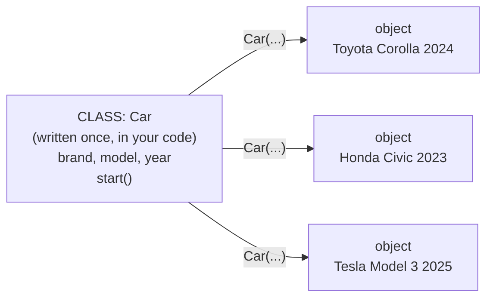
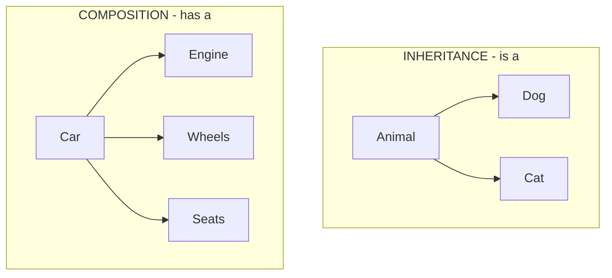
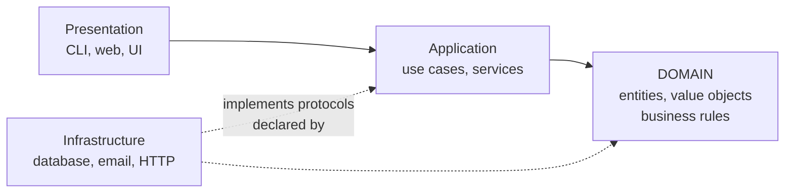

<div align="center">

# 🐍 Complete Object-Oriented Programming with Python

### *From your very first class to professional software design*

**_By Gehan Fernando_**

</div>

---

> [!NOTE]
> **👥 Who this is for:** students, self-learners, junior developers, professionals refreshing their Python OOP, and instructors.
> **🎯 Goal:** learn object-oriented programming from beginner syntax all the way to professional Python design — even if you have *never* written a class before.
> **🧰 Recommended setup:** Python 3.11 or newer, Visual Studio Code or PyCharm, plus `uv`, `pip`, `venv`, `pytest`, and `mypy` or `pyright` for optional type checking.
> **🗓️ Last updated:** 2026-06-25.
## 🗺️ How to read this guide (please read this first!)

> [!IMPORTANT]
> **Do not read this like a novel. Use it like a lab manual.** 🔬
> You learn OOP with your *fingers*, not just your eyes.

For **every** topic, follow this 7-step loop:

| Step | Action | Why it matters |
|:---:|---|---|
| 1️⃣ | **Read** the concept | Understand the idea |
| 2️⃣ | **Type** the example by hand | Muscle memory beats copy-paste |
| 3️⃣ | **Run** it | See it actually work |
| 4️⃣ | **Break** it on purpose | Errors are your best teacher |
| 5️⃣ | **Fix** it | Learn how it fails and recovers |
| 6️⃣ | **Modify** it into your own version | Make the idea yours |
| 7️⃣ | **Add** a small test or exercise | Prove you understood it |

By the end, you should be able to **design, implement, test, and refactor** object-oriented Python applications using modern Python practices. 🚀

---

## 🎨 How to read the colored boxes (your legend)

Throughout this guide you'll see the same friendly icons. Here's what each one means:

| Icon | Label | What it gives you |
|:---:|---|---|
| 📌 | **In plain words** | The idea explained with zero jargon |
| 🌍 | **Real-world analogy** | An everyday-life comparison |
| 🛠️ | **How to use it** | The actual code / steps |
| 🎯 | **When to use it** | The right situations |
| ⚠️ | **When to avoid it** | The traps and wrong situations |
| 💡 | **Pro tip** | A shortcut experts know |
| 🧪 | **Try it yourself** | A hands-on exercise |

Two larger blocks appear at fixed places rather than inline:

| Block | Where it appears | What it gives you |
|---|---|---|
| 🧭 **In practice** | At the end of each numbered section | The five questions you actually need answered before using something: **how** to use it (steps, prerequisites, expected result), **when** to use it, **where** in a real system it belongs, **when _not_ to use it**, and the **best practices** — including the mistakes people make and any safety, performance, or maintenance cost. |
| ✅ **Checkpoint** | At the end of each Part | A teach-back test. If you can answer *“What is this? Why does it matter? How does it work? Can I give an example?”* in your own words, move on. Sample answers are in a collapsible block. |

---

## 🧪 How to run the examples (and how they were checked)

### The four kinds of code block

Because this guide teaches with code, it matters that you can tell at a glance what you are looking at:

| Marker | Meaning | What to do |
|---|---|---|
| *(none)* | **Complete program.** Everything it needs is in the block. | Save as `demo.py`, run `python demo.py` |
| Introduced by **Usage:** | **A usage snippet.** The two or three lines that exercise the class defined in the block **immediately above it**. It is not a program on its own. | Paste it under that block, in the same file |
| **▶️ Continues from §X.Y** | **Continuation.** Needs the class defined in the *named* section, which may be several pages back. | Paste it below that earlier block in the same file |
| **📄 Fragment** | **Part of a multi-file project.** Cannot run alone by design. | Follow the file layout shown beside it |

Blocks that are *meant* to fail are labelled **❌ This example fails on purpose** together with the exact error, so a traceback never leaves you wondering whether you typed something wrong.

> [!TIP]
> **The short rule:** if a block is preceded by the word **Usage:**, it continues from the block
> directly above. Running it on its own gives `NameError: name 'X' is not defined` — which means you
> have found a usage snippet, not a bug.

Where output matters, an **Expected output** block follows the code. Two things in real output vary and are shown generically:

- memory addresses — `<__main__.Car object at 0x...>`
- absolute paths — `/path/to/project/main.py`

### What was actually verified

- **Environment:** CPython **3.12.10** on Windows 11, with **mypy 2.1.0** for every static-typing claim.
- **Method:** every complete-program block was extracted and executed, and its printed output compared against the "Expected output" shown here.
- **Scope of that check:** it confirms the code runs and prints what is claimed on this one interpreter. It does not prove the surrounding prose is complete, nor that behaviour is identical on other Python versions or platforms.
- **Not executed:** fragments belonging to multi-file projects (the capstone in [Section 35](#35-complete-capstone-project-library-management-system), the packaging examples in [Section 26](#26-modules-packages-environments-and-project-structure), and the `pytest` files in [Section 31](#31-unit-testing-oop-code)). These were reviewed by reading, not by running, and are labelled **📄 Fragment**.
- **Version-dependent features** are labelled inline: `match` statements need 3.10+, `Self` needs 3.11+, and `@dataclass(slots=True)` needs 3.10+.
### A note on `sys.getsizeof`, timings, and memory figures

Any number this guide reports for object size or speed came from the machine above. Those figures are implementation-specific — run them yourself rather than quoting them.

---

## 🐍 Python's three levels of enforcement (read this before Section 5)

This is the single most important thing to understand about Python OOP, and it is where people coming from Java or C# go wrong most often.

When another language says `private`, the compiler *stops* you. Python has three separate mechanisms that look similar and behave very differently:

| Level | Mechanism | Enforced by | Can you bypass it? |
|---|---|---|---|
| **1. Convention** | `_name` (one underscore) | Nothing — it is a comment to humans | Yes, trivially |
| **2. Static check** | Type hints, `Protocol`, `mypy` | A separate tool you choose to run | Yes — the program still runs |
| **3. Runtime** | `@property`, `raise`, `__slots__`, `frozen=True` | The interpreter, while running | No |

### See all three in one class

This is a complete program. Each `try` block probes one of the three levels, so you can see exactly which ones Python actually stops.

```python
class Account:
    def __init__(self, balance: float) -> None:
        self._balance = balance

    @property
    def balance(self) -> float:
        return self._balance

    def deposit(self, amount: float) -> None:
        if amount <= 0:
            raise ValueError("Amount must be positive.")
        self._balance += amount

a = Account(100.0)

a._balance = 999999.0                 # level 1: no protection at all
print(a.balance)

try:
    a.deposit("not a number")          # level 2: no runtime protection either
except TypeError as e:
    print(f"TypeError: {e}")

try:
    a.balance = 5.0                    # level 3: THIS is enforced
except AttributeError as e:
    print(f"AttributeError: {e}")

try:
    a.deposit(-10)                     # level 3: THIS is enforced
except ValueError as e:
    print(f"ValueError: {e}")
```

**Expected output:**

```
999999.0
TypeError: '<=' not supported between instances of 'str' and 'int'
AttributeError: property 'balance' of 'Account' object has no setter
ValueError: Amount must be positive.
```

### What each line teaches

- **`a._balance = 999999.0` succeeded.** The underscore is documentation. Anyone *can* reach in; the convention says they accept the consequences when your internals change. Python's philosophy here is "we are all consenting adults" — it optimises for the person debugging at 3 a.m. over the person trying to prevent misuse.
- **`a.deposit("not a number")` was not caught by the hint.** `amount: float` is not checked at runtime. The error that eventually arrives is a confusing `TypeError` from deep inside the comparison, not a clear "wrong argument type." Run `mypy` and you get the clear message *before* the program starts.
- **`a.balance = 5.0` was blocked.** A `@property` with no setter is real, interpreter-enforced protection.
- **`a.deposit(-10)` was blocked.** An explicit `raise` is the other reliable mechanism.

### The practical rule

> **If a rule genuinely must hold, enforce it at level 3** — a property, an explicit `raise`, `frozen=True`, or a validating constructor. Use levels 1 and 2 to *communicate intent* and to *catch mistakes early*, never as your only line of defence.

Every later chapter depends on this distinction, so the guide flags which level is in play wherever it matters — especially [Section 7 (Access conventions)](#7-access-conventions), [Section 13 (Protocols)](#13-protocols-and-interfaces), and [Section 20 (None safety)](#20-none-safety-and-optional-values).

---

## 📚 Table of contents

The 39 sections are grouped into five parts. Each part ends with a ✅ **Checkpoint** — a short teach-back test you can use to decide whether to move on.

| Part | Sections | What you can do at the end of it |
|---|:---:|---|
| 🟢 **1 · Foundations** | 1–8 | Write a class with rules that cannot be bypassed, and explain what an object *is* |
| 🟣 **2 · The four pillars, in depth** | 9–15 | Choose correctly between inheritance, composition, protocols, and abstract base classes |
| 🟠 **3 · Building real types** | 16–26 | Use generics, collections, equality, dataclasses, `None` safety, and errors properly — and lay a project out |
| 🔴 **4 · Professional design** | 27–33 | Apply SOLID and dependency injection *and name what each one costs* |
| 🟡 **5 · Practice and reference** | 34–39 | Build a complete application, and look things up afterwards |

<details>
<summary><b>Click to expand the full 39-topic map</b></summary>

**🟢 Part 1 — Foundations**

1. [Prerequisites and setup](#1-prerequisites-and-setup)
2. [What OOP means](#2-what-oop-means)
3. [The four pillars of OOP](#3-the-four-pillars-of-oop)
4. [Classes and objects](#4-classes-and-objects)
5. [Attributes, properties, and methods](#5-attributes-properties-and-methods)
6. [Constructors and object initialization](#6-constructors-and-object-initialization)
7. [Access conventions](#7-access-conventions)
8. [Object lifecycle and resource management](#8-object-lifecycle-and-resource-management)

**🟣 Part 2 — The four pillars, in depth**

9. [Encapsulation](#9-encapsulation)
10. [Abstraction](#10-abstraction)
11. [Inheritance](#11-inheritance)
12. [Polymorphism](#12-polymorphism)
13. [Protocols and interfaces](#13-protocols-and-interfaces)
14. [Abstract base classes vs protocols](#14-abstract-base-classes-vs-protocols)
15. [Composition and object relationships](#15-composition-and-object-relationships)

**🟠 Part 3 — Building real types**

16. [Generics with OOP](#16-generics-with-oop)
17. [Collections and object queries](#17-collections-and-object-queries)
18. [Equality and object comparison](#18-equality-and-object-comparison)
19. [Classes, dataclasses, named tuples, and immutability](#19-classes-dataclasses-named-tuples-and-immutability)
20. [None safety and optional values](#20-none-safety-and-optional-values)
21. [Exceptions and custom domain errors](#21-exceptions-and-custom-domain-errors)
22. [Class attributes, constants, static methods, and utility modules](#22-class-attributes-constants-static-methods-and-utility-modules)
23. [Callbacks, events, and observer-style design](#23-callbacks-events-and-observer-style-design)
24. [Extension-style techniques](#24-extension-style-techniques)
25. [Special methods, operators, nested classes, and code organization](#25-special-methods-operators-nested-classes-and-code-organization)
26. [Modules, packages, environments, and project structure](#26-modules-packages-environments-and-project-structure)

**🔴 Part 4 — Professional design**

27. [SOLID principles](#27-solid-principles)
28. [Dependency injection](#28-dependency-injection)
29. [Design patterns for Python OOP](#29-design-patterns-for-python-oop)
30. [Domain modeling and architecture](#30-domain-modeling-and-architecture)
31. [Unit testing OOP code](#31-unit-testing-oop-code)
32. [Refactoring OOP code](#32-refactoring-oop-code)
33. [Common OOP mistakes](#33-common-oop-mistakes)

**🟡 Part 5 — Practice and reference**

34. [Hands-on projects](#34-hands-on-projects)
35. [Complete capstone project: Library Management System](#35-complete-capstone-project-library-management-system)
36. [Professional checklist](#36-professional-checklist)
37. [30-day learning plan](#37-30-day-learning-plan)
38. [Glossary](#38-glossary)
39. [Reference links](#39-reference-links)

</details>

---

<div align="center">

# 🟢 PART 1 — FOUNDATIONS

*The vocabulary and the mechanics. Sections 1-8 are the ground everything else stands on.*

</div>

---

# 1. Prerequisites and setup

> 📌 **In plain words:** Before building with OOP "LEGO bricks," you need to know what a brick is. This section makes sure you have the basics and a working Python playground.

## 1.1 ✅ What you should know first

Before OOP, you should be comfortable with these building blocks:

- Variables
- Data types
- Operators
- `if`, `elif`, `else`
- `match` basics (if using Python 3.10 or newer)
- Loops
- Lists, tuples, dictionaries, and sets
- Basic functions
- Basic input/output
- Basic debugging
- Importing modules

> [!TIP]
> **You do NOT need** Django, Flask, FastAPI, databases, cloud knowledge, or advanced data science to start OOP. Those come later. OOP is a *foundation*, not an advanced topic.

## 1.2 ⬇️ Install Python

Install Python from the official site:

- https://www.python.org/downloads/

Check your installation:

```bash
python --version
```

Depending on your operating system, you may need:

```bash
python3 --version
```

🛠️ **Create a project folder and a virtual environment (your isolated sandbox):**

```bash
mkdir oop_practice
cd oop_practice
python -m venv .venv
```

Activate the virtual environment:

```bash
# Windows PowerShell
.venv\Scripts\Activate.ps1

# macOS/Linux
source .venv/bin/activate
```

Create your first Python file and run it:

```bash
touch main.py
python main.py
```

Install useful development tools:

```bash
pip install pytest mypy ruff
```

> 🌍 **Real-world analogy:** A virtual environment (`.venv`) is like a **separate toolbox for each project**. Tools in one toolbox never get mixed up with another project's tools, so nothing breaks unexpectedly.

📁 **Recommended simple project layout:**

```text
oop_practice/
├── .venv/
├── src/
│   └── oop_practice/
│       ├── __init__.py
│       └── main.py
├── tests/
│   └── test_examples.py
└── pyproject.toml
```

> ### 🧭 In practice — a virtual environment and project layout
>
> **How to use it.** Install Python 3.11 or newer, then from your project folder run `python -m venv .venv`, activate it (`.venv\Scripts\Activate.ps1` on Windows, `source .venv/bin/activate` elsewhere), and `pip install pytest mypy ruff`. **Prerequisite:** nothing but the Python installer. **Expected result:** `python --version` reports 3.11+, and `pip list` shows only the packages you just installed — not the dozens your operating system or another project put there.
>
> **When to use it.** At the very start of every project, before you install the first third-party package. The cost is about thirty seconds; the cost of skipping it is discovered months later, when two projects need different versions of the same library and one of them stops working.
>
> **Where to use it.** On your own machine while learning, and identically in continuous-integration pipelines and Docker images — the same three commands work in all three places. **Scenario:** you are learning from this guide with `pytest 8`, and you also help on an older project pinned to `pytest 6`. Two virtual environments keep both working, on one computer, with no conflict.
>
> **When _not_ to use it.** For a single throwaway script that imports nothing outside the standard library, a virtual environment is ceremony with no benefit. For command-line *tools* you want available everywhere (`ruff`, `black`, `httpie`), use `pipx` instead — it gives each tool its own hidden environment so they cannot break each other.
>
> **Best practices.** Never `pip install` into the system Python; on Linux and macOS that can damage packages your operating system depends on. Add `.venv/` to `.gitignore` and commit `pyproject.toml` instead — the environment is rebuildable, so it does not belong in version control. Recreating a broken environment (delete `.venv`, run the two commands again) is almost always faster than debugging one.


---

# 2. What OOP means

> 📌 **In plain words:** Object-Oriented Programming is a way of designing software around **objects** — self-contained "things" that bundle their data and the actions you can perform on that data, all in one place.

> 🌍 **Real-world analogy:** Think of a **vending machine**. It has *data* (how much money you inserted, what's in stock) and *behavior* (accept coins, dispense a snack, give change). You don't reach inside and rearrange the wiring — you press the buttons it *offers* you. An object works exactly the same way.

An object combines four things:

| Ingredient | Meaning | Vending-machine example |
|---|---|---|
| 🧾 **Data** | attributes | money inserted, stock count |
| ⚙️ **Behavior** | methods | dispense snack, give change |
| 📏 **Rules** | validation & business logic | "no snack unless enough money" |
| 🆔 **Identity** | what makes this object unique | *this* machine vs. the one next door |

🛠️ **Example — a bank account modeled as an object:**

```python
class BankAccount:
    def __init__(self, account_number: str, opening_balance: float) -> None:
        if opening_balance < 0:
            raise ValueError("Opening balance cannot be negative.")

        self.account_number = account_number
        self._balance = opening_balance

    def deposit(self, amount: float) -> None:
        if amount <= 0:
            raise ValueError("Amount must be positive.")

        self._balance += amount

    def get_balance(self) -> float:
        return self._balance
```

**Usage:**

```python
account = BankAccount("ACC-1001", 100.0)
account.deposit(50.0)
print(account.get_balance())
```

This class represents a real concept: a bank account. It holds money (data), lets you deposit (behavior), and refuses negative balances (rules).

> 🎯 **When to use OOP:** whenever you're modeling "things" that have both data *and* rules about that data — accounts, orders, users, products, documents. If you find yourself passing the same bundle of variables into many functions, that bundle probably wants to be an object.

> [!NOTE]
> **🐍 Python style notes:**
> - Python uses `self` to refer to the current object.
> - Python usually uses `snake_case` for methods and attributes.
> - Python relies on **conventions** more than strict access modifiers.
> - Type hints (like `: float`) are optional at runtime, but very useful for readability and tools.

> ### 🧭 In practice — modelling something as an object
>
> **How to use it.** Four steps. **(1)** Name the thing — usually a noun from the business: `Order`, `Account`, `Booking`. **(2)** List the data it holds. **(3)** List the operations people perform on it. **(4)** Write down the rules that must never be broken, and enforce them in `__init__` and in the methods, not in the calling code. **Prerequisite:** you can write a function and a dictionary. **Expected result:** there is no way for code outside the class to put an instance into an invalid state.
>
> **When to use it.** When you notice the same bundle of variables being passed into function after function — `def charge(account_number, balance, currency, overdraft_limit)` repeated six times. That bundle is an object waiting to be named. Also when a rule about some data has to hold everywhere, forever.
>
> **Where to use it.** The **domain layer** of an application — the part that models the business, as opposed to the screens, the database driver, or the web framework. **Scenario:** an online shop's checkout. `Order` guarantees that it always has at least one line, that the total always equals the sum of its lines, and that a shipped order cannot be edited. Those three guarantees hold whether the order arrived from the website, a phone operator, or a nightly import job — because they live in the object, not in the three different code paths.
>
> **When _not_ to use it.** For a twenty-line script, a single data transformation, or pure mathematics with no stored state. A dictionary plus two functions is clearer than a class with no rules, and modern Python offers better middle grounds: a `dataclass` for a bag of values ([§19.2](#192--dataclass)), a plain module for a group of related functions ([§22.5](#225--utility-modules)).
>
> **Best practices.** Start from the rules, not from the getters and setters — a class with nothing but `get_x`/`set_x` has not encapsulated anything, it has only made the data harder to reach. Keep the public surface small: every public method is a promise you have to keep. And resist creating a class purely to group functions; in Python, a module already does that job.


---

# 3. The four pillars of OOP

> 📌 **In plain words:** All of OOP rests on four big ideas. Learn these names — every job interview and every codebase uses them.

| 🏛️ Pillar | Meaning | Python tools |
|---|---|---|
| **Encapsulation** | Protect data and expose safe operations | naming conventions, properties, methods |
| **Abstraction** | Show what matters, hide the details | abstract base classes, protocols, duck typing |
| **Inheritance** | Create specialized types from base types | subclassing, `super()`, method overriding |
| **Polymorphism** | Use one abstraction with many implementations | duck typing, protocols, ABCs, overriding |

💡 **Simple memory rule:**

- 🔒 **Encapsulation** *protects.*
- 🎭 **Abstraction** *simplifies.*
- 🧬 **Inheritance** *reuses and specializes.*
- 🔀 **Polymorphism** *makes code flexible.*

> 🌍 **Real-world analogy for all four (a car):**
> - **Encapsulation** 🔒 — you use the pedals, not the raw fuel injectors.
> - **Abstraction** 🎭 — the dashboard shows speed, not engine physics.
> - **Inheritance** 🧬 — a *sports car* is a *car* with extra abilities.
> - **Polymorphism** 🔀 — every car has a "brake," but each brakes in its own way.

### 🦆 Python's bonus idea: duck typing

Python adds an important idea: **duck typing**.

> "If it walks like a duck and quacks like a duck, it's a duck." 🦆

If an object *behaves* like what your code needs, Python often does not care about its exact class.

```python
class PdfReport:
    def print_report(self) -> None:
        print("Printing PDF report.")

class ExcelReport:
    def print_report(self) -> None:
        print("Printing Excel report.")

def print_any_report(report) -> None:
    report.print_report()

print_any_report(PdfReport())
print_any_report(ExcelReport())
```

> 🎯 **When it helps:** `print_any_report` doesn't care *what* the object is — only that it can `print_report()`. This keeps code flexible and short.

> ### 🧭 In practice — the four pillars, as a working vocabulary
>
> **How to use it.** Read the four names as a **checklist for reviewing a design**, not as four steps to perform. Take any class you have written and ask: what does it protect (encapsulation), what does it hide (abstraction), what does it genuinely specialise (inheritance), and what can be swapped for it (polymorphism)? **Expected result:** you can justify each class in one sentence, or you discover you cannot — which is the useful outcome.
>
> **When to use it.** In code review, in design discussions, and in interviews — these four words are the shared language for talking about structure. You will also meet them in every codebase's documentation and every senior developer's feedback.
>
> **Where to use it.** Conversation and review rather than any particular layer of a system. **Scenario:** a colleague proposes `class PdfInvoice(Invoice)` and `class EmailInvoice(Invoice)`. The vocabulary lets you say precisely what is wrong in one sentence — “that is not specialisation, it is a delivery method; an invoice **has a** delivery channel” — instead of a vague feeling that it looks off.
>
> **When _not_ to use it.** Do not use them as *goals*. “Make this more polymorphic” is not a requirement; it is a property some designs happen to have. Code written to display all four pillars is usually worse than code written to solve the problem. Beginners in particular over-apply inheritance because it is the most visible of the four.
>
> **Best practices.** In real professional Python, encapsulation and polymorphism appear constantly, abstraction appears at boundaries between layers, and deep inheritance is rare. Learn the names so you can read other people's code and reviews — then judge each design on whether it is easy to change, which is the thing the four pillars are all ultimately about.


---

# 4. Classes and objects

> 📌 **In plain words:** A **class** is the recipe. An **object** is the cake you bake from it. One recipe → many cakes.

## 4.1 🏗️ Class — the blueprint

A class is a blueprint.

```python
class Car:
    def __init__(self, brand: str, model: str, year: int) -> None:
        self.brand = brand
        self.model = model
        self.year = year

    def start(self) -> None:
        print(f"{self.brand} {self.model} is starting.")
```

> 🌍 **Analogy:** The `Car` class is like the **architect's drawing** of a house. No one lives in a drawing — but you can build many houses from it.



**In words, if the diagram does not render:** one `Car` class sits in your source file. Each call to
`Car(...)` builds a separate object in memory with its own `brand`, `model`, and `year`. The class
defines *what attributes exist*; each object holds *the actual values*.

| | Class | Object |
|---|---|---|
| Exists | Once, in your source code | Many times, in memory while the program runs |
| Costs | Nothing at runtime | Memory |
| Defines | Which attributes and methods exist | The actual values |
| Analogy | Blueprint, recipe, mould | House, cake, casting |

## 4.2 🚗 Object — an instance of a class

An **object** (or **instance**) is one concrete thing built from the class.

**▶️ Continues from §4.1** — the snippets in 4.2 to 4.4 all build on the `Car` class above. Paste them into the same file, below the class, and run it. At the end of 4.4 you will find the whole thing as one complete program.

```python
car = Car("Toyota", "Corolla", 2024)
car.start()
```

**Expected output:**

```
Toyota Corolla is starting.
```

### 📌 What `Car(...)` actually did

Reading left to right, four things happened:

1. Python created a new, empty `Car` object in memory.
2. It called `__init__` on that object, passing `"Toyota"`, `"Corolla"`, and `2024`.
3. `__init__` stored those three values on the object as `self.brand`, `self.model`, and `self.year`.
4. The finished object was handed back and bound to the name `car`.

`self` inside `__init__` refers to *that specific object*. You never pass it yourself — Python supplies it.

### 📌 Each object is independent

This is the point of classes, so it is worth seeing rather than being told:

```python
class Car:
    def __init__(self, brand: str, model: str, year: int) -> None:
        self.brand = brand
        self.model = model
        self.year = year

    def start(self) -> None:
        print(f"{self.brand} {self.model} is starting.")

car_a = Car("Toyota", "Corolla", 2024)
car_b = Car("Honda", "Civic", 2023)

car_a.start()
car_b.start()

car_a.year = 2025                   # changing one...
print(car_a.year, car_b.year)       # ...does not touch the other
print(car_a is car_b)               # False — two distinct objects
```

**Expected output:**

```
Toyota Corolla is starting.
Honda Civic is starting.
2025 2023
False
```

One class, two objects, two independent sets of data. The class is the drawing; each object is a house built from it.

> 🎯 **When to use:** create a new object every time you need a new, independent "thing" with its own data.

## 4.3 🧾 Object attributes

**Attributes** are the values stored on an object. You read them with a dot.

**▶️ Continues from §4.1.**

```python
print(car.brand)     # Toyota
print(car.model)     # Corolla
print(car.year)      # 2024
```

**Expected output:**

```
Toyota
Corolla
2024
```

### ⚠️ Python lets you add attributes that were never declared

This surprises people arriving from stricter languages, and it is worth knowing early because it turns typos into silent bugs:

```python
class Car:
    def __init__(self, brand: str, model: str, year: int) -> None:
        self.brand = brand
        self.model = model
        self.year = year

car = Car("Toyota", "Corolla", 2024)

car.colour = "red"           # never mentioned in the class — allowed anyway
print(car.colour)            # red

car.yaer = 2030              # a TYPO for 'year' — silently creates a new attribute
print(car.year)              # 2024 — the real value is unchanged
print(car.__dict__)          # you can see both
```

**Expected output:**

```
red
2024
{'brand': 'Toyota', 'model': 'Corolla', 'year': 2024, 'colour': 'red', 'yaer': 2030}
```

`__dict__` is the dictionary where an ordinary object keeps its attributes. Both additions are visible in it: the deliberate `colour` and the accidental `yaer`, sitting side by side with no way to tell them apart.

The `yaer` typo did not raise anything. It created a brand-new attribute and left `year` alone, so the program carries on with stale data.

**Three ways to protect yourself**, in increasing strictness:

| Approach | Catches the typo | Covered in |
|---|---|---|
| Run `mypy` or `pyright` | Before the program runs | [Section 20.6](#206--use-static-analysis) |
| `__slots__` | At runtime, immediately | [Section 19.7](#197--slots) |
| `@dataclass(frozen=True)` | At runtime, blocks all assignment | [Section 19.3](#193--frozen-dataclass) |

This is the "level 1 / level 2 / level 3" distinction from the [enforcement section](#-pythons-three-levels-of-enforcement-read-this-before-section-5), showing up for the first time.

## 4.4 🏷️ Object creation with keyword arguments

Keyword arguments name each value at the call site, which makes the code readable and makes a whole class of mistakes impossible.

**▶️ Continues from §4.1.**

```python
car = Car(
    brand="Toyota",
    model="Corolla",
    year=2024,
)
car.start()
```

**Expected output:**

```
Toyota Corolla is starting.
```

### 📌 Why this matters more than it looks

Positional arguments are silently order-sensitive. Swap two of the same type and nothing complains:

```python
class Car:
    def __init__(self, brand: str, model: str, year: int) -> None:
        self.brand = brand
        self.model = model
        self.year = year

    def start(self) -> None:
        print(f"{self.brand} {self.model} is starting.")

wrong = Car("Corolla", "Toyota", 2024)     # brand and model swapped
wrong.start()                               # no error — just wrong

right = Car(brand="Toyota", model="Corolla", year=2024)
right.start()
```

**Expected output:**

```
Corolla Toyota is starting.
Toyota Corolla is starting.
```

Both are strings, so nothing — not Python, not a type checker — can detect the swap. Keyword arguments remove the possibility.

### 💡 Forcing keywords with `*`

If a constructor is genuinely too easy to get wrong, you can *require* keywords. Everything after a bare `*` must be passed by name:

```python
class Car:
    def __init__(self, *, brand: str, model: str, year: int) -> None:
        self.brand = brand
        self.model = model
        self.year = year

car = Car(brand="Toyota", model="Corolla", year=2024)      # fine
print(car.brand)

try:
    Car("Toyota", "Corolla", 2024)                          # now rejected
except TypeError as e:
    print(f"TypeError: {e}")
```

**Expected output:**

```
Toyota
TypeError: Car.__init__() takes 1 positional argument but 4 were given
```

> 🎯 **When to force it:** three or more parameters, or two of the same type that could be transposed. For a one- or two-parameter constructor such as `Point(x, y)` it is unnecessary ceremony.

### ✅ The whole chapter as one runnable program

Save this as `cars.py` and run `python cars.py`:

```python
class Car:
    def __init__(self, brand: str, model: str, year: int) -> None:
        self.brand = brand
        self.model = model
        self.year = year

    def start(self) -> None:
        print(f"{self.brand} {self.model} is starting.")

    def describe(self) -> str:
        return f"{self.year} {self.brand} {self.model}"

# 4.2 — create objects
car = Car("Toyota", "Corolla", 2024)
car.start()

# 4.3 — read attributes
print(car.brand, car.model, car.year)

# 4.4 — keyword arguments
other = Car(brand="Honda", model="Civic", year=2023)
print(other.describe())

# independence
print(car.describe(), "|", other.describe())
```

**Expected output:**

```
Toyota Corolla is starting.
Toyota Corolla 2024
2023 Honda Civic
2024 Toyota Corolla | 2023 Honda Civic
```

> 💡 **Pro tip:** prefer keyword arguments when a constructor has several parameters. `Car("Toyota", "Corolla", 2024)` is easy to get wrong; `Car(brand=..., model=..., year=...)` documents itself.

## 4.5 ⚡ Dataclass option — less typing

For simple data containers, Python's `dataclasses` module can reduce boilerplate (it writes `__init__` for you).

```python
from dataclasses import dataclass

@dataclass
class Car:
    brand: str
    model: str
    year: int

    def start(self) -> None:
        print(f"{self.brand} {self.model} is starting.")
```

> 🎯 **When to use a dataclass:** when the class mostly *holds data*. (Deep dive in [Section 19](#19-classes-dataclasses-named-tuples-and-immutability).)

## 4.6 🧪 Hands-on exercise

Create a `Student` class with:

- `name`
- `age`
- `grade`
- `display_info()`

**Expected result:**

```text
Name: Anna
Age: 22
Grade: A
```

> [!TIP]
> **Write it before you open the solution.** You need `__init__` with three parameters, three
> assignments to `self`, and one method that prints three lines. Everything you need is in §4.1–4.4.

<details>
<summary><b>🔑 Solution</b></summary>

```python
class Student:
    def __init__(self, name: str, age: int, grade: str) -> None:
        self.name = name
        self.age = age
        self.grade = grade

    def display_info(self) -> None:
        print(f"Name: {self.name}")
        print(f"Age: {self.age}")
        print(f"Grade: {self.grade}")

student = Student("Anna", 22, "A")
student.display_info()
```

**Expected output:**

```
Name: Anna
Age: 22
Grade: A
```

**What to check in your own version.** Did you store the values on `self`, rather than in local
variables that vanish when `__init__` returns? Did `display_info` take `self` as its first
parameter? Those two are where almost every first attempt goes wrong.

**Then extend it.** Add a second student and print both. Two independent objects from one class is
the entire point of §4 — see it happen rather than take it on trust.

</details>

> ### 🧭 In practice — classes and objects
>
> **How to use it.** Write `class Car:` with an `__init__` that takes the values each car needs and stores them on `self`. Create instances with `Car(brand="Toyota", model="Corolla", year=2024)`. **Prerequisite:** functions and parameters. **Expected result:** each call to `Car(...)` returns a separate object with its own data — change `car_a.year` and `car_b.year` is untouched, and `car_a is car_b` is `False`.
>
> **When to use it.** Whenever you need several independent things of the same shape, each carrying its own values. One class, many objects: one `Product` class, ten thousand products.
>
> **Where to use it.** Everywhere objects are created — but the *creation* usually belongs near the edges of your program (reading a request, loading a file), while the class itself lives in the domain layer. **Scenario:** a CSV import reads 5,000 rows and calls `Product(...)` 5,000 times; every product validates itself on the way in, so a malformed row fails at the row that caused it rather than corrupting a later report.
>
> **When _not_ to use it.** When there will only ever be one of something with no rules attached — module-level constants or a simple dictionary are clearer. And when the class is a pure bag of values, `@dataclass` ([§4.5](#45--dataclass-option--less-typing)) writes `__init__`, `__repr__`, and `__eq__` for you; writing them by hand is wasted work and one more place for a typo.
>
> **Best practices.** Prefer keyword arguments once a constructor takes three or more parameters — `Car("Corolla", "Toyota", 2024)` silently swaps two strings and nothing, not even `mypy`, can detect it. Be aware that Python lets you invent attributes that were never declared, so `car.yaer = 2030` creates a *new* attribute instead of raising; a type checker, `__slots__`, or a frozen dataclass are the three defences, in increasing strictness.


---

# 5. Attributes, properties, and methods

> 📌 **In plain words:** **Attributes** are what an object *knows*. **Methods** are what an object *does*. **Properties** are attributes with a bouncer at the door — checking values before letting them in.

## 5.1 Attributes

Attributes store data inside an object.

```python
class Product:
    def __init__(self) -> None:
        self._price = 0.0
```

> [!NOTE]
> Python has no truly private fields like some other languages. A leading underscore (`_price`) means: **"internal detail; please don't touch this directly from outside."** It's a polite sign, not a locked door.

## 5.2 🌐 Public attributes

For simple data, public attributes are perfectly normal in Python.

```python
class Product:
    def __init__(self, name: str, price: float) -> None:
        self.name = name
        self.price = price
```

**Usage:**

```python
product = Product("Mouse", 25.0)
print(product.name)
print(product.price)
```

> 🎯 **When to use plain public attributes:** when there are no rules to enforce — any value is acceptable.

## 5.3 🛡️ Property with validation

Use `@property` when you need validation or computed behavior.

```python
class Product:
    def __init__(self, name: str, price: float) -> None:
        self.name = name
        self._price = 0.0
        self.price = price

    @property
    def price(self) -> float:
        return self._price

    @price.setter
    def price(self, value: float) -> None:
        if value < 0:
            raise ValueError("Price cannot be negative.")

        self._price = value
```

**Usage:**

```python
product = Product("Keyboard", 50.0)
product.price = 60.0
```

> 🌍 **Analogy:** A property is a **security guard at a nightclub door**. To the outside, `product.price` looks like an ordinary attribute — but every time you set it, the guard (`setter`) checks the value first and rejects anything invalid.

> 🎯 **When to use:** when setting/reading a value needs a rule, a calculation, or logging — but you still want the clean `object.attribute` syntax.

## 5.4 🔒 Read-only property

A read-only property has a getter but no setter — the outside world can look, but not change.

```python
from datetime import datetime, timezone

class Order:
    def __init__(self) -> None:
        self._created_at = datetime.now(timezone.utc)

    @property
    def created_at(self) -> datetime:
        return self._created_at
```

> 🎯 **When to use:** for values that should never change after creation, like a "created at" timestamp or an ID.

## 5.5 🚪 Private setter style

Python does not have private setters, but you can expose a read-only property and update it only through methods.

```python
class BankAccount:
    def __init__(self) -> None:
        self._balance = 0.0

    @property
    def balance(self) -> float:
        return self._balance

    def deposit(self, amount: float) -> None:
        if amount <= 0:
            raise ValueError("Amount must be positive.")
        self._balance += amount
```

> 💡 **Pro tip:** This is the classic "you can *read* the balance, but you can only *change* it through `deposit()`/`withdraw()`" pattern — the heart of safe money handling.

## 5.6 🧮 Computed property

A property can *calculate* its value on the fly instead of storing it.

```python
class OrderLine:
    def __init__(self, unit_price: float, quantity: int) -> None:
        self.unit_price = unit_price
        self.quantity = quantity

    @property
    def total(self) -> float:
        return self.unit_price * self.quantity
```

> 🎯 **When to use:** when a value is *derived* from other values (`total = price × quantity`). Storing it separately risks the two getting out of sync.

## 5.7 ⚙️ Methods

Methods define behavior.

```python
class Calculator:
    def add(self, a: int, b: int) -> int:
        return a + b
```

**Usage:**

```python
calculator = Calculator()
print(calculator.add(2, 3))
```

## 5.8 🔤 Method naming

Common Python convention (verbs, lowercase, underscores):

```text
calculate_total
send_email
get_by_id
is_available
```

> ⚠️ **Avoid** C#/Java style names such as `CalculateTotal` in normal Python code. Python uses `snake_case`.

## 5.9 🔁 Method overloading in Python

> 📌 **In plain words:** Some languages let you define the *same method name* several times with different parameters. Python does **not** — the last definition simply wins.

If you define the same method name twice, the second definition replaces the first. Instead, Python offers three clean alternatives:

**Option 1 — Default arguments:**

```python
class Calculator:
    def add(self, a: float, b: float, c: float = 0) -> float:
        return a + b + c
```

**Option 2 — Variable arguments:**

```python
class Calculator:
    def add(self, *numbers: float) -> float:
        return sum(numbers)
```

**Option 3 — `functools.singledispatchmethod`** (only when you truly need type-based dispatch):

```python
from functools import singledispatchmethod

class Printer:
    @singledispatchmethod
    def print_value(self, value) -> None:
        print(value)

    @print_value.register
    def _(self, value: int) -> None:
        print(f"Integer: {value}")

    @print_value.register
    def _(self, value: str) -> None:
        print(f"String: {value}")
```

> 🎯 **When to use which:** reach for **default arguments** first (simplest), **`*args`** when the count varies, and **`singledispatchmethod`** only when behavior genuinely depends on the *type* of the argument.

> ### 🧭 In practice — attributes, properties, and methods
>
> **How to use it.** Start with a plain public attribute (`self.price = price`). The moment that value acquires a rule, rename the stored field to `self._price` and add a `@property` with the public name plus a `@price.setter` that validates. **Prerequisite:** §4. **Expected result:** calling code keeps working unchanged — `product.price = 60` still reads the same — but `product.price = -5` now raises `ValueError`.
>
> **When to use it.** Use a **property** when reading or writing a value needs validation, a calculation, or a side effect. Use a **read-only property** for anything decided at creation and never changed (a created-at timestamp, an ID). Use a **computed property** whenever a value is derived from others, such as `total = unit_price * quantity`.
>
> **Where to use it.** Inside domain classes that own business rules, and in any class whose data other code will touch. **Scenario:** a `BankAccount` exposes `balance` as read-only and offers `deposit()` and `withdraw()` as the only ways to change it. The rule “balance never goes negative” is then enforced in exactly two methods rather than in every screen, script, and API handler that touches money.
>
> **When _not_ to use it.** Do not wrap every attribute in a property “just in case” — that is Java habit, not Python. With no rule to enforce, a public attribute is correct, and you can always promote it to a property later without breaking callers. Avoid putting expensive work (a database call, a big loop) behind a property: readers assume `obj.x` is cheap, so use a method named `fetch_x()` when it is not.
>
> **Best practices.** Python has no method overloading — defining `add` twice simply replaces the first. Reach for default arguments first, `*args` when the count varies, and `functools.singledispatchmethod` only when behaviour genuinely depends on the argument's *type*. Never store a value you can compute: a stored `total` that someone forgets to update produces a wrong invoice, and a computed property makes that failure impossible.


---

# 6. Constructors and object initialization

> 📌 **In plain words:** A **constructor** is the setup routine that runs the moment an object is born. In Python it's the `__init__` method — it fills in the object's starting data.

> 🌍 **Analogy:** Buying a new phone. The constructor is the **first-time setup wizard**: choose language, sign in, set a name. After it finishes, the phone (object) is ready to use.

In Python, `__init__` initializes an object *after* it is created.

## 6.1 Basic constructor

```python
class Student:
    def __init__(self, name: str, age: int) -> None:
        self.name = name
        self.age = age
```

**Usage:**

```python
student = Student("Anna", 22)
```

## 6.2 🎚️ Default values

Give parameters defaults so callers can skip them.

```python
class Student:
    def __init__(self, name: str = "Unknown") -> None:
        self.name = name
```

**Usage:**

```python
student = Student()
```

> 🎯 **When to use:** when a sensible fallback exists (e.g., `quantity=1`, `country="US"`).

## 6.3 🏭 Constructor alternatives with class methods

Python does not support multiple `__init__` methods. Use **class methods as named constructors** ("factory methods").

```python
class Product:
    def __init__(self, name: str, price: float) -> None:
        self.name = name
        self.price = price

    @classmethod
    def free(cls, name: str) -> "Product":
        return cls(name, 0.0)
```

**Usage:**

```python
product = Product.free("Sample")
```

> 🌍 **Analogy:** A coffee shop has one machine (`__init__`) but named buttons on top of it — "Espresso," "Latte," "Free Sample." `Product.free(...)` is a friendly button that pre-fills the details for you.

> 🎯 **When to use:** when you want several clear, well-named ways to build the same object.

## 6.4 ✅ Constructor validation

Reject bad data at the moment of creation — never let an invalid object exist.

```python
class Product:
    def __init__(self, name: str, price: float) -> None:
        if not name.strip():
            raise ValueError("Name is required.")
        if price < 0:
            raise ValueError("Price cannot be negative.")

        self.name = name
        self.price = price
```

> 💡 **Pro tip:** "Fail fast." If an object can't be valid, refuse to build it. This prevents mysterious bugs much later.

## 6.5 🧬 Base constructor with `super()`

When a class inherits from another, call the parent's constructor with `super()`.

```python
class Person:
    def __init__(self, name: str) -> None:
        self.name = name

class Student(Person):
    def __init__(self, name: str, grade: str) -> None:
        super().__init__(name)
        self.grade = grade
```

> 🌍 **Analogy:** Filling out a form. `super().__init__(name)` fills in the general "Person" section; then the `Student` adds its own extra fields.

## 6.6 🔐 Private constructor style

Python cannot make constructors truly private, but you can *signal intent* and provide factory methods.

```python
class AppSettings:
    def __init__(self, environment: str) -> None:
        self.environment = environment

    @classmethod
    def create_development(cls) -> "AppSettings":
        return cls("Development")
```

If you need stricter control, validate inside `__init__` or use a factory function.

## 6.7 🧱 `__new__`

> 📌 **In plain words:** `__new__` *creates* the object; `__init__` *fills it in*. You rarely touch `__new__` in everyday code.

Common uses:

- Immutable types
- Singleton-like behavior
- Subclassing built-in immutable types

```python
class UppercaseString(str):
    def __new__(cls, value: str):
        return super().__new__(cls, value.upper())
```

> ⚠️ **When to avoid:** almost always. If you're reaching for `__new__` in application code, pause and check whether `__init__` or a factory method would be clearer.

## 6.8 ⚡ Dataclass initialization

```python
from dataclasses import dataclass

@dataclass
class Person:
    name: str
    age: int
```

**Usage:**

```python
person = Person("Anna", 22)
```

## 6.9 🩺 Dataclass post-initialization

Use `__post_init__` for validation *after* dataclass initialization.

```python
from dataclasses import dataclass

@dataclass
class Product:
    name: str
    price: float

    def __post_init__(self) -> None:
        if not self.name.strip():
            raise ValueError("Name is required.")
        if self.price < 0:
            raise ValueError("Price cannot be negative.")
```

> 🎯 **When to use:** you love the auto-generated `__init__` of a dataclass but still need validation rules.

## 6.10 🧪 Hands-on exercise

Create a `BankAccount` with:

- `account_holder`
- `balance`
- constructor
- `deposit`
- `withdraw`
- a minimum balance rule

**Make it impossible to break.** An account should refuse to be created with a blank holder name or
an opening balance below the minimum, refuse a non-positive deposit or withdrawal, refuse a
withdrawal that would breach the minimum, and refuse to let anyone assign to `balance` directly.

<details>
<summary><b>🔑 Solution</b></summary>

This uses §6.4 (constructor validation), §5.5 (read-only property with a private setter style), and
§21.3 (a custom exception that carries useful data).

```python
class InsufficientFundsError(Exception):
    """Raised when a withdrawal would breach the minimum balance."""


class BankAccount:
    MINIMUM_BALANCE = 25.0

    def __init__(self, account_holder: str, opening_balance: float) -> None:
        if not account_holder.strip():
            raise ValueError("Account holder is required.")
        if opening_balance < self.MINIMUM_BALANCE:
            raise ValueError(
                f"Opening balance must be at least {self.MINIMUM_BALANCE}."
            )

        self.account_holder = account_holder
        self._balance = opening_balance

    @property
    def balance(self) -> float:
        return self._balance

    def deposit(self, amount: float) -> None:
        if amount <= 0:
            raise ValueError("Deposit must be positive.")
        self._balance += amount

    def withdraw(self, amount: float) -> None:
        if amount <= 0:
            raise ValueError("Withdrawal must be positive.")
        if self._balance - amount < self.MINIMUM_BALANCE:
            raise InsufficientFundsError(
                f"Balance cannot fall below {self.MINIMUM_BALANCE}. "
                f"Available to withdraw: {self._balance - self.MINIMUM_BALANCE:.2f}"
            )
        self._balance -= amount


account = BankAccount("Anna", 100.0)
account.deposit(50.0)
print(f"After deposit : {account.balance:.2f}")

account.withdraw(100.0)
print(f"After withdraw: {account.balance:.2f}")

for bad in (lambda: account.withdraw(100.0),
            lambda: account.deposit(-5),
            lambda: BankAccount("", 100.0),
            lambda: BankAccount("Bob", 10.0)):
    try:
        bad()
    except (InsufficientFundsError, ValueError) as e:
        print(f"{type(e).__name__}: {e}")

try:
    account.balance = 1_000_000
except AttributeError as e:
    print(f"AttributeError: {e}")
```

**Expected output:**

```
After deposit : 150.00
After withdraw: 50.00
InsufficientFundsError: Balance cannot fall below 25.0. Available to withdraw: 25.00
ValueError: Deposit must be positive.
ValueError: Account holder is required.
ValueError: Opening balance must be at least 25.0.
AttributeError: property 'balance' of 'BankAccount' object has no setter
```

**The three decisions worth noticing.**

1. **`_balance` is private and `balance` is a read-only property.** That last `AttributeError` is
   the proof: there is no way to set the balance except through `deposit` and `withdraw`, which is
   where the rules live. A public `self.balance` would make every rule optional.
2. **`MINIMUM_BALANCE` is a class attribute**, not a number repeated in three places — so the rule
   changes in one edit. It is safe as a class attribute because it is *immutable* (§22.6).
3. **The custom exception carries the shortfall in its message**, so the caller can tell the user
   what is actually possible rather than just "no". Giving it a `shortfall` **attribute** as well
   would be the next improvement — see §21.3 for why attributes beat message strings.

</details>

> ### 🧭 In practice — constructors and object initialization
>
> **How to use it.** Define `__init__(self, ...)`, validate the arguments **first**, and only then assign them to `self`. For a second way of building the same object, add a `@classmethod` that fills in some values and calls `cls(...)`. **Expected result:** `Product("", -1)` raises immediately, so an invalid `Product` never exists anywhere in your program.
>
> **When to use it.** Every time an object has any requirement for being valid. Use a **class method as a named constructor** (`Product.free(name)`, `AppSettings.development()`) when there are several distinct, well-named ways to build the same type — Python does not allow multiple `__init__` methods.
>
> **Where to use it.** At every boundary where data enters your program: parsing a web request, reading a CSV row, loading configuration. **Scenario:** a signup form posts a blank name. Validating in `Customer.__init__` means the request fails at the point of entry with a clear message, instead of a blank name travelling through the system and surfacing three days later in a report nobody can explain.
>
> **When _not_ to use it.** Do not do real work in a constructor — no network calls, no file reads, no database queries. A constructor that can hang or fail for external reasons makes the class painful to test and surprising to use; expose an explicit `load()` or a factory function instead. And avoid `__new__` in application code almost entirely: it creates the object before `__init__` fills it in, and reaching for it usually means a class method would have been clearer.
>
> **Best practices.** **Fail fast**: if an object cannot be valid, refuse to build it. That single habit removes a whole category of “how did this get into the database?” bugs. For data-shaped classes, prefer a `@dataclass` with validation in `__post_init__` — you keep the generated `__init__` and still get your rules. When inheriting, call `super().__init__(...)` **before** setting the subclass's own attributes, so the object is fully built in base-then-derived order.


---

# 7. Access conventions

> 📌 **In plain words:** Python doesn't lock doors — it puts up *signs*. There's no `public`/`private`/`protected` keyword. Instead, **underscores signal how you should treat a name.**

Python does not have C#-style access modifiers such as `public`, `private`, and `protected`. Instead, Python uses naming conventions.

| Convention | Meaning |
|---|---|
| `name` | 🌐 Public API — use freely |
| `_name` | 🔧 Internal/protected-like detail; use with care outside the class/module |
| `__name` | 🚧 Name-mangled to reduce accidental subclass conflicts |
| `__name__` | ✨ Special method or attribute controlled by Python |

> 🌍 **Analogy:** It's like signs in an office. `name` = **"Reception, welcome!"**. `_name` = **"Staff only"** (you *can* walk in, but you shouldn't). `__name__` = **"Building systems, controlled by management."**

**Example:**

```python
class BankAccount:
    def __init__(self, opening_balance: float) -> None:
        self._balance = opening_balance

    def get_balance(self) -> float:
        return self._balance

    def _apply_interest(self, rate: float) -> None:
        self._balance += self._balance * rate
```

> [!IMPORTANT]
> **Professional rule:** Start with a small public API. Treat everything else as an implementation detail.

## 7.1 🚧 Name mangling

Double-leading-underscore names are *name-mangled*.

```python
class Example:
    def __init__(self) -> None:
        self.__secret = "hidden-ish"
```

Python changes `__secret` internally to something like `_Example__secret`.

> ⚠️ **Reality check:** This is **not** real security. It mainly prevents accidental name clashes in subclasses. Anyone determined can still access it.

## 7.2 📦 Module-level privacy

A leading underscore on a module-level function or class means "internal."

```python
def _helper_function() -> None:
    pass
```

You can also control wildcard imports with `__all__`:

```python
__all__ = ["BankAccount"]
```

> 🎯 **When to use `__all__`:** when you publish a module/package and want to declare its official, supported public names.

> ### 🧭 In practice — access conventions
>
> **How to use it.** Name anything that is part of your public API plainly (`balance`), prefix internal details with a single underscore (`_balance`), and use a double underscore (`__secret`) only to avoid name clashes in subclasses. In a module, list the supported public names in `__all__`. **Expected result:** a reader can tell at a glance which names they are allowed to depend on — nothing is blocked by the interpreter.
>
> **When to use it.** On every class and module you expect anyone else (including future you) to use. The underscore is how Python communicates “this may change without warning” in the absence of a `private` keyword.
>
> **Where to use it.** Most valuable at the edges of a package or library, where the distinction between supported API and implementation detail actually matters. **Scenario:** you publish a small package. Six months later you rename `_parse_header` and nobody complains, because the underscore told everyone not to call it. Rename `parse_header` and you have broken every user.
>
> **When _not_ to use it.** Do not rely on any of it for **security**. Name mangling is not encryption or protection — `obj._Example__secret` retrieves a double-underscore attribute in one line. Never use underscores to hide credentials, tokens, or anything an untrusted caller must not reach; that requires a real boundary such as a separate process, a permission check, or a secret store.
>
> **Best practices.** Start with a small public surface and treat everything else as internal — it is easy to make a name public later and painful to take one back. Use double underscores sparingly; their real purpose is avoiding accidental collisions in subclass hierarchies, not privacy, and they make debugging and testing noticeably more awkward.


---

# 8. Object lifecycle and resource management

> 📌 **In plain words:** Objects are born, get used, and eventually cleaned up. Most cleanup is automatic — but some resources (files, connections) must be closed *promptly*, and that's your job.

## 8.1 👶 Object creation

**📄 Fragment** — `Customer` is the one-attribute class defined just below in [§8.2](#82--object-references). This single line is shown on its own only to isolate what `Customer("Anna")` does; run it as part of that block.

```python
customer = Customer("Anna")
```

Python creates the object, then calls `__init__`.

## 8.2 🔗 Object references

Most Python variables hold **references** to objects — like two remote controls pointing at the same TV.

```python
class Customer:
    def __init__(self, name: str) -> None:
        self.name = name

customer_a = Customer("Anna")
customer_b = customer_a

customer_b.name = "Maria"

print(customer_a.name)  # Maria
```

Both variables point to the **same** object, so changing one changes "both."

> ⚠️ **Common beginner surprise:** `customer_b = customer_a` does **not** make a copy. It makes a second label for the same object.

## 8.3 🗑️ Garbage collection basics

Python automatically manages memory. CPython uses **reference counting** plus a **cycle detector**. You normally do not manually free memory.

> 🌍 **Analogy:** Like a hotel housekeeping service — once nobody is "using a room" (no references), it gets cleaned up automatically.

## 8.4 🔌 Resources that must be closed

Some resources should be released promptly:

- 📄 Files
- 🌐 Network connections
- 🗄️ Database connections
- 🔒 Locks
- 📁 Temporary directories
- 🔌 Sockets

Use **context managers** (the `with` statement):

```python
with open("report.txt", "w", encoding="utf-8") as file:
    file.write("Hello\n")
```

The file is closed automatically when the block exits — even if an error happens.

> 🌍 **Analogy:** `with` is like a **self-closing door**. You walk through, do your thing, and it shuts behind you automatically — you can never forget to close it.

## 8.5 🛠️ Custom context manager class

```python
class ReportWriter:
    def __init__(self, path: str) -> None:
        self.path = path
        self._file = None

    def __enter__(self) -> "ReportWriter":
        self._file = open(self.path, "w", encoding="utf-8")
        return self

    def write(self, text: str) -> None:
        if self._file is None:
            raise RuntimeError("Writer is not open.")
        self._file.write(text + "\n")

    def __exit__(self, exc_type, exc_value, traceback) -> None:
        if self._file is not None:
            self._file.close()
```

**Usage:**

```python
with ReportWriter("report.txt") as writer:
    writer.write("Hello")
```

## 8.6 🎀 Context manager with decorator

A shorter way, using `@contextmanager`:

```python
from contextlib import contextmanager

@contextmanager
def report_writer(path: str):
    file = open(path, "w", encoding="utf-8")
    try:
        yield file
    finally:
        file.close()
```

**Usage:**

```python
with report_writer("report.txt") as file:
    file.write("Hello\n")
```

> 🎯 **When to use which:** the `@contextmanager` decorator is quicker for simple cases; a full class is better when the resource needs extra methods or state.

## 8.7 ⚰️ Destructors with `__del__`

`__del__` is rarely needed and can be unpredictable (you can't reliably know *when* it runs).

```python
class NativeResourceWrapper:
    def __del__(self) -> None:
        # Cleanup fallback only.
        pass
```

> ⚠️ **When to avoid:** almost always. **Prefer context managers over `__del__` for resource cleanup.** Treat `__del__` as a last-resort safety net, never your main plan.

> ### 🧭 In practice — object lifecycle and resource management
>
> **How to use it.** For anything that must be released — files, sockets, database connections, locks — use a `with` block. To make your own class work with `with`, define `__enter__` (acquire, return the usable thing) and `__exit__` (release); for simple cases, the `@contextmanager` decorator does it in six lines. **Expected result:** the resource is released when the block ends, including when an exception is raised inside it.
>
> **When to use it.** Whenever a resource is *scarce or held exclusively*. Memory is handled for you by reference counting plus a cycle detector, so you almost never free memory by hand — but file handles, connections, and locks are limited, and holding them too long is what exhausts a connection pool or deadlocks a service.
>
> **Where to use it.** Anywhere your program touches the outside world: file processing, HTTP clients, database access, temporary directories. **Scenario:** a report job opens a file per customer. Written with `with`, a failure on customer 300 closes that file and moves on. Written with a manual `close()` after the work, the exception skips the close, and by customer 900 the process dies with “too many open files” — an error that points nowhere near the real cause.
>
> **When _not_ to use it.** Do not use `__del__` as your cleanup plan. You cannot reliably know *when* it runs; it may not run at all if the object is caught in a reference cycle at interpreter shutdown, and exceptions raised inside it are swallowed. Treat it as a last-resort safety net behind a context manager, never as the mechanism. Equally, do not write a context manager for something with no resource to release — it is noise.
>
> **Best practices.** Prefer `@contextmanager` for a simple acquire/release pair and a full class when the resource needs extra methods or state. Remember that `customer_b = customer_a` copies a *reference*, not the object — the single most common beginner surprise in this chapter, and the reason a “copy” that you then modify can change something you did not expect ([§8.2](#82--object-references)).


---

<div align="center">

## ✅ Checkpoint — Part 1: Foundations

</div>

> [!IMPORTANT]
> **The honest test is whether you can _produce_ an explanation, not recognise one.** Cover the guide and answer out loud, in your own words. If a sentence will not come, that is the section to re-read — not a sign that you are slow.

### 🗣️ Teach it back

For each idea, answer the same four questions: **What is it? Why does it matter? How does it work? Can I give an example?**

- An **object** (§2)
- A **class** versus an **object** (§4.1-4.2)
- The **four pillars** (§3)
- An **attribute**, a **property**, and a **method** (§5)
- A **constructor** (§6)
- Python's **three levels of enforcement** ([front matter](#-pythons-three-levels-of-enforcement-read-this-before-section-5))

### 🧪 Self-check questions

1. Without using the word "object", what does a class give you that a loose group of variables and functions does not?
2. `customer_b = customer_a` runs. What exactly was copied?
3. Someone writes `account._balance = 999999` and Python allows it. Has encapsulation failed? What *would* have stopped them?
4. When should a plain public attribute be promoted to a `@property`?
5. Why is `with open(...) as f:` preferred over calling `f.close()` yourself — and why is `__del__` not a substitute?
6. `Car("Corolla", "Toyota", 2024)` swaps the brand and model. Why does neither Python nor `mypy` catch it, and what change makes the mistake impossible?

<details>
<summary><b>📝 Sample answers</b></summary>

1. **It keeps the data and the rules about that data in one place, and makes that pairing reusable.** You can stamp out as many independent copies as you need, and every one of them carries its own values *and* the same rules. Loose variables have no rules attached, so every piece of code that touches them has to remember to check — and one day, one of them forgets.

2. **Only the reference, not the object.** Both names now point at the same object in memory, like two remote controls aimed at one TV. Changing `customer_b.name` changes what `customer_a.name` reads, because there is only one customer. See [§8.2](#82--object-references).

3. **No — level 1 was never a lock.** A single leading underscore is a sign, not a door. It says "this is an internal detail; if you touch it, you accept that it may change without warning." What *would* have stopped them is level 3: a `@property` with no setter, or an explicit `raise` inside a `deposit()` method. Use underscores to communicate intent; use properties and exceptions when a rule genuinely must hold. See the [three levels of enforcement](#-pythons-three-levels-of-enforcement-read-this-before-section-5).

4. **The moment the value acquires a rule, a calculation, or a side effect.** Price must not be negative; age must be 0-130; `total` is derived from `price x quantity`. Until then, a plain public attribute is perfectly Pythonic — and because `@property` keeps the `object.attribute` syntax, you can add the rule later *without changing a single line of calling code*. That is exactly why properties exist. See [§5.3](#53--property-with-validation).

5. **Because `with` cannot be forgotten, and it runs even when an exception is raised.** A hand-written `f.close()` is skipped the moment anything between the open and the close raises. `__del__` is not a substitute because you cannot know *when* it runs — CPython usually calls it promptly, but that is an implementation detail, not a promise, and it never runs at all if the object is caught in a reference cycle at interpreter shutdown. Treat `__del__` as a last-resort safety net. See [§8.4](#84--resources-that-must-be-closed) and [§8.7](#87--destructors-with-__del__).

6. **Because both arguments are strings, so there is nothing to disagree with.** Position is the only thing that distinguishes them, and position is invisible at the call site. Passing them by name (`Car(brand=..., model=...)`) makes the mistake impossible to express; adding a bare `*` to the signature makes it impossible to *avoid* naming them. See [§4.4](#44--object-creation-with-keyword-arguments).

</details>

### 🎯 Give a simple example

Describe a **vending machine** as an object. Name its data, its behaviour, its rules, and what gives it identity. If you can do that without looking back at §2, Part 1 is done.

---

<div align="center">

# 🟣 PART 2 — THE FOUR PILLARS, IN DEPTH

*Sections 9-15 take the four words from Section 3 and turn each one into working technique.*

</div>

---

# 9. Encapsulation

> 📌 **In plain words:** Encapsulation means **protecting an object's internal state** and only allowing changes through valid, controlled operations. The object guards its own data.

> 🌍 **Analogy:** An **ATM**. You can't reach inside and rewrite your balance to a billion dollars. You can only `deposit` or `withdraw` through approved buttons — each with rules. The cash and the balance are *encapsulated*.

## 9.1 ❌ Bad encapsulation

```python
class BankAccount:
    def __init__(self) -> None:
        self.balance = 0.0
```

**Problem:**

```python
account = BankAccount()
account.balance = -999999
```

The object happily allows **invalid state**. Nothing stops a negative balance.

## 9.2 ✅ Better encapsulation

```python
class BankAccount:
    def __init__(self, account_holder: str, opening_balance: float) -> None:
        if opening_balance < 0:
            raise ValueError("Opening balance cannot be negative.")

        self.account_holder = account_holder
        self._balance = opening_balance

    @property
    def balance(self) -> float:
        return self._balance

    def deposit(self, amount: float) -> None:
        if amount <= 0:
            raise ValueError("Deposit amount must be positive.")

        self._balance += amount

    def withdraw(self, amount: float) -> None:
        if amount <= 0:
            raise ValueError("Withdraw amount must be positive.")

        if amount > self._balance:
            raise ValueError("Insufficient balance.")

        self._balance -= amount
```

> 🎯 **When to encapsulate:** whenever invalid data would cause bugs or break business rules — which is *most* of the time for real objects.

## 9.3 📦 Protecting collections

**▶️ Continues** — assumes an `OrderItem` class. A complete, runnable version of this pattern (including the exact errors each variant produces) is in [§17.8](#178--expose-collections-safely).

**Bad — the internal list is exposed and mutable:**

```python
class Order:
    def __init__(self) -> None:
        self.items = []
```

External code can freely mutate the list, bypassing all your rules.

**Better — hand out a read-only copy:**

```python
class Order:
    def __init__(self) -> None:
        self._items: list[OrderItem] = []

    @property
    def items(self) -> tuple[OrderItem, ...]:
        return tuple(self._items)

    def add_item(self, item: "OrderItem") -> None:
        if item is None:
            raise ValueError("Item is required.")

        self._items.append(item)
```

> 💡 **Pro tip:** Returning a `tuple` prevents callers from accidentally modifying your internal list. They get a snapshot, not the keys to your house.

## 9.4 🧷 Invariants

An **invariant** is a rule that must *always* be true for an object.

Examples:

- 💰 Bank balance cannot be below the minimum.
- 🛒 Order cannot be completed without items.
- 📧 Email address cannot be empty.
- 🏷️ Product price cannot be negative.

> [!IMPORTANT]
> OOP design should **protect invariants inside the object** — not scatter the checks across the whole program. The object is the single source of truth for its own rules.

> ### 🧭 In practice — encapsulation
>
> **How to use it.** Write down the object's **invariants** — the statements that must always be true of it — then make each one impossible to break. Store the data in `_underscore` fields, expose a read-only `@property` for anything callers may see, and provide named methods (`deposit`, `withdraw`) as the only ways to change it. Hand out copies of internal collections (`tuple(self._items)`) rather than the list itself. **Expected result:** `account.balance = -1` and `order.items.append(junk)` both fail; the only routes in are the methods that check.
>
> **When to use it.** Whenever invalid data would break a business rule or cause a bug — which is most of the time for objects that model something real. The clearest trigger is being able to finish this sentence: “this must *never* be...”.
>
> **Where to use it.** The domain layer, and any class whose data is touched by more than one caller. **Scenario:** a warehouse system where stock must never go below zero. Three different code paths decrement stock — the web checkout, a phone order screen, and a nightly reconciliation job. Encapsulating the rule inside `StockItem.remove(quantity)` means one check protects all three, and the fourth code path someone adds next year.
>
> **When _not_ to use it.** For a pure data carrier with no rules — a row read from a CSV, a response about to be serialised to JSON — encapsulation adds ceremony and nothing else. Use a `@dataclass`, or a frozen one if it should not change. Note too that encapsulation in Python is a *convention plus runtime checks*, not a security boundary; it protects against mistakes, not against a determined caller.
>
> **Best practices.** Put the rule in the object, not in the caller — that is the whole idea, and the single most common failure is validating in the user interface and trusting the object. Be aware that handing out a `tuple` is a **shallow** guard: it stops `items.append(...)` but not `items[0].quantity = -99`, so make the contained objects immutable too if they need protecting ([§17.8](#178--expose-collections-safely)).


---

# 10. Abstraction

> 📌 **In plain words:** Abstraction means showing the **essential idea** and hiding the messy details. You expose *what* something does, not *how* it does it.

> 🌍 **Analogy:** A **TV remote**. You press "volume up." You have no idea about the electrical signals, infrared codes, or circuitry — and you don't need to. The remote *abstracts* all that away.

Python supports abstraction through:

- 🦆 Duck typing
- 🏛️ Abstract base classes
- 📐 Protocols
- 🎯 Clear public APIs

## 10.1 🏛️ Abstract base class

```python
from abc import ABC, abstractmethod

class Shape(ABC):
    @abstractmethod
    def calculate_area(self) -> float:
        pass

    def display_area(self) -> None:
        print(f"Area: {self.calculate_area()}")
```

```python
import math

class Circle(Shape):
    def __init__(self, radius: float) -> None:
        self.radius = radius

    def calculate_area(self) -> float:
        return math.pi * self.radius * self.radius
```

**Usage:**

```python
shape: Shape = Circle(5)
shape.display_area()
```

> 🌍 **Analogy:** `Shape` is a **job description** that says "every shape MUST know how to calculate its area." It refuses to hire (instantiate) any shape that can't.

## 10.2 📝 Abstract methods

```python
from abc import ABC, abstractmethod

class Payment(ABC):
    @abstractmethod
    def pay(self, amount: float) -> None:
        pass
```

> 🎯 A subclass **must** implement `pay` before it can be instantiated. This enforces the contract at runtime.

## 10.3 🔄 Regular overridable methods

Any normal Python method can be overridden.

```python
class Report:
    def print_report(self) -> None:
        print("Printing report.")

class PdfReport(Report):
    def print_report(self) -> None:
        print("Printing PDF report.")
```

## 10.4 🧩 Template method style

An abstract class can define a *workflow* and leave specific steps to subclasses.

```python
from abc import ABC, abstractmethod

class DataImporter(ABC):
    def import_data(self) -> None:
        data = self.read_data()
        cleaned = self.clean_data(data)
        self.save_data(cleaned)

    @abstractmethod
    def read_data(self) -> list[str]:
        pass

    def clean_data(self, data: list[str]) -> list[str]:
        return [line.strip() for line in data]

    @abstractmethod
    def save_data(self, data: list[str]) -> None:
        pass
```

> 🌍 **Analogy:** A **recipe template**: "read ingredients → clean them → cook." The overall steps are fixed, but *how* you read and save is filled in by each specific importer (CSV, database, API).

> 🎯 **When to use the template method:** when several classes share the *same overall process* but differ in a few steps.

> ### 🧭 In practice — abstraction with abstract base classes
>
> **How to use it.** Import `ABC` and `abstractmethod` from `abc`, inherit your base from `ABC`, and decorate the methods every subclass must supply with `@abstractmethod`. Subclasses inherit the shared code and fill in the gaps. **Expected result:** Python refuses to instantiate any subclass that has not implemented every abstract method — you get a `TypeError` at the moment of construction, not a mysterious failure later.
>
> **When to use it.** When several classes share the *same overall process* but differ in a few steps, and when you want the interpreter itself to enforce that the steps are supplied. The **template method** shape (§10.4) is the classic case: a fixed `read → clean → save` workflow in the base class, with `read` and `save` left abstract.
>
> **Where to use it.** At the boundaries of a system, where one family of things must be interchangeable. **Scenario:** a data-import feature that must accept CSV files, an internal API, and a legacy fixed-width format. `DataImporter` owns the shared sequence and the cleaning rules; `CsvImporter`, `ApiImporter`, and `LegacyImporter` supply only the reading and saving. Adding a fourth source next quarter means writing one class and changing nothing else.
>
> **When _not_ to use it.** When the implementations are genuinely unrelated and share no code, a **protocol** ([§13](#13-protocols-and-interfaces)) is the better tool — it describes a capability without forcing a family tree. And do not create an abstract base class for a single implementation; you have added a file and an indirection to buy nothing.
>
> **Best practices.** Keep abstract base classes shallow. An `ABC` is still inheritance, so it carries inheritance's costs: changing the base can break every subclass, and a deep chain is hard to follow. The reliable division is the one in [§14.3](#143--professional-rule) — abstract base classes model *identity* (“what is this?”), protocols model *capability* (“what can it do?”).


---

# 11. Inheritance

> 📌 **In plain words:** Inheritance lets a new class **reuse and extend** an existing class. The child gets everything the parent has, plus its own extras.

> 🌍 **Analogy:** A **child inheriting traits** from a parent — same eye color and last name (reused), but with their own personality (extended).

## 11.1 Basic inheritance

```python
class Employee:
    def __init__(self, name: str, salary: float) -> None:
        self.name = name
        self.salary = salary

    def display(self) -> None:
        print(f"{self.name}: {self.salary}")

class Manager(Employee):
    def __init__(self, name: str, salary: float, department: str) -> None:
        super().__init__(name, salary)
        self.department = department
```

**Usage:**

```python
manager = Manager("Anna", 90000, "Engineering")
manager.display()          # inherited from Employee
print(manager.department)  # added by Manager
```

## 11.2 ✅ The `is-a` rule

> [!IMPORTANT]
> Use inheritance **only** when the derived type truly **is a** kind of the base type.

**✅ Good ("is-a" holds):**

```text
Dog is an Animal.
Manager is an Employee.
Circle is a Shape.
```

**❌ Bad (should be composition, not inheritance):**

```text
Car is an Engine.          ← A car HAS an engine, it isn't one.
Order is a DatabaseConnection.
Invoice is a Printer.
```

## 11.3 🔧 Method overriding

A child can replace a parent's behavior.

```python
class Animal:
    def make_sound(self) -> None:
        print("Some sound.")

class Dog(Animal):
    def make_sound(self) -> None:
        print("Dog barks.")
```

## 11.4 ⬆️ Calling base behavior with `super()`

**▶️ Continues from [§9.2](#92--better-encapsulation)** — assumes the `BankAccount` class defined there, with its validating `deposit` method.

Extend the parent's behavior instead of fully replacing it.

```python
class AuditedBankAccount(BankAccount):
    def deposit(self, amount: float) -> None:
        print(f"Deposit requested: {amount}")
        super().deposit(amount)
        print("Deposit completed.")
```

> 🎯 **When to use `super()`:** when you want to *add* something around existing behavior (like logging), not throw it away.

## 11.5 🚫 Preventing inheritance

Python does not enforce `sealed` classes at runtime like C#, but type checkers understand `@final`.

```python
from typing import final

@final
class SecurityToken:
    pass
```

> 🎯 This is mainly for **static type checking** — a signal to tools and readers: "do not subclass this."

## 11.6 🧩 Multiple inheritance

Python supports inheriting from more than one class.

```python
class Printable:
    def print_info(self) -> None:
        print("Printable")

class Serializable:
    def serialize(self) -> dict:
        return {}

class Invoice(Printable, Serializable):
    pass
```

> ⚠️ **Use with care.** Multiple inheritance can get confusing fast. Prefer small, focused **mixins** when it genuinely improves clarity.

### 🧭 Which parent wins? The method resolution order

As soon as a class has two parents, an obvious question appears: if **both** define `describe()`, which one runs? Python answers this with the **method resolution order** (**MRO**) — a single, fixed list of classes it searches from left to right.

You can read it directly. Every class has a `__mro__` attribute:

```python
class LoudMixin:
    def describe(self) -> str:
        return "LOUD: " + super().describe()

class PoliteMixin:
    def describe(self) -> str:
        return "Please note: " + super().describe()

class Base:
    def describe(self) -> str:
        return "a thing"

class Announcement(LoudMixin, PoliteMixin, Base):
    pass

print(Announcement().describe())

for cls in Announcement.__mro__:
    print(cls.__name__)
```

**Expected output:**

```
LOUD: Please note: a thing
Announcement
LoudMixin
PoliteMixin
Base
object
```

### 📌 What that output is telling you

Read the second half first: the MRO is `Announcement → LoudMixin → PoliteMixin → Base → object`. Python looks for `describe` in that order and stops at the first class that has one — `LoudMixin`.

Now read the first line. `LoudMixin.describe` calls `super().describe()`, and **this is the part that surprises people**: `super()` does *not* mean "my parent class." It means **"the next class in the MRO after me."** `LoudMixin` does not inherit from `PoliteMixin` at all, yet its `super()` call lands there — because `PoliteMixin` is next in the list.

That is why the three parts compose into one sentence. Each mixin adds its own prefix and passes the rest along the chain, and `Base` — which calls no `super()` — ends it.

> 🌍 **Analogy:** the MRO is a **relay race with a fixed running order**, not a family tree. `super()` hands the baton to whoever runs next in *this* race, which depends on how the class was assembled — not on who each runner's parents are.

### ⚠️ Two consequences worth knowing

**1. Order matters, and it is left to right.** Writing `class Announcement(PoliteMixin, LoudMixin, Base)` instead produces `Please note: LOUD: a thing`. Same classes, different sentence.

**2. Python refuses impossible orderings.** If no consistent order exists, the class cannot even be defined:

```python
class A: pass
class B(A): pass

try:
    class D(A, B):          # A before B, but B is a subclass of A
        pass
except TypeError as e:
    print(f"TypeError: {e}")
```

**Expected output:**

```
TypeError: Cannot create a consistent method resolution
order (MRO) for bases A, B
```

The rule Python enforces is that a class must always appear **before** its own base classes. Listing `A` first while `B` derives from `A` demands the opposite, so there is no valid order and Python says so at class-definition time rather than misbehaving later.

> 💡 **The practical rules.** Put mixins **before** the main base class (`class X(Mixin, Base)`), give each mixin a `super()` call so the chain is not broken, and if you find yourself drawing a diagram to work out which method runs, that is the signal to use **composition** instead. Multiple inheritance is a sharp tool with a narrow good use: small, focused, cooperative mixins.

## 11.7 🏚️ The fragile base class problem

> [!WARNING]
> Inheritance creates **tight coupling**. A change in a base class can silently break every derived class.

> [!IMPORTANT]
> **Professional rule:** Use inheritance for *true specialization*, not just to avoid retyping code. When in doubt, prefer **composition** ([Section 15](#15-composition-and-object-relationships)).

> ### 🧭 In practice — inheritance
>
> **How to use it.** Write `class Manager(Employee):`, and in the subclass's `__init__` call `super().__init__(...)` first, then set the subclass's own attributes. Override a method simply by defining it again; call `super().method()` inside the override when you want to *extend* the parent's behaviour rather than replace it. **Expected result:** the subclass has everything the parent had, plus its own additions, and `isinstance(manager, Employee)` is `True`.
>
> **When to use it.** Only when the derived type genuinely **is a** kind of the base type. Say the sentence out loud: “a `Manager` **is an** `Employee`” passes; “a `Car` **is an** `Engine`” does not. That one-sentence test settles most cases correctly.
>
> **Where to use it.** Within a single, stable family of types that you own — shapes, employee categories, membership tiers, exception hierarchies. **Scenario:** the capstone library system in [§35](#35-complete-capstone-project-library-management-system) has `RegularMember` and `PremiumMember` differing only in a borrow limit. All the borrowing logic lives once in `Member`; the subclasses supply one number each. That is inheritance doing exactly the job it is good at.
>
> **When _not_ to use it.** Do not inherit merely to reuse code — that is what composition is for, and it is the most common misuse of inheritance by a wide margin. Avoid deep chains (`Base → Person → Employee → Manager → RegionalManager`): they are fragile, and a change near the top can silently break everything below. Be careful with multiple inheritance; prefer small focused mixins when you need it at all.
>
> **Best practices.** Inheritance creates the tightest coupling available in object-oriented code — the **fragile base class** problem is real. Prefer composition whenever inheritance feels forced ([§15](#15-composition-and-object-relationships)). Never let a subclass break a promise the base class made: a `Penguin` that raises inside `fly()` is a Liskov violation whose crash appears in *correct, unchanged* code ([§27.3](#273--l-liskov-substitution-principle)). Mark a class `@final` to tell readers and type checkers not to subclass it.


---

# 12. Polymorphism

> 📌 **In plain words:** Polymorphism ("many forms") means one instruction can work with many different types — each responding in its own way.

> 🌍 **Analogy:** You say **"make a sound"** to a dog, a cat, and a cow. Same command, three different results: *bark*, *meow*, *moo*. That's polymorphism.

## 12.1 🧬 Runtime polymorphism with inheritance

```python
from abc import ABC, abstractmethod

class Animal(ABC):
    @abstractmethod
    def make_sound(self) -> None:
        pass

class Dog(Animal):
    def make_sound(self) -> None:
        print("Dog barks.")

class Cat(Animal):
    def make_sound(self) -> None:
        print("Cat meows.")
```

**Usage:**

```python
animals: list[Animal] = [Dog(), Cat()]

for animal in animals:
    animal.make_sound()
```

> 🎯 The loop doesn't care *which* animal it holds — it just says "make your sound," and each one responds correctly.

## 12.2 🦆 Duck typing polymorphism

Python often does not require a shared base class at all.

```python
class EmailSender:
    def send(self, message: str) -> None:
        print(f"Email: {message}")

class SmsSender:
    def send(self, message: str) -> None:
        print(f"SMS: {message}")

def notify(sender, message: str) -> None:
    sender.send(message)

notify(EmailSender(), "Welcome")
notify(SmsSender(), "Welcome")
```

> 💡 As long as the object *has* a `send` method, `notify` is happy. No inheritance needed.

## 12.3 📐 Protocol polymorphism

Protocols make duck typing **explicit** for type checkers (best of both worlds).

```python
from typing import Protocol

class PaymentProcessor(Protocol):
    def process(self, amount: float) -> None:
        ...

class CardPaymentProcessor:
    def process(self, amount: float) -> None:
        print(f"Card payment: {amount}")

class PayPalPaymentProcessor:
    def process(self, amount: float) -> None:
        print(f"PayPal payment: {amount}")

def checkout(processor: PaymentProcessor, amount: float) -> None:
    processor.process(amount)
```

## 12.4 🔀 Replace conditional with polymorphism

This is one of the most valuable refactorings in all of OOP.

**❌ Bad — a growing pile of `if`s:**

```python
def calculate_discount(customer_type: str) -> float:
    if customer_type == "regular":
        return 0.05
    if customer_type == "premium":
        return 0.10
    return 0.0
```

**✅ Better — each type owns its own behavior:**

```python
from typing import Protocol

class DiscountPolicy(Protocol):
    def get_discount(self) -> float:
        ...

class RegularDiscountPolicy:
    def get_discount(self) -> float:
        return 0.05

class PremiumDiscountPolicy:
    def get_discount(self) -> float:
        return 0.10
```

**Usage:**

```python
def calculate_discount(policy: DiscountPolicy) -> float:
    return policy.get_discount()
```

> 🎯 **When to use this:** when you see a big `if/elif` or `match` that branches on a "type" string. Adding a new customer type should mean adding a *class*, not editing old logic.

> ### 🧭 In practice — polymorphism
>
> **How to use it.** Give several classes a method with the same name and signature — through a shared base class, a protocol, or nothing at all — then write code that calls that method without checking which class it holds. **Expected result:** a single loop such as `for animal in animals: animal.make_sound()` produces the right behaviour for each element, and adding a new type requires no change to the loop.
>
> **When to use it.** When you notice a conditional that branches on a *type* or a type-like string: `if customer_type == "premium"`, `match shape.kind`. Each branch is a class waiting to be extracted. Polymorphism is also what makes dependency injection useful — the real and the fake implementation are interchangeable because both answer the same call.
>
> **Where to use it.** Anywhere a family of behaviours must grow over time: payment methods, notification channels, export formats, pricing rules, report renderers. **Scenario:** a checkout supporting card and PayPal. Next month a business deal adds Apple Pay. With polymorphism you write one new class; the checkout code is not opened, not retested, and cannot regress.
>
> **When _not_ to use it.** Do not refactor a conditional into classes when the branches are a few fixed values that rarely change — a `match` statement or a plain dictionary (`{"standard": 5.0, "express": 15.0}`) is clearer and shorter. The honest signal to refactor is that the *same* conditional appears in more than one place, or that branches are accumulating their own data. See the trade-off table in [§32.3](#323--example-replace-conditional-with-polymorphism).
>
> **Best practices.** In Python you often need no base class at all — **duck typing** means an object that has the method simply works. Use a `Protocol` when you want a type checker to verify that, without forcing an inheritance relationship. Keep the substitutable methods honest: same name, same parameters, same meaning. A method that matches the signature but violates the intent is worse than no polymorphism, because it removes the error the caller would otherwise have seen.


---

# 13. Protocols and interfaces

> 📌 **In plain words:** A **protocol** describes a *capability* — a list of methods an object must have — without caring about its class. It's a contract based on behavior, not family tree.

Python does not have a dedicated `interface` keyword. The closest tools are:

- 📐 Protocols from `typing`
- 🏛️ Abstract base classes from `abc`
- 🦆 Duck typing

> 🌍 **Analogy:** A **power socket standard**. Any device with the right plug shape fits — the socket doesn't care who made the device. The plug shape *is* the protocol.

## 13.1 Basic protocol

```python
from typing import Protocol

class Printable(Protocol):
    def print_item(self) -> None:
        ...
```

```python
class Invoice:
    def print_item(self) -> None:
        print("Printing invoice.")
```

**Usage:**

```python
def print_document(document: Printable) -> None:
    document.print_item()

print_document(Invoice())
```

> 💡 `Invoice` does **not** need to inherit from `Printable`. It only needs to *have* the required method. This is "structural typing."

## 13.2 🧰 Multiple capabilities

```python
from typing import Protocol

class Printer(Protocol):
    def print_item(self) -> None:
        ...

class Scanner(Protocol):
    def scan(self) -> None:
        ...

class MultiFunctionDevice:
    def print_item(self) -> None:
        print("Printing.")

    def scan(self) -> None:
        print("Scanning.")
```

## 13.3 🏷️ Protocol properties

```python
from typing import Protocol

class Entity(Protocol):
    @property
    def id(self) -> int:
        ...
```

## 13.4 🔍 Runtime-checkable protocols

Protocols exist mainly for **static** type checking — by default, `isinstance` against a Protocol raises. Add `@runtime_checkable` when you genuinely need a runtime test.

```python
from typing import Protocol, runtime_checkable

class NotCheckable(Protocol):
    def print_item(self) -> None:
        ...

@runtime_checkable
class Printable(Protocol):
    def print_item(self) -> None:
        ...

class Invoice:                       # note: does NOT inherit from Printable
    def print_item(self) -> None:
        print("printing invoice")

class Customer:
    def greet(self) -> None:
        print("hello")

invoice = Invoice()
print(isinstance(invoice, Printable))      # True  — it has print_item
print(isinstance(Customer(), Printable))   # False — it does not

try:
    isinstance(invoice, NotCheckable)       # without the decorator:
except TypeError as e:
    print(f"TypeError: {e}")
```

**Expected output:**

```
True
False
TypeError: Instance and class checks can only be used with @runtime_checkable protocols
```

`Invoice` was never declared as `Printable` anywhere — `isinstance` returned `True` purely because the method name matches. That is **structural** typing, and it is the whole point of protocols: a class satisfies the contract by shape, not by declaration.

> ⚠️ **Runtime checks are shallow, and this matters.** `@runtime_checkable` verifies only that the **attribute names exist**. It does not check signatures, parameter types, or return types:

```python
from typing import Protocol, runtime_checkable

@runtime_checkable
class Printable(Protocol):
    def print_item(self) -> None:
        ...

class Liar:
    def print_item(self, required_arg: int, another: str) -> int:
        return 0                     # wrong parameters AND wrong return type

print(isinstance(Liar(), Printable))     # True — isinstance is fooled

try:
    Liar().print_item()                   # ...and then it fails for real
except TypeError as e:
    print(f"TypeError: {e}")
```

**Expected output:**

```
True
TypeError: Liar.print_item() missing 2 required positional arguments: 'required_arg' and 'another'
```

`mypy` would reject `Liar` as a `Printable`; `isinstance` cannot. Treat `@runtime_checkable` as a convenience for dispatching on capability, never as validation. This is the level-2-versus-level-3 distinction from the [enforcement section](#-pythons-three-levels-of-enforcement-read-this-before-section-5): protocols are a static tool, and adding `@runtime_checkable` does not promote them to a runtime guarantee.

## 13.5 🧱 Generic protocol

```python
from typing import Protocol, TypeVar

T = TypeVar("T")

class Repository(Protocol[T]):
    def add(self, item: T) -> None:
        ...

    def get_by_id(self, item_id: int) -> T | None:
        ...

    def get_all(self) -> list[T]:
        ...
```

## 13.6 🔤 Naming conventions

Python protocols often use descriptive names **without** an `I` prefix.

**Common names:**

```text
Repository
Validator
CommandHandler
NotificationSender
PaymentProcessor
```

> 💡 Some teams still use names like `IRepository`, but that is less Pythonic. Prefer plain, descriptive names.

> ### 🧭 In practice — protocols
>
> **How to use it.** Define `class Repository(Protocol):` in a `typing` import and list the methods with `...` as the body. Any class that has those methods satisfies it — no inheritance, no registration. Type your function parameters with the protocol (`def save(repo: Repository)`) and run `mypy` or `pyright`. Add `@runtime_checkable` only if you genuinely need `isinstance`. **Expected result:** the type checker flags mismatches before the program runs; Python itself is unaffected.
>
> **When to use it.** When you need a *capability* rather than a family: “anything that can send a notification”, “anything that can be printed”. Especially valuable at layer boundaries and in tests, where a fake and the real thing must be interchangeable without sharing a base class.
>
> **Where to use it.** Between the layers of an application — an application service declaring what it needs (`EmailSender`, `Repository[Customer]`) while infrastructure supplies the concrete class. **Scenario:** `OrderService` is typed against an `EmailSender` protocol. Production passes an SMTP class; tests pass a five-line fake that records messages in a list. Neither class inherits from anything, and neither knows the other exists.
>
> **When _not_ to use it.** Do not create a protocol for every class. With one implementation and no test substitution, it is pure indirection: two files to read instead of one, and “go to definition” landing on `...`. Do not rely on `@runtime_checkable` for validation either — it checks only that an *attribute name* exists, not its signature or types, so a class with the wrong parameters passes `isinstance` and then fails when called.
>
> **Best practices.** Name protocols for what they do (`PaymentProcessor`, `Validator`), not with an `I` prefix — that is a C#/Java convention, not a Python one. Remember which enforcement level you are on: a protocol is a **static** tool, so its guarantees exist only if someone actually runs the type checker. Wire that into your editor and your CI, or the protocol is documentation rather than protection.


---

# 14. Abstract base classes vs protocols

> 📌 **In plain words:** Both describe contracts, but they answer different questions. **ABC:** "*what IS this?*" (identity + shared code). **Protocol:** "*what can this DO?*" (capability, no family ties).

## 14.1 🏛️ Use an abstract base class when...

- ✅ You need shared implementation.
- ✅ You need shared state.
- ✅ There is a strong `is-a` relationship.
- ✅ You want runtime enforcement that subclasses implement required methods.
- ✅ You want a base identity.

**Example:**

```python
from abc import ABC, abstractmethod

class Employee(ABC):
    def __init__(self, name: str) -> None:
        self.name = name

    @abstractmethod
    def calculate_pay(self) -> float:
        pass
```

## 14.2 📐 Use a protocol when...

- ✅ You need a capability or contract.
- ✅ Types may be unrelated.
- ✅ You want loose coupling.
- ✅ You want structural typing.
- ✅ You want easy testing and substitution.

**Example:**

```python
from typing import Protocol

class EmailSender(Protocol):
    def send(self, to: str, subject: str, body: str) -> None:
        ...
```

## 14.3 📏 Professional rule

> [!IMPORTANT]
> **Abstract base classes model _identity_. Protocols model _capability_.**

| Statement | Use |
|---|---|
| Manager **is an** Employee | 🏛️ ABC / base class |
| Manager **can approve** expenses | 📐 Protocol |
| Invoice **can be** printed | 📐 Protocol |
| Dog **is an** Animal | 🏛️ ABC / base class |

## 14.4 ⚠️ Avoid unnecessary abstractions

> [!WARNING]
> Do **not** create a protocol or abstract base class for *every* class. That's over-engineering.

Create abstractions only when you need:

- 🔁 Multiple implementations
- 🧪 Testing substitution
- 🔄 Dependency inversion
- 🧱 A stable boundary between layers
- 🔌 Plugin-like behavior

> ### 🧭 In practice — choosing between an abstract base class and a protocol
>
> **How to use it.** Ask one question: does the relationship answer **“what _is_ this?”** or **“what can this _do_?”** Identity with shared code and shared state → abstract base class. Capability across unrelated types → protocol. **Expected result:** a decision you can defend in one sentence, rather than a habit.
>
> **When to use it.** At the moment you are about to introduce *any* abstraction — and the more useful half of this section is the reminder to check whether you need one at all.
>
> **Where to use it.** Mostly at design time and in code review. **Scenario:** `Manager` **is an** `Employee` and shares pay-calculation code → abstract base class. `Manager` **can approve** expenses, and so can a `Director` and an automated `PolicyEngine` that is not an employee at all → protocol. Both can be true of the same class at the same time, which is precisely why they are different tools.
>
> **When _not_ to use it.** Do not create either one for a class with a single implementation, no test substitution, no layer boundary, and no plugin behaviour. Premature abstraction freezes a design before you know what the second case needs, and the second case almost never fits the shape you guessed.
>
> **Best practices.** Create abstractions when a concrete need arrives — a second implementation, a test double, a dependency to invert, a stable boundary between layers — and not before. The cost of adding one later is small; the cost of an abstraction shaped around a case that never appeared is paid by every reader, forever.


---

# 15. Composition and object relationships

> 📌 **In plain words:** Composition means **building objects out of other objects** — "has-a" instead of "is-a." It's usually more flexible than inheritance.

> [!TIP]
> **Professional OOP relies heavily on composition.** When you're unsure between inheritance and composition, composition is usually the safer bet.

> 🌍 **Analogy:** A **car HAS an engine, HAS wheels, HAS seats**. You can swap the engine without rebuilding the whole car. That flexibility is why composition wins so often.



**In words:** the arrows mean different things on each side. On the left, `Dog` **is a** kind of
`Animal` — it inherits everything `Animal` has. On the right, `Car` **has an** `Engine` — it holds a
separate object and asks it to do things. The test is the sentence: say it out loud, and the wrong
one sounds absurd ("a Car is an Engine").

## 15.1 🧩 Composition example

```python
class Engine:
    def start(self) -> None:
        print("Engine started.")

class Car:
    def __init__(self, engine: Engine) -> None:
        self._engine = engine

    def start(self) -> None:
        self._engine.start()
        print("Car started.")
```

A car **has an** engine.

## 15.2 ⚖️ Inheritance vs composition

| Relationship | Prefer |
|---|---|
| Dog **is an** Animal | 🧬 Inheritance |
| Car **has an** Engine | 🧩 Composition |
| Order **has** OrderItems | 🧩 Composition |
| Customer **has** Address | 🧩 Composition |
| Report **can be** exported | 📐 Protocol / composition |

## 15.3 🤝 Association

A general relationship between objects.

```text
Teacher teaches Student.
Customer places Order.
```

```python
class Teacher:
    def teach(self, student: "Student") -> None:
        print(f"Teaching {student.name}")
```

## 15.4 🪶 Aggregation

A **weak** whole-part relationship. The part can live without the whole.

```text
Department has Employees.
Team has Players.
```

```python
class Department:
    def __init__(self, employees: list["Employee"]) -> None:
        self.employees = employees
```

> 💡 Employees can exist outside the department — if the department closes, the employees still exist.

## 15.5 🔗 Composition (strong)

A **strong** whole-part relationship. The part belongs to the whole.

```text
Order has OrderItems.
House has Rooms.
```

```python
class Order:
    def __init__(self) -> None:
        self._items: list[OrderItem] = []

    def add_item(self, product_id: int, quantity: int, unit_price: float) -> None:
        self._items.append(OrderItem(product_id, quantity, unit_price))
```

> 💡 **Aggregation vs composition:** if the "whole" is destroyed, do the parts still make sense? Employees survive a closed department (aggregation). Order items don't survive a deleted order (composition).

## 15.6 📎 Dependency

One class uses another *temporarily* (passed in, not stored long-term).

```python
from typing import Protocol

class FileWriter(Protocol):
    def write(self, text: str) -> None:
        ...

class ReportService:
    def export(self, report: "Report", writer: FileWriter) -> None:
        writer.write(report.content)
```

## 15.7 🔢 Multiplicity

Common relationships:

```text
One-to-one:   Customer has Profile.
One-to-many:  Customer has Orders.
Many-to-many: Student has Courses, Course has Students.
```

> ### 🧭 In practice — composition and object relationships
>
> **How to use it.** Instead of inheriting, take the collaborator as a constructor parameter and store it: `def __init__(self, engine: Engine): self._engine = engine`. Then delegate — `self._engine.start()`. **Prerequisite:** §6 (constructors). **Expected result:** you can hand the object a different engine, or a fake one in a test, without touching the class.
>
> **When to use it.** Whenever the relationship is “has-a” rather than “is-a”, which in practice is most relationships. Also whenever inheritance feels forced, or you find yourself inheriting purely to reuse a method.
>
> **Where to use it.** Throughout the domain layer and across every layer boundary — it is the mechanism underneath dependency injection, the Strategy pattern, and testable design generally. **Scenario:** a `Car` holds an `Engine`. Swapping to an `ElectricEngine` changes one line at the composition root; the `Car` class is untouched. Had `Car` inherited from `PetrolEngine`, the same change would be a rewrite.
>
> **When _not_ to use it.** When the relationship is genuinely specialisation, composition is the wrong tool and produces tedious delegation — a dozen methods that do nothing but forward the call. That forwarding is the honest cost of composition, and it is the one thing inheritance does better.
>
> **Best practices.** Learn the distinctions, because they change how you handle deletion and lifetime: **aggregation** is weak (employees outlive a closed department) and **composition** is strong (order items do not outlive a deleted order). Depend on the narrowest thing that works — a protocol parameter rather than a concrete class — so the collaborator stays swappable. When in doubt between inheritance and composition, composition is the safer default.


---

<div align="center">

## ✅ Checkpoint — Part 2: The four pillars

</div>

> [!IMPORTANT]
> Part 2 is where most people *think* they understand OOP and then design something rigid. The questions below are chosen to find that out.

### 🗣️ Teach it back

**What is it? Why does it matter? How does it work? Can I give an example?** — for each of:

- **Encapsulation** and the word **invariant** (§9)
- **Abstraction** via an abstract base class (§10)
- **Inheritance** and the `is-a` test (§11)
- **Polymorphism** (§12)
- A **protocol** versus an **abstract base class** (§13–14)
- **Composition**, and why it is usually preferred (§15)

### 🧪 Self-check questions

1. What is an *invariant*, and why is "protect it inside the object" better than "check it everywhere"?
2. `Car(Engine)` versus a `Car` that holds an `Engine`. Which is right, and what is the one-sentence test?
3. A `Penguin` inherits from `Bird` and raises an error in `fly()`. Name the principle this breaks, and describe the symptom a reader would actually see.
4. `Invoice` never mentions `Printable` anywhere, yet `isinstance(invoice, Printable)` returns `True`. How — and what has that check *not* verified?
5. When does an abstract base class beat a protocol?
6. You find `if customer_type == "regular": ... elif "premium": ...` repeated in three files. What is the refactoring, and when should you *not* do it?

<details>
<summary><b>📝 Sample answers</b></summary>

1. **An invariant is a rule that must be true for an object at all times** — a balance never below its minimum, an order never completed while empty. Protecting it inside the object means the rule lives in exactly **one** place, so it cannot be skipped. Scatter the checks and you have as many chances to forget as you have call sites, and no way to prove the rule holds. See [§9.4](#94--invariants).

2. **Composition: a car _has_ an engine.** The test is the sentence itself — say "a Car **is an** Engine" out loud and it is obviously false. Inheritance is for genuine specialisation (`Manager` **is an** `Employee`); everything else is a part, and parts are held, not inherited. The practical payoff is that you can swap the engine without rebuilding the car. See [§11.2](#112--the-is-a-rule) and [§15](#15-composition-and-object-relationships).

3. **Liskov substitution.** The symptom is the nasty part: the crash appears inside `migrate()`, which is *correct code that nobody changed*. The subclass narrowed a promise the base class made, so every existing caller of `Bird.fly()` silently became unsafe. No type checker warns you, because `Penguin.fly` has the right signature — it simply refuses to honour it. The fix is to move `fly()` out of `Bird` into a separate contract that only flying birds satisfy. See [§27.3](#273--l-liskov-substitution-principle).

4. **Structural typing.** A `@runtime_checkable` protocol asks only "does an attribute with this name exist?" `Invoice` has a `print_item` attribute, so the answer is yes. What it has **not** checked is the signature, the parameter types, or the return type — a class whose `print_item` demands two extra arguments still passes `isinstance` and then fails when called. `mypy` catches that; `isinstance` cannot. See [§13.4](#134--runtime-checkable-protocols).

5. **When you need shared implementation, shared state, a real `is-a` identity, or runtime enforcement** that subclasses actually implement the required methods. A protocol gives you none of those — it describes a capability and is checked by a tool you have to remember to run. Short version: **ABCs model identity, protocols model capability.** See [§14.3](#143--professional-rule).

6. **Replace the conditional with polymorphism** — one class per customer type, each owning its own discount. Do *not* do it when the branches are three fixed numbers that change once a year: you would trade six obvious lines for four classes and more files to navigate. The real signal is that the same conditional is **duplicated across files** (as it is here) or that each branch is growing its own data and behaviour. A plain dictionary is often the right middle ground. See [§32.3](#323--example-replace-conditional-with-polymorphism).

</details>

### 🎯 Give a simple example

Model a **coffee machine** twice: once with inheritance (`EspressoMachine(CoffeeMachine)`) and once with composition (a `CoffeeMachine` holding a `BrewingStrategy`). Say in one sentence which you would ship, and why.

---

<div align="center">

# 🟠 PART 3 — BUILDING REAL TYPES

*Sections 16–26 are the everyday toolkit: generics, collections, equality, dataclasses, errors, and how to lay a project out.*

</div>

---

# 16. Generics with OOP

> 📌 **In plain words:** Generics let you write **one class or function that works with many types** while keeping type-checker safety. Write it once, reuse it for `Product`, `Customer`, anything.

> 🌍 **Analogy:** A **shipping box** 📦. The same box design holds books, shoes, or mugs. A generic `Box[T]` is that reusable box — `T` is a label saying "whatever you put in, that's what comes out."

> [!NOTE]
> Python generics are mainly for **static type checkers**. At runtime, Python remains dynamic.

## 16.1 📦 Generic class

```python
from typing import Generic, TypeVar

T = TypeVar("T")

class Box(Generic[T]):
    def __init__(self, value: T) -> None:
        self.value = value
```

**Usage:**

```python
number_box = Box[int](100)
text_box = Box[str]("Hello")
```

## 16.2 🔧 Generic function

```python
from typing import TypeVar

T = TypeVar("T")

def first(items: list[T]) -> T:
    if not items:
        raise ValueError("List cannot be empty.")
    return items[0]
```

**Usage:**

```python
name = first(["Anna", "Maria"])   # returns a str
number = first([1, 2, 3])          # returns an int
```

## 16.3 📐 Generic protocol

```python
from typing import Protocol, TypeVar

T = TypeVar("T")

class Repository(Protocol[T]):
    def add(self, item: T) -> None:
        ...

    def get_all(self) -> list[T]:
        ...
```

## 16.4 🆔 Base entity

```python
class Entity:
    def __init__(self, entity_id: int) -> None:
        self.id = entity_id
```

## 16.5 🗃️ Generic repository with a bound

**▶️ Continues from §16.4** — assumes the `Entity` base class defined there. A fully runnable version, with a worked explanation of `bound=`, is in [§16.6](#166--typevar-constraints-and-bounds).

```python
from typing import Generic, TypeVar

TEntity = TypeVar("TEntity", bound=Entity)

class InMemoryRepository(Generic[TEntity]):
    def __init__(self) -> None:
        self._items: list[TEntity] = []

    def add(self, item: TEntity) -> None:
        self._items.append(item)

    def get_by_id(self, item_id: int) -> TEntity | None:
        return next((item for item in self._items if item.id == item_id), None)

    def get_all(self) -> list[TEntity]:
        return list(self._items)
```

> 🎯 **When to use a generic repository:** when you need the *same* storage logic (add / get / list) for many entity types without copy-pasting it per type.

## 16.6 🎚️ TypeVar constraints and bounds

A plain `TypeVar` accepts *any* type. A **bound** and a **constraint** are the two ways to narrow that, and they mean different things.

### 📌 A bound — "anything that IS-A this"

```python
from typing import TypeVar

class Entity:
    def __init__(self, entity_id: int) -> None:
        self.id = entity_id

class Customer(Entity):
    pass

TEntity = TypeVar("TEntity", bound=Entity)

def describe(item: TEntity) -> str:
    return f"{type(item).__name__} with id {item.id}"     # .id is safe: Entity has it

print(describe(Customer(7)))      # Customer with id 7
print(describe(Entity(1)))        # Entity with id 1
```

**Expected output:**

```
Customer with id 7
Entity with id 1
```

The bound is what lets `describe` use `item.id`. Without `bound=Entity`, a type checker would reject that line, because an unbounded `TEntity` might be an `int`, which has no `.id`.

### 📌 A constraint — "exactly one of these"

```python
from typing import TypeVar

Number = TypeVar("Number", int, float)      # note: no 'bound='

def double(value: Number) -> Number:
    return value * 2

print(double(5))        # 10
print(double(2.5))      # 5.0
```

**Expected output:**

```
10
5.0
```

### 📌 The difference that matters

| | **Bound** `TypeVar("T", bound=X)` | **Constraint** `TypeVar("T", A, B)` |
|---|---|---|
| Accepts | `X` and any subclass of `X` | Exactly `A` or exactly `B` |
| Subclasses of the listed types | Allowed | **Resolved to the listed type**, not kept |
| Use when | You need the base class's members | The types are unrelated but interchangeable |

That second row is the subtle one. With a constraint, a `bool` (which subclasses `int`) is treated as `int`, and the return type is reported as `int`, not `bool`. With a bound, the actual subclass is preserved:

```python
from typing import TypeVar

Bounded = TypeVar("Bounded", bound=int)
Constrained = TypeVar("Constrained", int, float)

def keep(value: Bounded) -> Bounded:
    return value

def collapse(value: Constrained) -> Constrained:
    return value

# Both run fine — the difference is what a TYPE CHECKER infers:
print(keep(True), collapse(True))     # True True
```

**Expected output:**

```
True True
```

**And what mypy sees.** `reveal_type()` is a checker-only helper that reports an inferred type. Add these two lines to the same file:

```text
reveal_type(keep(True))        # mypy: Revealed type is "bool"
reveal_type(collapse(True))    # mypy: Revealed type is "int"
```

⚠️ `reveal_type` is understood by `mypy` and `pyright` but is **not** a Python builtin — running the file with `python` raises `NameError`. Add it while checking types, then delete it. (Since 3.11 there is a real `typing.reveal_type` you can import, which prints at runtime *and* is understood by checkers.)

Running `mypy` on the file gives:

```
note: Revealed type is "bool"
note: Revealed type is "int"
```

The **bound** preserved `bool`; the **constraint** collapsed it to `int`, because `bool` is not one of the two listed types and `int` is its nearest listed ancestor. If a function must return exactly the subclass it was given, use a bound.

⚠️ **This distinction is invisible at runtime.** Both calls print `True`; only `mypy` or `pyright` sees the difference. That is the recurring theme of this chapter — see [Section 20.6](#206--use-static-analysis) and [Python's three levels of enforcement](#-pythons-three-levels-of-enforcement-read-this-before-section-5).

> 💡 **Rule of thumb:** use a **bound** when the type parameter must *have certain members* (the common case); use **constraints** only for a small, closed set of unrelated types such as `int`/`float` or `str`/`bytes`.

## 16.7 📨 Generic service with protocol constraint

```python
from typing import Protocol, TypeVar, Generic

class NotificationSender(Protocol):
    def send(self, message: str) -> None:
        ...

TSender = TypeVar("TSender", bound=NotificationSender)

class NotificationService(Generic[TSender]):
    def __init__(self, sender: TSender) -> None:
        self._sender = sender

    def notify(self, message: str) -> None:
        self._sender.send(message)
```

## 16.8 🔗 Callable generics

```python
from collections.abc import Callable

Transformer = Callable[[str], int]

length_transformer: Transformer = lambda text: len(text)
print(length_transformer("Hello"))
```

## 16.9 🔀 Variance: covariance and contravariance

> 📌 **In plain words:** Variance is about *when* a "list/producer of dogs" may stand in for a "list/producer of animals." It matters mostly to static type checkers.

**Covariance** — a producer of `Dog` can be used where a producer of `Animal` is expected.

```python
from typing import Generic, TypeVar

T_co = TypeVar("T_co", covariant=True)

class Producer(Generic[T_co]):
    def __init__(self, value: T_co) -> None:
        self._value = value

    def produce(self) -> T_co:
        return self._value
```

**Contravariance** — a consumer of `Animal` can be used where a consumer of `Dog` is expected.

```python
T_contra = TypeVar("T_contra", contravariant=True)

class Consumer(Generic[T_contra]):
    def consume(self, item: T_contra) -> None:
        print(item)
```

## 16.10 🔒 Invariance

**📄 Fragment** — assumes any `class Animal` with a subclass `class Dog(Animal)`; two empty classes are enough. Note that the point of this section is what a **type checker** rejects: every line here runs fine under plain Python, so there is nothing to observe by running it.

Most mutable generic containers are **invariant**.

```python
animals: list[Animal] = []
dogs: list[Dog] = []

# A type checker should reject this:
# animals = dogs
```

> 💡 **Why?** If it were allowed, you could add a `Cat` to a `list[Dog]` through the `list[Animal]` reference — a disaster waiting to happen.

## 16.11 🌍 Generics in real Python code

**▶️ Continues** — assumes a simple `Student` class.

You'll use these constantly:

```python
list[Student]
dict[int, Product]
set[str]
Iterable[Order]
Repository[Customer]
Callable[[Order], bool]
```

## 16.12 🧪 Generics hands-on exercise

Build:

- `Entity`
- `Product(Entity)`
- `Customer(Entity)`
- `InMemoryRepository[TEntity]`
- `add`
- `get_by_id`
- `get_all`
- `remove`

Then use the **same** repository for both `Product` and `Customer`.

<details>
<summary><b>🔑 Solution</b></summary>

The key decision is `TypeVar("TEntity", bound=Entity)`. The **bound** is what lets the repository
use `item.id` — without it a type checker must assume `TEntity` could be anything, including an
`int`, which has no `.id` (§16.6).

```python
from typing import Generic, TypeVar


class Entity:
    def __init__(self, entity_id: int) -> None:
        self.id = entity_id


class Product(Entity):
    def __init__(self, entity_id: int, name: str, price: float) -> None:
        super().__init__(entity_id)
        self.name = name
        self.price = price

    def __repr__(self) -> str:
        return f"Product({self.id}, {self.name!r}, {self.price})"


class Customer(Entity):
    def __init__(self, entity_id: int, full_name: str) -> None:
        super().__init__(entity_id)
        self.full_name = full_name

    def __repr__(self) -> str:
        return f"Customer({self.id}, {self.full_name!r})"


TEntity = TypeVar("TEntity", bound=Entity)


class InMemoryRepository(Generic[TEntity]):
    def __init__(self) -> None:
        self._items: dict[int, TEntity] = {}

    def add(self, item: TEntity) -> None:
        if item.id in self._items:
            raise ValueError(f"Id {item.id} already exists.")
        self._items[item.id] = item

    def get_by_id(self, item_id: int) -> TEntity | None:
        return self._items.get(item_id)

    def get_all(self) -> list[TEntity]:
        return list(self._items.values())

    def remove(self, item_id: int) -> bool:
        return self._items.pop(item_id, None) is not None


products: InMemoryRepository[Product] = InMemoryRepository()
products.add(Product(1, "Laptop", 1200.0))
products.add(Product(2, "Mouse", 25.0))

customers: InMemoryRepository[Customer] = InMemoryRepository()
customers.add(Customer(1, "Anna"))

print(products.get_by_id(1))
print(products.get_by_id(99))
print(products.get_all())
print(customers.get_all())

print(products.remove(2))
print(products.remove(2))
print(products.get_all())

try:
    products.add(Product(1, "Duplicate", 0.0))
except ValueError as e:
    print(f"ValueError: {e}")
```

**Expected output:**

```
Product(1, 'Laptop', 1200.0)
None
[Product(1, 'Laptop', 1200.0), Product(2, 'Mouse', 25.0)]
[Customer(1, 'Anna')]
True
False
[Product(1, 'Laptop', 1200.0)]
ValueError: Id 1 already exists.
```

**Four things worth noticing.**

1. **One class serves both types.** `products` and `customers` are separate objects with separate
   storage, and a type checker knows `products.get_by_id(1)` returns `Product | None` while
   `customers.get_by_id(1)` returns `Customer | None`. That is the whole return on the generic.
2. **A `dict` keyed by id, not a list.** §17.3's reasoning applies directly: lookup by key is what
   this class does, and a dictionary does it in roughly constant time.
3. **`remove` returns a `bool` rather than raising.** A missing id on delete is a legitimate outcome,
   not a broken program — compare with `add`, where a duplicate id *is* a bug and raises.
4. **`get_all` returns `list(...)`, a copy.** Handing out the internal collection would let callers
   bypass `add` entirely (§17.8).

⚠️ **What this is not.** This repository is in memory only. It demonstrates the *shape* of the
pattern — nothing here persists, and nothing here is safe across threads or processes. Swapping in
a database-backed implementation behind the same method names is exactly the point of
[§29.3](#293--repository).

</details>

> ### 🧭 In practice — generics
>
> **How to use it.** Create a type variable (`T = TypeVar("T")`), inherit from `Generic[T]`, and use `T` wherever the element type appears. Add `bound=Entity` when the parameter must *have* certain members; use constraints (`TypeVar("Number", int, float)`) only for a small closed set of unrelated types. **Prerequisite:** type hints. **Expected result:** `mypy` knows that `repo.get_by_id(1)` on an `InMemoryRepository[Customer]` returns `Customer | None`, and flags it if you treat it as a `Product`.
>
> **When to use it.** When the *same* logic applies to many types and you do not want to copy it per type — a repository, a cache, a result wrapper, a typed event bus. Reach for generics when you catch yourself about to duplicate a class with one word changed.
>
> **Where to use it.** Mostly in infrastructure and shared library code, rather than in individual domain classes. **Scenario:** one `InMemoryRepository[TEntity]` serves `Product`, `Customer`, and `Order` in the capstone project. Without generics you would maintain three near-identical classes and a type checker that could tell you nothing useful about any of them.
>
> **When _not_ to use it.** Do not add generics to a class used with exactly one type — the annotations cost readability and buy nothing. And remember generics are **erased at runtime**: they are a tool for the type checker, so they cannot validate untrusted input. Use explicit checks or a validation library for that.
>
> **Best practices.** Prefer a **bound** to constraints; it is the common case and it preserves the actual subclass, while a constraint collapses a `bool` to `int`. Note that the entire difference is invisible when you run the program — `reveal_type()` under `mypy` is how you see it. Run the type checker in your editor and in CI, or generics become decorative.


---

# 17. Collections and object queries

> 📌 **In plain words:** Real apps rarely have *one* object — they have lists of orders, dictionaries of products, sets of tags. This section is about storing many objects and finding the ones you want.

## 17.1 📚 Common collections

| Collection | Use when |
|---|---|
| `list[T]` | Ordered, flexible list |
| `dict[K, V]` | Fast lookup by key 🔑 |
| `set[T]` | Unique items only |
| `tuple[T, ...]` | Immutable ordered sequence 🔒 |
| `deque[T]` | Efficient queue/stack operations |
| `Iterable[T]` | Something you can loop over |
| `Sequence[T]` | Ordered, read-only-ish abstraction |
| `Mapping[K, V]` | Dictionary-like, read-only abstraction |

> 🌍 **Analogy:** A `list` is a **shopping list** (ordered, duplicates allowed). A `set` is a **guest list** (no duplicates). A `dict` is a **phone book** (look up a number by name instantly).

## 17.2 📋 The shared example for this whole section

Sections 17.2 to 17.7 all use the same four products. This block is the **setup**: run it first, then paste each later snippet underneath it in the same file.

```python
class Product:
    def __init__(self, product_id: int, name: str, price: float, category: str) -> None:
        self.id = product_id
        self.name = name
        self.price = price
        self.category = category

    def __repr__(self) -> str:
        return f"Product({self.id}, {self.name!r}, {self.price}, {self.category!r})"

products = [
    Product(1, "Laptop", 1200.0, "computing"),
    Product(2, "Mouse", 25.0, "accessories"),
    Product(3, "Monitor", 340.0, "computing"),
    Product(4, "Cable", 9.0, "accessories"),
]

for p in products:
    print(p)
```

**Expected output:**

```
Product(1, 'Laptop', 1200.0, 'computing')
Product(2, 'Mouse', 25.0, 'accessories')
Product(3, 'Monitor', 340.0, 'computing')
Product(4, 'Cable', 9.0, 'accessories')
```

`__repr__` is defined here for a practical reason: printing a *list* of objects calls `repr` on each element, so without it every line below would read `<__main__.Product object at 0x...>`. See [Section 25.3](#253--string-representation).

## 17.3 🔑 Dictionary

**▶️ Continues from §17.2.**

A `dict` maps a key to an object, so lookups are instant instead of requiring a scan.

```python
products_by_id: dict[int, Product] = {p.id: p for p in products}

print(products_by_id[1])                 # direct lookup by key
print(products_by_id.get(999))           # missing key -> None, no crash
print(products_by_id.get(999, "unknown"))  # ...or your own fallback

try:
    products_by_id[999]                   # square brackets DO crash
except KeyError as e:
    print(f"KeyError: {e}")
```

**Expected output:**

```
Product(1, 'Laptop', 1200.0, 'computing')
None
unknown
KeyError: 999
```

### 📌 `[key]` versus `.get(key)` — choose deliberately

| | `d[key]` | `d.get(key)` |
|---|---|---|
| Key missing | Raises `KeyError` | Returns `None` (or your default) |
| Use when | The key **must** exist; its absence is a bug | The key is **legitimately optional** |

Reaching for `.get()` everywhere looks defensive but is usually wrong: it converts a loud, immediate `KeyError` into a `None` that travels through your program and fails somewhere far away with `AttributeError: 'NoneType' object has no attribute 'name'`. Use `[key]` when absence means something is broken.

> 🎯 **When to use a dict:** when you look items up by a unique key (ID, email, username). A dict lookup takes roughly the same time whether it holds ten items or ten million; scanning a list gets slower in proportion to its length.

## 17.4 🔎 Querying objects with comprehensions

**▶️ Continues from §17.2.**

Python has no LINQ, but comprehensions, `sorted`, and `itertools` cover the same ground.

```python
expensive = [p for p in products if p.price > 100]
print(expensive)

by_name = sorted(expensive, key=lambda p: p.name)
print([p.name for p in by_name])

by_price_desc = sorted(products, key=lambda p: p.price, reverse=True)
print([(p.name, p.price) for p in by_price_desc])
```

**Expected output:**

```
[Product(1, 'Laptop', 1200.0, 'computing'), Product(3, 'Monitor', 340.0, 'computing')]
['Laptop', 'Monitor']
[('Laptop', 1200.0), ('Monitor', 340.0), ('Mouse', 25.0), ('Cable', 9.0)]
```

> 💡 Read a comprehension as a sentence: *"give me each `p` from `products` **where** its price is over 100."* The order matches: output expression, then `for`, then `if`.

**The `key=` argument** takes a function that extracts the value to sort *by*. `sorted` never modifies the original list — it returns a new one — whereas `products.sort()` sorts in place and returns `None`.

## 17.5 🌊 Generator expressions

**▶️ Continues from §17.2.**

A generator expression looks like a list comprehension with `( )` instead of `[ ]`, and produces items one at a time instead of building the whole list.

```python
expensive_names = (p.name for p in products if p.price > 100)

print(type(expensive_names).__name__)     # generator, not list
for name in expensive_names:
    print(name)

# A generator is single-use — it is now exhausted:
print(list(expensive_names))              # []
```

**Expected output:**

```
generator
Laptop
Monitor
[]
```

### ⚠️ The single-use behaviour catches people

That final `[]` is not a bug; it is the defining property. A generator holds a *position*, not a collection. Once consumed, it stays consumed.

**When that bites:** passing a generator to two functions, or looping over it twice. If you need the data more than once, materialise it with `list(...)` first.

```python
products = ["Laptop", "Monitor"]

gen = (name.upper() for name in products)
names = list(gen)           # materialise ONCE into a real list
print(names)                # ['LAPTOP', 'MONITOR']
print(names)                # ['LAPTOP', 'MONITOR'] — a list can be reused
print(list(gen))            # [] — the generator behind it is still exhausted
```

**Expected output:**

```
['LAPTOP', 'MONITOR']
['LAPTOP', 'MONITOR']
[]
```

> 🎯 **When to use a generator:** large or streaming data, or when you loop exactly once and want to avoid holding everything in memory. For four products, a list is simpler and the memory difference is meaningless — use generators when the data is big, not because they look clever.

## 17.6 ➕ Aggregation

**▶️ Continues from §17.2.**

```python
print(sum(p.price for p in products))                  # total
print(min(products, key=lambda p: p.price).name)       # cheapest
print(max(products, key=lambda p: p.price).name)       # most expensive
print(len([p for p in products if p.price > 100]))     # how many are expensive
print(any(p.price > 1000 for p in products))           # is anything over 1000?
print(all(p.price > 5 for p in products))              # is everything over 5?
```

**Expected output:**

```
1574.0
Cable
Laptop
2
True
True
```

Note `min`/`max` with `key=` return the **object**, not the price — which is usually what you want, since you can then read any of its fields.

⚠️ **`min()` and `max()` raise `ValueError` on an empty sequence.** Pass `default=` when the collection might be empty: `max(products, key=..., default=None)`.

## 17.7 🗂️ Grouping with dictionaries

**▶️ Continues from §17.2.**

```python
from collections import defaultdict

products_by_category: dict[str, list[Product]] = defaultdict(list)

for product in products:
    products_by_category[product.category].append(product)

for category, items in sorted(products_by_category.items()):
    print(f"{category}: {[p.name for p in items]}")
```

**Expected output:**

```
accessories: ['Mouse', 'Cable']
computing: ['Laptop', 'Monitor']
```

> 💡 `defaultdict(list)` calls `list()` automatically the first time you touch a new key, so `products_by_category["computing"].append(...)` works even though that key did not exist. Without it you would need `if key not in d: d[key] = []` on every iteration.

⚠️ **One gotcha:** merely *reading* `products_by_category["nonexistent"]` creates an empty list for that key, growing the dict as a side effect of a lookup. Use `.get(key, [])` when you only want to read.

```python
from collections import defaultdict

d: defaultdict[str, list[int]] = defaultdict(list)
print(len(d))            # 0
d["ghost"]               # just READING it...
print(len(d))            # 1 — the key now exists
print(dict(d))           # {'ghost': []}
```

**Expected output:**

```
0
1
{'ghost': []}
```

## 17.8 🛡️ Expose collections safely

Handing out your internal list lets callers mutate your object's state behind its back.

```python
class OrderItem:
    def __init__(self, name: str, quantity: int) -> None:
        self.name = name
        self.quantity = quantity

    def __repr__(self) -> str:
        return f"OrderItem({self.name!r}, {self.quantity})"

class LeakyOrder:
    def __init__(self) -> None:
        self.items: list[OrderItem] = []

class SafeOrder:
    def __init__(self) -> None:
        self._items: list[OrderItem] = []

    @property
    def items(self) -> tuple[OrderItem, ...]:
        return tuple(self._items)          # a snapshot, not the real list

    def add_item(self, item: OrderItem) -> None:
        if item.quantity <= 0:
            raise ValueError("Quantity must be positive.")
        self._items.append(item)

# The leak: outside code bypasses every rule.
leaky = LeakyOrder()
leaky.items.append(OrderItem("ghost", -99))     # no validation ran
print(leaky.items)

# The safe version refuses:
safe = SafeOrder()
safe.add_item(OrderItem("book", 2))
try:
    safe.items.append(OrderItem("ghost", -99))
except AttributeError as e:
    print(f"AttributeError: {e}")
print(safe.items)

try:
    safe.add_item(OrderItem("ghost", -99))       # the real door, with the rule
except ValueError as e:
    print(f"ValueError: {e}")
```

**Expected output:**

```
[OrderItem('ghost', -99)]
AttributeError: 'tuple' object has no attribute 'append'
(OrderItem('book', 2),)
ValueError: Quantity must be positive.
```

**What the tuple bought you:** an item with quantity `-99` got into `LeakyOrder` without any validation, because `.items` *was* the internal list. `SafeOrder` hands out a `tuple`, which has no `append`, so the only way in is `add_item` — where the rule lives.

⚠️ **This is a shallow guard.** The tuple protects the *list*; it does not freeze the items inside it. `safe.items[0].quantity = -99` still works, because the `OrderItem` objects are themselves mutable. For full protection make the items immutable too — see [Section 19.3](#193--frozen-dataclass).

> ⚠️ Avoid exposing mutable internal lists unless external mutation is genuinely intended (see [Section 9.3](#93--protecting-collections)).

> ### 🧭 In practice — collections and querying objects
>
> **How to use it.** Choose the container by the question you ask most: `list` for order, `dict` for lookup by key, `set` for uniqueness, `tuple` for a fixed snapshot. Filter and reshape with comprehensions (`[p for p in products if p.price > 100]`), sort with `sorted(..., key=lambda p: p.name)`, summarise with `sum`, `min`, `max`, `any`, `all`, and group with `defaultdict(list)`. **Expected result:** the same answers a database query would give, over objects already in memory.
>
> **When to use it.** As soon as you have more than one object. Use a `dict` the moment you look items up by an ID or email — a dictionary lookup takes roughly the same time with ten items or ten million, while scanning a list gets slower in proportion to its length.
>
> **Where to use it.** Throughout application and domain code: filtering an order's lines, grouping products by category, finding the cheapest option, checking whether any item is out of stock. **Scenario:** an invoice screen needs subtotal, the most expensive line, and lines grouped by tax band. Three comprehensions and a `defaultdict` produce all three from one list, with no database round trip.
>
> **When _not_ to use it.** Do not hold a large dataset in memory just to filter it — if the data lives in a database, filter it *there* (see the [SQL guide](sql_complete_guide.md)); loading a million rows to keep four is a common and expensive mistake. Do not reach for a generator when a list is simpler: for four products the memory difference is meaningless and the single-use behaviour is a trap.
>
> **Best practices.** Use `d[key]` when a missing key means something is broken and `.get(key)` only when absence is legitimate — reaching for `.get()` everywhere converts a loud `KeyError` into a `None` that fails far away with a confusing `AttributeError`. Pass `default=` to `min`/`max` when a collection may be empty. Never hand out your internal list; return `tuple(self._items)` so callers cannot bypass your rules ([§17.8](#178--expose-collections-safely)).


---

# 18. Equality and object comparison

> 📌 **In plain words:** When are two objects "equal"? Same object in memory? Or just same values? Python lets you decide.

## 18.1 🪪 Identity equality (`is`)

Two variables reference the **same** object in memory.

```python
class Customer:
    def __init__(self, name: str) -> None:
        self.name = name

customer_a = Customer("Anna")
customer_b = customer_a

print(customer_a is customer_b)  # True
```

> 💡 Use `is` for identity checks and `is None` for None checks. Use `==` for value comparison.

> 🌍 **Analogy:** `is` asks *"are these the exact same physical object?"* — like two people pointing at the *same* car. `==` asks *"do these have the same value?"* — like two identical cars off the assembly line.

## 18.2 🟰 Value equality (`__eq__`)

Two *different* objects are considered equal because their values match.

```python
class Product:
    def __init__(self, product_id: int) -> None:
        self.id = product_id

    def __eq__(self, other: object) -> bool:
        if not isinstance(other, Product):
            return NotImplemented
        return self.id == other.id

    def __hash__(self) -> int:
        return hash(self.id)
```

## 18.3 #️⃣ Why `__hash__` matters

`set` and `dict` use **hash values** to organize items quickly.

> [!IMPORTANT]
> If you override `__eq__`, think carefully about `__hash__`.
> - 🔓 **Mutable** objects should usually **not** be hashable.
> - 🔒 **Immutable** value objects can usually be hashable.

## 18.4 ⚡ Dataclasses and equality

Dataclasses provide value-based equality **for free**.

```python
from dataclasses import dataclass

@dataclass
class Money:
    amount: float
    currency: str
```

**Usage:**

```python
money_a = Money(100, "USD")
money_b = Money(100, "USD")

print(money_a == money_b)  # True
```

> 💡 This is a big reason dataclasses are popular for value objects — no hand-written `__eq__` needed.

## 18.5 🔢 Ordering

Use `order=True` for dataclasses when ordering makes sense.

```python
from dataclasses import dataclass

@dataclass(order=True)
class PriorityTask:
    priority: int
    title: str
```

> ⚠️ Be careful: ordering should represent a **meaningful business concept**, not just "whatever field comes first."

> ### 🧭 In practice — equality and comparison
>
> **How to use it.** Decide first whether two objects are equal by **identity** (the same thing) or by **value** (the same contents). For value equality, implement `__eq__` — returning `NotImplemented` for foreign types — and implement `__hash__` alongside it over the same fields. For ordering, use `@dataclass(order=True)` or `functools.total_ordering`. **Expected result:** `Money(100, "USD") == Money(100, "USD")` is `True`, and both can be stored in a `set` and found again.
>
> **When to use it.** Whenever objects represent a *value*: money, coordinates, email addresses, date ranges, identifiers. Also whenever you need to put objects in a `set`, use them as dictionary keys, or compare them in a test assertion.
>
> **Where to use it.** Value objects in the domain layer, and any object that ends up in a `set` or as a `dict` key. **Scenario:** a deduplication step collects `EmailAddress` objects in a set. Without `__eq__` and `__hash__`, two objects holding the identical address count as two different people, and the mailing goes out twice.
>
> **When _not_ to use it.** Do not define `__eq__` on a mutable entity that has an ID — compare the IDs instead, and do not make it hashable, because mutating a hashed field loses the object inside its own set. Do not add `order=True` to a dataclass unless ordering means something in the business; “whatever field happens to come first” is not an ordering, it is an accident waiting to surprise someone.
>
> **Best practices.** If you override `__eq__`, always think about `__hash__` in the same breath: defining `__eq__` alone silently makes the class unhashable. Prefer `@dataclass` or `@dataclass(frozen=True)` for value objects — you get correct `__eq__`, `__repr__`, and (when frozen) `__hash__` for free, and hand-written versions are where subtle bugs live. Use `is` only for identity and for `None`.


---

# 19. Classes, dataclasses, named tuples, and immutability

> 📌 **In plain words:** Python gives you several "shapes" for holding data. This section helps you pick the right one for the job.

## 19.1 🏗️ Class

- Reference object
- Usually for domain entities and services
- Supports inheritance
- Can be mutable or immutable

```python
class Customer:
    def __init__(self, customer_id: int, name: str) -> None:
        self.id = customer_id
        self.name = name
```

## 19.2 ⚡ Dataclass

Good for data-focused classes (auto-generates `__init__`, `__eq__`, `__repr__`).

```python
from dataclasses import dataclass

@dataclass
class CustomerDto:
    id: int
    name: str
```

## 19.3 🧊 Frozen dataclass

Good for **immutable** value objects — once created, they can't be changed.

```python
from dataclasses import dataclass

@dataclass(frozen=True)
class Money:
    amount: float
    currency: str
```

> 🌍 **Analogy:** A frozen dataclass is like a **printed receipt** 🧾 — you can read it forever, but you can't edit the numbers on it.

## 19.4 📇 Named tuple

Useful for small immutable record-like values.

```python
from typing import NamedTuple

class Point(NamedTuple):
    x: float
    y: float
```

## 19.5 🔄 `replace` for immutable objects

**▶️ Continues from [§19.2](#192--dataclass)** — assumes the `CustomerDto` dataclass defined there.

`dataclasses.replace` builds a **new** object from an existing one, changing only the fields you name. It works on any dataclass, but it is *essential* for frozen ones: since you cannot edit a frozen object, making a modified copy is the only way to "change" it.

```python
from dataclasses import replace

original = CustomerDto(1, "Anna")
changed = replace(original, name="Maria")
```

> 💡 `replace` calls `__init__` on the new object, so any validation in `__post_init__` runs again — the copy cannot be invalid. Note that `original` is untouched: `replace` returns a new object rather than modifying the old one. Pair this with `frozen=True` ([§19.3](#193--frozen-dataclass)) and "make a changed copy" becomes the *only* way to change anything, which is exactly what makes immutable code easy to reason about.

## 19.6 🧊 Immutability

Immutable objects cannot be changed after creation.

**Benefits:**

- 🧠 Easier reasoning
- 🔀 Safer concurrency
- 🛡️ Fewer accidental side effects
- 📏 Stronger domain rules

**Example:**

```python
from dataclasses import dataclass

@dataclass(frozen=True)
class EmailAddress:
    value: str

    def __post_init__(self) -> None:
        if not self.value.strip():
            raise ValueError("Email is required.")
        if "@" not in self.value:
            raise ValueError("Email is invalid.")
```

> 🎯 **When to use immutability:** for values that represent a fact, not a thing that changes — money amounts, coordinates, email addresses, date ranges.

## 19.7 🎰 Slots

`slots=True` can reduce memory usage and prevent accidental new attributes.

```python
from dataclasses import dataclass

@dataclass(slots=True)
class Product:
    id: int
    name: str
    price: float
```

> 🎯 **When to use:** when you create *many* instances (memory matters) or want to catch typos like `product.pirce = 5`. Use it when helpful, not automatically.

> ### 🧭 In practice — choosing between class, dataclass, named tuple, and frozen
>
> **How to use it.** Pick by the job. Rules and behaviour → a plain class. A bag of values → `@dataclass`. A value that must never change → `@dataclass(frozen=True)`, with validation in `__post_init__`. A tiny fixed record you also want to unpack → `NamedTuple`. Many instances, or you want typos caught → add `slots=True`. To “change” a frozen object, use `dataclasses.replace(original, field=new)`. **Expected result:** the least code that still makes invalid states impossible.
>
> **When to use it.** At the moment you create any data-holding type — which is constantly. The decision takes ten seconds and saves a refactor later.
>
> **Where to use it.** Frozen dataclasses belong in the domain layer as value objects; plain dataclasses are the natural shape for data crossing a boundary (a parsed request, a row, a response). **Scenario:** an API handler parses JSON into a plain `CustomerDto` dataclass, then constructs a frozen `EmailAddress` value object that validates the address. The DTO is a convenience; the value object is a guarantee.
>
> **When _not_ to use it.** A `NamedTuple` is the wrong choice when the type may gain behaviour or optional fields later — it is deliberately rigid, and callers who unpack it break when you add a field. Do not use `slots=True` reflexively: it blocks adding attributes dynamically and interacts awkwardly with multiple inheritance and some caching decorators. Use it when you measure a need or want typo protection.
>
> **Best practices.** Reach for immutability wherever a value represents a *fact* rather than a thing that changes — it makes code easier to reason about, safer to share between threads, and impossible to corrupt at a distance. Validate inside `__post_init__` so a frozen object cannot exist in an invalid state. Note that `replace()` re-runs `__init__`, so validation applies to the copy as well.


---

# 20. None safety and optional values

> 📌 **In plain words:** `None` means "no value." Forgetting that a value *might* be `None` is one of the most common causes of crashes. Type hints make "might be missing" visible.

> 🌍 **Analogy:** `None` is an **empty mailbox** 📭. If you reach in expecting a letter and it's empty, you get an error. Always check before reaching in.

## 20.1 ❓ Optional and non-optional references

The `|` in a type hint means "or". `str | None` declares a value that is **either** a string **or** missing.

```python
name: str = "Anna"          # should never be None
phone: str | None = None    # may legitimately be None

print(name, phone)
```

**Expected output:**

```
Anna None
```

> 💡 `str | None` requires Python 3.10+. On older versions the equivalent is `Optional[str]` from `typing`. They mean exactly the same thing; `Optional` is the older spelling and still very common in existing code.

⚠️ **Remember which level this is.** A type hint is *level 2* from the [enforcement section](#-pythons-three-levels-of-enforcement-read-this-before-section-5) — it is checked by `mypy`, not by Python. Nothing stops `name = None` at runtime. The value of the hint is that a checker, a reader, and your IDE can all see which variables are allowed to be empty.

## 20.2 ✅ None check

The safe pattern is to check first, then use the value inside the check.

```python
def show(phone: str | None) -> None:
    if phone is not None:
        print(f"digits: {len(phone)}")
    else:
        print("no phone on file")

show("0771234567")
show(None)
```

**Expected output:**

```
digits: 10
no phone on file
```

### 📌 Why `is not None` and not `!= None`

`is` compares identity, and `None` is a singleton — there is exactly one `None` object in a Python process. `is None` therefore cannot be affected by a class's `__eq__`, while `== None` can:

```python
class Weird:
    def __eq__(self, other) -> bool:
        return True          # claims to equal everything

w = Weird()
print(w == None)             # True  — the class lied
print(w is None)             # False — identity cannot be faked
```

**Expected output:**

```
True
False
```

Always write `is None` / `is not None`.

### 💡 Narrowing: what the check buys you

A type checker follows the `if`. Inside the `is not None` branch, `phone` is narrowed from `str | None` to plain `str`, so `len(phone)` is accepted. Without the check, `mypy` reports:

```
error: Argument 1 to "len" has incompatible type "str | None"; expected "Sized"
```

That message is the payoff for writing the hint in the first place: a crash that would have happened in production, reported before the program ran.

## 20.3 🎚️ Default value

```python
def label(phone: str | None) -> str:
    return phone if phone is not None else "No phone number"

print(label("0771234567"))
print(label(None))
print(label(""))              # an empty string is a real value — preserved
```

**Expected output:**

```
0771234567
No phone number

```

The last line is blank because `""` was passed through unchanged, which is correct: the caller supplied a value, even if it is empty.

### ⚠️ The `or` shortcut is a trap

`phone or "default"` looks tidier and is subtly different — it replaces **every falsy value**, not just `None`:

```python
def with_or(phone: str | None) -> str:
    return phone or "No phone number"

def with_is_none(phone: str | None) -> str:
    return phone if phone is not None else "No phone number"

for value in ("0771234567", None, ""):
    print(f"{value!r:14} or-> {with_or(value)!r:20} is-None-> {with_is_none(value)!r}")
```

**Expected output:**

```
'0771234567'   or-> '0771234567'         is-None-> '0771234567'
None           or-> 'No phone number'    is-None-> 'No phone number'
''             or-> 'No phone number'    is-None-> ''
```

The third row is the bug. An empty string means *"the user deliberately cleared this field"*; `or` silently rewrites that to "No phone number", losing the distinction. The same applies to `0`, `0.0`, `False`, `[]`, and `{}` — all falsy, all frequently meaningful.

**When `or` is fine:** when every falsy value should genuinely be replaced — `page = requested_page or 1`, where `0` is not a valid page either. Use it deliberately, not as a shorter way to write a `None` check.

## 20.4 🧰 Safe helper method

Push the `None` handling into one place so callers do not repeat it.

```python
def display_length(text: str | None) -> int:
    if text is None:
        return 0
    return len(text)

print(display_length("Anna"))     # 4
print(display_length(None))       # 0
print(display_length(""))         # 0
```

**Expected output:**

```
4
0
0
```

### 💡 Safe navigation, Python style

Languages like C# have `?.` for "call this only if not null". Python has no such operator, and these are the idiomatic equivalents:

```python
class Address:
    def __init__(self, city: str) -> None:
        self.city = city

class Customer:
    def __init__(self, address: Address | None) -> None:
        self.address = address

def city_of(customer: Customer) -> str:
    # 1. Explicit check — clearest, and the one to prefer.
    if customer.address is None:
        return "unknown"
    return customer.address.city

def city_of_walrus(customer: Customer) -> str:
    # 2. Assign-and-test in one step (Python 3.8+).
    if (address := customer.address) is not None:
        return address.city
    return "unknown"

print(city_of(Customer(Address("Colombo"))))
print(city_of(Customer(None)))
print(city_of_walrus(Customer(Address("Kandy"))))
print(getattr(Customer(None).address, "city", "unknown"))   # 3. terse, but opaque
```

**Expected output:**

```
Colombo
unknown
Kandy
unknown
```

The third form works but hides the intent behind a string attribute name that no type checker or refactoring tool can follow. Prefer the explicit check.

## 20.5 🚨 Fail fast

Reject `None`/empty at the boundary so the rest of your code can trust the value.

```python
class Customer:
    def __init__(self, name: str) -> None:
        if name is None:
            raise ValueError("Name is required.")
        if not name.strip():
            raise ValueError("Name cannot be empty.")

        self.name = name
```

## 20.6 🔬 Use static analysis

Tools such as **mypy** and **pyright** can catch many optional-value mistakes *before* runtime.

```bash
mypy src
```

> 💡 **Pro tip:** Running a type checker in your editor is like having a spell-checker for `None` bugs.

> ### 🧭 In practice — None safety
>
> **How to use it.** Annotate anything that may legitimately be absent as `str | None`, then narrow it with an explicit `if value is not None:` before use. Push the handling into one helper rather than repeating it at every call site, and reject `None` at the boundary (`if name is None: raise ValueError(...)`) so the rest of your code can trust the value. Run `mypy src`. **Expected result:** the type checker reports the missing check *before the program runs*, with a message naming the exact argument.
>
> **When to use it.** Every time a value is optional — a phone number, a middle name, a lookup that may find nothing, a configuration setting with no default. `None` handling is one of the largest single sources of production crashes in any language, and annotations make the risk visible.
>
> **Where to use it.** At every boundary: parsed input, database lookups that may return nothing, external API responses, optional configuration. **Scenario:** `repository.get_by_id(99)` returns `Customer | None`. The annotation forces the caller to decide what a missing customer means — a 404, a default, an error — instead of discovering it as `AttributeError: 'NoneType' object has no attribute 'name'` in a log at 2 a.m.
>
> **When _not_ to use it.** Do not use `x or default` as a shorthand for a `None` check. `or` replaces **every falsy value**, so `""`, `0`, `0.0`, `False`, `[]`, and `{}` are silently rewritten — and an empty string usually means “the user cleared this field”, which is real information. Use `or` only where every falsy value genuinely should be replaced, such as `page = requested_page or 1`.
>
> **Best practices.** Always write `is None` / `is not None`, never `== None`: `is` compares identity and cannot be fooled by a class with a strange `__eq__`. Remember annotations are enforcement **level 2** — checked by a tool, not by Python — so nothing stops `name = None` at runtime; pair them with explicit validation where a rule must actually hold. Python has no `?.` operator; prefer the explicit check over `getattr(obj, "field", default)`, which no type checker or refactoring tool can follow.


---

# 21. Exceptions and custom domain errors

> 📌 **In plain words:** An **exception** is Python's way of shouting "something went wrong and I can't continue!" You can catch that shout, or raise your own.

> 🌍 **Analogy:** A **smoke alarm** 🚨. It interrupts everything to signal a problem. You can respond (catch it), or install your own custom alarms (custom exceptions) for specific dangers.

## 21.1 🧯 Basic try/except/finally

```python
try:
    number = int("abc")
except ValueError as error:
    print(f"Invalid number: {error}")
finally:
    print("Cleanup if needed.")
```

> 💡 `try` = attempt. `except` = handle a specific failure. `finally` = always runs, success or failure (great for cleanup).

## 21.2 🆙 Raise exceptions

```python
class BankAccount:
    def __init__(self, balance: float) -> None:
        self._balance = balance

    def withdraw(self, amount: float) -> None:
        if amount <= 0:
            raise ValueError("Amount must be positive.")

        if amount > self._balance:
            raise ValueError("Insufficient balance.")

        self._balance -= amount
```

## 21.3 🏷️ Custom exception

Make errors specific and meaningful.

```python
class InsufficientBalanceError(Exception):
    def __init__(self, balance: float, requested_amount: float) -> None:
        # Keep the values as attributes so callers can USE them, not just read text.
        self.balance = balance
        self.requested_amount = requested_amount
        self.shortfall = requested_amount - balance
        super().__init__(
            f"Balance {balance} is not enough for withdrawal {requested_amount}."
        )
```

**Usage — a complete, runnable example:**

```python
class InsufficientBalanceError(Exception):
    def __init__(self, balance: float, requested_amount: float) -> None:
        self.balance = balance
        self.requested_amount = requested_amount
        self.shortfall = requested_amount - balance
        super().__init__(
            f"Balance {balance} is not enough for withdrawal {requested_amount}."
        )

class Account:
    def __init__(self, balance: float) -> None:
        self.balance = balance

    def withdraw(self, amount: float) -> None:
        if amount > self.balance:
            raise InsufficientBalanceError(self.balance, amount)
        self.balance -= amount

account = Account(100)

try:
    account.withdraw(200)
except InsufficientBalanceError as e:
    print(f"Message : {e}")
    print(f"Shortfall: {e.shortfall}")      # callers can act on the data
    print(f"Suggest  : deposit at least {e.shortfall:.2f} first")
```

**Expected output:**

```
Message : Balance 100 is not enough for withdrawal 200.
Shortfall: 100
Suggest  : deposit at least 100.00 first
```

### 💡 The point is the attributes, not the class name

A custom exception that only carries a message is barely better than `ValueError("...")`. The value appears when the caller can **react to structured data** — here, `e.shortfall` lets the UI say "deposit at least £100" without parsing the message string. Messages are for humans; attributes are for code.

> 🎯 **When to use custom exceptions:** when calling code needs to react *differently* to different failures ("insufficient funds" → offer a deposit; "account frozen" → show support contact). If every caller would just log the message and give up, a built-in exception type is enough.

> ⚠️ **Inherit from the closest built-in that fits.** `InsufficientBalanceError` could reasonably subclass `ValueError`, so that code catching `ValueError` still works. Subclass `Exception` directly only when no built-in category applies.

## 21.4 🏛️ Domain exception

A shared base class for all your business-rule errors, so callers can catch *your* failures as a group without also swallowing bugs.

```python
class DomainError(Exception):
    """Base class for every business-rule violation in this application."""

class OrderNotPaidError(DomainError):
    pass

class OrderAlreadyShippedError(DomainError):
    pass

class Order:
    def __init__(self) -> None:
        self.paid = False
        self.shipped = False

    def ship(self) -> None:
        if not self.paid:
            raise OrderNotPaidError("Order cannot be shipped before payment.")
        if self.shipped:
            raise OrderAlreadyShippedError("Order was already shipped.")
        self.shipped = True
        print("Order shipped.")

order = Order()

# 1. Catch one specific business rule:
try:
    order.ship()
except OrderNotPaidError as e:
    print(f"specific  -> {type(e).__name__}: {e}")

# 2. Or catch every business-rule failure as a group:
try:
    order.ship()
except DomainError as e:
    print(f"as a group -> {type(e).__name__}: {e}")

order.paid = True
order.ship()
```

**Expected output:**

```
specific  -> OrderNotPaidError: Order cannot be shipped before payment.
as a group -> OrderNotPaidError: Order cannot be shipped before payment.
Order shipped.
```

### 📌 Why the base class earns its place

A web handler can now write one `except DomainError:` that turns any business-rule violation into a clean `400 Bad Request`, while a genuine bug — a `KeyError` or `AttributeError` — falls through to the generic handler and gets logged as a `500`. Without the shared base you would either list every exception type by hand (and forget the new one someone adds next month) or catch `Exception` and hide your own bugs.

```python
class DomainError(Exception):
    pass

class OrderNotPaidError(DomainError):
    pass

def handle(action) -> str:
    try:
        action()
    except DomainError as e:
        return f"400 Bad Request: {e}"        # the user's fault — explain it
    except Exception as e:
        return f"500 Internal Error: {type(e).__name__}"   # our fault — log it
    return "200 OK"

print(handle(lambda: None))
print(handle(lambda: (_ for _ in ()).throw(OrderNotPaidError("pay first"))))
print(handle(lambda: {}["missing"]))
```

**Expected output:**

```
200 OK
400 Bad Request: pay first
500 Internal Error: KeyError
```

The `KeyError` is a programming mistake, and it correctly does **not** get reported to the user as a business rule. That separation is the whole reason for a domain-exception base class.

## 21.5 📏 Exception rules

- ✅ Raise when the method **cannot complete** its promised job.
- ❌ Do **not** use exceptions for normal flow control.
- ✅ Catch only exceptions you can actually handle.
- ✅ Prefer specific exception classes.
- ✅ Preserve tracebacks.
- ✅ Validate inputs early.
- ⚠️ Avoid bare `except:` unless doing controlled cleanup and re-raising.

## 21.6 🔗 Exception chaining

**▶️ Continues from §21.4** — assumes the `DomainError` base class defined there.

Keep the original cause visible using `from`.

```python
try:
    value = int("abc")
except ValueError as error:
    raise DomainError("Invalid customer input.") from error
```

> 💡 `from error` preserves the whole story — future-you debugging at 2 AM will be grateful.

> ### 🧭 In practice — exceptions and custom domain errors
>
> **How to use it.** Raise when a method cannot deliver what its name promises. Define one base class for your business-rule failures (`class DomainError(Exception)`) and subclass it per rule. Give each exception **attributes**, not just a message, so callers can act on the data. Preserve the original cause with `raise DomainError(...) from error`. **Expected result:** callers can catch one specific rule, or all of your rules as a group, without also swallowing genuine bugs.
>
> **When to use it.** Use a custom exception when calling code needs to react *differently* to different failures — “insufficient funds” offers a deposit, “account frozen” shows a support number. If every caller would simply log the message and give up, a built-in exception type is enough.
>
> **Where to use it.** At the seam between your domain and whatever calls it — a web handler, a CLI, a job runner. **Scenario:** a web application writes one `except DomainError:` that returns `400 Bad Request` with the message, while a `KeyError` falls through to the generic handler and is logged as a `500`. That single distinction — the user's fault versus ours — is the entire reason the base class exists.
>
> **When _not_ to use it.** Do not use exceptions for ordinary control flow; a lookup that is *expected* to miss should return `None` or a default, not raise. Do not catch what you cannot handle, and avoid bare `except:` outside controlled cleanup that re-raises — it hides `KeyboardInterrupt` and genuine programming errors alike.
>
> **Best practices.** Subclass the closest built-in that fits (`InsufficientBalanceError(ValueError)`) so existing `except ValueError` code still works; subclass `Exception` directly only when no category applies. Validate inputs early so failures happen near their cause. Keep the traceback — `raise ... from error` preserves the whole story, and losing it is what turns a five-minute diagnosis into an afternoon.


---

# 22. Class attributes, constants, static methods, and utility modules

> 📌 **In plain words:** Some data belongs to *one object*; some belongs to *the whole class*. Some functions logically live on a class but don't need any object at all.

## 22.1 🧍 vs 👥 Instance attribute vs class attribute

**Instance attributes** belong to one object:

```python
class Customer:
    def __init__(self, name: str) -> None:
        self.name = name
```

**Class attributes** belong to the class and are shared by all instances:

```python
class AppInfo:
    name = "OOP Guide"
```

**Usage:**

```python
print(AppInfo.name)
```

> 🌍 **Analogy:** An instance attribute is *your* name badge. A class attribute is the *company logo on the wall* — shared by everyone.

## 22.2 🔤 Constants

Python does not enforce constants. Use UPPERCASE names by convention.

```python
VAT_RATE = 0.25
MAX_LOGIN_ATTEMPTS = 5
```

## 22.3 🔧 Static method

Belongs logically to the class but needs neither `self` nor `cls`.

```python
class MathHelper:
    @staticmethod
    def square(number: int) -> int:
        return number * number
```

**Usage:**

```python
result = MathHelper.square(5)
```

## 22.4 🏭 Class method

Receives the class itself as `cls` (great for alternative constructors).

```python
class AppSettings:
    def __init__(self, environment: str) -> None:
        self.environment = environment

    @classmethod
    def development(cls) -> "AppSettings":
        return cls("Development")
```

> 💡 **Static vs class method:** a *static* method ignores the class entirely; a *class* method knows about `cls` (useful for building instances).

## 22.5 📦 Utility modules

**📄 Fragment (two files)** — create both files side by side, then run `python main.py`.

In Python, a **module with functions** is often better than a utility class.

**Good:**

```python
# math_helpers.py

def square(number: int) -> int:
    return number * number
```

**Usage:**

```python
from math_helpers import square

print(square(5))
```

> [!IMPORTANT]
> **Professional rule:** Do not create classes just to organize functions. A *module* may already be the right container.

## 22.6 ⚠️ Mutable class attribute warning

> [!WARNING]
> Be very careful with **mutable** class attributes — they're shared by *every* instance.

**❌ Bad:**

```python
class Team:
    members = []
```

All `Team` instances share the *same* list — add a member to one team, and it appears in all of them! 😱

**✅ Better:**

```python
class Team:
    def __init__(self) -> None:
        self.members: list[str] = []
```

> ### 🧭 In practice — class attributes, constants, static and class methods
>
> **How to use it.** Put per-object data in `__init__` (`self.name = name`) and shared data in the class body (`name = "OOP Guide"`). Use `@staticmethod` for a helper that needs neither `self` nor `cls`, and `@classmethod` when you need the class itself — chiefly for alternative constructors that `return cls(...)`. Name constants in `UPPER_CASE`. **Expected result:** `AppSettings.development()` builds a configured instance without the caller knowing the arguments.
>
> **When to use it.** Class attributes suit values genuinely shared by every instance — a version string, a default rate, a registry. Class methods suit named constructors. Static methods suit small helpers that belong conceptually to the class but need nothing from it.
>
> **Where to use it.** Configuration objects, domain types with several construction paths, and small shared lookup tables. **Scenario:** `Order.from_csv_row(row)` and `Order.from_api_payload(payload)` are two class methods that both end in `cls(...)`, so all validation stays in one `__init__` while each entry point keeps a clear name.
>
> **When _not_ to use it.** Do not create a class purely to hold functions — in Python a **module** already groups related functions, and `MathHelper.square(5)` is just `square(5)` with extra typing. If a static method never touches the class, it probably wants to be a module-level function.
>
> **Best practices.** Never use a **mutable** class attribute (`members = []`) — every instance shares the one object, so adding a member to one team makes it appear in all of them. Create mutable state in `__init__`, or use `field(default_factory=list)` in a dataclass. Python does not enforce constants; `UPPER_CASE` is a convention, so treat it as a message to humans, not a lock.


---

# 23. Callbacks, events, and observer-style design

> 📌 **In plain words:** Sometimes you want to say "when X happens, run this code." A **callback** is a function you hand to another function to be called later.

> 🌍 **Analogy:** Leaving your number at a restaurant 📱. You don't stand at the counter waiting — they *call you back* when your table is ready. That "call me when it's done" function is a callback.

## 23.1 📞 Callback

A callback is a function passed into another function or object.

```python
from collections.abc import Callable

Operation = Callable[[int, int], int]

def calculate(a: int, b: int, operation: Operation) -> int:
    return operation(a, b)

def add(a: int, b: int) -> int:
    return a + b

print(calculate(2, 3, add))
```

## 23.2 λ Lambda callback

**▶️ Continues from §23.1** — assumes the `calculate` function defined there.

For tiny throwaway functions:

```python
result = calculate(2, 3, lambda a, b: a * b)
```

## 23.3 🖨️ Built-in callable types

```python
from collections.abc import Callable

Printer = Callable[[str], None]

printer: Printer = print
printer("Hello")
```

## 23.4 🔔 Event-style class

Let many listeners react to one action.

```python
from collections.abc import Callable

class Button:
    def __init__(self) -> None:
        self._clicked_handlers: list[Callable[[], None]] = []

    def on_clicked(self, handler: Callable[[], None]) -> None:
        self._clicked_handlers.append(handler)

    def click(self) -> None:
        for handler in self._clicked_handlers:
            handler()
```

**Usage:**

```python
button = Button()
button.on_clicked(lambda: print("Button clicked."))
button.click()
```

## 23.5 📨 Custom event data

Carry information about *what* happened.

```python
from dataclasses import dataclass
from collections.abc import Callable

@dataclass(frozen=True)
class OrderPlacedEvent:
    order_id: int

class OrderService:
    def __init__(self) -> None:
        self._order_placed_handlers: list[Callable[[OrderPlacedEvent], None]] = []

    def on_order_placed(self, handler: Callable[[OrderPlacedEvent], None]) -> None:
        self._order_placed_handlers.append(handler)

    def place_order(self, order_id: int) -> None:
        event = OrderPlacedEvent(order_id)
        for handler in self._order_placed_handlers:
            handler(event)
```

## 23.6 👀 Observer pattern

Use observer-style design when many objects need to react to something that happened.

> ⚠️ **When to avoid:** don't make *everything* event-driven. Events can make program flow harder to follow if overused. Use them when decoupling genuinely helps.

> ### 🧭 In practice — callbacks and events
>
> **How to use it.** For a single “do this afterwards”, pass a function as an argument and type it with `Callable[[int, int], int]`. For “many things care about this”, keep a list of handlers, expose a `on_x(handler)` method to append to it, and loop over the list when the event happens. Carry the details in a small frozen dataclass (`OrderPlacedEvent(order_id=...)`) rather than loose arguments. **Expected result:** the publisher does not know who its subscribers are, and new subscribers require no change to it.
>
> **When to use it.** When one action must trigger several *independent* reactions that the acting code should not know about — an order is placed, so send a confirmation, update stock, and notify the warehouse.
>
> **Where to use it.** User-interface code, plugin systems, and the boundary between a domain action and its side effects. **Scenario:** `OrderService.place_order` raises an `OrderPlacedEvent`. Email, stock, and analytics each subscribe. Adding a loyalty-points reaction next quarter means one new subscriber and zero changes to `place_order` — which is the whole point.
>
> **When _not_ to use it.** Do not make everything event-driven. Events trade an explicit call for an invisible one: the program's flow stops being readable from the source, and “who actually handles this?” becomes a search rather than a click. When exactly one thing reacts and always will, a direct method call is clearer and easier to debug.
>
> **Best practices.** Decide explicitly what happens when a handler raises — by default one failing subscriber stops the rest, which is rarely what you want. Beware retention: a subscriber list holds references, so handlers that are never removed keep their objects alive, which is a genuine memory leak in long-running processes. Provide a way to unsubscribe if subscribers are added dynamically.


---

# 24. Extension-style techniques

> 📌 **In plain words:** How do you add behavior to types you can't or shouldn't modify? Python has several tools — some clean, one dangerous.

Python does not have C#-style extension methods. Common alternatives:

- 🆓 Free functions
- 🎁 Wrapper classes
- 🧩 Mixins
- 📐 Protocols
- 🎀 Decorators
- 🐒 Monkey patching (rarely, carefully)

## 24.1 🆓 Free function

```python
def is_longer_than(text: str, length: int) -> bool:
    return len(text) > length
```

**Usage:**

```python
result = is_longer_than("Hello World", 5)
```

> 💡 This is often the **most Pythonic** option. Don't overthink it — a plain function is frequently the best answer.

## 24.2 🧩 Mixin

A mixin adds reusable behavior to classes.

```python
class DisplayMixin:
    def display(self) -> None:
        print(self)

class Product(DisplayMixin):
    def __init__(self, name: str) -> None:
        self.name = name

    def __str__(self) -> str:
        return self.name
```

> 🎯 **When to use:** for small, focused, reusable behavior shared across unrelated classes.

## 24.3 🎀 Decorator

Decorators can extend function behavior without editing the function.

```python
from collections.abc import Callable
from functools import wraps


def log_call(func: Callable) -> Callable:
    @wraps(func)
    def wrapper(*args, **kwargs):
        print(f"Calling {func.__name__}")
        return func(*args, **kwargs)
    return wrapper

@log_call
def greet(name: str) -> None:
    print(f"Hello {name}")
```

> 🌍 **Analogy:** A decorator is **gift wrapping** 🎁 around a function — the gift is unchanged, but now it has a bow (logging, timing, caching) added around it.

## 24.4 🐒 Monkey patching warning

**Monkey patching** means replacing or adding attributes on a class (or module) *at runtime*, after it was defined, from outside its own source file.

### 📌 What Python does and does not allow

You can patch classes **you or a library defined in Python**. You cannot patch the built-in types:

```python
class Greeter:
    def hello(self) -> str:
        return "hello"

# Adding a method to a Python-defined class: allowed.
Greeter.shout = lambda self: self.hello().upper()
print(Greeter().shout())          # HELLO

# Replacing an existing method: also allowed.
Greeter.hello = lambda self: "patched"
print(Greeter().hello())          # patched

# Built-in C types are immutable — this is refused:
try:
    str.custom_method = lambda self: self.upper()
except TypeError as e:
    print(f"TypeError: {e}")
```

**Expected output:**

```
HELLO
patched
TypeError: cannot set 'custom_method' attribute of immutable type 'str'
```

**Why built-ins are protected:** `str`, `int`, `list`, and friends are implemented in C with fixed layouts, and every part of the interpreter depends on their behaviour. Allowing a patch would let one library silently change the meaning of `str` for every other library in the process. (Languages that *do* permit this — notably Ruby and JavaScript — have a long history of libraries breaking each other this way.)

### ⚠️ Why to avoid it even where it is allowed

The `Greeter` patch above is legal and is still a bad idea in production code:

- **It is invisible.** Someone reading `greeter.py` sees `hello` returning `"hello"`. The real behaviour depends on whether some other module was imported first.
- **It is order-dependent.** Whether the patch has been applied depends on import order, which can change for unrelated reasons.
- **It does not compose.** Two libraries patching the same method silently means the last import wins.
- **Tools cannot follow it.** Type checkers, IDEs, and `grep` will not connect the call site to the patched implementation.

### ✅ What to do instead

| Goal | Better approach |
|---|---|
| Add behaviour to a class you own | Add the method to the class |
| Add behaviour to a class you do not own | A plain function: `def shout(g: Greeter) -> str: ...` |
| Add behaviour to many classes | A **mixin** ([Section 24.2](#242--mixin)) |
| Wrap or adapt an object's behaviour | The **Decorator** or **Adapter** pattern ([Sections 29.6](#296--decorator-pattern), [29.7](#297--adapter)) |
| Add behaviour to a built-in type | Subclass it, or write a free function |

For the last row — since you cannot patch `str`, subclassing is the supported route:

```python
class ShoutyStr(str):
    def shout(self) -> str:
        return self.upper()

s = ShoutyStr("hello")
print(s.shout())         # HELLO
print(s + " world")      # hello world  — still behaves as a str
print(isinstance(s, str))  # True
```

**Expected output:**

```
HELLO
hello world
True
```

### 🎯 The one legitimate use: tests

Temporarily replacing a dependency during a test is the accepted exception, because it is scoped and reversed automatically. Use `unittest.mock.patch`, which restores the original when the block ends:

```python
from unittest.mock import patch

class Clock:
    def now(self) -> str:
        return "real time"

def report(clock: Clock) -> str:
    return f"Report at {clock.now()}"

with patch.object(Clock, "now", return_value="2026-01-01"):
    print(report(Clock()))        # Report at 2026-01-01

print(report(Clock()))            # Report at real time — automatically restored
```

**Expected output:**

```
Report at 2026-01-01
Report at real time
```

The `with` block is what makes this acceptable: the patch is visible, narrow, and guaranteed to be undone. See [Section 31.5](#315--using-unittestmock).

> [!WARNING]
> Outside tests, monkey patching surprises other developers and breaks the assumption that a class's source file describes its behaviour. Prefer explicit functions, wrappers, or mixins.

> ### 🧭 In practice — extension-style techniques
>
> **How to use it.** To add behaviour to a type you do not own, write a **plain function** that takes it as a parameter. To share small behaviour across unrelated classes, use a **mixin**. To wrap a function without editing it, use a **decorator** with `functools.wraps`. To adapt an object's interface, wrap it in a class. **Expected result:** the new behaviour is reachable, greppable, and visible to your editor and type checker.
>
> **When to use it.** Whenever you want C#-style extension methods, which Python does not have. The order above is the order of preference: free function first, mixin when several classes need the same thing, decorator when the concern is cross-cutting (logging, timing, caching).
>
> **Where to use it.** Utility layers, cross-cutting concerns, and integration with third-party libraries. **Scenario:** a third-party mailer's method is called `send(recipient, body)` but your code is written against `send_email(to, message)`. A six-line adapter class translates between them, and the rest of your codebase never learns that the library exists.
>
> **When _not_ to use it.** Avoid **monkey patching** outside tests. Patching a class at runtime makes its source file a lie, the result depends on import order, two libraries patching the same method means last-import-wins, and no tool can follow the call site to the real implementation. Note also that you *cannot* patch built-in C types — `str.custom = ...` raises `TypeError` — so subclass or write a function instead.
>
> **Best practices.** The single legitimate exception is a test, using `unittest.mock.patch` inside a `with` block: scoped, visible, and automatically reversed. Prefer the plainest tool that works — in Python a module-level function is very often the right answer, and reaching for a mixin or decorator when a function would do is over-engineering.


---

# 25. Special methods, operators, nested classes, and code organization

> 📌 **In plain words:** Python has special "dunder" methods (double-underscore, like `__len__`) that hook your objects into built-in syntax — so `len(myobject)` or `a + b` "just works."

> 🌍 **Analogy:** Dunder methods are **universal adapters** 🔌. Implement `__len__` and suddenly the built-in `len()` speaks your object's language.

## 25.1 🔢 Indexing with `__getitem__`

**▶️ Continues** — the usage snippet assumes a `classroom` object built from the `Classroom` class above it. For the full contract of `__getitem__`, including slicing and the `IndexError` requirement, see the companion `python_dunder.md`, Entry 68.

```python
class Classroom:
    def __init__(self) -> None:
        self._students: list[Student] = []

    def add(self, student: "Student") -> None:
        self._students.append(student)

    def __getitem__(self, index: int) -> "Student":
        return self._students[index]

    def __len__(self) -> int:
        return len(self._students)
```

**Usage:**

```python
first_student = classroom[0]
print(len(classroom))
```

## 25.2 ➕ Operator overloading

Useful for value objects — lets you write `money_a + money_b`.

```python
from dataclasses import dataclass

@dataclass(frozen=True)
class Money:
    amount: float
    currency: str

    def __add__(self, other: "Money") -> "Money":
        if self.currency != other.currency:
            raise ValueError("Currencies must match.")

        return Money(self.amount + other.amount, self.currency)
```

**Usage:**

```python
total = Money(10, "USD") + Money(15, "USD")
```

> 🎯 **When to use:** when `+`, `-`, `==` etc. have a *natural, obvious* meaning for your type (money, vectors, dates). Don't overload operators to do surprising things.

## 25.3 🖊️ String representation

```python
class Product:
    def __init__(self, name: str, price: float) -> None:
        self.name = name
        self.price = price

    def __str__(self) -> str:
        return f"{self.name}: {self.price}"

    def __repr__(self) -> str:
        return f"Product(name={self.name!r}, price={self.price!r})"
```

> 💡 Use `__str__` for **user-friendly** output and `__repr__` for **developer-friendly** debugging output.

## 25.4 📲 Callable objects

Make an object behave like a function with `__call__`.

```python
class DiscountCalculator:
    def __init__(self, rate: float) -> None:
        self.rate = rate

    def __call__(self, total: float) -> float:
        return total * self.rate
```

**Usage:**

```python
calculator = DiscountCalculator(0.10)
print(calculator(100))
```

## 25.5 🚪 Context manager special methods

```python
class ManagedResource:
    def __enter__(self):
        print("Acquire")
        return self

    def __exit__(self, exc_type, exc_value, traceback):
        print("Release")
```

## 25.6 🪆 Nested classes

A class inside another class.

```python
class Invoice:
    class InvoiceLine:
        def __init__(self, product_name: str) -> None:
            self.product_name = product_name
```

> ⚠️ **When to avoid:** most of the time. Use nested classes only when the nested type *strongly* belongs to the outer type. In Python, module-level classes are usually clearer.

## 25.7 🧩 Partial classes equivalent

Python does not have partial classes. Alternatives:

- Split code into modules.
- Use composition.
- Use mixins carefully.
- Keep classes small.
- Use generated code in separate files.

> ### 🧭 In practice — special methods and operator overloading
>
> **How to use it.** Define the double-underscore method that corresponds to the syntax you want: `__len__` for `len(obj)`, `__getitem__` for `obj[0]`, `__eq__` for `==`, `__add__` for `+`, `__call__` to make the object callable, `__enter__`/`__exit__` for `with`. Define them **in the class body** — Python looks them up on the type, never on the instance. **Expected result:** your object works with built-in syntax exactly as a built-in type would.
>
> **When to use it.** When the syntax has an obvious, natural meaning for your type: adding two `Money` values, taking the length of a `Classroom`, indexing a collection wrapper. Always define `__repr__`; it costs three lines and turns every debugging session and every list printout from `<object at 0x...>` into something readable.
>
> **Where to use it.** Value objects, collection wrappers, and resource holders. **Scenario:** a `Classroom` defines `__len__` and `__getitem__`, so `len(classroom)`, `classroom[0]`, and `for student in classroom:` all work — and every Python programmer already knows how to use it without reading your documentation.
>
> **When _not_ to use it.** Do not overload an operator to mean something surprising. `+` that sends an email, `<<` that saves to a database, or `-` that is really “remove from list” makes code shorter and comprehension much worse. If the meaning is not immediately obvious to a reader, use a named method. Nested classes are similarly best avoided; module-level classes are clearer in Python.
>
> **Best practices.** Use `__str__` for people and `__repr__` for developers, and if you only write one, write `__repr__` — `print()` falls back to it, and containers use it regardless. Return `NotImplemented` (not an exception) when an operator receives a type you do not handle, so Python can try the other operand and then produce a clear `TypeError`. The full contract for every one of these methods is in the companion [dunder guide](python_dunder.md).


---

# 26. Modules, packages, environments, and project structure

> 📌 **In plain words:** Good OOP isn't just about classes — it's about *organizing* them into files and folders so the project stays understandable as it grows.

> 🌍 **Analogy:** A **module** is a single drawer, a **package** is a filing cabinet, and your **project structure** is the whole well-organized office. 🗄️

## 26.1 📄 Module

A module is a `.py` file.

```text
customer.py
order.py
product.py
```

**Example:**

```python
# customer.py
class Customer:
    pass
```

## 26.2 📦 Package

A package is a folder containing Python modules. It commonly has an `__init__.py` file.

```text
my_app/
├── __init__.py
├── customers.py
├── orders.py
└── products.py
```

## 26.3 🧪 Virtual environment

Isolates project dependencies so projects never interfere with each other.

```bash
python -m venv .venv
source .venv/bin/activate
pip install pytest
```

## 26.4 ⚙️ `pyproject.toml`

Modern Python projects commonly use `pyproject.toml` for configuration.

**Minimal example:**

```toml
[project]
name = "my-app"
version = "0.1.0"
requires-python = ">=3.11"
dependencies = []

[tool.pytest.ini_options]
pythonpath = ["src"]
```

## 26.5 🏗️ Recommended structure

```text
my_app/
├── pyproject.toml
├── README.md
├── src/
│   └── my_app/
│       ├── __init__.py
│       ├── domain/
│       │   ├── __init__.py
│       │   ├── customers.py
│       │   ├── orders.py
│       │   └── products.py
│       ├── application/
│       │   ├── __init__.py
│       │   └── services.py
│       ├── infrastructure/
│       │   ├── __init__.py
│       │   └── persistence.py
│       └── cli.py
└── tests/
    ├── __init__.py
    └── test_orders.py
```

> 💡 Notice the layers: **domain** (business rules), **application** (use cases), **infrastructure** (technical details). This separation pays off as projects grow.

## 26.6 📥 Import style

**📄 Fragment** — the paths below refer to the `my_app` package laid out in [§26.5](#265--recommended-structure); they are illustrations of import *style*, not runnable on their own.

Prefer clear, explicit imports.

```python
from my_app.domain.customers import Customer
```

Avoid wildcard imports in application code:

```python
# Avoid
from my_app.domain.customers import *
```

> ⚠️ Wildcard imports (`import *`) hide *where* names come from and can cause silent conflicts.

## 26.7 🔁 Python equivalent of assemblies and solutions

Coming from C#? Here's the translation:

| C# concept | Python equivalent |
|---|---|
| Source file | `.py` module |
| Namespace | package/module path |
| Project | Python package/distribution |
| Assembly | installed package/wheel, loosely speaking |
| Solution | repository/workspace with multiple packages/apps |

> ### 🧭 In practice — modules, packages, and project structure
>
> **How to use it.** Put each cohesive group of classes in its own `.py` module, group modules into packages (folders with `__init__.py`), and place the whole thing under `src/your_package/`. Declare the project in `pyproject.toml`, install it in editable mode with `pip install -e .`, and import explicitly: `from my_app.domain.customers import Customer`. **Expected result:** imports work identically when you run the app, run `pytest`, and run it from another folder.
>
> **When to use it.** From the second file onwards. Retrofitting a layout onto a project that grew as one 3,000-line file is far more work than choosing one on day one.
>
> **Where to use it.** Every project beyond a single script. The layered layout — `domain/` for business rules, `application/` for use cases, `infrastructure/` for databases and email — is what keeps a growing codebase navigable. **Scenario:** swapping a database library touches only `infrastructure/`; the `domain/` package does not import it and does not change. That is the payoff for the directory structure.
>
> **When _not_ to use it.** For a genuine one-file script, a package structure is overhead — keep the script. And do not create deep package trees speculatively; a folder per layer is usually enough until the code actually demands more.
>
> **Best practices.** Avoid wildcard imports (`from module import *`) in application code: they hide where names come from and cause silent shadowing. Use `__all__` to declare the supported public names of a package you publish. Keep the dependency direction one-way — infrastructure may import the domain, never the reverse — because that single rule is what makes the business logic testable without a database.


---

<div align="center">

## ✅ Checkpoint — Part 3: Building real types

</div>

> [!IMPORTANT]
> Part 3 is the longest stretch of the guide, and much of it turns on a distinction Python itself does not enforce: what a **type checker** knows versus what the **interpreter** does. Most questions below sit on that line.

### 🗣️ Teach it back

**What is it? Why does it matter? How does it work? Can I give an example?** — for each of:

- A **generic** type, and a **bound** versus a **constraint** (§16)
- Value equality (`__eq__`) versus identity (`is`), and why `__hash__` comes with it (§18)
- A **dataclass**, a **frozen dataclass**, and a **named tuple** (§19)
- `None` safety and the `or` trap (§20)
- A **custom domain exception** (§21)
- A **callback** and an **event** (§23)
- **Modules and packages** (§26)

### 🧪 Self-check questions

1. `list[Dog]` cannot be used where `list[Animal]` is expected. Give the concrete disaster that rule prevents.
2. You override `__eq__` on a mutable class and put instances in a `set`. What goes wrong?
3. `return phone or "No phone number"` looks tidier than the `is not None` version. Show the input where it is wrong, and say why that input matters.
4. Why does `def add(item, items=[])` accumulate values between calls — and why does `@dataclass` refuse to let you write it?
5. A custom exception carries only a message string. What has it bought you over `ValueError("...")`?
6. A generator expression works the first time you loop over it and yields nothing the second time. Is that a bug?

<details>
<summary><b>📝 Sample answers</b></summary>

1. **You could add a `Cat` to a `list[Dog]`.** If `animals = dogs` were allowed, `animals` is typed `list[Animal]`, so appending a `Cat` to it is legal — and now the `list[Dog]` that other code is reading contains a cat. Mutable containers are therefore **invariant**. See [§16.10](#1610--invariance).

2. **The object gets lost in the set.** A `set` files objects by hash. Change a field that `__hash__` depends on and the object is now filed in the wrong bucket: `obj in my_set` returns `False` even though the object is physically in there. This is why mutable objects should generally not be hashable, and why frozen dataclasses are the natural home for value equality. See [§18.3](#183--why-__hash__-matters).

3. **An empty string.** `""` is falsy, so `or` replaces it — but an empty string usually means *"the user deliberately cleared this field"*, which is a different fact from *"we never had one"*. `or` silently erases that distinction, and does the same to `0`, `0.0`, `False`, `[]`, and `{}`, all frequently meaningful. Use `or` deliberately, for cases like `page = requested_page or 1` where `0` really is invalid too. See [§20.3](#203--default-value).

4. **Because a default value is evaluated once, when the `def` statement runs** — not on each call. The empty list is created at definition time and stored on the function object itself, so every call that omits the argument receives *that same list*; you can watch it change by printing `add.__defaults__`. `@dataclass` refuses because it can detect the mistake at class-creation time and raise, long before any confusing runtime behaviour. It offers `field(default_factory=list)` instead, which stores the *function* and calls it once per instance. See [§33.11](#3311--mutable-default-arguments).

5. **Almost nothing.** The value of a custom exception is that callers can react to **structured data**: `except InsufficientBalanceError as e:` followed by `e.shortfall` lets the interface say "deposit at least 100 first" without parsing a message string. Messages are for humans; attributes are for code. If every caller would just log the text and give up, a built-in exception type is enough. See [§21.3](#213--custom-exception).

6. **No — that is the defining property.** A generator holds a *position*, not a collection; once consumed it stays consumed. It bites when you pass one to two functions, or loop twice. If you need the data more than once, materialise it with `list(...)`. Use generators when the data is large or streaming, not because they look clever. See [§17.5](#175--generator-expressions).

</details>

### 🎯 Give a simple example

Design a `Money` value object in your head: frozen, validated, with value equality and a `+` that refuses to add different currencies. Name which section of Part 3 gave you each of those four properties.

---

<div align="center">

# 🔴 PART 4 — PROFESSIONAL DESIGN

*Sections 27–33 are about designing systems rather than classes — and about the cost of every principle.*

</div>

---

# 27. SOLID principles

> 📌 **In plain words:** **SOLID** is five famous rules that keep OOP systems flexible and maintainable. Learn them — they come up in nearly every serious code review and interview.

> 🌍 **Analogy:** SOLID is like the **building codes for software** 🏗️. You *can* build without them, but the structure will be shaky and painful to renovate.

| Letter | Principle | One-line summary |
|:---:|---|---|
| **S** | Single Responsibility | One class, one job |
| **O** | Open/Closed | Extend without editing |
| **L** | Liskov Substitution | Subtypes must behave like their base |
| **I** | Interface Segregation | Small, focused contracts |
| **D** | Dependency Inversion | Depend on abstractions |

## 27.1 🎯 S: Single Responsibility Principle

A class should have **one reason to change**.

**❌ Bad — this class does four unrelated things:**

```python
class InvoiceService:
    def calculate_total(self) -> float:
        return 0.0

    def save_to_database(self) -> None:
        pass

    def send_email(self) -> None:
        pass

    def print_invoice(self) -> None:
        pass
```

**✅ Better — one responsibility each:**

```python
class InvoiceCalculator:
    pass

class InvoiceRepository:
    pass

class InvoiceEmailSender:
    pass

class InvoicePrinter:
    pass
```

## 27.2 🚪 O: Open/Closed Principle

Software should be **open for extension** and **closed for modification**.

**❌ Bad — you must edit this function for every new type:**

```python
def get_discount(customer_type: str) -> float:
    if customer_type == "regular":
        return 0.05
    if customer_type == "premium":
        return 0.10
    return 0.0
```

**✅ Better — add new behavior by adding classes:**

```python
from typing import Protocol

class DiscountPolicy(Protocol):
    def get_discount(self) -> float:
        ...
```

> 🎯 Add new discount types by adding classes, **not** by editing old conditional logic (which risks breaking what already works).

## 27.3 🔄 L: Liskov Substitution Principle

A derived class should be usable **wherever** the base class is expected — without surprises.

**❌ Bad — a `Penguin` breaks the `Bird.fly()` promise:**

```python
class Bird:
    def fly(self) -> None:
        print(f"{type(self).__name__} is flying")

class Penguin(Bird):
    def fly(self) -> None:
        raise NotImplementedError("Penguins cannot fly.")

def migrate(birds: list[Bird]) -> None:
    for bird in birds:
        bird.fly()          # promised to work for every Bird

try:
    migrate([Bird(), Penguin()])
except NotImplementedError as e:
    print(f"NotImplementedError: {e}")
```

**Expected output:**

```
Bird is flying
NotImplementedError: Penguins cannot fly.
```

**This is the violation, concretely.** `migrate` was written against `Bird`, and the type system says a `Penguin` *is* a `Bird`. Yet substituting one crashes a function that was correct. The subclass narrowed what the base class promised, which is exactly what Liskov forbids.

Note the symptom: the bug surfaces in `migrate`, which is correct code that was never changed. Every caller of `Bird.fly()` is now unsafe, and no type checker will warn you — `Penguin.fly` has the right signature; it just does not honour it.

**✅ Better — don't promise flight to non-fliers:**

```python
from typing import Protocol

class Bird:
    """Every bird can do this much — and nothing is promised about flying."""

    def __init__(self, name: str) -> None:
        self.name = name

    def eat(self) -> None:
        print(f"{self.name} is eating")

class FlyingBird(Protocol):
    """A separate contract, satisfied only by birds that really fly."""

    name: str

    def fly(self) -> None:
        ...

class Sparrow(Bird):
    def fly(self) -> None:
        print(f"{self.name} is flying")

class Penguin(Bird):
    def swim(self) -> None:
        print(f"{self.name} is swimming")

def migrate(birds: list[FlyingBird]) -> None:
    for bird in birds:
        bird.fly()          # safe: the parameter type promises fly()

all_birds: list[Bird] = [Sparrow("Jack"), Penguin("Pip")]
for b in all_birds:
    b.eat()                 # safe for every Bird

migrate([Sparrow("Jack"), Sparrow("Jill")])
# migrate(all_birds)        # a type checker rejects this: Penguin has no fly()
```

**Expected output:**

```
Jack is eating
Pip is eating
Jack is flying
Jill is flying
```

**What changed, and why it fixes the violation.** `fly()` moved out of `Bird` and into a separate `FlyingBird` contract. Now:

- `Bird` promises only what *every* bird can do, so no subclass has to break a promise.
- `migrate` asks for `list[FlyingBird]`, so a `Penguin` can never reach it.
- `Penguin` gains `swim()` instead of a `fly()` that raises.

The error moved from **runtime, in unrelated code** to **the type checker, at the call site** — the whole point of respecting Liskov.

⚠️ **Note what Python does and does not enforce here.** The commented-out `migrate(all_birds)` line would *run* without complaint until it reached `Pip`, then raise `AttributeError`. Only `mypy` or `pyright` catches it beforehand. Protocols are a static-checking tool; see [Section 13](#13-protocols-and-interfaces).

> 🌍 **Analogy:** If a recipe says "use any fruit," swapping in an apple shouldn't blow up the kitchen. A subtype that explodes when substituted violates Liskov.

## 27.4 ✂️ I: Interface Segregation Principle

Do not force classes to implement methods they don't need.

**❌ Bad — one fat contract:**

```python
from typing import Protocol

class Machine(Protocol):
    def print_item(self) -> None:
        ...

    def scan(self) -> None:
        ...

    def fax(self) -> None:
        ...

# A simple printer is now forced to implement scanning and faxing it cannot do:
class SimplePrinter:
    def print_item(self) -> None:
        print("printing")

    def scan(self) -> None:
        raise NotImplementedError("this printer cannot scan")

    def fax(self) -> None:
        raise NotImplementedError("this printer cannot fax")

p = SimplePrinter()
p.print_item()
try:
    p.scan()
except NotImplementedError as e:
    print(f"NotImplementedError: {e}")
```

**Expected output:**

```
printing
NotImplementedError: this printer cannot scan
```

Two of the three methods exist only to satisfy the contract, and both are landmines. That is the smell Interface Segregation names.

**✅ Better — small, focused contracts:**

```python
class Printer(Protocol):
    def print_item(self) -> None:
        ...

class Scanner(Protocol):
    def scan(self) -> None:
        ...

class Fax(Protocol):
    def fax(self) -> None:
        ...
```

## 27.5 🔌 D: Dependency Inversion Principle

High-level code should depend on **abstractions**, not concrete details.

**❌ Bad — glued to a specific email class:**

```python
class OrderService:
    def __init__(self) -> None:
        self._email_sender = SmtpEmailSender()
```

**✅ Better — depends on an abstraction, injected from outside:**

```python
from typing import Protocol

class EmailSender(Protocol):
    def send(self, to: str, subject: str, body: str) -> None:
        ...

class OrderService:
    def __init__(self, email_sender: EmailSender) -> None:
        self._email_sender = email_sender
```

> 💡 This directly sets up the next topic: **Dependency Injection**.

> ### 🧭 In practice — the SOLID principles
>
> **How to use it.** Use them as **review questions**, one at a time, on code you have already written. *Does this class have one reason to change?* *Can I add a case without editing this file?* *Does every subclass honour what the base promised?* *Is any implementer forced to write a method it cannot support?* *Does my business logic name a concrete database or email class?* **Expected result:** each “no” points at a specific refactoring, not a vague feeling.
>
> **When to use it.** During code review and when a change turns out to be harder than it should have been. SOLID is diagnostic: its value is in explaining *why* a change was painful, so the next one is not.
>
> **Where to use it.** Application and domain code that will live for years and be edited by several people. **Scenario:** adding a third payment provider requires edits in four files. Open/Closed names the cause (a `match` on provider type in each of them) and points at the fix (one class per provider, selected once at startup).
>
> **When _not_ to use it.** Do not apply all five to a 200-line script, a prototype, or a piece of code you will delete next week — the cost is real and the payoff is measured in years. Interface Segregation and Dependency Inversion in particular can produce a swarm of one-method protocols that make a small program much harder to read.
>
> **Best practices.** Treat them as *forces to balance*, not rules to satisfy. Single Responsibility taken literally produces classes so small that following a single request means opening nine files. The honest test for all five is the same: **when the next change arrives, how many files do I have to open, and how many working ones do I risk breaking?**


---

# 28. Dependency injection

> 📌 **In plain words:** Dependency Injection (DI) means **giving an object its tools from the outside** instead of having it build them itself. This makes code flexible and testable.

> 🌍 **Analogy:** A chef who is *handed* ingredients (injected) can cook anything you bring. A chef who insists on *growing* their own vegetables (hard-coded dependency) can only make one dish and is impossible to test quickly. 👨‍🍳

Python often uses **simple constructor injection** without any framework.

## 28.1 🏗️ Constructor injection

```python
from typing import Protocol

class PaymentGateway(Protocol):
    def charge(self, amount: float) -> None:
        ...

class StripePaymentGateway:
    def charge(self, amount: float) -> None:
        print(f"Charging {amount}")

class OrderService:
    def __init__(self, payment_gateway: PaymentGateway) -> None:
        self._payment_gateway = payment_gateway

    def checkout(self, total: float) -> None:
        self._payment_gateway.charge(total)
```

**Usage:**

```python
gateway = StripePaymentGateway()
order_service = OrderService(gateway)
order_service.checkout(100.0)
```

> 🎯 In tests, you inject a *fake* gateway — no real charges. That's DI's superpower.

## 28.2 🔧 Function-based dependency injection

**▶️ Continues from §28.1** — assumes the `PaymentGateway` protocol defined there.

```python
def checkout(total: float, payment_gateway: PaymentGateway) -> None:
    payment_gateway.charge(total)
```

> 💡 This is often enough for small Python applications. Don't reach for a DI framework prematurely.

## 28.3 🌱 Composition root

**▶️ Continues from §28.1** — assumes `OrderService` and its dependencies from that section.

Create objects in **one place** near application startup.

```python
def build_order_service() -> OrderService:
    gateway = StripePaymentGateway()
    return OrderService(gateway)
```

> 🌍 **Analogy:** The composition root is the **assembly line** where all parts are bolted together, once, at the start.

## 28.4 ⏳ Lifetimes in Python

Python doesn't have built-in DI lifetimes like some frameworks, but the ideas still apply.

| Lifetime idea | Meaning |
|---|---|
| New object each time | Create inside a factory when needed |
| Request/session scoped | Create once per request, job, CLI command, or transaction |
| Singleton-like | Create once at startup and reuse carefully |

**General guidance:**

- Use short-lived objects for stateful work.
- Reuse expensive thread-safe clients if the library recommends it.
- Avoid global mutable state.
- Keep infrastructure objects outside your domain model.

## 28.5 🎁 DI benefits

- 🔗 Loose coupling
- 🧪 Easier testing
- 🏛️ Cleaner architecture
- 🔄 Replaceable implementations
- 📦 Better separation of concerns

> ### 🧭 In practice — dependency injection
>
> **How to use it.** Stop calling `SmtpEmailSender()` inside a class. Accept the dependency as a constructor parameter typed with a protocol, store it, and use it. Build the real objects in **one** place near startup — a `build_order_service()` function, the *composition root*. **Prerequisite:** §13 (protocols). **Expected result:** the class can be constructed in a test with a fake in one line, and no test ever sends a real email or charges a real card.
>
> **When to use it.** Whenever a class needs something slow, external, or non-deterministic: a database, an email service, a payment gateway, a clock, a random number source. The symptom that you need it is a test you cannot write without a network connection.
>
> **Where to use it.** Between application services and infrastructure. **Scenario:** `OrderService` takes a `PaymentGateway` protocol. Production passes the Stripe implementation; a test passes a fake that records the amount. The same class, unmodified, is used in both — which is the entire benefit.
>
> **When _not_ to use it.** Do not inject values that never vary and have no external cost — a `Decimal` tax rate or a string format does not need a protocol and a constructor parameter. Do not reach for a DI *framework* in a small Python application: plain constructor injection plus one composition-root function covers most projects, and a container adds indirection that only pays off at scale.
>
> **Best practices.** Keep infrastructure objects out of your domain model — a `Customer` should not hold a database connection. Avoid global mutable state; it is dependency injection's opposite and the reason tests interfere with each other. Be deliberate about lifetimes: create short-lived objects for stateful work, reuse expensive thread-safe clients if the library says to, and scope anything per-request to the request.


---

# 29. Design patterns for Python OOP

> 📌 **In plain words:** Design patterns are **proven, reusable solutions** to common design problems — like recipes other cooks already perfected.

> [!TIP]
> **Do not memorize patterns. Learn the _problem_ each one solves.** Python often needs less ceremony than C# or Java because functions, modules, decorators, and duck typing are first-class tools.

## 29.1 🏭 Factory Method

Creates objects without exposing the creation logic.

```python
from typing import Protocol

class NotificationSender(Protocol):
    def send(self, message: str) -> None:
        ...

class EmailSender:
    def send(self, message: str) -> None:
        print(f"Email: {message}")

class SmsSender:
    def send(self, message: str) -> None:
        print(f"SMS: {message}")

class NotificationSenderFactory:
    @staticmethod
    def create(sender_type: str) -> NotificationSender:
        match sender_type:
            case "email":
                return EmailSender()
            case "sms":
                return SmsSender()
            case _:
                raise ValueError("Unknown sender type.")
```

**Pythonic alternative (a dictionary):**

```python
def create_notification_sender(sender_type: str) -> NotificationSender:
    senders = {
        "email": EmailSender,
        "sms": SmsSender,
    }

    try:
        return senders[sender_type]()
    except KeyError as error:
        raise ValueError("Unknown sender type.") from error
```

> 🎯 **When to use:** when creating an object involves logic or choosing among types, and you want callers to stay blissfully unaware of the details.

## 29.2 🎛️ Strategy

Select behavior at runtime by swapping in different objects.

```python
from typing import Protocol

class ShippingCostStrategy(Protocol):
    def calculate(self, order_total: float) -> float:
        ...

class StandardShipping:
    def calculate(self, order_total: float) -> float:
        return 5.0

class ExpressShipping:
    def calculate(self, order_total: float) -> float:
        return 15.0

class CheckoutService:
    def __init__(self, shipping: ShippingCostStrategy) -> None:
        self._shipping = shipping

    def calculate_total(self, order_total: float) -> float:
        return order_total + self._shipping.calculate(order_total)
```

> 🌍 **Analogy:** Choosing "standard" vs "express" shipping at checkout — same checkout, swappable strategy.

## 29.3 🗃️ Repository

Abstracts data access so business code doesn't care where data lives.

```python
from typing import Protocol, TypeVar

T = TypeVar("T")

class Repository(Protocol[T]):
    def add(self, entity: T) -> None:
        ...

    def get_by_id(self, entity_id: int) -> T | None:
        ...

    def get_all(self) -> list[T]:
        ...
```

## 29.4 💼 Unit of Work

Coordinates multiple repository operations in one transaction (all-or-nothing).

```python
from typing import Protocol

class UnitOfWork(Protocol):
    def commit(self) -> None:
        ...

    def rollback(self) -> None:
        ...
```

**Context manager style:**

```python
class SqlUnitOfWork:
    def __enter__(self) -> "SqlUnitOfWork":
        return self

    def __exit__(self, exc_type, exc_value, traceback) -> None:
        if exc_type is None:
            self.commit()
        else:
            self.rollback()

    def commit(self) -> None:
        pass

    def rollback(self) -> None:
        pass
```

## 29.5 👀 Observer

Objects subscribe to changes/events.

```python
from collections.abc import Callable

class EventBus:
    def __init__(self) -> None:
        self._handlers: dict[str, list[Callable]] = {}

    def subscribe(self, event_name: str, handler: Callable) -> None:
        self._handlers.setdefault(event_name, []).append(handler)

    def publish(self, event_name: str, event) -> None:
        for handler in self._handlers.get(event_name, []):
            handler(event)
```

> 🌍 **Analogy:** A newsletter 📰 — subscribers get notified whenever a new issue publishes, and the publisher doesn't need to know who they are.

## 29.6 🎀 Decorator (pattern)

Add behavior without changing the original object.

```python
from typing import Protocol

class PaymentGateway(Protocol):
    def charge(self, amount: float) -> None:
        ...

class LoggingPaymentGateway:
    def __init__(self, inner: PaymentGateway) -> None:
        self._inner = inner

    def charge(self, amount: float) -> None:
        print(f"Charging started: {amount}")
        self._inner.charge(amount)
        print("Charging finished.")
```

> ⚠️ Do not confuse the **Decorator design pattern** with **Python decorator syntax** (`@something`). Related ideas, not identical.

## 29.7 🔌 Adapter

Make incompatible interfaces work together.

```python
from typing import Protocol

class EmailSender(Protocol):
    def send_email(self, to: str, message: str) -> None:
        ...

# A third-party class we cannot change: its method has the wrong name AND
# the wrong parameter names for our EmailSender contract.
class ThirdPartyMailer:
    def send(self, recipient: str, body: str) -> None:
        print(f"[third-party] to={recipient} body={body}")

class ThirdPartyMailerAdapter:
    def __init__(self, mailer: ThirdPartyMailer) -> None:
        self._mailer = mailer

    def send_email(self, to: str, message: str) -> None:
        self._mailer.send(to, message)
```

> 🌍 **Analogy:** A **travel plug adapter** 🔌 — lets your device fit a foreign socket without rewiring anything.

## 29.8 📜 Command

**▶️ Continues from §29.7** — assumes the `EmailSender` protocol defined there.

Encapsulate a request as an object.

```python
from typing import Protocol

class Command(Protocol):
    def execute(self) -> None:
        ...

class SendWelcomeEmailCommand:
    def __init__(self, email_sender: EmailSender, to: str) -> None:
        self._email_sender = email_sender
        self._to = to

    def execute(self) -> None:
        self._email_sender.send_email(self._to, "Welcome")
```

## 29.9 🧱 Builder

Construct complex objects step by step.

```python
class Report:
    def __init__(self, title: str, sections: list[str]) -> None:
        self.title = title
        self.sections = sections

class ReportBuilder:
    def __init__(self) -> None:
        self._title = ""
        self._sections: list[str] = []

    def with_title(self, title: str) -> "ReportBuilder":
        self._title = title
        return self

    def add_section(self, section: str) -> "ReportBuilder":
        self._sections.append(section)
        return self

    def build(self) -> Report:
        return Report(self._title, list(self._sections))
```

> 🎯 **When to use:** when an object needs many optional pieces assembled in steps. The `return self` trick enables fluent chaining: `builder.with_title(...).add_section(...).build()`.

## 29.10 1️⃣ Singleton

Ensures exactly one instance exists.

> ⚠️ **Use carefully.** In Python, **modules are already singletons** in many practical ways.

**Often better:**

```python
# app_config.py
APPLICATION_NAME = "OOP App"
```

> 💡 Avoid complex singleton classes unless there's a strong reason. A module-level value usually does the job.

> ### 🧭 In practice — design patterns in Python
>
> **How to use it.** Learn the **problem** each pattern solves, then reach for the simplest Python tool that solves it. Strategy is usually a function or a protocol parameter; Factory is often a dictionary; Observer is a list of callables; Singleton is usually a module. Use the full class-based shape only when the extra structure earns its place. **Expected result:** less code than the textbook version, doing the same job.
>
> **When to use it.** When you recognise the problem, not when you recognise the name. Strategy when behaviour must be swappable at run time; Repository when business code should not know where data lives; Adapter when two interfaces do not match; Decorator when you want to add behaviour around an object without changing it.
>
> **Where to use it.** Mostly at seams — between your code and a third-party library (Adapter), between domain and storage (Repository), between a use case and its varying rules (Strategy). **Scenario:** shipping cost varies by carrier. A `ShippingCostStrategy` protocol with one class per carrier lets the checkout stay unchanged as carriers are added, and lets each carrier's odd rules live in its own file.
>
> **When _not_ to use it.** Do not apply patterns because a list says they are good practice. Many classic patterns exist to work around limitations Python does not have: Python has first-class functions, so Strategy and Command often collapse to a function; modules are already singletons; decorators and duck typing replace several others. A pattern applied to a problem you do not have is pure cost.
>
> **Best practices.** Do not confuse the **Decorator pattern** (wrapping an object) with Python's `@decorator` syntax (wrapping a function) — related ideas, different things. Be honest about Singleton: it is global mutable state, it makes tests interfere with each other, and a module-level value or an injected instance is nearly always better. When a pattern's name helps a reader, use the name; when it only impresses, use the plain solution.


---

# 30. Domain modeling and architecture

> 📌 **In plain words:** This is where OOP grows up. **Domain modeling** means turning real business concepts into well-organized objects, arranged in clean layers.

## 30.1 🆔 Entity

An entity has **identity** — it's the *same* thing even if its data changes.

```python
class Entity:
    def __init__(self, entity_id: int) -> None:
        self.id = entity_id
```

**Examples:** `Customer`, `Order`, `Product`, `Invoice`.

> 🌍 **Analogy:** *You* are an entity — change your name, address, or hairstyle, and you're still *you* (same ID).

## 30.2 💎 Value object

Defined by its **values**, not identity. Two with the same values are interchangeable.

```python
from dataclasses import dataclass

@dataclass(frozen=True)
class Money:
    amount: float
    currency: str
```

**Examples:** `Money`, `EmailAddress`, `Address`, `DateRange`, `Quantity`.

> 🌍 **Analogy:** A **$10 bill** — any $10 bill is as good as any other. They have no individual identity, just value.

## 30.3 🧩 Aggregate

**▶️ Continues from §30.1** — assumes the `Entity` base class defined there.

An aggregate is a **consistency boundary** — one entity that controls a cluster of related objects and guards their rules.

```text
Order
 └── OrderItems
```

The `Order` controls adding/removing items and protects business rules.

```python
from dataclasses import dataclass

class DomainError(Exception):
    pass

@dataclass(frozen=True)
class OrderItem:
    product_id: int
    product_name: str
    quantity: int
    unit_price: float

    @property
    def total(self) -> float:
        return self.quantity * self.unit_price

class Order(Entity):
    def __init__(self, order_id: int) -> None:
        super().__init__(order_id)
        self._items: list[OrderItem] = []

    @property
    def items(self) -> tuple[OrderItem, ...]:
        return tuple(self._items)

    def add_item(self, product: "Product", quantity: int) -> None:
        if quantity <= 0:
            raise DomainError("Quantity must be positive.")

        self._items.append(
            OrderItem(product.id, product.name, quantity, product.price)
        )
```

## 30.4 🧠 Domain service

**▶️ Continues from §30.3** — assumes the `Order` aggregate defined there.

Use a domain service when business logic doesn't naturally belong to one entity or value object.

```python
class PricingService:
    def calculate_final_price(
        self,
        order: Order,
        discount_policy: DiscountPolicy,
    ) -> Money:
        total = sum(item.total for item in order.items)
        discount = discount_policy.get_discount()
        return Money(total - total * discount, "USD")
```

## 30.5 🎬 Application service

**▶️ Continues from §30.3 and §30.4** — assumes the `Order` aggregate and a `Repository` protocol.

Coordinates use cases (the "orchestrator").

```python
class PlaceOrderService:
    def __init__(
        self,
        order_repository: Repository[Order],
        payment_gateway: PaymentGateway,
    ) -> None:
        self._order_repository = order_repository
        self._payment_gateway = payment_gateway

    def place_order(self, order: Order) -> None:
        self._payment_gateway.charge(order.total)
        self._order_repository.add(order)
```

## 30.6 🏭 Infrastructure

Infrastructure contains technical details:

- 🗄️ Database
- 📁 File system
- 📧 Email
- 🌐 External APIs
- 📨 Message queues
- 📝 Logging providers

## 30.7 🧭 Clean architecture dependency rule

A common professional structure:

```text
Presentation -> Application -> Domain
Infrastructure -> Application/Domain abstractions
```



**In words:** every arrow points **inward**, toward the domain. Presentation may call the
application layer; the application layer may use the domain. Infrastructure sits outside and
*implements* the protocols the inner layers declare — which is why its arrows are dotted and point
inward too, rather than the domain reaching out to it.

**Why that single rule matters:** the domain imports nothing technical, so you can test every
business rule without a database, a web server, or a network connection — and you can replace any
of those three without editing a single domain class. If you ever find `import sqlalchemy` in an
entity, the rule has been broken and both benefits are gone.

> [!IMPORTANT]
> **Business logic should not depend directly on databases, UI, or external systems.** The domain sits at the center; everything else points *inward* toward it.

> ### 🧭 In practice — domain modelling and architecture
>
> **How to use it.** Separate the ideas. Things with identity that survives change are **entities** (`Order`, `Customer`). Things that are entirely their values are **value objects** (`Money`, `EmailAddress`), and they should be frozen. One entity that guards a cluster of related objects is an **aggregate** (`Order` guarding its `OrderItem`s). Logic belonging to no single object is a **domain service**; orchestration of a use case is an **application service**. **Expected result:** the business rules live in one layer, and that layer imports nothing technical.
>
> **When to use it.** When a system grows past a few screens and the rules start repeating in different places. The signal is finding the same business check in a web handler, a background job, and an import script.
>
> **Where to use it.** The core of any application with non-trivial business rules — finance, logistics, booking, healthcare, e-commerce. **Scenario:** `Order.add_item()` is the only way to add a line, so the rule “you cannot change a completed order” holds for every entry point automatically, and a new entry point cannot forget it.
>
> **When _not_ to use it.** For a CRUD screen over a single table — a form that saves a row and reads it back — this layering is overhead with no return. Most applications contain both kinds of feature; apply the structure where rules are genuinely complex, and keep the simple parts simple.
>
> **Best practices.** Keep the dependency direction pointing **inward**: presentation depends on application, application depends on the domain, and the domain depends on nothing technical. That one rule is what lets you test the business logic without a database and swap infrastructure without touching the rules. Guard an aggregate through its root — if outside code can reach the parts directly, the boundary is decorative.


---

# 31. Unit testing OOP code

> 📌 **In plain words:** Unit tests are small automated checks that prove your code does what you think. They're your safety net when you change things later.

> 🌍 **Analogy:** Tests are the **smoke detectors of your codebase** 🔔. You hope they never go off — but when they do, they save you from disaster.

Python commonly uses `pytest` or the built-in `unittest` module.

## 31.1 🏗️ Create a test project

```bash
pip install pytest
mkdir tests
```

**Example structure:**

```text
src/
└── banking/
    ├── __init__.py
    └── bank_account.py
tests/
└── test_bank_account.py
```

Run tests:

```bash
pytest
```

## 31.2 ✅ Example test with pytest

**📄 Fragment** — a test file belonging to the project laid out in [§31.1](#311--create-a-test-project). It imports from your `banking` package and is run with `pytest`, never with `python`.

```python
from banking.bank_account import BankAccount


def test_deposit_should_increase_balance() -> None:
    account = BankAccount("Anna", 100)

    account.deposit(50)

    assert account.balance == 150
```

> 💡 Notice the **Arrange, Act, Assert** rhythm: set up, do the thing, check the result.

## 31.3 💥 Test exceptions

**📄 Fragment** — same project as [§31.2](#312--example-test-with-pytest); run with `pytest`.

```python
import pytest
from banking.bank_account import BankAccount


def test_withdraw_should_raise_when_amount_exceeds_balance() -> None:
    account = BankAccount("Anna", 100)

    with pytest.raises(ValueError):
        account.withdraw(200)
```

## 31.4 🎭 Fake dependency

Replace a real dependency with a simple stand-in you control.

```python
class FakeEmailSender:
    def __init__(self) -> None:
        self.sent_messages: list[str] = []

    def send(self, to: str, subject: str, body: str) -> None:
        self.sent_messages.append(body)
```

> 🎯 This is where **dependency injection** ([Section 28](#28-dependency-injection)) pays off — you inject the fake instead of the real email service.

## 31.5 🤖 Using unittest.mock

```python
from unittest.mock import Mock


def test_order_service_sends_email() -> None:
    email_sender = Mock()
    service = OrderService(email_sender)

    service.place_order(order_id=1)

    email_sender.send.assert_called_once()
```

## 31.6 📏 Testing principles

- ✅ Test **behavior**, not private implementation details.
- ✅ Prefer clear test names.
- ✅ Arrange, Act, Assert.
- ✅ Keep tests independent.
- ❌ Avoid testing everything through the UI.
- ❌ Avoid brittle tests.
- ✅ Use fake dependencies when needed.
- ✅ Mock **external systems**, not your domain model.

> ### 🧭 In practice — unit testing
>
> **How to use it.** Install `pytest`, create a `tests/` folder, and write functions named `test_<what>_should_<expected>`. Follow **Arrange, Act, Assert**: build the object, call one method, assert one outcome. Use `pytest.raises(ValueError)` for expected failures, and hand in a small **fake** for external dependencies. Run `pytest`. **Expected result:** a failing test names the behaviour that broke, so you know what changed without reading a stack trace.
>
> **When to use it.** Before every refactoring — tests are what make changing code safe rather than brave — and around every business rule you cannot afford to get wrong. A rule with no test is a rule that will be broken by someone who does not know it exists.
>
> **Where to use it.** Around the domain layer first, where the rules live and the tests are fast and need nothing external. **Scenario:** `test_borrow_book_should_raise_when_limit_reached` constructs a member, borrows three books, and asserts the fourth raises. It runs in milliseconds, needs no database, and will still be protecting that rule in five years.
>
> **When _not_ to use it.** Do not unit-test through the user interface, and do not test private methods — both produce brittle tests that break when you improve the design without changing behaviour. Do not mock your own domain model; mocking what you own tests your mocks. And do not chase a coverage percentage: a test that asserts nothing meaningful still counts as coverage.
>
> **Best practices.** Test **behaviour**, not implementation: assert what the object did, not which internal method it called. Prefer a hand-written fake over `Mock` where you can — `assert_called_once()` couples the test to the current design, while a fake that records messages lets you assert the outcome. Keep tests independent: one test's state must never affect another's, or you get failures that depend on ordering.


---

# 32. Refactoring OOP code

> 📌 **In plain words:** Refactoring means **improving the design without changing what the code does**. Same behavior, cleaner structure.

> 🌍 **Analogy:** Reorganizing a messy closet 🧹 — the same clothes, but now you can actually find things. Nothing new was bought or thrown away.

## 32.1 🧰 Common refactorings

| Refactoring | Use when |
|---|---|
| Extract Function | A function/method is too long |
| Extract Class | A class has too many responsibilities |
| Rename | A name is unclear |
| Move Method | A method belongs in another class |
| Introduce Protocol | You need substitution/testing |
| Replace Conditional with Polymorphism | Many `if`/`match` type checks |
| Replace Inheritance with Composition | Inheritance is forced |
| Encapsulate Collection | A public list is mutable |
| Introduce Value Object | Primitive values need rules |
| Split God Class | One class does everything |

## 32.2 💎 Example: primitive obsession

**❌ Bad — a raw string with no rules:**

```python
class Customer:
    def __init__(self, email: str) -> None:
        self.email = email
```

**✅ Better — a value object that guarantees validity:**

```python
from dataclasses import dataclass

@dataclass(frozen=True)
class EmailAddress:
    value: str

    def __post_init__(self) -> None:
        if not self.value.strip():
            raise ValueError("Email is required.")

        if "@" not in self.value:
            raise ValueError("Email is invalid.")
```

## 32.3 🔀 Example: replace conditional with polymorphism

**Before:**

```python
def calculate_shipping(method: str) -> float:
    match method:
        case "standard":
            return 5.0
        case "express":
            return 15.0
        case _:
            raise ValueError("Unknown method")
```

**After:**

```python
from typing import Protocol

class ShippingMethod(Protocol):
    def calculate_cost(self) -> float:
        ...

class StandardShipping:
    def calculate_cost(self) -> float:
        return 5.0

class ExpressShipping:
    def calculate_cost(self) -> float:
        return 15.0

class OvernightShipping:          # NEW — added without touching anything above
    def calculate_cost(self) -> float:
        return 29.0

def total_with_shipping(subtotal: float, shipping: ShippingMethod) -> float:
    return subtotal + shipping.calculate_cost()

for method in (StandardShipping(), ExpressShipping(), OvernightShipping()):
    print(f"{type(method).__name__:20} {total_with_shipping(100.0, method):.2f}")
```

**Expected output:**

```
StandardShipping     105.00
ExpressShipping      115.00
OvernightShipping    129.00
```

### 📌 What the refactoring actually bought

| | **Before** (`match` on a string) | **After** (one class per method) |
|---|---|---|
| Adding a method | Edit the existing function | Add a new class; touch nothing else |
| Invalid value | Fails at runtime, with a string typo | Impossible — there is no string to mistype |
| Method-specific data (weight bands, zones) | Nowhere natural to put it | Lives in its own class |
| Testing one method | Must go through the dispatcher | Test the class directly |

### ⚠️ And the honest trade-off

This refactoring is **not** automatically an improvement. It replaced six obvious lines with four classes, which is more code and more files to navigate. It pays off when:

- new cases are added **often**, or by people who should not edit shared logic;
- each case carries **its own data or extra behaviour**, not just a number;
- the same `match` on the same values appears in **more than one place** — the real signal.

If shipping costs are three fixed numbers that change once a year, the original `match` statement is clearer and you should keep it. A dictionary of `{"standard": 5.0, "express": 15.0}` is another perfectly good middle ground. Reach for polymorphism when the conditional is *duplicated* or the branches are *growing*, not merely because a conditional exists.

## 32.4 🔁 Refactoring workflow

1. 🧪 Add tests around the current behavior.
2. 🔧 Make **one** small design change.
3. ✅ Run tests.
4. 🏷️ Rename for clarity.
5. 🔁 Repeat.

> [!IMPORTANT]
> **Never refactor without tests.** Tests are what let you change code confidently, knowing you didn't break anything.

> ### 🧭 In practice — refactoring
>
> **How to use it.** Work in a tight loop. **(1)** Make sure tests cover the current behaviour. **(2)** Make **one** small design change. **(3)** Run the tests. **(4)** Rename anything now misleading. **(5)** Repeat. **Prerequisite:** §31. **Expected result:** behaviour is byte-for-byte identical and the structure is better — if behaviour changed, it was not a refactoring.
>
> **When to use it.** When the design starts to resist a change you need to make — that resistance is the signal, and it is more reliable than any code-smell checklist. Common triggers: a method too long to hold in your head, a class with too many reasons to change, the same conditional appearing in a third file, a primitive `str` that keeps needing the same validation.
>
> **Where to use it.** Immediately before adding a feature to code that makes the feature awkward. **Scenario:** you need a fourth shipping method and find the same `match` statement in three files. Extract it into shipping classes *first*, verify the tests still pass, then add the new method as a new class — touching none of the working logic.
>
> **When _not_ to use it.** Never refactor without tests. Without them you are not refactoring, you are rewriting and hoping, and the bug you introduce will be found by a user. Also avoid refactoring code you are about to delete, and resist mixing a refactoring with a behaviour change in the same commit — when something breaks, you will not know which half did it.
>
> **Best practices.** Change one thing at a time and keep the tests green between steps; a large refactoring is many small ones, not one big leap. Remember that a refactoring is not automatically an improvement — replacing six obvious lines with four classes is a net loss unless the cases are genuinely growing. The table in [§32.3](#323--example-replace-conditional-with-polymorphism) sets out that trade-off honestly.


---

# 33. Common OOP mistakes

> 📌 **In plain words:** Learn these traps *before* you fall into them. Recognizing an anti-pattern early saves days of pain later.

## 33.1 🦖 God class

One class does everything.

**Symptoms:**

- Many unrelated methods
- Too many dependencies
- Hard to test
- Hard to understand

## 33.2 🩸 Anemic domain model

**▶️ Continues** — assumes an `OrderItem` class with a `total` attribute.

Classes only have attributes, no behavior (all data, no rules).

**❌ Bad:**

```python
class Order:
    def __init__(self) -> None:
        self.items = []
        self.status = ""
```

**✅ Better — behavior and rules live with the data:**

```python
from enum import Enum

class OrderStatus(Enum):
    DRAFT = "draft"
    COMPLETED = "completed"

class Order:
    def __init__(self) -> None:
        self._items: list[OrderItem] = []
        self._status = OrderStatus.DRAFT

    @property
    def items(self) -> tuple[OrderItem, ...]:
        return tuple(self._items)

    @property
    def status(self) -> OrderStatus:
        return self._status

    def add_item(self, item: OrderItem) -> None:
        if self._status == OrderStatus.COMPLETED:
            raise DomainError("Cannot change completed order.")

        self._items.append(item)
```

## 33.3 🌳 Too much inheritance

If you have deep inheritance like:

```text
BaseEntity -> Person -> Employee -> Manager -> RegionalManager -> ...
```

> ⚠️ Pause and reconsider **composition**. Deep inheritance chains are fragile and hard to change.

## 33.4 📢 Public mutable state

Avoid exposing mutable internal lists and dictionaries unless external mutation is intended.

## 33.5 🔢 Primitive obsession

Using `str`, `int`, and `float` everywhere instead of meaningful types (see the `EmailAddress` fix in [32.2](#322--example-primitive-obsession)).

## 33.6 🔗 Tight coupling

**▶️ Continues** — assumes an `EmailSenderProtocol` of the kind shown in [§13](#13-protocols-and-interfaces).

Classes directly instantiate their dependencies.

**❌ Bad:**

```python
class OrderService:
    def __init__(self) -> None:
        self._sender = EmailSender()
```

**✅ Better — inject it:**

```python
class OrderService:
    def __init__(self, sender: EmailSenderProtocol) -> None:
        self._sender = sender
```

## 33.7 📐 Overusing protocols

Do not create protocols for every class automatically. Create protocols when you need:

- Multiple implementations
- Testing substitution
- Dependency inversion
- Plugin-like behavior
- A boundary between layers

## 33.8 🖱️ Business logic in the UI

**❌ Bad:**

```text
Button click handler calculates invoice discounts.
```

**✅ Better:**

```text
Button click handler calls InvoiceService.
InvoiceService contains business logic.
```

## 33.9 🗄️ Business logic in database/infrastructure only

Do not hide *all* rules inside SQL, stored procedures, or external services if your domain needs to enforce them.

## 33.10 📭 Ignoring None handling

Use type hints, explicit validation, and tests (see [Section 20](#20-none-safety-and-optional-values)).

## 33.11 ⚠️ Mutable default arguments

> [!WARNING]
> This is the most famous Python gotcha of all. A mutable default is created **once**, when the function is defined, and then shared by every call that does not supply its own value.

### 📌 See the bug happen

**❌ Bad:**

```python
def add_item(item, items=[]):
    items.append(item)
    return items

print(add_item("apple"))     # ['apple']          — looks fine
print(add_item("banana"))    # ['apple', 'banana'] — the list REMEMBERED
print(add_item("cherry"))    # ['apple', 'banana', 'cherry']
```

**Expected output:**

```
['apple']
['apple', 'banana']
['apple', 'banana', 'cherry']
```

Each call was supposed to start from an empty list. Instead, all three share one list that keeps growing.

### 📌 Why it happens

Default values are evaluated **once, when the `def` statement runs** — not on each call. The empty list is created at definition time and stored on the function object itself. Every call that omits `items` receives *that same list*.

You can see the shared list directly:

```python
def add_item(item, items=[]):
    items.append(item)
    return items

print(add_item.__defaults__)      # ([],)          — before any call
add_item("apple")
print(add_item.__defaults__)      # (['apple'],)   — the default itself changed
print(add_item.__defaults__[0] is add_item("x"))   # True — same object
```

**Expected output:**

```
([],)
(['apple'],)
True
```

`__defaults__` is the tuple of default values stored on the function (covered in `python_dunder.md`, Entry 132). Watching it change from `([],)` to `(['apple'],)` is the whole bug in one line.

### ✅ The fix: use `None` as the sentinel

```python
def add_item(item, items=None):
    if items is None:
        items = []          # a FRESH list on every call that needs one
    items.append(item)
    return items

print(add_item("apple"))     # ['apple']
print(add_item("banana"))    # ['banana'] — independent, as intended
print(add_item("cherry", ["existing"]))   # ['existing', 'cherry']
```

**Expected output:**

```
['apple']
['banana']
['existing', 'cherry']
```

`None` works as the sentinel because it is immutable and unambiguous. The `if items is None:` check runs on **every** call, so a new list is built each time.

### ⚠️ Which defaults are affected

The rule is about **mutability**, not about being a container:

| Default | Safe? | Why |
|---|:---:|---|
| `x=0`, `x="abc"`, `x=(1, 2)`, `x=None`, `x=True` | ✅ | Immutable — sharing them is harmless |
| `x=[]`, `x={}`, `x=set()` | ❌ | Mutable — one shared object accumulates state |
| `x=datetime.now()` | ❌ | Evaluated once at import; the "now" is frozen forever |
| `x=SomeClass()` | ❌ | One shared instance across all calls |

The `datetime.now()` row catches people who understand the list case: a timestamp default silently reports the time the *module was imported*, not the time of the call.

### 📌 The same bug in classes

**❌ Bad** — a mutable **class attribute** is shared by every instance:

```python
class Order:
    items = []                      # class attribute: ONE list for ALL orders

    def add(self, item):
        self.items.append(item)

a, b = Order(), Order()
a.add("book")
print(b.items)                      # ['book'] — b sees a's item!
print(a.items is b.items)           # True — literally the same list
```

**Expected output:**

```
['book']
True
```

**✅ Good** — create it per instance in `__init__`:

```python
class Order:
    def __init__(self) -> None:
        self.items: list[str] = []     # a new list for each object

    def add(self, item: str) -> None:
        self.items.append(item)

a, b = Order(), Order()
a.add("book")
print(a.items, b.items)             # ['book'] []
print(a.items is b.items)           # False — independent
```

**Expected output:**

```
['book'] []
False
```

This is the same mechanism as the function-default bug: anything created in the *class body* (or in a default value) exists once, while anything created in `__init__` exists once per object. See [Section 22.6](#226--mutable-class-attribute-warning) for more on this distinction.

### ✅ For dataclasses, use `field(default_factory=...)`

A dataclass will not even let you make the mistake:

```python
from dataclasses import dataclass, field

# This is REJECTED at class-creation time:
try:
    @dataclass
    class Broken:
        items: list[str] = []
except ValueError as e:
    print(f"ValueError: {e}")

@dataclass
class Order:
    items: list[str] = field(default_factory=list)

a, b = Order(), Order()
a.items.append("book")
print(a.items, b.items)      # ['book'] []
```

**Expected output:**

```
ValueError: mutable default <class 'list'> for field items is not allowed: use default_factory
['book'] []
```

`default_factory=list` stores the *function* `list`, which the generated `__init__` calls once per instance, producing a fresh list every time.

**This is one of the strongest reasons to prefer dataclasses** for data-holding classes: the error is caught when the class is defined, long before any confusing runtime behaviour.

> ### 🧭 In practice — recognising common OOP mistakes
>
> **How to use it.** Read this section as a **symptom list** and check your current project against it: a class that does everything, classes with data but no rules, inheritance chains more than two or three deep, public mutable lists, `str` and `int` where a meaningful type belongs, classes constructing their own dependencies, and mutable default arguments. **Expected result:** a short list of specific things to fix, each with a named remedy elsewhere in the guide.
>
> **When to use it.** Periodically, and especially before a codebase grows past the point where fixing it is cheap. Most of these are much easier to correct in the week they appear than in the year afterwards.
>
> **Where to use it.** Existing code more than new code — these are patterns you inherit rather than choose. **Scenario:** a `ReportService` has grown to 900 lines and fourteen dependencies. Recognising the God-class symptom turns a vague “this file is horrible” into a concrete plan: split by responsibility, one at a time, with tests at each step.
>
> **When _not_ to use it.** Do not treat the list as a set of rules to enforce mechanically. A 60-line class with three responsibilities in a small script is fine. An anemic data class is exactly right for a DTO crossing a boundary. The mistakes are mistakes *in context* — when the rules are important and the code is long-lived.
>
> **Best practices.** Learn the mutable-default trap properly, because it is the one on this list that bites everybody: `def f(items=[])` creates the list **once**, at definition time, and every call that omits the argument shares it. The same mechanism makes a mutable class attribute shared by every instance. `None` as a sentinel fixes functions; `field(default_factory=list)` fixes dataclasses — and a dataclass refuses to let you make the mistake at all.


---

<div align="center">

## ✅ Checkpoint — Part 4: Professional design

</div>

> [!IMPORTANT]
> Part 4 is where advice becomes *conditional*. Every principle here has a cost, and being able to name that cost is the difference between using a principle and repeating it.

### 🗣️ Teach it back

**What is it? Why does it matter? How does it work? Can I give an example?** — for each of:

- Each letter of **SOLID** (§27)
- **Dependency injection** and a **composition root** (§28)
- **Strategy**, **Repository**, **Adapter**, **Decorator** (§29)
- **Entity** versus **value object** versus **aggregate** (§30)
- A **fake** versus a **mock** (§31)
- The **refactoring loop** (§32)

### 🧪 Self-check questions

1. Explain dependency injection to a non-technical person in one sentence, using no software words.
2. What does the Open/Closed principle actually ask you to *do* on Monday morning?
3. What is the difference between an entity and a value object, and which one should be frozen?
4. Why does a shared `DomainError` base class earn its place in a web application?
5. Your test asserts that `OrderService` called `email_sender.send`. Is that a good test?
6. Name one concrete cost of introducing a protocol for a class that has exactly one implementation.

<details>
<summary><b>📝 Sample answers</b></summary>

1. **A chef who is handed the ingredients can cook whatever you bring; a chef who insists on growing their own vegetables can only ever make one dish.** Handing things in from outside is what makes the chef reusable — and what lets you hand them plastic vegetables to rehearse with.

2. **Design so that adding a new case means adding a new file, not editing an old one.** Concretely: when a new payment method, discount type, or shipping option arrives, you should be writing a new class and registering it — not opening a working `if`/`match` chain and risking what already ships. The point is not "never edit code"; it is "do not edit code that is already correct in order to add something unrelated to it."

3. **An entity has identity that survives its data changing** — you are still you after changing your name and address, because the ID is the same. **A value object is entirely its values** — any ten-dollar note is as good as any other. Value objects should be frozen: if two objects are interchangeable by definition, letting one mutate is meaningless at best and a shared-state bug at worst. See [§30.1](#301--entity) and [§30.2](#302--value-object).

4. **It separates "the user's fault" from "our fault".** One `except DomainError:` turns any business-rule violation into a clean `400 Bad Request`, while a genuine bug — a `KeyError`, an `AttributeError` — falls through to the generic handler and is logged as a `500`. Without the shared base you either list every exception type by hand and forget the one someone adds next month, or catch `Exception` and hide your own bugs. See [§21.4](#214--domain-exception).

5. **It is a weak test, and often a bad one.** It asserts on *how* the service did its job rather than *what* happened, so it breaks when you refactor something that still works correctly. Prefer a **fake** that records what was sent, then assert on the observable result ("a welcome message containing the order number was queued"). Mock external systems; do not mock your own domain model. See [§31.4](#314--fake-dependency) and [§31.6](#316--testing-principles).

6. **Indirection with no payoff.** Every reader now opens two files to learn what one class does, "go to definition" lands on a method body full of `...`, and the abstraction freezes a design before you know what a second implementation would need. Create the protocol when the second implementation, the test substitution, or the layer boundary actually arrives. See [§14.4](#144--avoid-unnecessary-abstractions) and [§33.7](#337--overusing-protocols).

</details>

### 🎯 Give a simple example

Take the `OrderService` from §28 and describe, in plain words, what changes in a test when the payment gateway is injected instead of constructed inside. Then name the one thing DI made *worse*.

---

<div align="center">

# 🟡 PART 5 — PRACTICE AND REFERENCE

*Sections 34–39 are where you stop reading and start building.*

</div>

---

# 34. Hands-on projects

> 📌 **In plain words:** Reading about OOP is like reading about swimming. These projects are where you jump in the water. 🏊 Pick one at your level and build it end to end.

## 34.1 🟢 Beginner projects

1. Student Management System
2. Bank Account System
3. Product Inventory System
4. Employee Salary Calculator
5. Shape Area Calculator
6. Notification Sender

## 34.2 🟡 Intermediate projects

1. Library Management System
2. Hotel Booking System
3. Restaurant Ordering System
4. Hospital Appointment System
5. Vehicle Rental System
6. Course Enrollment System

## 34.3 🔴 Advanced projects

1. E-Commerce Cart and Checkout
2. Payroll System
3. Learning Management System
4. Banking System
5. Support Ticket System
6. Event Booking Platform

## 34.4 ✅ What every project should practice

> [!TIP]
> Treat this as a checklist for *each* project. A project that hits all these is a real portfolio piece.

- [ ] Classes and objects
- [ ] Encapsulation
- [ ] Constructors
- [ ] Protocols or abstract base classes
- [ ] Inheritance only when appropriate
- [ ] Composition
- [ ] Generics/type hints
- [ ] Collections
- [ ] Exceptions
- [ ] None safety
- [ ] Unit tests
- [ ] At least one design pattern
- [ ] Refactoring

> ### 🧭 In practice — the practice projects
>
> **How to use it.** Pick one project at your level and build it end to end, using the checklist in [§34.4](#344--what-every-project-should-practice) as your acceptance criteria. Start with the domain classes and their rules, add tests as you go, and only then write the console interface. **Expected result:** a small program you can run, explain, and show someone — with rules enforced inside the objects rather than in the input-handling code.
>
> **When to use it.** After finishing a part of this guide, not after finishing all of it. The material stops being theory the first time you design classes for a problem nobody has designed for you.
>
> **Where to use it.** Your own machine, as a portfolio piece. **Scenario:** the Hotel Booking System forces decisions this guide only describes — is a `Room` an entity or a value object? Where does “no double booking” live? Answering those for yourself is what converts recognition into understanding.
>
> **When _not_ to use it.** Do not start with the advanced list if the beginner one still feels uncertain, and do not start by designing a database schema or a web API. The point is object design; adding a framework early means spending your time on the framework.
>
> **Best practices.** Build the domain first and the interface last — if the rules only work when driven through your menu code, they are in the wrong place. Write at least a few tests as you go rather than at the end. And keep it small enough to finish: a completed small project teaches more than an abandoned large one.


---

# 35. Complete capstone project: Library Management System

> 📌 **In plain words:** This is the grand finale — a single project that combines nearly *everything* in this guide into one working console app. Build it, and you've proven you can do professional Python OOP. 🎓

This capstone intentionally combines beginner and professional OOP ideas.

## 35.1 📋 Requirements

Build a console app with:

- 📚 Books
- 👤 Members
- 🧑‍💼 Librarians
- 📤 Borrowing
- 📥 Returning
- 🔢 Borrow limits
- 🔍 Search
- 🗃️ Generic repository
- 🚨 Domain exceptions
- 📐 Protocols
- 🧬 Inheritance
- 🧩 Composition
- 🧪 Unit tests

## 35.2 🏗️ Create project

```bash
mkdir library_management
cd library_management
python -m venv .venv
source .venv/bin/activate
pip install pytest
mkdir -p src/library_management/domain tests
```

**Suggested structure:**

```text
library_management/
├── pyproject.toml
├── src/
│   └── library_management/
│       ├── __init__.py
│       ├── console_app.py
│       └── domain/
│           ├── __init__.py
│           ├── exceptions.py
│           ├── entities.py
│           ├── books.py
│           ├── members.py
│           ├── repositories.py
│           └── services.py
└── tests/
    └── test_library.py
```

**Minimal `pyproject.toml`:**

```toml
[project]
name = "library-management"
version = "0.1.0"
requires-python = ">=3.11"
dependencies = []

[tool.pytest.ini_options]
pythonpath = ["src"]
```

> [!IMPORTANT]
> **📄 Every code block from §35.3 to §35.12 is a Fragment** — one file of the multi-file project laid out in [§35.2](#352--create-project). The first line of each block is its path inside that project.
>
> They cannot be run individually with `python`. To run the finished application:
>
> ```bash
> # from the project root, with the virtual environment active
> pip install -e .
> python -m library_management.console_app
> ```
>
> To run the tests from [§35.12](#3512--unit-tests):
>
> ```bash
> pytest
> ```
>
> Build the files in the order given — each one imports from the ones before it.

## 35.3 🚨 Domain exception

```python
# src/library_management/domain/exceptions.py

class DomainError(Exception):
    pass
```

## 35.4 🆔 Entity base

```python
# src/library_management/domain/entities.py

class Entity:
    def __init__(self, entity_id: int) -> None:
        self.id = entity_id
```

## 35.5 📚 Book

```python
# src/library_management/domain/books.py

from library_management.domain.entities import Entity
from library_management.domain.exceptions import DomainError

class Book(Entity):
    def __init__(self, book_id: int, title: str, author: str) -> None:
        if not title.strip():
            raise ValueError("Title is required.")

        if not author.strip():
            raise ValueError("Author is required.")

        super().__init__(book_id)
        self.title = title
        self.author = author
        self._is_available = True

    @property
    def is_available(self) -> bool:
        return self._is_available

    def borrow(self) -> None:
        if not self._is_available:
            raise DomainError("Book is already borrowed.")

        self._is_available = False

    def return_book(self) -> None:
        if self._is_available:
            raise DomainError("Book is already available.")

        self._is_available = True
```

## 35.6 👤 Member abstraction

```python
# src/library_management/domain/members.py

from abc import ABC, abstractmethod

from library_management.domain.books import Book
from library_management.domain.entities import Entity
from library_management.domain.exceptions import DomainError

class Member(Entity, ABC):
    def __init__(self, member_id: int, name: str) -> None:
        if not name.strip():
            raise ValueError("Name is required.")

        super().__init__(member_id)
        self.name = name
        self._borrowed_books: list[Book] = []

    @property
    def borrowed_books(self) -> tuple[Book, ...]:
        return tuple(self._borrowed_books)

    @property
    @abstractmethod
    def borrow_limit(self) -> int:
        pass

    def borrow_book(self, book: Book) -> None:
        if len(self._borrowed_books) >= self.borrow_limit:
            raise DomainError("Borrow limit reached.")

        book.borrow()
        self._borrowed_books.append(book)

    def return_book(self, book: Book) -> None:
        if book not in self._borrowed_books:
            raise DomainError("This member did not borrow this book.")

        book.return_book()
        self._borrowed_books.remove(book)
```

> 💡 See how many concepts converge here: **inheritance** (`Entity`), **abstraction** (`ABC` + abstract `borrow_limit`), **encapsulation** (`_borrowed_books` + read-only `tuple`), and **domain rules** (borrow limit).

## 35.7 👥 Member types

```python
# src/library_management/domain/members.py continued

class RegularMember(Member):
    @property
    def borrow_limit(self) -> int:
        return 3

class PremiumMember(Member):
    @property
    def borrow_limit(self) -> int:
        return 10
```

> 🎯 This is **polymorphism** in action — `RegularMember` and `PremiumMember` differ only in their `borrow_limit`, and the shared `borrow_book` logic just works for both.

## 35.8 🧑‍💼 Librarian

```python
# src/library_management/domain/members.py continued

class Librarian(Entity):
    def __init__(self, librarian_id: int, name: str) -> None:
        if not name.strip():
            raise ValueError("Name is required.")

        super().__init__(librarian_id)
        self.name = name
```

## 35.9 🗃️ Generic repository

```python
# src/library_management/domain/repositories.py

from typing import Generic, Protocol, TypeVar

from library_management.domain.entities import Entity

TEntity = TypeVar("TEntity", bound=Entity)

class Repository(Protocol[TEntity]):
    def add(self, entity: TEntity) -> None:
        ...

    def get_by_id(self, entity_id: int) -> TEntity | None:
        ...

    def get_all(self) -> list[TEntity]:
        ...

class InMemoryRepository(Generic[TEntity]):
    def __init__(self) -> None:
        self._items: list[TEntity] = []

    def add(self, entity: TEntity) -> None:
        self._items.append(entity)

    def get_by_id(self, entity_id: int) -> TEntity | None:
        return next((item for item in self._items if item.id == entity_id), None)

    def get_all(self) -> list[TEntity]:
        return list(self._items)
```

## 35.10 📖 Library service

```python
# src/library_management/domain/services.py

from library_management.domain.books import Book
from library_management.domain.exceptions import DomainError
from library_management.domain.members import Member
from library_management.domain.repositories import Repository

class LibraryService:
    def __init__(
        self,
        book_repository: Repository[Book],
        member_repository: Repository[Member],
    ) -> None:
        self._book_repository = book_repository
        self._member_repository = member_repository

    def add_book(self, book: Book) -> None:
        self._book_repository.add(book)

    def add_member(self, member: Member) -> None:
        self._member_repository.add(member)

    def borrow_book(self, member_id: int, book_id: int) -> None:
        member = self._member_repository.get_by_id(member_id)
        if member is None:
            raise DomainError("Member not found.")

        book = self._book_repository.get_by_id(book_id)
        if book is None:
            raise DomainError("Book not found.")

        member.borrow_book(book)

    def return_book(self, member_id: int, book_id: int) -> None:
        member = self._member_repository.get_by_id(member_id)
        if member is None:
            raise DomainError("Member not found.")

        book = self._book_repository.get_by_id(book_id)
        if book is None:
            raise DomainError("Book not found.")

        member.return_book(book)

    def search_books(self, search_text: str) -> list[Book]:
        normalized = search_text.lower()

        return [
            book
            for book in self._book_repository.get_all()
            if normalized in book.title.lower() or normalized in book.author.lower()
        ]
```

> 💡 `LibraryService` uses **dependency injection** — it receives its repositories, so in tests you can hand it fakes.

## 35.11 🖥️ Console app

```python
# src/library_management/console_app.py

from library_management.domain.books import Book
from library_management.domain.members import Member, PremiumMember, RegularMember
from library_management.domain.repositories import InMemoryRepository
from library_management.domain.services import LibraryService

book_repository = InMemoryRepository[Book]()
member_repository = InMemoryRepository[Member]()

library = LibraryService(book_repository, member_repository)

library.add_book(Book(1, "Clean Code", "Robert C. Martin"))
library.add_book(Book(2, "Fluent Python", "Luciano Ramalho"))
library.add_book(Book(3, "The Pragmatic Programmer", "Andrew Hunt"))

library.add_member(RegularMember(1, "Gehan"))
library.add_member(PremiumMember(2, "Anna"))

library.borrow_book(member_id=1, book_id=1)

for book in library.search_books("code"):
    print(
        f"{book.id}: {book.title} by {book.author} "
        f"- Available: {book.is_available}"
    )
```

**Run:**

```bash
python -m library_management.console_app
```

## 35.12 🧪 Unit tests

```python
# tests/test_library.py

import pytest

from library_management.domain.books import Book
from library_management.domain.exceptions import DomainError
from library_management.domain.members import RegularMember


def test_borrow_book_should_mark_book_unavailable() -> None:
    book = Book(1, "Clean Code", "Robert C. Martin")
    member = RegularMember(1, "Anna")

    member.borrow_book(book)

    assert book.is_available is False
    assert book in member.borrowed_books


def test_borrow_book_should_raise_when_limit_reached() -> None:
    member = RegularMember(1, "Anna")

    member.borrow_book(Book(1, "Book 1", "Author"))
    member.borrow_book(Book(2, "Book 2", "Author"))
    member.borrow_book(Book(3, "Book 3", "Author"))

    with pytest.raises(DomainError):
        member.borrow_book(Book(4, "Book 4", "Author"))
```

**Run:**

```bash
pytest
```

## 35.13 🚀 Capstone extensions

Ready for more? Add:

- `Reservation`
- `FineCalculator`
- `BorrowPolicy` protocol
- `NotificationSender` protocol
- Email notification
- File persistence
- JSON export
- Dependency injection composition root
- More unit tests
- CLI menu
- FastAPI Web API version

> ### 🧭 In practice — the capstone project
>
> **How to use it.** Create the project layout from [§35.2](#352--create-project), then build the files in the order given — each imports from the ones before it. Install it with `pip install -e .`, run it with `python -m library_management.console_app`, and run the tests with `pytest`. **Prerequisite:** most of the guide; this deliberately combines it. **Expected result:** a working console application whose borrowing rules are enforced by the domain objects and covered by tests.
>
> **When to use it.** As the final exercise, when you want to see how the separate techniques fit together. Reading about entities, protocols, generics, and dependency injection separately is very different from watching them interlock in one program.
>
> **Where to use it.** A multi-file Python package — which is itself part of the lesson, since every real project is one. **Scenario:** `LibraryService` receives two repositories rather than creating them, so the same service class runs against in-memory storage in tests and could run against a database in production with no change to its code.
>
> **When _not_ to use it.** Do not copy the whole thing in one pass and run it. The value is in building it file by file and understanding why each layer imports only from the layer beneath. If you want to skip ahead, skip the console layer, not the domain layer.
>
> **Best practices.** Note which concepts converge in `Member` — inheritance from `Entity`, abstraction via `ABC`, encapsulation of `_borrowed_books` behind a read-only `tuple`, and a domain rule enforced in `borrow_book`. That convergence is what professional object design looks like. When it runs, take one of the extensions in [§35.13](#3513--capstone-extensions): adding a `NotificationSender` protocol will teach you more than re-reading the chapter.


---

# 36. Professional checklist

> 📌 **In plain words:** A self-assessment. When you can confidently check every box, you're ready for professional Python OOP work. ✅

> [!NOTE]
> **No 🧭 In practice block from here on, and that is deliberate.** Sections 36–39 are reference material — a checklist, a schedule, a dictionary, and a link list. “How / when / where / when not / best practices” describes *techniques*, and these four sections do not contain techniques: there is nothing to apply in the wrong situation, and no failure mode to warn you about beyond “do not treat a checklist as a substitute for building something.” Use them the way you use an index.

## 36.1 🔤 Core syntax

- [ ] Class
- [ ] Object
- [ ] Attribute
- [ ] Property
- [ ] Method
- [ ] Constructor
- [ ] Access conventions
- [ ] Class attribute
- [ ] Static method
- [ ] Class method
- [ ] Protocol
- [ ] Abstract base class
- [ ] Inheritance
- [ ] Polymorphism
- [ ] Generics/type hints
- [ ] Collections

## 36.2 🏛️ Professional design

- [ ] Encapsulation with invariants
- [ ] Composition over inheritance
- [ ] Object relationships
- [ ] SOLID
- [ ] Dependency injection
- [ ] Domain services
- [ ] Value objects
- [ ] Entities
- [ ] Clean architecture basics
- [ ] Testing
- [ ] Refactoring

## 36.3 🐍 Python-specific features

- [ ] Type hints
- [ ] `Protocol`
- [ ] `ABC`
- [ ] `dataclass`
- [ ] `frozen=True`
- [ ] `slots=True`
- [ ] `property`
- [ ] Context managers
- [ ] Decorators
- [ ] Callable callbacks
- [ ] Special methods
- [ ] Operator overloading
- [ ] Modules and packages
- [ ] Virtual environments

## 36.4 🌍 Real-world readiness

- [ ] Can build a console OOP application.
- [ ] Can separate domain logic from UI.
- [ ] Can write unit tests.
- [ ] Can use dependency injection without unnecessary frameworks.
- [ ] Can avoid God classes.
- [ ] Can model entities and value objects.
- [ ] Can explain why composition is often better than inheritance.
- [ ] Can refactor duplicated conditional logic into polymorphism.
- [ ] Can use generics/type hints safely.
- [ ] Can design small services with clear responsibilities.

---

# 37. 30-day learning plan

> 📌 **In plain words:** A day-by-day roadmap. One month, one skill at a time, from zero to a full library system. 📅

## 📗 Week 1: Foundations

| Day | Focus |
|:---:|---|
| 1 | Classes, objects, attributes, properties |
| 2 | Methods, constructors, keyword arguments |
| 3 | Access conventions and encapsulation |
| 4 | Bank account exercise |
| 5 | Inheritance |
| 6 | Polymorphism |
| 7 | Abstract base classes and protocols |

🎁 **Deliverable:** shape calculator and bank account system.

## 📘 Week 2: Practical Python OOP

| Day | Focus |
|:---:|---|
| 8 | Composition |
| 9 | Object relationships |
| 10 | Type hints and generics |
| 11 | Generic repository |
| 12 | Collections |
| 13 | Object querying with comprehensions |
| 14 | None safety and exceptions |

🎁 **Deliverable:** inventory system.

## 📙 Week 3: Professional design

| Day | Focus |
|:---:|---|
| 15 | SOLID overview |
| 16 | Single Responsibility and Open/Closed |
| 17 | Liskov and Interface Segregation |
| 18 | Dependency Inversion and DI |
| 19 | Strategy pattern |
| 20 | Factory and Repository patterns |
| 21 | Refactoring practice |

🎁 **Deliverable:** checkout system with payment and shipping strategies.

## 📕 Week 4: Architecture and testing

| Day | Focus |
|:---:|---|
| 22 | Entities and value objects |
| 23 | Aggregates |
| 24 | Layered architecture |
| 25 | Unit testing with pytest |
| 26 | Fakes and mocks |
| 27 | Capstone part 1 |
| 28 | Capstone part 2 |
| 29 | Capstone tests |
| 30 | Review, refactor, document |

🎁 **Deliverable:** complete library management system.

---


<div align="center">

## ✅ Checkpoint — the whole guide

</div>

> [!IMPORTANT]
> This is the last one, and it is the only checkpoint that matters after you close the guide. It asks
> nothing about syntax.

### 🗣️ Teach it back

Explain each of these to a colleague who does not write Python, in one or two sentences each, **without using the word itself**:

- Why an object is more useful than a group of variables
- Why a rule belongs inside the object rather than in the code that uses it
- Why composition is usually preferred to inheritance
- Why dependency injection makes code testable
- Why you should not refactor without tests

### 🧪 Self-check questions

1. Someone says “good Python OOP means making everything a class.” What is wrong with that?
2. Name the one measurement that tells you whether a design is any good.
3. Which single Python feature, learned properly, prevents the largest number of bugs for a beginner?
4. You have inherited a 900-line class with fourteen dependencies. What is your first move?

<details>
<summary><b>📝 Sample answers</b></summary>

1. **It confuses the tool with the goal.** Python gives you modules, functions, dataclasses, and
   plain dictionaries, and each is the right answer sometimes. A class earns its place when it has
   **rules to protect**; a class with no rules is a dictionary with extra syntax. The guide's own
   closing advice is that the goal is not the most object-oriented code possible, but code that is
   clear, safe, and easy to change.

2. **When the next change arrives, how many files do you have to open, and how many working ones do
   you risk breaking?** Every principle in this guide — encapsulation, polymorphism, SOLID,
   dependency injection, composition — exists to make that number small. It is the only measure that
   does not care what the code looks like.

3. **Understanding the three levels of enforcement** — that `_name` is a sign, a type hint is
   checked only by a tool you have to run, and only a `@property`, an explicit `raise`, `frozen=True`
   or a validating constructor is enforced by the interpreter. Almost every "but I thought Python
   would stop me" bug comes from confusing these three.

4. **Write tests around its current behaviour first**, then extract one responsibility at a time,
   running the tests after each step. Not a rewrite: a rewrite of code you do not fully understand
   reproduces its bugs and loses its undocumented behaviour, and you will not know which. See
   [§32.4](#324--refactoring-workflow).

</details>

### 🎯 Give a simple example

Pick any class you have written in the last month. In three sentences: what does it protect, what
can be swapped for it, and how would you test it without touching a database or a network? If all
three answers come easily, this guide has done its job.

---

# 38. Glossary

> 📌 A quick-reference dictionary of every key term in this guide.

| Term | Meaning |
|---|---|
| **Abstraction** | Hiding unnecessary details and exposing only what matters. |
| **Access convention** | A naming rule that signals intended visibility, such as `_internal_name`. |
| **Aggregate** | A group of domain objects treated as one consistency boundary. |
| **Association** | A relationship where one object knows about another. |
| **Attribute** | Data stored on an object or class. |
| **Class** | Blueprint for creating objects. |
| **Class attribute** | Attribute stored on the class and shared by instances. |
| **Class method** | Method that receives the class as `cls`. |
| **Composition** | Building one object from other objects. |
| **Constructor** | In Python, `__init__` initializes an object after creation. |
| **Context manager** | Object used with `with` to acquire and release resources safely. |
| **Dataclass** | A Python feature for creating data-focused classes with less boilerplate. |
| **Dependency injection** | Passing dependencies into a class instead of creating them inside. |
| **Duck typing** | Using an object based on what it can do, not only what class it belongs to. |
| **Encapsulation** | Protecting object state and exposing safe operations. |
| **Entity** | Domain object with identity. |
| **Generic** | A type or function that accepts type parameters for static type checking. |
| **Inheritance** | Creating specialized classes from a base class. |
| **Instance** | An object created from a class. |
| **Invariant** | A rule that must always remain true for an object. |
| **Method** | A function attached to a class or object. |
| **Mixin** | A small class used to add focused reusable behavior through inheritance. |
| **None** | Python's value for "no value". |
| **Object** | A runtime instance that combines data and behavior. |
| **Polymorphism** | Using one abstraction with many implementations. |
| **Protocol** | A structural interface used by type checkers to describe required behavior. |
| **Repository** | A pattern that abstracts data access. |
| **Static method** | Method placed on a class that does not receive `self` or `cls`. |
| **Value object** | Object defined by its values rather than identity. |

---

# 39. Reference links

> 📌 Use these official references when you want to dig deeper.

| Resource | Link |
|---|---|
| 🐍 Python documentation | https://docs.python.org/3/ |
| 📖 Python tutorial | https://docs.python.org/3/tutorial/ |
| 🏗️ Classes | https://docs.python.org/3/tutorial/classes.html |
| ⚡ Dataclasses | https://docs.python.org/3/library/dataclasses.html |
| 🏛️ abc module | https://docs.python.org/3/library/abc.html |
| 🏷️ typing module | https://docs.python.org/3/library/typing.html |
| 🧪 unittest | https://docs.python.org/3/library/unittest.html |
| ✅ pytest | https://docs.pytest.org/ |
| 🔬 mypy | https://mypy.readthedocs.io/ |
| ⚡ Ruff | https://docs.astral.sh/ruff/ |

---

<div align="center">

## 🎯 Final advice

</div>

> [!IMPORTANT]
> **Good Python OOP is _not_ about making everything a class.**

Good Python OOP means:

- 🧲 Put behavior **near the data** it protects.
- 🎯 Keep public APIs **small and clear**.
- 🧩 Prefer **composition** when inheritance feels forced.
- 📐 Use **protocols** for capabilities.
- ⚡ Use **dataclasses** for simple values.
- 🧪 Use **tests** to protect behavior.
- 🔁 **Refactor** when design starts to resist change.

> The goal is not to write the most object-oriented code possible.
> **The goal is to write code that is clear, safe, flexible, and easy to change.** 🚀

<div align="center">

---

*Happy coding! 🐍 Now go build something.*

</div>

---

<div align="center">

**Complete Object-Oriented Programming with Python**
*By Gehan Fernando*

*Read it once. Use it forever. Break things on purpose.*

</div>
